# 到期盈亏 / Expiration Profit and Loss

[[阅读导航|← 返回阅读导航]] · [[翻译说明与术语表|术语表]]

> [!warning] 翻译状态
> 本章为机器初译，并使用本地术语表校验。英文原文、数字、公式和图表用于核对；中文将在后续复核中继续修订。

<!-- chapter-toc:start -->
## 本章目录 / Chapter Outline

> [!abstract] 结构导航
> 以下标题按原书顺序保留；点击可直接跳转。

- [[#平价图 / Parity Graphs|平价图 / Parity Graphs]]
  - [[#斜率 / Slope|斜率 / Slope]]
  - [[#到期损益 / Expiration Profit and Loss|到期损益 / Expiration Profit and Loss]]
<!-- chapter-toc:end -->
<!-- chapter-nav:start -->
> [!tip] 章节导航（章首）
> [[合约规格与期权术语 Contract Specifications and Option Terminology|← 上一章]] · [[阅读导航|全书导航]] · [[理论定价模型 Theoretical Pricing Models|下一章 →]]
<!-- chapter-nav:end -->
<!-- source:block 6392eaa694bfe8eb -->

> [!quote]- English 1
> The trader who enters an option market for the first time may find himself subjected to a form of contract shock. Unlike a trader in equities or futures, whose choices are limited to a small number of instruments, an option trader must often deal with a bewildering assortment of contracts. With several expiration months, with multiple exercise prices available in each month, and with both calls and puts at each exercise price, it is not unusual for an option trader to be faced with what at first seems like an overwhelming number of different contracts. With so many choices available, a trader needs some logical method of deciding which options actually represent profit opportunities. Which should he buy? Which should he sell? Which should he avoid? The choices are so numerous that a prospective option trader might be inclined to give up in frustration.

首次进入期权市场的交易者可能会发现自己受到某种形式的合约冲击。与股票或期货交易员的选择仅限于少数工具不同，期权交易员必须经常处理令人眼花缭乱的各种合约。由于有几个到期月份，每个月有多个行权价，并且每个行权价都有看涨和看跌，期权交易员面临乍一看似乎数量庞大的不同合约并不罕见。由于可供选择如此之多，交易者需要某种逻辑方法来决定哪些期权实际上代表盈利机会。他应该买哪个？他应该卖哪个？他应该避免哪一个？选择如此之多，以至于潜在的期权交易者可能会沮丧地放弃。

<!-- source:block d57b7a392a525183 -->

> [!quote]- English 2
> To begin, a trader might ask a very obvious question: what is an option worth? The question may be obvious, but the answer, unfortunately, is not, because option prices can be affected by many different market forces. However, there is one time in an option’s life when everyone ought to be able to agree on the option’s value. At expiration, an option is worth exactly its intrinsic value: zero if it is out of the money or the difference between the underlying price and the exercise price if it is in the money.

首先，交易员可能会问一个非常明显的问题：期权价值多少？这个问题可能很明显，但不幸的是，答案并非如此，因为期权价格可能受到许多不同市场力量的影响。 然而，在期权的生命周期中，有一段时间每个人都应该能够就期权的价值达成一致。到期时，期权的价值与其内在价值完全相同：如果是OTM，则为零;如果是ITM，则为标的价格与行权价之间的差异。

<!-- source:block 777424e93a9845c4 -->

> [!quote]- English 3
> Following is a series of underlying prices and the value at expiration for two options, a \$95 call and \$110 put:

以下是两种期权（95美元看涨期权和110美元看跌期权）的一系列标的价格和到期价值：

<!-- source:block d2579c9937a453b1 -->

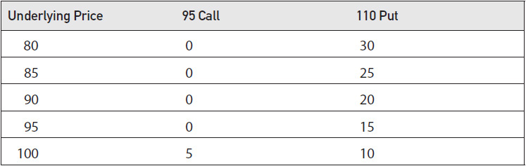

<!-- source:block 8c535d45344ef5f5 -->

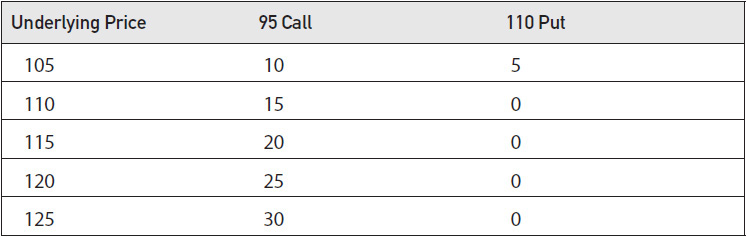

<!-- source:block c812fd79d4aa5905 -->

> [!quote]- English 4
> For the 95 call, if the underlying price at expiration is 95 or below, the call is out of the money and therefore worthless. If, however, the underlying price rises above 95, the 95 call will go into the money, gaining one point in value for each point that the underlying price rises above 95. For the 110 put, if the underlying price is 110 or above, the put is out of the money and therefore worthless. But if the underlying price falls below 110, the 110 put goes into the money, gaining one point in value for each point decline in the underlying price.

对于95 看涨期权，如果到期时的标的价格为95或以下，则该看涨期权为OTM，因此毫无价值。然而，如果标的价格升至95,以上，则95 看涨期权将进入货币，标的价格升至95以上每一个点，价值就会增加一个点。 对于110 看跌期权，如果标的价格为110或以上，则看跌期权为OTM，因此毫无价值。但如果标的价格跌破110,，则110投入资金，标的价格每下降一点，价值就会增加一个点。

<!-- source:block 9097af0c7ba7670f -->

## 平价图 / Parity Graphs

<!-- source:block 2b4a082c9cd49d6e -->

> [!quote]- English 5
> For someone who has bought an option, the intrinsic value represents a credit, or positive value. The buyer of the option will be able to buy low and sell high. For someone who has sold an option, the intrinsic value represents a debit, or negative value. The seller of the option will be forced to buy high and sell low. We can use an option’s intrinsic value to draw a graph of the value of an option position at expiration as a function of the price of the underlying contract. Figure 4-1 shows such a graph for a long call position. Below the exercise price, the option has no value. Above the exercise price, the option gains one point in value for each point increase in the underlying price.

对于购买期权的人来说，内在价值代表 credit 或正价值。期权的买家将能够低买高卖。对于出售期权的人来说，内在价值代表 debit 或负值。期权的卖家将被迫高买低卖。我们可以使用期权的内在价值来绘制期权头寸到期价值与标的合约价格的函数的图表。图4-1显示了多头看涨头寸的这种图表。低于行权价，期权就没有价值。高于行权价，标的价格每增加一个点，期权价值就会增加一个点。

<!-- source:block 5c8d7882e1d2591f -->

*Figure 4-1 Long call. / Figure 4-1 Long call.*

<!-- source:block d36641eff4709d86 -->

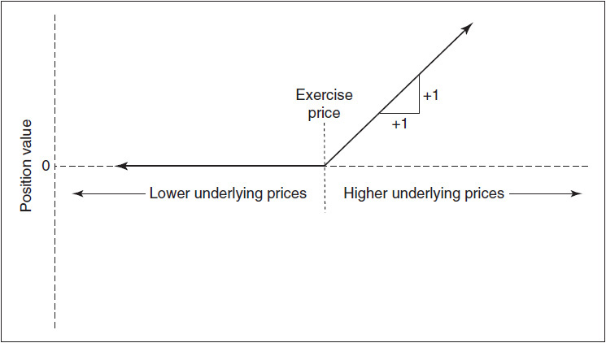

<!-- source:block 64bfaa950e890385 -->

> [!quote]- English 7
> Figure 4-2 shows the value of a short call position at expiration. Now, if the option is in the money, the value of the position is negative. For every point the underlying rises above the exercise price, the position loses one point in value.

图4-2显示了到期时空头看涨期权头寸的值。现在，如果期权价内，那么头寸的价值就是负的。标的每高于行权价一个点，该头寸的价值就会损失一个点。

<!-- source:block 2929494ca7d3de3b -->

*图4-2空头看涨期权。 / Figure 4-2 Short call.*

<!-- source:block 3d2f99b9a016f8ab -->

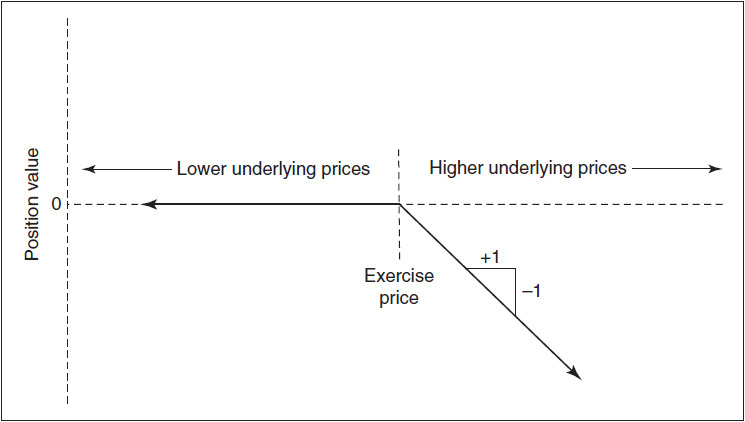

<!-- source:block 3a63fe8d26c1d277 -->

> [!quote]- English 9
> We can create the same type of expiration graphs for long and short put positions, as shown in Figures 4-3 and 4-4. For a long or short put, the value of the position is zero if the underlying price is above the exercise price. For a long put, the position gains one point for each point decline in the underlying price. For a short put, the position loses one point in value for each point decline in the underlying price.

我们可以为多头和空头头寸创建相同类型的到期图，如图4-3和4-4所示。对于多头或空头，如果标的价格高于行权价，则头寸价值为零。对于多头看跌，标的价格每下跌一个点，头寸就会增加一个点。对于做空，标的价格每下跌一点，头寸价值就会损失一个点。

<!-- source:block ec9cb22664177a30 -->

*Figure 4-3 Long put. / Figure 4-3 Long put.*

<!-- source:block 1260646c33c2e586 -->

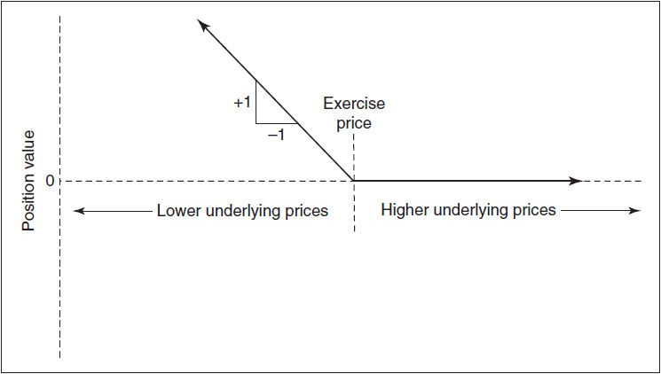

<!-- source:block dbc0d617248c6840 -->

*Figure 4-4 Short put. / Figure 4-4 Short put.*

<!-- source:block dd0d51992123a1be -->

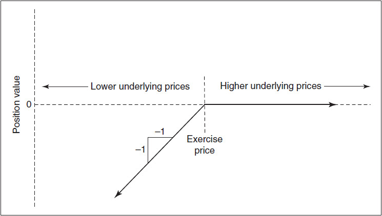

<!-- source:block e770ded79403cbc8 -->

> [!quote]- English 12
> A *parity graph* represents the value of an option position at expiration, *parity* being another name for *intrinsic value*. Because of their shapes, traders sometimes refer to the four basic parity graphs (long and short call and long and short put) as the *hockey-stick diagrams*.

平价图表示期权头寸到期时的价值，平价是内在价值的另一个名称。由于它们的形状，交易者有时将四个基本平价图（多头和空头看涨以及多头和空头看跌）称为键盘棒图。

<!-- source:block 511d7e7475e51db3 -->

> [!quote]- English 13
> The four basic parity graphs highlight one of the most important characteristics of option trading. Buyers of options have limited risk (they can never lose more than the price of the option) and unlimited profit potential. Sellers of options have limited profit potential (they can never make more than the price of the option) and unlimited risk.1

四个基本平价图表凸显了期权交易最重要的特征之一。期权买家的风险有限（他们的损失永远不会超过期权的价格）和无限的利润潜力。期权卖家的利润潜力有限（他们的利润永远不能超过期权的价格）和无限的风险。[^ovp04-1]

<!-- source:block 3807519ffe0eed1e -->

> [!quote]- English 14
> Given the apparently unbalanced risk-reward tradeoff, new option traders tend to have the same reaction: why would anyone do anything other than buy options? The purchase of an option results in a position with limited risk and unlimited profit, which certainly seems more desirable than the limited profit and unlimited risk that result from the sale of an option. Yet, in every option market, there are traders who are willing to sell options. Why are they willing to do this in the face of this apparently unbalanced risk-reward tradeoff? The answer has to do with not just the best and worst that can happen but also with the likelihood of those occurrences. It’s true that someone who sells an option is exposed to unlimited risk, but if the amount received for the option is great enough and the perceived risk is low enough, a trader might be willing to take that risk. In later chapters we will see the very important role probability plays in option pricing.

鉴于明显不平衡的风险回报权衡，新的期权交易员往往会有同样的反应：为什么有人会做除了购买期权之外的任何事情？购买期权会导致风险有限和利润无限的头寸，这显然比出售期权产生的有限利润和无限的风险更可取。然而，在每个期权市场中，都有交易者愿意出售期权。面对这种明显不平衡的风险回报权衡，为什么他们愿意这样做？答案不仅与可能发生的最好和最坏情况有关，还与这些发生的可能性有关。出售期权的人确实面临无限的风险，但如果期权收到的金额足够大并且感知的风险足够低，交易员可能愿意承担这种风险。在后面的章节中，我们将看到概率在期权定价中所扮演的非常重要的角色。

<!-- source:block 370042ac8b70800a -->

### 斜率 / Slope

<!-- source:block cdadf40b2f8f9c4a -->

> [!quote]- English 15
> From the parity graphs, we can see that if an option is out of the money, its value is unaffected by changes in the price of the underlying contract. If the option is in the money, it will either gain or lose value as the underlying price changes.

从平价图中可以看出，如果期权是OTM，其价值不受标的合约价格变化的影响。如果期权是ITM，则随着标的价格的变化，它要么增值，要么贬值。

<!-- source:block 44aef6ecbb7c43c0 -->

> [!quote]- English 16
> The slope of the graph is the change in value of the option position with respect to changes in the price of the underlying contract, often expressed as a fraction

图表的斜率是期权头寸价值相对于标的合约价格变化的变化，通常表示为分数

<!-- source:block 4ef9227ac9c6f57e -->

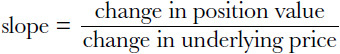

<!-- 原 EPUB 中此公式为图片，已原样保留 -->

<!-- source:block a932e399775bc214 -->

> [!quote]- English 17
> We can summarize the slopes of the basic positions as follows:

我们可以将基本头寸的斜率总结如下：

<!-- source:block bd127bc32f847dda -->

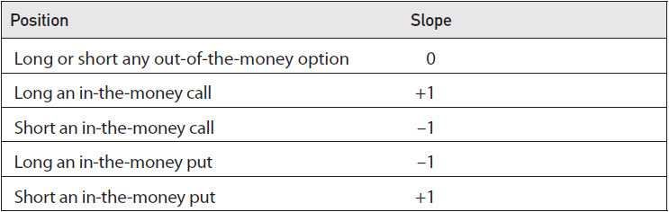

<!-- source:block f752661f7e0f05c3 -->

> [!quote]- English 18
> In addition to parity graphs for individual options, we can also create parity graphs for positions consisting of multiple options by adding up the slopes of the individual options. Figure 4-5 is the parity graph of a position consisting of a long call and long put at the same exercise price. We can calculate the total slopes as follows:

除了单个期权的平价图表外，我们还可以通过将单个期权的斜率相加来为由多个期权组成的头寸创建平价图表。图4-5是相同行权价下由多头看涨和多头看跌组成的头寸的平价图。我们可以计算总斜率如下：

<!-- source:block daae026c4fb777a0 -->

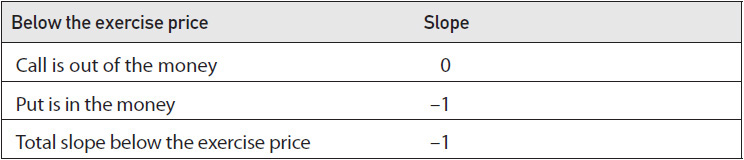

<!-- source:block 56e8fc38e9d78f74 -->

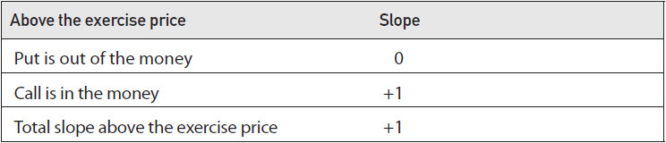

<!-- source:block 450022bd58e0d9ee -->

*图4-5（a）相同行权价的多头看涨和多头看跌。(b)组合头寸。 / Figure 4-5 (*a*) Long call and long put at the same exercise price. (*b*) Combined position.*

<!-- source:block f78cf416d2aa0e76 -->

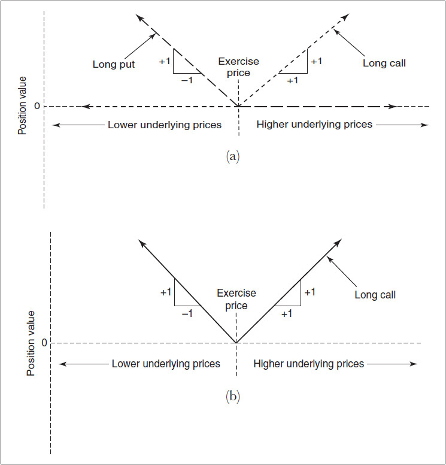

<!-- source:block 36085e9d2257492f -->

> [!quote]- English 20
> The combined position will gain value if the underlying price moves in either direction away from the exercise price. The position is typical of many option strategies that may be sensitive to the magnitude of movement in the underlying contract rather than the direction of movement.

如果标的价格向任何一个方向远离行权价，合并头寸将增值。该头寸是许多期权策略的典型特征，这些策略可能对标的合约的变动幅度而不是变动方向敏感。

<!-- source:block 93e44aaa9820fcbb -->

> [!quote]- English 21
> Many option strategies involve combining options with the underlying contract, so we will also want to consider the slope of an underlying position. As shown in Figure 4-6, the slope of a long underlying position is always +1, and the slope of a short underlying position is always –1. The slopes are constant regardless of the underlying price. This is an important distinction between an option position and an underlying position. Because of the insurance feature of an option, the parity graph of an option position will always bend at the exercise price.

许多期权策略涉及将期权与标的合约相结合，因此我们还需要考虑标的头寸的斜率。如图4-6所示，多头标的头寸的斜率始终为+1，空头标的头寸的斜率始终为-1。无论基本价格如何，斜率都是恒定的。这是期权头寸和标的头寸之间的重要区别。由于期权的保险特征，期权头寸的平价图表将始终在行权价处弯曲。

<!-- source:block c3449d755082a294 -->

*图4-6多头和空头标的头寸 / Figure 4-6 Long and short underlying position.*

<!-- source:block fb0c5502cfcd4e89 -->

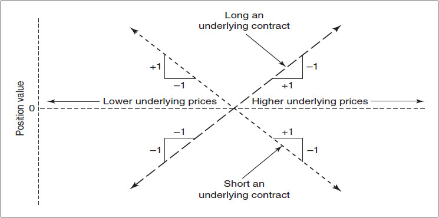

<!-- source:block 3726d9a80ddc8c91 -->

> [!quote]- English 23
> Figure 4-7 shows the parity graph of a position that combines two long call options at the same exercise price and with a short underlying contract. Below the exercise price, the total slope is –1 (0 for the out-of-the-money calls, –1 for the short underlying). Above the exercise price, the total slope is +1 (+2 for the in-the-money calls, –1 for the short underlying contract). This parity graph is identical to the position in Figure 4-5, which must mean that the same option strategy can be constructed in more than one way. This is an important characteristic of options that we will look at in more detail in Chapter 14. Note also that the location of the underlying position is irrelevant to the parity graph. Regardless of the price of the underlying, the slope is always either +1 for a long underlying position or –1 for a short underlying position.

图4-7显示了一个头寸的平价图，该头寸组合了两个相同行权价的多头看涨期权，并与一个空头标的合约相结合。低于行权价，总斜率为-1（0代表价外看涨期权，-1代表卖空标的）。高于行权价，总斜率为+1（价内看涨期权为+2，空头标的合约为-1）。该平价图与图4-5中的头寸相同，这一定意味着相同的期权策略可以以多种方式构建。这是期权的一个重要特征，我们将在第14章中更详细地讨论。另请注意，标的头寸的头寸与平价图无关。无论标的价格如何，对于多头标的头寸，斜率始终为+1，对于空头标的头寸，斜率始终为-1。

<!-- source:block a23d89e01a4ba739 -->

*图4-7（a）做多两个看涨期权，做空一个标的合约(b)组合头寸。 / Figure 4-7 (*a*) Long two calls and short an underlying contract. (*b*) Combined position.*

<!-- source:block 2f52c147216b704a -->

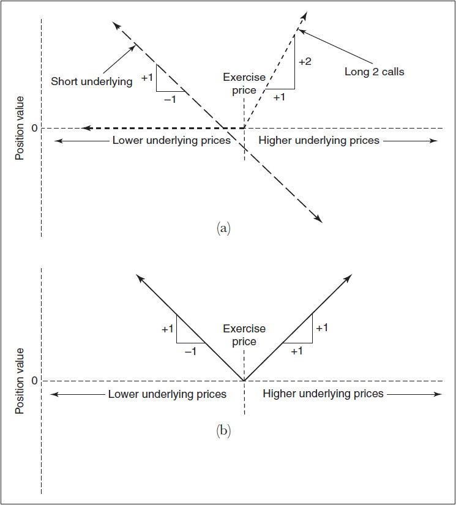

<!-- source:block ee5271677ccb70a8 -->

> [!quote]- English 25
> Figure 4-8 is the parity graph of a long call and short put at the same exercise price. Below the exercise price, the total slope is +1 (0 for the long out-of-the-money call, +1 for the short in-the-money put). Above the exercise price, the total slope is also +1 (+1 for the in-the-money call, 0 for the out-of-the-money put). The slope of the entire position is always +1, exactly the same as a long underlying contract.

图4-8是在相同的行权价下，多头看涨期权和空头看跌期权的平价图。低于行权价时，总斜率为+1（0表示价外看涨期权，+1表示价内看跌期权）。在行权价之上，总斜率也是+1（价内看涨期权为+1，价外看跌期权为0）。整个头寸的斜率始终为+1，与多头标的合约完全相同。

<!-- source:block bb756dae61597ce4 -->

*Figure 4-8 (*a*) Long call and short put at the same exercise price. (*b*) Combined position. / Figure 4-8 (*a*) Long call and short put at the same exercise price. (*b*) Combined position.*

<!-- source:block 2c85f7ef11fd43a9 -->

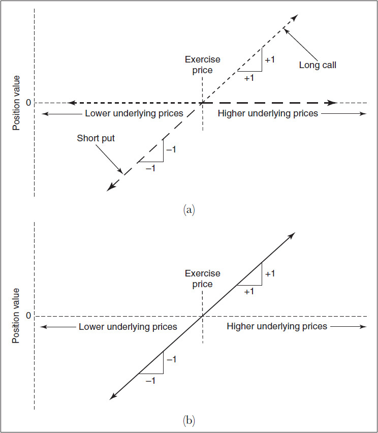

<!-- source:block 9b03ff2f3fe22a43 -->

> [!quote]- English 27
> If a position consists of many different contracts, including underlying contracts and calls and puts over a wide range of exercise prices, the parity graph for the position may be quite complex. But the procedure for constructing the graph is always the same: determine the slopes of the graph below the lowest exercise price, above the highest exercise price, and between all the intermediate exercise prices, and then connect all the line segments.

如果一个头寸由许多不同的合约组成，包括标的合约以及广泛的行权价上的看涨和看跌，那么该头寸的平价图表可能相当复杂。但构建图表的过程始终是相同的：确定最低行权价以下、最高行权价以上以及所有中间行权价之间的图表的斜率，然后连接所有直线段。

<!-- source:block b89868cddcaec7ed -->

> [!quote]- English 28
> Consider this position:

考虑这个头寸：

<!-- source:block d09a289ef8146878 -->

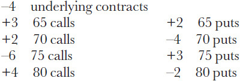

<!-- source:block 534e9bdd4255a558 -->

> [!quote]- English 29
> What should the parity graph look like?

平价图应该是什么样子？

<!-- source:block dffb51f0c320d694 -->

> [!quote]- English 30
> To determine the slopes of a complex position, it may be helpful to construct a table showing the slopes of the individual contracts over all intervals. We can then add up the individual slopes to get the total slope over each interval.

为了确定复杂头寸的斜率，构建一个显示各个合约在所有间隔内的斜率的表格可能会有所帮助。然后，我们可以将各个斜率相加，以获得每个区间的总斜率。

<!-- source:block 471c1226004f5ff5 -->

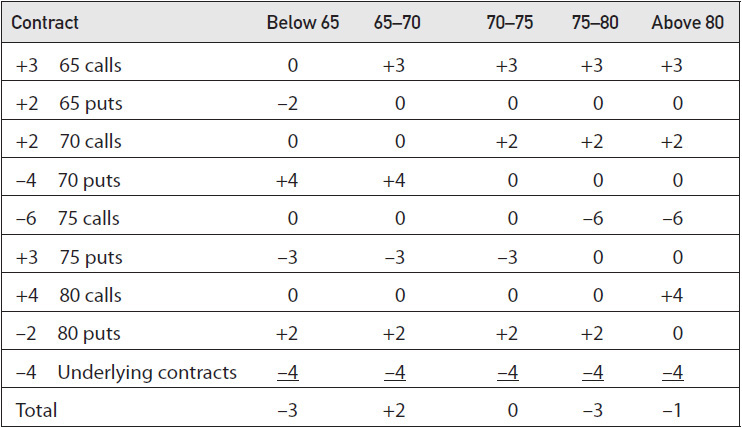

<!-- source:block 1f548e8e6c35af84 -->

> [!quote]- English 31
> The entire parity graph is shown in Figure 4-9. Note that for this graph there is no *y*-axis. For complex graphs where options are bought and sold at many different exercise prices, it may not be possible to position the graph along the *y*-axis. Nevertheless, the parity graph tells us something about the characteristics of the position. Here we can see that the potential profit on the downside, as well as the potential loss on the upside, is unlimited.

整个平价图如图4-9所示。请注意，对于该图表来说没有y轴。对于期权以许多不同的行权价买卖的复杂图表，可能无法沿着y轴定位图表。然而，平价图告诉我们有关头寸特征的一些信息。在这里我们可以看到，下行的潜在利润和上行的潜在损失都是无限的。

<!-- source:block 5e214f8ee986a5cb -->

*图4-9 / Figure 4-9*

<!-- source:block fb7414f218b56723 -->

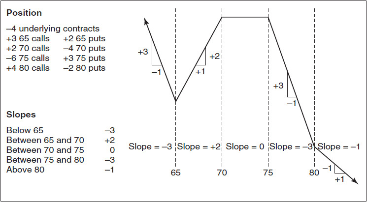

<!-- source:block b08fd9069d281be8 -->

### 到期损益 / Expiration Profit and Loss

<!-- source:block 5a407ae70f070177 -->

> [!quote]- English 33
> A parity graph may tell us the characteristics of an option position at expiration, but an equally important consideration will be the profit or loss that results from the position. Whether the position makes or loses money will depend on the prices at which the contracts are bought and sold. The purchase of options will create a debit, whereas the sale of options will create a credit. For a simple option position, the expiration profit and loss (P&L) graph will be the parity graph shifted downward by the amount of any debit or upward by the amount of any credit.

平价图可能会告诉我们期权头寸到期时的特征，但同样重要的考虑因素是头寸产生的损益。头寸是赚钱还是赔钱将取决于合约买卖的价格。购买期权将产生 debit，而出售期权将产生 credit。对于简单的期权头寸，到期损益（P & L）图表将是向下移动任何 debit 金额或向上移动任何 credit 金额的平价图表。

<!-- source:block 00a64505ed1e88dc -->

> [!quote]- English 34
> Consider the following option prices with the underlying contract trading at a price of 98.00:

考虑以下期权价格，标的合约交易价格为98.00：

<!-- source:block c8dd8868dc41df19 -->

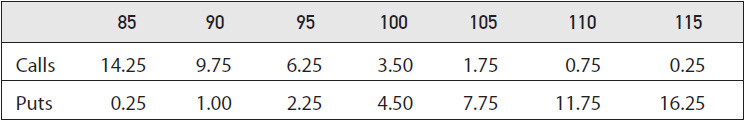

<!-- source:block 1e4b0ef3cf62ba8c -->

> [!quote]- English 35
> Figure 4-10 shows the parity graph of a long 100 call position. If the option is purchased at a price of 3.50, we can construct the expiration P&L graph by shifting the entire parity graph down by this amount. If the underlying is anywhere below 100 at expiration, the option will be worthless, and the position will lose 3.50. With the underlying above 100, the slope of the graph is +1; the option will gain one point in value for each point increase in the price of the underlying. We can also see that there is a *breakeven price* at which the option position will be worth exactly 3.50. Logically, this must occur at an underlying price of 103.50.

图 4-10 展示了 `long 100 call` 头寸的平价图。若以 3.50 买入该期权，可以将整条平价图向下平移相同幅度，从而得到到期损益图。到期时，若标的价格低于 100，期权将毫无价值，头寸亏损 3.50；若标的价格高于 100，图线斜率为 $+1$，标的价格每上涨一点，期权价值便增加一点。图中还存在一个使该期权头寸价值恰好为 3.50 的盈亏平衡价格；由此可知，盈亏平衡点对应的标的价格必为 103.50。

<!-- source:block a07a967718948c7d -->

*图4-10以3.50的价格做多100看涨。 / Figure 4-10 Long a 100 call at a price of 3.50.*

<!-- source:block 83a2f7ef1943847d -->

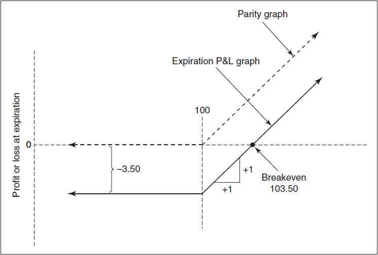

<!-- source:block 1b0a154fea0fdc31 -->

> [!quote]- English 37
> Figure 4-11 shows the parity graph of a short 95 put position. If the option is sold at a price of 2.25, we can construct the expiration P&L graph by shifting the entire graph up by this amount. With an underlying price anywhere above 95 at expiration, the option will be worthless, and the position will show a profit of 2.25. With an underlying price below 95, the slope of the graph is +1; the position will lose one point for each point decline in the price of the underlying. The breakeven price for the position is 92.75, the price at which the 95 put will be worth exactly 2.25.

图 4-11 展示了 `short 95 put` 头寸的平价图。若以 2.25 卖出该期权，可以将整条平价图向上平移相同幅度，从而得到到期损益图。到期时，若标的价格高于 95，期权将毫无价值，头寸盈利 2.25；若标的价格低于 95，图线斜率为 $+1$，标的价格每下跌一点，头寸便亏损一点。该头寸的盈亏平衡价为 92.75，此时 95 put 的价值恰好为 2.25。

<!-- source:block 018dd3ba7e0ec34c -->

*图4-11以2.25的价格做空95看跌期权。 / Figure 4-11 Short a 95 put at a price of 2.25.*

<!-- source:block 3d172468701e6bb7 -->

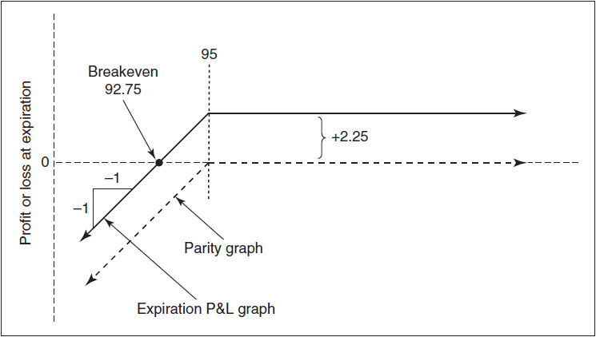

<!-- source:block 5f58921a54e146d2 -->

> [!quote]- English 39
> The relative expiration value of long option positions at different exercise prices—95, 100, and 105—is shown in Figure 4-12. The same relative value for long put positions is shown in Figure 4-13. Calls with lower exercise prices have greater values (i.e., they enable the holder to buy at a lower price), whereas puts with higher exercise prices have greater values (i.e., they enable the holder to sell at a higher price).

不同行权价（95、100和105）下的多头期权头寸的相对到期价值如图4-12所示。图4-13显示了多头头寸的相同相对值。行权价较低的看涨具有更大的价值（即，它们使持有者能够以较低的价格购买），而具有较高行权价的看跌期权具有更大的价值（即，它们使持有者能够以更高的价格出售）。

<!-- source:block fa0a878837b91c2e -->

*图 4-12：`long a 95 call`，价格 6.25；`long a 100 call`，价格 3.50；`long a 105 call`，价格 1.75。 / Figure 4-12 Long a 95 call –6.25; long a 100 call –3.50; long a 105 call –1.75.*

<!-- source:block 6ab215907347938e -->

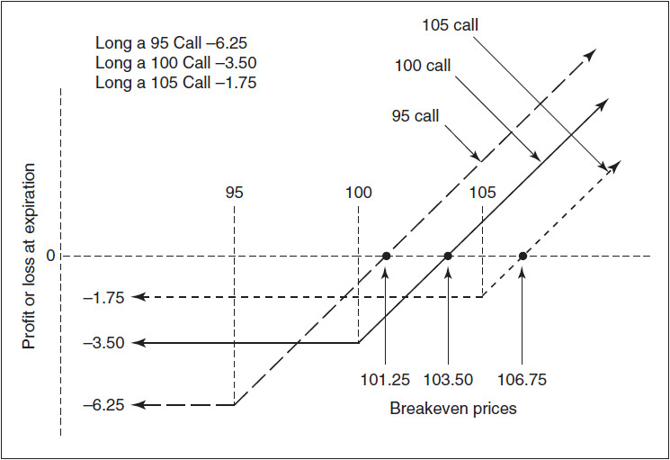

<!-- source:block e9ecb82e89e8ab79 -->

*图 4-13：`long a 95 put`，价格 2.25；`long a 100 put`，价格 4.50；`long a 105 put`，价格 7.75。 / Figure 4-13 Long a 95 put –2.25; long a 100 put –4.50; long a 105 put –7.75.*

<!-- source:block ba9081194b4d93ba -->

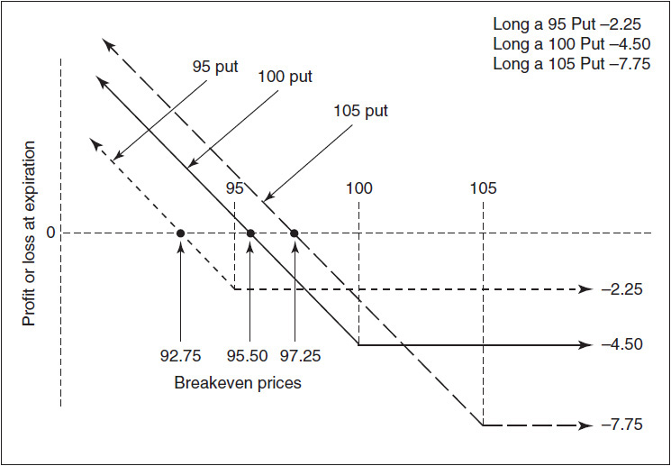

<!-- source:block f256e5b91ef1ba0b -->

> [!quote]- English 42
> For more complex positions, it may not be immediately clear whether the position will result in a credit or debit. In this case, we can construct an expiration P&L graph by first determining the slopes of the graph over all the intervals. Then we can calculate the P&L at one point, and from this one P&L point, we can use the slopes to determine the P&L at all other points.

对于较复杂的头寸，建仓究竟会产生 `credit` 还是 `debit`，可能无法一眼看出。此时可以先确定图线在所有区间内的斜率，据此构造到期损益图；然后计算其中一个点的损益，再利用各区间斜率推导其他所有点的损益。

<!-- source:block 0e91a334cc05ab15 -->

> [!quote]- English 43
> Consider the following position

考虑以下头寸

<!-- source:block ee33081072371c9a -->

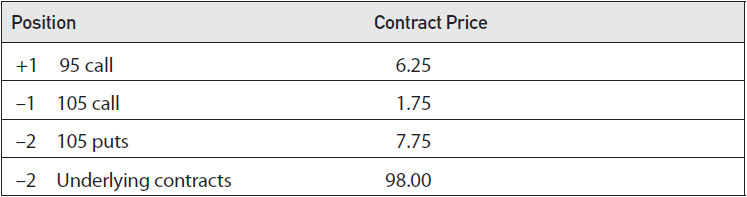

<!-- source:block e6d9aa6a949c348a -->

> [!quote]- English 44
> The slopes of the position are

该头寸的斜率为

<!-- source:block 3148ed1be593e1ee -->

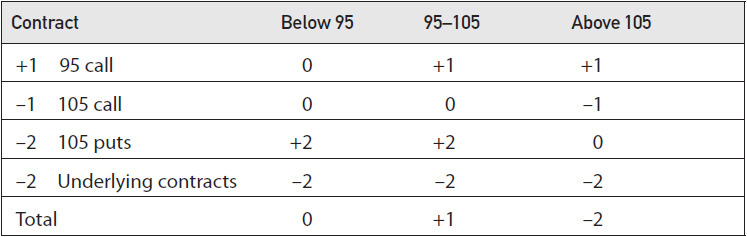

<!-- source:block 183465f3b2079d62 -->

> [!quote]- English 45
> It is usually easiest to determine the P&L at an exercise price, so let’s use 95. The P&L at an underlying price of 95 is

通常最容易确定行权价的损益，所以让我们使用95。标的价格为95的损益为

<!-- source:block 446de11fd8faf5c3 -->

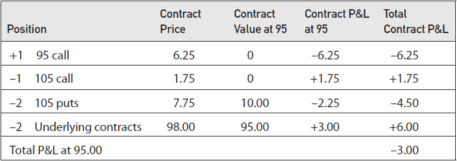

<!-- source:block 220fac2fadd2e810 -->

> [!quote]- English 46
> Figure 4-14 shows the entire expiration P&L graph for the position. Below 95, the slope of the graph is 0, so the P&L is always –3.00. Between 95 and 105, the slope is +1, so the P&L at 105 (10 points higher) is –3.00 + 10.00 = +7.00. Above 105, the slope is –2, with the position losing two points for each point increase in the price of the underlying.

图4-14显示了该头寸的整个到期损益图。低于95，图表的斜率为0，因此损益始终为-3.00。在95和105之间，斜率为+1，因此105（高出10个百分点）时的损益为-3.00 + 10.00 =+7.00。105以上，斜率为-2，标的价格每增加一个点，头寸就会损失两个点。

<!-- source:block 572e1f8199b6cc20 -->

*图4-14 / Figure 4-14*

<!-- source:block ecf181bbeea8c40f -->

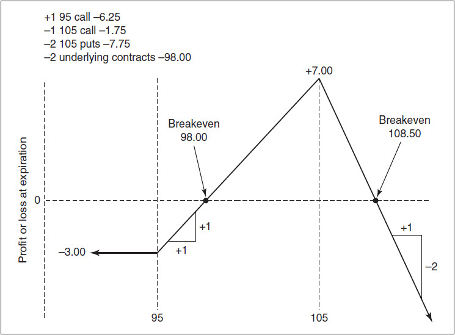

<!-- source:block e17f09a7c6b4e0b6 -->

> [!quote]- English 48
> The position has two breakeven prices, one between 95 and 105 and one above 105. With a P&L of –3.00 at 95 and a slope of +1 between 95 and 105, the first breakeven is

该头寸有两种盈亏平衡价格，一种在95至105之间，另一种在105以上。95时的损益为-3.00，95至105之间的斜率为+1，第一个盈亏平衡点是

<!-- source:block 2093761e8d5fc2e3 -->

> [!quote]- English 49
> 95.00 + (3.00/1) = 98.00

$$
95.00 + (3.00/1) = 98.00
$$

<!-- source:block 823c0ba30dfbc193 -->

> [!quote]- English 50
> With a P&L of +7.00 at 105 and a slope above 105 of –2, the second breakeven is

105时的损益为+7.00，斜率高于-2的105，第二个盈亏平衡点是

<!-- source:block b349243f37c547d1 -->

> [!quote]- English 51
> 105.00 + (7.00/2) = 108.50

$$
105.00 + (7.00/2) = 108.50
$$

<!-- source:block 95e008febf5db9b3 -->

> [!quote]- English 52
> Finally, let’s go back to the parity-graph position shown in Figure 4-9. Suppose that we are told that at expiration with an underlying price of 62.00 the position will show a profit of 2.10. What will be the P&L at expiration if the underlying price is 81.50? Using the slopes, we can work our way from 62.00 to 81.50

最后，让我们回到图4-9中所示的平价图头寸。假设我们被告知，在标的价格为62.00的到期时，该头寸将显示2.10的利润。如果标的价格为81.50，到期时的损益是多少？使用斜率，我们可以从62.00工作到81.50

<!-- source:block 9962459f2ba89b00 -->

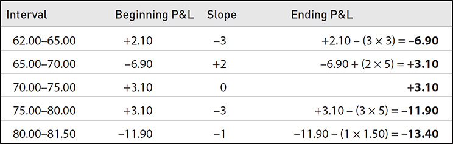

<!-- source:block 5f81042d2e1d74b1 -->

> [!quote]- English 53
> At an underlying price of 81.50, the position will show a loss of 13.40. We can also see that there are three breakeven prices for the position:

在标的价格为81.50时，该头寸将显示损失13.40。我们还可以看到该头寸有三种盈亏平衡价格：

<!-- source:block e0cf56965f2e2c6c -->

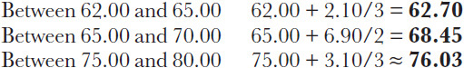

<!-- source:block 037b9c0ff0349503 -->

> [!quote]- English 54
> All critical points for the position are shown in Figure 4-15.

该头寸的所有临界点如图4-15所示。

<!-- source:block edeee3451f13ea0e -->

*图4-15 / Figure 4-15*

<!-- source:block bd54d7f967354288 -->

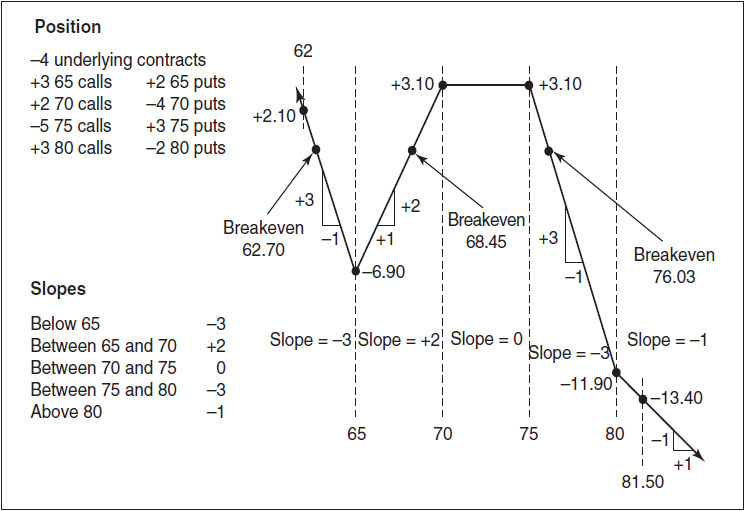

<!-- source:block fadbbc272b340dbe -->

> [!note] Footnote 56
> 1 Admittedly, in traditional stock and commodity markets, a put does not represent unlimited profit potential to the buyer nor unlimited risk to the seller because the underlying contract cannot fall below zero. But for practical purposes most traders think of both calls and puts as having unlimited potential value.

[^ovp04-1]: 不可否认，在传统的股票和大宗商品市场中，看跌期权并不代表买方无限的潜在利润，也不代表卖方无限的风险，因为标的合约不能跌破零。但出于实际目的，大多数交易员认为看涨和看跌都具有无限的潜在价值。

---

[[阅读导航|← 返回阅读导航]]

<!-- chapter-nav:start -->
> [!tip] 章节导航（章末）
> [[合约规格与期权术语 Contract Specifications and Option Terminology|← 上一章]] · [[阅读导航|全书导航]] · [[理论定价模型 Theoretical Pricing Models|下一章 →]]
<!-- chapter-nav:end -->
