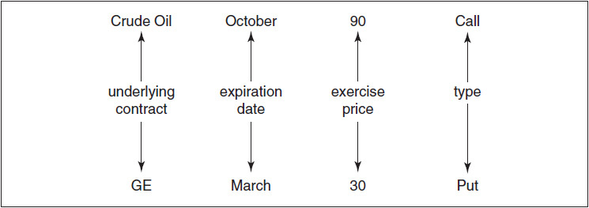
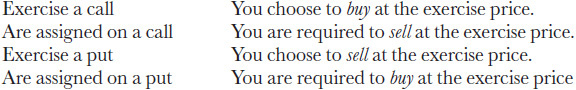
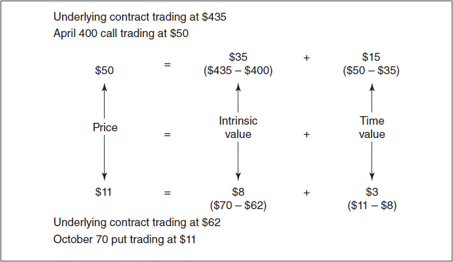
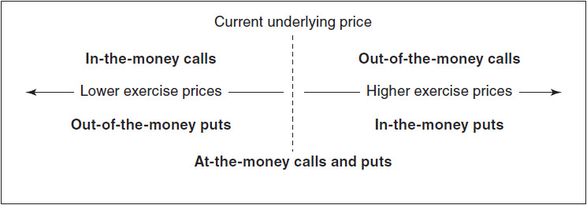

# 第3章 合约规格与期权术语 / Contract Specifications and Option Terminology

[[阅读导航|← 返回阅读导航]] · [[翻译说明与术语表|术语表]]

> [!warning] 翻译状态
> 本章为机器初译，并使用本地术语表校验。英文原文、数字、公式和图表用于核对；中文将在后续复核中继续修订。

<!-- chapter-toc:start -->
## 本章目录 / Chapter Outline

> [!abstract] 结构导航
> 以下标题按原书顺序保留；点击可直接跳转。

- [[#合约规格 / Contract Specifications|合约规格 / Contract Specifications]]
  - [[#类型 / Type|类型 / Type]]
  - [[#标的资产 / Underlying|标的资产 / Underlying]]
  - [[#到期日 / Expiration Date or Expiry|到期日 / Expiration Date or Expiry]]
  - [[#行权价 / Exercise Price or Strike Price|行权价 / Exercise Price or Strike Price]]
  - [[#行权与指派 / Exercise and Assignment|行权与指派 / Exercise and Assignment]]
  - [[#以实物标的结算 / Settlement into the Physical Underlying|以实物标的结算 / Settlement into the Physical Underlying]]
  - [[#结算为期货头寸 / Settlement into a Futures Position|结算为期货头寸 / Settlement into a Futures Position]]
  - [[#现金结算 / Settlement into Cash|现金结算 / Settlement into Cash]]
  - [[#行权方式 / Exercise Style|行权方式 / Exercise Style]]
- [[#期权价格的组成 / Option Price Components|期权价格的组成 / Option Price Components]]
  - [[#价内、平值与价外 / In the Money, At the Money, and Out of the Money|价内、平值与价外 / In the Money, At the Money, and Out of the Money]]
  - [[#自动行权 / Automatic Exercise|自动行权 / Automatic Exercise]]
  - [[#期权保证金制度 / Option Margining|期权保证金制度 / Option Margining]]
<!-- chapter-toc:end -->
<!-- chapter-nav:start -->
> [!tip] 章节导航（章首）
> [[远期定价 Forward Pricing|← 上一章]] · [[阅读导航|全书导航]] · [[到期盈亏 Expiration Profit and Loss|下一章 →]]
<!-- chapter-nav:end -->
<!-- source:block 1a4dde2b049c1be8 -->

> [!quote]- English 1
> Every option market brings together traders and investors with different expectations and goals. Some enter the market with an opinion on which direction prices will move. Some intend to use options to protect existing positions against adverse price movement. Some hope to take advantage of price discrepancies between similar or related products. Some act as middlemen, buying and selling as an accommodation to other market participants and hoping to profit from the difference between the bid price and ask price.

每个期权市场都将具有不同期望和目标的交易员和投资者聚集在一起。一些人进入市场时对价格将走向有看法。一些人打算使用期权来保护现有头寸免受不利价格变动的影响。一些人希望利用类似或相关产品之间的价格差异。有些人充当中间人，买卖作为其他市场参与者的妥协，并希望从买入价和卖出价之间的差价中获利。

<!-- source:block 717e4efede949302 -->

> [!quote]- English 2
> Even though expectations and goals differ, every trader’s education must include an understanding of option contract specifications and a mastery of the terminology used in option markets. Without a clear understanding of the terms of an option contract and the rights and responsibilities under that contract, a trader cannot hope to make the best use of options, nor will he be prepared for the very real risks of trading. Without a facility in the language of options, a trader will find it impossible to communicate his desire to buy or sell in the marketplace.

尽管期望和目标不同，但每个交易者的教育都必须包括对期权合约规范的理解和对期权市场中使用的术语的掌握。如果不清楚地了解期权合约的条款以及该合约下的权利和责任，交易者就无法希望充分利用期权，也无法为交易的真正风险做好准备。如果没有期权语言的设施，交易者将发现不可能在市场上表达他购买或出售的愿望。

<!-- source:block cefd9ac0e5fc346f -->

## 合约规格 / Contract Specifications

<!-- source:block f931abb21da5c3e1 -->

> [!quote]- English 3
> There are several aspects to contract specifications.

合约规格有几个方面。

<!-- source:block 1e2ce89caa34aec9 -->

### 类型 / Type

<!-- source:block 36465e76baf2c55b -->

> [!quote]- English 4
> In Chapter 1, we introduced the two types of options. A *call option* is the right to buy or take a long position in an asset at a fixed price on or before a specified date. A *put option* is the right to sell or take a short position in an asset.

在第一章中，我们介绍了这两种类型的期权。看涨期权是在指定日期或之前以固定价格购买或持有资产多头头寸的权利。看跌期权是出售或卖空资产的权利。

<!-- source:block 46428a41c69ddf28 -->

> [!quote]- English 5
> Note the difference between an option and a futures contract. A futures contract requires delivery at a fixed price. The buyer and seller of a futures contract both have clearly defined obligations that they must meet. The seller must make delivery, and the buyer must take delivery. The buyer of an option, however, has a choice. He can choose to take delivery (a call) or make delivery (a put). If the buyer of an option chooses to either make or take delivery, the seller of the option is obligated to take the other side. In option trading, all rights lie with the buyer and all obligations with the seller.

请注意期权与期货合约的区别。期货合约要求按固定价格交割；买卖双方都负有明确的履约义务：卖方必须交付标的，买方必须接受标的。期权买方则拥有选择权：看涨期权买方可选择接受标的，看跌期权买方可选择交付标的。期权买方一旦选择交付或接受标的，期权卖方必须承担对应的另一边义务。在期权交易中，权利归买方，义务归卖方。

<!-- source:block c0810e7dffba9870 -->

### 标的资产 / Underlying

<!-- source:block e98e08ea150ee880 -->

> [!quote]- English 6
> The *underlying asset* or, more simply, the *underlying* is the security or commodity to be bought or sold under the terms of the option contract. If an option is purchased directly from a bank or other dealer, the quantity of the underlying can be tailored to meet the buyer’s individual requirements. If the option is purchased on an exchange, the quantity of the underlying is set by the exchange. On stock option exchanges, the underlying is typically 100 shares of stock.1 The owner of a call has the right to buy 100 shares; the owner of a put has the right to sell 100 shares. If, however, the price of an underlying stock is either very low or very high, an exchange may adjust the number of shares in the underlying contract in order to create a contract size that is deemed reasonable for trading on the exchange.2

标的资产，或者更简单地说，标的资产是根据期权合约条款购买或出售的证券或商品。如果期权是直接从银行或其他交易商处购买的，标的物的数量可以根据买方的个人要求进行调整。如果期权是在交易所购买的，则标的物的数量由交易所设定。在股票期权交易所，标的通常是100股股票。看涨期权的持有者有权购买100股股票;看跌期权的持有者有权出售100股股票。然而，如果标的股票的价格非常低或非常高，交易所可能会调整标的合约中的股票数量，以创建被认为适合在交易所交易的合约规模。[^ovp03-2] [^ovp03-1]

<!-- source:block e347576576b5c570 -->

> [!quote]- English 7
> On all futures options exchanges, the underlying is uniformly one futures contract. The owner of a call has the right to buy one futures contract; the owner of a put has the right to sell one futures contract. Most often, the underlying for an option on a futures contract is the futures month that corresponds to the expiration month of the option. The underlying for an April futures option is an April futures contract; the underlying for a November futures option is a November futures contract. However, an exchange may also choose to list *serial options* on futures—option expirations where there is no corresponding futures month. When a futures option has no corresponding futures month, the underlying contract is the nearest futures contract beyond expiration of the option.

在所有期货期权交易所上，标的统一为一份期货合约。看涨期权所有者有权购买一份期货合约;看跌期权所有者有权出售一份期货合约。大多数情况下，期货合约期权的标的是与期权到期月份相对应的期货月份。四月期货期权的标的是四月期货合约;十一月期货期权的标的是十一月期货合约。然而，在没有相应期货月份的情况下，交易所也可以选择在期货期权互换上列出连续期权。当期货期权没有相应的期货月份时，标的合约是期权到期后最近的期货合约。

<!-- source:block 538da0dc629a83bf -->

> [!quote]- English 8
> For example, many financial futures are listed on a quarterly cycle, with trading in March, June, September, and December futures. The underlying for a March option is a March futures contract; the underlying for a June option is a June futures contract. If there are also serial options, then

例如，许多金融期货以季度周期上市，交易方式为3月、6月、9月和12月期货。三月期权的标的是三月期货合约;六月期权的标的是六月期货合约。如果还有序列期权，那么

<!-- source:block fc801873b681ed29 -->

> [!quote]- English 9
> The underlying for a January or February option is a March futures contract.

一月或二月期权的标的是三月期货合约。

<!-- source:block 72fabe7b24d464ca -->

> [!quote]- English 10
> The underlying for an April or May option is a June futures contract.

四月或五月期权的标的是六月期货合约。

<!-- source:block a871aa5a947f68e5 -->

> [!quote]- English 11
> The underlying for a July or August option is a September futures contract.

7月或8月期权的标的是9月期货合约。

<!-- source:block 139247f44987ae38 -->

> [!quote]- English 12
> The underlying for an October or November option is a December futures contract.

10月或11月期权的标的是12月期货合约。

<!-- source:block 361334e720682f9f -->

> [!quote]- English 13
> Some interest-rate futures markets [e.g., Eurodollars at the Chicago Mercantile Exchange, Short Sterling and Euribor at the London International Financial Futures Exchange], in addition to listing long-term options on a long-term futures contract, may also list short-term options on the same long-term futures contract. A March futures contract maturing in two years may be the underlying for a March option expiring in two years. But the same futures contract may also be the underlying for a March option expiring in one year. Short-term options on long-term futures are listed as *midcurve options*. The options can be one-year midcurve (a short-term option on a futures contract with at least one year to maturity), two-year midcurve (a short-term option on a futures contract with at least two years to maturity), or five-year midcurve (a short-term option on a futures contract with at least five years to maturity).

一些利率期货市场[例如，芝加哥商品交易所的欧洲美元、伦敦国际金融期货交易所的空头英镑和Euribor]，除了在长期期货合约上列出长期期权外，还可以在同一长期期货合约上列出短期期权。两年后到期的三月期货合约可能是两年后到期的三月期权的标的。但同一期货合约也可能是一年后到期的三月期权的标的。长期期货上的短期期权被列为中曲线期权。期权可以是一年期中曲线（至少到期一年的期货合约上的短期期权）、两年期中曲线（至少到期两年的期货合约上的短期期权）或五年期中曲线（至少到期五年的期货合约上的短期期权）。

<!-- source:block f420cce737f0c43f -->

### 到期日 / Expiration Date or Expiry

<!-- source:block bc332e5d8e2572ba -->

> [!quote]- English 14
> The expiration date is the date on which the owner of an option must make the final decision whether to buy, in the case of a call, or to sell, in the case of a put. After expiration, all rights and obligations under the option contract cease to exist.

到期日是期权所有者必须做出最终决定的日期，即买入（如果是看涨）或卖出（如果是看跌）的日期。到期后，期权合约项下的所有权利和义务不复存在。

<!-- source:block c2cd04646ca59b73 -->

> [!quote]- English 15
> On many stock option exchanges, the expiration date for stock and stock index options is the third Friday of the expiration month.3 Of more importance to most traders is the *last trading day*, the last business day prior to expiration on which an option can be bought or sold on an exchange. For most stock options, expiration day and the last trading day are the same, the third Friday of the month. However, Good Friday, a legal holiday in many countries, occasionally falls on the third Friday of April. When this occurs, the last trading day is the preceding Thursday.

在许多股票期权交易所，股票和股票指数期权的到期日是到期月份的第三个星期五。[^ovp03-3]对大多数交易员来说更重要的是最后一个交易日，即到期前的最后一个营业日，可以在交易所购买或出售期权。对于大多数股票期权，到期日和最后一个交易日相同，即每月的第三个星期五。然而，许多国家的法定假日耶稣受难日偶尔会出现在四月的第三个星期五。当发生这种情况时，最后一个交易日是前一个星期四。

<!-- source:block 01ebd5dee6658d2a -->

> [!quote]- English 16
> When stock options were introduced in the United States, trading in expiring contracts ended at the close of business on the third Friday of the month. However, many derivative strategies require carrying an offsetting stock position to expiration, at which time the stock position is liquidated. Consequently, stock exchanges found that as the close of trading approached on expiration Friday, they were faced with large orders to buy or sell stock. These large orders often had the effect of disrupting trading or distorting prices at expiration.

当美国推出股票期权时，到期合约的交易在当月第三个星期五下班时结束。然而，许多衍生品策略要求持有抵消股票头寸至到期，届时股票头寸将被清算。因此，证券交易所发现，随着周五到期交易临近收盘，他们面临着大量买入或卖出股票的订单。这些大额订单通常会扰乱交易或扭曲到期价格。

<!-- source:block b03818c0a16d6762 -->

> [!quote]- English 17
> To alleviate the problem of large order imbalances at expiration, some derivative exchanges, working with the stock exchanges on which the underlying stocks were traded, agreed to establish an expiration value for a derivatives contract based on the opening price of the underlying contract rather than the closing price on the last trading day. This *AM expiration* is commonly used for stock index contracts. Options on individual stocks are still subject to the traditional *PM expiration*, where the value of an option is determined by the underlying stock price at the close of trading on the last trading day.

为了缓解到期大单失衡的问题，一些衍生品交易所与标的股票交易所在的证券交易所合作，同意根据标的合约的开盘价格而不是最后一个交易日的收盘价格来确定衍生品合约的到期价值。上午到期通常用于股指合约。个别股票的期权仍然受到传统的PM到期的约束，其中期权的价值由最后一个交易日收盘时的标的股票价格决定。

<!-- source:block c36ba26e8e844f07 -->

> [!quote]- English 18
> Although the expiration date for stock options is relatively uniform, the expiration date for futures options can vary, depending on the underlying commodity or financial instrument. For futures on physical commodities, such as agricultural or energy products, delivery at maturity may take several days. As a consequence, options on futures for physical commodities will often expire several days or even weeks prior to the maturity of the futures contract, most commonly in the month prior to the futures month. An option on a March futures contract will expire in February; an option on a July futures contract will expire in June; an option on a November futures contract will expire in October. A trader will need to consult the exchange calendar to determine the exact expiration date, which is set by each individual exchange.

尽管股票期权的到期日相对统一，但期货期权的到期日可能会有所不同，具体取决于标的商品或金融工具。对于农产品或能源产品等实物商品的期货，到期交割可能需要几天时间。因此，实物商品期货期权通常会在期货合约到期前几天甚至几周到期，最常见的是在期货月的前一个月。3月期货合约的期权将于2月到期; 7月期货合约的期权将于6月到期; 11月期货合约的期权将于10月到期。交易者需要查阅交易所日历以确定确切的到期日期，该日期由每个交易所设定。

<!-- source:block fa266585ffdf893d -->

### 行权价 / Exercise Price or Strike Price

<!-- source:block 5e0e789f3788ff25 -->

> [!quote]- English 19
> The exercise or strike price is the price at which the underlying will be delivered should the holder of an option choose to exercise his right to buy or sell. If the option is exercised, the owner of a call will pay the exercise price; the owner of a put will receive the exercise price.

行权价或行权价是期权持有人选择行权其买入或卖出权利时交付标的物的价格。如果期权被行权，看涨期权所有者将支付行权价;看跌期权所有者将收到行权价。

<!-- source:block 6bbb9869edcf77b0 -->

> [!quote]- English 20
> The exercise prices available for trading on an option exchange are set by the exchange, usually at equal intervals and bracketing the current price of the underlying contract. If the price of the underlying contract is 62 when options are introduced, the exchange may set exercise prices of 50, 55, 60, 65, 70, and 75. At a later date, as the price of the underlying moves up or down, the exchange can add additional exercise prices. If the price of the underlying rises to 70, the exchange may add exercise prices of 80, 85, and 90. Additionally, if the exchange feels that it will further facilitate trading, it can introduce intermediate exercise prices—52½, 57½, 62½, 67½.

期权交易所可用于交易的行权价由交易所设定，通常以相等的间隔并将标的合约的当前价格纳入其中。如果推出期权时标的合约的价格为62，则交易所可以将行权价设定为50、55、60、65、70和75。稍后，随着标的价格的上涨或下跌，交易所可以添加额外的行权价。如果标的价格升至70，交易所可能会增加80、85和90的行权价。此外，如果交易所认为将进一步促进交易，它可以引入中间行权价-52½、57½、62½、67½。

<!-- source:block edf034cf3130c73b -->

> [!quote]- English 21
> As an example of an exchange-traded option, the buyer of a crude oil October 90 call on the New York Mercantile Exchange has the right to take a long position in one October crude oil futures contract for 1,000 barrels of crude oil (the underlying) at a price of \$90 per barrel (the exercise price) on or before the October expiration (the expiration date). The buyer of a General Electric March 30 put on the Chicago Board Options Exchange has the right to take a short position in 100 shares of General Electric stock (the underlying) at a price of \$30 per share (the exercise price) on or before March expiration (the expiration date).

以交易所交易期权为例：纽约商业交易所原油 10 月到期、行权价为 90 美元的看涨期权，其买方有权在 10 月到期日或之前，按每桶 90 美元的行权价，建立一份对应 1,000 桶原油（标的）的 10 月原油期货合约多头头寸。芝加哥期权交易所通用电气 3 月到期、行权价为 30 美元的看跌期权，其买方有权在 3 月到期日或之前，按每股 30 美元的行权价，建立 100 股通用电气股票（标的）的空头头寸。

<!-- source:block abaca585ea569d4b -->

> [!quote]- English 22
> Option contract specifications are further outlined in Figure 3-1.

期权合约规范在图3-1中进一步概述。

<!-- source:block d1114c0c9f95c33f -->

*图3-1期权合约规范。 / Figure 3-1 Option contract specifications.*

<!-- source:block a2bf2b1ab0e47611 -->

<!-- source:block 7f38272b3ee5e3b9 -->

### 行权与指派 / Exercise and Assignment

<!-- source:block c5a0cec17020ebec -->

> [!quote]- English 24
> The buyer of a call or a put option has the right to exercise that option prior to its expiration date, thereby converting the option into a long underlying position in the case of a call or a short underlying position in the case of a put. A trader who exercises a crude oil October 90 call has chosen to take a long position in one October crude oil futures contract at \$90 per barrel. A trader who exercises a GE March 30 put has chosen to take a short position in 100 shares of GE stock at \$30 per share. Once an option is exercised, the rights and obligations associated with the option cease to exist, just as if the option had been allowed to expire.

看涨期权或看跌期权的买方有权在到期日前行权：看涨期权行权后转化为标的多头头寸，看跌期权行权后转化为标的空头头寸。交易员若行权原油 10 月到期、行权价为 90 美元的看涨期权，就选择了按每桶 90 美元建立一份 10 月原油期货合约多头头寸；若行权通用电气 3 月到期、行权价为 30 美元的看跌期权，就选择了按每股 30 美元建立 100 股通用电气股票的空头头寸。期权一经行权，该期权所附带的权利与义务即告终止，与让其自然到期的结果相同。

<!-- source:block 0abb8acfa6ab8041 -->

> [!quote]- English 25
> A trader who intends to exercise an option must submit an exercise notice to either the seller of the option, if purchased from a dealer, or to the exchange, if the option was purchased on an exchange. When a valid exercise notice is submitted, the seller of the option has been assigned. Depending on the type of option, the seller will be required to take a long or short position in the underlying contract at the option’s exercise price.

打算行权期权的交易员必须向期权卖方（如果是从交易商购买的）提交行权通知，或者向交易所（如果是在交易所购买的）提交行权通知。当提交有效的行权通知时，期权的卖方就已被指定。根据期权类型，卖方将被要求以期权的行权价在标的合约中持有多头或空头头寸。

<!-- source:block 4cd1b5a7853c4523 -->

> [!quote]- English 26
> Once a contract has been traded on an exchange, the link between buyer and seller is broken, with the exchange becoming the counterparty to all trades. Still, when a trader exercises an option, the exchange must assign someone to either buy or sell the underlying contract at the exercise price. How does the exchange make this decision? The party who is assigned must be someone who has sold the option and has not closed out the position through an offsetting trade. Beyond this, the exchange’s decision on who will be assigned is essentially random, with no trader having either a greater or lesser probability of being assigned.

一旦合约在交易所交易，买家和卖家之间的联系就会被打破，交易所成为所有交易的对手方。尽管如此，当交易员行权期权时，交易所必须指派某人以行权价购买或出售标的合约。交易所如何做出这一决定？被指定的一方必须是已出售期权且尚未通过抵消交易平仓头寸的人。除此之外，交易所关于谁将被分配的决定本质上是随机的，没有交易员被分配的可能性更大或更小。

<!-- source:block ca907c68c9f293c7 -->

> [!quote]- English 27
> New traders sometimes become confused about whether the exercise and assignment result in a long position (buying the underlying contract) or a short position (selling the underlying contract). The following summary may help: if you

新交易者有时会搞不清行权和指派的结果是多头头寸（买入标的合约）还是空头头寸（卖出标的合约）。下面的总结可能会有所帮助：如果你

<!-- source:block c5934f7425add044 -->

<!-- source:block 586044304f1812aa -->

> [!quote]- English 28
> Depending on the underlying contract, when an exchange-traded option is exercised, it can settle into

根据标的合约，当交易所交易期权被行权时，它可以结算为

<!-- source:block fe99346ccecfd201 -->

> [!quote]- English 29
> 1. The physical underlying

1.物理标的

<!-- source:block 08382666d92b0391 -->

> [!quote]- English 30
> 2. A futures position

2.期货头寸

<!-- source:block 4a80f450f4fcaaed -->

> [!quote]- English 31
> 3. Cash

3.现金

<!-- source:block b4d2620e8afb0309 -->

### 以实物标的结算 / Settlement into the Physical Underlying

<!-- source:block 71bc2bcb077f8528 -->

> [!quote]- English 32
> If a call option settles into the physical underlying, the exerciser pays the exercise price and in return receives the underlying. If a put option settles into the physical underlying, the exerciser receives the exercise price and in return must deliver the underlying. Stock options always settle into the physical underlying.

如果看涨期权进入实物标的，则行权者支付行权价并作为回报获得标的。如果看跌期权进入实物标的，行权者将收到行权价，并作为回报，必须交付标的。股票期权总是融入实物标的。

<!-- source:block 928e82b3bca42550 -->

> [!quote]- English 33
> You exercise one January 110 call on stock.

你对一份 1 月到期、行权价为 110 的股票看涨期权行权。

<!-- source:block 5bfb9aff7abefec7 -->

> [!quote]- English 34
> You must pay 100 × \$110 = \$11,000.

$$
\text{You must pay} 100 \times \$110 = \$11{,}000
$$

<!-- source:block 29099587c1d34d69 -->

> [!quote]- English 35
> You receive 100 shares of stock.

您将收到100股股票。

<!-- source:block dbdfeb81a5727367 -->

> [!quote]- English 36
> You are assigned on six April 40 calls on stock.

你被指派履行六份 4 月到期、行权价为 40 的股票看涨期权。

<!-- source:block 1598538e8d161561 -->

> [!quote]- English 37
> You receive 600 × \$40 = \$24,000.

$$
\text{You receive} 600 \times \$40 = \$24{,}000
$$

<!-- source:block 18aed3f8505c971f -->

> [!quote]- English 38
> You must deliver 600 shares of stock.

您必须交付600股股票。

<!-- source:block d5596ea81574913b -->

> [!quote]- English 39
> You exercise two July 60 puts on stock.

你对两份 7 月到期、行权价为 60 的股票看跌期权行权。

<!-- source:block 99e02870304c5831 -->

> [!quote]- English 40
> You receive 200 × \$60 = \$12,000.

$$
\text{You receive} 200 \times \$60 = \$12{,}000
$$

<!-- source:block f5e3ea0d2bfe5f22 -->

> [!quote]- English 41
> You must deliver 200 shares of stock.

你必须交付200股股票。

<!-- source:block 611043c738093c20 -->

> [!quote]- English 42
> You are assigned on three October 95 puts on stock.

你被指派履行三份 10 月到期、行权价为 95 的股票看跌期权。

<!-- source:block ef6a7e0d1e6c278c -->

> [!quote]- English 43
> You must pay 300 × \$95 = \$28,500.

$$
\text{You must pay} 300 \times \$95 = \$28{,}500
$$

<!-- source:block 180d4674afe08db1 -->

> [!quote]- English 44
> You receive 300 shares of stock.

您将收到300股股票。

<!-- source:block 8207be16774c997a -->

> [!quote]- English 45
> Note that the cash flow resulting from settlement into the physical underlying depends only on the exercise price. In our examples, whether the price of the stock at exercise is \$10 or \$1,000, the exerciser of a call pays only the exercise price, not the stock price. The exerciser of a put receives only the exercise price. Of course, the profit or loss resulting from the option trade will depend on both the stock price and the price originally paid for the option. But the cash flow when the option is exercised is independent of these.

请注意，结算到实物标的产生的现金流仅取决于行权价。在我们的例子中，无论股票在行权时的价格是10美元还是1,000美元，看涨期权的行权者只支付行权价，而不是股价。看跌期权的行权者仅获得行权价。当然，期权交易产生的损益将取决于股价和最初为期权支付的价格。但行权期权时的现金流与这些无关。

<!-- source:block 4f471c986910222f -->

### 结算为期货头寸 / Settlement into a Futures Position

<!-- source:block 0c669b497d6873c1 -->

> [!quote]- English 46
> If an option settles into a futures position, it is just as if the exerciser is buying or selling the futures contract at the exercise price. The position is immediately subject to futures-type settlement, requiring a margin deposit and accompanied by a variation payment.

如果期权进入期货头寸，就像行权者以行权价购买或出售期货合约一样。该头寸立即接受期货式结算，需要保证金并伴有变动结算款。

<!-- source:block 3225c025be9f1901 -->

> [!quote]- English 47
> An underlying futures contract is currently trading at 85.00 with a point value of \$1,000. Margin requirements are \$3,000 per contract.

一份标的期货合约目前的交易价格为85.00美元，点值为1000美元。每份合约的保证金要求为3 000美元。

<!-- source:block bb2c0b3b65154802 -->

> [!quote]- English 48
> You exercise one February 80 call.

你对一份 2 月到期、行权价为 80 的看涨期权行权。

<!-- source:block b7d9e2a0302005d3 -->

> [!quote]- English 49
> You immediately become long one futures contract at a price of 80.

您立即以80的价格做多一份期货合约。

<!-- source:block 5ca43db1a6d7ee28 -->

> [!quote]- English 50
> You must deposit with the exchange the required margin of \$3,000.

您必须向交易所存入所需的保证金3,000美元。

<!-- source:block 0601d8b3e21ad4d6 -->

> [!quote]- English 51
> You will receive a variation credit of (85 – 80) × \$1,000 = \$5,000.

$$
\text{You will receive a variation credit of} (85 - 80) \times \$1{,}000 = \$5{,}000
$$

<!-- source:block 4c7ed5880288615d -->

> [!quote]- English 52
> You are assigned on six May 75 calls.

你被指派履行六份 5 月到期、行权价为 75 的看涨期权。

<!-- source:block 6d6a5c4485c517c0 -->

> [!quote]- English 53
> You immediately become short six futures contracts at a price of 75.

您立即以75的价格做空六份期货合约。

<!-- source:block 8a28993de0e49ae4 -->

> [!quote]- English 54
> You must deposit with the exchange the required margin of 6 × \$3,000 = \$18,000.

您必须向交易所存入所需的保证金6 x \$3,000 =\$18,000。

<!-- source:block 89bd9a9c527574b5 -->

> [!quote]- English 55
> You will have a variation debit of (75 – 85) × \$1,000 × 6 = –\$60,000

$$
\text{You will have a variation debit of} (75 - 85) \times \$1{,}000 \times 6 = -\$60{,}000
$$

<!-- source:block 073d9f1d263f5642 -->

> [!quote]- English 56
> You exercise four August 100 puts.

你对四份 8 月到期、行权价为 100 的看跌期权行权。

<!-- source:block cd0a8ba137f88c59 -->

> [!quote]- English 57
> You immediately become short four futures contracts at a price of 100.

您立即以100的价格做空四份期货合约。

<!-- source:block 320dbc0431a5d4c7 -->

> [!quote]- English 58
> You must deposit with the exchange the required margin of 4 × \$3,000 = \$12,000.

您必须向交易所存入所需的保证金4 x \$3,000 =\$12,000。

<!-- source:block 6c9ba3d4e05a5b4d -->

> [!quote]- English 59
> You will receive a variation credit of (100 – 85) × \$1,000 × 4 = \$60,000.

$$
\text{You will receive a variation credit of} (100 - 85) \times \$1{,}000 \times 4 = \$60{,}000
$$

<!-- source:block 6914d585fffe3108 -->

> [!quote]- English 60
> You are assigned on two November 95 puts.

你被指派履行两份 11 月到期、行权价为 95 的看跌期权。

<!-- source:block 60edfd028a2fbe3f -->

> [!quote]- English 61
> You immediately become long two futures contracts at a price of 95.

您立即以95的价格做多两份期货合约。

<!-- source:block 662b337f983290f7 -->

> [!quote]- English 62
> You must deposit with the exchange the required margin of 2 × \$3,000 = \$6,000.

您必须向交易所存入所需的保证金2 × \$3,000 =\$6,000。

<!-- source:block 92d0980dd7ce56ad -->

> [!quote]- English 63
> You will have a variation debit of (85 – 95) × \$1,000 × 2 = –\$20,000.

$$
\text{You will have a variation debit of} (85 - 95) \times \$1{,}000 \times 2 = -\$20{,}000
$$

<!-- source:block 36de2669ab59a0ce -->

### 现金结算 / Settlement into Cash

<!-- source:block 3ee607f856fd0f9f -->

> [!quote]- English 64
> This type of settlement is used primarily for index contracts where delivery of the underlying contract is not practical. If exercise of an option settles into cash, no underlying position results. There is a cash payment equal to the difference between the exercise price and the underlying price at the end of the trading day.

这种类型的结算主要用于标的合约交付不切实际的指数合约。如果期权的行权以现金结算，则不会产生标的头寸。现金支付相当于交易日结束时行权价与标的价格之间的差额。

<!-- source:block 3c920efce4c7c995 -->

> [!quote]- English 65
> An underlying index is fixed at the end of the trading day at 300. The exchange has assigned a value of \$500 to each index point.

标的指数在交易日结束时固定为300。该交易所为每个指数点指定了500美元的价值。

<!-- source:block 19d19cc79a1d4d1b -->

> [!quote]- English 66
> You exercise three March 250 calls.

你对三份 3 月到期、行权价为 250 的看涨期权行权。

<!-- source:block a77867463de514e5 -->

> [!quote]- English 67
> You have no underlying position.

你没有标的头寸。

<!-- source:block 5961fc42de4bcd3a -->

> [!quote]- English 68
> Your account will be credited with (300 – 250) × \$500 × 3 = \$75,000.

$$
\text{Your account will be credited with} (300 - 250) \times \$500 \times 3 = \$75{,}000
$$

<!-- source:block d6f622e2941c26ce -->

> [!quote]- English 69
> You are assigned on seven June 275 calls.

你被指派履行七份 6 月到期、行权价为 275 的看涨期权。

<!-- source:block a77867463de514e5 -->

> [!quote]- English 70
> You have no underlying position.

你没有标的头寸。

<!-- source:block a90cb9d2358845b8 -->

> [!quote]- English 71
> Your account will be debited by (275 – 300) × \$500 × 7 = \$87,500.

$$
\text{Your account will be debited by} (275 - 300) \times \$500 \times 7 = \$87{,}500
$$

<!-- source:block 3ed43f90b725896a -->

> [!quote]- English 72
> You exercise two September 320 puts.

你对两份 9 月到期、行权价为 320 的看跌期权行权。

<!-- source:block a77867463de514e5 -->

> [!quote]- English 73
> You have no underlying position.

你没有标的头寸。

<!-- source:block f37f6394b8f92afc -->

> [!quote]- English 74
> Your account will be credited with (320 – 300) × \$500 × 2 = \$20,000.

$$
\text{Your account will be credited with} (320 - 300) \times \$500 \times 2 = \$20{,}000
$$

<!-- source:block 2a55b553820ec4ef -->

> [!quote]- English 75
> You are assigned on four December 340 puts.

你被指派履行四份 12 月到期、行权价为 340 的看跌期权。

<!-- source:block a77867463de514e5 -->

> [!quote]- English 76
> You have no underlying position.

你没有标的头寸。

<!-- source:block 981b4d1b477b38e6 -->

> [!quote]- English 77
> Your account will be debited by (300 – 340) × \$500 × 4 = \$80,000.

$$
\text{Your account will be debited by} (300 - 340) \times \$500 \times 4 = \$80{,}000
$$

<!-- source:block a65441ec41973b5a -->

### 行权方式 / Exercise Style

<!-- source:block c0bc517093bf2cac -->

> [!quote]- English 78
> In addition to the underlying contract, exercise price, expiration date, and type, an option is further identified by its exercise style, either *European* or *American*. A European option can only be exercised at expiration. In practice, this means that the holder of a European option must make the final decision whether to exercise or not on the last business day prior to expiration. In contrast, an American option can be exercised on any business day prior to expiration.

除了标的合约、行权价、到期日和类型之外，期权还可以通过其执行风格（欧式或美式）来进一步识别。欧式期权只能在到期时行权。在实践中，这意味着欧式期权的持有人必须在到期前的最后一个营业日做出是否行权的最终决定。相比之下，美式期权可以在到期前的任何一个营业日行权。

<!-- source:block d6dfb4ac149a3836 -->

> [!quote]- English 79
> The designation of an option’s exercise style as either European or American has nothing to do with geographic location. Many options traded in the United States are European, and many options traded in Europe are American.4 Generally, options on futures and options on individual stocks tend to be American. Options on indexes tend to be European.

将期权的行权方式指定为欧洲或美国与地理位置无关。在美国交易的许多期权是欧洲的，在欧洲交易的许多期权是美国的。[^ovp03-4]一般来说，期货期权和股票期权往往是美国的。指数上的期权往往是欧洲的。

<!-- source:block ef5fd208962082d2 -->

## 期权价格的组成 / Option Price Components

<!-- source:block 88a17bbca3fa5ffd -->

> [!quote]- English 80
> As in any competitive market, an option’s price, or premium, is determined by supply and demand. Buyers and sellers make competitive bids and offers in the marketplace. When a bid and offer coincide, a trade is made.

与任何竞争市场一样，期权的价格或溢价由供需决定。买家和卖家在市场上做出有竞争力的出价和报价。当买入和卖出同时发生时，就进行了交易。

<!-- source:block 98c134e2355d2a80 -->

> [!quote]- English 81
> The premium paid for an option can be separated into two components—the *intrinsic value* and the *time value*. An option has intrinsic value if it enables the holder of the option to buy low and sell high or sell high and buy low, with the intrinsic value being equal to the difference between the buying price and the selling price. With an underlying contract trading at \$435, the intrinsic value of a 400 call is \$35. By exercising the option, the holder of the 400 call can buy at \$400. If he then sells at the market price of \$435, \$35 will be credited to his account. With an underlying contract trading at \$62, the intrinsic value of a 70 put is \$8. By exercising the option, the holder of the put can sell at \$70. If he then buys at the market price of \$62, he will show a total credit of \$8.

为期权支付的权利金可以分为两个部分——内在价值和时间价值。如果期权允许持有人低买高卖，或高卖低买，该期权就具有内在价值；其内在价值等于买价与卖价之差。当标的合约价格为 435 美元时，400 call 的内在价值为 35 美元。400 call 的持有人行权后可按 400 美元买入，再按 435 美元的市价卖出，账户因此获得 35 美元的 `credit`。当标的合约价格为 62 美元时，70 put 的内在价值为 8 美元。持有人行权后可按 70 美元卖出，再按 62 美元的市价买回，账户因此获得 8 美元的 `credit`。

<!-- source:block 61140a93df642c9d -->

> [!quote]- English 82
> A call will only have intrinsic value if its exercise price is less than the current market price of the underlying contract because no one would choose to buy high and sell low. A put will only have intrinsic value if its exercise price is greater than the current market price of the underlying contract because no one would choose to sell low and buy high. The amount of intrinsic value is the amount by which the exercise price is less than the current underlying price in the case of a call or the amount by which the exercise price is greater than the current underlying price in the case of a put. No option can have an intrinsic value less than zero. If *S* is the spot price of the underlying contract and *X* is the exercise price, then

看涨期权只有在其行权价低于标的合约的当前市场价格时才具有内在价值，因为没有人会选择高买低卖。看跌期权只有在其行权价高于标的合约当前市场价格时才具有内在价值，因为没有人会选择低卖高买。内在价值的金额是在看涨期权的情况下，行权价比当前标的价格低的金额，或者在看跌期权的情况下，行权价比当前标的价格高的金额。任何期权的内在价值都不能小于零。如果S是标的合约的现货价格，X是行权价，那么

<!-- source:block 9240b8ff830084d4 -->

> [!quote]- English 83
> Call intrinsic value = maximum of either 0 or *S* – *X*.

$$
\text{Call intrinsic value} = \text{maximum of either} 0 \text{or}\,S -\,X
$$

<!-- source:block 6e7f00a3646907ae -->

> [!quote]- English 84
> Put intrinsic value = maximum of either 0 or *X* – *S*.

$$
\text{Put intrinsic value} = \text{maximum of either} 0 \text{or}\,X -\,S
$$

<!-- source:block 590bcd7ddab36d20 -->

> [!quote]- English 85
> Note that the intrinsic value is independent of the expiration date. With the underlying contract at \$83, a March 70 call and a September 70 call both have an intrinsic value of \$13. A June 90 put and a December 90 put both have an intrinsic value of \$7.

请注意，内在价值与到期日期无关。由于标的合约为83美元，3 月到期、行权价为 70 的看涨期权和9 月到期、行权价为 70 的看涨期权的内在价值均为13美元。6 月到期、行权价为 90 的看跌期权和12 月到期、行权价为 90 的看跌期权的内在价值均为7美元。

<!-- source:block cc134b86c53b0d3a -->

> [!quote]- English 86
> Usually, an option’s price in the marketplace will be greater than its intrinsic value. The *time value*, sometimes also referred to as the option’s *time premium* or *extrinsic value*, is the additional amount of premium beyond the intrinsic value that traders are willing to pay for an option. Market participants are willing to pay this additional amount primarily because of the protective characteristics afforded by an option over an outright long or short position in the underlying contract.

通常，期权在市场上的价格将大于其内在价值。时间价值，有时也称为期权的时间溢价或外在价值，是交易员愿意为期权支付的内在价值之外的额外溢价金额。市场参与者愿意支付这笔额外金额，主要是因为标的合约中完全多头或空头头寸的期权所提供的保护性特征。

<!-- source:block f80f9cba16ec3c95 -->

> [!quote]- English 87
> An option’s premium is always composed of precisely its intrinsic value and its time value. Examples of intrinsic value and time value are shown in Figure 3-2. If a \$400 call is trading at \$50 with the underlying trading at \$435, the time value of the call must be \$15 because the intrinsic value is \$35. The two components must add up to the option’s total premium of \$50. If a \$70 put on a stock is trading for \$11 with the stock trading at \$62, the time value of the put must be \$3 because the intrinsic value is \$8. Again, the intrinsic value and the time value must add up to the option’s premium of \$11.

期权的溢价始终由其内在价值和时间价值组成。内在价值和时间价值的示例如图3-2所示。如果400美元的看涨期权交易价为50美元，而标的交易价为435美元，则看涨期权的时间价值必须为15美元，因为内在价值为35美元。这两个部分加起来必须等于期权的总保费50美元。如果一只股票价值70美元的看跌期权交易价为11美元，而该股票交易价为62美元，则看跌期权的时间价值必须为3美元，因为其内在价值为8美元。同样，内在价值和时间价值加起来必须等于期权的溢价11美元。

<!-- source:block c856b44c84453446 -->

*图3-2内在价值和时间价值。 / Figure 3-2 Intrinsic value and time value.*

<!-- source:block 8e65e94eec00a70b -->

<!-- source:block a61133962bbeb3e9 -->

> [!quote]- English 89
> Even though an option’s premium is always composed of its intrinsic value and its time value, one or both of these components can be zero. If the option has no intrinsic value, its price in the marketplace will consist solely of time value. If the option has no time value, its price will consist solely of intrinsic value. In the latter case, traders say that the option is trading at *parity*.

尽管期权的溢价始终由其内在价值和时间价值组成，但其中一个或两个组成部分可以为零。如果期权没有内在价值，其在市场上的价格将仅由时间价值组成。如果期权没有时间价值，其价格将仅由内在价值组成。在后一种情况下，交易员表示该期权以平价交易。

<!-- source:block 99da5917eb60c7fa -->

> [!quote]- English 90
> Although an option’s intrinsic value can never be less than zero, it is possible for a European option to have a negative time value. (More about this in Chapter 16 when we look at the early exercise of American options.) When this happens, the option can trade for less than parity. Usually, however, an option’s premium will reflect some nonnegative amount of time value.

尽管期权的内在价值永远不会小于零，但欧式期权有可能具有负的时间价值。(More当我们研究美式期权的早期行权时，我们将在第16章中讨论这一点。）当这种情况发生时，期权的交易价格可能低于平价。然而，通常，期权的溢价会反映一些非负的时间价值。

<!-- source:block 7f1cd13f4335e128 -->

### 价内、平值与价外 / In the Money, At the Money, and Out of the Money

<!-- source:block 73f58cfe44e24d17 -->

> [!quote]- English 91
> Depending on the relationship between an option’s exercise price and the price of the underlying contract, options are said to be in the money, at the money, and out of the money. Any option that has a positive intrinsic value is said to be *in the money* by the amount of the intrinsic value. With a stock at \$44, a \$40 call is in the money by \$4. A \$55 put on the same stock is in the money by \$11. An option with no intrinsic value is said to be *out of the money*, and its price consists solely of time value. In order to be in the money, a call must have an exercise price lower than the current price of the underlying contract, and a put must have an exercise price higher than the current price of the underlying contract. Note that if a call is in the money, a put with the same exercise price and underlying contract must be out of the money. Conversely, if the put is in the money, a call with the same exercise price must be out of the money. In our examples with the stock at \$44, the \$40 put is out of the money by \$4 and the \$55 call is out of the money by \$11.

根据期权的行权价与标的合约价格之间的关系，期权被称为ITM、ATM和OTM。任何具有正内在价值的期权都被称为内在价值的ITM。 如果股票为\\$44,，\\$40 看涨期权为\\$4。同一只股票看跌期权的\\$55是ITM \\$11。没有内在价值的期权被称为OTM，其价格仅由时间价值组成。 为了成为ITM，看涨期权期权的行权价必须低于标的合约的当前价格，看跌期权的行权价必须高于标的合约的当前价格。 请注意，如果看涨期权是ITM，则具有相同行权价和标的合约的看跌期权必须是OTM。相反，如果看跌期权是ITM，则具有相同行权价的看涨期权必须是OTM。 在我们的例子中，股票为\\$44,，\\$40 看跌期权是\\$4的OTM，\\$55 看涨期权是\\$11的OTM。

<!-- source:block d5072484ff8cb0e2 -->

> [!quote]- English 92
> Finally, an option whose exercise price is equal to the current price of the underlying contract is said to be *at the money*. Technically, such an option is also out of the money because it has no intrinsic value. Traders make the distinction between at-the-money and out-of-the-money options because, as we shall see, at-the-money options often have very specific and desirable characteristics, and such options tend to be the most actively traded.

最后，如果期权的行权价等于标的合约的当前价格，则称之为平值期权。从技术上讲，这样的期权也是价外的，因为它没有内在价值。交易者之所以区分平值期权和价外期权，是因为我们将看到，平值期权通常具有非常具体和理想的特征，而且这类期权往往是交易最活跃的。

<!-- source:block 2a7af9de40221653 -->

> [!quote]- English 93
> If we want to be very precise, for an option to be at the money, its exercise price must be exactly equal to the current price of the underlying contract. However, for exchange-traded options, the term is commonly applied to the call and put whose exercise price is closest to the current price of the underlying contract. With a stock at \$74 and \$5 between exercise prices (\$65, \$70, \$75, \$80, etc.), the \$75 call and the \$75 put are the at-the-money options. These are the call and put options with exercise prices closest to the current price of the underlying contract. In-, at-, and out-of-the-money options are outlined in Figure 3-3.

如果我们想非常准确地说，对于ATM期权来说，其行权价必须完全等于标的合约的当前价格。 然而，对于交易所交易期权，该术语通常适用于行权价最接近标的合约当前价格的看涨期权期权和看跌看跌期权。 如果股票处于\\$74和\\$5之间（\\$65, \\$70, \\$75, \\$80,等），\\$75 看涨期权和\\$75 看跌期权是ATM期权。这些是看涨期权和看跌期权期权，其行权价格最接近标的合约的当前价格。 In-、at-和OTM期权如图3-3所示。

<!-- source:block 4277de3b4fb5e0fb -->

*图3-3入价、现价和价外期权。 / Figure 3-3 In-, at-, and out-of-the-money options.*

<!-- source:block 5b25b6e9d2f3c119 -->

<!-- source:block 3e8333da9c37edb0 -->

### 自动行权 / Automatic Exercise

<!-- source:block 32d1448e2c204c44 -->

> [!quote]- English 95
> At expiration an in-the-money option will always have some intrinsic value. A trader can capture this value by either selling the option in the marketplace prior to expiration or exercising the option and immediately closing the underlying position. When exchange-traded options were first introduced, anyone wishing to exercise an option was required to formally submit an *exercise notice* to the exchange. If someone forgot to submit an exercise notice for an in-the-money option, the option would expire unexercised, and the trader would lose the intrinsic value. This is an outcome that no rational person would accept. Unfortunately, in the early days of option trading, this occurred occasionally for various reasons: perhaps the trader was unaware that he was required to submit an exercise notice, perhaps the trader was out of communication with the exchange and was therefore unable to submit an exercise notice, or perhaps there was an error on the part of the clearing firm in processing the exercise notice.

到期时，价内期权总会具有一定的内在价值。交易员可以在到期前于市场卖出期权，或者行权后立即平掉相应的标的头寸，以实现这部分价值。交易所期权刚推出时，打算行权的持有人必须向交易所正式提交行权通知（exercise notice）。若持有人忘记就价内期权提交行权通知，期权就会未经行权而到期，交易员也会因此损失内在价值。任何理性交易者都不会接受这种结果。然而，在期权交易早期，这种情况确实偶有发生：交易员可能不知道必须提交行权通知，也可能暂时无法与交易所联系，或者清算公司在处理行权通知时出现了错误。

<!-- source:block 61784a8d11f749b6 -->

> [!quote]- English 96
> To avoid a situation where an in-the-money option expires unexercised, which would be an embarrassment to both the individual trader and the exchange, most exchanges have instituted an *automatic exercise policy*. The exchange will exercise on behalf of the option holder any in-the-money option at expiration, even if an exercise notice has not been submitted. The criteria for automatic exercise may vary from one exchange to another and may also vary depending on who holds the option. For example, because of transaction costs, it may not be economically worthwhile to exercise an option that is only very slightly in the money. Therefore, the exchange may automatically exercise only options that are in the money by some predetermined amount. If the automatic exercise threshold is 0.05, then an option must be in the money by at least 0.05 in order for the exchange to exercise the option. If the option is in the money by 0.03, a trader may still exercise the option but must do so by submitting an exercise notice. On the opposite side, if the option is in the money by 0.06, a trader who feels that the option is not worth exercising may submit a *do not exercise notice*. Otherwise, the exchange will automatically exercise the option on the trader’s behalf.

为了避免出现价内期权未行权而到期的情况（这将使个人交易员和交易所都感到尴尬），大多数交易所都制定了自动行权政策。即使尚未提交行权通知，交易所仍将代表期权持有人在到期时行权任何价内期权。自动行权的标准可能因交易所而异，也可能根据持有选择权的人而异。例如，由于交易成本的原因，行权一项价值仅极低的期权在经济上可能不值得。因此，交易所可能会自动仅行权货币中预定金额的期权。如果自动行权阈值为0.05，那么期权必须至少在货币中0.05才能让交易所行权该期权。如果期权的货币价值为0.03，交易者仍然可以行权期权，但必须通过提交行权通知来行权。另一方面，如果期权价值为0.06，则认为该期权不值得行权的交易者可以提交不行权通知。否则，交易所将自动代表交易员行权期权。

<!-- source:block 12f21c6592786370 -->

> [!quote]- English 97
> Because professional traders and retail customers have different cost structures, the exchange may have a different automatic exercise threshold for each party. The threshold may be 0.05 for retail customers but only 0.02 for professionals. To determine who is a professional trader and who is not, an exchange will usually specify the criteria necessary for inclusion in each category.

由于专业交易员和零售客户的成本结构不同，交易所可能对各方有不同的自动行权门槛。零售客户的门槛可能为0.05，但专业人士的门槛仅为0.02。为了确定谁是专业交易员，谁不是专业交易员，交易所通常会指定纳入每个类别所需的标准。

<!-- source:block 175ae8a812ceabf6 -->

### 期权保证金制度 / Option Margining

<!-- source:block 6b1b93ea4a784923 -->

> [!quote]- English 98
> Depending on the exchange and the type of underlying contract, options can be subject to either stock-type settlement or futures-type settlement. However, once an option trade is made, there are additional risks that the clearinghouse must consider. Is the risk to an option position limited or unlimited? If unlimited, how should the clearinghouse protect itself ?

根据交易所和标的合约的类型，期权可以进行股票型结算或期货型结算。然而，一旦进行期权交易，清算所必须考虑的额外风险。期权头寸的风险是有限还是无限？如果无限，清算所应该如何保护自己？

<!-- source:block 2a421a3978ace6a3 -->

> [!quote]- English 99
> When the risk of an option position is limited, the margin that must be deposited with the clearinghouse will never be greater than the maximum risk to the position. The buyer of an option can never have risk greater than the premium paid for the option, and the clearinghouse will never require a margin deposit greater than this amount. Even if an option position is very complex, as long as there is a maximum risk to the position, there will also be a maximum margin requirement.

当期权头寸的风险有限时，必须存入清算所的保证金永远不会大于头寸的最大风险。期权买家的风险永远不能超过为期权支付的溢价，清算所永远不会要求超过此金额的保证金。即使期权头寸非常复杂，只要头寸存在最大风险，也会有最大保证金要求。

<!-- source:block acff20730f95a35d -->

> [!quote]- English 100
> Some option positions, however, have unlimited risk. For such positions, the clearinghouse must consider the risk associated with a wide variety of outcomes. Once this is done, the clearinghouse can require a margin deposit commensurate with the perceived risk of the position. Unlike futures margining, where the clearinghouse sets a fixed margin deposit for each open futures position, there is no single method of determining the margin for a complex option position. However, all methods are *risk-based*, requiring an analysis of the position’s risk under a broad range of market conditions. In the United States, the Options Clearing Corporation has developed its own risked-based margining system for stock and index options. The most widely used margining system on futures exchanges is the *Standard Portfolio Analysis of Risk* (SPAN) system developed by the Chicago Mercantile Exchange. Both margining systems create an array of possible outcomes with respect to both the underlying price and the perceived speed with which the underlying price can change. The clearinghouse then uses this array to determine a reasonable margin requirement.5

然而，一些期权头寸具有无限的风险。对于此类头寸，清算所必须考虑与各种结果相关的风险。一旦完成，清算所可以要求与头寸感知风险相称的保证金押金。与期货保证金（清算所为每个未平仓期货头寸设定固定保证金）不同，没有单一的方法来确定复杂期权头寸的保证金。然而，所有方法都是基于风险的，需要在广泛的市场条件下分析头寸的风险。在美国，期权清算公司为股票和指数期权开发了自己的基于风险的保证金系统。期货交易所中最广泛使用的保证金系统是芝加哥商品交易所开发的标准投资组合风险分析（SPAN）系统。这两种保证金制度都针对标的价格和标的价格变化的感知速度产生了一系列可能的结果。然后，清算所使用该数组来确定合理的保证金要求。[^ovp03-5]

<!-- source:block 5f574a231e7de05f -->

> [!note] Footnote 101
> 1 One hundred shares is sometimes referred to as a *round lot*. An order to buy or sell fewer than 100 shares is an *odd lot*.

[^ovp03-1]: 一百股有时被称为一个整批。买入或卖出少于100股的订单是一个奇怪的数量。

<!-- source:block b3f5f46dbca5a566 -->

> [!note] Footnote 102
> 2 Many exchanges also permit trading in *flex options*, where the buyer and seller may negotiate the contract specifications, including the quantity of the underlying, the expiration date, the exercise price, and the exercise style.

[^ovp03-2]: 许多交易所还允许弹性期权交易，买家和卖家可以协商合约规格，包括标的数量、到期日、行权价和行权风格。

<!-- source:block 1be37cd3962dede6 -->

> [!note] Footnote 103
> 3 In the early days of option trading, exchange-traded options often expired on a nonbusiness day, typically on a Saturday. This gave the exchange an extra day to process the paperwork associated with expiring options.

[^ovp03-3]: 在期权交易的早期，交易所交易的期权通常在非工作日到期，通常是周六。这让交易所多了一天来处理与到期期权相关的文书工作。

<!-- source:block 41dfad8b112d0dad -->

> [!note] Footnote 104
> 4 It does appear that the first options traded in the United States carried with them the right of early exercise—hence the term *American option*.

[^ovp03-4]: 在美国交易的第一批期权似乎确实带有提前行权的权利-因此有了美式期权一词。

<!-- source:block 57dac29998b8edf0 -->

> [!note] Footnote 105
> 5 A description of SPAN margining can be found at http://www.cmegroup.com/clearing/risk-management. A description of the risk-based margining system used by the Options Clearing Corporation can be found at http://www.optionsclearing.com/risk-management/margins/.

[^ovp03-5]: 有关SPAN保证金的描述，请访问http://www.cmegroup.com/clearing/risk-management。有关期权清算公司使用的基于风险的保证金系统的描述，请访问http://www.optionsclearing.com/risk-management/margins/。

---

[[阅读导航|← 返回阅读导航]]

<!-- chapter-nav:start -->
> [!tip] 章节导航（章末）
> [[远期定价 Forward Pricing|← 上一章]] · [[阅读导航|全书导航]] · [[到期盈亏 Expiration Profit and Loss|下一章 →]]
<!-- chapter-nav:end -->
