# 头寸分析 / Position Analysis

[[阅读导航|← 返回阅读导航]]

> [!warning] 翻译状态
> 本章双语稿已生成，尚待逐段人工复核。英文原文、数字、公式和图表保留用于核对。

<!-- chapter-toc:start -->
## 本章目录 / Chapter Outline

> [!abstract] 结构导航
> 以下标题按原书顺序保留；点击可直接跳转。

- [[#关于做市的一些思考 / Some Thoughts on Market Making|关于做市的一些思考 / Some Thoughts on Market Making]]
- [[#股票拆分 / Stock Splits|股票拆分 / Stock Splits]]
<!-- chapter-toc:end -->
<!-- chapter-nav:start -->
> [!tip] 章节导航（章首）
> [[再论波动率 Volatility Revisited|← 上一章]] · [[阅读导航|全书导航]] · [[股票指数期货与期权 Stock Index Futures and Options|下一章 →]]
<!-- chapter-nav:end -->
<!-- source:block 082a0195951410bf -->

> [!quote]- English 1
> Investors or speculators in option markets often have a particular view of market conditions in terms of either direction or volatility. They attempt to profit from this view through the selection of spreading strategies such as those discussed in Chapters 11 and 12. In Chapter 13, we looked at the risk characteristics of some of these strategies under changing market conditions. Because each spread consisted of a limited number of contracts, it was a relatively simple matter to determine the risks that each spread entailed.

期权市场的投资者或投机者通常对市场状况的方向或波动率有特定的看法。他们试图通过选择价差策略（例如第11章和第12章讨论的策略）从这一观点中获利。在第13章中，我们研究了其中一些策略在不断变化的市场条件下的风险特征。由于每个价差由有限数量的合约组成，因此确定每个价差所带来的风险相对简单。

<!-- source:block b82e2fada8d5e346 -->

> [!quote]- English 2
> An active option trader, such as a market maker, may build up much more complex positions consisting of many different options across a wide range of exercise prices and expiration months. Unlike simple strategies, where the risks are relatively easy to identify, analysis of a complex position can be particularly difficult because of the many ways in which risks can change as market conditions change. If a trader cannot determine the risks of a position, he will be unprepared to take the necessary action to protect himself when market conditions move against him or to take advantage of his good fortune when market conditions move in his favor.

活跃的期权交易者（例如做市商）可能会建立更复杂的头寸，由多种行权价和到期月份的许多不同期权组成。与风险相对容易识别的简单策略不同，复杂头寸的分析可能特别困难，因为随着市场条件的变化，风险可能会以多种方式发生变化。如果交易者无法确定头寸的风险，当市场状况对他不利时，他将没有准备好采取必要的行动来保护自己，或者当市场状况对他有利时，他将没有准备好利用自己的好运。

<!-- source:block fc028f7d3479f424 -->

> [!quote]- English 3
> Before theoretical pricing models came into widespread use, analyzing a complex position made up of many different options was often an impossible task. Even if a trader had some idea of how each option changed as market conditions changed, combining many different options often caused the entire position to change in unexpected ways. Still, if he expected to survive, an intelligent trader needed to make some effort to analyze the position.

在理论定价模型广泛使用之前，分析由许多不同期权组成的复杂头寸通常是一项不可能完成的任务。即使交易员对每个期权如何随着市场条件的变化而变化有一定的了解，但组合许多不同的期权往往会导致整个头寸以意想不到的方式发生变化。尽管如此，如果一个聪明的交易员希望生存，他需要付出一些努力来分析头寸。

<!-- source:block ffbdb0f565f20d9e -->

> [!quote]- English 4
> In the early days of option trading, one common approach to analyzing risk was to use synthetic relationships to rewrite a position in a more easily recognizable form. If the rewritten position conformed to a strategy with which the trader was familiar, the trader might then be able to determine the risks of the position.

在期权交易的早期，分析风险的一种常见方法是使用合成关系以更容易识别的形式重写头寸。如果重写的头寸符合交易员熟悉的策略，交易员就可以确定头寸的风险。

<!-- source:block 3b3cf7cfd06e5e17 -->

> [!quote]- English 5
> For example, consider this position:

例如，考虑这个头寸：

<!-- source:block 6a92d603c1b36600 -->

> [!quote]- English 6
> +29 underlying contracts

$$
+29 \text{underlying contracts}
$$

<!-- source:block 2f43eb7dbd33250e -->

> [!quote]- English 7
> –19 March 65 calls

$$
-19 \text{March} 65 \text{calls}
$$

<!-- source:block 71170587b1d330c0 -->

> [!quote]- English 8
> +19 March 65 puts

$$
+19 \text{March} 65 \text{puts}
$$

<!-- source:block 14ccb6adf41117ee -->

> [!quote]- English 9
> –7 March 70 calls

$$
-7 \text{March} 70 \text{calls}
$$

<!-- source:block c3b1c191d27a1db1 -->

> [!quote]- English 10
> +49 March 70 puts

$$
+49 \text{March} 70 \text{puts}
$$

<!-- source:block 9a433ca6caf5729d -->

> [!quote]- English 11
> –33 March 75 calls

$$
-33 \text{March} 75 \text{calls}
$$

<!-- source:block 5c2abafa80e0633e -->

> [!quote]- English 12
> –51 March 75 puts

$$
-51 \text{March} 75 \text{puts}
$$

<!-- source:block ea67d8ceed9243bf -->

> [!quote]- English 13
> +30 March 80 calls

$$
+30 \text{March} 80 \text{calls}
$$

<!-- source:block 63b3f0a315c5f1ea -->

> [!quote]- English 14
> +12 March 80 puts

$$
+12 \text{March} 80 \text{puts}
$$

<!-- source:block f8b568d3ef14b21c -->

> [!quote]- English 15
> Suppose that the underlying contract is trading at a price of 71.50. What is the delta of this position—positive, negative, or neutral? Without a theoretical pricing model, this may look like an impossible question to answer. And, indeed, without a model, there is no way of knowing the exact delta of the position. But even if we cannot determine the exact delta, perhaps we can determine the direction in which we want the underlying contract to move.

假设标的合约的交易价格为71.50。这个头寸的Delta是多少——正、负或中性？如果没有理论定价模型，这可能看起来是一个不可能回答的问题。事实上，如果没有模型，就无法知道头寸的确切Delta。但是，即使我们不能确定确切的Delta，也许我们可以确定我们希望标的合约移动的方向。

<!-- source:block 18dec86f4d34cc6b -->

> [!quote]- English 16
> Using synthetic relationships, positions that consist of both calls and puts can be rewritten so that they consist of a single type of option, either all calls or all puts. This can sometimes make a position easier to analyze. Let’s take our position and rewrite it so that it consists only of calls, rewriting each put as its synthetic equivalent:

使用合成关系，可以重写由看涨和看跌组成的头寸，使其由单一类型的期权组成，要么是所有看涨，要么是所有看跌。这有时可以使头寸更容易分析。让我们采取我们的头寸并重写它，使其仅由看涨组成，将每个看跌期权重写为其合成等效物：

<!-- source:block 370b90f6cca97e82 -->

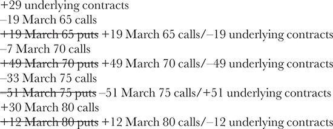

<!-- source:block d2d1810e705053ca -->

> [!quote]- English 17
> If we total all the contracts, what are we left with?

如果我们把所有合约加起来，我们还剩下什么？

<!-- source:block 18e520a58069e72e -->

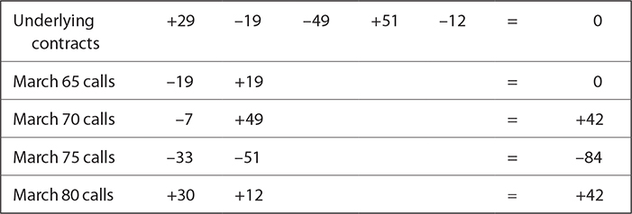

<!-- source:block 979a1275f57b3407 -->

> [!quote]- English 18
> We really have this position.

我们确实有这个头寸。

<!-- source:block d44e0db2e4933b2d -->

> [!quote]- English 19
> +42 March 70 calls

$$
+42 \text{March} 70 \text{calls}
$$

<!-- source:block dfe61c2eebb18105 -->

> [!quote]- English 20
> –84 March 75 calls

$$
-84 \text{March} 75 \text{calls}
$$

<!-- source:block 793bbff1a6e776bc -->

> [!quote]- English 21
> +42 March 65 calls

$$
+42 \text{March} 65 \text{calls}
$$

<!-- source:block a37d45fe18fe7d61 -->

> [!quote]- English 22
> As complex as the position first appeared, it was simply a long butterfly. And a long butterfly always wants the underlying contract to move toward the inside exercise price, in this case, 75. With the underlying contract currently trading at 71.50, the position must be delta positive. If we had rewritten the position so that it consisted only of puts, the result would have been the same because a call and put butterfly have essentially the same characteristics.

尽管这个头寸最初出现时很复杂，但它只是一只多头蝶式价差。而多头蝶式价差总是希望标的合约向内部行权价移动，在这种情况下是75。由于标的合约目前交易价为71.50，因此头寸必须为Delta正值。如果我们重写了头寸，使其仅由看跌组成，结果将会是相同的，因为看涨蝴蝶和看跌蝴蝶本质上具有相同的特征。

<!-- source:block 2f315572d9cc2970 -->

> [!quote]- English 23
> The foregoing example was admittedly created so that when the position was rewritten in terms of synthetic equivalents, its risk characteristics were relatively easy to identify. In reality, the risk characteristics of a complex position rarely fall neatly into place. Analysis of a complex position will almost always require a theoretical pricing model. Even then, the model may not tell the entire story.

诚然，创建上述示例是为了当以合成等效物重写该头寸时，其风险特征相对容易识别。事实上，复杂头寸的风险特征很少完全到位。复杂头寸的分析几乎总是需要理论定价模型。即便如此，该模型也可能无法讲述整个故事。

<!-- source:block f45cef7a7d868b8a -->

> [!quote]- English 24
> Suppose that we have the following market conditions:

假设我们有以下市场条件：

<!-- source:block 6890dd1b27d4635c -->

> [!quote]- English 25
> Underlying price = 99.60

$$
\text{Underlying price} = 99.60
$$

<!-- source:block f1101a366d360571 -->

> [!quote]- English 26
> Time to September expiration = 9 weeks

$$
\text{Time to September expiration} = 9 \text{weeks}
$$

<!-- source:block 3887b94e2298eb8e -->

> [!quote]- English 27
> Volatility = 18 percent

$$
\text{Volatility} = 18 \text{percent}
$$

<!-- source:block fb8a6798148e68e2 -->

> [!quote]- English 28
> Interest rate1 = 0

$$
\text{Interest rate} = 0
$$
[^ovp21-1]

<!-- source:block ae077a58c6331680 -->

> [!quote]- English 29
> The September 95 put and September 105 call have these risk characteristics:

9 月到期、行权价为 95 的看跌期权和9 月到期、行权价为 105 的看涨期权具有以下风险特征：

<!-- source:block a6810855af9654a8 -->

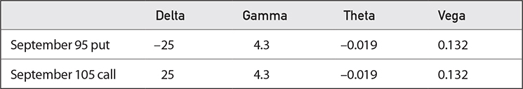

<!-- source:block 9d6e157cc038cdfb -->

> [!quote]- English 30
> What are the risks if we have the following position2:

如果我们处于以下位置，有哪些风险[^ovp21-2]：

<!-- source:block b548b2e62a4fd384 -->

> [!quote]- English 31
> Long 10 September 95 puts

`Long 10 September 95 puts`

<!-- source:block 8b1483d614175e4a -->

> [!quote]- English 32
> Short 10 September 105 calls

`Short 10 September 105 calls`

<!-- source:block 6db47bc8519fad8b -->

> [!quote]- English 33
> Long 5 underlying contracts

多头5个标的合约

<!-- source:block 8bc6a4701b1048f2 -->

> [!quote]- English 34
> The total risk sensitivities for the position are

该头寸的总风险敏感度为

<!-- source:block 7b242c53fb4b3f2d -->

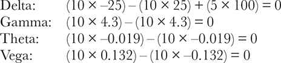

<!-- 原 EPUB 中此公式为图片，已原样保留 -->

<!-- source:block b0f97b17b990f4ea -->

> [!quote]- English 35
> It appears that we have no directional risk (delta is 0), no realized volatility risk (gamma is 0), no risk with respect to the passage of time (theta is 0), and no implied volatility risk (vega is 0). If the position was initiated with some positive theoretical edge and the risk sensitivities associated with the position are all 0, then the position is certain to show a profit. So what’s the problem?

看来我们没有方向风险（Delta为0），没有已实现波动率风险（Gamma为0），没有时间流逝的风险（Theta为0），也没有隐含波动率风险（Vega为0）。如果该头寸以一定的正理论优势启动，并且与该头寸相关的风险敏感度均为0，那么该头寸肯定会显示盈利。那么问题出在哪里？

<!-- source:block 55c4cf774a2823cb -->

> [!quote]- English 36
> The problem is that the delta, gamma, theta, and vega are only measures of the position’s risk under current market conditions. But today’s market conditions may not be—in fact, cannot be—tomorrow’s conditions. Even if the underlying price and volatility remain unchanged, time will pass. And we know that the passage of time can change a position’s characteristics. Looking at a position’s characteristics under current market conditions is only the first step in analyzing risk. We need to ask not only what the risks are right now but also what the risks might be under different market conditions. What will happen if the underlying contract moves up or down in price? What will happen if implied volatility rises or falls? What will happen as time passes?

问题是Delta、Gamma、Theta和Vega只是当前市场条件下头寸风险的衡量标准。但今天的市场状况可能不是——事实上，不可能是——明天的状况。即使标的价格和波动率保持不变，时间也会过去。我们知道时间的推移会改变头寸的特征。在当前市场条件下查看头寸的特征只是分析风险的第一步。我们不仅需要问现在有哪些风险，还要问不同市场条件下可能有哪些风险。如果标的合约价格上涨或下跌会发生什么？如果隐含波动率上升或下降会发生什么？随着时间的推移会发生什么？

<!-- source:block 28d4382b96750ee9 -->

> [!quote]- English 37
> We can expand our analysis by using what we already know about how risk sensitivities change as market conditions change. Suppose that the underlying price begins to fall. How might our risk change? We know that gamma is greatest for at-the-money options. As the underlying price begins to fall, it is moving toward the lower exercise price, 95, and away from the higher exercise price, 105. The gamma of the September 95 put must be increasing, while the gamma of the September 105 call must be declining. Because we are long the 95 put and short the 105 call, the total gamma position is becoming positive. Moreover, if we have a positive gamma, as the market falls, our position, which was initially delta neutral, will become delta negative.

我们可以通过使用我们已知的关于风险敏感性如何随着市场条件的变化而变化的知识来扩展我们的分析。假设标的价格开始下跌。我们的风险会如何变化？我们知道Gamma对于平值的期权来说是最好的选择。当标的价格开始下跌时，它会向较低的行权价95移动，并远离较高的行权价105。9 月到期、行权价为 95 的看跌期权的Gamma值肯定在增加，而9 月到期、行权价为 105 的看涨期权的Gamma值肯定在下降。因为我们做多95的看跌期权，做空105的看涨期权，所以总的Gamma头寸正变为正数。此外，如果我们有一个正的Gamma，随着市场下跌，我们的头寸，最初是Delta中性的，将变成Delta负的。

<!-- source:block b6ecbdfc83c4abe9 -->

> [!quote]- English 38
> What if the underlying price begins to rise? Now the market is moving away from 95 and toward 105: the gamma of the September 95 put is declining, and the gamma of the September 105 call is increasing. The entire position is now becoming gamma negative. Consequently, as the market rises, our position will become delta negative.

如果标的价格开始上涨怎么办？现在市场正在从95转向105：9 月到期、行权价为 95 的看跌期权的Gamma正在下降，而9 月到期、行权价为 105 的看涨期权的Gamma正在上升。整个头寸现在变成Gamma负。因此，随着市场上涨，我们的头寸将变为Delta负值。

<!-- source:block c19cc15ad63c1516 -->

> [!quote]- English 39
> This seems odd. The position becomes delta negative if the underlying price falls *or* rises. The explanation is the changing gamma: the position becomes gamma positive on the way down but gamma negative on the way up.

这似乎很奇怪。如果标的价格下跌或上涨，该头寸将变为Delta负。解释是Gamma变化：头寸在下降时变成Gamma正，但在上升时变成Gamma负。

<!-- source:block f26328ed2405a1e9 -->

> [!quote]- English 40
> Now let’s consider what will happen if volatility rises. As volatility increases, the delta of calls moves toward 50, and the delta of puts moves toward –50, while the delta of the underlying contract remains constant at 100. Because we are long puts, now with a delta greater (in absolute value) than –25, and short calls, now with a delta greater than 25, the position is becoming delta negative. If the delta of the September 95 put goes to –30 and the delta of the 105 call goes to +30, the total delta position will be

现在让我们考虑一下如果波动率上升会发生什么。随着波动率的增加，看涨期权的Delta向50移动，看跌期权的Delta向-50移动，而标的合约的Delta保持稳定在100。因为我们是多头看跌期权，现在的Delta（绝对值）大于-25，而空头看涨期权，现在的Delta大于25，所以头寸的Delta正在变成负值。如果9 月到期、行权价为 95 的看跌期权的Delta变为-30，而105看涨期权的Delta变为+30，则总Delta头寸将为

<!-- source:block 08bfde66dc920f6e -->

> [!quote]- English 41
> (10 × –30) – (10 × 30) + (5 × 100) = –100

$$
(10 \times -30) - (10 \times 30) + (5 \times 100) = -100
$$

<!-- source:block d75c04edf385f4da -->

> [!quote]- English 42
> In the same way, reducing volatility causes delta values to move away from 50. If the delta of the September 95 put goes to –20 and the delta of the 105 call goes to +20, the total delta position would be

同样，降低波动率会导致Delta值远离50。如果9 月到期、行权价为 95 的看跌期权的Delta变为-20，而105看涨期权的Delta变为+20，则总Delta头寸将为

<!-- source:block 62153ce8c43d84e7 -->

> [!quote]- English 43
> (10 × –20) – (10 × 20) + (5 × 100) = +100

$$
(10 \times -20) - (10 \times 20) + (5 \times 100) = +100
$$

<!-- source:block 19f4e8adb26aa40b -->

> [!quote]- English 44
> Summarizing, if volatility rises, we want the underlying market to fall. If volatility falls, we want the underlying market to rise.

总而言之，如果波动率上升，我们希望标的市场下跌。如果波动率下降，我们希望标的市场上涨。

<!-- source:block 3a5606d6c993323a -->

> [!quote]- English 45
> What will happen to the position as time passes? Reducing time, like reducing volatility, causes delta values to move away from 50. With no change in the underlying price as time passes, the call and put will move further out of the money. The five underlying contracts will tend to dominate the position, resulting in a positive delta.

随着时间的推移，这个头寸会发生什么变化？减少时间，就像减少波动率一样，会导致Delta值远离50。随着时间的推移，标的价格没有变化，看涨期权和看跌期权将进一步价外。五个标的合约将倾向于主导头寸，导致正的Delta。

<!-- source:block ddb872954d6aa136 -->

> [!quote]- English 46
> We have initially focused on the delta and gamma, but we can also infer what will happen to the theta and vega because these values, like the gamma, are greatest for at-the-money options. If the underlying contract begins to fall, our theta position will become negative (the passage of time will begin to hurt), and our vega position will become positive (we will want implied volatility to increase). If the underlying contract begins to rise, our theta position will become positive (the passage of time will begin to help), and our vega position will become negative (we will want implied volatility to decline). If the underlying price does not change, the gamma, theta, and vega of the position are unlikely to be significantly affected by changes in either time or volatility. We can summarize the effect of changing market conditions on the risk characteristics of the position as follows:

我们最初关注的是Delta和Gamma，但我们也可以推断Theta和Vega会发生什么，因为这些值，就像Gamma一样，对于ATM期权来说是最大的。 如果标的合约开始下跌，我们的Theta头寸将变为负值（时间的流逝将开始伤害），而我们的Vega头寸将变为正值（我们希望隐含波动率增加）。 如果标的合约开始上涨，我们的Theta头寸将变为正值（时间的推移将开始有所帮助），而Vega头寸将变为负值（我们希望隐含波动率下降）。 如果标的价格没有变化，头寸的Gamma、Theta和Vega不太可能受到时间或波动率变化的显著影响。我们可以将市场状况变化对头寸风险特征的影响总结如下：

<!-- source:block 5bf661bc9b9a299e -->

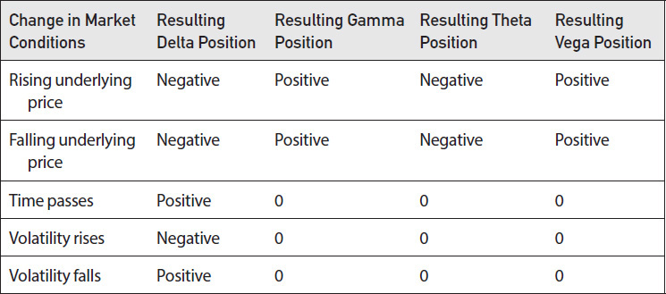

<!-- source:block b88390eb4d00f927 -->

> [!quote]- English 47
> If a position is not overly complex, a trader may be able to do this type of analysis, first looking at the initial risk sensitivities and then considering how the sensitivities might change as market conditions change. However, a trader can get a more complete picture of a position’s risk by looking at a graph of the position’s value over a broad range of conditions. Let’s do this for the current position:

如果头寸不是过于复杂，交易员可能能够进行此类分析，首先查看初始的风险敏感性，然后考虑敏感性可能如何随着市场条件的变化而变化。然而，交易员可以通过查看广泛条件下头寸价值的图表来更完整地了解头寸的风险。让我们对当前头寸这样做：

<!-- source:block b548b2e62a4fd384 -->

> [!quote]- English 48
> Long 10 September 95 puts

`Long 10 September 95 puts`

<!-- source:block 8b1483d614175e4a -->

> [!quote]- English 49
> Short 10 September 105 calls

`Short 10 September 105 calls`

<!-- source:block 6db47bc8519fad8b -->

> [!quote]- English 50
> Long 5 underlying contracts

多头5个标的合约

<!-- source:block d7f1465e23a4171c -->

> [!quote]- English 51
> Figure 21-1 shows the value of the position with respect to movement in the underlying contract. The three graphs represent the value at the current volatility of 18 percent, as well as at volatilities of 14 and 22 percent. From Figure 21-1, we can see the graphic interpretation of delta and gamma. For a negative delta position, the graph extends from the upper left to the lower right—as the underlying price rises, the position loses value. For a positive delta position, the graph extends from the lower left to the upper right—as the underlying price rises, the position gains value. In our example, the position is always delta negative at higher volatilities. Around the current underlying price of 99.60, the position is delta neutral—the graph is exactly horizontal. At lower volatilities, the delta will become positive around the current underlying price.

图21-1显示了头寸相对于标的合约变动的价值。这三张图代表了当前波动率为18%以及波动率为14%和22%时的值。从图21-1可以看到Delta和Gamma的图形解释。对于负Delta头寸，图表从左上角延伸到右下角-随着标的价格上涨，头寸就会失去价值。对于正的Delta头寸，图表从左下角延伸到右上角-随着标的价格上涨，头寸增值。在我们的例子中，在波动率较高时，头寸始终为Delta负。在当前标的价格99.60左右，头寸为Delta中性-图表完全水平。在波动率较低的情况下，Delta将在当前标的价格周围变为正值。

<!-- source:block dd51acf211e43929 -->

*图21-1标的价格和波动率变化时的头寸价值。 / Figure 21-1 Position value as the underlying price and volatility change.*

<!-- source:block d286bc16c31e8acf -->

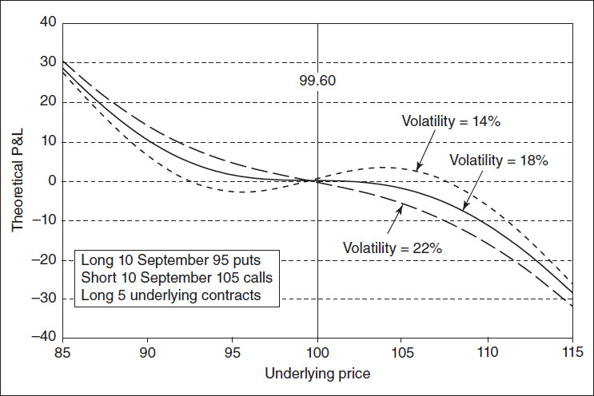

<!-- source:block 17ddb3cdb989a3f7 -->

> [!quote]- English 53
> For a negative gamma position, the graph curves downward, taking on the shape of a frown; price movement in either direction decreases the value of the position. For a positive gamma position, the graph curves upward, taking on the shape of a smile; price movement in either direction increases the value of the position. Our position has a positive gamma below the current price of 99.60 and a negative gamma above 99.60. At lower volatilities, the gamma is magnified (there is greater curvature), while at higher volatilities, the gamma is muted (there is less curvature). The current underlying price of 99.60 is an *inflection point*—the gamma is changing from positive to negative. At this price, the graph is essentially a straight line. The graphic interpretations of a positive and negative delta and gamma are shown in Figure 21-2.

对于负Gamma头寸，图形向下弯曲，呈皱眉形状;任何方向的价格变动都会降低头寸的价值。对于正Gamma头寸，图形向上弯曲，呈微笑的形状;任何方向的价格变动都会增加头寸的价值。我们的头寸在当前价格99.60以下具有正Gamma，在99.60以上具有负Gamma。在波动率较低时，Gamma会被放大（具有更大的弯曲），而在波动率较高时，Gamma会被静音（具有更小的弯曲）。当前标的价格99.60是一个拐点——Gamma正在从正变为负。在这个价格下，该图表本质上是一条直线。正和负Delta和Gamma的图形解释如图21-2所示。

<!-- source:block de20ddfd0446b8e8 -->

*Figure 21-2 Positive and negative delta and gamma. / Figure 21-2 Positive and negative delta and gamma.*

<!-- source:block 6447c74edf8c153a -->

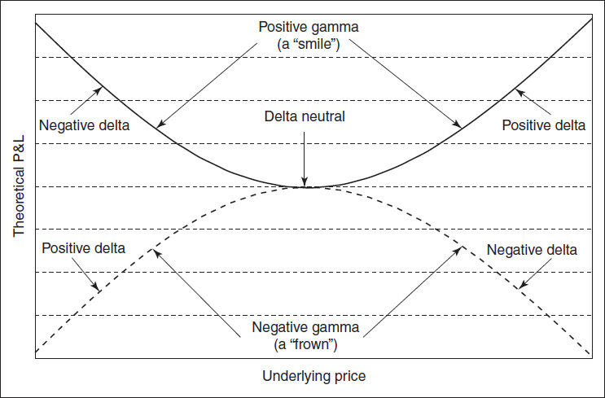

<!-- source:block fa0bcd33e7d1b70d -->

> [!quote]- English 55
> Because gamma and theta are of opposite signs, a positive gamma position will lose value as time passes with no movement in the underlying contract. A negative gamma will gain value. This is shown in Figures 21-3 and 21-4.

由于Gamma和Theta的符号相反，随着时间的推移，当标的合约没有变化时，正Gamma头寸将失去价值。负Gamma将获得价值。这如图21-3和21-4所示。

<!-- source:block 89e85d4aec9fbaa8 -->

*Figure 21-3 Positive gamma, negative theta position as time passes. / Figure 21-3 Positive gamma, negative theta position as time passes.*

<!-- source:block bd0fc721a0f178a1 -->

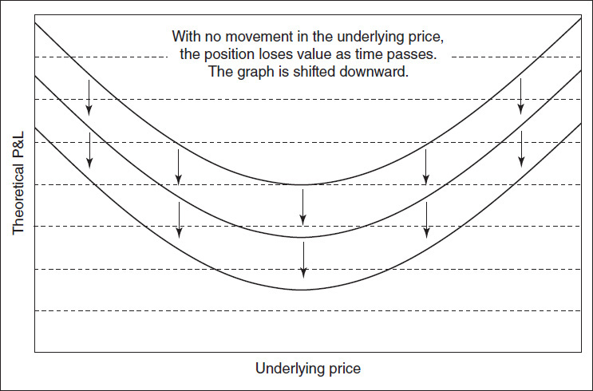

<!-- source:block e2a1cbd8e20e14d4 -->

*Figure 21-4 Negative gamma, positive theta position as time passes. / Figure 21-4 Negative gamma, positive theta position as time passes.*

<!-- source:block 864b97fb6a0014c3 -->

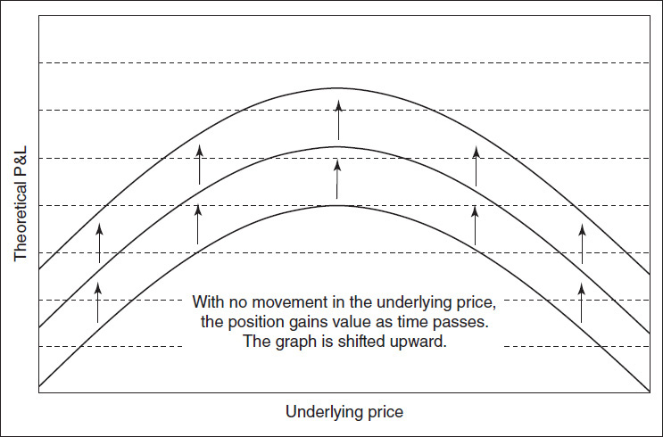

<!-- source:block 20da861ff6390d03 -->

> [!quote]- English 58
> Although gamma and theta are always of opposite signs, gamma and vega may be either the same or the opposite. Regardless of whether we have a positive gamma (we want the underlying contract to move) or a negative gamma (we want the underlying contract to sit still), we can have either a positive vega (we want implied volatility to rise) or a negative vega (we want implied volatility to fall). The graphic representations of these positions are shown in Figures 21-5 and 21-6.

尽管Gamma和Theta总是相反的符号，但Gamma和Vega可能相同或相反。无论我们有正的Gamma（我们希望标的合约变动）还是负的Gamma（我们希望标的合约保持静止），我们可以有正的Vega（我们希望隐含波动率上升）或负的Vega（我们希望隐含波动率下降）。这些头寸的图形表示如图21-5和21-6所示。

<!-- source:block 6cfcb743e2fae16a -->

*Figure 21-5 Positive gamma position as volatility changes. / Figure 21-5 Positive gamma position as volatility changes.*

<!-- source:block 582edf040e671227 -->

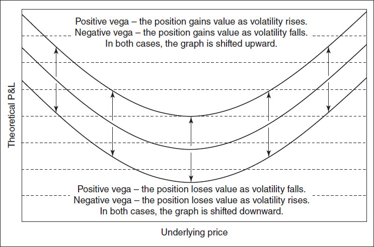

<!-- source:block ccfed7c66bf74fbb -->

*Figure 21-6 Negative gamma position as volatility changes. / Figure 21-6 Negative gamma position as volatility changes.*

<!-- source:block 059a439653f8af43 -->

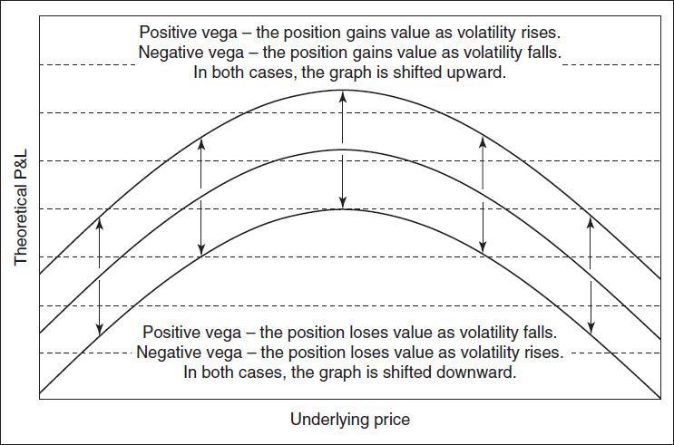

<!-- source:block 8ee4f70ec24eba3f -->

> [!quote]- English 61
> It may also be useful to look at graphs of the risk sensitivities as market conditions change. In Figure 21-7, we can see the changing delta as the underlying price and volatility change. Close to the current underlying price of 99.60, raising volatility causes the delta to become negative, while lowering volatility causes the delta to become positive. As we have already seen, if the underlying contract either rises or falls, the delta becomes negative. In Figure 21-8, we can see the changing gamma as the underlying price and volatility change. Close to the current underlying price of 99.60, the gamma is unaffected by changes in volatility. The gamma becomes positive if the underlying price falls or negative if the underlying contract rises.

随着市场条件的变化，查看风险敏感性图表也可能很有用。在图21-7中，我们可以看到随着标的价格和波动率的变化而变化的Delta。在接近当前标的价格99.60的情况下，波动率上升导致Delta变为负值，而波动率下降导致Delta变为正值。正如我们已经看到的那样，如果标的合约上涨或下跌，Delta就会变成负值。在图21-8中，我们可以看到随着标的价格和波动率的变化而变化的Gamma。接近当前标的价格99.60，Gamma不受波动率变化的影响。如果标的价格下跌，Gamma变为正值，如果标的合约上涨，Gamma变为负值。

<!-- source:block edf23cfecef009c9 -->

*图21-7标的价格和波动率变化时的头寸Delta。 / Figure 21-7 Position delta as the underlying price and volatility change.*

<!-- source:block 5deede7d06d16c7d -->

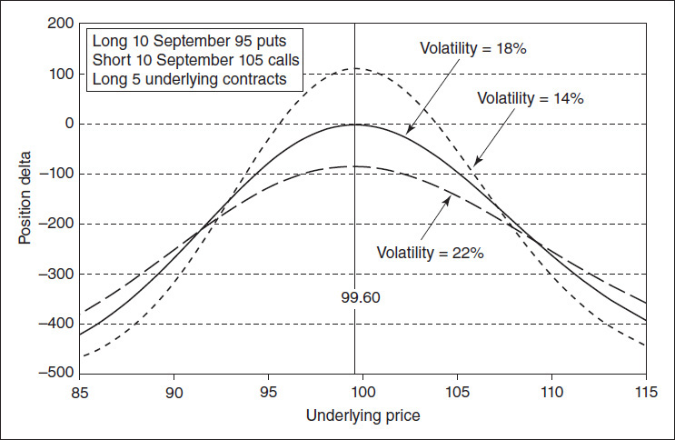

<!-- source:block bf309294837f2475 -->

*Figure 21-8 Position gamma as the underlying price and volatility change. / Figure 21-8 Position gamma as the underlying price and volatility change.*

<!-- source:block 7c03dd3681948c85 -->

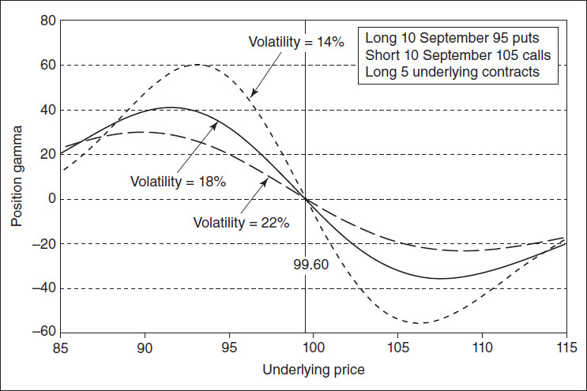

<!-- source:block 1583c66073cd256c -->

> [!quote]- English 64
> In addition to considering the risk sensitivities—delta, gamma, theta, and vega—and the way in which these values change as market conditions change, traders are well advised to look at the *net contract position*. If the market makes a dramatic downward move such that all calls move far out of the money while all puts go deeply into the money, or the market makes a dramatic upward move such that all puts move far out of the money while all calls go deeply into the money, what will be the result? In other words, if the market falls and all puts begin to act like short underlying contracts, or the market rises and all calls begin to act like long underlying contracts, what is the trader left with? In our position, the *downside contract position* is short five. At very low underlying prices, the long 10 September 95 puts together combined with the long 5 underlying contracts will act like a position that is short 5 underlying contracts. The *upside contract position* is also short five. At very high underlying prices, the short 10 September 105 calls combined with the long 5 underlying contracts will act like a position that is also short 5 underlying contracts. This is apparent in Figure 21-7; the delta approaches –500 in either direction.

除了考察 Delta、Gamma、Theta 和 Vega 等风险敏感度及其随市场条件的变化，交易员还应查看净合约头寸。如果市场大幅下跌，使所有看涨期权都变为深度价外、所有看跌期权都变为深度价内；或者市场大幅上涨，出现相反情形，最终会留下什么头寸？换言之，市场下跌时，所有看跌期权会逐渐表现得像标的空头；市场上涨时，所有看涨期权会逐渐表现得像标的多头。当前头寸的下行净合约头寸是 short 5。在标的价格极低时，`long 10 September 95 puts` 与 `long 5 underlying contracts` 合并后，表现得像 `short 5 underlying contracts`。上行净合约头寸同样是 short 5。在标的价格极高时，`short 10 September 105 calls` 与 `long 5 underlying contracts` 合并后，也表现得像 `short 5 underlying contracts`。图 21-7 清楚显示：无论向上还是向下，Delta 都趋近 $-500$。

<!-- source:block 3b1fece8889b87d4 -->

> [!quote]- English 65
> The net contract position may sometimes seem irrelevant, particularly if a position consists of very far out-of-the-money options. After all, how likely is it that they will go so deeply into the money that they will act like underlying contracts? But traders have learned, sometimes through painful experience, that big moves occur more often in the real world than one might expect. Extraordinary and unpredictable events—political and economic upheavals, scientific breakthroughs, natural disasters, corporate takeovers—can sometimes cause markets to move dramatically. When this occurs, a trader may find that options that “couldn’t possibly go into the money” have done just that.

净合约头寸有时可能看起来无关紧要，特别是如果头寸由非常远的OTM期权组成。毕竟，他们如此深入地投资资金，以至于像标的合约一样行事的可能性有多大？ 但交易员们有时通过痛苦的经历了解到，现实世界中大动作的发生频率比人们预期的要高。 非同寻常且不可预测的事件——政治和经济动荡、科学突破、自然灾害、企业收购——有时会导致市场发生巨大变化。当这种情况发生时，交易者可能会发现“不可能进入金钱”的期权就做到了这一点。

<!-- source:block 21941a525ecffc3f -->

> [!quote]- English 66
> A trader who is short very far out-of-the-money options may believe that there is so little chance that the options will go into the money that there is no point in buying them back. This may be true, but the clearinghouse will still require a margin deposit for each short option. In order to eliminate this requirement, and perhaps put the money to better use, the trader may want to buy back the options. Of course, he will only want to do this if the price is reasonable. Certainly, the price that the trader will be willing to pay ought to be less than the margin requirement. In the same way, a trader who is long very far out-of-the-money options that he believes are worthless will usually be happy to sell the options at whatever price he can. After all, something is better than nothing, which is what the options will be worth if they expire out of the money.

做空价外期权的交易员可能会认为，期权进入货币的可能性非常小，因此回购它们没有意义。这可能是真的，但清算所仍然要求为每个卖空期权缴纳保证金。为了消除这一要求，并更好地利用这笔钱，交易者可能想要回购期权。当然，只有在价格合理的情况下，他才会愿意这样做。当然，交易者愿意支付的价格应该低于保证金要求。同样，一个长期持有他认为毫无价值的价外期权的交易员通常会很乐意以任何价格出售期权。毕竟，有东西总比没有好，这就是期权到期后的价值。

<!-- source:block 8030f3822e3aa5a0 -->

> [!quote]- English 67
> Very often the price at which traders are willing to buy or sell very far out-of-the money options is less than the minimum price that the exchange normally allows. For this reason, many exchanges permit options to trade at a *cabinet bid*, a bid usually made at a price of one currency unit. For example, if the minimum price for an option on a U.S. exchange is \$5.00, an exchange may permit options to trade at a cabinet bid of \$1.00. This will allow traders who are either long or short options that they believe to be worthless to remove them from their accounts. The conditions under which cabinet bids are permissible are specified by each exchange.

交易者愿意买入或卖出非常远OTM期权的价格通常低于交易所通常允许的最低价格。出于这个原因，许多交易所允许期权以内阁出价进行交易，这种出价通常以一个货币单位的价格进行。 例如，如果美国交易所期权的最低价格为\\$5.00，则交易所可能允许期权以\\$1.00的内阁出价进行交易。这将允许他们认为毫无价值的多头或空头期权的交易员将其从账户中删除。 允许内阁竞标的条件由每个交易所指定。

<!-- source:block f33da06e6c1b644b -->

> [!quote]- English 68
> Now let’s consider the more complex position shown in Figure 21-9. The position consists of options that all expire at the same time, but it includes calls and puts at five different exercise prices, together with a position in the underlying contract. As before, we assume that the position has some positive theoretical edge. Otherwise, the immediate goal would be to liquidate the position in order to avoid a loss or to alter it in order to create a positive theoretical edge. What are the risks of holding this position?

现在让我们考虑图21-9中所示的更复杂的头寸。该头寸由所有同时到期的期权组成，但包括五种不同行权价的看涨和看跌，以及标的合约中的头寸。与之前一样，我们假设该头寸具有一些积极的理论优势。否则，当前的目标是清算头寸以避免损失或改变头寸以创造积极的理论优势。持有此头寸有哪些风险？

<!-- source:block 7499e409e6f1cf00 -->

*图21.9 / Figure 21.9*

<!-- source:block b4e514e09f50f97b -->

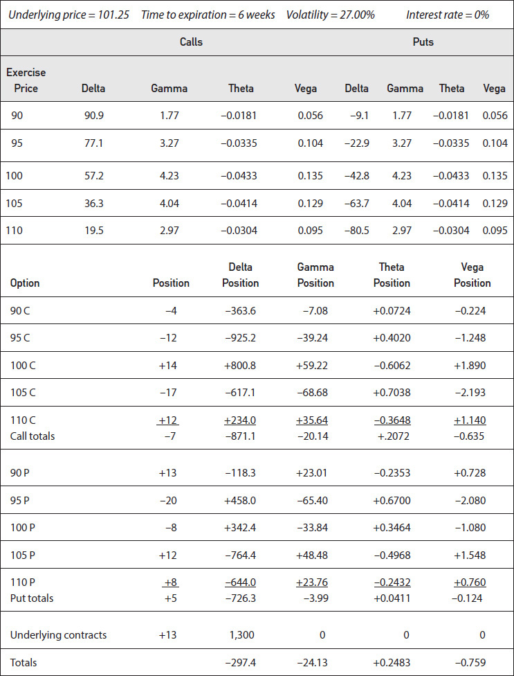

<!-- source:block d7663a1d11c4438a -->

> [!quote]- English 70
> Beginning with a quick look at the sensitivities, we can see that we are at risk from a decline in the underlying market (negative delta), from an increase in realized volatility (negative gamma), and from an increase in implied volatility (negative vega). Looking only at the delta and gamma, the most favorable outcome seems to be a slow downward move in the underlying market. The least favorable outcome seems to be a swift upward move.

从快速了解敏感性开始，我们可以看到，我们面临着标的市场下跌（负Delta）、已实现波动率上升（负Gamma）和隐含波动率上升（负Vega）的风险。仅看Delta和Gamma，最有利的结果似乎是标的市场缓慢向下移动。最不有利的结果似乎是迅速上升。

<!-- source:block f44866dccbd68e5e -->

> [!quote]- English 71
> What else can we say about this position? From the negative delta, it’s clear that we would like downward movement in the underlying price. But how far down? The current price is 101.25. Do we want the market to fall to 100? To 95? To 90? Perhaps we want an unlimited decline. However, the negative gamma indicates that a swift and violent downward move cannot be good for this position. Taken together with the delta, we can approximate just how far we want the underlying to fall if we realize that *a negative gamma position always wants to become delta neutral*. The profit resulting from a negative gamma position will tend to be maximized when it is delta neutral.

关于这个头寸我们还能说什么？从负Delta来看，我们显然希望标的价格向下移动。但往下有多远？当前价格为101.25。我们希望市场跌至100吗？到95？到90岁？也许我们想要无限的衰落。然而，负Gamma表明迅速而猛烈的向下移动对这一头寸并不有利。如果我们意识到负Gamma头寸总是希望变得Delta中性，那么我们就可以与Delta一起估算出我们希望标的下跌的程度。当Delta中性时，负Gamma头寸产生的利润往往会最大化。

<!-- source:block ced1f5e9b51035b6 -->

> [!quote]- English 72
> Where will our position be delta neutral if the market starts to fall? For each point decline in the underlying market, we must subtract the gamma, –25.8, from our delta. By dividing the current delta by the gamma, we can estimate that the position is approximately delta neutral at an underlying price of

如果市场开始下跌，我们的头寸将在哪里保持Delta中性？对于标的市场每下跌一个点，我们必须从Delta中减去Gamma-25.8。通过将当前的Delta除以Gamma，我们可以估计该头寸在标的价格为

<!-- source:block ddd5ce4de53f0cce -->

> [!quote]- English 73
> 101.25 – (297.4/24.13) = 101.25 – 12.32 = 88.93

$$
101.25 - (297.4/24.13) = 101.25 - 12.32 = 88.93
$$

<!-- source:block fa3e90b74bf51044 -->

> [!quote]- English 74
> Of course, this is only an approximation because we are assuming that the gamma is constant, which it is not. An increasing or declining gamma as the underlying price changes will alter our conclusion. However, if we have to make a quick estimate of what we would like to occur, a slow downward move to around 89.00 seems best.

当然，这只是一个近似值，因为我们假设Gamma是恒定的，但事实并非如此。随着标的价格变化，Gamma系数增加或下降将改变我们的结论。然而，如果我们必须快速估计我们希望发生的事情，那么缓慢向下移动至89.00左右似乎是最好的选择。

<!-- source:block ee9b36c04610471f -->

> [!quote]- English 75
> We have also surmised that a swift upward move will hurt this position. Now both the delta and gamma are working against the position. Suppose that the worst happens—the underlying contract suddenly leaps to 150. Will the result be disastrous for us? Here we return to the net contract position: if the market makes a dramatic move such that all contracts move into or out of the money, what are we left with? In a large upward move, all the puts will collapse to 0, while all the calls will eventually begin to act like underlying contracts. Our position is net short a total of 7 calls. But we are also long 13 underlying contracts. This gives us a net upside contract position of +6. If the market makes a really big upward move, we will have a position that is long 6 underlying contracts, giving us a potentially unlimited profit. We can conclude that as the market moves up, at some point our gamma must turn positive, causing the delta to eventually become positive.

我们还推测，迅速上涨将损害这一头寸。现在Delta和Gamma都在反对该头寸。假设最坏的情况发生-标的合约突然跳到150。结果对我们来说会是灾难性的吗？ 这里我们回到净合约头寸：如果市场发生剧烈波动，导致所有合约进入或OTM，我们还剩下什么？在大幅上行中，所有看跌期权将崩溃至0,，而所有看涨期权最终将开始像标的合约一样行事。 我们的头寸净卖空总计7个看涨期权。但我们也是做多13标的合约。这使我们的净上行合约头寸为+6。如果市场出现真正的大幅上涨，我们将持有多头6标的合约的头寸，从而为我们带来潜在的无限利润。 我们可以得出结论，随着市场上涨，在某个时候我们的Gamma必须变成正值，从而导致Delta最终变成正值。

<!-- source:block 937709ca8b62e317 -->

> [!quote]- English 76
> The downside contract position is not so favorable. Now all the calls will collapse to 0, while all the puts will act like short underlying contracts. We are net long 5 puts, but we are also long the same 13 underlying contracts. Our net downside contract position is +8. If the market makes a violent downward move, we will have a position that is long 8 underlying contracts, with potentially disastrous results.

下行净合约头寸则没有那么有利。此时所有看涨期权都将趋近于 0，而所有看跌期权都会表现得像标的空头。我们持有 `long 5 puts`，同时持有 `long 13 underlying contracts`，因此下行净合约头寸为 $+8$。若市场剧烈下跌，我们最终相当于持有 `long 8 underlying contracts`，后果可能十分严重。

<!-- source:block 44f748f086d7785a -->

> [!quote]- English 77
> Because we are focusing on the risk characteristics of our position, no prices or theoretical values are given for the options in Figure 21-9. We have simply made the assumption that the position has some positive theoretical edge. However, the size of the theoretical edge—how much, in theory, we expect to make with the position if our volatility estimate of 27 percent is correct—can be an important consideration in analyzing the risk of the position. For example, let’s assume that the position has a positive theoretical edge of 6.00. If 27 percent turns out to be the correct volatility over the six-week life of the position and we go through the delta-neutral dynamic hedging process,3 we expect to show a profit of 6.00.

由于我们关注的是头寸的风险特征，因此没有给出图21-9中的期权的价格或理论价值。我们只是假设该头寸具有一些积极的理论优势。然而，理论边缘的大小——如果我们对27%的波动率估计正确，理论上我们预计该头寸能赚多少钱——可能是分析头寸风险的一个重要考虑因素。例如，假设该头寸的理论优势为6.00。如果27%是头寸六周有效期内的正确波动率，并且我们经过Delta中性动态对冲过程，[^ovp21-3]我们预计将显示6.00的利润。

<!-- source:block 643fbc301a1a0523 -->

> [!quote]- English 78
> The theoretical edge and vega can help us estimate our volatility risk. From the vega position of –0.759, we know that any increase in volatility will hurt. Consequently, we might ask this question: how much can volatility rise before our potential profit turns into a potential loss? For each percentage point increase in volatility our potential profit will be reduced by the amount of the vega. By dividing the theoretical edge by the vega, we can estimate that the position will break even at a volatility of approximately

理论优势和Vega可以帮助我们估计波动率风险。从Vega的-0.759头寸来看，我们知道波动率的任何增加都会造成伤害。因此，我们可能会问这个问题：在我们的潜在利润变成潜在损失之前，波动率会上升多少？波动率每增加一个百分点，我们的潜在利润就会减少Vega的数量。通过将理论优势除以Vega，我们可以估计该头寸将在波动率约为

<!-- source:block 975d1860de3e839b -->

> [!quote]- English 79
> 27.00 + (6.00/0.759) = 27.00 + 7.90 = 34.90 (%)

$$
27.00 + (6.00/0.759) = 27.00 + 7.90 = 34.90 (\%)
$$

<!-- source:block c7a17488b47a01f1 -->

> [!quote]- English 80
> Assuming a theoretical edge of 6.00, if volatility turns out to be no higher than 34.90 percent, the position will do no worse than break even. Above 34.90 percent, the position will begin to show a loss. We discussed this concept—the breakeven volatility of a position—in Chapter 7. This can be thought of as the implied volatility of the entire position. It tells us that we have a margin for error of 7.90 volatility points in our volatility estimate. Whether this represents a small or large margin of error depends on the volatility characteristics of this particular market.

假设理论优势为6.00，如果波动率不高于34.90%，那么该头寸的表现不会比收支平衡差。高于34.90%，该头寸将开始出现亏损。我们在第7章讨论了这个概念——头寸的盈亏平衡波动率。这可以被认为是整个头寸的隐含波动率。它告诉我们，波动率估计的误差幅度为7.90个波动点。这代表的误差幅度较小还是较大取决于该特定市场的波动率特征。

<!-- source:block 618ceca30f09004f -->

> [!quote]- English 81
> How can we increase the margin for error in our volatility estimate? We can do so by either increasing the theoretical edge (without increasing the vega) or by reducing the vega (without reducing the theoretical edge). If we can increase the theoretical edge to 8.00 without increasing the vega, the implied volatility of the position will be

我们如何才能增加波动率估计的误差幅度？我们可以通过增加理论边缘（而不增加Vega）或减少Vega（而不减少理论边缘）来做到这一点。如果我们能够在不增加Vega的情况下将理论优势提高到8.00，那么头寸的隐含波动率将是

<!-- source:block ed4eb4db8da6d723 -->

> [!quote]- English 82
> 27.00 + (8.00/0.759) = 27.00 + 10.54 = 37.54 (%)

$$
27.00 + (8.00/0.759) = 27.00 + 10.54 = 37.54 (\%)
$$

<!-- source:block bf889ef2444d6754 -->

> [!quote]- English 83
> Alternatively, if we can reduce the vega to –0.65, the implied volatility will be

或者，如果我们可以将Vega降低到-0.65，则隐含波动率将为

<!-- source:block e1c7d57a442404fc -->

> [!quote]- English 84
> 27.00 + (6.00/0.65) = 27.00 + 9.23 = 36.23 (%)

$$
27.00 + (6.00/0.65) = 27.00 + 9.23 = 36.23 (\%)
$$

<!-- source:block 00c4a85639b38aa2 -->

> [!quote]- English 85
> Unfortunately, it may not be possible to do either. In this case, we will have to decide whether the vega risk of –0.759 is reasonable given the potential profit of 6.00.

不幸的是，这两点都不可能做到。在这种情况下，我们将不得不决定在潜在利润为6.00的情况下，-0.759的Vega风险是否合理。

<!-- source:block b3c51e1a449c0545 -->

> [!quote]- English 86
> We know that the risk sensitivities of the position—delta, gamma, theta, and vega—are likely to change as market conditions change. It is almost impossible to do a detailed analysis of these changes without computer support. However, we may be able to say something about how the delta changes as time and volatility change if we recall that delta values move either toward 50 or away from 50 with changes in time to expiration and volatility.

我们知道，头寸（Delta、Gamma、Theta和Vega）的风险敏感性可能会随着市场条件的变化而变化。如果没有计算机支持，几乎不可能对这些变化进行详细分析。然而，如果我们记得Delta值随着到期时间和波动率的变化而走向50或远离50，我们也许可以谈谈Delta如何随着时间和波动率的变化而变化。

<!-- source:block 52097c4f30461bf3 -->

> [!quote]- English 87
> Consider what will happen if volatility begins to rise. All call deltas will move toward 50 and put deltas toward –50. Because we are net short 7 calls and net long 5 puts, in the extreme, the call delta position will be

考虑波动率开始上升时会发生什么。所有看涨期权的 Delta 将趋近 50，所有看跌期权的 Delta 将趋近 $-50$。由于我们持有 `net short 7 calls` 和 `net long 5 puts`，在极端情况下，看涨期权的 Delta 头寸将为

<!-- source:block 4e9be48aa1c22eb1 -->

> [!quote]- English 88
> –7 × 50 = –350

$$
-7 \times 50 = -350
$$

<!-- source:block d38009e53366b5c8 -->

> [!quote]- English 89
> and the put delta position will be

看跌Delta头寸将为

<!-- source:block 6f68c924c65f0532 -->

> [!quote]- English 90
> 5 × –50 = –250

$$
5 \times -50 = -250
$$

<!-- source:block 723c08f2fb151b91 -->

> [!quote]- English 91
> Together with the 13 long underlying contracts, the total delta will be

加上13份多头标的合约，总Delta将为

<!-- source:block 3d428a0d1e1fde9a -->

> [!quote]- English 92
> –350 – 250 + 1,300 = +700

$$
-350 - 250 + 1{,}300 = +700
$$

<!-- source:block 63c356e31d7c9e11 -->

> [!quote]- English 93
> Of course, we would have to raise volatility dramatically for all the deltas to actually approach 50. But, as we begin to raise volatility, the current delta of –297 will become less negative and eventually will turn positive. In a high-volatility market, we will prefer upward movement in the underlying contract.

当然，我们必须大幅提高波动率，以便所有Delta实际接近50。但是，随着我们开始提高波动率，目前的-297的Delta将变得不那么负，最终将转为正值。在高波动率的市场中，我们更喜欢标的合约向上移动。

<!-- source:block 6923f069d336ad31 -->

> [!quote]- English 94
> What about a decline in volatility or the passage of time, both of which will cause delta values to move away from 50? The delta values of out-of-the-money options will move toward 0, while the delta values of in-the-money options will move toward 100. Because we are currently net short 2 in-the-money calls (the 90, 95, and 100 calls) and net long 20 in-the-money puts (the 105 and 110 puts), in the extreme, our total delta will be

波动率下降或时间的推移会导致Delta值偏离50怎么办？价外期权的Delta值将趋于0，而价内期权的Delta值将趋于100。由于我们目前净空头2个价内看涨期权（90、95和100个看涨期权）和净多头20个价内看跌期权（105和110个看跌期权），在极端情况下，我们的总Delta将是

<!-- source:block e67d9e11ab903f9b -->

> [!quote]- English 95
> –200 – 2,000 + 1,300 = –900

$$
-200 - 2{,}000 + 1{,}300 = -900
$$

<!-- source:block ae9ec6d6ef1e9140 -->

> [!quote]- English 96
> If we reduce volatility or time passes, we will prefer downward movement in the underlying contract.

如果我们减少波动率或时间流逝，我们将更喜欢标的合约的向下移动。

<!-- source:block b45a8a124d0dfe36 -->

> [!quote]- English 97
> For a new trader, using a basic knowledge of delta, gamma, theta, and vega characteristics to analyze the risk of a position can be a useful exercise. However, when computer support is available, it is almost always easier and more efficient to look at graphs of the position’s risk. This has been done for the current position in Figures 21-10 through 21-13.

对于新交易者来说，使用Delta、Gamma、Theta和Vega特征的基本知识来分析头寸的风险可能是一项有用的行权。然而，当有计算机支持时，查看头寸风险的图表几乎总是更容易、更有效。已对图21-10至21-13中的当前头寸进行了这一操作。

<!-- source:block 8643df791716d4ff -->

*图21-10随着标的价格和波动率变化的头寸价值。 / Figure 21-10 Position value as the underlying price and volatility change.*

<!-- source:block 0bb62d1b90de6605 -->

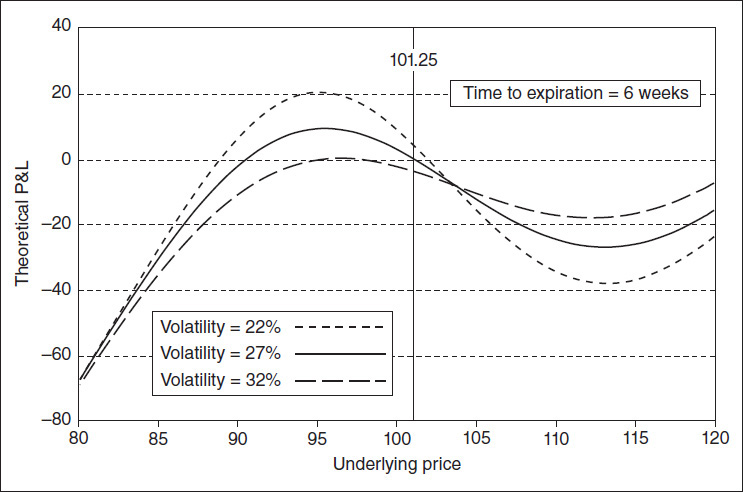

<!-- source:block 2c4fb112aa362ec5 -->

*图21-11标的价格和波动率变化时的头寸Delta。 / Figure 21-11 Position delta as the underlying price and volatility change.*

<!-- source:block b3403217be4ad813 -->

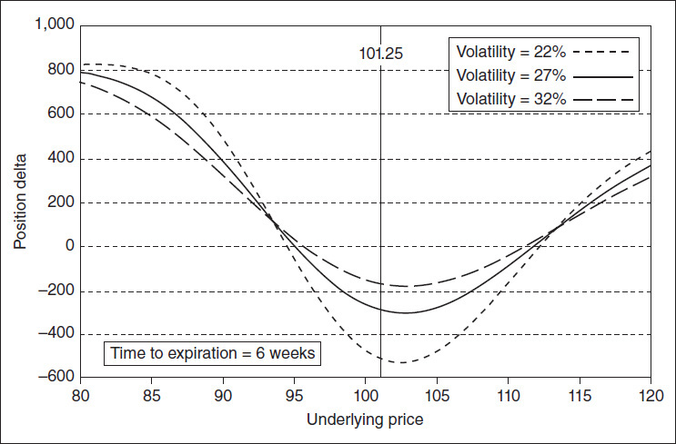

<!-- source:block 1b4add2d8dddb9d8 -->

*Figure 21-12 Position gamma as the underlying price and volatility change. / Figure 21-12 Position gamma as the underlying price and volatility change.*

<!-- source:block 466df1c368a17ea9 -->

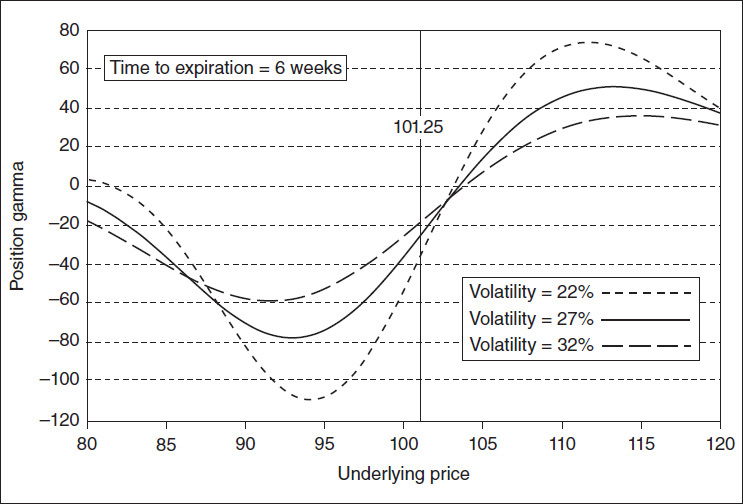

<!-- source:block 6e43bf4b6ebd1e44 -->

*图21-13随着波动率变化和时间推移的头寸值。 / Figure 21-13 Position value as volatility changes and time passes.*

<!-- source:block bb1acd3bc9eadd27 -->

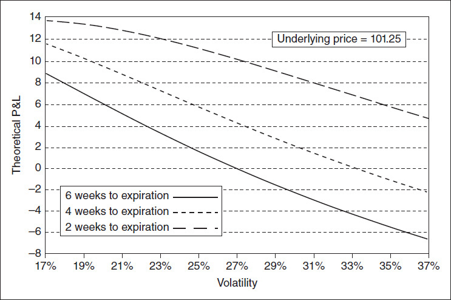

<!-- source:block b79c88b82d33e757 -->

> [!quote]- English 102
> In Figure 21-10, we can see that at a volatility of 27 percent, the maximum profit on the downside will occur at a price of approximately 95.00, at which point the position delta is 0. This differs considerably from our estimate of 88.93 because the gamma, which was initially –24.13, becomes a much larger negative number as the market drops. The negative delta of –297 is more rapidly offset by the increasing gamma. In Figure 21-12, we see that on the downside, the gamma reaches its maximum of approximately –80 at an underlying price of 93.

在图21-10中，我们可以看到，当波动率为27%时，下跌的最大利润将出现在价格约为95.00时，此时头寸Delta为0。这与我们估计的88.93有很大差异，因为最初为-24.13的Gamma随着市场下跌而变成了一个更大的负值。-297的负Delta被不断增加的Gamma更快地抵消。在图21-12中，我们看到，在不利的情况下，Gamma在标的价格为93时达到约-80的最大值。

<!-- source:block f4839699dda06ef6 -->

> [!quote]- English 103
> If the market moves up, we will initially lose money. But, at an underlying price of 104, the gamma becomes positive. Our negative delta begins to turn around and at a price of 112 actually becomes positive (Figure 21-11). We will continue to lose money above 112, but at some point the position will begin to show a profit. Figure 21-10 only goes up to an underlying price of 120, but a more extensive analysis would show that at an underlying price of 124, the position will begin to show a profit.

如果市场上涨，我们最初会赔钱。但是，在标的价格为104时，Gamma变为正值。我们的负Delta开始扭转，在价格为112时实际上变成了正值（图21-11）。112以上我们将继续亏损，但在某个时候该头寸将开始显示盈利。图21-10仅升至标的价格120，但更广泛的分析会表明，在标的价格124时，头寸将开始显示利润。

<!-- source:block 5206b9449c9116f7 -->

> [!quote]- English 104
> In Chapter 9, we looked at some of the nontraditional higher-order risk measures. Figure 21-12 shows that between the underlying prices of 93 and 114, the position has a positive speed; as the price rises, the gamma increases. Below 93 and above 114, the position has a negative speed; as the price rises, the gamma declines. We can also see that changing the volatility causes the gamma and, consequently, the delta to change at a different rate. Lowering volatility causes the speed to increase, while raising volatility causes the speed to decline.

在第9章中，我们研究了一些非传统的高级风险指标。图21-12显示，在标的价格93和114之间，头寸速度为正;随着价格上涨，Gamma也随之增加。低于93且高于114，头寸速度为负;随着价格上涨，Gamma下降。我们还可以看到，改变波动率会导致Gamma，从而导致Delta以不同的速度变化。降低波动率会导致速度增加，而提高波动率会导致速度下降。

<!-- source:block c6b52a525f03d946 -->

> [!quote]- English 105
> Figure 21-13 shows the sensitivity of the position to changes in implied volatility, assuming a constant underlying price of 101.25. The position clearly has a negative vega. Any decline in implied volatility will help the position; any increase in implied volatility will hurt the position. Given a theoretical edge, we can estimate the breakeven (implied) volatility for the entire position by dividing the total theoretical edge by the vega. If, for example, we have a total edge of 6.00, we estimated that the position has an implied volatility of approximately 34.90 percent. In fact, we can see in Figure 21-13 that the implied volatility is somewhat higher than 34.90 percent. The six-week graph crosses –6.00, which would exactly offset a theoretical edge of +6.00, at a volatility of approximately 36 percent. The reason the breakeven volatility is greater than our estimate is that the six-week graph has a positive volga—it curves upward slightly. As volatility rises, the vega becomes more positive or less negative. As volatility falls, the vega becomes more negative or less positive. Even though the current volga is positive, we can see that as time passes, the volga of the position becomes slightly negative. The four-week graph is approximately a straight line, while the two-week graph curves slightly downward.

图21-13显示了头寸对隐含波动率变化的敏感性，假设标的价格为101.25。该头寸显然具有负Vega。隐含波动率的任何下降都将有助于头寸;隐含波动率的任何增加都将损害头寸。给定理论优势，我们可以通过将总理论优势除以Vega来估计整个头寸的盈亏平衡（隐含）波动率。例如，如果我们的总优势为6.00，则我们估计该头寸的隐含波动率约为34.90%。事实上，我们在图21-13中可以看到，隐含波动率略高于34.90%。六周图形穿过-6.00，这恰好抵消了+6.00的理论边缘，波动率约为36%。盈亏平衡波动率高于我们估计的原因是，六周图表呈正volga-it曲线小幅向上。随着波动率的上升，Vega指数变得更积极或更少消极。随着波动率下降，Vega指数变得更负或更少正。尽管目前的伏尔加是正值，但我们可以看到，随着时间的推移，该头寸的伏尔加变得稍微负值。四周的图表大约是一条直线，而两周的图表则稍微向下弯曲。

<!-- source:block 223e3bd84ee388f0 -->

> [!quote]- English 106
> What should we conclude about the position in Figure 21-9? The reason for doing an analysis is to help us determine beforehand what actions to take to either maximize our profits if conditions move in our favor or minimize losses if conditions move against us. We currently have a negative delta. If we wish to maintain a downward bias, then no action is necessary. If, however, we are trading from a purely theoretical standpoint, then perhaps we ought to buy the 297 deltas that we are short. The easiest way to do this is to buy three underlying contracts.

对于图21-9中的头寸，我们应该得出什么结论？进行分析的原因是帮助我们事先确定采取哪些行动，在条件对我们有利时最大化我们的利润，或者在条件对我们不利时最大化损失。我们目前有一个负的Delta。如果我们希望保持向下的倾向，那么就没有必要采取任何行动。然而，如果我们纯粹从理论的角度进行交易，那么也许我们应该购买我们做空的297个Delta。最简单的方法是购买三份标的合约。

<!-- source:block 04689bb168964a4b -->

> [!quote]- English 107
> If we maintain our current position and the market begins to decline, what action should we take? If the decline is slow (clearly a very good outcome given our delta and gamma) and there is no increase in implied volatility, perhaps we ought to consider buying puts at lower exercise prices. This will have the effect of offsetting our downside net contract risk and reducing our negative vega while locking in some of the theoretical edge. If, however, the decline is swift, we may have to ignore theoretical considerations and buy puts at the market price. This may be the cost of having a bad position, something that will inevitably occur at some point in every trader’s career. If we are forced to buy puts at inflated prices, especially if there is an increase in implied volatility, we may lose money. But if the decline is very swift, the primary objective may be survival. And in the long run, simply surviving, in order to be able to take advantage of those subsequent occasions when conditions work in our favor, can mean the difference between success and failure in option trading.

如果我们维持目前的头寸，市场开始下跌，我们应该采取什么行动？如果下跌缓慢（考虑到我们的Delta和Gamma，显然是一个非常好的结果），并且隐含波动率没有增加，也许我们应该考虑以较低的行权价购买看跌期权。这将产生抵消我们的净合约下行风险并减少负Vega的效果，同时锁定一些理论优势。然而，如果下跌迅速，我们可能不得不忽视理论考虑，以市场价格买入看跌期权。这可能是持有糟糕头寸的成本，这在每个交易者职业生涯的某个时刻都不可避免地会发生。如果我们被迫以虚高的价格购买看跌期权，特别是如果隐含波动率增加，我们可能会赔钱。但如果下降非常迅速，首要目标可能是生存。从长远来看，仅仅生存下来，以便能够利用随后条件对我们有利的情况，可能意味着期权交易成功与失败的区别。

<!-- source:block bf28301e458b2572 -->

> [!quote]- English 108
> What action should we take if the market begins to rise? We ought to be prepared for one course of action if the move is slow (the delta is working against us, while the gamma is working for us), but a different course of action if the move is swift (the delta and gamma are initially working against us, but if the upward move is large enough, these numbers may eventually work in our favor).

如果市场开始上涨，我们应该采取什么行动？如果行动缓慢（Delta对我们不利，而Gamma对我们有利），我们应该做好准备，但如果行动迅速，我们应该采取不同的行动方案（Delta和Gamma最初对我们不利，但如果向上移动足够大，这些数字最终可能会对我们有利）。

<!-- source:block 506f4b3983d6510c -->

> [!quote]- English 109
> A detailed position analysis will help us prepare for a variety of changes in market conditions. But no matter how detailed our analysis, we may still encounter situations where we are in uncharted territory. When conditions do change, we can never know for certain how the marketplace will react. If the underlying price begins to rise or fall, depending on the specific market, we may expect implied volatility to change in a certain way. But we may find that it has changed in a completely different way. We may have to accept the fact that our analysis was incorrect and take whatever action we can to reduce our losses or maximize our profits under these new and unexpected conditions.

详细的头寸分析将帮助我们为市场状况的各种变化做好准备。但无论我们的分析有多详细，我们仍然可能遇到处于未知领域的情况。当条件确实发生变化时，我们永远无法确定市场将如何反应。如果标的价格开始上涨或下跌，具体取决于特定市场，我们可能预计隐含波动率会以某种方式发生变化。但我们可能会发现它已经以完全不同的方式发生了变化。我们可能不得不接受我们的分析不正确的事实，并采取一切可能的行动来减少我们的损失或在这些新的和意外的情况下最大化我们的利润。

<!-- source:block 35c8189b0fcc0210 -->

## 关于做市的一些思考 / Some Thoughts on Market Making

<!-- source:block c6df32cc389f8ebb -->

> [!quote]- English 110
> In order to ensure liquidity in a market, exchanges may appoint one or more *market makers* in a product. A market maker guarantees that he will continuously quote both a price at which he is willing to buy and a price at which he is willing to sell. As a consequence, a buyer or seller can always be certain that there will be someone in the marketplace willing to take the opposite side of the trade. This does not mean that a customer is required to trade with a market maker. If other market participants are willing to buy at a higher price or sell at a lower price, the customer is always free to trade at the best available price. But by continuously quoting a *bid-ask spread*, the market maker fulfills his role as the buyer or seller of last resort

为了确保市场的流动性，交易所可以在产品中指定一个或多个做市商。做市商保证他将不断报价他愿意买入的价格和他愿意卖出的价格。因此，买家或卖家总是可以确信市场上会有人愿意站在贸易的对立面。这并不意味着客户必须与做市商进行交易。如果其他市场参与者愿意以更高的价格购买或以更低的价格出售，客户始终可以自由地以最优惠的可用价格进行交易。但通过不断报价买卖价差，做市商履行了他作为最后买家或卖家的角色

<!-- source:block 7fa15db06cf580cb -->

> [!quote]- English 111
> A market maker must comply with rules established by the exchange concerning the width of the bid-ask spread as well as the minimum number of contracts that the market maker must be willing to trade. If exchange rules dictate that a market maker may quote a bid-ask spread no wider than 2.00, then a bid price of 63.00 for a contract implies an offer price that is no higher than 65.00. Similarly, an offer price of 47.00 implies a bid price that is no lower than 45.00. The market maker may quote a tighter bid-ask spread, for example, 63.50–64.50 in the former case or 45.75–46.25 in the latter, but the spread may be no wider than that specified under the exchange rules.

做市商必须遵守交易所制定的有关买卖价差宽度以及做市商必须愿意交易的最低合约数量的规则。如果交易所规则规定做市商的买卖价差不得超过2.00，那么合约的买入价为63.00意味着卖出价不高于65.00。同样，47.00的报价意味着出价不低于45.00。做市商可能会报出更严格的买卖价差，例如，前者为63.50-64.50，后者为45.75-46.25，但价差不得大于交易所规则规定的价差。

<!-- source:block 417083cabc3258d8 -->

> [!quote]- English 112
> In addition to quoting a bid-ask spread, a market maker must be willing to trade a minimum number of contracts at the quoted prices. If the exchange minimum is 100 contracts, the market maker must be willing to buy or sell a minimum of 100 contracts at his quoted prices. He may offer to trade more than the minimum, in which case he will usually quote his size along with the bid-ask spread, for example,

除了报价买卖价差外，做市商还必须愿意以报价交易最少数量的合约。如果交易所的最低价格是100份合约，则做市商必须愿意以其报价购买或出售至少100份合约。他可能会提出超过最低限额的交易，在这种情况下，他通常会引用他的规模以及买卖价差，例如，

<!-- source:block 186a467bf3091bae -->

> [!quote]- English 113
> 63.50–64.50

$$
63.50-64.50
$$

<!-- source:block 9478f21ba2bbd051 -->

> [!quote]- English 114
> 200 × 200

$$
200 \times 200
$$

<!-- source:block a5ff3229def9ea07 -->

> [!quote]- English 115
> The market maker is willing to buy at least 200 contracts at a price of 63.50 or sell at least 200 contracts at a price of 64.50. The quoted size need not be balanced:

做市商愿意以63.50的价格购买至少200份合约或以64.50的价格出售至少200份合约。报价大小无需平衡：

<!-- source:block 186a467bf3091bae -->

> [!quote]- English 116
> 63.50–64.50

$$
63.50-64.50
$$

<!-- source:block fc74c55b2af1e9d9 -->

> [!quote]- English 117
> 500 × 200

$$
500 \times 200
$$

<!-- source:block e17e1636c4ddc956 -->

> [!quote]- English 118
> Here the market maker is willing to buy 500 contracts but only willing to sell 200 contracts.

这里做市商愿意购买500份合约，但只愿意出售200份合约。

<!-- source:block 6055cd8286354ead -->

> [!quote]- English 119
> Rules governing the width of a market maker’s bid-ask spread usually apply only to the minimum size that the market maker must be prepared to do. If a customer wants to trade a very large number of contracts, a market maker is permitted to widen the spread because of the increased risk associated with the trade. In response to a customer who wants to trade 1,000 contracts, a market maker might quote a spread of 62.00–66.00. To facilitate trading, when a customer has a large order, he will usually indicate that he wants a quote for *size*.

管理做市商买卖价差宽度的规则通常仅适用于做市商必须准备的最小规模。如果客户想要交易大量合约，则允许做市商扩大价差，因为与交易相关的风险增加。为了响应想要交易1,000份合约的客户，做市商可能会报62.00-66.00的价差。为了促进交易，当客户有大额订单时，他通常会表明他想要针对尺寸的报价。

<!-- source:block b9ce7629b0c1e3fd -->

> [!quote]- English 120
> In return for fulfilling his obligations, a market maker will receive special considerations from the exchange. These may come in the form of very low exchange fees or preferential treatment when competing against other market participants. If a customer is willing to sell at the market maker’s bid price and two other market participants are also quoting the same bid price, the market maker may be entitled to 50 percent of the order, while the other two bidders may onlybe entitled to 25 percent each.

作为履行义务的回报，做市商将从交易所获得特殊考虑。这些可能是非常低的兑换费或与其他市场参与者竞争时的优惠待遇。如果客户愿意以做市商的出价出售，并且其他两个市场参与者也报价相同的出价，则做市商可能有权获得订单的50%，而其他两个竞标者可能只能获得25%。

<!-- source:block e5f32e875020b464 -->

> [!quote]- English 121
> Unlike investors, speculators, or hedgers, who can choose the strategies that best fit their needs and who can also determine when to enter and exit a market, a market maker has less control over the positions he takes. This does not mean that a market maker is totally at the mercy of his customers. He may be forced to take on a position, but he at least has some choice as to the price at which he does so. Moreover, by adjusting his bid-ask spread, he can to some extent determine the types of positions he acquires. But having done so, he may still find that he has taken on a position that he would prefer not to have.

与投资者、投机者或对冲者不同，他们可以选择最适合自己需求的策略，并且还可以决定何时进入和退出市场，做市商对其头寸的控制权较小。这并不意味着做市商完全受客户的摆布。他可能被迫接受一个头寸，但他至少对这样做的价格有一些选择。此外，通过调整他的买卖价差，他可以在某种程度上确定他获得的头寸类型。但这样做后，他可能仍然会发现自己采取了一个他不愿意采取的头寸。

<!-- source:block c2e772f91ca617f3 -->

> [!quote]- English 122
> Although market makers typically represent only a small percentage of option market participants, they can play a crucial role in trading, often determining the success or failure of an exchange-listed product.4 For this reason, it may be useful to take a closer look at how an option market maker goes about his business.

尽管做市商通常只代表期权市场参与者的一小部分，但他们可以在交易中发挥至关重要的作用，通常决定交易所上市产品的成败。[^ovp21-4]因此，仔细研究期权做市商如何开展业务可能会很有用。

<!-- source:block 74b1579be182e2c7 -->

> [!quote]- English 123
> A successful market maker must ask three questions:

一个成功的做市商必须问三个问题：

<!-- source:block 35a213f48dffd049 -->

> [!quote]- English 124
> 1. What does the marketplace think an option is worth?

1.市场认为一个期权的价值是多少？

<!-- source:block 525a4e23bcd173f0 -->

> [!quote]- English 125
> 2. What do I (the market maker) think the option is worth?

2.我（做市商）认为该期权价值多少？

<!-- source:block 2f32e395277c48ca -->

> [!quote]- English 126
> 3. What positions am I currently carrying?

3.我目前担任哪些头寸？

<!-- source:block 92d964aa853af554 -->

> [!quote]- English 127
> The answers to these questions will determine how a market maker prices options and how he manages risk.

这些问题的答案将决定做市商如何为期权定价以及如何管理风险。

<!-- source:block f03f15bf9acaef9c -->

> [!quote]- English 128
> The answer to the first question—what does the marketplace think an option is worth?—is the basis for the simplest of all market-making techniques. In this approach, the market maker attempts to profit solely from the bid-ask spread, constantly buying at the bid price and selling at the offer price. No special knowledge of option pricing theory is required, but in order to succeed, the market maker must be able to identify an equilibrium price around which there are an equal number of buyers and sellers.5 If he can correctly determine this equilibrium price, he is in a position to act as a middleman, showing a small profit on each trade while carrying positions for only short periods of time. Of course, the equilibrium price is constantly changing as new buyers and sellers enter the market. Although a market maker will constantly monitor market activity to determine changes in buying and selling pressure, even an experienced market maker will sometimes find, especially in a very fast-moving market, that he has the wrong equilibrium price. When this occurs, he may find that he has either bought or sold many more contracts than he desires.

第一个问题——“市场认为一份期权值多少？”——的答案，构成了最简单做市方法的基础。在这种方法中，做市商只试图赚取买卖价差：持续以买价买入，再以卖价卖出。这不需要特殊的期权定价理论知识，但做市商必须能够识别买卖双方数量大致相等时的均衡价格。如果能正确判断这一均衡价，做市商就可以充当中介，在每笔交易中赚取小额利润，并且只在较短时间内持有头寸。当然，随着新的买卖者进入市场，均衡价格会不断变化。做市商会持续监测市场活动，以判断买卖压力的变化；但即使是经验丰富的做市商，在市场快速波动时也可能误判均衡价格，并因此买入或卖出超过意愿数量的合约。 [^ovp21-5]

<!-- source:block 21dbb2e7c1e24a5a -->

> [!quote]- English 129
> In addition to profiting from the bid-ask spread, by answering the second question—what do I think the option is worth?—an option market maker will also try to profit from a theoretically mispriced option. The mispricing may be the result of an unbalanced arbitrage relationship, in which case the market maker will attempt to “lock in” the profit by completing the arbitrage. Or the mispricing may be the result of using a theoretical pricing model. In this case, if the market maker buys at a price below or sells at a price above his presumed theoretical value, he can dynamically hedge the position to expiration or until the option is again trading at theoretical value. If his theoretical value is correct, the dynamic hedging process should, in theory, result in a profit.

除了从买卖价差中获利外，还可以通过回答第二个问题——我认为该期权的价值是多少？-期权做市商也会试图从理论上定价错误的期权中获利。定价错误可能是套利关系不平衡的结果，在这种情况下，做市商将试图通过完成套利来“锁定”利润。或者定价错误可能是使用理论定价模型的结果。在这种情况下，如果做市商以低于其假设理论价值的价格买入或以高于其假设理论价值的价格卖出，他可以动态对冲头寸直至到期或直到期权再次以理论价值交易。如果他的理论价值是正确的，那么动态对冲过程理论上应该会带来利润。

<!-- source:block 38ffa3a85346d805 -->

> [!quote]- English 130
> Once the market maker begins to acquire positions, he must consider the possibility that market conditions might move against him. This brings us to the final question—what positions am I currently carrying? Although there is some risk associated with every position, if the risk becomes too great, an adverse change in market conditions might put the market maker in a situation where he is unable to freely trade and therefore unable to benefit from his position as a market maker. In an extreme case, he may be forced out of business because he is no longer able to fulfill his obligations as a market maker.

一旦做市商开始收购头寸，他必须考虑市场状况可能对他不利的可能性。这就引出了最后一个问题——我目前担任什么头寸？尽管每个头寸都存在一定的风险，但如果风险变得太大，市场条件的不利变化可能会使做市商处于无法自由交易的境地，从而无法从做市商的地位中受益。在极端情况下，他可能会因为无法再履行做市商的义务而被迫破产。

<!-- source:block c78d4e12f8ad6777 -->

> [!quote]- English 131
> A market maker must consider a variety of risks. Initially, he will probably determine a maximum risk he is willing to carry under current market conditions. This may mean limiting the size of his position with respect to the various risk parameters—delta, gamma, theta, vega, and rho. When a limit is reached, the market maker will begin to focus on making markets that will have the effect of reducing his risk. If a market maker is approaching the maximum negative gamma position that he is willing to accept, as he gets closer to this limit, he will increasingly focus on reducing or at least limiting this risk. As a market maker, he still must quote both a bid price and an offer price, but he would much prefer to buy options because this will have the effect of reducing his negative gamma position. Under normal conditions, if asked to make a market, he will likely do so around the presumed theoretical value. If the value of the option is 64.00, he might quote a market of 63.00–65.00, but if the market maker is intent on reducing his negative gamma risk, he will clearly prefer to buy options rather than sell. To reflect this preference, he can adjust his bid-ask spread, perhaps quoting a market of 63.50–65.50. The fact that he has raised both his bid and offer makes it more likely that he will buy options rather than sell. Of course, he may still be required to sell if the offer of 65.50 is accepted. But at least he has done so at a more advantageous price.

做市商必须考虑多种风险。最初，他可能会确定在当前市场条件下他愿意承担的最大风险。这可能意味着限制他在各种风险参数（Delta、Gamma、Theta、Vega和Rho）方面的头寸大小。当达到限额时，做市商将开始专注于制定能够降低风险的市场。如果做市商正在接近他愿意接受的最大负Gamma头寸，随着他越来越接近这个极限，他将越来越专注于降低或至少限制这种风险。作为做市商，他仍然必须同时报价买入价和卖出价，但他更愿意购买期权，因为这将产生减少负Gamma头寸的效果。在正常情况下，如果被要求做市，他很可能会围绕假设的理论价值进行。如果期权的价值为64.00，他可能会报63.00-65.00的市场，但如果做市商意图降低负Gamma风险，他显然更愿意购买期权而不是出售。为了反映这种偏好，他可以调整他的买卖价差，也许引用63.50-65.50的市场。事实上，他提高了出价和出价，这使得他更有可能购买期权而不是出售期权。当然，如果65.50的报价被接受，他仍然可能被要求出售。但至少他以更有利的价格做到了这一点。

<!-- source:block 6b24d8b4e5b11787 -->

> [!quote]- English 132
> A market maker must consider not only the risks under current market conditions but also how those risks might change as market conditions change. Suppose that in a rising market the market maker has reached the maximum negative gamma he is willing to accept. However, in analyzing the position, he has also noted that if the underlying contract continues to rise, the gamma risk will begin to decline.6 If the underlying does move, the market maker may still be hurt because he has a negative gamma position. But he may decide that he can live with this risk because the gamma risk will begin to decline.

做市商不仅必须考虑当前市场条件下的风险，还要考虑这些风险可能会如何随着市场条件的变化而变化。假设在市场上涨中，做市商已经达到了他愿意接受的最大负Gamma。 不过，在分析头寸时，他也注意到，如果标的合约继续上涨，Gamma风险将开始下降。如果标的物确实发生了变化，做市商可能仍然会受到伤害，因为他有一个负的Gamma头寸。 但他可能会决定自己可以承受这种风险，因为Gamma风险将开始下降。 [^ovp21-6]

<!-- source:block 1c98d085104fd2cd -->

> [!quote]- English 133
> In addition to monitoring the various risk sensitivities, a market maker must also intelligently manage his inventory. As conditions change, a position that includes a concentrated risk may evolve into a serious threat to the market maker. Consider a market maker who has the following gamma position spread out over 10 different exercise prices:

除了监控各种风险敏感性外，做市商还必须智能地管理其库存。随着情况的变化，包含集中风险的头寸可能会演变成对做市商的严重威胁。考虑一个做市商，他的Gamma头寸分布在10个不同的行权价上：

<!-- source:block a704f9a1f466d446 -->

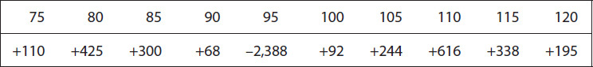

<!-- source:block cbb43c1291a5dfa0 -->

> [!quote]- English 134
> Even if the total gamma risk is relatively small (indeed, the total gamma in this case is 0), the fact that such a large negative gamma is concentrated at one exercise price, 95, is likely to be of concern to the market maker. If these are long-term options, the situation may not be critical today. But as time passes, if the underlying market approaches 95, the position will take on increasingly greater risk. Rather than let this risk increase, an intelligent market maker will focus on spreading out his risk more evenly across exercise prices. In the same way that a wise investor will seek to diversify his risk, a market maker will strive for a similar goal.

即使总Gamma风险相对较小（事实上，这种情况下的总Gamma为0），如此大的负Gamma集中在一个行权价95上的事实也可能会引起做市商的担忧。如果这些都是长期选择，那么今天的情况可能并不危急。但随着时间的推移，如果标的市场接近95，该头寸将面临越来越大的风险。聪明的做市商不会让这种风险增加，而是专注于在行权价中更均匀地分散风险。就像明智的投资者寻求分散风险一样，做市商也会努力实现类似的目标。

<!-- source:block 083638aea4bd2fd3 -->

> [!quote]- English 135
> In this example, the risk was concentrated at one exercise price. But any concentration of risk at a specific exercise price or expiration date or in terms of a single large risk sensitivity should be a cause for concern. It may not always be feasible because market conditions do not always cooperate, but a market maker’s ultimate objective should be to diversify his position as much as possible.

在本例中，风险集中在一个行权价。但任何风险集中在特定的行权价或到期日或单一的较大风险敏感性方面都应该引起担忧。这可能并不总是可行的，因为市场条件并不总是合作，但做市商的最终目标应该是尽可能多元化他的头寸。

<!-- source:block f2f00e0ceebfb3f8 -->

> [!quote]- English 136
> Consider the stock option position shown in Figure 21-14. This position does not fall into any easily recognizable category and represents the type of mixed collection of options that a market maker might accumulate over time as a result of buying and selling by customers.7 The current market conditions (i.e., underlying share price, time to expiration, implied volatility, and expected dividends) are also shown in Figure 21-14.

考虑图21-14中所示的股票期权头寸。该头寸不属于任何容易识别的类别，代表做市商可能因客户买卖而随着时间的推移而积累的混合期权集合类型。[^ovp21-7]当前市场状况（即，标的股价、到期时间、隐含波动率和预期股息）也显示在图21-14中。

<!-- source:block 0ce7f4b3d147fa18 -->

*图21-14 / Figure 21-14*

<!-- source:block 531ed913ddfa7289 -->

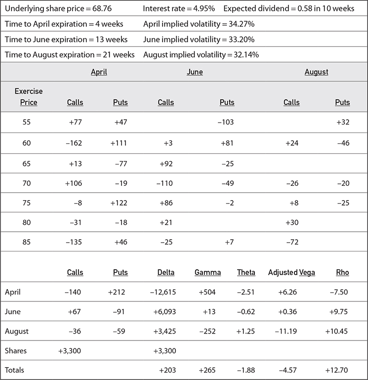

<!-- source:block ea2a06818d5d58cc -->

> [!quote]- English 138
> To fully analyze the position, we will need to make some assumptions about the term structure of implied volatility. Here we will assume that April is the primary month and that the mean volatility for this market is 30 percent. We will also assume that the implied volatility for June changes at 75 percent of the rate of change in April and the implied volatility for August changes at 50 percent of the rate of change in April.8 We can see that the current implied volatilities are consistent with this term structure:

为了充分分析头寸，我们需要对隐含波动率的期限结构做出一些假设。在这里，我们假设四月是主要月份，并且该市场的平均波动率为30%。我们还假设6月份的隐含波动率变化为4月份变化率的75%，8月份的隐含波动率变化为4月份变化率的50%。[^ovp21-8]我们可以看到当前的隐含波动率与此期限结构一致：

<!-- source:block be450e519d6d5c91 -->

> [!quote]- English 139
> April (primary month) implied volatility = 34.27%

$$
\text{April} (\text{primary month}) \text{implied volatility} = 34.27\%
$$

<!-- source:block db67985af9e20eed -->

> [!quote]- English 140
> Difference from the mean = 34.27% – 30.00% = 4.27%

$$
\text{Difference from the mean} = 34.27\% - 30.00\% = 4.27\%
$$

<!-- source:block 383df1124478047b -->

> [!quote]- English 141
> June implied volatility = 33.20%

$$
\text{June implied volatility} = 33.20\%
$$

<!-- source:block 4a3c1187c894cf68 -->

> [!quote]- English 142
> Difference from the mean = 33.20% – 30.00% = 3.20% ≈ 0.75 × 4.27%

$$
\text{Difference from the mean} = 33.20\% - 30.00\% = 3.20\% \approx 0.75 \times 4.27\%
$$

<!-- source:block b97b749a515cc6de -->

> [!quote]- English 143
> August implied volatility = 32.14%

$$
\text{August implied volatility} = 32.14\%
$$

<!-- source:block 1178259f0f25553a -->

> [!quote]- English 144
> Difference from the mean = 32.14% – 30.00% = 2.14% ≈ 0.50 × 4.27%

$$
\text{Difference from the mean} = 32.14\% - 30.00\% = 2.14\% \approx 0.50 \times 4.27\%
$$

<!-- source:block bb8baa73a24305de -->

> [!quote]- English 145
> The primary risk characteristics of the position9—theoretical profit and loss (P&L), delta, gamma, and vega—are shown in Figures 21-15 through 21-18.10 From these graphs, it is evident that the risks of the position can change significantly as market conditions change, with the delta, gamma, and vega gyrating between positive and negative. Given this, how should we analyze the position?

头寸的主要风险特征-理论损益（P&L）、Delta、Gamma和Vega-如图21-15至21-18所示。 从这些图表中可以明显看出，头寸的风险会随着市场条件的变化而显著变化，Delta、Gamma和Vega在正负之间旋转。鉴于此，我们应该如何分析头寸呢？ [^ovp21-9] [^ovp21-10]

<!-- source:block c607052f0aaf1f4c -->

*图21-15随着标的价格和波动率变化的头寸价值。 / Figure 21-15 Position value as the underlying price and volatility change.*

<!-- source:block d1443f36f12d4896 -->

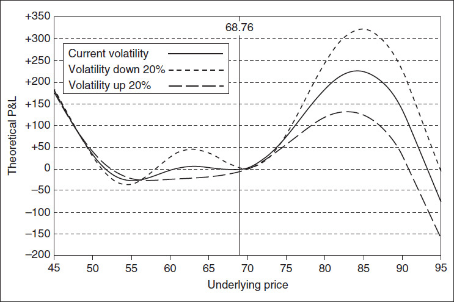

<!-- source:block 0e1a2322bbed728c -->

*图21-16标的价格和波动率变化时的头寸Delta。 / Figure 21-16 Position delta as the underlying price and volatility change.*

<!-- source:block 5c0768af6209ff79 -->

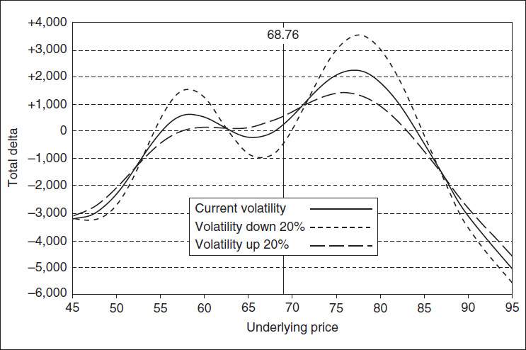

<!-- source:block 2fead6761f4c847a -->

*Figure 21-17 Position gamma as the underlying price and volatility change. / Figure 21-17 Position gamma as the underlying price and volatility change.*

<!-- source:block a85435f94c0ba6c9 -->

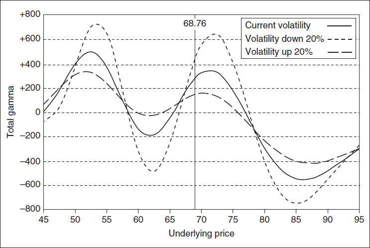

<!-- source:block 0074e6087a46c8f7 -->

*图21-18随着标的价格和波动率变化而定位vega。 / Figure 21-18 Position vega as the underlying price and volatility change.*

<!-- source:block 6e6f68524ed15668 -->

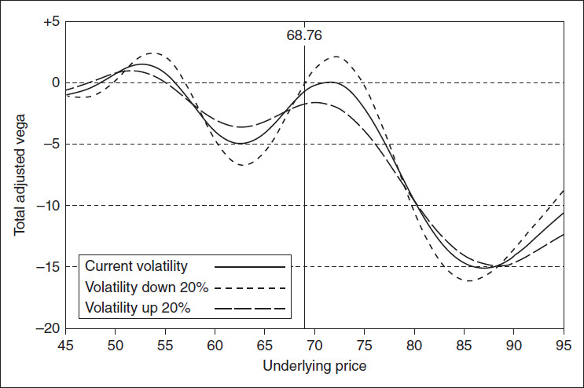

<!-- source:block 0de7cb7fc321baa2 -->

> [!quote]- English 150
> A market maker’s ultimate goal is to establish positions with a positive profit expectation while intelligently managing risk. Indeed, were it not for the complexities of the marketplace and the unique characteristics of options, a market maker’s life might be thought of as quite boring because he is trying to do the same thing over and over:

做市商的最终目标是建立具有积极利润预期的头寸，同时明智地管理风险。事实上，如果不是市场的复杂性和期权的独特性，做市商的生活可能会被认为相当无聊，因为他一遍又一遍地试图做同样的事情：

<!-- source:block c763a5b5e33a4042 -->

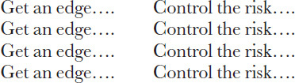

<!-- 原 EPUB 中此公式为图片，已原样保留 -->

<!-- source:block 53cc8c4090e477e3 -->

> [!quote]- English 151
> Once a position with a positive theoretical edge has been established, the market maker ideally would like to reduce all risks to 0 without giving up any potential profit. This would be identical to turning the graph in Figure 21-15 into a single horizontal line with a positive theoretical P&L. In reality, with a large and complex position, it is virtually impossible to achieve such a goal. A more practical approach is to ask what changes in market conditions represent the greatest immediate threat to the position and what steps can be taken to mitigate those risks. Even this will depend on many subjective factors: the trader’s appetite for risk, his capitalization, the extent of his trading experience, and his familiarity with the market. Unfortunately, there are very few easy answers when it comes to risk analysis.

一旦建立了具有积极理论优势的头寸，做市商理想情况下希望将所有风险降低到0，而不放弃任何潜在利润。这与将图21-15中的图表变成一条理论损益为正的水平线相同。事实上，头寸大而复杂，几乎不可能实现这样的目标。一种更实际的方法是询问市场状况的哪些变化对头寸构成最大的直接威胁，以及可以采取哪些措施来降低这些风险。即便如此，这也取决于许多主观因素：交易员的风险偏好、他的资本化、他的交易经验程度以及他对市场的熟悉程度。不幸的是，在风险分析方面，几乎没有简单的答案。

<!-- source:block 8304c448b49692c3 -->

> [!quote]- English 152
> Some risk limitations will be set by the firm for which the trader works or by the trader’s clearing firm. For example, a clearing firm may require that a trader maintain enough capital to withstand a 20 percent move in the underlying contract in either direction. Or the firm may require enough capital to withstand a doubling of implied volatility. If the trader currently has insufficient capital to meet these requirements, he must either deposit additional money with the clearing firm or reduce the size of the position so that it falls within the clearing firm’s guidelines.

一些风险限制将由交易员工作的公司或交易员的清算公司设定。例如，清算公司可能要求交易员维持足够的资本，以承受标的合约在任何方向上20%的变动。或者公司可能需要足够的资本来承受隐含波动率的翻倍。如果交易员目前没有足够的资本来满足这些要求，他必须向清算公司存入额外资金或减少头寸规模，使其符合清算公司的指导方针。

<!-- source:block 9bbc4162106f1800 -->

> [!quote]- English 153
> How should we analyze the risk of the position in Figure 21-14? Risk analysis is important because it enables a trader to plan ahead—to decide what course of action is best—given a change in market conditions. An option trader may have to consider many different market scenarios, but it is often best to begin with three basic questions:

我们应该如何分析图21-14中头寸的风险？风险分析是重要的，因为它使交易者能够提前计划，以决定什么样的行动方案是最好的，给定的市场条件的变化。期权交易者可能必须考虑许多不同的市场情景，但通常最好从三个基本问题开始：

<!-- source:block 085632e9d618e45f -->

> [!quote]- English 154
> 1. What will I do if market conditions move against me?

1.如果市场状况对我不利，我该怎么办？

<!-- source:block 8364342379759a6b -->

> [!quote]- English 155
> 2. What will I do if market conditions move in my favor? (Risk analysis should focus not only on protecting against the bad things that might occur but also on taking advantage of the good things.)

2.如果市场状况对我有利，我该怎么办？(Risk分析不仅应该关注预防可能发生的坏事，还应该关注利用好事。）

<!-- source:block 0c06ad38e3a2e5bc -->

> [!quote]- English 156
> 3. What can I do now to avoid the adverse effects of conditions moving against me at a later time?

3.我现在可以做些什么来避免以后对我不利的情况的不利影响？

<!-- source:block 0937590e66e65950 -->

> [!quote]- English 157
> What are the bad things that can happen to the position? Clearly, the greatest threat is a violent upward move. Above a stock price of 85, the position will take on a negative delta and from that point on will continue to lose money as the market rises (Figures 21-15 and 21-16). The upside contract position (the sum of all calls and underlying contracts) is –76.

该头寸可能发生哪些不好的事情？显然，最大的威胁是暴力的上升。股价高于85时，该头寸将呈现负Delta，从那时起，随着市场上涨，该头寸将继续亏损（图21-15和21-16）。上行合约头寸（所有看涨合约和标的合约的总和）为-76。

<!-- source:block e61236cb054fba46 -->

> [!quote]- English 158
> With a current delta of +203, there is also some risk of a declining stock price. This may not be of immediate concern, but note that as the stock price declines toward 62, the position takes on an increasingly negative vega (Figure 21-18). This means that the position is at risk if the stock price falls moderately while implied volatility rises.

由于当前的Delta为+203，也存在一定的股价下跌风险。这可能不是一个直接问题，但请注意，随着股价下跌至62，该头寸Vega 变得越来越负（图21-18）。这意味着，如果股价温和下跌而隐含波动率上升，该头寸就面临风险。

<!-- source:block 307f40d9f7930948 -->

> [!quote]- English 159
> In Figure 21-17, we can see that the position has a maximum positive gamma at stock prices of approximately 53 and 72. If the market were to approach either of these prices and remain there, the position would most likely take on its maximum negative theta and consequently begin to decay very rapidly.

在图21-17中，我们可以看到该头寸在股价约为53和72时具有最大正Gamma。如果市场接近这两个价格中的任何一个并保持在那里，该头寸很可能会达到最大负Theta，并因此开始迅速衰退。

<!-- source:block 6334151150c3c2a4 -->

> [!quote]- English 160
> Given the various risks, what should be the immediate concern? The answer must necessarily be subjective and will depend on what this trader knows about the characteristics of this stock. If there is some possibility of a really large upward move, for example, the company is a takeover target, it is incumbent on the trader to cover at least some of his upside risk, perhaps by purchasing higher-exercise-price calls. Admittedly, if the prices of the upside calls are inflated because the company is known to be a takeover target, the cost of protecting the upside may be high. But, if a takeover could result in the trader’s demise, this may be a price that he will have to pay.

考虑到各种风险，当务之急应该是什么？答案一定是主观的，并且取决于交易员对该股票特征的了解。如果存在某种真正大幅上涨的可能性，例如，该公司是收购目标，那么交易员有责任至少弥补部分上行风险，也许可以通过购买更高的行权价看涨期权。诚然，如果由于该公司被认为是收购目标而导致上涨看涨期权的价格被夸大，那么保护上涨的成本可能会很高。但是，如果收购可能导致交易员死亡，这可能是他必须付出的代价。

<!-- source:block ec96064636a59574 -->

> [!quote]- English 161
> Of course, the trader may believe that a large upward move is so unlikely that he is willing to accept the risk. Then he may want to focus on some of the lesser threats to the position. If he is a disciplined theoretical trader, he may want to cover his current delta position of +203, although this too may represent such a small risk that it is not of immediate concern. Otherwise, he may want to sell approximately 200 deltas in some form—sell stock, sell calls, or buy puts. The last choice, buying puts, especially those with exercise prices of 60 or 65, will have the effect not only of reducing the delta but also reducing the negative vega in the range of 60 to 65. If given the choice, the purchase of April 60 or 65 puts will probably show the greatest benefit to the position. If the stock price does decline to between 60 and 65, these options will be at the money, and at-the-money short-term options have the greatest gamma. As such, they will do the most to offset the negative gamma in this range.

当然，交易者可能会认为大幅上涨的可能性太大，以至于他愿意接受风险。然后他可能想专注于该头寸面临的一些较小威胁。如果他是一名纪律严明的理论交易员，他可能想弥补当前+203的Delta头寸，尽管这也可能代表着一个很小的风险，因此无需立即关注。否则，他可能想以某种形式出售大约200个Delta——卖出股票、卖出看涨期权或买入看跌期权。最后的选择是购买看跌期权，尤其是那些行权价为60或65的看跌期权，不仅会降低Delta，还会降低60至65范围内的负Vega。如果可以选择，购买4月60日或65日看跌期权可能会对头寸表现出最大的好处。如果股价确实下跌至60至65之间，这些期权将是平值的，而平值的短期期权的Gamma最大。因此，他们将尽最大努力抵消该范围内的负Gamma。

<!-- source:block 5b1cce86b2926bd8 -->

> [!quote]- English 162
> What changes in market conditions might help the position? Below a stock price of 55, the position will take on a negative delta, so a collapse in the stock price will obviously prove beneficial. The downside contract position (the sum of all puts and underlying contracts) is –29. If the stock price should climb toward 85, especially with falling implied volatility, this will also be very favorable. Indeed, almost any decline in implied volatility will help the position, as shown by the vega in Figure 21-18.

市场状况的哪些变化可能对头寸有所帮助？股价低于55时，头寸将呈现负Delta，因此股价暴跌显然将被证明是有利的。下跌合约头寸（所有看跌合约和标的合约的总和）为-29。如果股价攀升至85，特别是隐含波动率下降，这也将非常有利。事实上，隐含波动率的几乎任何下降都会帮助头寸，如图21-18中的Vega所示。

<!-- source:block 71191f6e1794546d -->

> [!quote]- English 163
> Even though time decay may not be an immediate concern, it may still be worth considering how the passage of time will affect the position. The position has a negative theta (consistent with a positive gamma), so the passage of time will work against the position if there is no change in the underlying stock price. The total theta of –1.90 may be small, but note that most of the theta is concentrated in April. And the April position consists of a large long position in April 70 calls. As time passes, the theta of these options, which are close to at the money, will accelerate, causing the position to lose value at an increasingly greater rate. If the market remains close to 70, it is also likely that there will be a decline in implied volatility. Given the position’s negative vega, this will work in the position’s favor. Still, it may be worth thinking about what action to take if the stock price remains close to 70. The value of the position after the passage of one and two weeks is shown in Figure 21-19.

尽管时间衰减可能不是一个直接的问题，但仍然值得考虑时间的流逝将如何影响头寸。 该头寸具有负的Theta（与正的Gamma一致），因此，如果标的股价没有变化，时间的推移将对头寸不利。-1.90的总Theta可能很小，但请注意，大部分Theta集中在四月。 四月头寸由四月70看涨中的大额多头头寸组成。随着时间的推移，这些接近ATM的期权的Theta将会加速，导致头寸以越来越大的速度贬值。 如果市场保持接近70,，隐含波动率也可能会下降。鉴于该头寸的负Vega，这将对该头寸有利。尽管如此，如果股价仍接近70，可能值得考虑采取什么行动。 一周和两周后的头寸值如图21-19所示。

<!-- source:block 899b1e68999cdcd1 -->

*图21-19随着标的价格变化和时间推移的头寸价值。 / Figure 21-19 Position value as the underlying price changes and time passes.*

<!-- source:block fac0b15df854b7bc -->

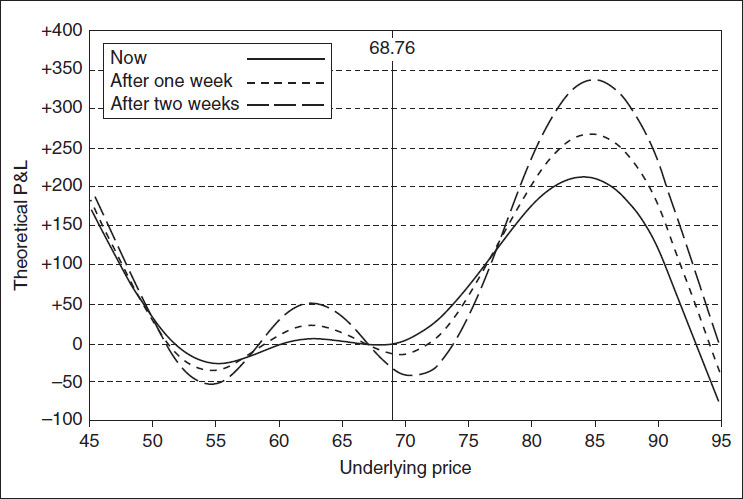

<!-- source:block 0fb755b75f26dc5d -->

> [!quote]- English 165
> What else might hurt this position? We have assumed that the stock will pay a dividend of 0.58 in 10 weeks. If the company has not officially announced the dividend, perhaps the actual dividend will be more than or less than this amount. The April options, which expire in four weeks, will be unaffected by a change in the dividend. But how will the overall position be affected? We can run a computer simulation at higher or lower dividend amounts, but perhaps an easier approach is to note that the position is long 3,300 shares of stock. Because we own stock and therefore receive the dividend, any increase in the dividend will cause the position value to rise, and any decrease will cause the position value to fall. The change in value will be approximately equal to the change in the dividend multiplied by the number of shares of stock, in this case, 3,300.

还有什么可能伤害这个头寸？我们假设股票在10周内支付0.58的股息。如果公司还没有正式宣布分红，也许实际分红会比这个数额多或少。4月份的期权将在四周内到期，不会受到股息变化的影响。但整体头寸会受到怎样的影响呢？我们可以在更高或更低的股息金额下运行计算机模拟，但也许一种更简单的方法是注意头寸是多头3,300股股票。因为我们拥有股票并因此获得股息，股息的任何增加都会导致头寸价值上升，而任何减少都会导致头寸价值下降。价值变化大约等于股息变化乘以股票数量，在这种情况下为3,300股。

<!-- source:block 0d58caadd07ae52e -->

> [!quote]- English 166
> If there is a real possibility that the dividend will be reduced, one way to eliminate the risk is to replace the long stock position with synthetic long stock: sell the stock, and buy calls and sell puts at the same exercise price. This is similar to reducing the risk of a conversion or reverse conversion by turning the position into a box (see Chapter 15).

如果股息确实有可能减少，消除风险的一种方法是用合成多头股票取代多头股票头寸：出售股票，并以相同的行权价购买看涨期权和卖出看跌期权。这类似于通过将头寸变成一个方框来降低转换或反向转换的风险（参见第15章）。

<!-- source:block 7760fb5d7e0a6939 -->

> [!quote]- English 167
> The total rho of +12.70 also indicates that there is some risk of falling interest rates. For each full-point decline (100 basis points11) in interest rates, the position value will fall by 12.70.

+12.70的总Rho也表明存在一定的利率下降风险。利率每下降一整点（100个基点[^ovp21-11]），头寸价值将下降12.70。

<!-- source:block f695f765f1ed90fd -->

> [!quote]- English 168
> It is usually easiest to analyze risk by generating graphs of a position’s characteristics, as we have done in Figures 21-15 to 21-19. However, some traders prefer to create a table showing the risk sensitivities at various underlying prices. This has been done in Figure 21-20, beginning with a stock price of 45 and continuing at five-point increments up to a stock price of 95. The table includes not only the traditional risk measures but also the nontraditional higher-order measures discussed in Chapter 9. These higher-order measures can often give a trader a more complete picture of how the risks of his position will change as market conditions change. For convenience, we list these measures below:

通过生成头寸特征的图表来分析风险通常是最简单的，正如我们在图21-15至21-19中所做的那样。然而，一些交易员更喜欢创建一个表格，显示各种标的价格的风险敏感性。这是在图21-20中完成的，从股价45开始，继续以五个百分点的增量，直到股价95。该表不仅包括传统的风险指标，还包括第9章讨论的非传统的更高级指标。这些更高级的指标通常可以让交易者更完整地了解他的头寸风险将如何随着市场条件的变化而变化。为方便起见，我们将这些措施列出如下：

<!-- source:block 3ace2803f1170d23 -->

*图21-20标的价格变化时的风险敏感性 / Figure 21-20 Risk sensitivities as the underlying price changes*

<!-- source:block 0f4900203324d1eb -->

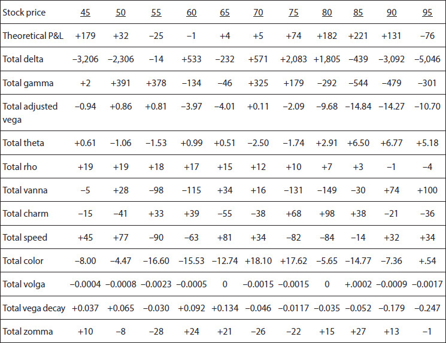

<!-- source:block 3f3c8ca9d9fd10a6 -->

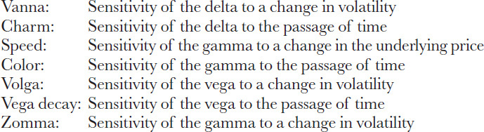

<!-- 原 EPUB 中此公式为图片，已原样保留 -->

<!-- source:block 54d08e2c8a4fd4b2 -->

## 股票拆分 / Stock Splits

<!-- source:block 9e1d4810674aab36 -->

> [!quote]- English 170
> To conclude our discussion, let’s consider one last change in market conditions—a stock split. This often happens when a company wants to reduce its stock price to promote trading in the stock or to encourage wider ownership of the stock. If the stock price remains high, trading activity tends to be limited, with ownership of the stock concentrated in fewer hands.

为了结束我们的讨论，让我们考虑市场状况的最后一个变化——股票分割。当公司希望降低股价以促进股票交易或鼓励更广泛的股票所有权时，这种情况通常会发生。如果股价保持高位，交易活动往往会受到限制，股票所有权集中在更少的人手中。

<!-- source:block 4fce5e48ce21a83f -->

> [!quote]- English 171
> Suppose that the stock in our example splits 2 for 1, resulting in a new stock price of 68.76/2 = 34.38. What will happen to the position? Where the trader previously owned 3,300 shares, he will now own 2 × 3,300 = 6,600 shares. To maintain the same relationship between each exercise price and the stock price, as a result of the split, the clearinghouse will divide all the exercise prices by 2. The 55 exercise price will become 27½, the 60 exercise price will become 30, and so on. The underlying contract will remain 100 shares of stock, but in order to maintain equity, the clearinghouse will double the trader’s position at each exercise price. Instead of being long 77 April 55 calls, the trader will now be long 154 April 27½ calls. Instead of being short 162 April 60 calls, the trader will now be short 324 April 30 calls.

假设例中的股票按 2 比 1 拆分，新股价变为 $68.76 / 2 = 34.38$。头寸将怎样调整？交易员原来持有 3,300 股，拆分后将持有 $2 \times 3{,}300 = 6{,}600$ 股。为保持各行权价与股价之间的相对关系，清算所会把所有行权价除以 2：55 变为 27½，60 变为 30，依此类推。每份标的合约仍对应 100 股，但为保持头寸权益不变，清算所会将交易员在各行权价上的合约数量加倍：`long 77 April 55 calls` 调整为 `long 154 April 27½ calls`；`short 162 April 60 calls` 调整为 `short 324 April 30 calls`。

<!-- source:block 3102ca35f20092aa -->

> [!quote]- English 172
> How will the trader’s risk position look now? In order to understand what happens, let’s consider a simple example. With an underlying stock trading at 60.00, we own a May 60 call with a delta of 50 and a gamma of 5. If the stock splits 2 for 1, our position will now be

交易者现在的风险头寸如何？为了了解会发生什么，让我们考虑一个简单的例子。由于标的股票交易价格为60.00，因此我们拥有5 月到期、行权价为 60 的看涨期权，Delta为50，Gamma为5。如果股票分成2比1，我们现在的头寸将是

<!-- source:block 19631a65a60143d2 -->

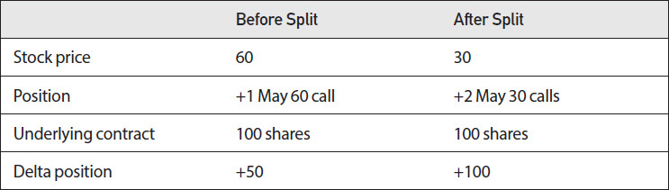

<!-- source:block 9205e5bfa5faa5f7 -->

> [!quote]- English 173
> Because the option is still at the money, the delta will be 50. But now we own two calls, so our delta position will double to +100.

由于该期权仍然是ATM，因此Delta将为50。但现在我们拥有两个看涨期权，因此我们的Delta头寸将加倍为+100。

<!-- source:block 7c0cdb044014924f -->

> [!quote]- English 174
> What about the gamma? Because the gamma is the change in delta per point change in the underlying stock price, if we can determine the new delta position at a stock price of 31, we will know the gamma. Suppose that the stock price rises to 31. This is equivalent to the stock price rising to 62 prior to the split. At a stock price of 62 (prior to the split), our delta position would have been +50 + (2 × 5) = +60. But the stock split caused our delta to double, so the new delta position at a stock price of 31 must be 2 × +60 = +120. If the delta rises from 100 to 120 with a stock price change from 30 to 31, the gamma of the position must be +20.

Gamma呢？因为Gamma是标的股价每一点变化时的Delta变化，如果我们可以在股价为31时确定新的Delta头寸，我们就会知道Gamma。假设股价上涨到31。这相当于分拆前股价上涨至62。如果股价为62（分拆之前），我们的Delta头寸应为+50 +（2 × 5）=+60。但股票分拆导致我们的Delta翻倍，因此股价为31时的新Delta头寸必须是2 x +60 =+120。如果Delta从100上升到120，股价从30变化到31，则头寸的Gamma必须为+20。

<!-- source:block 5893757fd10c7c85 -->

> [!quote]- English 175
> If a stock splits *Y* for *X* (each *X* number of shares will be replaced with *Y* number of shares), we can summarize the new conditions as follows:

如果一只股票将Y拆分为X（每个X数量的股票将被Y数量的股票替换），我们可以将新条件总结如下：

<!-- source:block 690558df00ac9ce6 -->

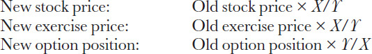

<!-- 原 EPUB 中此公式为图片，已原样保留 -->

<!-- source:block 4ae5c32e02a7d61d -->

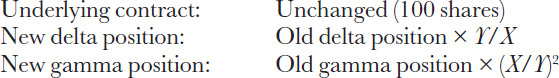

<!-- 原 EPUB 中此公式为图片，已原样保留 -->

<!-- source:block af75665ddc0396bf -->

> [!quote]- English 176
> These calculations hold true as long as the split is *Y* for 1, where *Y* is a whole number (e.g., 2 for 1, 3 for 1, 4 for 1, etc.). If *Y* is not a whole number, the number of shares in the underlying contract may have to be adjusted. For example, using our stock price of 60, what will happen if the stock is split 3 for 2? Now *Y* is not a whole number because the split is equivalent to 1½ to 1. If we own a May 60 call, we can make the following calculations:

只要分裂是Y = 1，这些计算就成立，其中Y是一个总数（例如，2对1、3对1、4对1等）。如果Y不是整数，则标的合约中的股份数量可能必须调整。例如，以我们的股价为60，如果股票分成3比2会发生什么？现在Y不是一个完整的数字，因为分裂相当于1½比1。如果我们拥有5 月到期、行权价为 60 的看涨期权，我们可以进行以下计算：

<!-- source:block 32b8d2a8b1fa438b -->

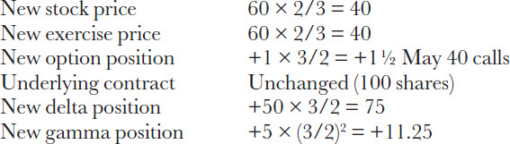

<!-- 原 EPUB 中此公式为图片，已原样保留 -->

<!-- source:block 56586d64fb5d1c21 -->

> [!quote]- English 177
> The problem here is that the clearinghouse does not allow fractional option positions (+1½ May 40 calls). In order to eliminate the fraction, the clearinghouse will replace each May 60 call before the split with one May 40 call after the split. At the same time, the underlying contract will be adjusted so that the new underlying contract is equal to the old underlying contract multiplied by the split ratio

这里的问题是，票据交换所不允许分数期权头寸（+1½ 5 月到期、行权价为 40 的看涨）。为了消除这一部分，清算所将在拆分前用一个5 月到期、行权价为 40 的看涨期权取代每个5 月到期、行权价为 60 的看涨期权。同时，标的合约将进行调整，使新标的合约等于旧标的合约乘以拆分比例

<!-- source:block da3c1ce37bb2660c -->

> [!quote]- English 178
> 100 shares × 3/2 = 150 shares

$$
100 \text{shares} \times 3/2 = 150 \text{shares}
$$

<!-- source:block 47648629ff8652a7 -->

> [!quote]- English 179
> Using these adjustments, the delta and gamma now make sense. The option is at the money, so it should be equivalent to approximately 50 percent of the underlying contract, or 75 shares. If the stock price rises to 41, equal to a price of 61½ before the split, the old delta would have been

使用这些调整，Delta和Gamma现在就有意义了。期权是平值的，因此它应该相当于标的合约的约50%，即75股。如果股价上涨至41，相当于分拆前的61½，那么旧Delta将是

<!-- source:block 9f3174f06986c258 -->

> [!quote]- English 180
> 50 + (1.5 × 5) = 57.5

$$
50 + (1.5 \times 5) = 57.5
$$

<!-- source:block edfbdf3fd7949a39 -->

> [!quote]- English 181
> The option would have been equivalent to 57.5 percent of the underlying contract. Therefore, the new option (the 40 call) should be equivalent to

该期权相当于标的合约的57.5%。因此，新期权（40看涨期权）应该相当于

<!-- source:block b9019ee3a8f33074 -->

> [!quote]- English 182
> 0.575 × 150 shares = 86.25 shares

$$
0.575 \times 150 \text{shares} = 86.25 \text{shares}
$$

<!-- source:block ee06479d59549842 -->

> [!quote]- English 183
> As expected, this is the same as the delta (75) plus the gamma (11.25).

正如预期的那样，这与Delta（75）加上Gamma（11.25）相同。

<!-- source:block 7db848ab31fe1a6b -->

> [!quote]- English 184
> What happens to the other risk measures—theta, vega, and rho—if a stock splits? These numbers remain unchanged. The passage of time, changes in volatility, and changes in interest rates have the same effect on a position after a split as before a split. Only the delta and gamma must be adjusted. Indeed, assuming that all other conditions remain unchanged, a stock split has no real effect on a trader’s position. It simply results in an accounting change in such a way that equity is maintained. Of course, all other conditions may not remain unchanged. When a stock splits, we might assume that the dividend also will be split proportionally. But this is not necessarily the case. A stock split often indicates that a company is doing well, and it is not unusual for the split to be accompanied by an increase in the dividend. Any change in the expected dividend will change the value of an option position. Figure 21-21 shows the characteristics of our original position after a 2-for-1 stock split with no change in the expected dividend.

如果股票分裂，其他风险指标（Theta、Vega和Rho）会发生什么？这些数字保持不变。时间的推移、波动率的变化和利率的变化对拆分后的头寸产生的影响与拆分前相同。仅必须调整Delta和Gamma。事实上，假设所有其他条件保持不变，股票分割对交易员的头寸没有实际影响。它只会导致会计变更，以维持公平。当然，所有其他条件也不一定保持不变。当股票拆分时，我们可能会假设股息也将按比例拆分。但事实并非如此。股票分拆通常表明一家公司经营良好，分拆伴随股息增加的情况并不罕见。预期股息的任何变化都将改变期权头寸的价值。图21-21显示了我们在预期股息没有变化的情况下进行2对1股票分拆后原始头寸的特征。

<!-- source:block c33588680d11e02b -->

*图21-21 2对1股票分割的影响。 / Figure 21-21 The effect of a 2-for-1 stock split.*

<!-- source:block 10fb9d35fc877f9e -->

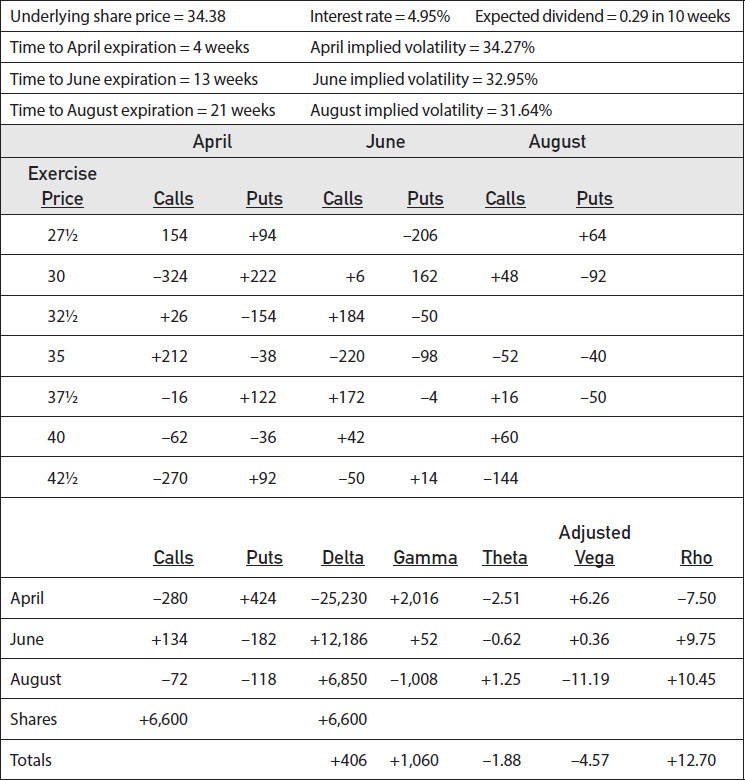

<!-- source:block 5e80034939d407d3 -->

> [!note] Footnote 186
> 1 In order to focus on the volatility characteristics of the positions, we assume an interest rate of 0 in this and other examples.

[^ovp21-1]: 为了专注于头寸的波动率特征，我们在这个和其他示例中假设利率为0。

<!-- source:block a789bf65a8e28d96 -->

> [!note] Footnote 187
> 2 Some readers may recognize this position as a *risk reversal* or *split strike conversion*. More on this in Chapter 24.

[^ovp21-2]: 一些读者可能将此头寸视为风险逆转或分裂罢工转换。第24章将详细介绍这一点。

<!-- source:block bff33f521d85863e -->

> [!note] Footnote 188
> 3 The position is, of course, not currently delta neutral. If we want to dynamically hedge the position, we must begin by offsetting the current delta of –297, perhaps by purchasing three underlying contracts.

[^ovp21-3]: 当然，目前该头寸并非Delta中立。如果我们想动态对冲头寸，我们必须首先抵消当前的-297 Delta，也许可以通过购买三份标的合约来进行。

<!-- source:block 3f5b71a016c7b2f5 -->

> [!note] Footnote 189
> 4 Customers sometimes believe that market makers “fix” the prices of exchange-traded contracts. This may be true for short periods of time, usually at the beginning of the trading day when very little information is available. Ultimately, however, a market maker’s quotes reflect current market activity. A market maker does not set prices any more than a thermometer sets the temperature.

[^ovp21-4]: 客户有时认为做市商“固定”了交易所交易合约的价格。这可能在短时间内是如此，通常是在交易日开始时，可用的信息很少。然而，最终，做市商的报价反映了当前的市场活动。做市商不会设定价格，就像温度计不会设定温度一样。

<!-- source:block 842fb7118573f8ef -->

> [!note] Footnote 190
> 5 A trader who tries to profit solely from the bid-ask spread, buying at the bid price and selling at the ask price without regard to theoretical value, is sometimes referred to as a *scalper*. Scalping is a common trading technique in open-outcry markets.

[^ovp21-5]: 仅试图从买卖价差中获利、按买价买入并按卖价卖出而不考虑理论价值的交易者，有时称为“剥头皮交易者”。剥头皮交易是公开喊价市场中常见的交易手法。

<!-- source:block e8a2c528448c7d45 -->

> [!note] Footnote 191
> 6 In this case, the market maker has a positive speed position. His gamma position becomes more positive or less negative as the price of the underlying contract rises.

[^ovp21-6]: 在这种情况下，做市商的速度头寸为正。随着标的合约价格的上涨，他的Gamma头寸变得更加积极或减弱负面。

<!-- source:block bf4d59d5229aa2bd -->

> [!note] Footnote 192
> 7 An active market maker’s position is likely to be much larger than the position shown, with hundreds or even thousands of options at each exercise price. For simplicity, the position shown has been scaled down. But the risk-analysis process will be the same.

[^ovp21-7]: 活跃的做市商的头寸很可能比显示的头寸大得多，每个行权价有数百甚至数千个期权。为简单起见，所示头寸已按比例缩小。但风险分析过程是一样的。

<!-- source:block b5093070ef8a106d -->

> [!note] Footnote 193
> 8 We might also make assumptions about the term structure of interest rates, as well as how implied volatility is distributed across exercise prices. In order not to overly complicate the current example, we will assume a constant interest rate across expiration months, as well as uniform implied volatilities across exercise prices. We leave the discussion of *volatility skews* to a later chapter.

[^ovp21-8]: 我们还可能对利率的期限结构以及隐含波动率如何在行权价中分布做出假设。为了不使当前的例子过于复杂，我们将假设到期月份的利率不变，以及行权价的一致隐含波动率。我们将对波动率的讨论留给后面的章节。

<!-- source:block d313e2a612cb9723 -->

> [!note] Footnote 194
> 9 In this example, we have assumed that the options are European and have made all calculations using the Black-Scholes model. The risk-analysis process would be the same if the options were American, although the calculations necessarily would have to be made using an American pricing model.

[^ovp21-9]: 在这个例子中，我们假设期权是欧洲的，并使用Black-Scholes模型进行了所有计算。如果期权是美国的，风险分析过程将是相同的，尽管计算必须使用美国定价模型进行。

<!-- source:block 939d8daab211c86e -->

> [!note] Footnote 195
> 10 Because of the term structure of volatility, the changes in volatility in Figures 21-15, through 21-18 are expressed in percent terms rather than percentage points. Given our assumptions (i.e., mean volatility = 30 percent, June implied volatility changes 75 percent as fast as April, August implied volatility changes 50 percent as fast as April), a 20 percent increase in volatility from the current levels results in

[^ovp21-10]: 由于波动率的期限结构，图21-15至图21-18中的波动率变化以百分比而不是百分点表示。鉴于我们的假设（即，平均波动率= 30%，6月隐含波动率变化速度快于4月75%，8月隐含波动率变化速度快于4月50%），波动率比当前水平增加20%，导致

<!-- source:block f876d2054265d413 -->

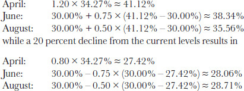

<!-- 原 EPUB 中此公式为图片，已原样保留 -->

<!-- source:block 9994a5b008608dc8 -->

> [!note] Footnote 196
> 11 Traders commonly express changes in interest rates in *basis points*. One basis point is equal to 1/100 of a percentage point, or 0.0001.

[^ovp21-11]: 交易员通常以基点表示利率变化。一个基点等于1/100个百分点，即0.0001。

---

[[阅读导航|← 返回阅读导航]]

<!-- chapter-nav:start -->
> [!tip] 章节导航（章末）
> [[再论波动率 Volatility Revisited|← 上一章]] · [[阅读导航|全书导航]] · [[股票指数期货与期权 Stock Index Futures and Options|下一章 →]]
<!-- chapter-nav:end -->
