# 期权套利 / Option Arbitrage

[[阅读导航|← 返回阅读导航]] · [[翻译说明与术语表|术语表]]

> [!warning] 翻译状态
> 本章为机器初译，并使用本地术语表校验。英文原文、数字、公式和图表用于核对；中文将在后续复核中继续修订。

<!-- chapter-toc:start -->
## 本章目录 / Chapter Outline

> [!abstract] 结构导航
> 以下标题按原书顺序保留；点击可直接跳转。

- [[#期货期权 / Options on Futures|期货期权 / Options on Futures]]
- [[#涨跌停的期货市场 / Locked Futures Markets|涨跌停的期货市场 / Locked Futures Markets]]
- [[#股票期权 / Options on Stock|股票期权 / Options on Stock]]
  - [[#股票期权的近似计算 / An Approximation for Stock Options|股票期权的近似计算 / An Approximation for Stock Options]]
- [[#套利风险 / Arbitrage Risk|套利风险 / Arbitrage Risk]]
  - [[#执行风险 / Execution Risk|执行风险 / Execution Risk]]
  - [[#钉住风险 / Pin Risk|钉住风险 / Pin Risk]]
  - [[#结算风险 / Settlement Risk|结算风险 / Settlement Risk]]
  - [[#利率与股息风险 / Interest and Dividend Risk|利率与股息风险 / Interest and Dividend Risk]]
  - [[#箱式价差 / Boxes|箱式价差 / Boxes]]
  - [[#滚动价差 / Rolls|滚动价差 / Rolls]]
  - [[#时间箱式价差 / Time boxes|时间箱式价差 / Time boxes]]
  - [[#在波动率价差中使用合成头寸 / Using Synthetics in Volatility Spreads|在波动率价差中使用合成头寸 / Using Synthetics in Volatility Spreads]]
<!-- chapter-toc:end -->
<!-- chapter-nav:start -->
> [!tip] 章节导航（章首）
> [[合成头寸 Synthetics|← 上一章]] · [[阅读导航|全书导航]] · [[美式期权的提前行权 Early Exercise of American Options|下一章 →]]
<!-- chapter-nav:end -->
<!-- source:block 8d6a1fe43ef10581 -->

> [!quote]- English 1
> Suppose that we want to take a short position in an underlying contract that is currently trading at 102.00. We can simply sell the underlying contract at 102.00. However, we have an additional choice—we can take a short position synthetically by selling a call and buying a put with the same expiration date and exercise price. Which of these strategies is best? Suppose that we sell the December 100 call for 5.00 and buy the December 100 put for 3.00, for a total credit of 2.00. If the options are European, with no possibility of early exercise, at expiration, we will always sell the underlying contract at 100.00, either by exercising the put or by being assigned on the call. Because we have a credit of 2.00 from the option trades, we are in effect selling the underlying contract at its current price of 102.00. If there are no interest or dividend considerations, the profit or loss resulting from our synthetic position will be identical to the profit or loss resulting from the sale of the underlying contract at 102.00. Indeed, regardless of the individual prices of the December 100 call and put, as long as the price of the December 100 call is exactly 2.00 greater than the price of the December 100 put, the profit or loss will be the same for both positions. This is shown in Figure 15-1.

假设我们想要持有当前交易价格为102.00的标的合约的空头头寸。我们可以简单地在102.00卖出标的合约。 然而，我们还有一个额外的选择——我们可以通过出售看涨期权和购买具有相同到期日和行权价的看跌期权期权来综合持有空头头寸。这些策略中哪一个是最好的？ 假设我们为5.00卖出12月的100 看涨期权，为3.00买入12月的100看跌期权，credit 总额为2.00。 如果期权是欧洲期权，到期时不可能提前行权，我们将始终通过行权看跌期权或在看涨期权上指派来在100.00出售标的合约。 由于我们从期权交易中获得了2.00的 credit，因此我们实际上正在以当前价格102.00出售标的合约。 如果没有利息或股息考虑，我们的合成头寸产生的损益将与在102.00出售标的合约产生的损益相同。 事实上，无论12月100 看涨期权和看跌期权的单个价格如何，只要12月100 看涨期权的价格恰好2.00大于12月100 看跌期权的价格，两个头寸的利润或损失将相同。如图15-1所示。

<!-- source:block 28558acf76ef90c3 -->

*图15-1 / Figure 15-1*

<!-- source:block c00c3dcbfccc0ea3 -->

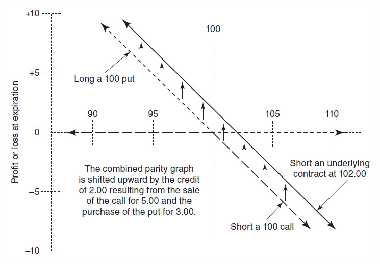

<!-- source:block 791baff5eb27d4a8 -->

> [!quote]- English 3
> Now let’s assume that we already have a synthetic short position:

现在假设我们已经拥有一个合成空头头寸：

<!-- source:block 3c6327ac28b17c4a -->

> [!quote]- English 4
> –1 December 100 call

$$
-1 \text{December} 100 \text{call}
$$

<!-- source:block 9206240716163d57 -->

> [!quote]- English 5
> +1 December 100 put

$$
+1 \text{December} 100 \text{put}
$$

<!-- source:block 585e615b0f4b4f2e -->

> [!quote]- English 6
> If we want to get out of the position, what can we do? We can, of course, close out our synthetic by buying back the December 100 call and selling out the December 100 put. However, we can also offset the synthetic short position by buying the underlying contract.

如果我们想摆脱这个头寸，我们能做什么？当然，我们可以通过回购12 月到期、行权价为 100 的看涨期权并出售12 月到期、行权价为 100 的看跌期权来结束我们的合成股票。然而，我们也可以通过购买标的合约来抵消合成空头头寸。

<!-- source:block 3c6327ac28b17c4a -->

> [!quote]- English 7
> –1 December 100 call

$$
-1 \text{December} 100 \text{call}
$$

<!-- source:block 97a33c8d208fef2f -->

> [!quote]- English 8
> +1 December 100 put

$$
+1 \text{December} 100 \text{put}
$$

<!-- source:block b401e99e007c1c03 -->

> [!quote]- English 9
> +1 underlying contract

$$
+1 \text{underlying contract}
$$

<!-- source:block 9210f11d6929da11 -->

> [!quote]- English 10
> This position, usually referred to as a *conversion*,1 is the most common type of option arbitrage. In a classic arbitrage strategy, a trader will try to buy and sell the same or very closely related contracts in different markets to profit from a mispricing. In a conversion, the trader is buying the underlying contract in the underlying market and selling the underlying contract, synthetically, in the option market. Taken together, the trades make up an arbitrage.

这种头寸（通常称为转换）[^ovp15-1]是最常见的期权套利类型。在经典的套利策略中，交易员会尝试在不同市场上买卖相同或非常密切相关的合约，以从错误定价中获利。在转换中，交易员在标的市场上购买标的合约，并在期权市场上综合出售标的合约。总而言之，这些交易构成了套利。

<!-- source:block 665da5506275d6d0 -->

> [!quote]- English 11
> A trader can also take the opposite position, executing a *reverse conversion* (or *reversal*), by selling the underlying contract and buying it synthetically:

交易员还可以采取相反的头寸，通过出售标的合约并综合购买来执行反向转换（或逆转）：

<!-- source:block 7b98097d836f8730 -->

> [!quote]- English 12
> +1 December 100 call

$$
+1 \text{December} 100 \text{call}
$$

<!-- source:block 642d8a28ab4c8512 -->

> [!quote]- English 13
> –1 December 100 put

$$
-1 \text{December} 100 \text{put}
$$

<!-- source:block 242c4d233800c3e5 -->

> [!quote]- English 14
> –1 underlying contract

$$
-1 \text{underlying contract}
$$

<!-- source:block 16e93cdbb0a4b6cc -->

> [!quote]- English 15
> Summarizing,

总结起来，

<!-- source:block 5acd3e33e98be56a -->

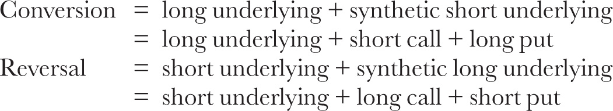

<!-- 原 EPUB 中此公式为图片，已原样保留 -->

<!-- source:block 74700ba314460d5e -->

> [!quote]- English 16
> where the call and put always have the same exercise price and expiration date.

其中看涨和看跌始终具有相同的行权价和到期日期。

<!-- source:block 743de0f57ed56eb2 -->

> [!quote]- English 17
> Whether a trader will want to take either of these positions depends on the prices of the contracts. If the synthetic portion (the long call and short put) is too expensive compared with the underlying contract, a trader will want to do a conversion. If the synthetic portion is too cheap, a trader will want to do a reverse conversion. How can we determine whether the synthetic is mispriced?

交易员是否愿意持有这两种头寸取决于合约的价格。如果合成部分（多头看涨和空头看跌）与标的合约相比太贵，交易员就会想要进行转换。如果合成部分太便宜，交易者就会想要进行反向转换。我们如何确定合成产品是否定价错误？

<!-- source:block bf0d2825ce0ebf29 -->

> [!quote]- English 18
> Let’s begin by assuming that the underlying contract is stock. In a December 100 conversion, we will

让我们首先假设标的合约是股票。在100年12月的转换中，我们将

<!-- source:block d6cfb36710e6a247 -->

> [!quote]- English 19
> Sell a December 100 call

出售12 月到期、行权价为 100 的看涨期权

<!-- source:block 8326ab9d63dadeac -->

> [!quote]- English 20
> Buy a December 100 put

购买12月100看跌期权

<!-- source:block fad06742b238c1b4 -->

> [!quote]- English 21
> Buy stock

购买股票

<!-- source:block 1f4ccdf10030c5ff -->

> [!quote]- English 22
> If we do all these trades and carry the position to expiration, what are the resulting credits and debits?

如果执行上述全部交易并将头寸持有至到期，最终会产生哪些 `credit` 与 `debit`？

<!-- source:block 59b3260de0c741ab -->

> [!quote]- English 23
> First, the credits. When we sell the call, we will receive the call price *C*. We can invest this amount over the life of the option and earn interest *C* × *r* × *t*. Because we own the stock, we will receive any dividends *D* that are paid prior to the December expiration. Finally, at expiration, we will either exercise the put or be assigned on the call. In either case, we will sell the stock and receive the exercise price *X*. The total credits are

先看 `credit`。卖出看涨期权时，我们收到看涨期权价格 $C$；这笔资金可在期权存续期内投资，并赚取利息 $C \times r \times t$。由于持有股票，我们还会收到 12 月到期前支付的股息 $D$。最后，到期时我们要么行权看跌期权，要么在看涨期权上被指派；两种情况下都会卖出股票并收到行权价 $X$。`credit` 总额为

<!-- source:block 012246183a9a8d2f -->

> [!quote]- English 24
> Call price *C*

看涨价格C

<!-- source:block c4449953f8cd0dfe -->

> [!quote]- English 25
> Interest earned on the call *C* × *r* × *t*

$$
\text{Interest earned on the call}\,C \times\,r \times\,t
$$

<!-- source:block 2958cba05edc2c97 -->

> [!quote]- English 26
> Dividends, if any, *D*

股息（如果有的话）D

<!-- source:block 0ee4e2fb0efaad46 -->

> [!quote]- English 27
> Exercise price *X*

行权价X

<!-- source:block 46a52a58039feb0f -->

> [!quote]- English 28
> Next, the debits. We will have to pay the put price *P* and the stock price *S*. In both cases, we will have to borrow the money, so there is the additional interest cost *P* × *r* × *t* and *S* × *r* × *t*. The total debits are

再看 `debit`。我们必须支付看跌期权价格 $P$ 和股票价格 $S$；两笔支出都需要融资，因此还会产生利息成本 $P \times r \times t$ 和 $S \times r \times t$。`debit` 总额为

<!-- source:block 152a8066318700a6 -->

> [!quote]- English 29
> Put price *P*

卖出价格P

<!-- source:block ce67d87067ee9f71 -->

> [!quote]- English 30
> Interest cost to buy the put *P* × *r* × *t*

$$
\text{Interest cost to buy the put}\,P \times\,r \times\,t
$$

<!-- source:block 913dd5fa72814eee -->

> [!quote]- English 31
> Stock price *S*

股价S

<!-- source:block f88a590e461c2282 -->

> [!quote]- English 32
> Interest cost to buy the stock *S* × *r* × *t*

$$
\text{Interest cost to buy the stock}\,S \times\,r \times\,t
$$

<!-- source:block ba407a2687c75e8e -->

> [!quote]- English 33
> In an arbitrage-free market, all credits and debits must be equal:

在无套利市场中，全部 `credit` 与全部 `debit` 必须相等：

<!-- source:block 1af87c364f2b3f29 -->

> [!quote]- English 34
> *C* + *C* × *r* × *t* + *D* + *X* = *P* + *P* × *r* × *t* + *S* + *S* × *r* × *t*

$$
C\,+\,C \times\,r \times\,t +\,D +\,X =\,P +\,P \times\,r \times\,t +\,S +\,S \times\,r \times\,t
$$

<!-- source:block d5db450c8b959174 -->

> [!quote]- English 35
> Traders sometimes refer to the synthetic portion of a conversion or reversal as a *combo*, either a long call and short put or a short call and long put. We can determine whether there is a relative mispricing and, consequently, an arbitrage opportunity by solving for the combo value *C* – *P* in terms of all other components.

交易员有时将转换或逆转的合成部分称为组合，要么是多头看涨和空头看跌，要么是空头看涨和多头看跌。我们可以通过求解所有其他成分的组合价值C - P来确定是否存在相对定价错误，从而确定是否存在套利机会。

<!-- source:block 93a14ea45a6b3049 -->

> [!quote]- English 36
> First, we group the call and put components on the left side and everything else on the right side

首先，我们对看涨期权进行分组，并将组件放在左侧，将其他所有内容放在右侧

<!-- source:block 60a3d2f04d6166e9 -->

> [!quote]- English 37
> *C* + *C* × *r* × *t* – *P* + *P* × *r* × *t* = *S* + *S* × *r* × *t* – *D* – *X*

$$
C\,+\,C \times\,r \times\,t -\,P +\,P \times\,r \times\,t =\,S +\,S \times\,r \times\,t -\,D -\,X
$$

<!-- source:block 6ab5f84d0be31846 -->

> [!quote]- English 38
> Next, we separate the interest-rate component

接下来，我们分离利率部分

<!-- source:block 61a67b0fd589b4ec -->

> [!quote]- English 39
> *C* × (1 + *r* × *t*) – *P* × (1 + *r* × *t*) = *S* × (1 + *r* × *t*) – *D* – *X*

$$
C\,\times (1 +\,r \times\,t) -\,P \times (1 +\,r \times\,t) =\,S \times (1 +\,r \times\,t) -\,D -\,X
$$

<!-- source:block f02f14fb74979e1c -->

> [!quote]- English 40
> and then isolate *C* – *P*

然后分离C - P

<!-- source:block c4fdc9e3e210d035 -->

> [!quote]- English 41
> (*C* – *P*) × (1 + *r* × *t*) = *S* × (1 + *r* × *t*) – *D* – *X*

$$
(C\,-\,P) \times (1 +\,r \times\,t) =\,S \times (1 +\,r \times\,t) -\,D -\,X
$$

<!-- source:block 11a32d4608eb362a -->

> [!quote]- English 42
> At this point, we might recognize part of the expression on the right: *S*× (1 + *r* × *t*) – *D*. This is the forward price for the stock. To simplify our notation, we can replace *S* × (1 + *r* × *t*) – *D* with *F*

此时，我们可能会认出右边的部分表达：S x（1 + r x t）- D。这是股票的远期价格。为了简化我们的符号，我们可以用F替换S x（1 + r x t）- D

<!-- source:block 9f18e6eb5ebd11c2 -->

> [!quote]- English 43
> (*C* – *P*) × (1 + *r* × *t*) = *F* – *X*

$$
(C\,-\,P) \times (1 +\,r \times\,t) =\,F -\,X
$$

<!-- source:block 84199e1a49e120f4 -->

> [!quote]- English 44
> Finally, we divide both sides by the interest component 1 + *r* × *t*

最后，我们用利息成分1 + r x t来划分双方

<!-- source:block 71756681460919f0 -->

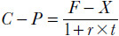

<!-- 原 EPUB 中此公式为图片，已原样保留 -->

<!-- source:block b479b03d8e553aee -->

> [!quote]- English 45
> Simply stated, the difference between the call price and put price for European options with the same exercise price and expiration date must be equal to the present value of the difference between the forward price and exercise price. This relationship, one of the most important in option pricing, goes by various names. In textbooks, it is commonly referred to as *put-call parity*. Traders may also refer to it as the *combo value*, the *synthetic relationship*, or the *conversion market*.

简单地说，具有相同行权价和到期日的欧式期权的看涨价格和看跌价格之间的差额必须等于远期价格和行权价之间的差额的现值。这种关系是期权定价中最重要的关系之一，有多种名称。在教科书中，它通常被称为看跌平价。交易员也可以将其称为组合价值、合成关系或转换市场。

<!-- source:block 55f9ae97c9e929a0 -->

> [!quote]- English 46
> The exact calculation of put-call parity depends on the underlying market and the settlement procedures for the options market. Let’s look at several different cases.

看跌期权平价的确切计算取决于标的市场和期权市场的结算程序。让我们看看几个不同的案例。

<!-- source:block 350aa01139dee076 -->

## 期货期权 / Options on Futures

<!-- source:block bac7e50e89a035a8 -->

> [!quote]- English 47
> The simplest calculation occurs when the underlying is a futures contract and the options are subject to futures-type settlement. In this case, the effective interest rate is 0 because no money changes hands when either the underlying futures contract or the options are traded. Moreover, futures contracts pay no dividends, so we can express put-call parity in its simplest form as

当标的是期货合约并且期权须接受期货类型结算时，就会发生最简单的计算。在这种情况下，有效利率为0，因为当标的期货合约或期权交易时没有货币易手。此外，期货合约不支付股息，因此我们可以以其最简单的形式表达看涨-看跌平价，例如

<!-- source:block 37cf247cf14afd16 -->

> [!quote]- English 48
> *C* – *P* = *F* – *X*

$$
C\,-\,P =\,F -\,X
$$

<!-- source:block 44da38b9e9dd20ca -->

> [!quote]- English 49
> With a December 100 call trading at 5.25 and a December 100 put trading at 1.50, what should be the price of the underlying December futures contract?

由于12 月到期、行权价为 100 的看涨交易价格为5.25，12 月到期、行权价为 100 的看跌交易价格为1.50，因此标的12月期货合约的价格应该是多少？

<!-- source:block d5e6b6df3e749e65 -->

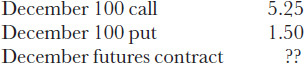

<!-- 原 EPUB 中此公式为图片，已原样保留 -->

<!-- source:block 9e34b0c7abbd88ce -->

> [!quote]- English 50
> Because

因为

<!-- source:block 949187e796b83efd -->

> [!quote]- English 51
> *C* – *P* = 5.25 – 1.50 = 3.75

$$
C\,-\,P = 5.25 - 1.50 = 3.75
$$

<!-- source:block 0ce04d549d659bdc -->

> [!quote]- English 52
> *F* – *X* also must equal 3.75. The futures price must be 103.75.

F-X也必须等于3.75。期货价格必须为103.75。

<!-- source:block a28482716562ade4 -->

> [!quote]- English 53
> What will happen in our example if the underlying futures contract is not trading at 103.75 but instead is trading at 104.00. We can see that

如果标的期货合约的交易价格不是103.75，而是104.00，在我们的例子中会发生什么。我们可以看到

<!-- source:block 7f4748a093cb4f61 -->

> [!quote]- English 54
> 5.25 – 1.50 ≠ 104.00 – 100

$$
5.25 - 1.50 ≠ 104.00 - 100
$$

<!-- source:block d0b568f57b32039a -->

> [!quote]- English 55
> and

和

<!-- source:block 93b2255ad64866cf -->

> [!quote]- English 56
> 3.75 ≠ 4.00

$$
3.75 ≠ 4.00
$$

<!-- source:block 9ce260e0d3aa1916 -->

> [!quote]- English 57
> Everyone will want to execute a reverse conversion by buying the less expensive synthetic (buy the call, sell the put) and selling the more expensive underlying (the futures contract). Ignoring transaction costs, if all trades actually can be done at these prices, the strategy will result in an arbitrage profit of .25, the amount of the mispricing.

每个人都会想通过购买较便宜的合成产品（购买看涨期权，出售看跌期权）并出售较昂贵的标的产品（期货合约）来执行反向转换。忽略交易成本，如果所有交易实际上都可以以这些价格进行，则该策略将产生0.25（错误定价金额）的套利利润。

<!-- source:block e6384bf913c0b9f9 -->

> [!quote]- English 58
> What will be the result of everyone attempting to do a reverse conversion? Because everyone wants to buy the call, there will be upward pressure on the call price. If the call price rises to 5.50 while all other prices remain unchanged, put-call parity is maintained because

每个人都试图进行反向转换会有什么结果？因为每个人都想购买看涨期权，看涨期权价格就会有上行压力。如果看涨价格升至5.50，而所有其他价格保持不变，则维持看涨-看跌平价，因为

<!-- source:block b37e4e56dfe675e9 -->

> [!quote]- English 59
> 5.50 – 1.50 = 104.00 – 100

$$
5.50 - 1.50 = 104.00 - 100
$$

<!-- source:block b8748c5277973046 -->

> [!quote]- English 60
> Alternatively, as part of the reverse conversion, everyone wants to sell the put. This will put downward pressure on the put price. If the put price falls to 1.25, put-call parity is again maintained because

或者，作为反向转换的一部分，每个人都想出售看跌期权。这将给看跌价格带来下行压力。如果看跌价格跌至1.25，看涨-看跌平价将再次维持，因为

<!-- source:block f930a124b1e90f12 -->

> [!quote]- English 61
> 5.25 – 1.25 = 104.00 – 100

$$
5.25 - 1.25 = 104.00 - 100
$$

<!-- source:block fef916a6e9ca179a -->

> [!quote]- English 62
> Finally, everyone wants to sell the futures contract, putting downward pressure on the futures price. If the futures contract falls to 103.75, put-call parity is again maintained because

最后，每个人都想卖掉期货合约，给期货价格带来下行压力。如果期货合约跌至103.75，则看涨-看跌平价再次维持，因为

<!-- source:block 3347367971862bf7 -->

> [!quote]- English 63
> 5.25 – 1.50 = 103.75 – 100

$$
5.25 - 1.50 = 103.75 - 100
$$

<!-- source:block 2dc27e43151a1ee6 -->

> [!quote]- English 64
> Whether the call price rises, the put price falls, the futures price falls, or some combination of all three, the final result must be

无论看涨价格上涨、看跌价格下跌、期货价格下跌，还是三者的某种组合，最终的结果一定是

<!-- source:block 37cf247cf14afd16 -->

> [!quote]- English 65
> *C* – *P* = *F* – *X*

$$
C\,-\,P =\,F -\,X
$$

<!-- source:block f04cb35ba48c8bd6 -->

> [!quote]- English 66
> This application of put-call parity, where all contracts are subject to futures-type settlement, is typically used for options traded on futures exchanges outside North America. When an exchange settles option prices at the end of the trading day, there may be inconsistencies having to do with the volatility value of an option. But the exchange will always try to assign settlement prices that are consistent with put-call parity. A table of settlement prices for Euro-bund options traded on Eurex is shown in Figure 15-2.2 Note that in every case, put-call parity is maintained.

这种看涨-看跌平价的应用（所有合约都须接受期货型结算）通常用于北美以外期货交易所交易的期权。 当交易所在交易日结束时结算期权价格时，可能会存在与期权波动率值有关的不一致。但交易所总是会尝试分配与看跌期权平价一致的结算价格。 Eurex交易的欧洲债券期权结算价格表如图15-[^ovp15-2]所示。请注意，在任何情况下，看涨-看跌平价都会保持。 2

<!-- source:block 2098ba1b3f890816 -->

*图15-2 2010年5月25日欧元债券期权结算价格 / Figure 15-2 Settlement prices for euro-bund options on May 25, 2010*

<!-- source:block 523ba5a5185fd2f9 -->

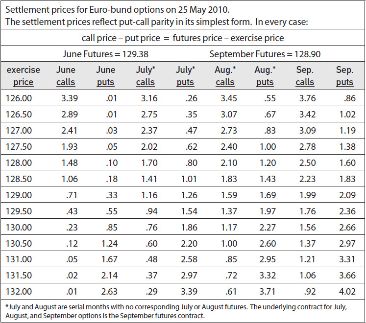

<!-- source:block 3c2270bf97b3c5cb -->

> [!quote]- English 68
> Put-call parity calculations become slightly more complicated when options on futures are subject to stock-type settlement, as they are on most futures exchanges in North America. Now we must discount by the interest-rate component

当期货期权受到股票型结算时，看涨平价计算会变得稍微复杂一些，就像北美大多数期货交易所的情况一样。现在我们必须按利率部分进行折扣

<!-- source:block c377b2c8b39f5764 -->

<!-- 原 EPUB 中此公式为图片，已原样保留 -->

<!-- source:block c92b9c5da32bb1a8 -->

> [!quote]- English 69
> With six months remaining to expiration and an annual interest rate of 6.00 percent, a December 100 call is trading for 4.90. What should be the price of the December 100 put if the underlying December futures contract is trading at 97.25? We know that

由于距离到期还有六个月，年利率为6.00 %，12月100 看涨期权的交易价格为4.90。如果标的12月期货合约的交易价格为97.25，12月100看跌期权的价格应该看跌期权多少？我们知道

<!-- source:block 9cc798dce659742c -->

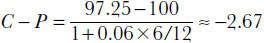

<!-- 原 EPUB 中此公式为图片，已原样保留 -->

<!-- source:block fb95f3efa8c702bc -->

> [!quote]- English 70
> The difference between the call price and put price must be 2.67, with the negative sign indicating that the put price is greater than the call price

看涨价格和看跌价格之间的差异必须为2.67，负符号表示看跌价格大于看涨价格

<!-- source:block fb39ee0c55561941 -->

> [!quote]- English 71
> *C* – *P* = –2.67*P* = *C* – (–2.67) = 4.90 + 2.67 = 7.57

$$
C\,-\,P = -2.67P\,=\,C - (-2.67) = 4.90 + 2.67 = 7.57
$$

<!-- source:block c55bc900d33ca2e2 -->

> [!quote]- English 72
> The put must be trading for 7.57.

看跌期权的交易价格必须为7.57。

<!-- source:block bc98078f23f93243 -->

## 涨跌停的期货市场 / Locked Futures Markets

<!-- source:block 07522a9609a3d1c6 -->

> [!quote]- English 73
> Many futures traders prefer not to become involved in options markets because of the apparent complexity of options. There is, however, one situation in which a futures trader ought to become familiar with basic option characteristics. If a futures trader wants to make a trade but is prevented from doing so because the futures market has reached its daily limit, he may be able to trade futures synthetically by using options. The price at which the synthetic futures contact is trading can be determined through put-call parity.

由于期权明显的复杂性，许多期货交易员不愿意参与期权市场。然而，在一种情况下，期货交易员应该熟悉基本期权特征。如果期货交易员想要进行交易，但由于期货市场已达到每日限额而无法进行交易，他可能可以通过使用期权进行综合交易期货。合成期货合约的交易价格可以通过看涨-看跌平价确定。

<!-- source:block 43ea451762a39ca5 -->

> [!quote]- English 74
> Consider a futures market that has a daily up or down limit of 5.00. The futures contract closed the previous day at 126.75 but is now up limit at 131.75. No further futures trading can take place unless someone is willing to sell at a price of 131.75 or less. If, however, the options market is still open, a trader can buy or sell futures synthetically, even if this price is beyond the daily limit. He can either buy a call and sell a put (buying the futures contract) or sell a call and buy a put (selling the futures contract) with the same exercise price and expiration date. The price of the call and put, together with the exercise price, will determine the price at which the synthetic futures contract is trading.

考虑一个每日涨跌上限为5.00的期货市场。该期货合约前一天收于126.75，但目前上限为131.75。除非有人愿意以131.75或更低的价格出售，否则不得进行进一步的期货交易。但是，如果期权市场仍然开放，交易者可以综合购买或出售期货，即使该价格超出每日限额。他可以购买看涨期权并出售看跌期权（购买期货合约），也可以出售看涨期权并购买看跌期权（出售期货合约），具有相同的行权价和到期日期。看涨和看跌的价格以及行权价将决定合成期货合约的交易价格。

<!-- source:block d227f437f1b78b02 -->

> [!quote]- English 75
> Below is a hypothetical table of call and put prices together with the resulting synthetic futures price. For simplicity, we assume that there are no interest considerations. Because *C* – *P* = *F* – *X*, we can calculate the equivalent futures price *F* = *C* – *P* + *X*.

以下是假设的看涨表，并将价格与所得合成期货价格放在一起。为了简单起见，我们假设没有利益考虑。由于C - P = F - X，我们可以计算出等效期货价格F = C - P + X。

<!-- source:block a80a5afefdbc791b -->

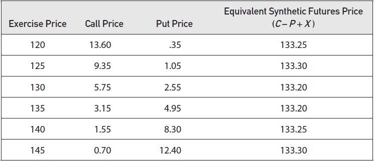

<!-- source:block c5cb7ad6eaa18950 -->

> [!quote]- English 76
> There is some variation in the equivalent synthetic prices, possibly because the prices do not reflect the bid-ask spread or perhaps because the option prices have not been quoted contemporaneously. However, one can see that if the futures contract were still open for trading, its price would probably be somewhere in the range of 133.20 to 133.30. If a futures trader wants to buy or sell futures synthetically in the option market, he can expect to trade at a price within this range.

等效合成价格存在一些变化，可能是因为价格不反映买卖价差，或者可能是因为期权价格没有同时报价。不过，可以看到，如果期货合约仍开放交易，其价格可能在133.20至133.30之间。如果期货交易员想要在期权市场上综合购买或出售期货，他可以预计以此价差内的价格进行交易。

<!-- source:block 660a07686a9bbdca -->

## 股票期权 / Options on Stock

<!-- source:block 3be0a0df6e85c171 -->

> [!quote]- English 77
> Calculating put-call parity for stock options entails an additional step because we must first calculate the forward price for the stock. With six months remaining to expiration and an annual interest rate of 4.00 percent, a December 65 call is trading for 8.00. If the underlying stock is trading at 68.50 and total dividends of .45 are expected prior to expiration, what should be the price of the 65 put?

计算股票期权的看涨-看跌平价需要额外的步骤，因为我们必须首先计算股票的远期价格。由于距离到期还有六个月，年利率为4.00%，12 月到期、行权价为 65 的看涨期权交易价格为8.00。如果标的股票的交易价格为68.50，并且到期前预计股息总额为0.45，那么65看跌期权的价格应该是多少？

<!-- source:block 62941bda7b11bb97 -->

> [!quote]- English 78
> We begin with the forward price

我们从远期价格开始

<!-- source:block 630fca302fc0528f -->

> [!quote]- English 79
> *F* = 68.50 × (1 + 0.04 × 6/12) – 0.45 = 69.42

$$
F\,= 68.50 \times (1 + 0.04 \times 6/12) - 0.45 = 69.42
$$

<!-- source:block 618086ad9001f0c3 -->

> [!quote]- English 80
> Then

然后

<!-- source:block 03923450adf6f17d -->

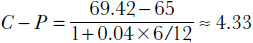

<!-- 原 EPUB 中此公式为图片，已原样保留 -->

<!-- source:block a710a8d9356b0d9d -->

> [!quote]- English 81
> The put price must be

看跌价格必须是

<!-- source:block b5d22c688cf6b6c8 -->

> [!quote]- English 82
> 8.00 – 4.33 = 3.67

$$
8.00 - 4.33 = 3.67
$$

<!-- source:block bfff9617b40c1857 -->

### 股票期权的近似计算 / An Approximation for Stock Options

<!-- source:block c87ce12ab7c9d9e8 -->

> [!quote]- English 83
> When exchanges first began trading options, all activity took place in an open-outcry environment. Traders often had to make pricing decisions quickly and without the aid of computers. As a result, they often sought shortcuts by which they could more easily approximate prices. Even if the shortcut resulted in small errors, the value of being able to make faster decisions more than offset the small loss in accuracy.

当交易所首次开始交易期权时，所有活动都是在公开呼喊的环境中进行的。交易员通常必须在没有计算机帮助的情况下快速做出定价决策。因此，他们经常寻找捷径，以便更容易地估算价格。即使快捷方式导致小错误，能够做出更快的决策的价值也超过了弥补准确性的微小损失。

<!-- source:block 95d3da94f7c8b156 -->

> [!quote]- English 84
> Let’s go back to basic put-call parity for stock options and replace the forward price *F* with the actual forward price for the stock

让我们回到股票期权的基本看涨-看跌平价，并将远期价格F替换为股票的实际远期价格

<!-- source:block 087496d54c419728 -->

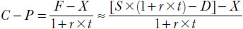

<!-- 原 EPUB 中此公式为图片，已原样保留 -->

<!-- source:block 3c896c806421bfdb -->

> [!quote]- English 85
> How might we simplify this calculation?

我们如何简化这个计算？

<!-- source:block 5bf5e5e503eb8acd -->

> [!quote]- English 86
> Note that we are multiplying the stock price by the interest-rate component and then dividing the stock price, the dividend, and the exercise price by the same interest-rate component. We end up with the stock price itself less the discounted values of the dividend and exercise price

请注意，我们将股价乘以利率成分，然后将股价、股息和行权价除以相同的利率成分。我们最终得到的是股价本身减去股息和行权价的贴现值

<!-- source:block 16057f88d37cdab6 -->

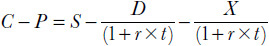

<!-- 原 EPUB 中此公式为图片，已原样保留 -->

<!-- source:block 380fb8637c8a89e7 -->

> [!quote]- English 87
> Dividends are typically small compared with the stock price and exercise price, so a reasonable approximation for the discounted value of the dividend is simply the dividend *D* itself. We might approximate the discounted value of the exercise price and eliminate the need to do any division by subtracting the interest on the exercise price from the exercise price itself

与股价和行权价相比，股息通常较小，因此股息贴现值的合理近似值只是股息D本身。我们可能会估算出行权价的贴现值，并通过从行权价本身减去行权价的利息来消除进行任何除之必要

<!-- source:block d9d08d2d61005b66 -->

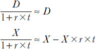

<!-- 原 EPUB 中此公式为图片，已原样保留 -->

<!-- source:block 119208a6d5fa758e -->

> [!quote]- English 88
> Substituting our approximations into the put-call parity equation, we have

将我们的近似值替换到看跌-看涨平价方程中，我们有

<!-- source:block d64ba20be6bea300 -->

> [!quote]- English 89
> *C* – *P* ≈ *S* – (*X* – *X* × *r* × *t*) – *D* = *S* – *X* + *X* × *r* × *t* – *D*

$$
C\,-\,P \approx\,S - (X\,-\,X \times\,r \times\,t) -\,D =\,S -\,X +\,X \times\,r \times\,t -\,D
$$

<!-- source:block 768adeaa5265991d -->

> [!quote]- English 90
> The difference between the call price and put price is approximately equal to the stock price minus the exercise price plus interest on the exercise price minus expected dividends.

看涨价格和看跌价格之间的差异大约等于股价减去行权价加上行权价的利息减去预期股息。

<!-- source:block a962d3c6eead4ff8 -->

> [!quote]- English 91
> How good an approximation is this? Clearly, if interest rates are very high, the dividend is very large, or we are dealing with long-term options, the errors will begin to increase. But for short-term options our approximation often represents a reasonable tradeoff between speed and accuracy.

这个近似值有多好？显然，如果利率非常高，股息非常大，或者我们正在处理长期期权，错误将开始增加。但对于短期期权，我们的近似值通常代表了速度和准确性之间的合理权衡。

<!-- source:block 1715e35bba079977 -->

> [!quote]- English 92
> Let’s go back to our previous stock option example:

让我们回到之前的股票期权示例：

<!-- source:block 93805589e11f1c6d -->

> [!quote]- English 93
> Stock price = 68.50

$$
\text{Stock price} = 68.50
$$

<!-- source:block 8a31e2f299ac2ce1 -->

> [!quote]- English 94
> Time to expiration = 6 months

$$
\text{Time to expiration} = 6 \text{months}
$$

<!-- source:block 14e8675bf9d03c69 -->

> [!quote]- English 95
> Interest rate = 4.00

$$
\text{Interest rate} = 4.00
$$

<!-- source:block 50f50d1a8319728a -->

> [!quote]- English 96
> percent Expected dividends = .45

$$
\text{percent Expected dividends} = .45
$$

<!-- source:block 88db98b4f52281ba -->

> [!quote]- English 97
> We calculated the value of the 65 combo (*C* – *P*) as 4.33. How will our approximation compare?

我们计算出65组合（C-P）的值为4.33。我们的近似值比较如何？

<!-- source:block c500de4eb3ce875a -->

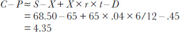

<!-- 原 EPUB 中此公式为图片，已原样保留 -->

<!-- source:block 8bd07d25767b760d -->

> [!quote]- English 98
> Our approximation differs by .02 from the true value. Depending on market conditions, this might be an acceptable margin of error in return for being able to make a faster trading decision.

我们的近似值与真实值相差0.02。根据市场条件，这可能是一个可接受的误差幅度，以换取能够更快地做出交易决策。

<!-- source:block 3b62681894789385 -->

> [!quote]- English 99
> All experienced traders are familiar with put-call parity, so any price imbalances are likely to be very short-lived. If the combo is overpriced compared with the underlying, all traders will want to execute a conversion (i.e., buy the underlying, sell the call, buy the put). If the combo is underpriced, all traders will want to execute a reversal (i.e., sell the underlying, buy the call, sell the put). Such activity, where everyone is attempting to do the same thing, will quickly force prices back into equilibrium. Indeed, price imbalances in the synthetic relationship are usually small and rarely last for more than a few seconds. When imbalances do occur, an option trader is usually willing to execute conversions or reversals in very large size because of the low risk associated with such strategies.

所有经验丰富的交易员都熟悉看跌期权平价，因此任何价格失衡都可能是非常短暂的。如果组合与基础组合相比定价过高，所有交易者都会希望执行转换（即，买入标的、卖出看涨期权、买入看跌期权）。如果组合定价过低，所有交易者都会希望执行逆转（即，出售标的、购买看涨期权、出售看跌期权）。这种每个人都试图做同样的事情的活动将迅速迫使价格恢复平衡。事实上，合成关系中的价格失衡通常很小，而且很少持续超过几秒。当失衡确实发生时，期权交易员通常愿意执行非常大规模的转换或逆转，因为此类策略的风险较低。

<!-- source:block 8d08cdec2dd58496 -->

> [!quote]- English 100
> Put-call parity specifies the price relationship between three contracts—a call, a put, and an underlying contract. If the price of any two contracts is known, it should be possible to calculate the price of the third contract. If the prices in the marketplace do not seem to be consistent with this relationship, what might a trader infer?

看跌期权平价指定三个合约（看涨、看跌和标的合约）之间的价格关系。如果已知任何两个合约的价格，则应该可以计算第三个合约的价格。如果市场上的价格似乎与这种关系不一致，交易员可以推断什么？

<!-- source:block c2c507db2c283efc -->

> [!quote]- English 101
> Consider this stock option situation:

考虑这种股票期权情况：

<!-- source:block b8187ae493144126 -->

> [!quote]- English 102
> 90 call = 7.20

$$
90 \text{call} = 7.20
$$

<!-- source:block 0bae4d1b3826d71a -->

> [!quote]- English 103
> 90 put = 1.40

$$
90 \text{put} = 1.40
$$

<!-- source:block b8b5a73c2a724f74 -->

> [!quote]- English 104
> Time to expiration = 3 months

$$
\text{Time to expiration} = 3 \text{months}
$$

<!-- source:block d60a15b7e6709839 -->

> [!quote]- English 105
> Interest rate = 8.00 percent

$$
\text{Interest rate} = 8.00 \text{percent}
$$

<!-- source:block e841eafc7983c556 -->

> [!quote]- English 106
> Expected dividends = .47

$$
\text{Expected dividends} = .47
$$

<!-- source:block 967b1ece2247db60 -->

> [!quote]- English 107
> What should be the price of the underlying stock?

标的股票的价格应该是多少？

<!-- source:block ee60f323ec04a3d2 -->

> [!quote]- English 108
> Using our stock option approximation for put-call parity, we know that

使用我们的股票期权逼近来计算看涨-看跌平价，我们知道

<!-- source:block 90c5db3715317241 -->

> [!quote]- English 109
> *C* – *P* ≈ *S* – *X* + *X* × *r* × *t* – *D*

$$
C\,-\,P \approx\,S -\,X +\,X \times\,r \times\,t -\,D
$$

<!-- source:block 273d396e5a2b5a63 -->

> [!quote]- English 110
> Therefore,

因此，

<!-- source:block 539b71cd4292f7b9 -->

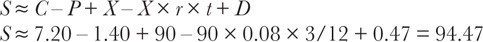

<!-- 原 EPUB 中此公式为图片，已原样保留 -->

<!-- source:block 3b484bd98ad95f5f -->

> [!quote]- English 111
> Suppose, however, that the stock is actually trading at 94.30. Does this mean that there is an arbitrage opportunity?

然而，假设股票的实际交易价格是94.30。这是否意味着存在套利机会？

<!-- source:block 0d4d4eb929742747 -->

> [!quote]- English 112
> The stock price calculation depended on assumptions about interest and dividends. Are we sure that those assumptions are correct? One possibility is that the interest rate we are using, 8 percent, is too low. If we assume that the contract prices and dividends are correct, we can calculate the *implied interest rate*

股价计算取决于对利息和股息的假设。我们确定这些假设是正确的吗？一种可能性是我们使用的8%利率太低。如果我们假设合约价格和股息正确，就可以计算隐含利率

<!-- source:block a6ef6d99c50d076a -->

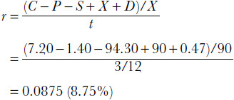

<!-- 原 EPUB 中此公式为图片，已原样保留 -->

<!-- source:block 9214ece75c4de736 -->

> [!quote]- English 113
> Another possibility is that the dividend we are using, .47, is too high. If we assume that the contract prices and interest are correct, we can calculate the *implied dividend*

另一种可能性是我们使用的股息0.47太高了。如果我们假设合约价格和利息是正确的，我们就可以计算隐含股息

<!-- source:block 36469a65db3aee22 -->

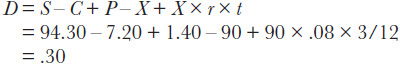

<!-- 原 EPUB 中此公式为图片，已原样保留 -->

<!-- source:block c888769fd89c5ff9 -->

> [!quote]- English 114
> The marketplace seems to be expecting a dividend of only .30. If our original calculation was based on an estimate of the expected divided, we ought to consider the possibility that the company will cut the dividend prior to expiration.

市场似乎预计股息仅为0.30。如果我们最初的计算是基于对预期股息的估计，那么我们应该考虑公司在到期前削减股息的可能性。

<!-- source:block 1f4ba34e64c344f5 -->

## 套利风险 / Arbitrage Risk

<!-- source:block aed403b3f0f148e7 -->

> [!quote]- English 115
> New traders who are learning to trade options professionally are often encouraged to focus on conversions and reversals because, they are told, these strategies, once executed, are essentially riskless. A word of warning: *very few strategies are truly riskless*. Some strategies entail greater risk, while others entail lesser risk. Rarely, however, does a strategy entail no risk. The risks of doing conversions or reversals may not be immediately apparent, but they exist nonetheless.

正在专业学习期权交易的新交易者通常被鼓励专注于转换和逆转，因为他们被告知，这些策略一旦执行，本质上是无风险的。警告一句：很少有策略是真正无风险的。有些策略的风险较大，而另一些策略的风险较小。然而，策略很少不带来风险。进行转换或逆转的风险可能不会立即明显，但它们仍然存在。

<!-- source:block 873c4fe7d915d04c -->

### 执行风险 / Execution Risk

<!-- source:block bd62c0503f2461f2 -->

> [!quote]- English 116
> Because no one wants to give away money, a trader is unlikely to be offered a profitable conversion or reversal all at one time. Consequently, a trader who focuses on these strategies will have to begin by executing one or two legs and then hope to execute the final leg(s) at a later time. He may, for example, initially purchase puts together with underlying contracts and hope to later complete the conversion by selling calls. However, if call prices begin to fall, he may never be able to profitably complete the conversion. Even a professional trader on an exchange, who would seem to be in a good position to know the prices of all three contracts, can be mistaken. He may create a long synthetic underlying position by purchasing a call and selling a put at what he believes are favorable prices. However, when he tries to sell the underlying contract to complete the reversal, he may find that the price is lower than he expected. Whenever a strategy is executed one leg at a time, there is always the risk of an adverse change in prices before the strategy can be completed.

由于没有人愿意白送钱，交易员几乎不可能一次性获得有利可图的转换套利或反向转换套利。因此，专做这类策略的交易员往往必须先执行一条或两条组合腿，再等待机会完成其余组合腿。例如，他可能先买入看跌期权和标的合约，随后再卖出看涨期权以完成转换套利；但若看涨期权价格开始下跌，他可能永远无法以有利价格完成组合。即使是能够同时观察三份合约价格的场内专业交易员也可能判断失误：他或许先以自认为有利的价格买入看涨期权、卖出看跌期权，建立合成标的多头；但之后卖出标的合约以完成反向转换时，可能发现标的价格低于预期。只要策略是逐腿执行，在组合完成前就始终存在价格向不利方向变化的风险。

<!-- source:block 72f9f4ac3c6f44bf -->

### 钉住风险 / Pin Risk

<!-- source:block 5a803f35317d2128 -->

> [!quote]- English 117
> When we introduced the concept of a synthetic position, we assumed that at expiration, the underlying market would be either above the exercise price, in which case the call would be exercised, or below the exercise price, in which case the put would be exercised. But what will happen if the underlying market is exactly equal to, or *pinned* to, the exercise price at the moment of expiration?

当我们引入合成头寸的概念时，我们假设在到期时，标的市场要么高于行权价，在这种情况下，看涨期权将被执行，要么低于行权价，在这种情况下，看跌期权将被执行。但如果标的市场完全等于或固定在到期时的行权价，会发生什么？

<!-- source:block 8f991e1f693cff07 -->

> [!quote]- English 118
> Suppose that a trader has executed a June 100 conversion: he is short a June 100 call, long a June 100 put, and long the underlying contract. If the underlying contract is above or below 100 at expiration, there is no problem. Either he will be assigned on the call or he will exercise the put. In either case, the long underlying position will be offset, and he will have no market position on the day following expiration.

假设一名交易员建立了 6 月到期、行权价为 100 的转换套利组合（conversion）：持有 `short a June 100 call`、`long a June 100 put`，同时做多标的合约。若到期时标的合约价格高于或低于 100，都不会产生问题：交易员要么在看涨期权上被指派，要么主动行权看跌期权。无论哪种情况，标的多头都会被抵销，到期后的次日便不再持有任何市场头寸。

<!-- source:block b598ee359d6bcddc -->

> [!quote]- English 119
> But suppose that at the moment of expiration, the underlying market is right at 100. The trader would like to be rid of his underlying position. If he is not assigned on the call, he can exercise his put; if he is assigned on the call, he can let the put expire. In order to make a decision, he must know whether the call will be exercised. But he won’t know this until the day after expiration, when he either does or does not receive an assignment notice. If he finds out that he was not assigned on the call, it will be too late to exercise the put because it will have expired.

但假设在到期时，标的市场正好为100。交易员希望摆脱他的标的头寸。如果他没有被指派参加看涨期权，他可以行权看跌期权;如果他被指派参加看涨期权，他可以让看跌期权到期。为了做出决定，他必须知道是否会执行看涨期权。但直到到期后的第二天，他才会知道这一点，届时他要么收到，要么没有收到指派通知。如果他发现自己没有被指派参加看涨期权会议，那么行权看跌期权就太晚了，因为看跌期权已经到期了。

<!-- source:block 9c57017949ebf30f -->

> [!quote]- English 120
> It may seem that an option that is exactly at the money at expiration will never be exercised because, in theory, it has no value. In fact, many at-the-money options are exercised. Even though the option has no theoretical value, it does have some practical value. For example, suppose that the owner of a call that is exactly at the money at expiration wants to take a long position in the underlying contract. He has two choices. He can either exercise the call or buy the underlying contract. Because an exchange-traded option typically includes the right of exercise in the original transaction cost, it is almost always cheaper to exercise the call. Even if there is a small transaction cost to exercise, an option, it will almost always be less than the cost of trading the underlying contract. Anyone owning an at-the-money option and choosing to take a long or short position at expiration will find that it is cheaper to exercise the option than to buy or sell the underlying contract.

看来，一个恰好在到期时的金额上的期权永远不会被行权，因为从理论上讲，它没有价值。事实上，许多平值的选择都被行权。尽管该期权没有理论价值，但确实有一定的实际价值。例如，假设恰好处于到期资金头寸的看涨期权所有者希望在标的合约中持有多头头寸。他有两个选择。他可以执行看涨期权或购买标的合约。由于交易所交易的期权通常包括原始交易成本中的行权权，因此行权看涨期权几乎总是更便宜。即使行权期权的交易成本很小，它几乎总是低于标的合约的交易成本。任何拥有平值期权并选择在到期时持有多头或空头头寸的人都会发现，行权该期权比购买或出售标的合约更便宜。

<!-- source:block 0e188c5c8ceebdc0 -->

> [!quote]- English 121
> Clearly, a trader who is short an at-the-money option at expiration has a problem. What can he do? One possibility is to make an educated guess as to whether the at-the-money option will be exercised. If the market appears to be strong on the last trading day, the trader might assume that it will continue higher following expiration. If the holder of the call sees the situation similarly, it is logical to assume that the call will be exercised. Hence the trader will choose not to exercise his put. Unfortunately, if the trader is wrong and he does not get assigned on the call, he will find himself with a long underlying position that he would rather not have. Conversely, if the market appears to be weak on the last trading day, the trader might make the assumption that he will not be assigned on the call. He will therefore choose to exercise the put. But, again, if he is wrong and does get an assignment notice, he will find himself with an unwanted short underlying position on the day following expiration.

显然，在到期时做空价金期权的交易员有问题。他能做什么？一种可能性是对是否会行权平值选择权进行有根据的猜测。如果市场在最后一个交易日表现强劲，交易员可能会认为到期后市场将继续走高。如果看涨期权持有者对情况有类似的看法，那么逻辑上可以假设看涨期权将被执行。因此，交易者将选择不行权他的看跌期权。不幸的是，如果交易员错了，并且没有被指派参加看涨期权会议，他会发现自己拥有一个他宁愿不拥有的多头标的头寸。相反，如果市场在最后一个交易日表现疲软，交易员可能会假设他不会被指派参加看涨期权。因此，他将选择行权看跌期权。但是，同样，如果他错了，并得到了指派通知，他会发现自己在到期后的第二天有一个不必要的空头头寸。

<!-- source:block 4ffbf8e9f8f222ad -->

> [!quote]- English 122
> The risk of a wrong guess can be further compounded by the fact that conversions and reversals, because of their low risk, are often done in large size. If the trader guesses wrong, he may find that on the day after expiration, he is naked long or short not one or two but many underlying contracts.

转换和逆转由于风险低，通常是大规模进行的，这一事实可能会进一步加剧错误猜测的风险。如果交易者猜测错误，他可能会发现到期后的第二天，他是赤裸裸的做多或做空，不是一两个，而是多个标的合约。

<!-- source:block a0694bdd43c28392 -->

> [!quote]- English 123
> There can be no certain solution to the problem of pin risk. With many, perhaps thousands, of open contracts outstanding, some at-the-money options will be exercised and some won’t. If the trader lets the position go to expiration and relies on luck, he is at the mercy of the fates, and this is a position that an intelligent option trader prefers to avoid. The practical solution is to avoid carrying a short at-the-money option position to expiration when there is a real possibility of expiration right at the exercise price. If the trader has a large number of June 100 conversions or reversals and expiration is approaching with the underlying market close to 100, the sensible course is to reduce the pin risk by reducing the size of the position. If the trader doesn’t reduce the size, he may find that he is under increasing pressure to get out of a large number of risky contracts as expiration approaches.

对于别针风险问题，没有一定的解决方案。由于有许多甚至数千份未完成的未平仓合约，一些平值的期权将被行权，而另一些则不会。如果交易者让头寸到期并依靠运气，他就会受到命运的摆布，而这是聪明的期权交易者更愿意避免的头寸。实际的解决方案是，当确实有可能以行权价到期时，避免持有价卖空期权头寸直至到期。如果交易者有大量6月100日的转换或逆转，并且到期即将到来，标的市场接近100，那么明智的做法是通过减少头寸规模来降低pin风险。如果交易员不缩小规模，他可能会发现，随着到期的临近，他面临着越来越大的压力，需要退出大量有风险的合约。

<!-- source:block 80ebf8206017e018 -->

> [!quote]- English 124
> Sometimes even a careful trader will find that he still has some outstanding at-the-money conversions or reversals as expiration approaches. If he is very concerned with the potential pin risk, he might simply liquidate the position at the prevailing market prices. Unfortunately, this is likely to result in a loss because the trader will be forced to trade each contract at an unfavorable price, either buying at the offer or selling at the bid. Fortunately, it is often possible to trade out of such a position all at once at a fair price.

有时，即使是一个细心的交易者也会发现，随着到期的临近，他仍然有一些未完成的ATM转换或逆转。如果他非常担心潜在的别针风险，他可能会简单地以现行市场价格平仓。 不幸的是，这可能会导致损失，因为交易员将被迫以不利的价格交易每份合约，要么按报价买入，要么按出价卖出。幸运的是，通常可以以公平的价格一次性摆脱这样的头寸。

<!-- source:block 555e1eef15a30526 -->

> [!quote]- English 125
> Because conversions and reversals are common strategies, a trader who has an at-the-money conversion and is worried about pin risk can be fairly certain that there are also traders in the market who have at-the-money reversals and are worried about the same pin risk. If the trader with the conversion could find a trader with a reversal and cross positions with him, both traders would eliminate the pin risk associated with their positions. This is why on option exchanges one often finds traders looking for other traders who want to trade conversions or reversals at even money. This simply means that a trader wants to trade out of his position at a price that is fair to everyone involved so that everyone can avoid the problem of pin risk. Whatever profit a trader expected to make from the conversion or reversal presumably resulted from the opening trade, not from the closing trade.

由于转换和逆转是常见的策略，因此进行ATM转换并担心pin风险的交易员可以相当肯定，市场中也存在进行ATM转换并担心相同pin风险的交易员。 如果进行转换的交易者能够找到一位进行逆转并与他交叉头寸的交易者，那么两位交易者都将消除与其头寸相关的pin风险。 这就是为什么在期权交易所，人们经常发现交易员正在寻找其他想要以偶数价格进行转换或逆转的交易员。 这只是意味着交易员希望以对所有相关人员公平的价格进行平仓交易，以便每个人都可以避免别针风险问题。 交易员预计从转换或逆转中获得的任何利润都可能来自开盘交易，而不是收盘交易。

<!-- source:block 40ee49511f827463 -->

> [!quote]- English 126
> Pin risk only occurs in option markets where exercise results in a long or short position in the underlying contract. In some markets, such as stock indexes, options are settled at expiration in cash rather than with the delivery of an underlying contract. When the option expires, there is a cash payment equal to the difference between the exercise price and underlying price, but no underlying position results. Consequently, there is no pin risk associated with this type of settlement.

Pin风险仅发生在期权市场中，在期权市场中，期权市场的行权会导致标的合约中的多头或空头头寸。在某些市场（例如股指）中，期权在到期时以现金结算，而不是通过交付标的合约来结算。当期权到期时，现金支付等于行权价和标的价格之间的差额，但不会产生标的头寸。因此，不存在与此类结算相关的pin风险。

<!-- source:block de26026cf1309cf9 -->

### 结算风险 / Settlement Risk

<!-- source:block d6043c5a0c062db2 -->

> [!quote]- English 127
> Let’s go back to our December 100 conversion example. But now let’s assume that the underlying is a December futures contract

让我们回到100年12月的转换示例。但现在假设标的是12月期货合约

<!-- source:block 3c6327ac28b17c4a -->

> [!quote]- English 128
> –1 December 100 call

$$
-1 \text{December} 100 \text{call}
$$

<!-- source:block 97a33c8d208fef2f -->

> [!quote]- English 129
> +1 December 100 put

$$
+1 \text{December} 100 \text{put}
$$

<!-- source:block af4322e7bfcc536e -->

> [!quote]- English 130
> +1 December futures contract

$$
+1 \text{December futures contract}
$$

<!-- source:block 1c22cab0c2900077 -->

> [!quote]- English 131
> If the December futures contract is trading at 102.00, there are three months remaining to December expiration, interest rates are 8.00 percent, and all options are subject to stock-type (cash) settlement, the value of the December 100 synthetic combination (the difference between the December 100 call and the December 100 put) should be

若 12 月期货合约的交易价格为 102.00，距离 12 月到期还有三个月，利率为 8.00%，且所有期权均采用股票式现金结算（stock-type cash settlement），则 12 月到期、行权价为 100 的合成组合价值——即 12 月 100 看涨期权与 12 月 100 看跌期权的价值之差——应为

<!-- source:block e8e5ecb71ebd3560 -->

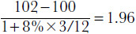

<!-- source:block 08b70cd057485b08 -->

> [!quote]- English 132
> Suppose that a trader is able to sell a December 100 call for 5.00, buy a December 100 put for 3.00, and sell a December futures contract for 102.00. At expiration, the trader should realize a profit of .04 because he has done the December 100 conversion at .04 better than its value.

假设交易员能够以 5.00 卖出 12 月 100 看涨期权，以 3.00 买入 12 月 100 看跌期权，并以 102.00 卖出 12 月期货合约。到期时，交易员应实现 0.04 的利润，因为这组 12 月 100 转换套利组合的成交价格比其理论价值有利 0.04。

<!-- source:block 69852c80a478ccf5 -->

> [!quote]- English 133
> Shortly after the trader executes the conversion, the underlying December futures contract falls to 98.00. What will be the cash flow? The synthetic position will show a profit of approximately 4.00; the short call and long put together, because they make up a short underlying position, will appreciate by 4.00. But because the options are settled like stock, the profit on the synthetic position will be unrealized—there will be no cash credited to the trader’s account. On the other hand, the trader is also long a December futures contract, and this contract, because it is subject to futures-type settlement, will result in an immediate debit of 4.00 when the market drops to 98.00. To cover this debit, the trader must either borrow the money or take the money out of an interest-bearing account. In either case, there will be a loss in interest, and this interest loss will not be offset by the unrealized profit from the option position. If the loss in interest is great enough, it may more than offset the profit of .04 that the trader originally expected from the position. In the most extreme case, where the trader does not have access to the funds required to cover the variation on the futures position, he may be forced to liquidate the position. Needless to say, forced liquidations are never profitable.

交易者建立转换套利头寸后不久，标的 December futures 跌至 98.00。此时现金流如何？合成头寸约盈利 4.00：short call（空头看涨期权）与 long put（多头看跌期权）共同构成标的空头头寸，因而升值 4.00。但期权采用股票式结算，这部分利润尚未实现，交易者账户不会立即收到现金。另一方面，交易者还持有 December futures 多头；由于该合约采用期货式结算，市场跌至 98.00 时会立即产生 4.00 的 `debit`。为补足该笔 `debit`，交易者必须借款，或从计息账户中取出资金，两种方式都会造成利息损失，而这笔损失不会被期权头寸的未实现利润抵消。若利息损失足够大，甚至可能超过建仓时预期的 0.04 利润。极端情况下，若交易者无力支付期货头寸的变动结算款，就可能被迫平仓；强制平仓显然不会带来利润。

<!-- source:block 44eaca0270231d91 -->

> [!quote]- English 134
> Of course, this works both ways. A rise in the price of the underlying futures contract to 106.00 will result in a loss of 4.00 on the synthetic option position; the short call and long put together will decline by 4.00. But this loss is unrealized—no money will actually be debited from the trader’s account.3 On the other hand, the rise in the futures contract will result in an immediate cash credit on which the trader can earn interest. This interest will increase the potential profit beyond the expected amount of .04.

当然，这种影响是双向的。标的期货合约涨至 106.00 时，合成期权头寸亏损 4.00；short call（空头看涨期权）与 long put（多头看跌期权）的组合价值下降 4.00。但这部分亏损尚未实现，交易者账户并不会被实际扣款。[^ovp15-3]另一方面，期货合约上涨会立即产生一笔能够赚取利息的 `cash credit`，从而使潜在利润超过原先预期的 0.04。

<!-- source:block 8735c7757080443f -->

> [!quote]- English 135
> Option traders tend to assume that conversions and reversals are delta-neutral strategies. But this is not always true. An exactly delta-neutral position has no preference as to the direction of movement in the underlying contract. In our example, we can see that the trader prefers upward movement because he can earn interest on the variation credited to his account. With the underlying futures contract at 102, the deltas in our example might be

期权交易员倾向于认为转换和逆转是Delta中性策略。但这并不总是正确的。完全Delta中性的头寸对标的合约的移动方向没有偏好。在我们的例子中，我们可以看到交易者更喜欢向上移动，因为他可以从记入其账户的变化中赚取利息。标的期货合约为102，我们示例中的Delta可能是

<!-- source:block 1d505fa0314a42c8 -->

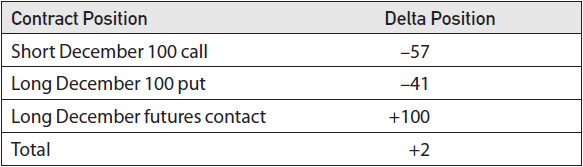

<!-- source:block 5c59b9e61192f5db -->

> [!quote]- English 136
> The two extra deltas reflect the fact that the trader prefers the market to rise rather than fall so that cash will flow into his account from the futures position. The interest from this cash flow can result in an unexpected profit. A decline in the futures price will have the opposite effect and can result in an unexpected loss.

这两个额外的Delta反映了这样一个事实：交易员更喜欢市场上涨而不是下跌，以便现金将从期货头寸流入他的账户。该现金流的利息可能会产生意想不到的利润。期货价格下跌会产生相反的影响，并可能导致意外损失。

<!-- source:block e576427942248c92 -->

> [!quote]- English 137
> Under normal circumstances, few traders will concern themselves with the risk of being two deltas long or short. But conversions and reversals, because they are low-risk strategies, are often done in very large size. A trader who executes 300 of our sample conversions has a delta risk of 300 × +2 = +600. This is the same as being long an extra six futures contracts. The risk comes from the interest that can be earned on any cash credit or that must be paid on any cash debit resulting from movement in the underlying futures contract.

在一般情况下，很少有交易者会在意 2 Delta 的多头或空头风险。但转换套利和逆转换套利属于低风险策略，往往以很大的规模执行。若交易者建立 300 组本例的转换套利头寸，其 Delta 风险为 $300 \times (+2) = +600$，相当于额外持有 6 份期货合约多头。风险来源是标的期货价格变动所产生的 `cash credit` 可赚取的利息，或 `cash debit` 必须承担的利息。

<!-- source:block c1b1d099baf75ed6 -->

> [!quote]- English 138
> The amount by which the delta of a synthetic futures position will differ from 100 depends on the interest risk associated with the position. This, in turn, depends on two factors—the general level of interest rates and the amount of time remaining to expiration. The higher the interest rate and the more time remaining to expiration, the greater the risk. The lower the interest rate and the less time remaining to expiration, the less the risk. A 10 percent interest rate with nine months remaining to expiration represents a much greater risk than a 4 percent interest rate with one month remaining to expiration. In the former case, the deltas of a synthetic position may add up to 93, while in the latter case the deltas may add up to 99. In general, the total delta for a synthetic futures contract, where the options are subject to stock-type settlement, is

合成期货头寸的Delta与100的差异取决于与头寸相关的利息风险。反过来，这取决于两个因素——利率的总体水平和到期剩余时间。利率越高，到期剩余时间越长，风险就越大。利率越低，到期剩余时间越短，风险就越小。距离9个月到期的10%利率比距离1个月到期的4%利率风险大得多。在前一种情况下，合成头寸的Delta加起来可能为93，而在后一种情况下，Delta加起来可能为99。一般来说，合成期货合约（期权须接受股票型结算）的总Delta为

<!-- source:block e609964e0d5c849b -->

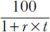

<!-- 原 EPUB 中此公式为图片，已原样保留 -->

<!-- source:block 7da370d29213f423 -->

> [!quote]- English 139
> where *r* is the interest rate and *t* is the time to maturity of the options.

其中r是利率，t是期权的到期时间。

<!-- source:block d59dda14f85cf165 -->

> [!quote]- English 140
> This type of *settlement risk* occurs only when the options and the underlying contract are subject to different settlement procedures.4 There is no settlement risk when both contracts are subject to the same settlement procedure. If all contracts are subject to stock-type settlement, as they are in a typical stock option market, no cash flow results from fluctuations in the prices of the contracts prior to expiration. If all contracts are subject to futures-type settlement, as they are on most futures exchanges outside the United States, any cash flow resulting from changes in the price of the underlying futures contract will exactly offset the cash flow resulting from changes in prices of the option contracts.

只有当期权和标的合约遵循不同的结算程序时，才会发生此类结算风险。[^ovp15-4]当两个合约遵循相同的结算程序时，不存在结算风险。如果所有合约都受到股票型结算，就像在典型的股票期权市场一样，那么到期前合约价格的波动不会产生现金流。如果所有合约都受到期货型结算，就像美国以外的大多数期货交易所一样，那么标的期货合约价格变化产生的任何现金流将完全抵消期权合约价格变化产生的现金流。

<!-- source:block 5e478cd2ab1fbc5f -->

### 利率与股息风险 / Interest and Dividend Risk

<!-- source:block e0515afa995a67cb -->

> [!quote]- English 141
> Let’s again go back to our December 100 conversion, but now let’s assume that the underlying contract is stock.

让我们再次回到100年12月的转换，但现在假设标的合约是股票。

<!-- source:block 3c6327ac28b17c4a -->

> [!quote]- English 142
> –1 December 100 call

$$
-1 \text{December} 100 \text{call}
$$

<!-- source:block 97a33c8d208fef2f -->

> [!quote]- English 143
> +1 December 100 put

$$
+1 \text{December} 100 \text{put}
$$

<!-- source:block a0ef24656bdb5920 -->

> [!quote]- English 144
> +1 stock contract

$$
+1 \text{stock contract}
$$

<!-- source:block 1f849e0f99bbb606 -->

> [!quote]- English 145
> What are the risks of holding this position?

持有此头寸有哪些风险？

<!-- source:block 270f9ca3cb660393 -->

> [!quote]- English 146
> The stock price will always be greater than the option prices, so the entire position will be done for a debit approximately equal to the option’s exercise price. Because the trader will have to borrow this amount, there will be an interest cost associated with the position. If interest rates rise over the life of the position, the interest costs will also rise, increasing the cost of holding the position and, consequently, reducing the potential profit. If interest rates fall, the potential profit will increase because the costs of carrying the position will decline.5

股票价格始终高于期权价格，因此整个头寸将被扣除一个大约等于期权行权价的 debit。由于交易者必须借入这笔金额，因此将存在与头寸相关的利息成本。如果利率在头寸有效期内上升，利息成本也会上升，增加持有头寸的成本，从而减少潜在利润。如果利率下降，潜在利润将会增加，因为持有头寸的成本将会下降。[^ovp15-5]

<!-- source:block 14c5711cf3f26bb6 -->

> [!quote]- English 147
> The opposite is true of a reverse conversion:

反向转换的情况恰恰相反：

<!-- source:block 7b98097d836f8730 -->

> [!quote]- English 148
> +1 December 100 call

$$
+1 \text{December} 100 \text{call}
$$

<!-- source:block 642d8a28ab4c8512 -->

> [!quote]- English 149
> –1 December 100 put

$$
-1 \text{December} 100 \text{put}
$$

<!-- source:block 72d70d30bad779be -->

> [!quote]- English 150
> –1 stock contract

$$
-1 \text{stock contract}
$$

<!-- source:block e669260ff95db920 -->

> [!quote]- English 151
> Because the trader will receive cash from the sale of the stock, the position will earn interest over time. If interest rates rise, the interest earnings will also rise, increasing the value of the position. If interest rates fall, the interest earnings will fall, reducing the value of the position.

由于交易者将从出售股票中获得现金，因此该头寸将随着时间的推移而赚取利息。如果利率上升，利息收益也会上升，从而增加头寸的价值。如果利率下降，利息收益就会下降，从而减少头寸的价值。

<!-- source:block 3678aa8935aeff5e -->

> [!quote]- English 152
> Clearly, conversions and reverse conversions are sensitive to changes in interest rates. This is reflected in their rho values. In the stock option market, a conversion has a negative rho, indicating a desire for interest rates to fall. A reverse conversion has a positive rho, indicating a desire for interest rates to rise. This is logical when we recall that in the stock option market calls have positive rho values and puts have negative rho values. In a conversion or reverse conversion, the signs of the call and the put rho positions will be the same, either both positive or both negative, because we are buying one option and selling the other.

显然，转换和反向转换对利率变化很敏感。这反映在他们的Rho价值观上。在股票期权市场中，转换具有负的Rho，表明希望利率下降。反向转换具有正的Rho，表明利率上升的愿望。当我们回想起股票期权市场中看涨期权具有正的Rho值而看跌期权具有负的Rho值时，这是合乎逻辑的。在转换或反向转换中，看涨和看跌Rho头寸的迹象将是相同的，要么都是正值，要么都是负值，因为我们正在购买一个期权并出售另一个期权。

<!-- source:block 9e24ea6e33f78092 -->

> [!quote]- English 153
> The fact that a conversion or reverse conversion includes a stock position also means that there is the risk of rising or falling dividends. In a conversion, we are long stock, so any increase in dividends will increase the value of the position, and any cut in dividends will reduce the value. In a reverse conversion, the opposite is true.

转换或反向转换包括股票头寸这一事实也意味着存在股息上升或下降的风险。在转换中，我们是多头股票，因此股息的任何增加都会增加头寸的价值，而股息的任何削减都会减少头寸的价值。在反向转换中，情况恰恰相反。

<!-- source:block fcca02dff09ea48d -->

> [!quote]- English 154
> Even though there is no Greek letter used to represent dividend risk, we might say that a conversion has *positive dividend risk* and a reverse conversion has *negative dividend risk*. The former will be helped by any increase in dividends, while the latter will be hurt.

尽管没有希腊字母来代表股息风险，但我们可以说转换具有正股息风险，反向转换具有负股息风险。前者将受益于股息的任何增加，而后者则会受到伤害。

<!-- source:block a34cc1a83b9bf380 -->

> [!quote]- English 155
> We can see the effect of changing interest and dividends by recalling our earlier example:

我们可以通过回顾之前的例子来看到改变利息和股息的影响：

<!-- source:block 93805589e11f1c6d -->

> [!quote]- English 156
> Stock price = 68.50

$$
\text{Stock price} = 68.50
$$

<!-- source:block 8a31e2f299ac2ce1 -->

> [!quote]- English 157
> Time to expiration = 6 months

$$
\text{Time to expiration} = 6 \text{months}
$$

<!-- source:block 9d1b758e78dae55f -->

> [!quote]- English 158
> Interest rate = 4.00 percent

$$
\text{Interest rate} = 4.00 \text{percent}
$$

<!-- source:block 3219318e1c53c046 -->

> [!quote]- English 159
> Expected dividend = .45

$$
\text{Expected dividend} = .45
$$

<!-- source:block 86f25a44d7eb2c0a -->

> [!quote]- English 160
> We calculated the approximate value of the combo (*C* – *P*) as 4.35

我们计算出组合的大致值（C-P）为4.35

<!-- source:block 98b3f4615a52ae48 -->

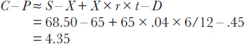

<!-- 原 EPUB 中此公式为图片，已原样保留 -->

<!-- source:block 9aa86f580ae282dc -->

> [!quote]- English 161
> If interest rates rise to 5.00 percent, the value will now be

如果利率升至5.00%，现在的价值将是

<!-- source:block 62437251c6b982ef -->

> [!quote]- English 162
> 68.50 – 65 + 65 × .05 × 6/12 – .45 ≈ 4.68

$$
68.50 - 65 + 65 \times .05 \times 6/12 - .45 \approx 4.68
$$

<!-- source:block 19db2d33a56de8f2 -->

> [!quote]- English 163
> If, on the other hand, the dividend is increased to .65, the value will be

另一方面，如果股息增加到0.65，价值将是

<!-- source:block 85731070b54dc6e5 -->

> [!quote]- English 164
> 68.50 – 65 + 65 × .04 × 6/12 – .35 = 4.15

$$
68.50 - 65 + 65 \times .04 \times 6/12 - .35 = 4.15
$$

<!-- source:block f00b47d5faeda8ec -->

> [!quote]- English 165
> A conversion or reversal entails risk because these strategies combine a synthetic underlying position, which is composed of options, with an actual position in the underlying contract. The risk arises because a synthetic position and the actual position, while very similar, can still have different characteristics, either in terms of settlement procedure, as in the futures option market, or in terms of interest or dividends, as in the stock option market. Is there any way to eliminate this risk?

转换或逆转会带来风险，因为这些策略将由期权组成的合成标的头寸与标的合约中的实际头寸相结合。风险的产生是因为合成头寸和实际头寸虽然非常相似，但仍然可能具有不同的特征，无论是在结算程序方面（如期货期权市场），还是在利息或股息方面（如股票期权市场）。有没有办法消除这种风险？

<!-- source:block a62f620f91aaacc0 -->

> [!quote]- English 166
> One way to eliminate this risk is to eliminate the position in the underlying contract. Consider a conversion:

消除这种风险的一种方法是消除标的合约中的头寸。考虑转换：

<!-- source:block 14edce2d2b1de4d0 -->

> [!quote]- English 167
> Short a call

空头看涨期权

<!-- source:block 1e00ed2cca04910e -->

> [!quote]- English 168
> Long a put

多头看跌期权

<!-- source:block 9247da2d0ec3a1e9 -->

> [!quote]- English 169
> Long an underlying contract

标的合约多头

<!-- source:block f7a5be529b8bca74 -->

> [!quote]- English 170
> If we want to maintain this position but would also like to eliminate the risk of holding an underlying position, we might replace the long underlying position with something that acts like an underlying contract but that isn’t an underlying contract. One possibility is to replace the long underlying position with a deeply in-the-money call:

如果我们想维持此头寸，但也想消除持有标的头寸的风险，我们可能会用类似于标的合约但不是标的合约的东西替换多头标的头寸。 一种可能性是用深度的ITM 看涨期权取代多头标的头寸：

<!-- source:block 37d22bb8745faa6d -->

> [!quote]- English 171
> Short a call

空头看涨期权

<!-- source:block 1e00ed2cca04910e -->

> [!quote]- English 172
> Long a put

多头看跌期权

<!-- source:block 5ae06d3e2044fef3 -->

> [!quote]- English 173
> Long a deeply in-the-money call

多头深度价内看涨期权

<!-- source:block ad415a394e0c63ca -->

> [!quote]- English 174
> If the deeply in-the-money call has a delta of 100 and therefore acts like a long underlying contract, the position will have the same characteristics as the conversion.

如果深度价内看涨期权的Delta值为100，因此表现得像一个多头标的合约，则该头寸将具有与转换相同的特征。

<!-- source:block 4d532503bca4661c -->

> [!quote]- English 175
> In the same way, instead of buying a deeply in-the-money call, we can sell a deeply in-the-money put:

同样，我们可以出售深度价内看跌期权，而不是购买深度价内看跌期权：

<!-- source:block 14edce2d2b1de4d0 -->

> [!quote]- English 176
> Short a call

空头看涨期权

<!-- source:block 1e00ed2cca04910e -->

> [!quote]- English 177
> Long a put

多头看跌期权

<!-- source:block 5a421ad88f01f782 -->

> [!quote]- English 178
> Short a deeply in-the-money put

空头深度价内看跌期权

<!-- source:block 1b72c3b08f0d420d -->

> [!quote]- English 179
> This type of position, where the underlying instrument in a conversion or reversal is replaced with a deeply in-the-money option, is known as a *three-way*. Although it eliminates some risks, a three-way is not without its own problems. If a trader sells a deeply in-the-money option to complete a three-way, he still has the risk of the market going through the exercise price. Indeed, as the underlying market moves closer and closer to the exercise price of the deeply in-the-money option, that option will act less and less like an underlying contract, and the entire position will act less and less like a true conversion or reversal.

这种类型的头寸，即转换或逆转中的标的工具被深度货币期权取代，被称为三向头寸。尽管消除了一些风险，但三方也并非没有自己的问题。如果交易者出售深度价内期权来完成三方交易，他仍然面临市场经历行权价的风险。事实上，随着标的市场越来越接近深度价内期权的行权价，该期权的表现将越来越不像标的合约，整个头寸的表现将越来越不像真正的转换或逆转。

<!-- source:block 554489d0e5ee3758 -->

### 箱式价差 / Boxes

<!-- source:block e5b819e6a5125aac -->

> [!quote]- English 180
> What else acts like an underlying contract but isn’t an underlying contract? Another possibility is to replace the underlying position with a synthetic position, but a synthetic with a different exercise price. For example, suppose that we have a June 100 conversion:

还有什么像标的合约但不是标的合约？另一种可能性是用合成头寸替换标的头寸，但是具有不同行权价的合成头寸。例如，假设我们有六月100的转换：

<!-- source:block 9860bebace381c0f -->

> [!quote]- English 181
> –1 June 100 call

-1 6月100看涨期权

<!-- source:block 32acf2336d64fa1c -->

> [!quote]- English 182
> +1 June 100 put

+1 6月100看跌

<!-- source:block 699590a365a91692 -->

> [!quote]- English 183
> +1 underlying contract

+1标的合约

<!-- source:block e79cd1c7a6ef8b0c -->

> [!quote]- English 184
> At the same time, we also execute a June 90 reversal. The combined position is

与此同时，我们还执行6月90日的逆转。合并后的头寸是

<!-- source:block 1b2efd62a9e938c4 -->

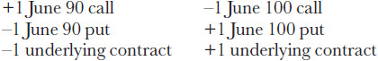

<!-- 原 EPUB 中此公式为图片，已原样保留 -->

<!-- source:block 40ecdc8996e32ebe -->

> [!quote]- English 185
> The long and short underlying contracts cancel out, leaving

多头和空头标的合约抵消，留下

<!-- source:block f455a0a893de3f7d -->

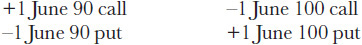

<!-- 原 EPUB 中此公式为图片，已原样保留 -->

<!-- source:block 66c32963b3c07685 -->

> [!quote]- English 186
> We have a synthetic long underlying position at the 90 exercise price and a synthetic short underlying position at the 100 exercise price. This position, known as a *box*, is similar to a conversion or reversal except that we have eliminated the risk associated with holding a position in the underlying contract. A trader is long the box when he is synthetically long at the lower exercise price and synthetically short at the higher exercise price. He is short the box when he is synthetically short at the lower exercise price and synthetically long at the higher exercise price. The example position is long a June 90/100 box.

我们在90的行权价下持有合成多头标的头寸，在100的行权价下持有合成空头标的头寸。该头寸被称为“盒子”，类似于转换或逆转，只是我们已经消除了与持有标的合约中头寸相关的风险。当交易者在较低的行权价下综合做多而在较高的行权价下综合做空时，他就是做多了。当他在较低的行权价下综合做空而在较高的行权价下综合做空时，他就是空头。示例头寸是6月90/100长框。

<!-- source:block 297baff45ed0333d -->

> [!quote]- English 187
> Like a conversion or reversal, a box is an arbitrage—we are buying and selling the same contract but in different markets. In our example, we are buying the underlying contract in the 90 exercise price market and selling the same underlying contract in the 100 exercise price market.

就像转换或逆转一样，盒子是一个套利者-我们在不同的市场上买卖同一份合约。在我们的例子中，我们在90的行权价市场上买入标的合约，并在100的行权价市场上卖出相同的标的合约。

<!-- source:block e2e22e15af81e7de -->

> [!quote]- English 188
> How much is a box worth? Ignoring pin risk, at expiration, a trader who has a box will simultaneously buy the underlying contract at one exercise price and sell the underlying contract at the other exercise price. The value of the box at expiration will be exactly the amount between exercise prices. In our example, at expiration, the 90/100 box will be worth exactly 10.00 because the trader will simultaneously buy the underlying contract at 90 (exercise the 90 call or be assigned on the 90 put) and sell the underlying contract at 100 (exercise the 100 put or be assigned on the 100 call). If the box is worth 10.00 at expiration, how much is it worth today? If the options are subject to futures-type settlement, the value today is the same as the value at expiration. If, however, the options are subject to stock-type settlement, the value of the box today will be the present value of the amount between exercise prices. If our 90/100 box expires in three months with interest rates at 8 percent, the value today is

一个盒子值多少钱？忽略大头针风险，在到期时，拥有盒子的交易者将同时以一个行权价买入标的合约，并以另一个行权价卖出标的合约。到期时盒子的价值将正好是行权价格之间的金额。在我们的例子中，到期时，90/100盒子的价值正好是10.00，因为交易者将同时在90买入标的合约（行权90看涨期权或被指派90看跌期权），并在100卖出标的合约（行权100看跌期权或被指派100看涨期权）。如果盒子到期时价值10.00，那么今天价值多少？如果期权须接受期货式结算，则今日价值与到期时的价值相同。然而，如果期权须接受股票型结算，那么今天的盒子价值将是行权价之间金额的现值。如果我们的90/100盒子在三个月内到期，利率为8%，那么今天的价值是

<!-- source:block 726bc30b07e4c548 -->

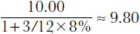

<!-- 原 EPUB 中此公式为图片，已原样保留 -->

<!-- source:block 495a534ef879116c -->

> [!quote]- English 189
> Because a box eliminates the risk associated with carrying a position in the underlying contract, boxes are even less risky than conversions and reversals, which are themselves low-risk strategies. When all options are European (there is no risk of early exercise) and the options are settled in cash rather than through delivery of the underlying contract (there is no pin risk), the purchase or sale of a box is identical to lending or borrowing funds over the life of the options. In our example, a trader who sells the 90/100 box for 9.80 has essentially borrowed funds from the buyer of the box for three months at an interest rate of 8 percent. Selling the box at a lower price is equivalent to borrowing funds at a higher interest rate. If the trader sells the three-month box at a price of 9.70, he has, in effect, agreed to borrow at an annual interest rate of 12 percent.

由于盒子消除了与在标的合约中持有头寸相关的风险，因此盒子的风险甚至比转换和逆转（转换和逆转本身就是低风险策略）更低。当所有期权都是欧洲期权（不存在提前行权的风险）并且期权以现金结算而不是通过交付标的合约（不存在pin风险）时，购买或出售盒子就相当于在期权的有效期内借出或借入资金。在我们的例子中，以9.80的价格出售90/100盒子的交易员本质上是以8%的利率从盒子买家那里借入了三个月的资金。以较低的价格出售盒子相当于以较高的利率借入资金。如果交易员以9.70的价格出售三个月期的盒子，他实际上同意以12%的年利率借款。

<!-- source:block ad3b4439d8471b0e -->

> [!quote]- English 190
> When no other method is available, a trading firm may be able to raise needed short-term cash by selling boxes. Because the firm will probably have to sell the boxes at a price lower than the theoretical value, this will increase the firm’s borrowing costs. Moreover, there will still margin requirements and transaction costs associated with this strategy, increasing the borrowing costs further.

当没有其他方法可用时，贸易公司可能能够通过出售盒子来筹集所需的短期现金。由于公司可能不得不以低于理论价值的价格出售这些盒子，这将增加公司的借贷成本。此外，该策略仍然存在与保证金要求和交易成本，进一步增加借贷成本。

<!-- source:block e07efd526ba0aeeb -->

> [!quote]- English 191
> We originally introduced a box as a conversion at one exercise price and a reversal at a different exercise price. With the long and short underlying positions canceling out, we are left with two synthetic underlying positions:

我们最初引入了一个盒子，作为在一个行权价下的转换和在不同行权价下的逆转。随着多头和空头标的头寸抵消，我们只剩下两个合成标的头寸：

<!-- source:block 95a0e14b98cb44e8 -->

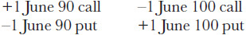

<!-- 原 EPUB 中此公式为图片，已原样保留 -->

<!-- source:block b56c4a688d522fb1 -->

> [!quote]- English 192
> The left side of the box is a synthetic long position at 90, and the right side is a synthetic short position at 100. Instead of dividing the box into a right side and a left side, suppose that we divide it into upper portion and a lower portion:

盒子的左侧是90处的合成多头，右侧是100处的合成空头。假设我们将盒子分为上半部分和下半部分，而不是将盒子分为右侧和左侧：

<!-- source:block b253aba2deb6f5e4 -->

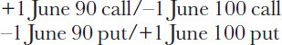

<!-- 原 EPUB 中此公式为图片，已原样保留 -->

<!-- source:block 21887f259f41de1b -->

> [!quote]- English 193
> The strategy on the top is a bull vertical call spread (i.e., long June 90 call, short June 100 call), whereas the strategy on the bottom is a bear vertical put spread (i.e., long June 100 put, short June 90 put). Because a box is a combination of two vertical spreads, the combined prices of the vertical spreads must equal the value of the box.

上方策略是牛市看涨垂直价差，即 `long June 90 call` 加 `short June 100 call`；下方策略是熊市看跌垂直价差，即 `long June 100 put` 加 `short June 90 put`。盒式价差由这两个垂直价差组合而成，因此两个垂直价差的合计价格必须等于盒式价差的价值。

<!-- source:block 90e53b4ec35fbbad -->

> [!quote]- English 194
> With three months remaining to expiration and interest rates at 8 percent, the value of our June 90/100 box is 9.80. Suppose that a trader knows that the June 90/100 call spread is trading for 6.00. The trader can estimate the fair market price for the June 90/100 put spread because he knows that the 90/100 box is worth 9.80 and that the value of a call and put spread must add up to the value of the box. The price of the put spread must therefore be

由于距离到期还有三个月，利率为8%，因此我们6月90/100盒子的价值为9.80。假设交易员知道6月90/100看涨价差为6.00。交易员可以估计6月90/100看跌期权价差的公平市场价格，因为他知道90/100盒子价值9.80，并且看涨期权和看跌期权价差的价值必须加起来等于盒子的价值。因此，看跌价差的价格必须是

<!-- source:block 779e9e3ccac84389 -->

> [!quote]- English 195
> 9.80 – 6.00 = 3.80

$$
9.80 - 6.00 = 3.80
$$

<!-- source:block 9cb09ce5e0fa337e -->

> [!quote]- English 196
> If the trader believes that he can either buy or sell the call spread for 6.00 and he is asked for a market in the put spread, he will make his market around an assumed value of 3.80. He might, for example, make a market of 3.70 bid/3.90 ask. If he is able to buy the put spread for 3.70, he can then try to buy the call spread for 6.00. If he is successful, he will have paid a total of 9.70 for a box with a theoretical value of 9.80. Conversely, if he is able to sell the put spread for 3.90, he can then try to sell the call vertical for 6.00. If he is successful, he will have sold a box with a theoretical value of 9.80 for a price of 9.90.

如果交易员相信他可以购买或出售6.00的看涨价差，并且他被要求提供看跌价差的市场，那么他将使市场处于假设值3.80左右。例如，他可能会制定一个3.70买盘/3.90买盘的市场。如果他能够以3.70的价格购买看跌价差，他就可以尝试以6.00的价格购买看涨价差。如果他成功了，他将总共支付9.70美元购买一个理论价值为9.80的盒子。相反，如果他能够以3.90的价格出售看跌价差，他就可以尝试以6.00的价格出售垂直看涨期权。如果他成功了，他将以9.90的价格出售一个理论价值为9.80的盒子。

<!-- source:block 06f840c401ac6bf8 -->

### 滚动价差 / Rolls

<!-- source:block 234852bb4309a4a9 -->

> [!quote]- English 197
> In a box, the risk of holding the underlying contract is offset by combining a conversion and reversal in the same month but at different exercise prices:

在方框中，持有标的合约的风险通过在同一个月内以不同的行权价合并转换和逆转来抵消：

<!-- source:block 8e23948be8368b0b -->

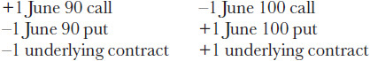

<!-- 原 EPUB 中此公式为图片，已原样保留 -->

<!-- source:block 0596e17d47e23bda -->

> [!quote]- English 198
> Suppose that we instead combine a conversion and reversal, not at different exercise prices, but in different expiration months:

假设我们将转换和逆转结合起来，不是以不同的行权价，而是在不同的到期月份：

<!-- source:block d1f216d7df163d50 -->

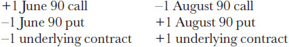

<!-- 原 EPUB 中此公式为图片，已原样保留 -->

<!-- source:block ac9ec7cea7d67b23 -->

> [!quote]- English 199
> If the long and short underlying positions cancel out, we are left with a *roll*:

如果多头和空头标的头寸抵消，我们就会留下一个滚动：

<!-- source:block c4b2c3a0e469e70f -->

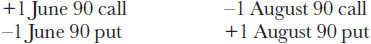

<!-- 原 EPUB 中此公式为图片，已原样保留 -->

<!-- source:block 4df17d344aa6dab1 -->

> [!quote]- English 200
> We have a synthetic long underlying position in June and a synthetic short underlying position in August, where both positions have the same exercise price.

我们在6月份有一个合成多头标的头寸，在8月份有一个合成空头标的头寸，这两个头寸的行权价相同。

<!-- source:block d869d9dd85c687f1 -->

> [!quote]- English 201
> Although it is always possible to combine a conversion in one month with a reversal in a different month, in a roll, the underlying positions must cancel out. For example, in a futures option market, the underlying for June may be a June futures contract and the underlying for August may be an August futures contract. Because they are different contracts, the long and short underlying positions will not offset each other. Hence the position is not a true roll.

尽管总是可以将一个月的转换与另一个月的逆转结合起来，但在滚动中，标的头寸必须抵消。例如，在期货期权市场中，6月的标的可能是6月期货合约，而8月的标的可能是8月期货合约。由于它们是不同的合约，所以多头和空头标的头寸不会相互抵消。因此，该头寸不是真正的滚动。

<!-- source:block 4bf6a7f150332724 -->

> [!quote]- English 202
> Rolls are done most commonly in a stock option market, where the underlying contract for all expiration months is the same underlying stock. The long stock position in one expiration month will always offset the short stock position in the other expiration month.

滚动最常见的是在股票期权市场中进行，其中所有到期月份的标的合约都是相同的标的股票。一个到期月份的多头股票头寸将始终抵消另一个到期月份的空头股票头寸。

<!-- source:block fd7641fb0bf4b2ce -->

> [!quote]- English 203
> What should be the value of a roll in the stock option market? The value of the roll must be the difference in the values of the combos

股票期权市场上一卷的价值应该是多少？卷的价值必须是组合价值的差异

<!-- source:block e52f62fc8d992d1d -->

> [!quote]- English 204
> (*C**l* – *P*l) – (*C**s* – *P**s*)

$$
(C_{l} -\,P_{l}) - (C_{s} -\,P_{s})
$$

<!-- source:block cb2a8c4dc57d4486 -->

> [!quote]- English 205
> where *C**l* and *P**l* are the long-term call and put, and *C**s* and *P**s* are the short-term call and put.

其中C1和P1是长期看涨和看跌，Cs和Ps是短期看涨和看跌。

<!-- source:block 183bf60d5fb41ec4 -->

> [!quote]- English 206
> For the moment, let’s assume that the stock pays no dividends. We know the value of a combo

目前，让我们假设该股票不支付股息。我们知道组合的价值

<!-- source:block 71fbf61fd268ace4 -->

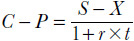

<!-- 原 EPUB 中此公式为图片，已原样保留 -->

<!-- source:block 3ddbc52aaff185c6 -->

> [!quote]- English 207
> The value of the roll should therefore be

因此，卷的价值应该是

<!-- source:block d3ef428e00649463 -->

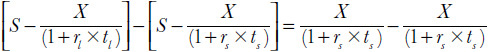

<!-- 原 EPUB 中此公式为图片，已原样保留 -->

<!-- source:block bcd456d66a879f0b -->

> [!quote]- English 208
> Excluding dividends, the value of the roll is the difference between the discounted values of the exercise price. Note that the value of the roll depends on two different interest rates—*r**s*, the interest to short-term expiration, and *r**l*, the interest to long-term expiration. These rates are usually very similar, which means that the preceding expression is almost always a positive number because the discounting on the short-term exercise price is less than the discounting on the long-term exercise price.

不包括股息，滚动的价值是行权价贴现值之间的差额。请注意，滚动的价值取决于两种不同的利率-rs，短期到期的利息，rl，长期到期的利息。这些利率通常非常相似，这意味着前面的公式几乎总是一个正值，因为短期行权价的折扣小于长期行权价的折扣。

<!-- source:block 39d7f6545bab49e0 -->

> [!quote]- English 209
> If the stock pays a dividend *D* between expirations, the value of the roll should also include this amount. Ignoring interest on dividends, the roll value is

如果股票在两次发行之间支付股息D，则股票的价值也应该包括此金额。忽略股息利息，滚动价值为

<!-- source:block 52466bae74951882 -->

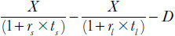

<!-- 原 EPUB 中此公式为图片，已原样保留 -->

<!-- source:block a82623e67c6d06f4 -->

> [!quote]- English 210
> Consider our June/August 90 roll, with two months to June expiration and four months to August expiration. If we assume a constant interest rate of 6 percent, and the stock is expected to pay a dividend of .40 between expirations, the value of the 90 roll is

考虑我们的6月/8月90号滚动，距离6月有两个月的到期，距离8月有四个月的到期。如果我们假设固定利率为6%，并且股票预计在两次发行之间支付0.40的股息，那么90卷的价值是

<!-- source:block 5f5f0beaa5eb306d -->

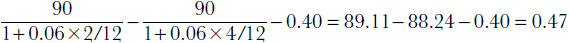

<!-- 原 EPUB 中此公式为图片，已原样保留 -->

<!-- source:block 953632e368ac0dd3 -->

> [!quote]- English 211
> A trader who needs to make calculations without computer supportmight, as with conversions and reversals, might be willing to give up some accuracy in return for greater speed. How might a trader simplify the calculation of a roll? A trader who is short a roll (i.e., long the short-term synthetic and short the long-term synthetic) will buy stock at the short-term expiration and sell stock at the long-term expiration, with both transactions taking place at the same exercise price. Additionally, because the trader will own the stock over the life of the roll, he will receive any dividends paid out over this period. The value of the roll should be approximately the cost of carrying the exercise price from one expiration to the other less any dividends that accrue

需要在没有计算机支持的情况下进行计算的交易员可能会像转换和逆转一样，愿意放弃一些准确性以换取更高的速度。交易者如何简化滚动的计算？空头交易者（即，做多短期合成股票，做空长期合成股票）将在短期到期时购买股票，并在长期到期时出售股票，两项交易以相同的行权价进行。此外，由于交易者将在股票有效期内拥有该股票，因此他将收到在此期间支付的任何股息。滚动的价值应该大约是将行权价从一个到期日转移到另一个到期日的成本减去应计的任何股息

<!-- source:block 4703883a651f87a3 -->

> [!quote]- English 212
> *X* × *r* × *t* – *D*

$$
X\,\times\,r \times\,t -\,D
$$

<!-- source:block fbc3f5d969577c8d -->

> [!quote]- English 213
> where *t* is the time between expirations. In our example, we have

其中t是两次迭代之间的时间。在我们的例子中，我们有

<!-- source:block d765fbf17d991813 -->

> [!quote]- English 214
> 90 × .06 × 2/12 – .40 = .90 – .40 = .50

$$
90 \times .06 \times 2/12 - .40 = .90 - .40 = .50
$$

<!-- source:block 93d459e3486778cf -->

> [!quote]- English 215
> Depending on the trading environment and the trader’s ultimate goal, this error of .03 may or may not be acceptable.

根据交易环境和交易者的最终目标，0.03的错误可能是可以接受的，也可能是不可接受的。

<!-- source:block fb50e1b30dcc430f -->

> [!quote]- English 216
> Instead of writing a roll as a combination of synthetic long and short underlying positions, we can also write the roll as a combination of calendar spreads:

我们不将滚动作为合成多头和空头标的头寸的组合，而是可以将滚动作为日历价差的组合：

<!-- source:block 3bb9c3ab81eda03b -->

> [!quote]- English 217
> –1 June 90 call/+1 August 90 call

-90年6 月到期、行权价为 1 的看涨期权/+90年8 月到期、行权价为 1 的看涨期权

<!-- source:block 9763b908ce5a89df -->

> [!quote]- English 218
> +1 June 90 put/–1 August 90 put

+1 6 月到期、行权价为 90 的看跌/-1 月到期、行权价为 90 的看跌

<!-- source:block 910a4b78f0b19384 -->

> [!quote]- English 219
> The strategy on the top is a long call calendar spread; the strategy on the bottom is a short put calendar spread. If we buy the call calendar spread and sell the put calendar spread, we have a roll. The value of the roll should therefore be equal to the difference between the two calendar spreads.6

顶部的策略是查看期货多头日历价差;底部的策略是查看期货多头日历价差。如果我们购买多头多头看涨期权日历价差并出售空头空头看跌期权日历价差，我们就有了一轮。因此，卷轴的价值应该等于两个日历价差之间的差。 [^ovp15-6]

<!-- source:block 5dd2d197437cbebe -->

> [!quote]- English 220
> Because the interest component is almost always greater than dividends, a long roll (i.e., buy the long-term synthetic, sell the short-term synthetic) will typically trade for a positive value, requiring an outlay of cash. Consequently, the call calendar spread will be more valuable than the put calendar spread. However, if dividends are greater than interest, a roll can have a negative value.7 Then the normal relationship will be inverted: the put calendar spread will be more valuable than the call calendar spread.

由于利息部分几乎总是大于股息，因此长期滚动（即，购买长期合成物，出售短期合成物）通常会交易为正值，需要现金支出。因此，看涨日历价差将比看跌日历价差更有价值。然而，如果股息大于利息，则滚动可能具有负值。[^ovp15-7]那么正常关系将颠倒：看跌日历价差将比看涨日历价差更有价值。

<!-- source:block 2d2ea9e0aa2b9410 -->

> [!quote]- English 221
> In our earlier example, we calculated the value of the June/August 90 roll as .47. Suppose that the June/August 90 call calendar spread is trading for 2.25. What should be the value of the June/August 90 put calendar spread? We know that the difference between the spreads must be .47. The value of the put spread ought to be

在前面的例子中，我们算得由 6 月和 8 月到期、行权价均为 90 的合成头寸构成的展期组合（roll）价值为 0.47。假设 6 月/8 月到期、行权价为 90 的看涨日历价差交易价格为 2.25，那么 6 月/8 月到期、行权价为 90 的看跌日历价差应值多少？我们知道两个价差的价值之差必为 0.47，因此看跌价差的价值应为

<!-- source:block 54a33538a4c09988 -->

> [!quote]- English 222
> 2.25 – .47 = 1.78

$$
2.25 - .47 = 1.78
$$

<!-- source:block 9c84e7604085d062 -->

> [!quote]- English 223
> In the same way, if the put spread is trading for 1.50, the call spread ought to be trading for

同样，如果看跌期权价差的交易价格为1.50，则看涨期权价差的交易价格应为

<!-- source:block e1464a16b9cdbdd2 -->

> [!quote]- English 224
> 1.50 + .47 = 1.97

$$
1.50 + .47 = 1.97
$$

<!-- source:block e7cf37c9dc6e5039 -->

> [!quote]- English 225
> Because dividends are discrete amounts that apply equally to all rolls with the same expiration dates, the values of rolls with the same expiration date but different exercise prices should differ by approximately the interest on exercise prices. In our example, the value of the June/August 90 roll was .47. The value of the June/August 80 roll should differ from the value of the 90 roll by the interest on the difference between 80 and 90

由于股息是离散金额，同等适用于到期日相同的所有股息，因此到期日相同但行权价不同的股息的价值应该相差大约为行权价的利息。在我们的示例中，6月/8月90日滚动的值为0.47。6月/8月80日卷的价值与90日卷的价值应相差80和90之间的利息

<!-- source:block 3c558457e3141802 -->

> [!quote]- English 226
> 0.47 – (90 – 80) × .06 × 2/12 = .47 – .10 = 0.37

$$
0.47 - (90 - 80) \times .06 \times 2/12 = .47 - .10 = 0.37
$$

<!-- source:block 6a125d45b5413bfb -->

> [!quote]- English 227
> Whiles a trader may execute a roll with the intention of eliminating the risk of holding the underlying contract, this risk is only eliminated up to the short-term expiration. At that time, the trader will either buy or sell the underlying stock at the exercise price. The position is therefore sensitive to changes in interest rates and dividends. Rolls fluctuate in value as interest rates rise or fall and as dividends are raised or lowered. The more time between expirations, the more sensitive a roll will be to these changes.

虽然交易员可能为了消除持有标的合约的风险而执行滚动，但这种风险只会在短期到期之前消除。届时，交易员将以行权价购买或出售标的股票。因此，该头寸对利率和股息的变化很敏感。随着利率上升或下降以及股息的增加或减少，滚动的价值会波动。滚动之间的时间越长，滚动对这些变化就越敏感。

<!-- source:block b60a8b146ffa1c39 -->

### 时间箱式价差 / Time boxes

<!-- source:block c347a029edb8c5d4 -->

> [!quote]- English 228
> A box or roll consists of long and short synthetic positions, either in the same month but at different exercise prices (a box) or in different months but at the same exercise price (a roll). We can also combine these strategies by taking synthetic positions at different exercise prices and in different months:

盒装或滚动由多头和空头合成头寸组成，可以在同一个月但行权价不同（盒装），也可以在不同月份但行权价相同（滚动）。我们还可以通过在不同的行权价和不同月份持有合成头寸来组合这些策略：

<!-- source:block ef3a8b31e23d2d10 -->

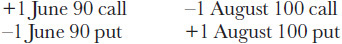

<!-- 原 EPUB 中此公式为图片，已原样保留 -->

<!-- source:block e8d3cf7b8bcb16fe -->

> [!quote]- English 229
> This position is usually referred to as either a *time box* or *diagonal roll*.

这个头寸通常被称为时间盒或对角线滚动。

<!-- source:block 60e8bb28973e8261 -->

> [!quote]- English 230
> We can calculate the value of a time box in the same way we calculated the value of a roll—by taking the difference between the discounted exercise prices less expected dividends

我们可以计算时间盒的价值，与计算滚存价值的方式相同，即贴现行权价减去预期股息之间的差异

<!-- source:block 351d626a6257691e -->

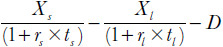

<!-- 原 EPUB 中此公式为图片，已原样保留 -->

<!-- source:block ec83491406e8bf03 -->

> [!quote]- English 231
> where the subscripts *s* and *l* refer to short-term options and long-term options.

其中，后缀s和l指短期期权和长期期权。

<!-- source:block bc238a27f08ea26e -->

> [!quote]- English 232
> What should be the value of the June 90/August 100 time box if there are two months to June expiration and four months to August expiration, interest rates are a constant 6 percent, and the stock is expected to pay a dividend of .40 over this period?

如果距离6月还有两个月的到期时间，距离8月还有四个月的到期时间，利率为6%，并且股票预计在此期间支付0.40的股息，那么6月90日/8月100日的时间盒的价值应该是多少？

<!-- source:block ea5bfc2e9f1d9d1f -->

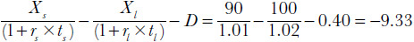

<!-- 原 EPUB 中此公式为图片，已原样保留 -->

<!-- source:block ee0ca3c936b3bdbc -->

> [!quote]- English 233
> The negative sign indicates that if a trader wants to put on this position, he will have to pay 9.33. This is logical because the position consists of buying the lower-exercise-price synthetic (i.e., buy the underlying at 90 at June expiration) and selling the higher-exercise-price synthetic (i.e., sell the underlying at 100 at August expiration).

负值表明如果交易者想要持有此头寸，他将必须支付9.33。这是合乎逻辑的，因为该头寸包括购买较低行权价的合成产品（即，在6月到期时以90的价格购买基础债券）并出售行权价较高的合成债券（即，8月到期时以100点出售标的）。

<!-- source:block 1adb1f8c1e48489f -->

> [!quote]- English 234
> In the same way that boxes are made up of bull and bear spreads and rolls are made up of calendar spreads, time boxes are made up of diagonal spreads. We can write our time box as two diagonal spreads:

就像盒子由牛市和熊市价差组成，滚动由日历价差组成一样，时间盒子由对角线价差组成。我们可以将时间框写成两个对角线价差：

<!-- source:block c97c1e9d8ba9c948 -->

> [!quote]- English 235
> +1 June 90 call/–1 August 100 call

$$
+1 \text{June} 90 \text{call}/-1 \text{August} 100 \text{call}
$$

<!-- source:block 7dbfa7744f810c31 -->

> [!quote]- English 236
> –1 June 90 put/+1 August 100 put

$$
-1 \text{June} 90 \text{put}/+1 \text{August} 100 \text{put}
$$

<!-- source:block 90b2004bde43d876 -->

> [!quote]- English 237
> Are we paying or receiving money for each of these spreads? We are clearly paying for the put spread because the August 100 put will always be more valuable than the June 90 put. But it’s not clear what the cash flow is for the call spread. The lower exercise price seems to imply that the June call will be more valuable, but the greater amount of time might in fact make the August call more valuable. The values of the call options will depend on both the underlying price and volatility. In some cases, we may pay for the call spread; in other cases, we may be paid. Regardless of the prices of the individual spreads, though, the total debit must be 9.33. If the call spread is trading for 3.50, the put spread ought to be trading for 9.33 – 3.50 = 5.83. If the put spread is trading for 7.75, the call spread ought to be trading for 9.33 – 7.75 = 1.58.

我们是否正在为这些价差支付或收款？我们显然正在为看跌期权价差买单，因为8 月到期、行权价为 100 的看跌期权永远比6 月到期、行权价为 90 的看跌期权更有价值。但目前尚不清楚看涨价差的现金流是多少。较低的行权价似乎意味着六月看涨期权将更有价值，但更长的时间实际上可能会使八月看涨期权更有价值。看涨期权的价值将取决于标的价格和波动率。在某些情况下，我们可能会支付价差费用;在其他情况下，我们可能会获得报酬。不过，无论单个价差的价格如何，debit 总额必须为9.33。如果看涨价差为3.50，则看跌价差应为9.33 - 3.50 = 5.83。如果看跌价差为7.75，则看涨价差应为9.33 - 7.75 = 1.58。

<!-- source:block 8e7a318ecf50999d -->

> [!quote]- English 238
> Because a time box is a combination of a box and a roll, if we can value a box and a roll, we ought to be able to value a time box. Suppose that we buy the June 90/100 box

因为时间盒是盒子和卷轴的组合，如果我们能够评估盒子和卷轴，我们就应该能够评估时间盒。假设我们买了June 90/100盒子

<!-- source:block aa5d714b9c397c2c -->

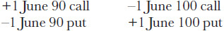

<!-- 原 EPUB 中此公式为图片，已原样保留 -->

<!-- source:block 5c4286f2df034fe7 -->

> [!quote]- English 239
> and at the same time sell the June/August 100 roll

同时出售6月/8月100卷

<!-- source:block e719e0c03002c094 -->

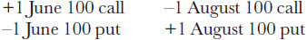

<!-- 原 EPUB 中此公式为图片，已原样保留 -->

<!-- source:block 98251bac05b0f1fc -->

> [!quote]- English 240
> The long and short June 100 synthetics cancel out, leaving the June 90/August 100 time box:

6月100日的长和短合成物抵消，留下6月90日/8月100日的时间框：

<!-- source:block 08c12ee55c314b13 -->

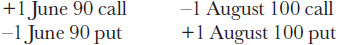

<!-- 原 EPUB 中此公式为图片，已原样保留 -->

<!-- source:block 078a2e92bed60690 -->

> [!quote]- English 241
> The time box must therefore be a combination of buying the June 90/100 box and selling the June/August 100 roll.

因此，时间盒必须是购买6月90/100盒和出售6月/8月100卷的组合。

<!-- source:block 02c879024f2f9e77 -->

> [!quote]- English 242
> Similarly, suppose that we buy the August 90/100 box

同样，假设我们购买August 90/100盒子

<!-- source:block b787e2ecda24dc00 -->

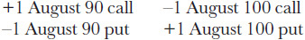

<!-- 原 EPUB 中此公式为图片，已原样保留 -->

<!-- source:block 0ee93b5ac92448fa -->

> [!quote]- English 243
> and at the same time sell the June/August 90 roll

同时出售6月/8月90卷

<!-- source:block 42bf3295d67c8833 -->

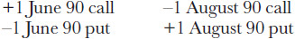

<!-- 原 EPUB 中此公式为图片，已原样保留 -->

<!-- source:block 7ddf2ec21478fd7f -->

> [!quote]- English 244
> The long and short August 90 synthetics cancel out, again leaving the June 90/August 100 time box:

8月90日的长短合成物抵消，再次留下6月90日/8月100日的时间框：

<!-- source:block bbfcfb0791469488 -->

<!-- 原 EPUB 中此公式为图片，已原样保留 -->

<!-- source:block d59c28c77903b57c -->

> [!quote]- English 245
> In this case, the time box is a combination of buying the August 90/100 box and selling the June/August 90 roll.

在这种情况下，时间盒是购买8月90/100盒和出售6月/8月90卷的组合。

<!-- source:block 4170170b8833eb7f -->

> [!quote]- English 246
> From the foregoing examples, we can see that if we buy a long-term box and sell a lower-exercise-price roll or buy a short-term box and sell a higher-exercise-price roll, both combinations result in the same time box. We can confirm this by calculating the value of the June and August 90/100 boxes as well as the June/August 90 and 100 rolls

从前面的例子中，我们可以看到，如果我们购买一个长期盒子并出售较低行权价的卷轴，或者购买一个短期盒子并出售较高行权价的卷轴，那么两种组合都会产生相同的时间盒。我们可以通过计算6月和8月90/100箱以及6月/8月90和100卷的价值来确认这一点

<!-- source:block 2b6f87c2a3f14736 -->

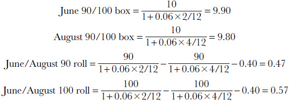

<!-- 原 EPUB 中此公式为图片，已原样保留 -->

<!-- source:block ffa8e4673d58ceca -->

> [!quote]- English 247
> If we buy the June 90/100 box and sell the June/August 100 roll, the total value is

如果我们购买6月90/100箱并出售6月/8月100卷，总价值为

<!-- source:block a38fa6df57bf5e19 -->

> [!quote]- English 248
> –9.90 + .57 = –9.33

$$
-9.90 + .57 = -9.33
$$

<!-- source:block 1c04230663a3dfc6 -->

> [!quote]- English 249
> If we buy the August 90/100 box and sell the June/August 90 roll, the total value is

如果我们买8月90/100的盒子，卖6月/8月90的卷，总价值是

<!-- source:block c953ffdd2c9b9333 -->

> [!quote]- English 250
> –9.80 + .47 = –9.33

$$
-9.80 + .47 = -9.33
$$

<!-- source:block d994357a6c84d49d -->

> [!quote]- English 251
> The total in both cases is equal to the value of the time box.

两种情况下的总数都等于时间盒的值。

<!-- source:block 1f303f76bb0c4252 -->

### 在波动率价差中使用合成头寸 / Using Synthetics in Volatility Spreads

<!-- source:block e9e0f318d44fd4ad -->

> [!quote]- English 252
> Any mispriced arbitrage relationship will be quickly recognized by almost all traders. Consequently, there are few opportunities to profit from a mispriced conversion or reversal. When a mispricing does arise, it is likely to be small and very short-lived. Only a professional trader, who has low transaction costs and immediate access to markets, is likely to be able to profit from such a situation. But even if a trader does not intend to execute an arbitrage, he may be able to use a knowledge of arbitrage pricing relationships to execute a strategy at more favorable prices.

任何定价错误的套利关系都会很快被几乎所有交易者认识到。因此，几乎没有机会从错误定价的转换或逆转中获利。当定价错误确实出现时，它可能很小且持续时间非常短暂。只有交易成本低且可以立即进入市场的专业交易者才可能从这种情况中获利。但即使交易者不打算执行套利，他也可能能够利用对套利定价关系的了解以更优惠的价格执行策略。

<!-- source:block 653eb186938c1f23 -->

> [!quote]- English 253
> In Chapter 14, we noted that because there is a synthetic equivalent for every contract, there are three ways to buy a straddle:

在第14,章中，我们注意到，由于每个合约都有合成等效合约，因此有三种购买跨式的方法：

<!-- source:block f6c4bd4758ac2657 -->

> [!quote]- English 254
> 1. Buy a call, buy a put.

1.买看涨期权，买看跌期权。

<!-- source:block c97ef4ec8ad92cf2 -->

> [!quote]- English 255
> 2. Buy a call, buy a put synthetically (buy two calls, sell an underlying contract)

2.买入看涨期权，综合买入看跌期权（买入两次看涨期权，卖出一份标的合约）

<!-- source:block 466d128768905c46 -->

> [!quote]- English 256
> 3. Buy a call synthetically, but a put (buy two puts, buy an underlying contract)

3.综合购买看涨期权，但看跌期权（购买两个看跌期权，购买标的合约）

<!-- source:block 647f77d08b0fb859 -->

> [!quote]- English 257
> Suppose that we have the following prices for a call, a put, and an underlying stock:

假设我们有以下看涨股票、看跌股票和标的股票的价格：

<!-- source:block c24c825d0ae12459 -->

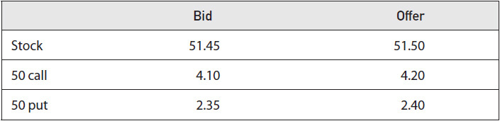

<!-- source:block ac98d0a2f0b3d8fb -->

> [!quote]- English 258
> If there are three months remaining to expiration, interest rates are 4.00 percent, and we expect the stock to pay a dividend of .25 prior to expiration, what is the best way to buy the 50 straddle?

如果距离到期还有三个月，利率为4.00 %，并且我们预计股票将在到期前支付.25的股息，那么购买50 Straddle的最佳方式是什么？

<!-- source:block 153c1096a1c631b2 -->

> [!quote]- English 259
> Assuming that we must sell at the bid price and buy at the offer price, if we buy the straddle outright, we will pay a total of 4.20 + 2.40 = 6.60. Suppose, however, that we buy the put synthetically (i.e., buy the call, sell the underlying). How much are we actually paying for the put?

假设我们必须以买入价出售并以卖出价购买，如果我们直接购买跨式，我们将支付总计4.20 + 2.40 = 6.60。然而，假设我们综合购买看跌期权（即，买入看涨期权，卖出标的）。我们实际上为看跌期权支付了多少钱？

<!-- source:block 0b9e699bdc1bd39f -->

> [!quote]- English 260
> Recall the approximation for put-call parity for stock options

回想一下股票期权的看跌期权平价的近似值

<!-- source:block 57e891bd8d8f03e3 -->

> [!quote]- English 261
> Call price – put price = stock price – exercise price + interest on exercise price – expected dividends

$$
\text{Call price} - \text{put price} = \text{stock price} - \text{exercise price} + \text{interest on exercise price} - \text{expected dividends}
$$

<!-- source:block 6d2711243cf627ca -->

> [!quote]- English 262
> If we buy the put synthetically, we will have to pay 4.20 for the call and sell the stock at 51.45. Therefore,

如果我们综合购买看跌期权，我们必须支付4.20的看涨期权并以51.45的价格出售股票。因此，

<!-- source:block bab91b1338797f44 -->

> [!quote]- English 263
> 4.20 – ?? = 51.45 – 50 + 50 × .04 × 3/12 – .25 = 1.70

$$
4.20 - ?? = 51.45 - 50 + 50 \times .04 \times 3/12 - .25 = 1.70
$$

<!-- source:block 8567a0261a36a66d -->

> [!quote]- English 264
> The cost of buying the put synthetically must be 2.50. This is higher than the actual price of 2.40, so this is a worse choice than buying the straddle outright.

综合买入看跌期权的成本必须是2.50。这比2.40的实际价格要高，所以这是一个比直接购买跨式更糟糕的选择。

<!-- source:block 135ef6b72627d521 -->

> [!quote]- English 265
> What about buying the call synthetically (i.e., buy the put, buy the underlying)? We will pay 2.40 for the put and 51.50 for the stock. This gives us

综合购买看涨期权怎么样（即，购买看跌期权，购买标的）？我们将为看跌期权支付2.40，为股票支付51.50。这给了我们

<!-- source:block c65a93bbfbd40978 -->

> [!quote]- English 266
> ?? – 2.40 = 51.50 – 50 + 50 × .04 × 3/12 – .25 = 1.75

$$
?? - 2.40 = 51.50 - 50 + 50 \times .04 \times 3/12 - .25 = 1.75
$$

<!-- source:block 8df1f0939d43751c -->

> [!quote]- English 267
> The synthetic call price is 4.15. This is in fact better than the actual call price of 4.20. If we buy the straddle synthetically, buying two calls and buying stock, we are paying a total of 4.15 + 2.40 = 6.55, or .05 better than buying the straddle outright.

合成看涨价格为4.15。这实际上比4.20的实际看涨价格要好。如果我们综合购买跨式，购买两个看涨期权并购买股票，我们总共支付4.15 + 2.40 = 6.55，或者比直接购买跨式好0.05。

<!-- source:block 0c61237f754a5663 -->

> [!quote]- English 268
> How important is a savings of .05? That probably depends on several factors—the size in which the spread will be done, the liquidity of the market, and execution costs and brokerage fees. A professional trader, who has very low transaction costs and tends to trade in large volumes, ought to be very happy to save .05. On the other hand, a retail customer may find that the outright straddle, because it involves only two contracts rather than three, entails lower transaction costs and can be executed more easily in the marketplace. It might be a better practical choice, even if it means giving up a potential savings of .05.

节省0.05有多重要？这可能取决于几个因素——价差的规模、市场的流动性以及执行成本和经纪费。一个交易成本非常低并且倾向于大量交易的专业交易者应该非常乐意节省0.05。另一方面，零售客户可能会发现，完全跨式，因为它只涉及两份而不是三份合约，需要更低的交易成本，并且可以更容易地在市场上执行。这可能是一个更好的实用选择，即使这意味着放弃潜在的0.05节省。

<!-- source:block bb72dd20e7e918b4 -->

> [!quote]- English 269
> It might seem that when we are able to trade a contract synthetically at a better price than the actual price, there must an arbitrage opportunity available. But in our example no arbitrage opportunity exists. If we do a conversion (i.e., sell call, buy put, buy stock), the put-call parity calculation is

看起来，当我们能够以比实际价格更好的价格进行综合交易时，一定有可用的套利机会。但在我们的例子中，不存在套利机会。如果我们进行转换（即，卖出看涨期权、买入看跌期权、买入股票），看跌期权平价计算为

<!-- source:block 48f2f01ac8c762af -->

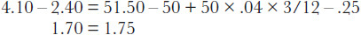

<!-- 原 EPUB 中此公式为图片，已原样保留 -->

<!-- source:block 1896f647dac97ed5 -->

> [!quote]- English 270
> We will be selling stock, synthetically, at 1.70 and buying at 1.75.

我们将以1.70的价格综合出售股票，并以1.75的价格买入股票。

<!-- source:block 85135d7c56261458 -->

> [!quote]- English 271
> If we instead do a reverse conversion (i.e., buy call, sell put, sell stock), the calculation is

如果我们进行反向转换（即，买入看涨期权、卖出看跌期权、卖出股票），计算是

<!-- source:block d6f9ec3f4ba9e641 -->

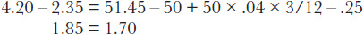

<!-- 原 EPUB 中此公式为图片，已原样保留 -->

<!-- source:block 0a0d4e4e5b9e6308 -->

> [!quote]- English 272
> Now we are buying stock, synthetically, at 1.85 and selling at 1.70. Because we must buy at the bid and sell at the offer, no arbitrage is available in either case. Our goal, however, was a volatility spread, not an arbitrage. And the bid-ask spreads were such that we were able to buy the straddle synthetically at a savings of .05.

现在我们综合买入股票，买入价格为1.85，卖出价格为1.70。因为我们必须按价买入并按价卖出，因此在任何情况下都没有套利可用。然而，我们的目标是波动率价差，而不是套利。而且买卖价差如此之大，以至于我们能够以0.05的价格综合购买跨式。

<!-- source:block 6c884ac1c1c07efd -->

> [!quote]- English 273
> Let’s expand the number of options and consider a different example:

让我们扩大期权的数量并考虑一个不同的示例：

<!-- source:block a39707cbf0852aab -->

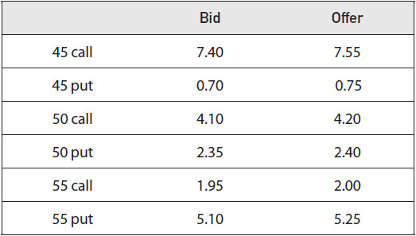

<!-- source:block fe00af1e5be98757 -->

> [!quote]- English 274
> If, as before, there are three months remaining to expiration and interest rates are 4 percent, what is the best way to buy the 45/50/55 butterfly?

如果像以前一样，距离到期还有三个月，利率为4%，那么购买45/50/55蝶式价差的最佳方式是什么？

<!-- source:block 40f8a1b664250a6b -->

> [!quote]- English 275
> We might begin by comparing the prices of the call and put butterflies. We know that these are equivalent strategies and ought to have the same prices.

我们可能会从比较看涨期权的价格开始并放置蝶式价差。我们知道这些是等效的策略，并且应该有相同的价格。

<!-- source:block 0387b457c70dc43f -->

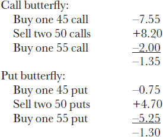

<!-- 原 EPUB 中此公式为图片，已原样保留 -->

<!-- source:block be1b682839f97497 -->

> [!quote]- English 276
> Buying the put butterfly is slightly better than buying the call butterfly.

购买看跌蝶式价差比购买看涨蝶式价差稍微好一点。

<!-- source:block 870deaf7a7d5f8e7 -->

> [!quote]- English 277
> In addition to buying the call or put butterfly, we have a third choice—we can sell an iron butterfly. In Chapter 14, we noted that selling an iron butterfly (i.e., buy a strangle and sell a straddle) is equivalent to buying a butterfly. Moreover, the value of the iron butterfly and the value of an actual butterfly must add up to the present value of the amount between exercise prices. In our example, the values must add up to

除了购买看涨或看跌蝶式价差之外，我们还有第三个选择——我们可以出售铁蝶式价差。在第14章中，我们注意到出售铁蝶式价差（即，买一只宽跨式的，卖一只跨式的）相当于买一只蝶式价差。此外，铁蝶式价差的价值和实际蝶式价差的价值加起来必须等于行权价之间金额的现值。在我们的示例中，值加起来必须为

<!-- source:block 0c1d6f9aa89d9a72 -->

> [!quote]- English 278
> 5.00/(1 + .04 × 3/12) = 4.95

$$
5.00/(1 + .04 \times 3/12) = 4.95
$$

<!-- source:block 94a77333fc5c3ed1 -->

> [!quote]- English 279
> Therefore, paying 1.30 for the put butterfly is the same as selling the iron butterfly for 4.95 – 1.30 = 3.65. At what price can we sell the iron butterfly?

因此，支付1.30美元买看跌蝶，等于以4.95 - 1.30 = 3.65美元卖铁蝶。铁蝶式价差卖多少钱？

<!-- source:block 1db852dec3f41021 -->

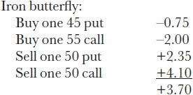

<!-- 原 EPUB 中此公式为图片，已原样保留 -->

<!-- source:block e9bc380b60bed668 -->

> [!quote]- English 280
> If buying the put butterfly for 1.30 is equivalent to selling the iron butterfly for 3.65, then selling the iron butterfly at a price of 3.70 must be .05 better. This, in theory, seems to be the best way to buy the 45/50/55 butterfly.

如果以1.30的价格购买看跌蝶式价差相当于以3.65的价格出售铁蝶式价差，那么以3.70的价格出售铁蝶式价差一定要好0.05。理论上，这似乎是购买45/50/55蝶式价差的最佳方式。

<!-- source:block 129ce1e2e712be20 -->

> [!quote]- English 281
> Even though selling the iron butterfly is best in theory, other factors, such as ease of execution and transaction costs, may play a role. Everything else being equal, though, selling the iron butterfly for 3.70 is the best way to execute our butterfly strategy.

尽管理论上出售铁蝶式价差是最好的，但执行便利性和交易成本等其他因素也可能发挥作用。不过，在其他条件相同的情况下，以3.70的价格出售铁蝶式价差是执行我们蝶式价差策略的最佳方式。

<!-- source:block fa7338f00bf428b9 -->

> [!quote]- English 282
> The relationship between the prices of call butterflies, put butterflies, and iron butterflies is based on synthetic relationships—the ability to express any contract as a synthetic equivalent. The reader may wish to confirm that no arbitrage opportunities exist, either in the form of conversions, reverse conversions, or boxes. Our goal, however, was not to take advantage of an arbitrage opportunity but rather to find the best price at which to buy a butterfly. Our knowledge of synthetic pricing relationships enabled us to do this.

看涨蝶式价差、看跌蝶式价差和铁蝶式价差的价格之间的关系是基于合成关系——将任何合约表达为合成等效物的能力。读者可能希望确认不存在套利机会，无论是转换、反向转换还是盒子的形式。然而，我们的目标不是利用套利机会，而是找到购买蝶式价差的最佳价格。我们对合成定价关系的了解使我们能够做到这一点。

<!-- source:block 39b37fd921f0c10f -->

> [!quote]- English 283
> Figure 15-3 is a summary of basic arbitrage pricing relationships. Whenever a trader is considering a strategy, he ought to always ask whether he can do better by executing some part of his strategy synthetically. Usually this will not be possible because synthetic relationships tend to be very efficient. Occasionally, though, the trader will find that the synthetic position is slightly more favorable. And over a career of trading, even small savings can add up.

图15-3是基本套利定价关系的总结。每当交易者考虑策略时，他都应该问自己是否可以通过综合执行策略的某些部分做得更好。通常这是不可能的，因为合成关系往往非常有效。不过，偶尔交易者会发现合成头寸稍微有利一些。在交易生涯中，即使是很小的节省也可以累积起来。

<!-- source:block 572b5b4265713fab -->

*图15-3欧式期权套利关系摘要。 / Figure 15-3 Summary of arbitrage relationships for european options.*

<!-- source:block 936894a655d55a6b -->

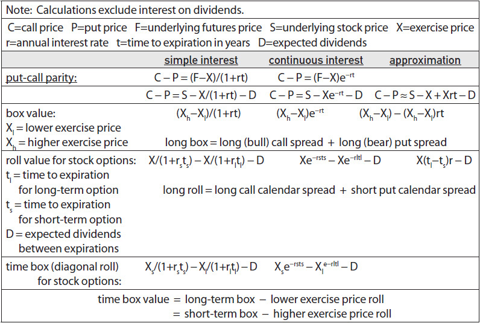

<!-- source:block 1295181e6767e9dd -->

> [!note] Footnote 285
> 1 Some traders refer to a conversion as a *forward conversion* because the synthetic portion of the strategy is really a synthetic forward contract. It will not turn into an underlying contract until expiration

[^ovp15-1]: 一些交易员将转换称为远期转换，因为该策略的合成部分实际上是合成远期合约。到期前不会成为标的合约

<!-- source:block 71c720c7a98d47d0 -->

> [!note] Footnote 286
> 2 The options in Figure 15-2 are in fact American and therefore entail the possibility of early exercise. However, when options on futures are subject to futures-type settlement, as they are on Eurex, we will see in Chapter 16 that there is effectively no difference between a European and an American option.

[^ovp15-2]: 图15-2中的期权实际上是美国的，因此需要提前行权的可能性。然而，当期货期权受到期货类型结算时，就像在欧洲期货交易所一样，我们将在第16章中看到，欧洲期权和美国期权之间实际上没有区别。

<!-- source:block 23eb38ea4f61a0f4 -->

> [!note] Footnote 287
> 3 There may be a margin requirement associated with changes in the option prices. But, as discussed in Chapter 1, margin deposits, in theory, belong to the trader and therefore entail no loss of interest.

[^ovp15-3]: 期权价格的变化可能会有保证金要求。但是，正如第1章所讨论的那样，保证金存款理论上属于交易者，因此不会造成利息损失。

<!-- source:block 31d8cb6749263235 -->

> [!note] Footnote 288
> 4 A similar type of settlement risk occurs when a futures contract is used to hedge a physical commodity or security position. When the value of the physical commodity or security rises or falls, any profit or loss is unrealized. But the profit or loss on the futures position is immediately realized in the form of variation. The correct hedge is therefore not one to one but is determined by the interest on the variation from the futures position. Hedgers sometime refer to this risk as *tailing*.

[^ovp15-4]: 当期货合约被用来对冲实物商品或证券头寸时，也会出现类似的结算风险。当实物商品或证券的价值上升或下降时，任何利润或损失都是未实现的。但是，期货头寸的利润或损失立即以变化的形式实现。因此，正确的套期保值不是一对一的，而是由期货头寸变化的利息决定的。对冲者有时将这种风险称为尾随。

<!-- source:block c9c9e07001ef8ad9 -->

> [!note] Footnote 289
> 5 In theory, a trader can borrow money at a fixed rate, eliminating any interest-rate risk. In practice, however, traders usually finance their trading activities through their broker or clearing firm at a variable rate. The cost of borrowing or lending changes daily as interest rates rise or fall.

[^ovp15-5]: 理论上，交易员可以以固定利率借钱，从而消除任何利率风险。然而，在实践中，交易员通常通过经纪人或清算公司以可变利率为其交易活动提供资金。借贷成本每天都会随着利率上升或下降而变化。

<!-- source:block 4a95255156e858de -->

> [!note] Footnote 290
> 6 Note that the value of a box is equal to the *sum* of two spreads, a bull spread and a bear spread, while the value of a roll is equal to the *difference* between two spreads, a call calendar spread and a put calendar spread.

[^ovp15-6]: 请注意，箱式价差（box）的价值等于两个价差——牛市价差与熊市价差——的总和；滚动策略（roll）的价值则等于看涨日历价差与看跌日历价差之差。

<!-- source:block 0ba63888db47a577 -->

> [!note] Footnote 291
> 7 Traders need to be careful about what they mean by *buying* and *selling*. Usually, buying means paying some amount (a cash debit), while selling means receiving some amount (a cash credit). With some strategies, however, it may not be clear whether the trader is paying or receiving. Rolls are an example of this.

[^ovp15-7]: 交易者必须明确“买入”与“卖出”的含义。通常，买入意味着支付一笔资金，即产生 `cash debit`；卖出意味着收到一笔资金，即产生 `cash credit`。但在某些策略中，交易者究竟是在支付还是收取资金并不直观，滚动策略（roll）就是一例。

---

[[阅读导航|← 返回阅读导航]]

<!-- chapter-nav:start -->
> [!tip] 章节导航（章末）
> [[合成头寸 Synthetics|← 上一章]] · [[阅读导航|全书导航]] · [[美式期权的提前行权 Early Exercise of American Options|下一章 →]]
<!-- chapter-nav:end -->
