# 第23章 模型与现实世界 / Models and the Real World

[[阅读导航|← 返回阅读导航]] · [[翻译说明与术语表|术语表]]

> [!warning] 翻译状态
> 本章为机器初译，并使用本地术语表校验。英文原文、数字、公式和图表用于核对；中文将在后续复核中继续修订。

<!-- chapter-toc:start -->
## 本章目录 / Chapter Outline

> [!abstract] 结构导航
> 以下标题按原书顺序保留；点击可直接跳转。

- [[#市场无摩擦 / Markets are Frictionless|市场无摩擦 / Markets are Frictionless]]
- [[#期权存续期内利率不变 / Interest Rates are Constant over the Life of an Option|期权存续期内利率不变 / Interest Rates are Constant over the Life of an Option]]
- [[#期权存续期内波动率不变 / Volatility Is Constant over the Life of the Option|期权存续期内波动率不变 / Volatility Is Constant over the Life of the Option]]
- [[#交易是连续的 / Trading Is Continuous|交易是连续的 / Trading Is Continuous]]
- [[#到期跨式策略 / Expiration Straddles|到期跨式策略 / Expiration Straddles]]
- [[#波动率独立于标的合约价格 / Volatility Is Independent of the Price of the Underlying Contract|波动率独立于标的合约价格 / Volatility Is Independent of the Price of the Underlying Contract]]
- [[#到期时标的价格服从对数正态分布 / Underlying Prices at Expiration Are Lognormally Distributed|到期时标的价格服从对数正态分布 / Underlying Prices at Expiration Are Lognormally Distributed]]
- [[#偏度与峰度 / Skewness and Kurtosis|偏度与峰度 / Skewness and Kurtosis]]
<!-- chapter-toc:end -->
<!-- chapter-nav:start -->
> [!tip] 章节导航（章首）
> [[股票指数期货与期权 Stock Index Futures and Options|← 上一章]] · [[阅读导航|全书导航]] · [[波动率偏斜 Volatility Skews|下一章 →]]
<!-- chapter-nav:end -->
<!-- source:block 84c28d29ee17a60e -->

> [!quote]- English 1
> A trader who uses a theoretical pricing model is exposed to two types of risk—the risk that the trader has the wrong inputs into the model and the risk that the model itself is wrong because it is based on false or unrealistic assumptions. Thus far we have focused primarily on the first area, the risk associated with the inputs into the model. A trader will typically deal with this risk by paying close attention to the sensitivities of an option position (i.e., delta, gamma, theta, vega, and rho), thereby preparing to take protective action when market conditions move against him. While any of the inputs into the model may represent a risk, we have placed special emphasis on volatility because it is the one input that cannot be directly observed in the marketplace.

使用理论定价模型的交易员面临两种类型的风险——交易员对模型进行了错误输入的风险，以及模型本身因基于错误或不切实际的假设而错误的风险。到目前为止，我们主要关注第一个领域，即与模型输入相关的风险。交易员通常会通过密切关注期权头寸的敏感性来应对此风险（即，Delta、Gamma、Theta、Vega和Rho），从而准备在市场状况对他不利时采取保护行动。虽然模型中的任何输入都可能代表风险，但我们特别强调波动率，因为它是市场上无法直接观察到的一种输入。

<!-- source:block 0f18fa559c1caaed -->

> [!quote]- English 2
> However, an active option trader cannot afford to ignore the second type of risk, the possibility that the assumptions on which the model is based are inaccurate or unrealistic. Some of these assumptions pertain to the way business is transacted in the marketplace, while others pertain to the mathematics of the model.

然而，主动期权交易者不能忽视第二种风险，即模型所基于的假设不准确或不切实际的可能性。其中一些假设与市场中业务交易的方式有关，而另一些则与模型的数学有关。

<!-- source:block a599a9e6013d6d74 -->

> [!quote]- English 3
> To begin, we might list the most important assumptions built into traditional pricing models1:

首先，我们可能会列出传统定价模型中最重要的假设[^ovp23-1]：

<!-- source:block d792781eafe43b89 -->

> [!quote]- English 4
> 1. Markets are frictionless.

1.市场是无摩擦的。

<!-- source:block 670353496fd58202 -->

> [!quote]- English 5
> A. The underlying contract can be freely bought or sold, without restriction.

A.标的合约可以自由买卖，不受限制。

<!-- source:block 873afcfcbad2b203 -->

> [!quote]- English 6
> B. Unlimited money can be borrowed or lent, and the same interest rate applies to all transactions.

B.可以无限制地借入或借出资金，所有交易均适用相同的利率。

<!-- source:block 3e049ceba74ecf49 -->

> [!quote]- English 7
> C. There are no transaction costs.

C.没有交易成本。

<!-- source:block d50bef9ea0a49e42 -->

> [!quote]- English 8
> D. There are no tax consequences.

D.没有税收后果。

<!-- source:block 9c9eef120fca0b0e -->

> [!quote]- English 9
> 2. Interest rates are constant over the life of an option.

2.利率在期权的有效期内是恒定的。

<!-- source:block ed97729dc7c3af78 -->

> [!quote]- English 10
> 3. Volatility is constant over the life of an option.

3.波动率在期权的有效期内是恒定的。

<!-- source:block 30012a0fb87f083a -->

> [!quote]- English 11
> 4. Trading is continuous, with no gaps in the price of an underlying contract.

4.交易是连续的，标的合约的价格没有缺口。

<!-- source:block 421340f9bd12a410 -->

> [!quote]- English 12
> 5. Volatility is independent of the price of the underlying contract.

5.波动率独立于标的合约的价格。

<!-- source:block c1a6dcbe358626a1 -->

> [!quote]- English 13
> 6. Over small periods of time, the percent price changes in an underlying contract are normally distributed, resulting in a lognormal distribution of underlying prices at expiration.

6.在短时间内，标的合约的价格变化百分比呈正态分布，导致到期时标的价格呈负正态分布。

<!-- source:block 8ed678d3608f4460 -->

> [!quote]- English 14
> The reader may already have an opinion about the validity of these assumptions, but let’s consider them one by one.

读者可能已经对这些假设的有效性有了看法，但让我们一一考虑它们。

<!-- source:block ee0e4015514a6477 -->

## 市场无摩擦 / Markets are Frictionless

<!-- source:block 4b92bb9539ad6be2 -->

> [!quote]- English 15
> In Chapter 8, we came to the obvious conclusion that markets are not frictionless. The underlying contract cannot always be freely bought or sold; there are sometimes tax consequences; a trader cannot always borrow and lend money freely, nor at the same rate; and there are always transaction costs.

在第8章中，我们得出了一个明显的结论：市场并非没有摩擦。标的合约不可能总是自由买卖;有时会产生税收后果;交易员不能总是自由地借钱和借钱，也不能以相同的利率;而且总是存在交易成本。

<!-- source:block 97ea0b3d6d2398ba -->

> [!quote]- English 16
> In futures markets, the underlying cannot always be freely bought or sold because an exchange may set a daily price limit beyond which a futures contract is not permitted to trade. When that limit is reached, the market it locked, and trading is halted until the market comes off its limit. If it does not come off its limit, trading does not resume until the next business day.

在期货市场中，标的物并不总是自由买卖，因为交易所可能会设定每日价格限制，超过该限制不允许期货合约进行交易。当达到该限额时，市场就会被锁定，交易就会停止，直到市场突破限额。如果没有突破限额，交易要到下一个工作日才会恢复。

<!-- source:block 38e5cf05b8fe258d -->

> [!quote]- English 17
> Even if a futures market is locked, it may be possible for a trader to circumvent the trading restriction. Instead of buying or selling futures contracts, a trader might be able to trade in the cash market. Or the trader might be able to trade a futures spread where one side of the spread is not locked. For example, a trader who wants to buy a June futures contract that is up its allowable limit may be able to buy a June/March spread (i.e., buy June, sell March). If the March futures contract is still trading because it is not up its limit, the trader can then go back into the market and buy back the March futures contract. This leaves him long a June futures contract, which was his original intention. If the underlying futures market is locked but the option market is not locked, a trader might be able to buy or sell synthetic futures contracts.

即使期货市场被锁定，交易者也有可能规避交易限制。交易员可能可以在现货市场进行交易，而不是购买或出售期货合约。或者交易员可能能够交易价差一侧未锁定的期货价差。例如，想要购买超过允许限额的六月期货合约的交易员可能能够购买六月/三月价差（即，买入六月，卖出三月）。如果三月期货合约因未达到上限而仍在交易，交易员可以重返市场回购三月期货合约。这让他留下了一份六月期货合约，这也是他的初衷。如果标的期货市场被锁定但期权市场未锁定，则交易员可能能够购买或出售合成期货合约。

<!-- source:block 7d3dadbc2a4f1b01 -->

> [!quote]- English 18
> Trading can also be halted on a stock exchange if a designated stock index either rises or falls during a trading day by a predetermined amount. When this limit is reached, the exchange will halt trading for some period of time. The exchange’s *circuit breakers* specify how long trading will be halted for a given percent change in a stock market index

如果指定的股票指数在交易日内上涨或下跌预定金额，则证券交易所的交易也可以停止。当达到该限额时，交易所将停止交易一段时间。该交易所的熔断器指定了股市指数发生特定百分比变化时交易将停止多长时间

<!-- source:block d9cb45153699b435 -->

> [!quote]- English 19
> In Chapter 2, we noted that an exchange or regulatory authority may place restrictions on the short sale of stock—the sale of stock that a trader does not actually own. Even if short sales are permitted, there may be restrictions on when such sales can be made. If a trader cannot freely sell stock, put prices will tend to become inflated compared with call prices, and arbitrage relationships, such as conversions and reversals, will appear to be mispriced. Many stock option traders, as a matter of good trading practice, will try to carry some long stock so that they will always be in a position to sell stock if the need arises.

在第二章中，我们指出交易所或监管机构可能会对股票卖空（交易员实际上并不拥有的股票的出售）施加限制。即使允许卖空，进行卖空的时间也可能会受到限制。如果交易员无法自由出售股票，与看涨价格相比，看跌价格往往会变得过高，而套利关系（例如转换和逆转）将显得定价错误。作为良好的交易实践，许多股票期权交易员会尝试持有一些多头股票，以便在需要时始终能够出售股票。

<!-- source:block 16531e2a34e04e00 -->

> [!quote]- English 20
> The assumption that a trader can always borrow or lend money freely is a more serious weakness in pricing models. Even if a trader has sufficient funds to initiate a trade, he may find at some later date that he needs additional funds to meet increased margin requirements.2 If money were freely available, margin would never be a problem. A trader could always borrow margin money and deposit the money with the clearinghouse. Because the borrowing and lending rates are assumed to be the same, and because the clearinghouse, in theory, pays interest on the margin deposit, there would never be a problem obtaining margin money, nor would there ever be a cost associated with it.

交易员总是可以自由借钱或借钱的假设是定价模型中更严重的弱点。即使交易员有足够的资金启动交易，他也可能会在稍后的某个时候发现他需要额外的资金来满足增加的保证金要求。[^ovp23-2]如果资金是免费的，保证金永远不会成为问题。交易员总是可以借入保证金并将其存入清算所。由于借款和贷款利率被假设是相同的，而且理论上清算所为保证金支付利息，因此获得保证金永远不会有问题，也不会产生与之相关的成本。

<!-- source:block be58682e15ae37f2 -->

> [!quote]- English 21
> In the real world, traders do not have unlimited borrowing capacity. If a trader cannot meet a margin requirement, he may be forced to liquidate a position prior to expiration. Because all models, even those that allow for early exercise, assume that a trader will always have the choice of holding a position to expiration, the inability to meet margin requirements and therefore maintain the position can make the values generated by the theoretical pricing model less reliable. An experienced trader should always consider the risk of a position not only in terms of how much the position might lose in total but also in terms of how much margin might be required to maintain the position over time.

在现实世界中，交易员并没有无限的借贷能力。如果交易员无法满足保证金要求，他可能会被迫在到期前清算头寸。因为所有模型，即使是那些允许提前行权的模型，都假设交易者始终可以选择持有头寸至到期，因此无法满足保证金要求并因此维持头寸可能会使理论定价模型产生的价值不太可靠。经验丰富的交易员应该始终考虑头寸的风险，不仅考虑头寸可能总共损失多少，还考虑随着时间的推移维持头寸可能需要多少保证金。

<!-- source:block e3eba7b31a02366b -->

> [!quote]- English 22
> Even if a trader has unlimited borrowing capacity, the fact that for most traders, borrowing and lending rates are not the same can also cause problems with strategies based on model-generated values. A trader who borrows margin money at one rate will almost certainly receive a lower rate when he deposits this money with the clearinghouse. The difference between these rates is something of which the model is unaware. And the greater the difference between borrowing and lending rates, the less reliable will be the values generated by the model.

即使交易员拥有无限的借贷能力，对于大多数交易员来说，借贷利率和借贷利率不相同，这一事实也可能会导致基于模型生成价值的策略出现问题。以一种利率借入保证金的交易员在将这笔钱存入清算所时几乎肯定会收到较低的利率。这些比率之间的差异是模型没有意识到的。借贷利率和贷款利率之间的差异越大，模型产生的值就越不可靠。

<!-- source:block 344a0b24f9c795b5 -->

> [!quote]- English 23
> Although there are occasionally tax considerations, for most traders, these are usually secondary. For a given a strategy, a trader is unlikely to ask himself, “If this trade is profitable or unprofitable, what will be the tax consequences?” Differences in tax consequences rarely make one strategy better than another.3

尽管偶尔会有税收考虑，但对于大多数交易员来说，这些通常是次要的。对于给定的策略，交易者不太可能问自己：“如果这项交易有利可图或无利可图，税收后果会是什么？”税收后果的差异很少会使一种策略比另一种策略更好。[^ovp23-3]

<!-- source:block 1ad4030f2d3d4805 -->

> [!quote]- English 24
> Lastly, the assumption that there are no transaction costs is a serious flaw in the frictionless markets hypothesis. While a strategy may or may not be affected by tax or interest-rate considerations, there are always transaction costs. These costs can come in the form of brokerage fees, clearing fees, or an exchange membership. For some market participants, transaction costs may be prohibitive, and a strategy that looks sensible based on model-generated values may not be worth doing when transaction costs are also taken into consideration. Moreover, transaction costs can accrue not only when the strategy is initiated or liquidated but also whenever an adjustment is made. If a strategy will require many adjustments because it has a high gamma and the trader intends to remain approximately delta neutral, the transaction costs can have a significant impact on model-generated values.

最后，不存在交易成本的假设是无摩擦市场假说的一个严重缺陷。虽然策略可能会受到也可能不受税收或利率因素的影响，但总是存在交易成本。这些成本可以以经纪费、清算费或交易所会员资格的形式出现。对于一些市场参与者来说，交易成本可能高得令人望而却步，当还考虑交易成本时，基于模型生成的价值看起来明智的策略可能不值得采取。此外，交易成本不仅会在战略启动或清算时产生，而且在做出调整时也会产生。如果一项策略因Gamma系数高而需要进行多次调整，并且交易员打算保持大致Delta中性，则交易成本可能会对模型生成的价值产生重大影响。

<!-- source:block 420d5956e3c7808d -->

## 期权存续期内利率不变 / Interest Rates are Constant over the Life of an Option

<!-- source:block 43dd3a183c0aa509 -->

> [!quote]- English 25
> When a trader feeds an interest rate into a pricing model, the model assumes that this one rate applies to all transactions over the entire life of the option. Whatever cash flows result from an option trade will be either invested, if a credit, or borrowed, if a debit, at one constant rate. In reality, very few traders initiate one trade and simply hold the position to expiration. As traders initiate new positions or close out existing ones, they are constantly borrowing and lending money. Moreover, in futures options markets, traders are subject to changing margin and variation requirements. For all these reasons, most traders require a degree of cash liquidity that is incompatible with borrowing or lending at one fixed rate over long periods of time. To achieve the required liquidity, traders commonly finance their trading activity by borrowing from or lending to their clearing firm at a variable rate. The clearing firm acts as a bank, informing the trader of the effective rate or rates that apply on any given day.

当交易者将一个利率输入定价模型时，该模型假设这一利率适用于期权整个生命周期内的所有交易。期权交易产生的任何现金流，如果是 credit，要么是投资;如果是 debit，要么是借款，利率都是固定的。在现实中，很少有交易者启动一个交易，并简单地持有的头寸到期。当交易者建立新的头寸或关闭现有头寸时，他们不断地借贷资金。此外，在期货期权市场中，交易员须遵守不断变化的保证金和变动结算额要求。出于所有这些原因，大多数交易员需要一定程度的现金流动性，而这种流动性与长期以固定利率借贷不相容。为了实现所需的流动性，交易员通常通过以可变利率向清算公司借款或贷款来为其交易活动提供资金。清算公司充当银行，向交易员通知任何特定日期适用的有效利率。

<!-- source:block e17d8bbada4c65b8 -->

> [!quote]- English 26
> Even if a trader is able to negotiate a fixed rate over some period of time, there is still the problem of determining which of the various rates apply: is the trader borrowing money (a borrowing rate), lending money (a lending rate), or receiving interest on a short stock position (a short stock rebate). In the last case, the rate that the trader receives will often depend on the difficulty of borrowing the stock.

即使交易者能够在一段时间内谈判固定利率，仍然存在确定适用哪一种利率的问题：交易者是借钱（借款利率）、借钱（贷款利率）还是接受空头股票头寸的利息（空头股票回扣）。在最后一种情况下，交易者收到的利率通常取决于借入股票的难度。

<!-- source:block 91edfa0b2db52e5f -->

> [!quote]- English 27
> Although changing interest rates will cause the value of a trader’s option position to change, interest rates tend to be a lesser risk for most traders, at least for short-term option strategies. The impact of changing interest rates is a function of time to expiration. Because most actively traded options tend to be short term, with expirations of less than one year, interest rates would have to change dramatically to have an impact on any but the most deeply in-the-money options. Changing interest rates become even less of a concern when one considers how much more sensitive option values are to changes in the price of the underlying instrument or to changes in volatility.

尽管利率变化会导致交易者期权头寸的价值发生变化，但对于大多数交易者来说，利率的风险往往较小，至少对于短期期权策略来说是这样。利率变化的影响是到期时间的函数。 由于大多数交易活跃的期权往往是短期的，期限不到一年，因此利率必须发生巨大变化才能对除最深的ITM期权之外的任何期权产生影响。 当考虑期权价值对标的工具价格变化或波动率变化的敏感程度时，利率变化就变得更不值得关注了。

<!-- source:block e0fad9597f9cdb46 -->

> [!quote]- English 28
> This is not to say that a trader should completely ignore interest-rate risk. For stock options especially, raising interest rates raises the forward price, which raises the value of calls and lowers the value of puts. The options that are most sensitive to this change are deeply in-the-money long-term options. Such options will have the greatest interest-rate sensitivity, as reflected by their high rho values. With many exchanges now listing long-term options, a trader should be aware of the impact of changing rates on such options. Figure 23-1 shows the effect of rising interest rates on long-term stock options. Figure 23-2 shows the effect on rho values for stock options as we increase time to expiration.

这并不是说交易员应该完全忽视利率风险。特别是对于股票期权来说，提高利率会提高远期价格，从而提高看涨期权的价值并降低看跌期权的价值。 对这种变化最敏感的期权是深入的ITM长期期权。此类期权将具有最大的利率敏感性，正如其高Rho值所反映的那样。 由于许多交易所现在都列出了长期期权，交易员应该意识到利率变化对此类期权的影响。图23-1显示了利率上升对长期股票期权的影响。 图23-2显示了随着到期时间的延长对股票期权Rho值的影响。

<!-- source:block e4c927758bc03812 -->

*图23-1随着利率变化的理论值。 / Figure 23-1 Theoretical values as interest rates change.*

<!-- source:block 420cd1f1c26b68d5 -->

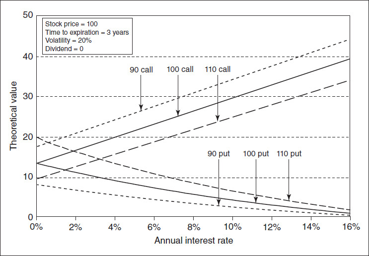

<!-- source:block c852d9784dfc5434 -->

*图23-2 Rho值随着到期时间的变化。 / Figure 23-2 Rho values as time to expiration changes.*

<!-- source:block 8ab51041e11111eb -->

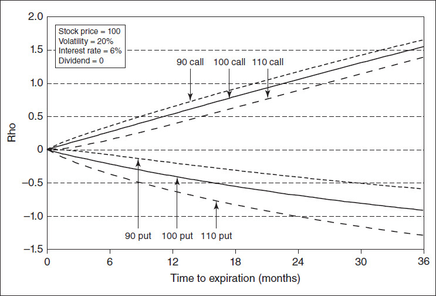

<!-- source:block fe79f4bb883d89c1 -->

## 期权存续期内波动率不变 / Volatility Is Constant over the Life of the Option

<!-- source:block 72a3f9203f686eef -->

> [!quote]- English 31
> When a trader feeds a volatility into a theoretical pricing model, he is specifying the magnitude and frequency of price changes that will occur over the life of the option. Because these price changes are assumed to be normally distributed, the model recognizes that there will be some number of one, two, three, and so on standard deviation occurrences and that these occurrences will be evenly distributed over the life of the option. Two standard deviation price changes will be evenly distributed among the one standard deviation price changes; three standard deviation price changes will be evenly distributed among the one and two standard deviation price changes; and so on.

当交易员将波动率输入理论定价模型时，他就是在指定期权有效期内发生的价格变化的幅度和频率。由于这些价格变化被假设为正态分布，因此该模型认识到会出现一定数量的一、二、三等标准差，并且这些发生将在期权的有效期内均匀分布。两个标准差价格变化将均匀分布在一个标准差价格变化中;三个标准差价格变化将均匀分布在一个和两个标准差价格变化中;等等。

<!-- source:block 8f7fa13fd207df5f -->

> [!quote]- English 32
> In the real world, however, price changes are unlikely to be evenly distributed. Over the life of an option, a trader will encounter periods of high volatility, where large price changes will dominate, together with periods of low volatility, where small price changes dominate. The combination of these high- and low-volatility periods will result in one volatility. But a theoretical pricing model is indifferent as to how the volatility unfolds. The model sees one volatility and evaluates options accordingly.

然而，在现实世界中，价格变化不太可能均匀分布。在期权的有效期内，交易者将遇到高波动率时期，其中大的价格变化将占主导地位，以及低波动率时期，其中小的价格变化将占主导地位。这些高波动率和低波动率时期的结合将导致一次波动率。但理论定价模型对于波动率如何展开并不关心。该模型看到一种波动率并相应评估期权。

<!-- source:block a86cd12fdd095c59 -->

> [!quote]- English 33
> Figures 23-3 and 23-4 are daily high/low/close bar charts for a hypothetical underlying contract over a period of 80 trading days. Both bar charts represent exactly the same close-to-close realized volatility over the period in question, 28 percent. But the order in which the volatility unfolds is different. In Figure 23-3, volatility is clearly declining, with larger price changes occurring early in the 80-day period and smaller price changes occurring later in the period. In Figure 23-4, the opposite is true. Volatility is rising, with smaller price changes occurring early and larger changes occurring later. The reader may have already guessed that the charts are in fact mirror images of each other and therefore must represent the same volatility. Even though the volatility unfolded in two completely different scenarios, in both cases, a pricing model will use the same volatility, 28 percent, to make all calculations.

图23-3和23-4是假设标的合约在80个交易日内的每日高/低/收盘条形图。两个条形图都代表了所讨论时期内完全相同的接近收盘已实现波动率，即28%。但波动率的展开顺序是不同的。在图23-3中，波动率明显下降，较大的价格变化发生在80天周期的早期，较小的价格变化发生在该周期的后期。在图23-4中，情况恰恰相反。波动率正在上升，较小的价格变化发生在早期，较大的变化发生在后期。读者可能已经猜到，这些图表实际上是彼此的镜像，因此必须代表相同的波动率。尽管波动率在两种完全不同的情况下展开，但在这两种情况下，定价模型将使用相同的波动率（28%）来进行所有计算。

<!-- source:block e98b331e908f7cbf -->

*图23-3波动率下降。 / Figure 23-3 Falling volatility.*

<!-- source:block 630817025faddd79 -->

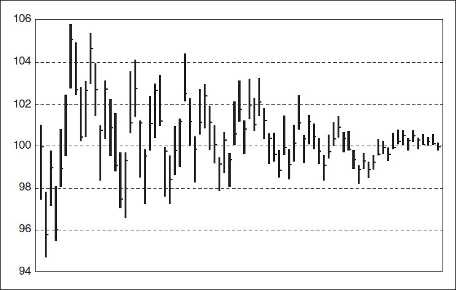

<!-- source:block 3b9d098368cc23f3 -->

*图23-4波动率上升 / Figure 23-4 Rising volatility.*

<!-- source:block e700bc41dce4e0bc -->

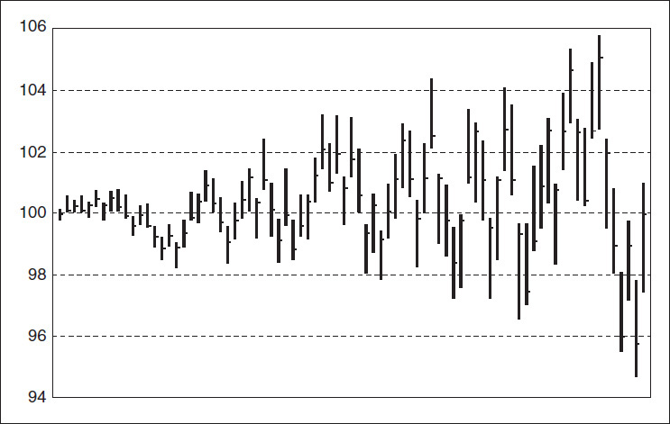

<!-- source:block 609867e01265fd20 -->

> [!quote]- English 36
> In both Figures 23-3 and 23-4, the beginning and ending price is 100. Suppose that a trader buys a 100 straddle and assumes, correctly, a volatility of 28 percent. What should this straddle be worth? To simplify the example, let’s assume that there are 80 calendar days to expiration and that every day is a trading day (hence no weekends and holidays). To focus only on volatility, let’s also assume that the interest rate is 0. Under these assumptions, the Black-Scholes model will generate a value for both the 100 call and put of 5.23, for a total straddle value of 10.46.

在图23-3和23-4中，开始和结束价格都是100。假设一名交易员购买了100的跨式，并正确地假设波动率为28%。这个跨式应该值多少钱？为了简化示例，假设有80个日历日到期，并且每天都是交易日（因此没有周末和假期）。为了只关注波动率，我们还假设利率为0。在这些假设下，Black-Scholes模型将产生100看涨和看跌的值为5.23，总跨式价值为10.46。

<!-- source:block 5560720f5125dea0 -->

> [!quote]- English 37
> Alternatively, suppose that we calculate the value of the 100 call and put by running a simulation of the dynamic hedging process. Using the closing price each day, the number of days remaining to expiration, and a known volatility of 28 percent, we can calculate the delta at the end of each trading day. We can then buy or sell the required number of underlying contracts to remain delta neutral. (This is the same approach used to explain the dynamic hedging process in Chapter 8.) The results of such a simulation show that if the volatility is falling (Figure 23-3), the 100 call and put are worth 2.97 each, for a total straddle value of 5.94. But, if volatility is rising (Figure 23-4), the 100 call and put are worth 6.41 each, for a total straddle value of 12.82. Why do these values differ so dramatically from the Black-Scholes value of 10.46?

或者，假设我们通过运行动态对冲过程的模拟来计算100看涨期权和看跌期权的价值。使用每天的收盘价，距离到期的天数，以及已知的28%的波动率，我们可以计算每个交易日结束时的Delta。然后，我们可以买入或卖出所需数量的标的合约，以保持Delta中性。(This这与第8章中解释动态套期保值过程的方法相同。）这样的模拟结果表明，如果波动率下降（图23-3），则100看涨和看跌各价值2.97，总跨式价值为5.94。但是，如果波动率上升（图23-4），则100看涨和看跌的价值各为6.41，总跨式价值为12.82。为什么这些值与布莱克-斯科尔斯值10.46存在如此巨大的差异？

<!-- source:block cca643344ac4d33b -->

> [!quote]- English 38
> A strategy that will be helped by higher realized volatility, such as a long straddle, will benefit most if periods of high in volatility occur when the gamma is greatest. The high gamma will magnify the changes in the delta as the underlying price changes, resulting in greater profit from the dynamic hedging process. Because the 100 straddle is essentially at the money and the gamma of an at-the-money option increases as expiration approaches, any increase in volatility close to expiration will have a disproportionately greater impact on the option’s value than a similar increase in volatility early in the option’s life. Consequently, the rising-volatility scenario increases the value of the 100 straddle well above the Black-Scholes value. Of course, the higher gamma close to expiration goes hand in hand with a higher theta. With no underlying movement close to expiration, the option will decay at an accelerated rate. Therefore, the falling-volatility scenario has an inordinately negative impact on the value of the 100 straddle, causing the value to fall below the Black-Scholes value.

一个策略，将有助于较高的已已实现波动率，如长期跨，将受益最多，如果期间的高波动率性发生时，Gamma是最大的。随着标的价格的变化，高Gamma将放大Delta的变化，从而带来更大的利润 动态对冲过程。由于100 Straddle本质上是ATM，并且ATM期权的Gamma随着到期临近而增加，因此临近到期时波动率的任何增加都将对期权价值产生不成比例的更大的影响 在期权生命的早期波动率。因此，波动率上升的情况会使100 Straddle的价值远高于Black-Scholes值。当然，接近到期时的较高Gamma与较高的Theta是齐头并进的。由于接近到期时没有标的运动， 期权将以加速的速度衰退。因此，波动率下降的情况对100 Straddle的价值产生过度负面影响，导致该价值跌破Black-Scholes值。

<!-- source:block af91bb3cbd65df2f -->

> [!quote]- English 39
> For out-of-the-money options, the effect is just the opposite. The gamma of an out-of-the-money option is largest early in its life, so a period of high volatility early in the option’s life will increase its value. An out-of-the-money option will be worth more than the predicted Black-Scholes value in a falling-volatility scenario and worth less in a rising-volatility scenario. This is confirmed by the results of a dynamic hedging simulation for the 80 put and 120 call. At a volatility of 28 percent, the Black-Scholes values are 0.21 for the 80 put and 0.54 for the 120 call. If, however, volatility is falling, the values are 0.44 and 0.89. If volatility is rising, the values are 0.05 and 0.14.

对于价外期权来说，效果恰恰相反。价外期权的Gamma在其生命初期是最大的，因此期权生命初期的一段高波动率将增加其价值。在波动率下降的情况下，价外期权的价值将高于预测的布莱克-斯科尔斯价值，而在波动率上升的情况下，价外期权的价值将低于预测的布莱克-斯科尔斯价值。80看跌期权和120看涨期权的动态对冲模拟结果证实了这一点。波动率为28%时，80看跌期权的Black-Scholes值为0.21,120看涨期权的Black-Scholes值为0.54。然而，如果波动率下降，则值为0.44和0.89。如果波动率上升，则值为0.05和0.14。

<!-- source:block 93b437ce6a122cf8 -->

> [!quote]- English 40
> Option values under our three different volatility scenarios for exercise prices from 70 to 130 are shown in Figure 23-5. With the price of the underlying remaining generally between 95 and 105, options with exercise prices of 95, 100, and 105 are worth more than the Black-Scholes value in a rising-volatility market and less than the Black-Scholes value in a falling-volatility market. The opposite is true for exercise prices below 90 or above 110. They are worth more in a falling-volatility market and less in a rising-volatility market.

在70至130的三种不同波动率情景下，期权价值如图23-5所示。由于标的价格通常保持在95至105之间，因此行权价为95、100和105的期权在波动率上升的市场中的价值高于布莱克-斯科尔斯价值，而在波动率下降的市场中低于布莱克-斯科尔斯价值。对于低于90或高于110的行权价，情况则相反。它们在波动率下降的市场中价值更高，在波动率上升的市场中价值更低。

<!-- source:block c7ec42af89a0ac61 -->

*图23-5三种不同波动率情景下的期权价值 / Figure 23-5 option values under three different volatility scenarios.*

<!-- source:block 5dbcff1ed6f7d290 -->

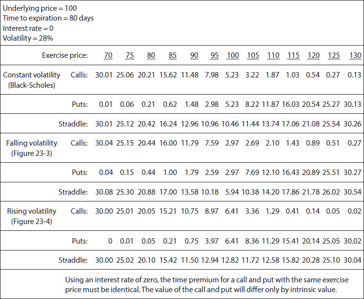

<!-- source:block ed1d042f54ccbe78 -->

> [!quote]- English 42
> If an option is held to expiration with no accompanying dynamic delta hedging, the value of the option depends solely on the underlying price at expiration. The option’s value is independent of the path by which the underlying contract reaches its terminal value. But the preceding examples make it clear that in a world where a trader dynamically hedges an option position, the value of the option is in fact *path dependent*. Even if we assume a single volatility, the route that the underlying takes can have a significant impact on the value of the option.

如果期权持有至到期且没有附带的动态Delta对冲，则期权的价值仅取决于到期时的标的价格。期权的价值与标的合约达到其最终价值的路径无关。但前面的例子清楚地表明，在交易者动态对冲期权头寸的世界中，期权的价值实际上取决于路径。即使我们假设单一波动率，标的选择的路径也会对期权的价值产生重大影响。

<!-- source:block d384c17436e1e1da -->

> [!quote]- English 43
> Because the value of an option seems to be path dependent, one might conclude that the Black-Scholes model is unreliable. Indeed, for any one random-walk scenario, the value resulting from the dynamic hedging process will almost certainly differ from a Black-Scholes value. But the Black-Scholes model is a probabilistic model. A given volatility will, *on average*, result in a given value for the option. In our example, we considered only two alternative volatility scenarios, where volatility is either rising or falling. But there are an almost infinite number of paths that the underlying price might follow over the life of an option. If we were to generate a large number of random price paths, all with normally distributed price changes and with the same volatility of 28 percent and if we were to then simulate the dynamic hedging process, we would find that, on average, each exercise price is worth something very close to the value predicted by the Black-Scholes model.

由于期权的价值似乎取决于路径，因此人们可能会得出布莱克-斯科尔斯模型不可靠的结论。事实上，对于任何一种随机游走场景，动态对冲过程产生的价值几乎肯定会与布莱克-斯科尔斯价值不同。但布莱克-斯科尔斯模型是一个概率模型。平均而言，给定的波动率将导致期权的给定价值。在我们的例子中，我们只考虑了两种替代波动率场景，其中波动率要么上升要么下降。但标的价格在期权的生命周期中可能遵循的路径几乎是无限的。如果我们生成大量随机价格路径，所有价格变化都具有正态分布，波动率相同为28%，如果我们然后模拟动态对冲过程，我们会发现，平均而言，每个行权价的价值非常接近布莱克-斯科尔斯模型预测的价值。

<!-- source:block 35101ef6d70451e1 -->

> [!quote]- English 44
> Although the Black-Scholes model assumes that prices follow a random walk through time with constant volatility, we might instead assume that volatility is itself random. Several models that assume *stochastic volatility* have been proposed and might, in some cases, be more suitable than a traditional pricing model. At the same time, such models add an additional dimension of complexity to a trader’s life and for this reason are not widely used.

尽管布莱克-斯科尔斯模型假设价格遵循波动率恒定的随机时间，但我们可能会假设波动率本身是随机的。已经提出了几种假设随机波动率的模型，在某些情况下，这些模型可能比传统的定价模型更适合。与此同时，此类模型给交易者的生活增加了额外的复杂性，因此没有被广泛使用。

<!-- source:block 0d9115ee9c5c0440 -->

> [!quote]- English 45
> Some contracts, by their very nature, are known to change their volatility characteristics over time. Interest-rate products in particular fall into this category. As a bond approaches maturity, the price of the bond moves inexorably toward par. At maturity, regardless of interest rates, the bond will have a fixed and known value. Clearly, one cannot assume that the price of the bond follows a random walk through time. Even if one assumes that interest rates move randomly and that the volatility of interest rates is constant, interest-rate instruments will change their volatility over time because instruments of different maturities have different sensitivities to changes in interest rates. If we take into consideration the fact that interest rates also vary for different maturities, a traditional Black-Scholes type model is obviously not well suited to the evaluation of such products. This has led to the development of special models to evaluate interest-rate instruments.

众所周知，一些合约就其本质而言，会随着时间的推移而改变其波动率特征。高利率产品尤其属于这一类。随着债券临近到期，债券价格无情地向面值移动。到期时，无论利率如何，债券都将具有固定且已知的价值。显然，人们不能假设债券的价格遵循时间的随机漫步。即使假设利率随机变动并且利率波动率是恒定的，利率工具也会随着时间的推移而改变其波动率，因为不同期限的工具对利率变化的敏感性不同。如果考虑到不同期限的利率也会有所不同，那么传统的布莱克-斯科尔斯型模型显然不太适合此类产品的评估。这导致了评估利率工具的特殊模型的开发。

<!-- source:block f6f45c3a67241aea -->

## 交易是连续的 / Trading Is Continuous

<!-- source:block c8d7abe5d8493915 -->

> [!quote]- English 46
> To model option values, a model must make some assumptions about how the price of an underlying contract changes over time. One possible assumption is that prices follow a *continuous diffusion process*. Under this assumption, price changes are continuous, with no gaps permitted between consecutive prices. An example of a typical continuous diffusion process might be the temperature readings in a specific location. Although the temperature can change very quickly, there will never be any gaps. If the temperature is initially 25 degrees but later drops to 22 degrees, then at some intermediate time, even if only very briefly, the temperature must have also been 24 degrees and then 23 degrees.

为了对期权价值进行建模，模型必须对标的合约的价格如何随时间变化做出一些假设。一个可能的假设是，价格遵循连续的扩散过程。在此假设下，价格变化是连续的，连续价格之间不允许有差距。典型连续扩散过程的一个例子可能是特定位置的温度读数。虽然温度变化很快，但永远不会有任何间隙。如果温度最初是25度，但后来下降到22度，那么在某个中间时间，即使只是非常短暂的，温度也一定是24度，然后是23度。

<!-- source:block e29b2857944f5518 -->

> [!quote]- English 47
> The Black-Scholes model assumes that the underlying contract follows a continuous diffusion process. Trading proceeds 24 hours per day, 7 days per week, without interruption, and with no gaps in the price of the underlying contract. If a contract trades at 46.05 and at some later time trades at 46.08, then at some intermediate time it must also have traded, even if only briefly, at 46.06 and 46.07. If one were to graph with pen and paper the prices of an underlying contract that follow a continuous diffusion process, one would never lift the pen from the paper. An example of this is shown in Figure 23-6*a*.

布莱克-斯科尔斯模型假设标的合约遵循连续的扩散过程。交易每周7天、每天24小时进行，不间断，且标的合约价格没有缺口。如果一份合约的交易价格为46.05，并在稍后的某个时间交易价格为46.08，那么在某个中间时间，它也必须在46.06和46.07交易，即使只是短暂的。如果有人用笔和纸绘制遵循连续扩散过程的标的合约的价格，他永远不会把笔从纸上拿出来。图23-6a显示了其中的一个例子。

<!-- source:block 15c634070d24ce72 -->

*图23-6（a）扩散过程。(b)跳转过程。(c)跳跃扩散过程。 / Figure 23-6 (a) diffusion process. (b) Jump process. (c) Jump-diffusion process.*

<!-- source:block eacbe8195efdd74b -->

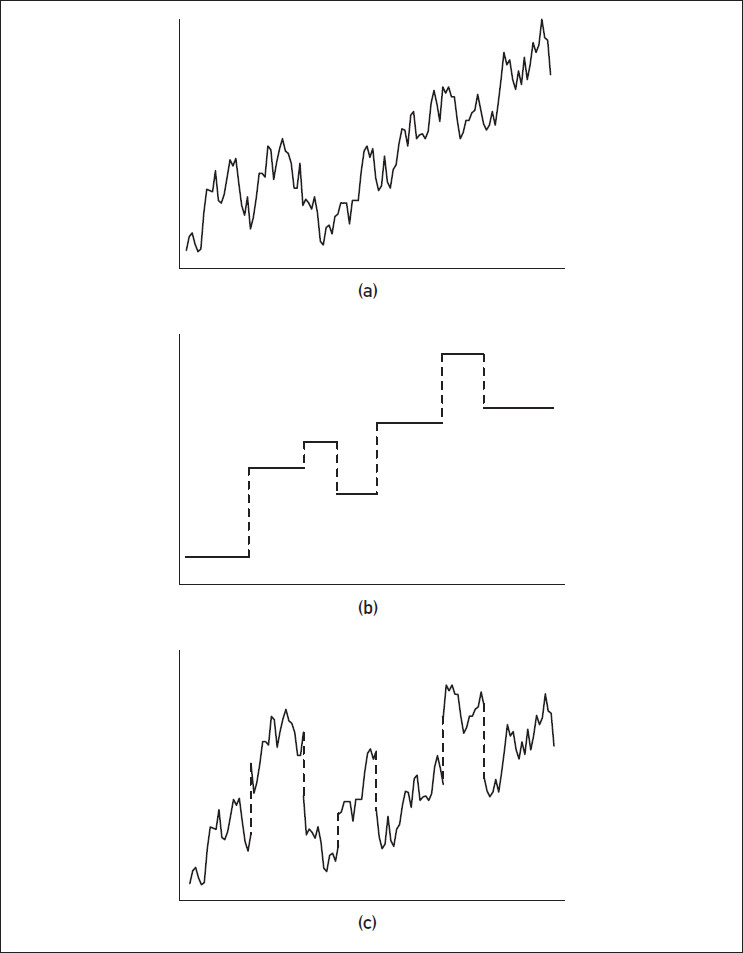

<!-- source:block 2834f766763d6726 -->

> [!quote]- English 49
> If we assume that the underlying contract follows a continuous diffusion process, we can also assume that the dynamic hedging process can be carried out continuously. This is fundamental to capturing an option’s theoretical value. The Black-Scholes model assumes that a position can be rehedged to remain delta neutral at every possible moment in time.

如果我们假设标的合约遵循连续的扩散过程，我们还可以假设动态对冲过程可以连续进行。这是捕捉期权理论价值的标的。布莱克-斯科尔斯模型假设可以重新对冲头寸以在每个可能的时刻保持Delta中性。

<!-- source:block bda714821cacceed -->

> [!quote]- English 50
> A continuous diffusion process may be a reasonable approximation of how prices change in the real world, but it is clearly not perfect. An exchange-traded contract cannot follow a pure diffusion process if the exchange is not open 24 hours per day. At the end of the trading day, a contract may close at one price and then open the next day at a different price. This causes a price gap, something that a diffusion process does not permit. Even during normal trading hours, news might be released, the impact of which can be almost instantaneous, causing the price of a contract to gap either up or down.

持续的扩散过程可能是现实世界中价格变化的合理近似，但它显然并不完美。如果交易所不是每天24小时开放，交易所交易的合约就不能遵循纯粹的扩散过程。在交易日结束时，合约可能会以一个价格收盘，然后在第二天以不同的价格开盘。这会导致价格差距，而这是扩散过程所不允许的。即使在正常交易时间，消息也可能会发布，其影响几乎是瞬间的，导致合约价格上下波动。

<!-- source:block a9a83ee96a7faca4 -->

> [!quote]- English 51
> Instead of a diffusion process, prices might follow a *jump process*. In a jump process, the price of a contract remains fixed for a period of time and then instantaneously jumps to a new price, where it again remains fixed until a new jump occurs. The way in which central banks set interest rates is typical of a jump process. In the United States, when the Federal Reserve sets the discount rate, it remains fixed until the Fed announces a change. The discount rate then jumps to a new level. A typical jump process, shown in Figure 23-6*b*, is a combination of fixed prices and instantaneous jumps.

价格可能会遵循跳跃过程，而不是扩散过程。在跳跃过程中，合约的价格在一段时间内保持固定，然后瞬间跳到新的价格，并再次保持固定，直到发生新的跳跃。央行设定利率的方式是典型的跳跃过程。在美国，当美联储设定贴现率时，贴现率将保持固定不变，直到美联储宣布改变。随后折扣率跃升至新水平。典型的跳跃过程（如图23- 6 b所示）是固定价格和瞬时跳跃的组合。

<!-- source:block 363583965bdb6761 -->

> [!quote]- English 52
> In the real world, prices of most underlying contracts follow neither a pure diffusion process nor a pure jump process. The real world seems to be a combination of the two—a *jump-diffusion process*. Most of the time, trading proceeds normally with no price gaps. Occasionally, though, an unexpected change in market conditions occurs that causes the underlying contract to instantaneously gap to a new price. Such a process is shown in Figure 23-6*c*.

在现实世界中，大多数标的合约的价格既不遵循纯扩散过程，也不遵循纯跳跃过程。现实世界似乎是这两者的结合一个跳跃-扩散过程。大多数情况下，交易正常进行，没有价格差距。不过，偶尔会发生市场条件的意外变化，导致标的合约立即出现新的价格缺口。这样的过程如图23-6c所示。

<!-- source:block fa502d57b937e5ba -->

> [!quote]- English 53
> If a theoretical pricing model assumes that prices follow a diffusion process when in fact they don’t, how is this likely to affect values generated by the model? To understand the effect of a gap, consider a trader who sells an at-the-money straddle with the underlying contract trading at 100. How will the trader feel if the underlying contract suddenly gaps up to 105? Clearly, this is not what the trader was hoping for. Such a large move might well be accompanied by an increase in implied volatility, which will also hurt the trader’s position. But even if implied volatility does not change, because of the negative gamma associated with the short straddle, the large move in the underlying contract will clearly work against the trader. How bad will the damage be? If the options are relatively long term, say, one year, the gap in the underlying price is unlikely to be the end of the world. After all, with one year remaining to expiration, the underlying market could certainly fall back to 100. While the gap has hurt the trader, it is probably not disastrous. But, if the gap occurs with only a very short time remaining to expiration, say, one day, the trader is now in a much worse situation. With only one day to expiration, there is not enough time for the market to retrace its movement. The 100 calls that the trader sold as part of the short straddle will immediately go deeply into the money, acting like short underlying contracts. The straddle may have begun approximately delta neutral, but after the gap, the trader will find himself naked short deeply in-the-money calls, each with a delta of 100. The value of the one-day straddle will increase dramatically compared with the value of the one-year straddle.

如果理论定价模型假设价格遵循扩散过程，而实际上并不遵循扩散过程，那么这将如何影响模型产生的价值？要了解缺口的影响，请考虑出售标的合约交易为100的ATM 跨式式式交易员。 如果标的合约突然价差达到105，交易员会有何感想？显然，这不是交易员所希望的。如此大的波动很可能伴随着隐含波动率的增加，这也将损害交易者的头寸。 但即使隐含波动率没有改变，由于空头跨式相关的负Gamma，标的合约的大幅波动显然也会对交易者不利。损害会有多严重？ 如果期权的期限相对较长，比如一年，那么标的价格的差距不太可能是世界末日。毕竟，距离到期还有一年，标的市场肯定会回落至100。虽然这一差距伤害了交易员，但这可能不是灾难性的。 但是，如果距离到期只剩下很短的时间（比如有一天）出现缺口，那么交易员现在的情况要糟糕得多。距离到期仅剩一天，市场没有足够的时间追溯其走势。 交易者作为空头跨式交易的一部分卖出的100个看涨期权将立即深入到资金中，就像空头标的合约一样。 跨式可能开始时大约Delta中性，但在缺口之后，交易员会发现自己赤裸裸地做空深度ITM看涨期权，每个看涨期权的Delta都为100。与一年期跨式的价值相比，一日期跨式的价值将大幅增加。

<!-- source:block 071cac1b58bf633d -->

> [!quote]- English 54
> The reason the effect of the gap is much greater if the straddle is short term rather than long term is a result of how the gamma changes over time. We know that as expiration approaches, the gamma of an at-the-money option increases, causing the delta to change much more rapidly when the underlying price moves. The dynamic hedging process can reduce some of the damage if the trader is able to buy underlying contracts as the underlying price rises. But a gap is an instantaneous move; there is no opportunity to adjust. The very high gamma, combined with an inability to make any adjustment, makes the consequences of the gap much more dramatic close to expiration.

如果跨式是短期而不是长期，那么差距的影响就会大得多，原因是Gamma随时间变化的结果。我们知道，随着到期的临近，平值期权的Gamma会增加，从而导致当标的价格变动时，Delta变化得更快。如果交易员能够在标的价格上涨时购买标的合约，动态对冲过程可以减少一些损害。但差距是瞬间的举动;没有机会调整。非常高的Gamma，加上无法进行任何调整，使得缺口的后果在临近到期时更加严重。

<!-- source:block 26dddbc784e1fd96 -->

> [!quote]- English 55
> Not only does the gamma of an at-the-money option increase as expiration approaches, but it also increases as we reduce volatility. Consequently, the impact of a gap will be much greater in a low-volatility market than in a high-volatility market. If we consider these two traits together, we can conclude that at-the-money options close to expiration in a low-volatility market are among the riskiest of options.

平值期权的Gamma不仅会随着到期的临近而增加，而且会随着我们降低波动率而增加。因此，缺口在低波动率市场中的影响将比在高波动率市场中大得多。如果我们一起考虑这两个特征，我们可以得出结论，低波动率市场中接近到期的价金期权是风险最高的期权之一。

<!-- source:block 4cfda6729136101e -->

> [!quote]- English 56
> Figure 23-7 shows the change in value for a 100 straddle if the market should gap as expiration approaches. The chart shows the change under two volatility scenarios, 15 and 25 percent. Note the greater change in the straddle value close to expiration, as well as the greater change in a low-volatility market.

图23-7显示了如果市场在到期临近时出现缺口，则100跨式的价值变化。该图表显示了两种波动率情景（15和25 %）下的变化。 请注意，临近到期时，跨式价值的变化更大，以及低波动率市场的变化更大。

<!-- source:block 782257c6ca1d8081 -->

*图23-7差距对100跨式值的影响。 / Figure 23-7 effect of a gap on the value of a 100 straddle.*

<!-- source:block 6b9d5d210445920b -->

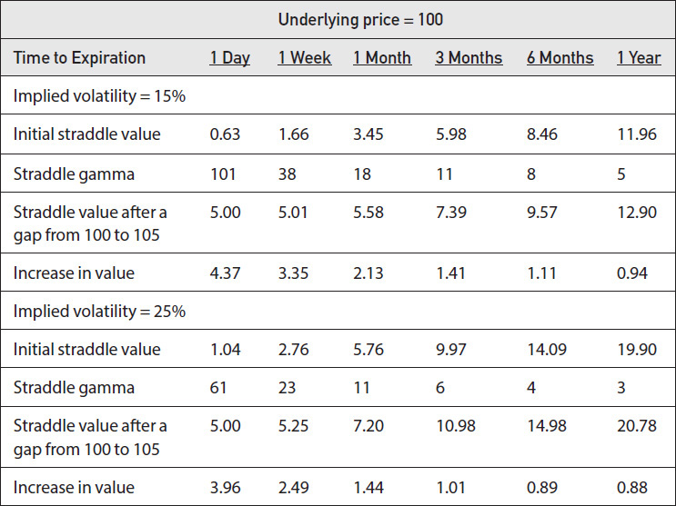

<!-- source:block 4a94652f2fa079fd -->

> [!quote]- English 58
> Options have the unique characteristic of automatically and continuously rehedging themselves by changing their deltas as the price of the underlying contract changes. It is this characteristic for which buyers of options are paying. A trader who uses a theoretical pricing model attempts to take advantage of a mispriced option by hedging the option position, delta neutral, with the underlying contract and then manually performing the rehedging process himself over the life of the option. If a model assumes that prices follow a diffusion process, the model also assumes that one can continuously maintain a delta-neutral hedge. But when the market gaps, the assumptions on which the model is based are violated. Consequently, the values generated by the model are rendered invalid. This problem extends to any application that attempts to replicate option characteristics through a continuous rehedging in the underlying market. The proponents of portfolio insurance (see Chapter 17) suffered their greatest setbacks on October 19 and 20, 1987, when the market made several large-gap moves. Because of the gaps, the portfolio insurers were unable to make continuous delta adjustments to their positions. As a consequence, they found that the cost of protection offered by portfolio insurance was much greater than they had expected.

期权的独特特征是，随着标的合约价格的变化，通过改变其Delta来自动且持续地重新对冲。期权买家正是为这一特征付费。使用理论定价模型的交易员试图利用定价错误的期权，方法是用标的合约对冲期权头寸（Delta中性），然后在期权有效期内亲自手动执行再对冲过程。如果模型假设价格遵循扩散过程，则该模型还假设可以持续维持Delta中性对冲。但当市场出现缺口时，模型所基于的假设就会被违反。因此，模型生成的值将无效。这个问题延伸到任何试图通过标的市场的持续再对冲复制期权特征的应用程序。投资组合保险的支持者（见第17章）在1987年10月19日和20日遭受了最大的挫折，当时市场出现了几次大价差波动。由于存在缺口，投资组合保险公司无法对其头寸进行持续的Delta调整。因此，他们发现投资组合保险提供的保护成本远高于他们的预期。

<!-- source:block 928ae2f4298b9922 -->

> [!quote]- English 59
> To more accurately evaluate options, a variation on the Black-Scholes model has been proposed that includes the possibility of gaps in the price of the underlying contract. This *jump-diffusion model*, in theory, generates values that are more accurate than traditional Black-Scholes values,4 but the model is considerably more complex mathematically and also requires two new inputs—the average size of a jump in the underlying market and the frequency with which jumps are likely to occur. Unless the user can accurately estimate these new inputs, the values generated by a jump-diffusion model may be no better—and might be worse—than those generated by a traditional model. Many traders take the view that whatever weaknesses are encountered in a traditional model can be best offset through intelligent decision making based on actual trading experience rather than through the use of a more complex jump-diffusion model.

为了更准确地评估期权，提出了布莱克-斯科尔斯模型的变体，其中包括标的合约价格存在缺口的可能性。理论上，这种跳跃扩散模型生成的值比传统的布莱克-斯科尔斯值更准确，[^ovp23-4]但该模型在数学上要复杂得多，并且还需要两个新的输入——标的市场跳跃的平均规模和跳跃可能发生的频率。除非用户能够准确地估计这些新输入，否则跳跃扩散模型生成的值可能不会比传统模型生成的值更好，甚至可能更差。许多交易者认为，传统模型中遇到的任何弱点都可以通过基于实际交易经验的智能决策而不是使用更复杂的跳跃扩散模型来最好地抵消。

<!-- source:block 4e7b33170db9e00a -->

> [!quote]- English 60
> Assuming that a trader has a delta-neutral position that he intends to dynamically hedge, any gap will have a negative impact on a trader who has a negative gamma position because the trader will not have an opportunity to adjust as the market moves. The same gap will have a positive impact on a trader with a positive gamma position because he will also not have an opportunity to adjust as the market moves. In the latter case, this works to the trader’s advantage.

假设交易员拥有一个他打算动态对冲的Delta中性头寸，任何缺口都会对持有负Gamma头寸的交易员产生负面影响，因为交易员将没有机会随着市场走势进行调整。同样的缺口将对持有正Gamma头寸的交易者产生积极影响，因为他也没有机会随着市场走势进行调整。在后一种情况下，这对交易者有利。

<!-- source:block edc001a3403d9b79 -->

> [!quote]- English 61
> Because a gap in the market will have its greatest effect on high-gamma options, and because at-the-money options close to expiration have the highest gamma, it is these options that are most likely to be mispriced by a traditional theoretical pricing model. Consequently, as expiration approaches, experienced traders will tend to rely less and less on model-generated values and more on their own experience and intuition. This is not to suggest that under these circumstances a model is of no value, but one needs to make adjustments when the model is known to be incorrect.

由于市场缺口对高Gamma期权的影响最大，而且临近到期的ATM期权的Gamma最高，因此这些期权最有可能被传统理论定价模型错误定价。 因此，随着到期的临近，经验丰富的交易员往往会越来越少地依赖模型生成的价值，而更多地依赖自己的经验和直觉。 这并不是说在这种情况下，模型没有价值，而是当已知模型不正确时，需要进行调整。

<!-- source:block 493c80825e7e3573 -->

> [!quote]- English 62
> As a result of the gaps that occur in the real world, both a trader’s experience and empirical evidence seem to indicate that a traditional model, with its built-in diffusion assumption, tends to undervalue options in the real world. If one compares the average historical volatility of an underlying market with the average implied volatility over long periods of time, the average implied volatility is almost always greater. This seems to indicate that buyers of options are overpaying. Part of this may be due to hedgers willing to pay an additional premium for protective options. But the implied volatility is derived from a theoretical pricing model that does not include the possibility of gaps in the underlying price. The possibility of these gaps tends to indicate that perhaps the values of options are in fact greater in the real world than is predicted by a traditional theoretical pricing model.

由于现实世界中出现的差距，交易者的经验和经验证据似乎都表明，具有内置扩散假设的传统模型往往会低估现实世界中的期权。如果将标的市场的平均历史波动率与长期平均隐含波动率进行比较，则平均隐含波动率几乎总是更大。这似乎表明期权买家支付了过高的价格。部分原因可能是对冲者愿意为保护性选择支付额外的溢价。但隐含波动率源自理论定价模型，该模型不包括标的价格存在缺口的可能性。这些差距的可能性往往表明，也许期权的价值在现实世界中实际上比传统理论定价模型预测的要大。

<!-- source:block e05bef3c2c306bd6 -->

> [!quote]- English 63
> We have seen that a gap will have the greatest impact on an option position close to expiration, particularly for at-the-money options because these options have the greatest gamma. From a risk standpoint, this means that it can be very dangerous to sell a large number of at-the-money options close to expiration because any gap in the underlying market can have devastating results. New traders in particular are advised to avoid such positions. No risk manager will appreciate even experienced traders being short large numbers of at-the-money options as expiration approaches.

我们已经看到，缺口将对接近到期的期权头寸产生最大的影响，特别是对于平值的期权，因为这些期权的Gamma最大。从风险的角度来看，这意味着在临近到期时出售大量平值期权可能是非常危险的，因为标的市场的任何缺口都可能产生毁灭性的结果。特别建议新交易者避免此类头寸。随着到期临近，即使是经验丰富的交易员也不会欣赏到大量平值期权的情况。

<!-- source:block 0e9979c193f31188 -->

## 到期跨式策略 / Expiration Straddles

<!-- source:block 2564b9d9a12b0a7f -->

> [!quote]- English 64
> If it is dangerous to sell at-the-money options close to expiration, perhaps there is some sense in taking the opposite position by purchasing at-the-money options as expiration approaches. This may seem to contradict conventional option wisdom, which focuses on the rapid time decay associated with such options. But there is always a tradeoff between risk and reward. If one sells at-the-money options, the reward may be an accelerated profit if the market doesn’t move (high positive theta), but the risk is an increased loss if the market does move (high negative gamma). Because the model does not know about the possibility of a gap in the underlying market, the risk is often greater than the reward. If one sells at-the-money options, the losses from an unexpected gap can more than offset the profits resulting from increased time decay. An experienced trader may therefore take the opposite position by purchasing at-the-money options close to expiration.

如果在临近到期时出售价货期权是危险的，那么在临近到期时购买价货期权采取相反的头寸也许是有意义的。这似乎与传统期权智慧相矛盾，传统期权智慧关注的是与此类期权相关的快速时间衰减。但风险和回报之间总是存在权衡。如果一个人平值期权，如果市场不变动（高正Theta），回报可能是加速利润，但如果市场确实变动（高负Gamma），风险是损失增加。由于模型不知道标的市场出现缺口的可能性，因此风险往往大于回报。如果出售平值的期权，意外缺口造成的损失足以抵消时间衰变增加带来的利润。因此，经验丰富的交易者可能会通过购买接近到期的价货期权来采取相反的头寸。

<!-- source:block 57e9780fd3a5531a -->

> [!quote]- English 65
> This is not to suggest that every time expiration approaches, a trader should buy at-the-money options. As with any strategy, conditions must make the strategy look attractive. But because many traders are intent on selling time premium as expiration approaches, it is often possible to find cheap at-the-money options. Suppose that with three days remaining to expiration, the Black-Scholes model generates a value for an at-the-money call of 0.75. What can we say about this call? Although we may not know the exact value because we don’t know the true future volatility, there is high likelihood that in the real world the call is worth more than 0.75 because the model doesn’t know about the possibility of a gap in the market. If, on top of this, the call is trading at a price below its model-generated value, say, 0.65, it is likely to be a good buy.

这并不是说每次到期临近时，交易者都应该购买价货期权。与任何战略一样，条件必须使战略看起来有吸引力。但由于许多交易者一心想在到期临近时出售时间溢价，因此通常有可能找到便宜的平值的期权。假设距离到期还剩三天，Black-Scholes模型生成的物价看涨价值为0.75。我们对这次看涨期权能说些什么？尽管我们可能不知道确切的价值，因为我们不知道真实的未来波动率，但在现实世界中，看涨期权的价值很有可能超过0.75，因为模型不知道市场出现缺口的可能性。除此之外，如果看涨期权的交易价格低于其模型生成的价值（例如0.65），那么这可能是一笔不错的买入。

<!-- source:block 8aeae71fe46fcd68 -->

> [!quote]- English 66
> As with any strategy based on volatility, the trader who buys these calls will try to establish a delta-neutral position. Because of the synthetic relationship, if the calls are underpriced, the puts at the same exercise price will also be under-priced. Thus, a logical strategy might be the purchase of at-the-money straddles. This enables a trader to buy both underpriced calls and underpriced puts and to profit if the underlying market gaps either up or down.

与任何基于波动率的策略一样，购买这些看涨期权的交易员将尝试建立Delta中性头寸。由于综合关系，如果看涨期权定价过低，相同行权价的看跌期权也将定价过低。因此，一个合乎逻辑的策略可能是以平值的价格购买跨式。这使得交易员能够购买低价看涨期权和低价看跌期权，并在标的市场出现上涨或下跌时获利。

<!-- source:block 6b7785b8549f5abe -->

> [!quote]- English 67
> In theory, all volatility strategies, including an expiration straddle, ought to be adjusted periodically to remain delta neutral. However, with little time remaining to expiration, the model is not only unreliable with respect to theoretical values, but also unreliable with respect to deltas. Because it is impossible to say what the right delta is, it is also impossible to say what the correct adjustment is. For this reason, traders who buy expiration straddles often abandon any attempt to remain delta neutral and simply sit on the position to expiration. This may not be the theoretically correct way to manage a volatility position, but given all the uncertainties associated with theoretical evaluation as expiration approaches, it may be a practical choice.

理论上，所有波动率策略，包括跨到期策略，都应该定期调整以保持Delta中性。然而，由于距离到期时间很短，该模型不仅在理论值方面不可靠，而且在Delta方面也不可靠。因为不可能说出正确的Delta是多少，所以也不可能说出正确的调整是多少。出于这个原因，购买到期跨式的交易员通常放弃任何保持Delta中性的尝试，而只是在到期前持有头寸。这可能不是管理波动率头寸的理论上正确的方法，但考虑到随着到期临近与理论评估相关的所有不确定性，这可能是一个实际的选择。

<!-- source:block 8c87dec98b2de592 -->

> [!quote]- English 68
> Even if a trader carefully chooses his expiration straddles, the great majority of time no gap will occur in the market. In any single case, the trader is more likely to show a loss than a profit. But the primary concern is not the profit or loss5 from any single trade, but what happens *in the long run*. Returning to the roulette example in Chapter 5, a player who chooses a number at a roulette table can expect to win on average only 1 time in 38. But, if the theoretical value of the bet is 95 cents and the player can buy the bet for less than 95 cents, he expects to be a winner in the long run. Even if he is able to pay a very low price for the bet, say, 50 cents, he still expects to lose 37 times out of 38. But now the bet is very attractive. Even if he only wins 1 time in 38, this will still more than offset the small losses he takes each time he loses. The same logic is true of expiration straddles. A trader may lose several times before winning. But when he does win, he can expect a return that is great enough to more than offset all the small losses.

即使交易者仔细选择他的到期跨式，大多数时候市场上也不会出现缺口。在任何单一情况下，交易者更有可能显示亏损而不是盈利。但主要问题不是任何单一交易的损益[^ovp23-5]，而是长期会发生什么。回到第5章中的轮盘赌示例，在轮盘赌桌上选择一个号码的玩家平均只有38次中获胜1次。但是，如果赌注的理论价值为95美分，并且玩家可以以低于95美分的价格购买赌注，那么从长远来看，他预计会成为赢家。即使他能够为赌注支付非常低的价格，例如50美分，他仍然预计38次中会输37次。但现在这个赌注非常有吸引力。即使他在38场比赛中只赢了1场，这仍然足以抵消他每次输球时所遭受的小损失。同样的逻辑也适用于到期跨式。交易者在获胜之前可能会输多次。但当他真的获胜时，他可以期待足够大的回报，足以抵消所有小损失。

<!-- source:block 7f1e6c8fe09fa73b -->

> [!quote]- English 69
> The fact that an at-the-money straddle may be cheap does not mean that a trader should buy these straddles in large numbers. Such strategies are likely to result in a loss more often than a profit, so an intelligent trader should only invest an amount that he can afford to lose. However, when conditions are right, a trader ought to be willing to make the investment. Even if he loses several times in succession, in the long run, he will encounter gaps in the market or large increases in volatility often enough to make such strategies profitable.

ATM 跨式式可能很便宜，这一事实并不意味着交易员应该大量购买这些跨式。此类策略可能会导致损失而不是利润，因此聪明的交易者应该只投资他能承受损失的金额。 然而，当条件合适时，交易者应该愿意进行投资。即使他连续亏损几次，从长远来看，他也会遇到市场缺口或波动率大幅增加的情况，足以使此类策略有利可图。

<!-- source:block d97b372a5447e429 -->

## 波动率独立于标的合约价格 / Volatility Is Independent of the Price of the Underlying Contract

<!-- source:block 2e4509ea15035c5f -->

> [!quote]- English 70
> When a trader feeds a volatility into a theoretical pricing model, the volatility defines a one standard deviation price change at any time during the life of the option regardless of whether the underlying contract happens to be rising or falling in price. If a contract is currently at 100 and we assume a volatility of 20 percent, a one standard deviation price change is always based on this volatility of 20 percent. If, at some later time during the life of the option, the contract should move up to 125 or down to 75, the effective volatility is still assumed to be 20 percent.

当交易员将波动率输入理论定价模型时，波动率定义了期权有效期内任何时间的一个标准差价格变化，无论标的合约价格是上涨还是下跌。如果合约当前为100，并且我们假设波动率为20%，则一个标准差的价格变化始终基于20%的波动率。如果在期权有效期内的稍后时间，合约向上移动至125或向下移动至75，则有效波动率仍被假设为20%。

<!-- source:block 57d98dd7a51769ab -->

> [!quote]- English 71
> In many markets, however, this assumption appears to be inconsistent with most traders’ experience. If one were to ask a stock index trader whether his market becomes more volatile when rising or falling, he would probably say that it becomes more volatile when falling. On the other hand, if one were to ask a commodity trader the same question, he likely would give the opposite answer. His market will tend to become more volatile when rising. In other words, the volatility of a market is not independent of the price of the underlying contract. On the contrary, the volatility over time seems to depend on the direction of movement in the underlying contract. In some cases, a trader expects the market to become more volatile if the movement is downward and less volatile if the movement is upward; in other cases, a trader expects the market to become more volatile if the movement is upward and less volatile if the movement is downward.

然而，在许多市场，这一假设似乎与大多数交易员的经验不一致。如果有人问一位股指交易员，他的市场在上涨或下跌时波动率是否更大，他可能会说下跌时波动率更大。另一方面，如果有人问大宗商品交易员同样的问题，他可能会给出相反的答案。他的市场上涨时往往会变得更加波动。换句话说，市场的波动率并不独立于标的合约的价格。相反，随着时间的推移，波动率似乎取决于标的合约的移动方向。在某些情况下，交易员预计，如果走势向下，市场波动率将变得更大，如果走势向上，市场波动率将减弱;在其他情况下，交易员预计，如果走势向上，市场波动率将减弱，如果走势向下，市场波动率将减弱。

<!-- source:block 2fe1a183bfd55622 -->

> [!quote]- English 72
> Because volatility in some markets seems to depend on the direction of price movement in the underlying contract, a further variation of the Black-Scholes model has been proposed. The *constant-elasticity of variance* (CEV) *model*6 is based on the assumption that volatility changes as the price of the underlying contract changes. Price changes are still assumed to be random in the CEV model, but the volatility, and consequently the magnitude of the price changes, varies with the price of the underlying contract.

由于某些市场的波动率似乎取决于标的合约的价格变动方向，因此有人提出了布莱克-斯科尔斯模型的进一步变体。恒定方差弹性（CEV）模型[^ovp23-6]基于波动率随标的合约价格变化而变化的假设。在CEV模型中，价格变化仍然被假设为随机的，但是波动率以及价格变化的幅度随着标的合约的价格而变化。

<!-- source:block bac66a60e7e64e52 -->

> [!quote]- English 73
> Like the jump-diffusion model, the CEV model is both mathematically complex and requires additional inputs in the form of a mathematical relationship between the volatility and price movement in the underlying contract. Given these difficulties, the CEV model has not found wide acceptance among option traders.

与跳跃-扩散模型一样，CEV模型在数学上既复杂，又需要以标的合约中波动率和价格变动之间的数学关系形式的额外输入。鉴于这些困难，CEV模型尚未得到期权交易员的广泛接受。

<!-- source:block 05052b97cc9677fa -->

## 到期时标的价格服从对数正态分布 / Underlying Prices at Expiration Are Lognormally Distributed

<!-- source:block dca541d286f2adbe -->

> [!quote]- English 74
> In the real world, do prices at expiration form a lognormal distribution? We might try to answer this question by asking how the percent price changes are distributed. If this distribution is normal, the continuous compounding of price changes is likely to result in a lognormal distribution of prices.

在现实世界中，到期价格是否构成了对数正态分布？我们可能会尝试通过询问百分比价格变化是如何分布的来回答这个问题。如果这种分布是正态分布，那么价格变化的连续复合可能会导致价格的对数正态分布。

<!-- source:block 48e11d9a53aa380c -->

> [!quote]- English 75
> Figure 23-8*a* is a histogram of daily Standard and Poor’s (S&P) 500 Index price changes for the 10-year period from 2003 through 2012. Each bar represents the number of occurrences of a given price change rounded to the nearest ¼ percent. As one would expect, most of the changes are relatively small and close to 0. As we move away from the 0 in either direction, we encounter fewer and fewer occurrences. The distribution seems to have many of the characteristics of a normal distribution. But is it really a normal distribution, and if not, how does it differ from a true normal distribution?

图23-8a是2003年至2012年10年间标准普尔500指数每日价格变化的直方图。每个条形表示给定价格变化的发生次数，四舍五入到最接近的百分之四。正如人们所预料的那样，大多数变化都相对较小，接近0。当我们从0向任何一个方向移动时，我们遇到的事件越来越少。该分布似乎具有正态分布的许多特征。但它真的是正态分布吗？如果不是，它与真正的正态分布有何不同？

<!-- source:block 098c56f7855bacaf -->

*Figure 23-8 (a) s&P 500 daily price changes: January 2003–december 2012. (b) Crude oil daily price changes: January2003–december 2012. (c) euro (versus dollar) daily price changes: January 2003–december 2012. (d) Bund daily price changes: January 2003–december 2012. / Figure 23-8 (a) s&P 500 daily price changes: January 2003–december 2012. (b) Crude oil daily price changes: January2003–december 2012. (c) euro (versus dollar) daily price changes: January 2003–december 2012. (d) Bund daily price changes: January 2003–december 2012.*

<!-- source:block f9273cf66e4de440 -->

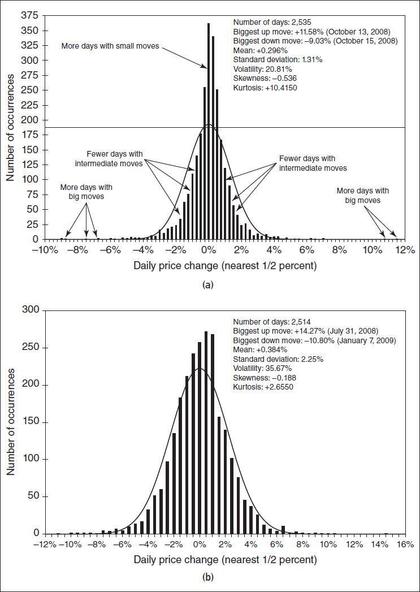

<!-- source:block 09e836ce815d0d02 -->

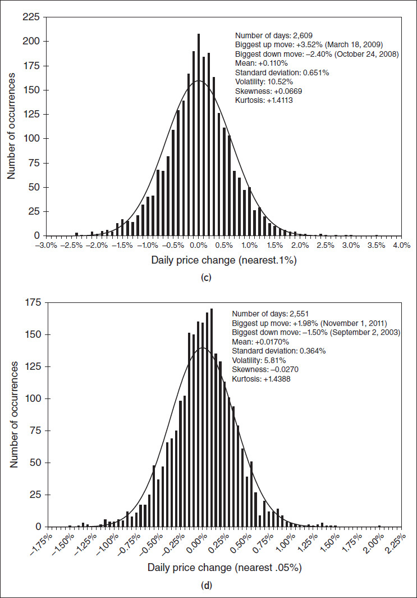

<!-- source:block 1eb581e857649f57 -->

> [!quote]- English 77
> If the frequency distribution conforms exactly to a normal distribution, the tops of the bars should coincide exactly with a true normal distribution. To find out if this is the case, the mean (+0.0296 percent) and standard deviation (1.31 percent) have been calculated for all 2,535 daily price changes over the 10-year period. From these numbers, a best-fit normal distribution has been overlaid on the frequency chart. The actual frequency distribution is similar to the normal distribution, but there are some clear differences. Because the bars representing the small price changes rise above the normal distribution curve, there seem to be more days with small price changes than one would expect from a true normal distribution. Although they are not as obvious, there are also several large price changes, or *outliers*, that rise above the extreme tails of the normal distribution. These outliers seem to suggest that there are more large moves in our frequency distribution than one would expect from a true normal distribution. Finally, in the midsections, between the peak of the distribution and the extreme tails, there seem to be fewer occurrences than one would expect.

如果频率分布完全符合正态分布，则条的顶部应该与真正态分布完全重合。为了确定情况是否属实，计算了10年期间所有2,535次每日价格变化的平均值（+0.0296%）和标准差（1.31%）。根据这些数字，最佳正态分布已覆盖在频率图上。实际的频率分布与正态分布相似，但存在一些明显的差异。由于代表小幅价格变化的条线高于正态分布曲线，因此价格小幅变化的天数似乎比人们从真正的正态分布中预期的要多。尽管它们并不那么明显，但也有一些较大的价格变化或异常值高于正态分布的极端尾部。这些异常值似乎表明，我们的频率分布中的大幅变化比人们从真正的正态分布中预期的要多。最后，在中部，在分布的峰值和极端尾部之间，发生的情况似乎比人们预期的要少。

<!-- source:block 047859d0416af6bb -->

> [!quote]- English 78
> One might surmise that the differences in Figure 23-8*a* between the S&P 500 frequency distribution and the true normal distribution are either unique to the S&P 500 or an aberration of the 10-year period in question, which admittedly included the financial crisis of 2008. However, studies tend to indicate that price-change distributions for almost all exchange-traded underlying markets exhibit characteristics that are very similar to the S&P 500 distribution. There are always more days with small moves, more days with large moves, and fewer days with intermediate moves than are predicted by a true normal distribution. The differences between the actual and theoretical distributions can also be seen in several other histograms covering the same period of time: crude oil (Figure 23-8*b*), the euro (Figure 23-8*c*), and the Bund (Figure 23-8*d*).

人们可能会推测，图23-8a中标准普尔500指数频率分布和真正态分布之间的差异要么是标准普尔500指数独有的，要么是所讨论的10年期间的异常现象，其中当然包括2008年的金融危机。然而，研究往往表明，几乎所有交易所交易标的市场的价格变化分布都表现出与标准普尔500指数分布非常相似的特征。与真正态分布预测的相比，小幅变动的天数总是更多，大幅变动的天数总是更多，中间变动的天数总是更少。实际分布和理论分布之间的差异也可以在涵盖同一时间段的其他几个图表中看出：原油（图23-8b）、欧元（图23- 8 c）和外滩（图23-8d）。

<!-- source:block 9e99f244bb545f7d -->

## 偏度与峰度 / Skewness and Kurtosis

<!-- source:block b6f635d1bad575b5 -->

> [!quote]- English 79
> Distributions such as those in Figure 23-8*a* through 23-8*d* are approximately normal but still differ from a true normal distribution. If one is trying to make decisions based on the characteristics of a distribution, it might be useful to know how the actual distribution differs from the normal. A perfectly normal distribution can be fully described by its mean and standard deviation. But two other numbers, the *skewness* and *kurtosis*, are often used to describe the extent to which an actual distribution differs from a true normal distribution.7

图23-8a至23-8d中的分布大致正态，但仍与真正的正态分布不同。如果试图根据分布的特征做出决策，了解实际分布与正常分布有何不同可能会很有用。完全正态分布可以通过其均值和标准差完全描述。但另外两个数字，偏度和峰度，经常被用来描述实际分布与真正正态分布的差异程度。[^ovp23-7]

<!-- source:block d22cf57d136b7468 -->

> [!quote]- English 80
> The skewness of a distribution (Figure 23-9) can be thought of as the lop-sidedness of the distribution, or the extent to which one tail is longer than the other tail. In a positively skewed distribution, the right tail is longer than the left tail. (The lognormal distribution shown in Figure 6-7 is positively skewed.) In a negatively skewed distribution, the left tail is longer than the right tail. A perfectly normal distribution has a skewness of 0. The frequency distribution in Figure 23-8*c* (euro) is positively skewed, while the distributions in Figures 23-8*a* (S&P 500), 23-8*b* (crude oil), and 23-8*d* (Bund) are negatively skewed.

分布的倾斜度（图23-9）可以被认为是分布的不平衡性，或者一条尾巴比另一条尾巴长的程度。在正偏分布中，右尾比左尾长。(The图6-7所示的对正态分布呈正偏。）在负偏分布中，左尾比右尾长。完全正态分布的偏度为0。图23- 8 c（欧元）中的频率分布呈正偏，而图23-8a（标准普尔500）、23-8b（原油）和23-8d（外滩）中的分布呈负偏。

<!-- source:block 9e8f646651ef24e8 -->

*图23-9偏度-分布的一个尾部比另一个尾部长的程度。 / Figure 23-9 skewness—the degree to which one tail of a distribution is longer than the other tail.*

<!-- source:block 732c9f2bcbe335af -->

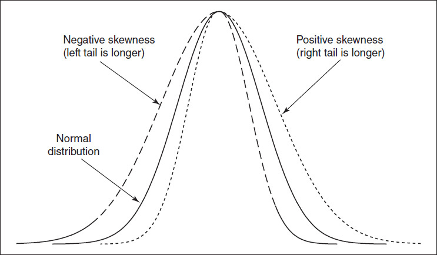

<!-- source:block d7c31dc1ac5b89e8 -->

> [!quote]- English 82
> The kurtosis of a distribution (Figure 23-10) is the extent to which the center of the distribution is either unusually tall or unusually flat. A distribution with a positive kurtosis has a tall peak (*leptokurtic*), whiles a distribution with a negative kurtosis has a low or flat peak (*platykurtic*). A perfectly normal distribution has a kurtosis of 0 (*mesokurtic*).8

分布的峰度（图23-10）是指分布中心异常高或异常平的程度。具有正峰度的分布具有高峰值（尖峰），而具有负峰度的分布具有低峰值或平坦峰值（平顶峰）。完全正态分布的峰度为0（中峰）。[^ovp23-8]

<!-- source:block d7e3b84b87605996 -->

*图23-10峰度——分布具有更高的峰和更宽的尾的程度 / Figure 23-10 Kurtosis—the degree to which a distribution has a taller peak and wider tails.*

<!-- source:block c1819af9fd286d41 -->

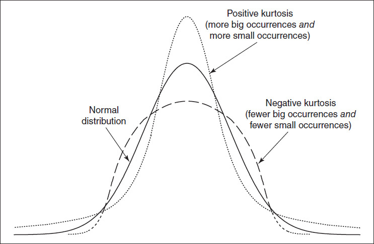

<!-- source:block 3315c5c36e8d675c -->

> [!quote]- English 84
> At first sight, a positive kurtosis distribution looks similar to a low standard deviation distribution because both have high peaks. But a distribution with a low standard deviation also has short tails, while a distribution with a positive kurtosis has elongated tails. One might think of a positive kurtosis distribution as a normal distribution where the midsection to the left and right of the peak has been squeezed inward. This forces the peak of the distribution upward and the tails outward. The frequency distributions in Figures 23-8*a* through 23-8*d* all exhibit the same positive kurtosis, which is typical of almost all exchange-traded underlying markets. They have higher peaks (more days with small moves), elongated tails (more days with big moves), and narrow midsections (fewer days with intermediate moves) than are predicted by a true normal distribution. Traders sometimes refer to these as “fat tail” distributions.

乍一看，正峰分布看起来与低标准差分布相似，因为两者都有很高的峰值。但标准差较低的分布也具有短尾，而峰度为正的分布则具有细长的尾。人们可能会将正峰度分布视为正态分布，其中峰值左侧和右侧的中部已被向内挤压。这迫使分布的峰值向上，尾部向外。图23-8a至23-8d中的频率分布均表现出相同的正峰度，这是几乎所有交易所交易标的市场的典型特征。它们的峰值（有更多的小移动天数）、细长的尾部（有更多的大移动天数）和狭窄的中段（有更少的中间移动天数）比真正态分布预测的高。交易员有时将其称为“胖尾”分布。

<!-- source:block 1aebc0010e0c325d -->

> [!quote]- English 85
> The S&P 500 distribution has an unusually large kurtosis value of 10.415. To see the extent to which the tails of this distribution are abnormally fat, we can express the biggest up and down moves in standard deviations and then consider the chances of these moves occurring under the assumption of a normal distribution. The biggest up move in the S&P over the 10-year period was 11.58 percent. With a standard deviation of 1.31 percent, this translates into an 8.84 standard deviation occurrence. The probability of such an occurrence is approximately 1 chance in 2,000,000,000,000,000,000 (2 quintillion, for anyone who is counting). The biggest down move, 9.03 percent, translates into a 6.75 standard deviation occurrence, with a probability equal to approximately 1 chance in 350,000,000,000 (350 billion). Simply put, the likelihood of either of these occurrences is so small that they will essentially never occur.9

标普 500 收益率分布的峰度异常高，达到 10.415。为了看出该分布尾部异常肥厚的程度，可以用标准差表示最大涨跌幅，再在正态分布假设下考察这些变动的发生概率。10 年期间标普指数的最大上涨为 11.58%。在标准差为 1.31% 时，这相当于一次 8.84 个标准差的变动，其概率约为 2,000,000,000,000,000,000 分之 1（即 2 quintillion）。最大下跌为 9.03%，相当于 6.75 个标准差，其概率约为 350,000,000,000 分之 1（即 350 billion）。简而言之，两种情形的理论概率都小到几乎不可能发生。 [^ovp23-9]

<!-- source:block aa39ac6f9ebdf53d -->

> [!quote]- English 86
> The kurtosis values for crude oil, the euro, and the Bund are not as dramatic as the S&P 500. But even in these markets under the assumptions of a normal distribution, we would expect to see the biggest up and down moves only once in many millions of occurrences. Keeping in mind that the data covered a period of between 2,500 and 2,600 days, we can see how much more often big moves occur are in the real world compared with what is predicted by a normal distribution. The probabilities associated with the largest moves in our sample distributions are shown in Figure 23-11.

原油、欧元和外滩的峰度值并不像标准普尔500指数那么剧烈。但即使在这些市场中，在正态分布的假设下，我们也预计数百万次出现最大的上下波动。请记住，数据涵盖了2,500至2,600天之间的时间，我们可以看到与正态分布预测的情况相比，现实世界中发生大变动的频率要高得多。与样本分布中最大变动相关的概率如图23-11所示。

<!-- source:block 345b2da9ac1dd1ac -->

*图23-11与最大上下移动相关的概率。 / Figure 23-11 Probabilities associated with the biggest up and down moves.*

<!-- source:block 00d29347276f796b -->

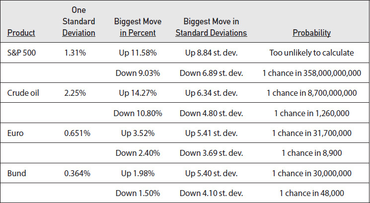

<!-- source:block 4224f2aa3ab93626 -->

> [!note] Footnote 88
> 1 By *traditional pricing model* we mean those that are most commonly used: the Black-Scholes model and its variations or the Cox-Ross-Rubinstein model.

[^ovp23-1]: 我们所说的传统定价模型是指最常用的模型：布莱克-斯科尔斯模型及其变体或考克斯-罗斯-鲁宾斯坦模型。

<!-- source:block 9c83178a800cc512 -->

> [!note] Footnote 89
> 2 The possibility that a trader in a futures option market may also have to come up with additional variation money, as opposed to margin money, after establishing an option position is incorporated into most models. This is why a conversion or reversal in a futures option market may not be delta neutral.

[^ovp23-2]: 期货期权市场的交易员在建立期权头寸后可能还必须提供额外的变动结算额资金，而不是保证金资金，这一可能性被纳入大多数模型中。这就是为什么期货期权市场的转换或逆转可能不是Delta中性的。

<!-- source:block 2ca1d638d0e12bed -->

> [!note] Footnote 90
> 3 This is not to say that tax consequences are always insignificant. Tax considerations can play a role in portfolio management or in option strategies involving dividends when the dividends are subject to tax rules different from the gains or losses from stock or options.

[^ovp23-3]: 这并不是说税收后果总是微不足道的。当股息受与股票或期权损益不同的税收规则约束时，税务考虑可以在投资组合管理或涉及股息的期权策略中发挥作用。

<!-- source:block 193aa6aeb8cb9e0a -->

> [!note] Footnote 91
> 4 A discussion of the jump-diffusion model can be found in most advanced texts on option pricing. For additional information, see Robert Merton, “Option Pricing when Underlying Stock Returns Are Discontinuous,” *Journal of Financial Economics* 3(March):125–144, 1976; Stan Beckers, “A Note on Estimating the Parameters in the Jump-Diffusion Model of Stock Returns,” *Journal of Financial and Quantitative Analysis*, March 1981, pp. 127–140; and Espen Gaarder Haug, *The Complete Guide to Option Pricing Formulas*, 2nd ed. (New York: McGraw-Hill, 2006).

[^ovp23-4]: 关于跳跃扩散模型的讨论可以在有关期权定价的最高级文本中找到。欲了解更多信息，请参阅Robert Merton，“标的股票回报不连续时的期权定价”，Journal of Financial Economics 3（3月）：125-144，1976; Stan Beckers，“A Note on Estimating the models in the Jump-Diffusion Model of Stock Returns”，Journal of Financial and Quantitative Analytics，1981年3月，pp。127-140;和Espen Gaarder Haug，《期权定价公式完整指南》，第2版。（纽约：McGraw-Hill，2006）。

<!-- source:block 40d7b5680ae6b94b -->

> [!note] Footnote 92
> 5 This assumes, of course, that the trader is able to absorb the loss and still stay in business for the long run.

[^ovp23-5]: 当然，这假设交易员能够吸收损失并仍然长期经营。

<!-- source:block 2e243826220a4c07 -->

> [!note] Footnote 93
> 6 For information on the CEV model, see John C. Cox and Stephen A. Ross, “The Valuation of Options for Alternative Stochastic Processes,” *Journal of Financial Economics* 3(March):145–166, 1976; Stan Beckers, “The Constant Elasticity of Variance Model and Its Implications for Option Pricing,” *Journal of Finance*, June 1980, pp. 661–673; Mark Schroder, “Computing the Constant Elasticity of Variance Option Pricing Model,” *Journal of Finance* 44(1):211–219, 1989; and Espen Gaarder Haug, *The Complete Guide to Option Pricing Formulas*, 2nd ed. (New York: McGraw-Hill, 2006).

[^ovp23-6]: 有关CEV模型的信息，请参阅John C。考克斯和斯蒂芬·A。Ross，“另类随机过程的期权估值”，《金融经济学杂志》3（3月）：145-166，1976年; Stan Beckers，“方差模型的恒定弹性及其对期权定价的影响”，《金融学杂志》，1980年6月，第页。661-673; Mark Schroder，“计算方差的恒定弹性期权定价模型”，Journal of Finance 44（1）：211-219，1989;和Espen Gaarder Haug，The Full Guide to期权定价公式，第2版。（纽约：McGraw-Hill，2006）。

<!-- source:block 00ec3f1497a9c974 -->

> [!note] Footnote 94
> 7 The skewness and kurtosis functions are included in most commonly used spreadsheets. Their formulas can be found in a statistics or probability textbook.

[^ovp23-7]: 最常用的电子表格中包含偏度和峰度函数。他们的公式可以在统计学或概率教科书中找到。

<!-- source:block 7ba4e91f71ae8f91 -->

> [!note] Footnote 95
> 8 Mathematically, a true normal distribution has a kurtosis of 3. However, as commonly expressed, 3 is usually subtracted from the kurtosis value, so a true normal distribution has a kurtosis value of 0.

[^ovp23-8]: 从数学上讲，真正态分布的峰度为3。然而，正如通常所表达的那样，通常从峰度值中减去3，因此真正态分布的峰度值为0。

<!-- source:block 21f96ae3e8d0d9ce -->

> [!note] Footnote 96
> 9 Nassim Taleb has referred to such unlikely occurrences as “black swans.” See Nassim Nicholas Taleb, *The Black Swan: The Impact of the Highly Improbable* (New York: Penguin Books, 2008).

[^ovp23-9]: 纳西姆·塔勒布将这种不太可能发生的事件称为“黑天鹅”。请参阅纳西姆·尼古拉斯·塔勒布（Nassim Nicholas Taleb）的《黑天鹅：极不可能的影响》（纽约：企鹅图书公司，2008年）。

---

[[阅读导航|← 返回阅读导航]]

<!-- chapter-nav:start -->
> [!tip] 章节导航（章末）
> [[股票指数期货与期权 Stock Index Futures and Options|← 上一章]] · [[阅读导航|全书导航]] · [[波动率偏斜 Volatility Skews|下一章 →]]
<!-- chapter-nav:end -->
