# 波动率 / Volatility

[[阅读导航|← 返回阅读导航]]

> [!success] 翻译状态
> 本章翻译与风险审计已完成。英文原文、数字、公式和图表继续保留，便于逐段核对。

<!-- chapter-toc:start -->
## 本章目录 / Chapter Outline

> [!abstract] 结构导航
> 以下标题按原书顺序保留；点击可直接跳转。

- [[#随机游走与正态分布 / Random Walks and Normal Distributions|随机游走与正态分布 / Random Walks and Normal Distributions]]
- [[#均值与标准差 / Mean and Standard Deviation|均值与标准差 / Mean and Standard Deviation]]
- [[#作为分布均值的远期价格 / Forward Price as the Mean of a Distribution|作为分布均值的远期价格 / Forward Price as the Mean of a Distribution]]
- [[#作为标准差的波动率 / Volatility as a Standard Deviation|作为标准差的波动率 / Volatility as a Standard Deviation]]
- [[#波动率的时间尺度换算 / Scaling Volatility for Time|波动率的时间尺度换算 / Scaling Volatility for Time]]
- [[#波动率与观察到的价格变化 / Volatility and Observed Price Changes|波动率与观察到的价格变化 / Volatility and Observed Price Changes]]
- [[#关于利率产品的说明 / A Note on Interest-Rate Products|关于利率产品的说明 / A Note on Interest-Rate Products]]
- [[#对数正态分布 / Lognormal Distributions|对数正态分布 / Lognormal Distributions]]
- [[#解读波动率数据 / Interpreting Volatility Data|解读波动率数据 / Interpreting Volatility Data]]
  - [[#已实现波动率 / Realized Volatility|已实现波动率 / Realized Volatility]]
  - [[#隐含波动率 / Implied Volatility|隐含波动率 / Implied Volatility]]
<!-- chapter-toc:end -->
<!-- chapter-nav:start -->
> [!tip] 章节导航（章首）
> [[理论定价模型 Theoretical Pricing Models|← 上一章]] · [[阅读导航|全书导航]] · [[风险度量（一） Risk Measurement I|下一章 →]]
<!-- chapter-nav:end -->
<!-- source:block cba39c459eaeca08 -->

> [!quote]- English 1
> What is volatility, and why is it so important in option evaluation? The option trader, like a trader in the underlying instrument, is interested in the direction of the market. But unlike a trader in the underlying, an option trader is also sensitive to the speed of the market. If the market for an underlying contract fails to move at a sufficient speed, options on that contract will have less value because of the reduced likelihood of the market going through an option’s exercise price. In a sense, volatility is a measure of the speed of the market. Markets that move slowly are low-volatility markets; markets that move quickly are high-volatility markets.

什么是波动率？为什么它在期权评估中如此重要？期权交易员，就像标的工具的交易员一样，对市场的方向感兴趣。但与标的交易员不同的是，期权交易员对市场速度也很敏感。如果标的合约的市场未能以足够的速度移动，该合约上的期权的价值将减少，因为市场经历期权行权价的可能性降低。从某种意义上说，波动率是市场速度的衡量标准。走势缓慢的市场是低波动率市场;走势迅速的市场是高波动率市场。

<!-- source:block e58f8d0da7fbdf91 -->

> [!quote]- English 2
> One might guess intuitively that some markets are more volatile than others. During 2008, the price of crude oil began the year at \$99 per barrel, reached a high of \$144 per barrel in July, and finished the year at \$45 per barrel. The price rose 58 percent and then dropped 69 percent. Yet few traders could imagine a major stock index such as the Standard and Poor’s (S&P) 500 Index exhibiting similar fluctuations over a single year.

人们可能会凭直觉猜测某些市场比其他市场波动更大。2008年期间，原油价格年初为每桶99美元，7月份达到每桶144美元的高点，年底为每桶45美元。价格上涨58%，随后下跌69%。然而，很少有交易员能想象标准普尔（S & P）500指数等主要股指会在一年内表现出类似的波动。

<!-- source:block 445978e16cd9c2b3 -->

> [!quote]- English 3
> If we know whether a market will be relatively volatile or relatively quiet and can convey this information to a theoretical pricing model, any evaluation of options on that market will be more accurate than if we simply ignore volatility. Because option models are based on mathematical formulas, we will need some method of quantifying this volatility component so that we can feed it into the model in numerical form.

如果我们知道市场是否相对波动或相对安静，并能够将此信息传达给理论定价模型，那么对该市场上期权的任何评估都将比我们简单地忽略波动率更准确。由于期权模型基于数学公式，因此我们需要某种量化波动率成分的方法，以便我们可以将其以数字形式输入模型中。

<!-- source:block 1593d04db6f45565 -->

## 随机游走与正态分布 / Random Walks and Normal Distributions

<!-- source:block a85fb73dc7d9b46f -->

> [!quote]- English 4
> Consider for a moment the pinball maze pictured in Figure 6-1. When a ball is dropped into the maze at the top, it falls downward, pulled by gravity through a series of nails. When the ball encounters each nail, there is a 50 percent chance that the ball will move to the left and a 50 percent chance that it will move to the right. The ball then falls down a level where it encounters another nail. Finally, at the bottom of the maze, the ball falls into one of the troughs.

考虑一下图6-1中所示的弹球迷宫。当一个球掉进顶部的迷宫时，它会在重力的作用下向下掉落，穿过一系列钉子。当球遇到每个钉子时，球有50%的机会向左移动，有50%的机会向右移动。然后球掉到一定水平，遇到另一颗钉子。最后，在迷宫的底部，球掉进了其中一个槽中。

<!-- source:block 766267f18d6f2fbe -->

*图6-1随机行走。 / Figure 6-1 Random walk.*

<!-- source:block 07dc19b5c2675e55 -->

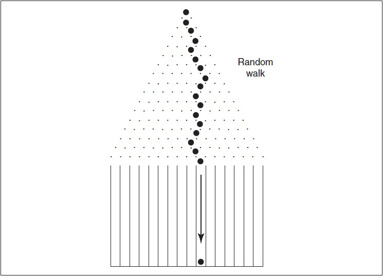

<!-- source:block d0a59740e4a5c975 -->

> [!quote]- English 6
> As the ball falls down through the maze, it follows a *random walk*. Once the ball enters the maze, nothing can be done to artificially alter its course, nor can one predict the path that the ball will follow through the maze.

当球从迷宫中掉落时，它会随机行走。一旦球进入迷宫，就无法采取任何措施来人为地改变它的路线，也无法预测球穿过迷宫的路径。

<!-- source:block f74fcd322364fb01 -->

> [!quote]- English 7
> As more balls are dropped into the maze, they might begin to form a distribution similar to that in Figure 6-2. Most of the balls tend to cluster near the center of the maze, with a decreasing number of balls ending up in troughs farther away from the center. If many balls are dropped into the maze, they will begin to form a bell-shaped or *normal distribution*.

随着越来越多的球掉进迷宫中，它们可能会开始形成类似于图6-2中的分布。大多数球倾向于聚集在迷宫中心附近，最终进入远离中心的凹槽的球数量越来越少。如果许多球掉进迷宫中，它们将开始形成钟形或正态分布。

<!-- source:block 27f91b1aec0fe877 -->

*图6-2正态分布。 / Figure 6-2 Normal distribution.*

<!-- source:block 201eec2d424e1a47 -->

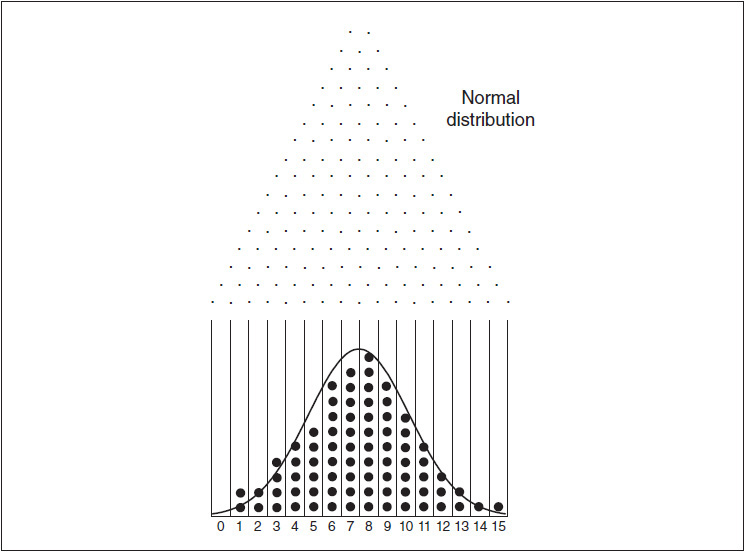

<!-- source:block d51640058bee113b -->

> [!quote]- English 9
> If an infinite number of balls were dropped into the maze, the resulting distribution might be approximated by a *normal distribution curve* such as the one overlaid on the distribution in Figure 6-2. Such a curve is symmetrical (if we flip it from right to left, it looks the same), it has its peak in the center, and its tails always move down and away from the center.

如果将无限数量的球扔进迷宫中，所得分布可能会用正态分布曲线来逼近，例如覆盖在图6-2中分布上的曲线。这样的曲线是对称的（如果我们将其从右向左翻转，它看起来是一样的），它的峰值在中心，它的尾巴总是向下移动并远离中心。

<!-- source:block 92aa5041468ef051 -->

> [!quote]- English 10
> Normal distribution curves are used to describe the likely outcomes of random events. For example, the curve in Figure 6-2 might also represent the results of flipping a coin 15 times. Each outcome, or trough, represents the number of heads that occur from each 15 flips. An outcome in trough 0 represents 0 heads and 15 tails; an outcome in trough 15 represents 15 heads and 0 tails. Of course, we would be surprised to flip a coin 15 times and get all heads or all tails. Assuming that the coin is perfectly balanced, some outcome in between, perhaps 8 heads and 7 tails, or 9 heads and 6 tails, seems more likely.

正态分布曲线用于描述随机事件的可能结果。例如，图6-2中的曲线也可能代表抛硬币15次的结果。每个结果或谷值代表每15次翻转出现的正面数量。谷0中的结果代表0个正面和15个反面;谷15中的结果代表15个正面和0个反面。当然，如果抛硬币15次并得到正面或反面，我们会感到惊讶。假设硬币完全平衡，那么介于两者之间的一些结果，也许是8正面和7反面，或者9正面和6反面，似乎更有可能。

<!-- source:block f3d251696b17eeac -->

> [!quote]- English 11
> Suppose that we rearrange the nails in our maze so that each time a ball encounters a nail and moves either left or right, it must drop down two levels before it encounters another nail. If we drop enough balls into the maze, we may end up with a distribution similar to the curve in Figure 6-3. Because the sideways movement of the balls is restricted, the curve will have a higher peak and narrower tails than the curve in Figure 6-2. In spite of its altered shape, the distribution is still normal, although one with slightly different characteristics.

假设我们重新排列迷宫中的钉子，这样每当一个球遇到钉子并向左或向右移动时，它就必须下降两层才能遇到另一个钉子。如果我们向迷宫中投入足够多的球，最终可能会得到类似于图6-3中曲线的分布。由于球的侧向运动受到限制，因此曲线将比图6-2中的曲线具有更高的峰值和更窄的尾部。尽管形状发生了变化，但分布仍然正常，尽管特征略有不同。

<!-- source:block 621800f63461f4df -->

*图6-3 / Figure 6-3*

<!-- source:block aef9a8adf8bb2aee -->

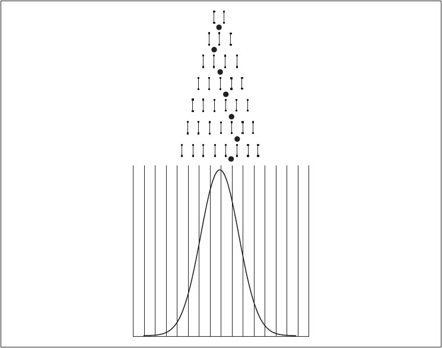

<!-- source:block c450f98b117d91da -->

> [!quote]- English 13
> Finally, we might again rearrange the nails so that each time a ball drops down a level, it must move two nails left or right before it can drop down to a new level. If we drop enough balls into the maze, we may get a distribution that resembles the curve in Figure 6-4. This distribution, although still normal, will have a much lower peak and spread out much more quickly than the distributions in either Figure 6-2 or Figure 6-3.1

最后，我们可能会再次重新排列钉子，以便每次球掉下一层时，它必须向左或向右移动两个钉子，然后才能掉到新的层。如果我们将足够多的球放入迷宫中，我们可能会得到类似于图6-4中曲线的分布。 该分布尽管仍然正常，但其峰值低得多，并且比图6-2或图6-3中的分布快得多。 [^ovp06-1]

<!-- source:block 6bd147a5219e4ac1 -->

> [!quote]- English 14
> Suppose that we now think of the ball’s sideways movement as the up and down price movement of an underlying contract and the ball’s downward movement as the passage of time. If the price movement of an underlying contract follows a random walk, the curves in Figures 6-2 through 6-4 might represent possible price distributions in a moderate-, low-, and high-volatility market, respectively.

假设我们现在将球的横向运动视为标的合约的价格上下运动，而球的向下运动则视为时间的流逝。如果标的合约的价格走势遵循随机游走，则图6-2至6-4中的曲线可能分别代表中等、低和高波动率市场中可能的价格分布。

<!-- source:block 3e93a0152127a296 -->

*图6-4 / Figure 6-4*

<!-- source:block 83156550fae389fd -->

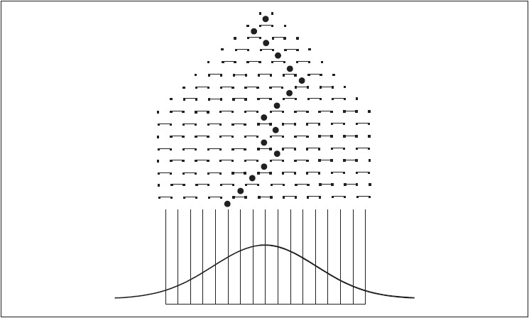

<!-- source:block 7e1c790d41a5bbbb -->

> [!quote]- English 16
> Earlier in this chapter we suggested that the theoretical pricing of options begins by assigning probabilities to the various underlying prices. How should these probabilities be assigned? One possibility is to assume that, at expiration, the underlying prices are normally distributed. Given that there are many different normal distributions, how will our choice of distribution affect option evaluation?

在本章的前面，我们建议期权的理论定价始于为各种标的价格分配概率。这些可能性应该如何分配？一种可能性是假设到期时，标的价格呈正态分布。鉴于存在许多不同的正态分布，我们的分布选择将如何影响期权评估？

<!-- source:block 164ce0d35566610f -->

> [!quote]- English 17
> Because all normal distributions are symmetrical, it may seem that the choice of distribution is irrelevant. Increased volatility may increase the likelihood of large upward movement, but this should be offset by the greater likelihood of large downward movement. However, there is an important distinction between an option position and an underlying position. The expected value for an underlying contract depends on all possible price outcomes. The expected value for an option depends only on the outcomes that result in the option finishing in the money. Everything else is zero.

由于所有正态分布都是对称的，选择哪一种分布似乎无关紧要：波动率上升固然会增加价格大幅上涨的可能性，但价格大幅下跌的可能性也会相应增加。然而，期权头寸与标的头寸之间存在一个重要区别。标的合约的期望价值取决于所有可能的价格结果；期权的期望价值则只取决于那些使期权到期处于价内的结果，其余结果的到期价值均为零。

<!-- source:block fafcd2205f52c91a -->

> [!quote]- English 18
> In Figure 6-5, we have three possible price distributions centered around the current price of an underlying contract. Suppose that we want to evaluate a call at a higher exercise price. The value of the call will depend on the amount of the distribution to the right of the exercise price. We can see that as we move from a low-volatility distribution, to a moderate-volatility distribution, to a high-volatility distribution, a greater portion of the possible price distribution lies to the right of the exercise price. Consequently, the option takes on an increasingly greater value.

在图6-5中，我们有三种可能的价格分布，以标的合约的当前价格为中心。假设我们想要以更高的行权价评估看涨期权。看涨期权的价值将取决于向行权价右侧的分配金额。我们可以看到，当我们从低波动率分布转向中等波动率分布，再转向高波动率分布时，可能的价格分布的更大一部分位于行权价的右侧。因此，该选择的价值越来越大。

<!-- source:block 0602d651f80cbaff -->

*图6-5 / Figure 6-5*

<!-- source:block 32e828ceeaf7172a -->

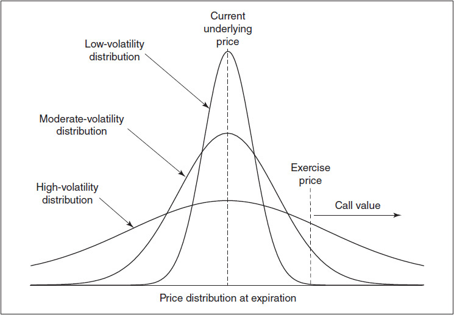

<!-- source:block 4979f1fe7c5c28de -->

> [!quote]- English 20
> We might also consider the value of a put at a lower exercise price. If we assume that movement is random, the same high-volatility distribution that will cause the call to take on greater value will also cause the put to take on greater value. In the case of the put, more of the distribution will lie to the left of the exercise price. Because our distributions are symmetrical, in a high-volatility market, all options, whether calls or puts, higher or lower exercise prices, take on greater value. For the same reason, in a low-volatility market, all options take on reduced values.

我们还可能考虑较低行权价的看跌期权的价值。如果我们假设走势是随机的，那么导致看涨期权具有更大价值的高波动率分布也将导致看跌期权具有更大价值。就看跌期权而言，更多的分配将位于行权价的左侧。由于我们的分布是对称的，在高波动率市场中，所有期权，无论是看涨还是看跌，更高或更低的行权价，都具有更大的价值。出于同样的原因，在低波动率市场中，所有期权的价值都会降低。

<!-- source:block 3dd147b7c3355889 -->

## 均值与标准差 / Mean and Standard Deviation

<!-- source:block 5a782afa77a1e652 -->

> [!quote]- English 21
> If we assume a normal distribution of prices, we will need a method of describing the appropriate normal distribution to the theoretical pricing model. Fortunately, all normal distributions can be fully described with two numbers—the *mean* and the *standard deviation*. If we know that a distribution is normal, and we also know the mean and standard deviation, then we know all the characteristics of the distribution.

如果我们假设价格呈正态分布，我们将需要一种方法来描述理论定价模型的适当正态分布。幸运的是，所有正态分布都可以用两个数字来完全描述——均值和标准差。如果我们知道分布是正态的，并且我们还知道均值和标准差，那么我们就知道分布的所有特征。

<!-- source:block 1fc1e51b1e85eec7 -->

> [!quote]- English 22
> Graphically, we can interpret the mean as the location of the peak of the distribution and the standard deviation as a measure of how fast the distribution spreads out. Distributions that spread out very quickly, such as the one in Figure 6-4, have a high standard deviation. Distributions that spread out very slowly, such as the one in Figure 6-3, have a low standard deviation.

从图形上看，可以把均值理解为分布峰值所在的位置，把标准差理解为分布向两侧扩散快慢的度量。像图6-4那样扩散很快的分布具有较大的标准差；像图6-3那样扩散很慢的分布则具有较小的标准差。

<!-- source:block bee114e13a60cf76 -->

> [!quote]- English 23
> Numerically, the mean is simply the average outcome, a concept familiar to most traders. To calculate the mean, we add up all the results and divide by the total number of occurrences. Calculation of the standard deviation is not quite so simple and will be discussed later. What is important at this point is the interpretation of these numbers, in particular, what a mean and standard deviation suggest in terms of likely price movement.

从数字上讲，平均值只是平均结果，这是大多数交易员熟悉的概念。为了计算平均值，我们将所有结果相加并除以出现的总数。标准差的计算并不那么简单，稍后将讨论。此时重要的是对这些数字的解释，特别是从可能的价格走势来看，平均值和标准差表明了什么。

<!-- source:block 191f6d80fa40e8cc -->

> [!quote]- English 24
> Let’s go back to Figure 6-2 and consider the troughs numbered 0 to 15 at the bottom. We suggested that these numbers might represent the number of heads resulting from 15 flips of a coin. Alternatively, they might represent the number of times a ball goes to the right at each nail as it drops down through the maze. The first trough is assigned 0 because any ball that ends there must go left at every nail. The last trough is assigned 15 because any ball that ends there must go right at every nail.

让我们回到图6-2，看看底部编号为0至15的各个槽。前面提到，这些数字可以表示抛掷一枚硬币15次所得的正面次数；也可以表示小球穿过迷宫时，在各个钉子处向右移动的次数。最左边的槽编号为0，因为落入其中的小球在每个钉子处都必须向左；最右边的槽编号为15，因为落入其中的小球在每个钉子处都必须向右。

<!-- source:block d3aa40a79501fd41 -->

> [!quote]- English 25
> Suppose that we are told that the mean and standard deviation in Figure 6-2 are 7.50 and 3.00, respectively.2 What does this tell us about the distribution? The mean tells us the average outcome. If we add up all the outcomes and divide by the number of occurrences, the result will be 7.50. In terms of the troughs, the average result will fall halfway between troughs 7 and 8. (Of course, this is not an actual possibility. However, we noted in Chapter 5 that the average outcome does not have to be an actual possibility for any one outcome.)

假设图6-2所示分布的均值和标准差分别为7.50和3.00。[^ovp06-2]这两个数说明了什么？均值表示所有结果的平均数：把全部结果相加，再除以结果出现的总次数，所得就是7.50。就图中的槽位而言，平均结果位于7号槽与8号槽正中间。当然，7.50并不是一次试验实际能够出现的结果；不过第5章已经说明，平均结果不必是任何一次试验可能出现的实际结果。

<!-- source:block a64dd4a36a4ec741 -->

> [!quote]- English 26
> The standard deviation determines not only how fast the distribution spreads out, but it also tells us something about the likelihood of a ball ending up in a specific trough or group of troughs. In particular, the standard deviation tells us the probability of a ball ending up in a trough that is a specified distance from the mean. For example, we may want to know the likelihood of a ball falling down through the maze and ending up in a trough lower than 5 or higher than 10. The answer to this question depends on the number of standard deviations the ball must move away from the mean. If we know this, we can determine the probability associated with that number of standard deviations.

标准差不仅决定分布向两侧扩散的快慢，还能告诉我们小球落入某个槽或某组槽的可能性。具体而言，它可以衡量一个结果与均值相距若干个标准差时所对应的概率。例如，我们可能想知道小球穿过迷宫后落入5号以下或10号以上槽位的可能性。答案取决于这些槽位距均值有多少个标准差；知道这个距离，就能确定相应的概率。

<!-- source:block 16ba53de5a44d68b -->

> [!quote]- English 27
> The exact probability associated with any specific number of standard deviations can be found in most texts on statistics or probability. Alternatively, such probabilities can be easily calculated in most commonly used computer spreadsheet programs. For option traders, the following approximations will be useful:

与任何特定数量的标准差相关的确切概率可以在大多数统计或概率的文本中找到。或者，这种概率可以在最常用的计算机电子表格程序中容易地计算。对于期权交易者，以下近似值将是有用的：

<!-- source:block 197bd6f439ad82ff -->

> [!quote]- English 28
> ±1 standard deviation takes in approximately 68.3 percent (about 2/3) of all occurrences.

±1标准差约占所有事件的68.3%（约2/3）。

<!-- source:block cafc78f409c3c17a -->

> [!quote]- English 29
> ±2 standard deviations takes in approximately 95.4 percent (about 19/20) of all occurrences.

±2个标准差约占所有事件的95.4%（约19/20）。

<!-- source:block fadec01bd3706508 -->

> [!quote]- English 30
> ±3 standard deviations takes in approximately 99.7 percent (about 369/370) of all occurrences.

±3个标准差约占所有事件的99.7%（约369/370）。

<!-- source:block f3c2e358f8177fa5 -->

> [!quote]- English 31
> Note that each number of standard deviations is preceded by a plus or minus sign. Because normal distributions are symmetrical, the likelihood of up movement and down movement is identical. The probability associated with each number of standard deviations is usually given as a decimal value, but a fractional approximation is often useful to traders, and this appears in parentheses.

请注意，每个标准差数的前面都有一个正号或负号。由于正态分布是对称的，因此向上移动和向下移动的可能性是相同的。与每个标准差数量相关的概率通常以小数值的形式给出，但分数逼近通常对交易者有用，这出现在括号中。

<!-- source:block d30546e1a6b5ba7a -->

> [!quote]- English 32
> Now let’s try to answer our question about the likelihood of getting a ball in a trough lower than 5 or higher than 10. We can designate the divider between troughs 7 and 8 as the mean, 7½. If the standard deviation is 3, what troughs are within one standard deviation of the mean? One standard deviation from the mean is 7½ ± 3, or 4½ to10½. Interpreting ½ as the divider between troughs, we can see that troughs 5 through 10 fall within 1 standard deviation of the mean. We know that one standard deviation takes in about two-thirds of all occurrences, so we can conclude that out of every three balls we drop into the maze, two should end up in troughs 5 through 10. Whatever is left over, one out of every three balls, will end up in one of the remaining troughs, 0 through 4 and 11 through 15. Hence, the answer to our original question about the likelihood of getting a ball in a trough lower than 5 or higher than 10 is about 1 chance in 3, or about 33 percent. (The exact answer is 100% – 68.3% = 31.7%.) This is shown in Figure 6-6.

现在来回答小球落入5号以下或10号以上槽位的概率。把7号槽和8号槽之间的分界点视为均值7½。若标准差为3，则距均值一个标准差的区间为7½ ± 3，即4½至10½。把半整数理解为相邻槽位之间的分界线，可知5号至10号槽都落在均值的一个标准差以内。一个标准差约涵盖全部结果的三分之二，因此每投入三个球，约有两个会落入5号至10号槽；剩下的一个则会落入0号至4号或11号至15号槽。因此，小球落入5号以下或10号以上槽位的概率约为三分之一，即约33%（精确值为100% − 68.3% = 31.7%）。如图6-6所示。

<!-- source:block 7ba2d5b3aadec99c -->

*图6-6 / Figure 6-6*

<!-- source:block 2f0ec79cba59e18d -->

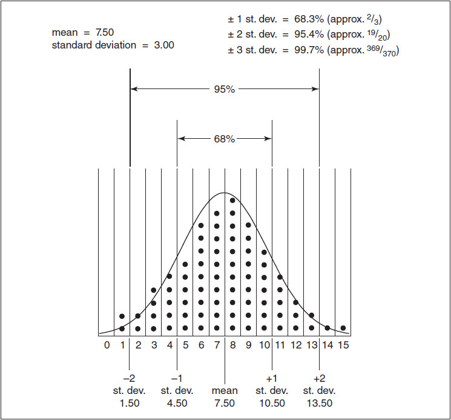

<!-- source:block 9b303d4e0d7142da -->

> [!quote]- English 34
> Let’s try another calculation, but this time we can think of the problem as a wager. Suppose that someone offers us 30 to 1 odds against dropping a ball into the maze and having it end up specifically in troughs 14 or 15. Is this bet worth making? One characteristic of standard deviations is that they are additive. In our example, if one standard deviation is 3, then two standard deviations are 6. Two standard deviations from the mean is therefore 7½ ± 6, or 1½ to 13½. We can see in Figure 6-6 that troughs 14 and 15 lie outside two standard deviations. Because the probability of getting a result within two standard deviations is approximately 19 out of 20, the probability of getting a result beyond two standard deviations is 1 chance in 20. Therefore, 30 to 1 odds may seem very favorable. Recall, however, that beyond two standard deviations also includes troughs 0 and 1. Because normal distributions are symmetrical, the chances of getting a ball specifically in troughs 14 or 15 must be half of 1 chance in 20, or about 1 chance in 40. At 30 to 1 odds, the bet must be a bad one because the odds do not sufficiently compensate us for the risk involved.

让我们尝试另一种计算，但这次我们可以将这个问题视为赌注。假设有人向我们提供了30比1的赔率，反对将球扔进迷宫并最终落入14或15个谷。这个赌注值得吗？标准差的一个特征是它们是相加的。在我们的示例中，如果一个标准差为3，那么两个标准差为6。因此，平均值的两个标准差为7½ ± 6，即1½到13½。我们在图6-6中可以看到，谷14和15位于两个标准差之外。由于获得结果在两个标准差内的可能性约为19/20，因此获得超过两个标准差的结果的可能性为1/20。因此，30比1的赔率可能看起来非常有利。然而，请记住，超过两个标准差还包括谷0和1。由于正态分布是对称的，因此在第14或15个谷中获得球的机会必须是20分之1的机会的一半，或大约40分之1的机会。赔率为30比1，赌注一定是糟糕的，因为赔率不足以补偿我们所涉及的风险。

<!-- source:block c9ada9de2ea04d49 -->

> [!quote]- English 35
> In Chapter 5, we suggested that a truly accurate theoretical pricing model would require us to assign probabilities to an infinite number of possible price outcomes for an underlying contract. Then, if we multiply each price outcome by its associated probability, we can use the results to calculate an option’s theoretical value. The problem is that an infinite number of anything is not easy to work with. Fortunately, the characteristics of normal distributions are so well known that formulas have been developed that facilitate the computation of both the probabilities associated with every point along a normal distribution curve and the area under various portions of the curve. If we assume that prices of an underlying instrument are normally distributed, these formulas represent a unique set of tools to help us solve for an option’s theoretical value.

在第5章中，我们提出，真正准确的理论定价模型需要我们为标的合约的无限多个可能的价格结果分配概率。然后，如果我们将每个价格结果乘以其相关的概率，我们就可以使用结果来计算期权的理论价值。问题是无限多的东西都不容易处理。幸运的是，正态分布的特征是众所周知的，以至于已经开发了公式，可以方便计算与正态分布曲线上的每个点相关的概率以及曲线各个部分下的面积。如果我们假设标的工具的价格服从正态分布，那么这些公式代表了一组独特的工具，可以帮助我们求解期权的理论价值。

<!-- source:block e2b28e690d42f99c -->

> [!quote]- English 36
> Louis Bachelier was the first to make the assumption that the prices of an underlying contract are normally distributed. As we shall see, there are logical problems with this assumption. Consequently, over the years, the assumption has been modified to make it more consistent with real-world conditions. In its modified form, it is the basis for many theoretical pricing models, including the Black-Scholes model.

路易·巴舍利耶（Louis Bachelier）最早假设标的合约的价格服从正态分布。正如后文将说明的，这一假设存在逻辑问题。因此，人们多年来不断修正它，使其更符合现实市场。修正后的假设构成了许多理论定价模型的基础，其中包括 Black–Scholes 模型。

<!-- source:block a81b26df50b67af4 -->

## 作为分布均值的远期价格 / Forward Price as the Mean of a Distribution

<!-- source:block 830d9ddf6b821bd2 -->

> [!quote]- English 37
> If we decide to assign probabilities that are consistent with a normal distribution, how do we feed this distribution into a theoretical pricing model? Because all normal distributions can be described by a mean and a standard deviation, in some way we must feed these two numbers into our pricing model.

如果我们决定分配与正态分布一致的概率，我们如何将这种分布输入理论定价模型？由于所有正态分布都可以用平均值和标准差来描述，因此以某种方式我们必须将这两个数字输入到我们的定价模型中。

<!-- source:block 306c1d5642229d15 -->

> [!quote]- English 38
> In Chapter 5, we suggested that any distribution ought to be centered around the most likely underlying price at expiration. Although we cannot know exactly what that price will be, if we assume that no arbitrage opportunity exists in the underlying contract, a logical guess is the forward price. If we make the assumption that the forward price represents the mean of a distribution, then in the long run, any trade made at the current underlying price will just break even. The various forms of the Black-Scholes model differ primarily in how they calculate the forward price. Depending on the type of underlying contract, whether a stock, a futures contract, or a foreign currency, the model takes the current underlying price, the time to expiration, interest rates, and, in the case of stocks, dividends to calculate the forward price. It then makes this the mean of the distribution.

在第5章中，我们建议任何分配都应该以到期时最有可能的标的价格为中心。尽管我们无法确切知道该价格是多少，但如果我们假设标的合约中不存在套利机会，那么合乎逻辑的猜测就是远期价格。如果我们假设远期价格代表分布的平均值，那么从长远来看，任何以当前标的价格进行的交易都会收支平衡。布莱克-斯科尔斯模型的各种形式的主要区别在于计算远期价格的方式。根据标的合约的类型，无论是股票、期货合约还是外币，该模型采用当前标的价格、到期时间、利率，以及（如果是股票）股息来计算远期价格。然后它使其成为分布的平均值。

<!-- source:block 552575ebb08bc418 -->

## 作为标准差的波动率 / Volatility as a Standard Deviation

<!-- source:block 9298de15adf84ee6 -->

> [!quote]- English 39
> In addition to the mean, to fully describe a normal distribution, we also need a standard deviation. When we input a volatility into a theoretical pricing model, we are actually feeding in a standard deviation. Volatility is just a trader’s term for standard deviation. Because the Greek letter sigma (σ) is the traditional notation for standard deviation, in this text we will use the same notation for volatility.

除了平均值之外，为了完全描述正态分布，我们还需要标准差。当我们将波动率输入理论定价模型时，我们实际上正在输入标准差。波动率只是交易员对标准差的术语。由于希腊字母σ（sigma）是标准差的传统符号，因此在本文中我们将对波动率使用相同的符号。

<!-- source:block 4f995591092f7ea2 -->

> [!quote]- English 40
> At this point, it will help if we assign a working definition to volatility, although we will later modify this definition slightly. For the present, we will assume that the volatility we feed into a pricing model represents a one standard deviation price change, in percent, over a one-year period. For example, consider a contract with a one-year forward price of 100 and that we are told has a volatility of 20 percent. (We’ll discuss later where this number might come from.) With a mean of 100 and a standard deviation of 20 percent, if we come back one year from now, there is a 68 percent probability that the contract will be trading between 80 and 120 (100 ± 20%), a 95 percent probability that the contract will be trading between 60 and 140 (100 ± 2 × 20%), and a 99.7 percent probability that the contract will be trading between 40 and 160 (100 ± 3 × 20%). These are the probabilities associated with one, two, and three standard deviations.

这里不妨先给波动率下一个便于使用的定义，后文还会对它稍作修正。暂且把输入定价模型的波动率理解为：一年期间内、以百分比表示的一个标准差价格变动。假设某合约的一年期远期价格为100，波动率为20%（这个数字从何而来，后文再讨论）。均值为100、标准差为20%时，一年后合约价格落在80至120之间（100 ± 20%）的概率为68%；落在60至140之间（100 ± 2 × 20%）的概率为95%；落在40至160之间（100 ± 3 × 20%）的概率为99.7%。这些分别是一个、两个和三个标准差对应的概率。

<!-- source:block 9728107b5352beb2 -->

> [!quote]- English 41
> Instead of specifying the forward price, suppose that we are dealing with a stock that is currently trading at \$100 and that has the same 20 percent volatility. In order to determine the one-year probabilities, we must first determine the one-year forward price because this represents the mean of the distribution. If interest rates are 8 percent and the stock pays no dividends, the one-year forward price will be \$108. Now, a one standard deviation price change is 20% × \$108 = \$21.60. Thus, one year from now, we would expect the same stock to be trading between \$86.40 and \$129.60 (\$108 ± \$21.60) approximately 68 percent of the time, between \$64.80 and \$151.20 (\$108 ± 2 × \$21.60) approximately 95 percent of the time, and between \$43.20 and \$172.80 (\$108 ± 3 × \$21.60) approximately 99.7 percent of the time.

再假设我们面对的是一只现价100美元、波动率同样为20%的股票。要确定一年后的概率分布，必须先求出一年期远期价格，因为它是分布的均值。若利率为8%且股票不派息，一年期远期价格就是108美元。于是，一个标准差的价格变动为20% × 108美元 = 21.60美元。一年后，股价落在86.40至129.60美元之间（108 ± 21.60美元）的概率约为68%；落在64.80至151.20美元之间（108 ± 2 × 21.60美元）的概率约为95%；落在43.20至172.80美元之间（108 ± 3 × 21.60美元）的概率约为99.7%。

<!-- source:block e76202ea5b4cdca4 -->

> [!quote]- English 42
> Returning to our contract with a forward price of 100, suppose that we come back at the end of one year and find that the contract, which we thought had a volatility of 20 percent, is trading at 35. Does this mean that the volatility of 20 percent was wrong? A price change of more than three standard deviations may be unlikely, but one should not confuse unlikely with impossible. Flipping a perfectly balanced coin 15 times may result in 15 heads, even though the odds of this occurring are less than one chance in 32,000. If 20 percent is the right volatility, the probability that the price will fall from 100 to 35 in one year is less than one chance in 1,500. However, one chance in 1,500 is not impossible, and perhaps this was the one time in 1,500 when the price did indeed end up at 35. Of course, it is also possible that we had the wrong volatility. But we can’t make that determination without looking at a large number of price changes for the contract so that we have a representative price distribution.

回到远期价格为100的合约。假设一年后，原先认为波动率为20%的这份合约价格变成了35，这是否说明20%的波动率估计错了？超过三个标准差的价格变动固然罕见，但不能把“罕见”与“不可能”混为一谈。一枚完全均匀的硬币抛15次，仍可能连续15次出现正面，尽管其概率低于三万二千分之一。如果20%的波动率确实正确，价格在一年内从100跌至35的概率低于一千五百分之一；但一千五百分之一并不等于零，这次也许恰好就是那一次小概率事件。当然，原先的波动率也可能确实估错了。要作出判断，必须考察足够多的价格变动，得到具有代表性的价格分布，仅凭一次结果无法下结论。

<!-- source:block 94777c378a63cc1b -->

## 波动率的时间尺度换算 / Scaling Volatility for Time

<!-- source:block 9977c1684ee7a9ab -->

> [!quote]- English 43
> Like interest rates, volatility is always expressed as an annualized number. If someone says that interest rates are 6 percent, no one needs to ask whether that means 6 percent per day, 6 percent per week, or 6 percent per month. Everyone knows that it means 6 percent per year. The same is true of volatility.

和利率一样，波动率通常以年化数值表示。有人说利率是6%时，无须追问这是日利率、周利率还是月利率，因为大家都知道它指年利率6%；波动率也是如此。

<!-- source:block fd80532c077eb0b1 -->

> [!quote]- English 44
> We might logically ask what an annual volatility tells us about the likelihood of price changes over some shorter period of time. Although interest rates are proportional to time (we simply multiply the rate by the amount of time), volatility is proportional to the square root of time. To calculate a volatility, or standard deviation, over some period of time other than one year, we must multiply the annual volatility be the square root of time, where the time period *t* is expressed in years

自然会有这样一个问题：年化波动率如何转化为较短期间内价格变动的可能范围？利率与时间成正比（利率乘以时间即可），而波动率则与时间的平方根成正比。要计算非一年期间的波动率或标准差，需要用年化波动率乘以时间的平方根，其中时间 *t* 以年为单位：

<!-- source:block c0af8efe2614db7a -->

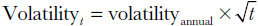

<!-- 原 EPUB 中此公式为图片，已原样保留 -->

<!-- source:block 8b8639a47a466b42 -->

> [!quote]- English 45
> Traders typically calculate volatility for an underlying contract by observing price changes at regular intervals. Let’s begin by assuming that we plan to observe price changes at the end of every day. Because there are 365 days in a year, it might seem that prices can change 365 times per year. In this text, though, we are focusing primarily on exchange-traded contracts. Because most exchanges are closed on weekends and holidays, if we observe the price of an underlying contract at the end of every day, prices cannot really change 365 times per year. Depending on the exchange, there are probably somewhere between 250 and 260 trading days in a year.3 Because we need the square root of the number of trading days, for convenience, many traders assume that there are 256 trading days in a year given that the square root of 256 is a whole number, 16. If we make this assumption, then

交易员通常按固定间隔观察价格变动，以计算标的合约的波动率。先假设我们每天收盘时观察一次价格。虽然一年有365天，但本书主要讨论交易所交易合约；大多数交易所在周末和节假日休市，因此价格实际上不会每年变动365次。视交易所而定，一年通常约有250至260个交易日。[^ovp06-3]由于换算时要对交易日数开平方，为计算方便，许多交易员假定一年有256个交易日，因为√256恰好等于16。于是：

<!-- source:block 745c6bf4ca905c22 -->

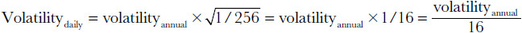

<!-- 原 EPUB 中此公式为图片，已原样保留 -->

<!-- source:block a4eb852410dccf73 -->

> [!quote]- English 46
> To approximate a daily standard deviation, we can divide the annual volatility by 16.

因此，可用年化波动率除以16来估算日标准差。

<!-- source:block f9df76031c2ef510 -->

> [!quote]- English 47
> Returning to our contract trading at 100 with a volatility of 20 percent, what is a one standard deviation price change from one day to the next? The answer is 20%/16 = 1¼%, so a one standard deviation daily price change is 1¼% × 100 = 1.25. We expect to see a price change of 1.25 or less approximately two trading days out of every three and a price change of 2.50 or less approximately 19 trading days out of every 20. Only one day in 20 would we expect to see a price change of more than 2.50.

回到价格为100、年化波动率为20%的合约。相邻两个交易日之间，一个标准差对应多大的价格变动？日标准差为20% ÷ 16 = 1¼%，所以一个日标准差对应的价格变动为1¼% × 100 = 1.25。预计每三个交易日约有两个交易日的价格变动绝对值不超过1.25；每20个交易日约有19个交易日的价格变动绝对值不超过2.50。换言之，预计每20个交易日约有一个交易日的价格变动绝对值会超过2.50。

<!-- source:block 5a13144799cc4ef5 -->

> [!quote]- English 48
> We can do the same type of calculation for a weekly standard deviation. Now we must ask how many times per year prices can change if we look at prices once a week. There are no complete weeks when no trading takes place, so we must make our calculations using all 52 trading weeks in a year. Therefore,

周标准差可以用同样的方法计算。若每周观察一次价格，就要考虑一年中有多少次周度价格变动。全年不会有一整周完全没有交易，因此计算时采用一年52个交易周。于是：

<!-- source:block fa3d0a6ba82048c9 -->

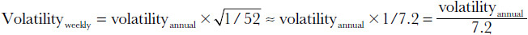

<!-- 原 EPUB 中此公式为图片，已原样保留 -->

<!-- source:block 4ec8fdfedc5da513 -->

> [!quote]- English 49
> To approximate a weekly standard deviation, we can divide the annual volatility by 7.2. Dividing our annual volatility of 20 percent by the square root of 52, or approximately 7.2, we get 20%/7.2 » 2.78. For our contract trading at 100, we would expect to see a price change of 2.78 or less two weeks out of every three, a price change of 5.56 or less 19 weeks out of every 20, and only one week in 20 would we expect to see a price change of more than 5.56.

因此，可用年化波动率除以7.2来估算周标准差。将20%的年化波动率除以√52（约为7.2），得到20% ÷ 7.2 ≈ 2.78%。对于价格为100的合约，预计每三周约有两周的价格变动绝对值不超过2.78；每20周约有19周的价格变动绝对值不超过5.56；每20周约有一周会超过5.56。

<!-- source:block c4e49525c4add0de -->

> [!quote]- English 50
> If we want to be as accurate as possible, when estimating a daily or weekly standard deviation, we ought to begin by calculating the one-day or one-week forward price. But for short periods of time, the forward price is so close to the current price that most traders assume for convenience that a one-day or one-week distribution is centered around the current price.

若要尽可能精确，估算日标准差或周标准差时应先计算一日或一周期限的远期价格。不过，在这么短的期限内，远期价格通常与现价非常接近，因此多数交易员为方便起见，会假定日度或周度分布以当前价格为中心。

<!-- source:block a13a0e92fa528932 -->

> [!quote]- English 51
> Suppose that a stock is trading at \$45 per share and has an annual volatility of 37 percent. What is an approximate one and two standard deviation price range from one day to the next and from one week to the next? For one day, we can divide the annual volatility by 16 (the square root of 256, the number of trading days in a year)

假设某股票现价为每股45美元，年化波动率为37%。它在一天和一周内的一个、两个标准差价格区间分别是多少？计算日波动率时，可将年化波动率除以16（即一年256个交易日的平方根）：

<!-- source:block 3421d045ed41b73a -->

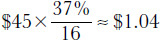

<!-- 原 EPUB 中此公式为图片，已原样保留 -->

<!-- source:block b5c6324eef373c36 -->

> [!quote]- English 52
> A one and two standard deviation daily price range is approximately

因此，一个和两个标准差的日价格区间约为：

<!-- source:block 4e6f6fd4665dee51 -->

> [!quote]- English 53
> \$45 ± \$1.04 ≈ \$43.96 to \$46.04 (one standard deviation)\$45 ± (2 × \$1.04) ≈ \$42.92 to \$47.08 (two standard deviations)

$$
\begin{aligned}
\$45 \pm \$1.04 &\approx \$43.96\text{ 至 }\$46.04 &&\text{（一个标准差）}\\
\$45 \pm (2 \times \$1.04) &\approx \$42.92\text{ 至 }\$47.08 &&\text{（两个标准差）}
\end{aligned}
$$

<!-- source:block 6d0cec5c8a29df65 -->

> [!quote]- English 54
> For one week, we can divide the annual volatility by 7.2 (the square root of 52, the number of trading weeks in a year)

计算周波动率时，可将年化波动率除以7.2（即一年52个交易周的平方根）：

<!-- source:block d47f6e85412cec58 -->

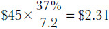

<!-- 原 EPUB 中此公式为图片，已原样保留 -->

<!-- source:block 81a32edc1277cf09 -->

> [!quote]- English 55
> A one and two standard deviation weekly price range is approximately

因此，一个和两个标准差的周价格区间约为：

<!-- source:block 4d3983884723469b -->

> [!quote]- English 56
> \$45 ± \$2.31 ≈ \$42.69 to \$47.31 (one standard deviation)\$45 ± (2 × \$2.31) ≈ \$40.38 to \$49.62 (two standard deviations)

$$
\begin{aligned}
\$45 \pm \$2.31 &\approx \$42.69\text{ 至 }\$47.31 &&\text{（一个标准差）}\\
\$45 \pm (2 \times \$2.31) &\approx \$40.38\text{ 至 }\$49.62 &&\text{（两个标准差）}
\end{aligned}
$$

<!-- source:block dfeaf4a5061d9704 -->

> [!quote]- English 57
> When we scale volatility for time, the same probabilities still apply. Approximately 68 percent of the occurrences will fall within one standard deviation. Approximately 95 percent of the occurrences will fall within two standard deviations.

按时间尺度换算波动率后，标准差对应的概率不变：约68%的结果落在一个标准差以内，约95%的结果落在两个标准差以内。

<!-- source:block 2614977bdeaebc0e -->

## 波动率与观察到的价格变化 / Volatility and Observed Price Changes

<!-- source:block a0c8106e0c3f7327 -->

> [!quote]- English 58
> Why might a trader want to estimate daily or weekly price changes from an annual volatility? Volatility is the one input into a theoretical pricing model that cannot be directly observed. Yet many option strategies, if they are to be successful, require a reasonable assessment of volatility. Therefore, an option trader needs some method of determining whether his expectations about volatility are being realized in the marketplace. Unlike directional strategies, whose success or failure can be immediately observed from current prices, there is no such thing as a current volatility. A trader must usually determine for himself whether he is using a reasonable volatility input into the theoretical pricing model.

为什么交易员想要根据年度波动率估计每日或每周的价格变化？波动率是理论定价模型中无法直接观察的一个输入。然而，许多期权策略如果要成功，就需要对波动率进行合理的评估。因此，期权交易员需要某种方法来确定他对波动率的预期是否正在市场上实现。与方向性策略不同，方向性策略的成功或失败可以立即从当前价格中观察到，不存在当前波动率这样的东西。交易员通常必须自己确定他是否在理论定价模型中使用了合理的波动率输入。

<!-- source:block bbaee8fe62229563 -->

> [!quote]- English 59
> Previously, we estimated that for a \$45 stock with an annual volatility of 37 percent, a one standard deviation price change is approximately \$1.04. Suppose that over five days we observe the following daily settlement price changes:

此前，我们估计，对于一只45美元、年波动率为37%的股票，一个标准差的价格变化约为1.04美元。假设在五天内我们观察到以下每日结算价格变化：

<!-- source:block 764723da4f04ed86 -->

> [!quote]- English 60
> +\$0.98, –\$0.65, –\$0.70, +\$0.25, –\$0.85

$$
+\$0.98, -\$0.65, -\$0.70, +\$0.25, -\$0.85
$$

<!-- source:block 514a72e2a3f7ab1d -->

> [!quote]- English 61
> Are these price changes consistent with a 37 percent volatility?

这些价格变化是否与37%的波动率一致？

<!-- source:block 8ea318a822be1f27 -->

> [!quote]- English 62
> We expect to see a price change of more than \$1.04 (one standard deviation) about one day in three. Over five days, we would expect to see at least one day, and perhaps two days, with a price change greater than one standard deviation. Yet, during this five-day period, we did not see a price change greater than \$1.04 even once. What conclusions can be drawn from this? One thing seems clear: these five price changes do not appear to be consistent with a 37 percent volatility.

我们预计大约三分之一的价格变化超过1.04美元（一个标准差）。在五天内，我们预计至少会看到一天，甚至两天的价格变化大于一个标准差。然而，在这五天的时间里，我们甚至没有看到一次超过1.04美元的价格变化。从中可以得出哪些结论？有一件事似乎很清楚：这五个价格变化似乎与37%的波动率不一致。

<!-- source:block db172d1117238a4c -->

> [!quote]- English 63
> Before making any decisions, we ought to consider any unusual conditions that might be affecting the observed price changes. Perhaps this was a holiday week, and as such, it did not reflect normal market activity. If this is our conclusion, then 37 percent may still be a reasonable volatility estimate. On the other hand, if we can see no logical reason for the market being less volatile than predicted by a 37 percent volatility, then we may simply be using the wrong volatility. If we come to this conclusion, perhaps we ought to consider using a lower volatility that is more consistent with the observed price changes. If we continue to use a volatility that is not consistent with the actual price changes, then we have the wrong volatility. If we have the wrong volatility, we have the wrong probabilities. And if we have the wrong probabilities, we are generating incorrect theoretical values, thereby defeating the purpose of using a theoretical pricing model in the first place.

在做出任何决定之前，我们应该考虑可能影响观察到的价格变化的任何异常情况。也许这是假期周，因此，它并没有反映正常的市场活动。如果这是我们的结论，那么37%可能仍然是一个合理的波动率估计。另一方面，如果我们看不到市场波动率低于37%的预测波动率的逻辑原因，那么我们可能只是使用了错误的波动率。如果我们得出这个结论，也许我们应该考虑使用与观察到的价格变化更一致的较低波动率。如果我们继续使用与实际价格变化不一致的波动率，那么我们的波动率就错误了。如果我们有错误的波动率，我们就有错误的概率。如果我们有错误的概率，我们就会产生错误的理论值，从而首先违背使用理论定价模型的目的。

<!-- source:block b365295cb17ea424 -->

> [!quote]- English 64
> Admittedly, five days is a very small number of price changes, and it is unlikely that a trader will rely heavily on such a small sample. If we flip a coin five times and it comes up heads each time, we may not be able to draw any definitive conclusions. But if we flip the coin 50 times and it comes up heads every time, now we might conclude that there is something wrong with the coin. In the same way, most traders prefer to see larger price samplings, perhaps 20 days, or 50 days, or 100 days, before drawing any dramatic conclusions about volatility.

诚然，五天只是极少数的价格变化，交易者不太可能严重依赖如此小的样本。如果我们抛硬币五次，每次都是正面的，我们可能无法得出任何明确的结论。但如果我们将硬币抛50次，每次硬币都朝上，那么现在我们可能会得出结论，硬币有问题。同样，大多数交易员更喜欢看到更大的价格抽样，也许是20天、50天或100天，然后再得出有关波动率的任何戏剧性结论。

<!-- source:block 3694e3025d43121e -->

> [!quote]- English 65
> Exactly what volatility is associated with the five price changes in the foregoing example? Without doing some rather involved arithmetic, it is difficult to say. (The answer is actually 27.8 percent.) However, if a trader has some idea of the price changes he expects, he can easily see that the changes over the five-day period are not consistent with a 37 percent volatility.4

上述五次价格变动究竟对应多大的波动率？如果不做一番较复杂的计算，很难直接回答（实际答案是27.8%）。不过，只要交易员大致知道给定波动率下应当出现怎样的价格变动，就很容易看出这五天的变动与37%的波动率并不相符。[^ovp06-4]

<!-- source:block 52c2b3f440d1e2bd -->

> [!quote]- English 66
> We have used the phrase *price change* in conjunction with our volatility estimates. Exactly what do we mean by this? Do we mean the high/low during some period? Do we mean open-to-close price changes? Or is there another interpretation? Although various methods have been suggested to estimate volatility, the most common method for exchange-traded contracts has been to calculate volatility based on settlement-to-settlement price changes. Using this approach, when we say that a one standard deviation daily price change is \$1.04, we mean \$1.04 from one day’s settlement price to the next day’s settlement price. The high/low or open/close price range may have been either more or less than this amount, but it is the settlement-to-settlement price change on which we focus.5

我们在波动率估计中使用了价格变化一词。我们到底是什么意思？我们是指某段时间内的高/低吗？我们是指开盘至收盘价格变化吗？或者还有其他解释？尽管人们建议使用各种方法来估计波动率，但交易所交易合约最常见的方法是根据结算至结算价格变化计算波动率。使用这种方法，当我们说每日价格变化一个标准差为1.04美元时，我们的意思是从一天的结算价到第二天的结算价为1.04美元。高/低或开盘/收盘价格范围可能高于或低于这个金额，但我们关注的是结算至结算价格的变化。[^ovp06-5]

<!-- source:block af7960f7b4381cfc -->

## 关于利率产品的说明 / A Note on Interest-Rate Products

<!-- source:block 6b89f611d9566525 -->

> [!quote]- English 67
> For some interest-rate products, primarily Eurocurrency interest-rate futures, the listed contract price represents the interest rate associated with that contract, expressed as a whole number, subtracted from 100.6 If the London Interbank Offered Rate (LIBOR), the interest paid on dollar deposits outside the United States, is 7.00 percent, the associated Eurodollar futures contract traded at the Chicago Mercantile Exchange will be trading at 100 – 7.00 = 93.00. If Euro Interbank Offered Rate (Euribor), the interest paid on euro deposits outside the European Economic Union, is 4.50 percent, the associated Euribor futures contract traded at the London International Financial Futures Exchange will be trading at 100 – 4.50 = 95.50. Volatility calculations for these contracts are done using the rate associated with the contract (the *rate volatility*) rather than the price of the contract (the *price volatility*).

某些利率产品——主要是欧洲货币利率期货——采用“100减去合约对应利率”的方式报价，利率以百分数表示。[^ovp06-6]例如，若伦敦银行同业拆借利率（LIBOR，即美国境外美元存款的利率）为7.00%，芝加哥商品交易所的欧洲美元期货报价就是100 − 7.00 = 93.00。若欧元银行同业拆借利率（Euribor，即欧洲经济联盟境外欧元存款的利率）为4.50%，伦敦国际金融期货交易所的Euribor期货报价就是100 − 4.50 = 95.50。计算此类合约的波动率时，采用的是合约对应利率的变动，即“利率波动率”，而不是合约报价本身的“价格波动率”。

<!-- source:block 7635dd4ae6d7aeec -->

> [!quote]- English 68
> If a Eurodollar futures contract is trading at 93.00 with a volatility of 26 percent, an approximate daily and weekly one standard deviation price change is

若欧洲美元期货报价为93.00，利率波动率为26%，则一个标准差对应的日度和周度价格变动约为：

<!-- source:block 2b86e22a0160b40d -->

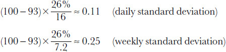

<!-- 原 EPUB 中此公式为图片，已原样保留 -->

<!-- source:block 96842f6f56120b3b -->

> [!quote]- English 69
> To be consistent, if we index Eurodollar futures prices from 100, we must also index exercise prices from 100. Therefore, a 93.00 exercise price in our pricing model is really a 7.00 percent (100 – 93.00) exercise price. This transformation also requires us to reverse the type of option, changing calls to puts and puts to calls. To see why, consider a 93.00 call. For this call to go into the money, the underlying contract must rise above 93.00. But this requires that interest rates fall below 7.00 percent. Therefore, a 93.00 call in listed terms is the same as a 7.00 percent put in interest-rate terms. A model that is correctly set up to evaluate options on Eurodollar or other types of indexed interest-rate contracts will make this transformation automatically. The price of the underlying contract and the exercise price are subtracted from 100, with listed calls treated as puts and listed puts treated as calls.

为保持一致，既然欧洲美元期货价格以100为基准换算，行权价也必须作同样处理。因此，报价中的93.00行权价，在定价模型中实际上对应7.00%的利率行权水平（100 − 93.00）。这种换算还会颠倒期权类型：看涨期权要转为看跌期权，看跌期权则转为看涨期权。以93.00看涨期权为例，它要进入价内，标的期货必须升至93.00以上，也就意味着利率必须降至7.00%以下。因此，按挂牌报价表示的93.00看涨期权，等价于按利率表示的7.00%看跌期权。正确配置的欧洲美元及其他指数化利率合约期权定价模型会自动完成这种换算：用100分别减去标的报价和行权价，并把挂牌看涨期权按看跌期权处理、挂牌看跌期权按看涨期权处理。

<!-- source:block 0de50028e1d39c95 -->

> [!quote]- English 70
> This type of transformation is not required for most bonds and notes. Depending on the coupon rate, the prices of these products may range freely without upper limit, often exceeding 100. Exchange-traded options on bond and note futures are therefore most often evaluated using a traditional pricing model. However, interest-rate products present other problems that may require specialized pricing models.

大多数债券和票据不需要这种类型的转换。根据票息率的不同，这些产品的价格可以自由浮动，没有上限，通常超过100。因此，债券和票据期货的交易所交易期权最常使用传统定价模型进行评估。然而，利率产品也存在其他问题，可能需要专门的定价模型。

<!-- source:block 9bcd81c0a1869876 -->

> [!quote]- English 71
> It is possible to take an instrument such as a bond and calculate the current yield based on its price in the marketplace. If we were to take a series of bond prices and from these calculate a series of yields, we could calculate the *yield volatility*, that is, the volatility based on the change in yield. We might then use this number to evaluate the theoretical value of an option on the bond, although to be consistent we would also have to specify the exercise price in terms of yield. Because it is possible to calculate the volatility of an interest-rate product using these two different methods, interest-rate traders usually make a distinction between yield volatility (the volatility calculated from the current yield on the instrument) and price volatility (the volatility calculated from the price of the instrument in the marketplace).

可以采用债券等工具并根据其在市场上的价格计算当前收益率。如果我们取一系列债券价格并从中计算一系列收益率，我们就可以计算收益率波动率，即基于收益率变化的波动率。然后，我们可能会使用这个数字来评估债券期权的理论价值，尽管为了保持一致，我们还必须以收益率来指定行权价。由于可以使用这两种不同的方法计算利率产品的波动率，因此利率交易员通常会区分收益率波动率（根据工具当前收益率计算的波动率）和价格波动率（根据市场上工具的价格计算的波动率）。

<!-- source:block 4db17320af8ee6b0 -->

## 对数正态分布 / Lognormal Distributions

<!-- source:block e66d84c151779bb7 -->

> [!quote]- English 72
> Thus far we have assumed that the prices of an underlying instrument are normally distributed. Is this a reasonable assumption? Beyond the question of the exact distribution of prices in the real world, the normal distribution assumption has one serious flaw. A normal distribution is symmetrical. For every possible upward move in the price of an underlying instrument, there must be the possibility of a downward move of equal magnitude. If we allow for the possibility of a \$50 contract rising \$75 to \$125, we also must allow for the possibility of the contract dropping \$75 to a price of –\$25. But negative prices are clearly not possible for traditional stocks or commodities.

到目前为止，我们一直假设标的工具的价格服从正态分布。这个假设合理吗？姑且不论现实中的价格究竟服从何种分布，正态分布假设本身就有一个严重缺陷：正态分布是对称的，价格每一种可能的上涨幅度，都必须对应同等幅度的下跌可能。若允许价格为50美元的合约上涨75美元至125美元，就也必须允许它下跌75美元至−25美元。但对传统股票和商品而言，负价格显然不可能出现。

<!-- source:block 17219c201fbfbbc7 -->

> [!quote]- English 73
> We have defined volatility in terms of the percent changes in the price of an underlying instrument. In this sense, an interest rate and volatility are similar in that they both represent a *rate of return*. The primary difference between interest and volatility is that interest accrues only at a positive rate, whereas volatility is a combination of positive and negative rates of return. If we invest money at a fixed interest rate, the value of the principal will always grow. However, if we invest in an underlying instrument with a volatility other than zero, the instrument may go up or down in price, resulting in either a profit (a positive rate of return) or a loss (a negative rate of return).

我们以标的工具价格的百分比变动来定义波动率。从这个角度看，利率与波动率颇为相似，因为两者都表示一种收益率。主要区别是：利息只按正收益率累积，而波动率同时包含正、负收益率。以固定利率投资时，本金会持续增长；投资于波动率不为零的标的工具时，价格既可能上涨也可能下跌，从而产生盈利（正收益率）或亏损（负收益率）。

<!-- source:block e7ec76a4bf465740 -->

> [!quote]- English 74
> A rate-of-return calculation must specify not only the rate that is being used but also the time intervals over which the returns are calculated. Suppose that we invest \$1,000 for one year at an annual interest rate of 12 percent. How much will we have at the end of one year? The answer depends on how the 12 percent interest on our investment is paid out.

计算收益率时，不仅要说明采用的利率，还必须说明计息间隔。假设以12%的年利率投资1,000美元一年，年末会有多少钱？答案取决于这12%的利息以何种频率支付并复利。

<!-- source:block 14aa5e3940addb82 -->

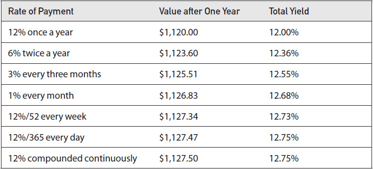

<!-- source:block 2e99e143c708c634 -->

> [!quote]- English 75
> As interest is paid more frequently, even though it is paid at the same rate of 12 percent per year, the total yield on the investment increases. The yield is greatest when interest is paid continuously. In this case, it is just as if interest is paid at every possible moment in time.

即使名义年利率始终为12%，付息并复利的频率越高，投资的总收益率也越高。连续复利时收益率最高，相当于在每一个瞬间都进行计息。

<!-- source:block b094fdba5009ab98 -->

> [!quote]- English 76
> Although less common, we can do the same type of calculation using a negative interest rate. For example, suppose that we make a bad investment of \$1,000 and lose money at a rate of 12 percent annually (interest rate = –12%). How much will we have at the end of a year? The answer, again, depends on the frequency at which our losses accrue.

虽然不太常见，同样的计算也可以用于负利率。假设一笔1,000美元的投资每年亏损12%（利率 = −12%），一年后还剩多少？答案同样取决于亏损以何种频率复合。

<!-- source:block f7c3269b7a533dd6 -->

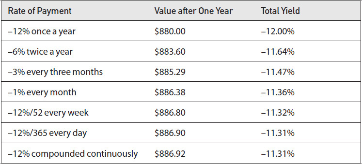

<!-- source:block 3c57e5676eab4077 -->

> [!quote]- English 77
> In the case of a negative interest rate, as losses are compounded more frequently, even though at the same rate of –12 percent per year, the smaller the total loss, and consequently, the smaller the negative yield.

在负利率情形下，即使名义年利率同为−12%，亏损复合得越频繁，一年后的总亏损反而越小，相应的实际负收益率也越小。

<!-- source:block b534174594435019 -->

> [!quote]- English 78
> In the same way that interest can be compounded at different intervals, volatility can also be compounded at different intervals. The Black-Scholes model is a *continuous-time* model. The model assumes that volatility is compounded continuously, just as if the price changes in the underlying contract, either up or down, are taking place continuously but at an annual rate corresponding to the volatility associated with the contract. When the percent price changes are normally distributed, the continuous compounding of these price changes will result in a *lognormal distribution* of prices at expiration. Such a distribution is shown in Figure 6-7. The entire distribution is skewed toward the upside because upside price changes (a positive rate of return) will be greater, in absolute terms, than downside price changes (a negative rate of return). In our interest-rate example, a continuously compounded rate of return of +12 percent yields a profit of \$127.50 after one year, whereas a continuously compounded rate of return of –12 percent yields a loss of only \$113.08. If the 12 percent is a volatility, then a one standard deviation upward price change at the end of one year is +\$127.50, whereas a one standard deviation downward price change is –\$113.08. Even though the rate of return is a constant 12 percent, the continuous compounding of 12 percent yields different upward and downward moves.

正如利息可以按不同间隔复利，价格收益率也可以按不同间隔复合。Black–Scholes模型是连续时间模型，假定标的合约的价格变动持续发生，并按与合约波动率相对应的年化速率连续复合。若百分比价格变动服从正态分布，连续复合后，到期价格便服从对数正态分布，如图6-7所示。整个分布向上偏斜，因为以绝对金额衡量，正收益率造成的上涨会大于同幅度负收益率造成的下跌。以上述1,000美元投资为例，连续复合收益率+12%一年产生127.50美元利润，而−12%只产生113.08美元亏损。若12%代表波动率，则一年期一个标准差的向上价格变动为+127.50美元，向下价格变动为−113.08美元。收益率幅度虽同为12%，连续复合后的上涨额和下跌额却不同。

<!-- source:block d1cee788df072a35 -->

*图6-7 / Figure 6-7*

<!-- source:block 52fc92b045b7c668 -->

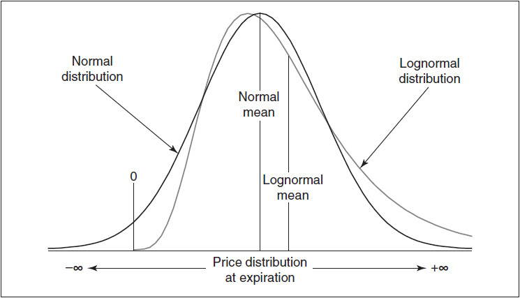

<!-- source:block c696440d613405c2 -->

> [!quote]- English 80
> Note also the location of the mean of the distributions in Figure 6-7. The mean can be thought of as the “balance point” of the distribution. For a normal distribution, the peak of the distribution, or *mode*, and the mean have the same location, exactly in the middle of the distribution. But in a lognormal distribution the right tail, which is open-ended, is longer than the left tail, which is bounded by zero. Because there is more “weight” to the right of the peak, the mean of the lognormal distribution must be located to the right of the peak.

还要注意图6-7中均值的位置。均值可理解为分布的“平衡点”。在正态分布中，分布峰值（即众数）与均值重合，正好位于分布中央。对数正态分布则不同：没有上界的右尾长于以零为下界的左尾。由于峰值右侧的“权重”更大，其均值必然位于峰值右侧。

<!-- source:block c4469c66d5c158ab -->

> [!quote]- English 81
> Continuous rates of return can be calculated using the exponential function,7 denoted by either exp(*x*) or *ex*. In the preceding examples,

连续复合收益率可以用指数函数计算，[^ovp06-7]记作 $\exp(x)$ 或 $e^x$。在前面的例子中：

<!-- source:block ae9dd4b72505c788 -->

> [!quote]- English 82
> \$1,000 × *e*0.12 = \$1,127.50 and \$1,000 × *e*–0.12 = \$886.92

$$
\$1{,}000 \times\,e^{0.12} = \$1{,}127.50 \text{and} \$1{,}000 \times\,e^{-0.12} = \$886.92
$$

<!-- source:block c73c0046fa6cc7b5 -->

> [!quote]- English 83
> No matter how large the negative interest rate, continuous compounding precludes the possibility of an investment falling below zero because it is impossible to lose more than 100 percent of an investment. Consequently, in a log-normal distribution, the value of the underlying instrument is bounded by zero on the downside. Clearly, this is a more realistic representation of the real world than a normal distribution.

无论负利率的绝对值多大，连续复利都不会使投资价值跌破零，因为损失不可能超过本金的100%。因此，在对数正态分布中，标的工具价格的下界是零。显然，这比允许负价格的正态分布更贴近现实。

<!-- source:block 9221448c751e6161 -->

> [!quote]- English 84
> We can see the effect of using a lognormal distribution rather than a normal distribution by considering the value of a 90 put and 110 call with a forward price of 100 for the underlying contract with six months to expiration and a volatility of 30 percent

比较正态分布与对数正态分布的影响，可以考察以下例子：标的合约远期价格为100、距到期六个月、波动率为30%，比较90看跌期权与110看涨期权的价值。

<!-- source:block f57063ac12db5577 -->

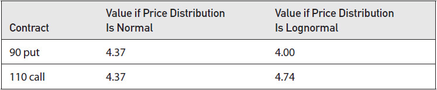

<!-- source:block b394dd7abc43cf9c -->

> [!quote]- English 85
> Under a normal distribution assumption, both the call and put have exactly the same value because they are both 10 percent out of the money. But under the lognormal distribution assumption in the Black-Scholes model, the 110 call will always have a greater value than the 90 put. The value of the 110 call can potentially appreciate without limit because the price of the underlying contract has no limit on the upside. The 90 put, however, can only rise to a maximum value of 90 because the price of the underlying contract can never fall below zero.

在正态分布假设下，这两个期权的价值完全相同，因为它们都处于价外10%。但在Black–Scholes模型采用的对数正态分布假设下，110看涨期权的价值总是高于90看跌期权。原因是标的合约价格的上涨没有上限，110看涨期权的价值理论上也可无限增加；而标的价格不能低于零，因此90看跌期权的价值最高只能达到90。

<!-- source:block 036e3913c0ad68b3 -->

> [!quote]- English 86
> Of course, the values in the preceding example are true only in theory. There is no law that prevents the 90 put from trading at a price greater than the 110 call. Indeed, such price relationships occur in many markets for a variety of reasons that we will discuss later. However, one possible explanation is that the marketplace disagrees with the assumptions on which the model is based. Perhaps the marketplace believes that a lognormal distribution is not an accurate representation of possible prices. And perhaps the marketplace is right!

当然，前面例子中的值仅在理论上成立。没有法律禁止90看跌期权的交易价格高于110看涨期权。事实上，这种价格关系在许多市场上发生，原因多种，我们稍后将讨论。然而，一种可能的解释是，市场不同意该模型所基于的假设。也许市场认为，对数正态分布并不能准确代表可能的价格。也许市场是对的！

<!-- source:block 01456c9bccac0b7f -->

## 解读波动率数据 / Interpreting Volatility Data

<!-- source:block 4022bb678a3e9ecb -->

> [!quote]- English 87
> When traders discuss volatility, even experienced traders may find that they are not always talking about the same thing. When a trader says that the volatility is 25 percent, this statement may take on a variety of meanings. We can avoid confusion in subsequent discussions if we define some of the different ways in which traders refer to volatility. We can begin by dividing volatility into two categories—*realized volatility*, which we associate with an underlying contract, and *implied volatility*, which we associate with options.

当交易员讨论波动率时，即使是经验丰富的交易员也可能发现他们并不总是在谈论同一件事。当交易员说波动率为25%时，该说法可能具有多种含义。如果我们定义交易员提及波动率的一些不同方式，我们可以避免随后的讨论中的混乱。我们可以首先将波动率分为两类——已实现波动率（我们将其与标的合约联系起来）和隐含波动率（我们将其与期权联系起来）。

<!-- source:block 5b81e06ec56998cd -->

### 已实现波动率 / Realized Volatility

<!-- source:block 07a92e2da6a18170 -->

> [!quote]- English 88
> The realized volatility is the annualized standard deviation of percent price changes of an underlying contract over some period of time.8 When we calculate realized volatility, we must specify both the interval at which we are measuring the price changes and the number of intervals to be used in the calculations. For example, we might talk about the 50-day volatility of an underlying contract. Or we might talk about the 52-week volatility of a contract. In the former case, we are calculating the volatility from the daily price changes over a 50-day period.9 In the latter case, we are calculating the volatility from the weekly price changes over a 52-week period.

已实现波动率是一段时间内标的合约价格变化百分比的年化标准差。[^ovp06-8]当我们计算已实现波动率时，我们必须指定测量价格变化的间隔以及计算中使用的间隔数。例如，我们可能会谈论标的合约的50天波动率。或者我们可能会讨论合约52周的波动率。在前一种情况下，我们根据50天内的每日价格变化计算波动率。[^ovp06-9]在后一种情况下，我们根据52周内的每周价格变化计算波动率。

<!-- source:block 29f8c6af27b01127 -->

> [!quote]- English 89
> On a graph of realized volatility, each point represents the volatility over a specified period using price changes over a specified interval. If we graph the 50-day volatility of a contract, each point on the graph represents the annualized standard deviation of the daily price changes over the previous 50 days. If we graph the 52-week volatility, each point on the graph represents the annualized standard deviation of the weekly price changes over the previous 52 weeks.

在已实现波动率图表上，每个点使用指定间隔内的价格变化来代表指定时期内的波动率。如果我们绘制合约50天波动率的图表，图表上的每个点都代表过去50天每日价格变化的年化标准差。如果我们绘制52周的波动率，图上的每个点都代表过去52周每周价格变化的年化标准差。

<!-- source:block 55cbe35381adab24 -->

> [!quote]- English 90
> Traders may also refer to realized volatility in the future (*future realized volatility*) and realized volatility in the past (*historical realized volatility*). The future realized volatility is what every trader would like to know—the volatility that best describes the future distribution of price changes for an underlying contract. In theory, it is the future realized volatility over the life of the option that we need to input into a theoretical pricing model. If a trader knows the future realized volatility, he knows the right “odds.” When he feeds this number into a theoretical pricing model, he can generate accurate theoretical values because he has the right probabilities. Like the casino, he may lose in the short run because of bad luck, but in the long run, with the probabilities in his favor, the trader can be reasonably certain of making a profit.

交易员还可以指未来已实现波动率（未来已实现波动率）和过去已实现波动率（历史已实现波动率）。未来已实现波动率是每个交易员都想知道的——最能描述标的合约价格变化未来分布的波动率。理论上，我们需要将期权有效期内的未来已实现波动率输入到理论定价模型中。如果交易者知道未来已实现的波动率，他就知道正确的“赔率”。当他将这个数字输入理论定价模型时，他可以生成准确的理论值，因为他有正确的概率。就像赌场一样，他可能会因为运气不好而在短期内失败，但从长远来看，在对他有利的可能性下，交易者可以相当肯定地获利。

<!-- source:block 8f929f61e5c94e04 -->

> [!quote]- English 91
> Clearly, no one knows what the future holds. However, if a trader intends to use a theoretical pricing model, he must try to make an estimate of future realized volatility. In option evaluation, as in other disciplines, a good starting point is historical data. What typically has been the historical realized volatility of a contract? If, over the past 10 years, the volatility of a contract has never been less than 10 percent nor more than 30 percent, a guess for the future volatility of either 5 or 40 percent hardly makes sense. This does not mean that either of these extremes is impossible. But based on past performance, and in the absence of any extraordinary circumstances, a guess within the historical limits of 10 and 30 percent is probably more realistic than a guess outside these limits. Of course, 10 to 30 percent is still a very wide range. But at least the historical data offers a starting point. Additional information may help to further narrow the estimate.

显然，没有人知道未来会怎样。然而，如果交易者打算使用理论定价模型，他必须尝试对未来已实现的波动率进行估计。与其他学科一样，在期权评估中，历史数据是一个很好的起点。合约的历史已实现波动率通常是多少？如果在过去10年里，合约的波动率从未低于10%或超过30%，那么对未来波动率为5%或40%的猜测就没有意义了。这并不意味着这两种极端都是不可能的。但根据过去的表现，在没有任何特殊情况的情况下，在10%和30%的历史界限内的猜测可能比在这些界限之外的猜测更现实。当然，10%到30%仍然是一个非常广泛的范围。但至少历史数据提供了一个起点。更多信息可能有助于进一步缩小估计范围。

<!-- source:block 34fb61c6f3d4990c -->

> [!quote]- English 92
> As option traders have come to appreciate the importance of volatility as an input into a pricing model, volatility forecasting models have been developed in an attempt to more accurately predict future realized volatility. If a trader has access to a volatility *forecast* that he believes is reliable, he will want to use this forecast to make a better decision as to the future realized volatility. We will put off a discussion of possible forecasting methods until later chapters.

随着期权交易员逐渐认识到波动率作为定价模型输入的重要性，人们开发了波动率预测模型，试图更准确地预测未来实现的波动率。如果交易员能够获得他认为可靠的波动率预测，他就会希望使用该预测来对未来实现的波动率做出更好的决定。我们将推迟到后面的章节讨论可能的预测方法。

<!-- source:block 7a97162e9ad7fce5 -->

> [!quote]- English 93
> When we calculate volatility over a given period of time, we still have a choice of the time intervals over which to measure the price changes in the underlying contract. A trader might consider whether the choice of intervals, even if the intervals cover the same time period, might affect the results. For example, we might look at the 250-day volatility, the 52-week volatility, and the 12-month volatility of a contract. All volatilities cover approximately one year, but one is calculated from daily price changes, one from weekly price changes, and one from monthly price changes.

当我们计算给定时间段内的波动率时，我们仍然可以选择测量标的合约价格变化的时间间隔。交易者可能会考虑间隔的选择（即使间隔涵盖相同的时间段）是否会影响结果。例如，我们可能会考虑合约的250天波动率、52周波动率和12个月波动率。所有波动率大约涵盖一年，但一年是根据每日价格变化计算的，一年是根据每周价格变化计算的，一年是根据每月价格变化计算的。

<!-- source:block 3fae691163e412f3 -->

> [!quote]- English 94
> For most underlying contracts, the interval that is chosen does not seem to greatly affect the result. It is possible that a contract will make large daily moves yet finish the week unchanged. However, this is by far the exception. A contract that is volatile from day to day is likely to be equally volatile from week to week or month to month. Figure 6-8 shows the 250-day realized volatility of the S&P 500 Index from 2003 through 2012, with the volatility calculated from price changes at three different intervals: daily, weekly, and every four weeks. The graphs are not identical, but they do seem to have similar characteristics. There is no clear evidence that using one interval rather than another results in consistently higher or lower volatility.

对于大多数标的合约来说，选择的间隔似乎不会对结果产生很大影响。一份合约可能会在每日大幅变动，但本周结束时保持不变。然而，这是迄今为止的例外。日复一日波动的合约可能每周或每月波动相同。图6-8显示了2003年至2012年标准普尔500指数250天的实际波动率，波动率根据三个不同时间段的价格变化计算：每日、每周和每四周。这些图表并不相同，但它们似乎确实具有相似的特征。没有明确的证据表明使用一个区间而不是另一个区间会导致波动率持续升高或降低。

<!-- source:block c17909e67e6e6b6e -->

*Figure 6-8 S&P 500 Index 250-day historical volatility. / Figure 6-8 S&P 500 Index 250-day historical volatility.*

<!-- source:block e683ed4e91ca34f9 -->

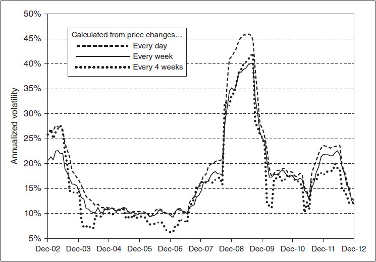

<!-- source:block 54f8336b62e3cf93 -->

### 隐含波动率 / Implied Volatility

<!-- source:block eccd52dd5ed87f76 -->

> [!quote]- English 96
> Unlike realized volatility, which is calculated from price changes in the underlying contract, implied volatility is derived from the price of an option in the marketplace. In a sense, the implied volatility represents the marketplace’s consensus of what the future realized volatility of the underlying contract will be over the life of the option.

与根据标的合约的价格变化计算的已实现波动率不同，隐含波动率来自市场上期权的价格。从某种意义上说，隐含波动率代表了市场对期权有效期内标的合约未来实现的波动率的共识。

<!-- source:block ac4921fa8d51dc0e -->

> [!quote]- English 97
> Consider a three-month 105 call on a stock that pays no dividend. If we are interested in purchasing this call, we might use a pricing model to determine the option’s theoretical value. For simplicity, let’s assume that the option is European (no early exercise) and that we will use the Black-Scholes model. In addition to the exercise price, time to expiration, and type, we also need the price of the stock, an interest rate, and a volatility. Suppose that the current stock price is 98.50, the three-month interest rate is 6.00 percent, and our best estimate of volatility over the next three months is 25 percent. When we feed this data into our model, we find that the option has a theoretical value of 2.94. However, when we check the price of the option in the marketplace, we find that the 105 call is trading very actively at a price of 3.60. How can we account for the fact that we think the option is worth 2.94, but the rest of the world seems to think that it’s worth 3.60?

考虑对不支付股息的股票进行为期三个月的105看涨期权。如果我们有兴趣购买此看涨期权，我们可能会使用定价模型来确定期权的理论价值。为了简单起见，让我们假设该期权是欧洲期权（无需提前行权），并且我们将使用Black-Scholes模型。除了行权价、到期时间和类型外，我们还需要股票价格、利率和波动率。假设当前股价为98.50，三个月利率为6.00%，我们对未来三个月波动率的最佳估计是25%。当我们将这些数据输入到模型中时，我们发现该期权的理论值为2.94。然而，当我们检查市场上期权的价格时，我们发现105看涨期权的交易非常活跃，价格为3.60。我们如何解释这样一个事实：我们认为该期权的价值为2.94，但世界其他地区似乎认为它的价值为3.60？

<!-- source:block 9567215589d272d1 -->

> [!quote]- English 98
> This is not an easy question to answer because there are many forces at work in the marketplace that cannot be easily identified or quantified. But one way we might try to answer the question is by making the assumption that everyone trading the option is using the same theoretical pricing model. If we make this assumption, the cause of the discrepancy must be a difference of opinion about one or more of the inputs into the model. Which inputs are the most likely cause?

这不是一个容易回答的问题，因为市场上有许多无法轻易识别或量化的力量在起作用。但我们试图回答这个问题的一种方法是假设每个交易期权的人都使用相同的理论定价模型。如果我们做出这一假设，那么差异的原因一定是对模型中的一个或多个输入的意见不同。哪些输入是最有可能的原因？

<!-- source:block e6ff298b4a870d29 -->

> [!quote]- English 99
> It’s unlikely to be either the time to expiration or the exercise price because these inputs are fixed in the option contract. What about the underlying price of 98.50? Perhaps we incorrectly estimated the stock price due to the width of the bid-ask spread. However, for most actively traded underlying contracts, it is unlikely that the spread will be wide enough to cause a discrepancy of 0.66 in the value of the option. In order to yield a value of 3.60 for the 105 call, we would actually have to raise the stock price to 100.16, and this is almost certainly well outside the bid-ask spread for the stock.

它不太可能是到期时间或行权价，因为这些输入在期权合约中是固定的。那么98.50美元的标的价格呢？也许我们错误地估计了股票价格，因为买卖价差的宽度。然而，对于大多数交易活跃的标的合约，价差不太可能大到足以导致期权价值出现0.66的差异。为了使105看涨期权的价值达到3.60，我们实际上必须将股价提高到100.16，而这几乎肯定远远超出了股票的买卖价差。

<!-- source:block 131c9d5b4d4b62ab -->

> [!quote]- English 100
> Perhaps our problem is the interest rate of 6.00 percent. But interest rates are usually the least important of the inputs into a theoretical pricing model. In fact, we would have to make a huge change in the interest-rate input, from 6.00 to 13.30 percent, to yield a theoretical value of 3.60.

也许我们的问题是6.00%的利率。但利率通常是理论定价模型的输入中最不重要的。事实上，我们必须对利率输入进行巨大改变，从6.00%改为13.30%，才能得出3.60的理论值。

<!-- source:block 57c7103020c12f48 -->

> [!quote]- English 101
> This leaves us with one likely cause for the discrepancy—the volatility. In a sense, the marketplace seems be using a volatility that is different from 25 percent. To determine what volatility the marketplace is using, we can ask the following question: if we hold all other inputs constant (i.e., time to expiration, exercise price, underlying price, and interest rates), what volatility must we feed into our model to yield a theoretical value equal to the price of the option in the marketplace? In our example, we want to know what volatility will yield a value of 3.60 for the 105 call. Clearly, the volatility has to be higher than 25 percent, so we might begin to raise the volatility input into our model. If we do, we find that at a volatility of 28.50 percent, the 105 call has a theoretical value of 3.60. The implied volatility of the 105 call—the volatility being implied to the underlying contract through the pricing of the option in the marketplace—is 28.50 percent.

这给我们留下了造成差异的一个可能原因——波动率。从某种意义上说，市场似乎使用了与25%不同的波动率。为了确定市场使用的波动率，我们可以问以下问题：如果我们保持所有其他输入不变（即，到期时间、行权价、标的价格和利率），我们必须将什么波动率输入到我们的模型中才能产生等于市场上期权价格的理论值？在我们的例子中，我们想知道105看涨的波动率将产生3.60的值。显然，波动率必须高于25%，因此我们可能会开始提高模型中的波动率输入。如果我们这样做，我们会发现，在波动率为28.50%时，105看涨期权的理论值为3.60。105看涨期权的隐含波动率（通过市场期权定价隐含于标的合约的波动率）为28.50%。

<!-- source:block 5284524ecc5da0a0 -->

*图6-9 / Figure 6-9*

<!-- source:block d4ce870e5da8b06b -->

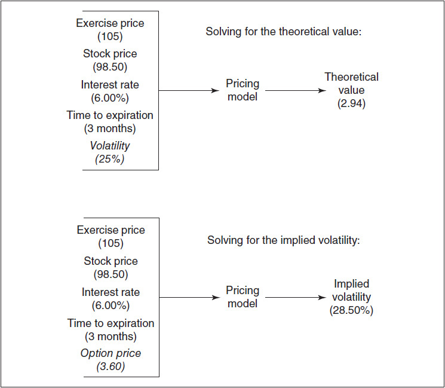

<!-- source:block f75010e11ec154c7 -->

> [!quote]- English 103
> When we solve for the implied volatility of an option, we are assuming that the theoretical value (the option’s price), as well as all other inputs except volatility, are known. In effect, we are running the theoretical pricing model backwards to solve for the unknown volatility. In practice, this is easier said than done because most theoretical pricing models do not work in reverse. However, there are a number of relatively simple algorithms that can quickly solve for the implied volatility when all other inputs are known.

当我们求解期权的隐含波动率时，我们假设理论值（期权的价格）以及除波动率之外的所有其他输入都是已知的。实际上，我们正在反向运行理论定价模型来解决未知的波动率。在实践中，这说起来容易做起来难，因为大多数理论定价模型不会反向工作。然而，有许多相对简单的算法可以在所有其他输入已知时快速求解隐含波动率。

<!-- source:block 61c57da91d92a4b1 -->

> [!quote]- English 104
> Implied volatility depends not only on the inputs into the theoretical pricing model but also on the theoretical pricing model being used. For some options, different models can yield significantly different implied volatilities. Problems can also arise when the inputs are not contemporaneous. If an option has not traded for some time and market conditions have changed, using an outdated option price will result in a misleading or inaccurate implied volatility. Suppose in our example that the price of 3.60 for the 105 call reflected the last trade, but that trade took place two hours ago when the underlying stock price was actually 99.25. At a stock price of 99.25, the implied volatility of the option, at a price of 3.60, is actually 26.95 percent. This underscores the importance of accurate and contemporaneous inputs when calculating implied volatilities.

隐含波动率不仅取决于定价模型的各项输入，也取决于所采用的模型本身。对某些期权，不同模型可能给出显著不同的隐含波动率。各项输入若不是同一时点的数据，也会造成问题：如果某期权已有一段时间未成交，而市场状况已经变化，沿用过时的期权价格会得到误导性或不准确的结果。仍以上例为例，假设105看涨期权的3.60是最后成交价，但这笔交易发生在两小时前，当时标的股价其实是99.25；以股价99.25和期权价格3.60计算，隐含波动率实际为26.95%。这说明计算隐含波动率时，输入数据必须准确且时间同步。

<!-- source:block ee900e024d12b45c -->

> [!quote]- English 105
> Brokerage firms and data vendors who provide option analysis for their clients will typically include implied volatility data. The data may incorporate implied volatilities for every option on an underlying contract, or the data may be in the form of one implied volatility that is representative of options on a particular underlying market. In the latter case, the single implied volatility is usually the result of weighting the individual implied volatilities by some criteria, such as volume of options traded or open interest, or, as is most common, by assigning the greatest weight to the at-the-money options.

为客户提供期权分析的券商和数据供应商通常也会提供隐含波动率数据。这些数据可能包含某一标的合约上每个期权各自的隐含波动率，也可能只给出一个能够代表特定标的市场期权的综合隐含波动率。在后一种情况下，这个单一数值通常是按照某项标准对各期权的隐含波动率加权所得，例如期权成交量或未平仓量；最常见的做法是给予平值期权最高权重。

<!-- source:block 6eee6105e375ab94 -->

> [!quote]- English 106
> Implied volatility in the marketplace is constantly changing because option prices, as well as other market conditions, are constantly changing. It is as if the marketplace were continuously polling all the participants to come up with a consensus volatility for the underlying contract for each expiration. This is not a poll in the true sense because the traders do not confer with each other and then vote on the correct volatility. However, as bids and offers are made, the price at which an option is trading will represent an equilibrium between supply and demand. This equilibrium can be expressed as an implied volatility.

市场隐含波动率不断变化，因为期权价格和其他市场条件也在不断变化。这仿佛是市场持续汇总所有参与者的判断，为标的合约的每个到期日形成一个共识波动率。当然，这不是真正的投票：交易员并不会先彼此商议，再表决哪个波动率正确。但随着买价和卖价不断进入市场，期权成交价会体现供需均衡，而这种均衡可以用隐含波动率来表达。

<!-- source:block a1d8b01ac9d7d2d6 -->

> [!quote]- English 107
> While the term *premium* really refers to an option’s price, because the implied volatility is derived from an option’s price, traders sometimes use premium and implied volatility interchangeably. If the current implied volatility is high by historical standards or high relative to the recent historical volatility of the underlying contract, a trader might say that premium levels are high; if implied volatility is unusually low, he might say that premium levels are low.

虽然溢价一词实际上是指期权的价格，但由于隐含波动率源自期权的价格，因此交易员有时互换使用溢价和隐含波动率。如果当前隐含波动率按历史标准来看很高，或者相对于标的合约最近的历史波动率较高，交易员可能会说溢价水平很高;如果隐含波动率异常低，他可能会说溢价水平很低。

<!-- source:block 1c8702280e01468d -->

> [!quote]- English 108
> New option traders are taught, quite sensibly, to sell overpriced options and buy underpriced options. By selling options at prices higher than theoretical value or buying options at prices lower than theoretical value, a trader creates a positive theoretical edge. But how should a trader determine the degree to which an option is overpriced or underpriced? This sounds like an easy question to answer. Isn’t the amount of the mispricing equal to the difference between the option’s price and its value? The question arises because there is more than one way to measure this difference. Returning to our example of the 105 call, we might say that with a theoretical value of 2.94 and a price of 3.60, the 105 call is 0.66 overpriced. But in volatility terms the option is 3.50 volatility points overpriced because its theoretical value is based on a volatility of 25 percent (our volatility estimate), while its price is based on a volatility of 28.50 percent (the implied volatility). Given the unusual characteristics of options, it is often more useful for a trader to consider an option’s price in terms of implied volatility rather than total points.

新手通常会接受一条很合理的原则：卖出高估的期权，买入低估的期权。以高于理论价值的价格卖出，或以低于理论价值的价格买入，便能建立正的理论优势。但期权究竟高估或低估了多少？看似只要计算市场价格与理论价值之差即可，问题在于这个差异可以用不止一种方式衡量。回到105看涨期权的例子：其理论价值为2.94、市场价格为3.60，可以说它高估了0.66个价格点；若用波动率表示，它则高估了3.50个波动率点，因为理论价值采用25%的波动率估计，而市场价格对应28.50%的隐含波动率。鉴于期权的特殊性质，以隐含波动率而非绝对价格点来评价期权价格，往往更有用。

<!-- source:block 4da16fa342c8007e -->

> [!quote]- English 109
> Implied volatility is often used by traders to compare the relative pricing of options. In our example, the 105 call is trading at 3.60 with an implied volatility of 28.50 percent. Suppose that a 100 call under the same conditions is trading at 5.40. In total points, the 100 call is clearly more expensive than the 105 call (5.40 versus 3.60). But if, at a price of 5.40, the 100 call has an implied volatility of 27.51 percent, most traders will conclude that in theoretical terms the 100 call is almost a full percentage point less expensive (27.51 percent versus 28.50 percent) than the 105 call. Traders, in fact, talk about implied volatility as if it were the price of an option. A trader who buys the 100 call at a price of 5.40 might say that she bought the call at 27.51 percent. A trader who sells the 105 call at a price of 3.60 might say that he sold the call at 28.50 percent. Of course, options are really bought and sold in the appropriate currency. But from an option trader’s point of view the implied volatility is often a more useful expression of an option’s price than its actual price in currency units.

交易员常用隐含波动率比较期权的相对定价。上例中，105看涨期权价格为3.60，隐含波动率为28.50%。再假设相同条件下的100看涨期权价格为5.40。按绝对价格点看，100看涨期权显然更贵（5.40对3.60）；但若5.40对应的隐含波动率为27.51%，多数交易员会认为，从理论定价角度看，100看涨期权反而比105看涨期权便宜将近一个波动率百分点（27.51%对28.50%）。事实上，交易员谈论隐含波动率时，常把它当作期权的“报价”：以5.40买入100看涨期权的人可能说自己“在27.51%买入”，以3.60卖出105看涨期权的人可能说自己“在28.50%卖出”。期权实际当然仍以相应货币成交，但对期权交易员而言，隐含波动率往往比货币价格更能说明期权的相对贵贱。

<!-- source:block e8d69fe0f890cece -->

> [!quote]- English 110
> Even if the implied volatility of the100 call is 27.51 percent and the implied volatility of the 105 call is 28.50 percent, this does not necessarily mean that a trader ought to buy the 100 call and sell the 105 call. A trader also will need to consider what will happen if his estimate of volatility turns out to be incorrect. If the future realized volatility over the life of the options turns out to be 25 percent, both the 100 call and the 105 call are overpriced, and the sale of either option should, in theory, result in a profit. But what will happen if the trader’s volatility estimate is wrong, and the future realized volatility turns out to be 32 percent? Now the sale of either option will result in a loss. The consequences of being wrong about volatility are an important consideration, and this is something we will look at more closely in subsequent chapters. However, in the absence of other considerations, the lower implied volatility of the 100 call suggests that it is likely to be the better value.

即使100看涨期权的隐含波动率为27.51%，105看涨期权的隐含波动率为28.50%，这并不一定意味着交易者应该买入100看涨期权并卖出105看涨期权。交易者还需要考虑如果他对波动率的估计结果不正确会发生什么。如果期权有效期内的未来已实现波动率为25%，那么100看涨期权和105看涨期权都被高估了，理论上，出售任何一个期权都应该获利。但是，如果交易员对波动率的估计是错误的，而未来的实际波动率是32%，会发生什么呢？现在出售任何一种期权都会导致损失。对波动率的判断错误的后果是一个重要的考虑因素，我们将在后续章节中更仔细地研究这一点。然而，在没有其他考虑的情况下，100看涨期权的较低隐含波动率表明它可能是更好的价值。

<!-- source:block dce4b2cb43b82506 -->

> [!quote]- English 111
> Although option traders may at times refer to any of the various interpretations of volatility, two of these stand out in importance—the future realized volatility and the implied volatility. The future realized volatility of an underlying contract determines the *value* of options on that contract. The implied volatility is a reflection of an option’s *price*. These two numbers, value and price, are what all traders, not just option traders, are concerned with. If a contract has a high value and a low price, a trader will want to be a buyer. If a contract has a low value and a high price, a trader will want to be a seller. For an option trader, this usually means comparing the expected future realized volatility with the implied volatility. If implied volatility is low with respect to the expected future volatility, a trader will prefer to buy options; if implied volatility is high, a trader will prefer to sell options. Of course, future volatility is an unknown, so a trader will look at historical and, if available, forecast volatility to help in making an intelligent guess about the future. In the final analysis, though, it is the future realized volatility that determines an option’s value.

尽管期权交易员有时可能会引用对波动率的各种解释中的任何一种，但其中两种解释非常重要——未来已实现波动率和隐含波动率。标的合约的未来已实现波动率决定该合约期权的价值。隐含波动率反映了期权价格。这两个数字，价值和价格，是所有交易者（而不仅仅是期权交易者）所关心的。如果一份合约价值高、价格低，交易员就会想要成为买家。如果合约价值低、价格高，交易者就会想要成为卖家。对于期权交易者来说，这通常意味着将预期的未来已实现波动率与隐含波动率进行比较。如果隐含波动率相对于预期未来波动率较低，交易员将更愿意购买期权;如果隐含波动率较高，交易员将更愿意出售期权。当然，未来的波动率是一个未知数，因此交易员会查看历史波动率以及（如果有的话）预测波动率，以帮助对未来做出明智的猜测。不过，归根结底，决定期权价值的是未来已实现波动率。

<!-- source:block 075f9abd7b7c2133 -->

> [!quote]- English 112
> A commonly used analogy to help new traders better understand the role of volatility is to think of volatility as being similar to the weather. Suppose that a trader living in Chicago gets up on a July morning and must decide what clothes to wear that day. Will he consider putting on a heavy winter coat? This is probably not a logical choice because he knows that *historically* it is not sufficiently cold in Chicago in July to warrant wearing a winter coat. Next, he might turn on the radio or television to listen to the weather *forecast*. The forecaster is predicting clear skies with very warm temperatures close to 90°F (32°C). Based on this information, the trader has decided that he will wear a short-sleeve shirt and does not need a sweater or jacket. And he certainly won’t need an umbrella. However, just to be sure, he decides to look out the window to see what the people passing in the street are wearing. To his surprise, everyone is wearing a coat and carrying an umbrella. Through their choice of clothing, the people outside are *implying* different weather than the forecast. Given the conflicting information, what clothes should the trader wear? He must make some decision, but whom should he believe, the weather forecaster or the people in the street? There can be no certain answer because the trader will not know the *future* weather until the end of the day. Much will depend on the trader’s knowledge of local conditions. Perhaps the trader lives in an area far removed from where the weather forecaster is located. Then he must give added weight to local conditions.

帮助新手理解波动率作用的一个常见类比，是把波动率比作天气。假设一位住在芝加哥的交易员在七月的早晨起床，要决定当天穿什么。他会穿厚重的冬衣吗？大概不会，因为历史经验表明，芝加哥七月通常没有冷到需要穿冬衣。接着，他打开广播或电视收听天气预报：晴天，气温接近90°F（32°C）。据此，他决定穿短袖，不带毛衣、夹克，当然也不带伞。出门前，他又看了一眼窗外，却惊讶地发现街上的人都穿着外套、拿着雨伞。路人的穿着“隐含”了与天气预报不同的判断。面对相互冲突的信息，他该怎么穿？他必须作出选择，却无法确定该相信预报员还是街上的人，因为只有一天结束后才知道实际天气。答案很大程度上取决于他对当地情况的了解；如果他住的地方离预报站很远，就应当给眼前的本地状况更高权重。

<!-- source:block a79aa03640cd8746 -->

> [!quote]- English 113
> The decision on what clothes to wear, like every trading decision, depends on a great many factors. Not only must the decision be made on the basis of the best available information, but the decision must also be made with consideration for the possibility of error. What are the benefits of being right? What are the consequences of being wrong? If a trader fails to take an umbrella and it rains, this may be of little consequence if the bus picks him up right outside his residence and drops him off right outside his place of work. On the other hand, if he must walk several blocks in the rain, he might become sick and have to miss several days of work. The choices are never easy, and one can only hope to make the decision that will turn out best in the long run.

穿什么衣服与每一项交易决策一样，都取决于许多因素。决策既要依据当时最好的信息，也必须考虑判断错误的可能：判断正确能得到什么，判断错误又要付出什么代价？如果没带伞却下了雨，但公交车能在家门口接他、在公司门口放下，后果也许很轻；若必须冒雨走好几个街区，他却可能因此生病并耽误数日工作。选择从来不容易，只能努力作出长期来看结果最好的决定。

<!-- source:block cc37dd97e7f636a5 -->

> [!quote]- English 114
> Changing our assumptions about volatility can often have a dramatic effect on the value of an option. Figure 6-10 shows the prices, theoretical values, and implied volatilities for several gold options on July 31, 2012. Figure 6-11 focuses specifically on how these values change as we increase volatility from 14 to 18 percent. Looking for the moment at call values, although all the options increase in value, the 1600 call, the at-the-money option, increases the most, rising from 41.65 to 51.60, a total of 9.95. At the same time, the 1800 call shows the greatest increase in percent terms. Its value more than triples from 0.78 to 3.05, a total increase of 291 percent. These are important principles to which we will return later but that are worth stating now:

改变波动率假设，往往会显著改变期权价值。图6-10列出2012年7月31日若干黄金期权的价格、理论价值和隐含波动率；图6-11进一步展示波动率由14%升至18%时，理论价值如何变化。先看各看涨期权：虽然它们的价值都上升了，但平值的1600看涨期权按绝对价格点计算涨幅最大，从41.65升至51.60，增加9.95；1800看涨期权则按百分比计算涨幅最大，其价值从0.78升至3.05，增长291%，超过原来的三倍。这引出两条重要原则，后文还会再次讨论：

<!-- source:block 64306727360ddcfb -->

> [!quote]- English 115
> 1. In total points, a change in volatility will have a greater effect on an at-the-money option than on an equivalent in-the-money or out-of-the-money option.

1. 按绝对价格点衡量，波动率变化对平值期权的影响，大于对其他条件相同的价内或价外期权的影响。

<!-- source:block 7e9b03d40079669e -->

> [!quote]- English 116
> 2. In percent terms, a change in volatility will have a greater effect on an out-of-the-money option than on an equivalent in-the-money or at-the-money option.

2. 按百分比衡量，波动率变化对价外期权的影响，大于对其他条件相同的价内或平值期权的影响。

<!-- source:block a8dedb57dbc0920b -->

*Figure 6-10 Gold eight-week (40 trading days) historical volatility. / Figure 6-10 Gold eight-week (40 trading days) historical volatility.*

<!-- source:block 8ec11e66acfbb597 -->

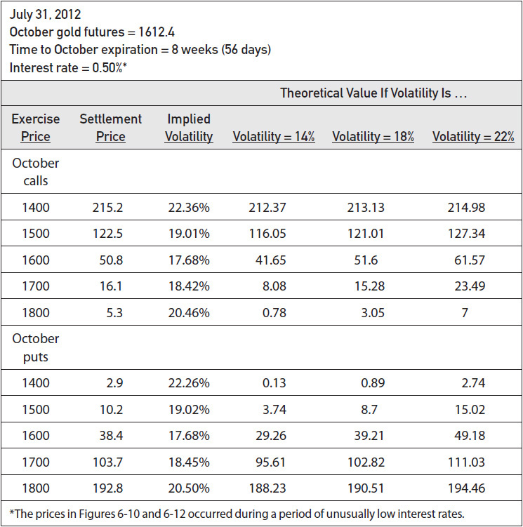

<!-- source:block 35b2116d3ffb6bcf -->

*图6-11 / Figure 6-11*

<!-- source:block 15c595df58911743 -->

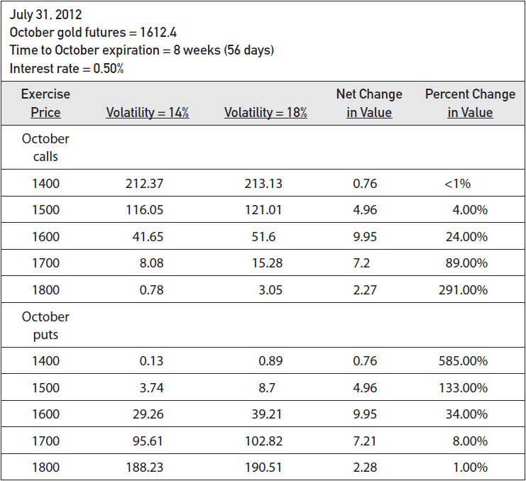

<!-- source:block ad591220c5b25dc6 -->

> [!quote]- English 119
> These same principles apply to puts as well as calls. The 1600 put increases the most in total points, rising from 29.26 to 39.21, a total of 9.95. The 1400 put increases the most in percent terms, from 0.13 to 0.89, or 585 percent.

上述原则同样适用于看跌期权。1600看跌期权按绝对价格点计算涨幅最大，从29.26升至39.21，增加9.95；1400看跌期权按百分比计算涨幅最大，从0.13升至0.89，增长585%。

<!-- source:block 323691d97c95e2af -->

> [!quote]- English 120
> No matter how one measures change, in-the-money options tend to be the least sensitive to changes in volatility. As an option moves deeply into the money, it becomes more sensitive to changes in the underlying price and less sensitive to changes in volatility. Because it is often volatility characteristics that investors and traders are looking for when they go into an options market, it should not come as a surprise that most of the trading volume in option markets is concentrated in at-the-money and out-of-the-money options, the options that are most sensitive to changes in volatility.

无论采用哪种衡量方法，价内期权通常对波动率变化最不敏感。期权越深度价内，对标的价格变化越敏感，对波动率变化则越不敏感。投资者和交易员进入期权市场时，往往正是为了获得波动率敞口，因此期权市场的大部分成交量集中在对波动率最敏感的平值和价外期权上，也就不足为奇。

<!-- source:block 4e259025ed725033 -->

> [!quote]- English 121
> In Figures 6-12 and 6-13, we can see that the same principles apply to longer-term options. The at-the-money options (the December 1600 call and put) change most in total points, whereas the out-of-the-money options (the December 1800 call and 1400 put) change most in percent terms. As we would expect, the December option values are greater than the October option values with the same exercise price. But look at the magnitude of the changes as we change volatility. For the same exercise price, in total points, the December (long-term) options always change more than the October (short-term) options. This leads to a third principle of option evaluation:

图6-12和图6-13表明，同样的原则也适用于期限较长的期权：平值期权（12月1600看涨和看跌期权）按绝对价格点计算变化最大，价外期权（12月1800看涨和1400看跌期权）按百分比计算变化最大。正如预期，12月期权的价值高于相同行权价的10月期权；更值得注意的是，波动率变化时，按绝对价格点衡量，相同行权价的12月长期期权总比10月短期期权变化更大。这引出期权估值的第三条原则：

<!-- source:block 6003ee88153cf53a -->

> [!quote]- English 122
> 3. A change in volatility will have a greater effect on a long-term option than an equivalent short-term option.

3. 波动率变化对长期期权的影响，大于对其他条件相同的短期期权的影响。

<!-- source:block 6daa997eeb2ad692 -->

*图6-12 / Figure 6-12*

<!-- source:block 4493458e0c9b564c -->

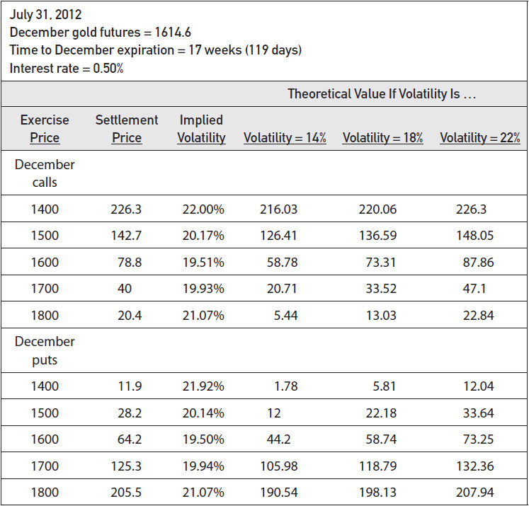

<!-- source:block 4b20c8e7185592fe -->

*图6-13 / Figure 6-13*

<!-- source:block a41bc739ae9921ed -->

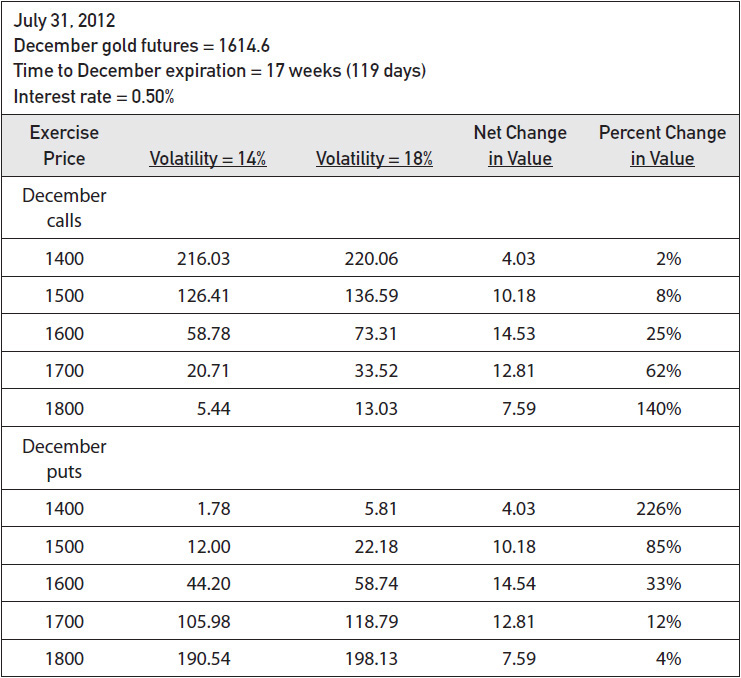

<!-- source:block 9275d825897fd438 -->

> [!quote]- English 125
> The reader may have noticed several interesting points in the foregoing figures. First, although implied volatilities may vary across exercise prices, calls and puts with the same exercise price and that expire at the same time have very similar implied volatilities. Second, when we change volatility, calls and puts with the same exercise price and time to expiration change by approximately the same amount. These characteristics are the result of an important relationship10 between calls and puts at the same exercise price, a relationship that we will examine in more detail in Chapter 15.

读者可能已经注意到上述图中的几个有趣的点。首先，尽管隐含波动率可能因行权价而异，但具有相同行权价且同时到期的看涨和看跌具有非常相似的隐含波动率。其次，当我们改变波动率时，具有相同行权价和到期时间的看涨和看跌期权的变化大致相同。这些特征是相同行权价的看涨和看跌之间重要关系[^ovp06-10]的结果，我们将在第15章中更详细地研究这种关系。

<!-- source:block c16256081a8ea3d7 -->

> [!quote]- English 126
> Finally, we might ask how much the volatility of gold can change over an eight-week period? Is a 4 percentage point change a real possibility? In fact, from Figure 6-14, the eight-week historical volatility for the 3½ years leading up to July 2012, we can see that such changes are not at all uncommon.

最后，我们可能会问，黄金的波动率在八周内会发生多大的变化？4个百分点的变化真的有可能吗？事实上，从图6-14（截至2012年7月的3年半时间里的8周历史波动率）中，我们可以看到这种变化并不罕见。

<!-- source:block adcf82bc36f12cf8 -->

*Figure 6-14 Gold eight-week (40 trading days) historical volatility. / Figure 6-14 Gold eight-week (40 trading days) historical volatility.*

<!-- source:block a91908af63b3da05 -->

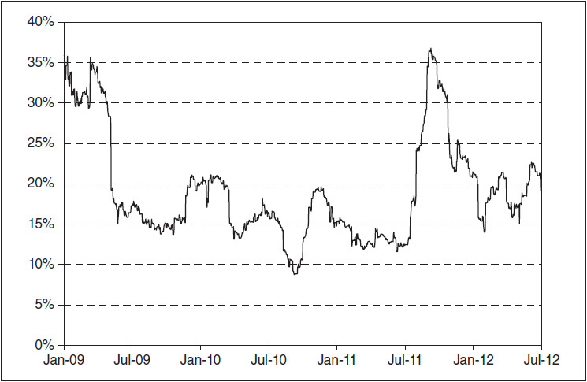

<!-- source:block 967c67908b147f63 -->

> [!quote]- English 128
> Given its importance, it is not surprising that serious option traders spend a considerable amount of time thinking about volatility. From the historical, forecast, and implied volatility, a trader must try to make an intelligent decision about future volatility. From this, he will try to choose option strategies that will be profitable when he is right but that will not result in a serious loss when he is wrong. Because of the difficulty in predicting volatility, a trader must always look for strategies that will leave the greatest margin for error. No trader will survive very long pursuing strategies based on a future volatility estimate of 20 percent if such a strategy results in a significant loss when volatility actually turns out to be 18 or 22 percent. Given the shifts that occur in volatility, a 2 percentage point margin for error may be no margin for error at all.

鉴于波动率如此重要，认真从事期权交易的人花大量时间研究它也就不足为奇。交易员需要综合历史波动率、预测波动率与隐含波动率，对未来波动率作出尽可能合理的判断，再选择判断正确时能够盈利、判断错误时也不至于严重亏损的策略。由于波动率很难预测，策略必须留出尽可能大的容错空间。如果某个以未来波动率20%为前提的策略，在实际波动率为18%或22%时就会遭受重大损失，长期采用这种策略的交易员很难生存。考虑到波动率本身会不断变化，两个百分点的“安全边际”可能根本称不上安全边际。

<!-- source:block 03598ea9cc364f8e -->

> [!quote]- English 129
> We have not yet concluded our discussion of volatility. But before continuing, it will be useful to look at option characteristics, trading strategies, and risk considerations. We will then be in a better position to examine volatility in greater detail.

我们尚未结束对波动率的讨论。但在继续之前，看看期权的特点、交易策略和风险考虑是有用的。这样，我们就可以更详细地研究波动率。

<!-- source:block 476d6ac5b138be00 -->

> [!note] Footnote 130
> 1 The pinball maze, or *quincunx* (sometimes also called a *Galton board*), pictured in these examples is often used to demonstrate basic probability theory. Examples of a quincunx in action can be found at the following websites:

[^ovp06-1]: 这些例子中的弹球迷宫称为“梅花阵”（quincunx，有时也称高尔顿板），常用于演示基础概率论。以下网站可以看到它的运行示例：

<!-- source:block b2108b2ec5bc67bc -->

> [!note] Footnote 131
> http://www.teacherlink.org/content/math/interactive/flash/quincunx/quincunx.html
> http://www.teacherlink.org/content/math/interactive/flash/quincunx/quincunx.html

<!-- source:block 59200326c38d7322 -->

> [!note] Footnote 132
> http://www.mathsisfun.com/data/quincunx.html
> http://www.mathsisfun.com/data/quincunx.html

<!-- source:block 33707a3275dde08c -->

> [!note] Footnote 133
> http://www.jcu.edu/math/isep/Quincunx/Quincunx.html
> http://www.jcu.edu/math/isep/Quincunx/Quincunx.html

<!-- source:block 30a591af3c0e96bc -->

> [!note] Footnote 134
> 2 The reader who is familiar with the mean and standard deviation and who would like to check the arithmetic will find that the actual mean and standard deviation are 7.49 and 3.02. For simplicity, we have rounded these to 7.50 and 3.00.

[^ovp06-2]: 熟悉均值和标准差并想检查算术的读者会发现实际均值和标准差分别为7.49和3.02。为了简单起见，我们将其四舍五入为7.50和3.00。

<!-- source:block 25f54e38e8e6d346 -->

> [!note] Footnote 135
> 3 As markets around the world become more integrated, and with the advent of electronic trading, it may become more difficult to determine exactly what fraction of a year one day represents. Depending on the contract and exchange, in some cases it may be sensible to look at prices every day, 365 days per year.

[^ovp06-3]: 随着世界各地市场的一体化程度越来越高，以及电子交易的出现，可能越来越难以准确确定一天所代表的时间占一年的多少。根据合约和交易所的不同，在某些情况下，每年365天每天查看价格可能是明智的。

<!-- source:block 30863bef7da0d6de -->

> [!note] Footnote 136
> 4 A price change greater than two standard deviations will occur about 1 time in 20. Because there are approximately 20 trading days in a month, as an additional benchmark, most traders expect to see a daily two standard deviation occurrence about once a month.

[^ovp06-4]: 价格变动超过两个标准差的概率约为二十分之一。由于一个月约有20个交易日，多数交易员据此采用的另一项经验基准是：日价格变动超过两个标准差的情形，平均每月约出现一次。

<!-- source:block 3597cb975707a655 -->

> [!note] Footnote 137
> 5 Alternative methods of estimating volatility have also been proposed when trading is continuous or when there is no well-defined daily settlement price. See, for example, Michael Parkinson, “The Extreme Value Method of Estimating the Variance of the Rate of Return,” *Journal of Business* 53(1):61–64, 1980; Mark B. Garman and Michael J. Klass, “On the Estimation of Security Price Volatilities from Historical Data,” *Journal of Business* 53(1):67–78, 1980; and Stan Beckers, “Variance of Security Price Returns Based on High, Low, and Closing Prices,” *Journal of Business* 56(1):97–112, 1983.

[^ovp06-5]: 当交易连续或没有明确定义的每日结算价时，还提出了估计波动率的替代方法。例如，请参阅Michael Parkinson，“The Extreme Value Method of Estimating the Variance of the Return of Return”，Journal of Business 53（1）：61-64，1980; Mark B。Garman和Michael J. Klass，“On the Estimate of Securities Price Volatilities from History Data”，Journal of Business 53（1）：67-78，1980; Stan Beckers，“Variance of Securities Price Returns on High，Low，and Close Price”Journal of Business 56（1）：97-112，1983。

<!-- source:block 85d37df68d75dcb3 -->

> [!note] Footnote 138
> 6 This method of quoting Eurocurrency contracts is used so that moves in Eurocurrency contracts will tend to mimic moves in bond prices. If interest rates rise, both bond prices and Eurocurrency futures will fall; if interest rates fall, both bond prices and Eurocurrency futures will rise.

[^ovp06-6]: 使用这种欧洲货币合约报价方法是为了使欧洲货币合约的走势往往会模仿债券价格的走势。如果利率上升，债券价格和欧洲货币期货都会下跌;如果利率下降，债券价格和欧洲货币期货都会上涨。

<!-- source:block 83e212b2be8fa4ba -->

> [!note] Footnote 139
> 7 It will be useful for an option trader to become familiar with the characteristics of the exponential function [*ex* or exp(*x*)] and its inverse, the logarithmic function [ln(*x*)]. These can be found in any algebra or finance text.

[^ovp06-7]: 期权交易员最好熟悉指数函数[$e^x$ 或 $\exp(x)$]及其反函数——自然对数函数[$\ln(x)$]的性质；任何代数或金融数学教材都会介绍这些内容。

<!-- source:block 536fb7f6c865aa66 -->

> [!note] Footnote 140
> 8 In order to turn price changes into continuously compounded returns, volatility is most often calculated using logarithmic price changes—the natural logarithm of the current price divided by the previous price. In most cases, there is little practical difference between the percent price changes and logarithmic price changes.

[^ovp06-8]: 为把价格变动转化为连续复合收益率，计算波动率时最常采用对数收益率，即当前价格与前一期价格之比的自然对数。在多数情况下，简单百分比收益率与对数收益率的实际差异很小。

<!-- source:block cda7303e54188ddb -->

> [!note] Footnote 141
> 9 For exchange-traded contracts, volatility calculations using daily intervals typically include only business days because these are the only days on which prices can actually change. If there are five trading days per week, a 50-day volatility covers a period of approximately 10 weeks.

[^ovp06-9]: 对于交易所交易的合约，使用每日间隔的波动率计算通常仅包括工作日，因为这些是价格可以实际变化的唯一日子。如果每周有五个交易日，则50天的波动涵盖大约10周的时间。

<!-- source:block e536010228b194d0 -->

> [!note] Footnote 142
> 10 Some readers may already be familiar with this relationship—*put-call parity*.

[^ovp06-10]: 一些读者可能已经熟悉这种关系的看涨期权平价。

---

[[阅读导航|← 返回阅读导航]]

<!-- chapter-nav:start -->
> [!tip] 章节导航（章末）
> [[理论定价模型 Theoretical Pricing Models|← 上一章]] · [[阅读导航|全书导航]] · [[风险度量（一） Risk Measurement I|下一章 →]]
<!-- chapter-nav:end -->
