# 波动率价差策略 / Volatility Spreads

[[阅读导航|← 返回阅读导航]]

> [!success] 翻译状态
> 本章翻译与风险审计已完成。英文原文、数字、公式和图表继续保留，便于逐段核对。

<!-- chapter-toc:start -->
## 本章目录 / Chapter Outline

> [!abstract] 结构导航
> 以下标题按原书顺序保留；点击可直接跳转。

- [[#跨式策略 / Straddle|跨式策略 / Straddle]]
- [[#宽跨式策略 / Strangle|宽跨式策略 / Strangle]]
- [[#蝶式价差 / Butterfly|蝶式价差 / Butterfly]]
- [[#鹰式价差 / Condor|鹰式价差 / Condor]]
- [[#比率价差 / Ratio Spread|比率价差 / Ratio Spread]]
- [[#圣诞树价差 / Christmas Tree|圣诞树价差 / Christmas Tree]]
- [[#日历价差 / Calendar Spread|日历价差 / Calendar Spread]]
- [[#时间蝶式价差 / Time Butterfly|时间蝶式价差 / Time Butterfly]]
- [[#利率与股息变化的影响 / Effect of Changing Interest Rates and Dividends|利率与股息变化的影响 / Effect of Changing Interest Rates and Dividends]]
- [[#对角价差 / Diagonal Spreads|对角价差 / Diagonal Spreads]]
- [[#选择合适的策略 / Choosing an Appropriate Strategy|选择合适的策略 / Choosing an Appropriate Strategy]]
- [[#调整 / Adjustments|调整 / Adjustments]]
- [[#提交价差委托 / Submitting a Spread Order|提交价差委托 / Submitting a Spread Order]]
<!-- chapter-toc:end -->
<!-- chapter-nav:start -->
> [!tip] 章节导航（章首）
> [[价差策略导论 Introduction to Spreading|← 上一章]] · [[阅读导航|全书导航]] · [[牛市与熊市价差 Bull and Bear Spreads|下一章 →]]
<!-- chapter-nav:end -->
<!-- source:block 0a5c9d9e96e209c8 -->

> [!quote]- English 1
> In Chapter 8, we showed that it is possible, at least in theory, to capture an option’s mispricing in the marketplace by employing a dynamic hedging strategy. The first step in this process involves hedging the option position, delta neutral, by taking an opposing market position in the underlying contract. But the underlying contract is not the only way in which we can hedge an option position. We might instead take our opposing delta position with other options.

在第 8 章中，我们说明了至少在理论上，可以通过动态对冲锁定期权的市场错价。第一步通常是在标的合约上建立反向头寸，使期权组合达到 Delta 中性。但标的合约并非唯一的对冲工具；也可以使用其他期权建立反向 Delta 敞口。

<!-- source:block be5795f0c9e13351 -->

> [!quote]- English 2
> Consider a call with a delta of 50 that appears to be underpriced in the marketplace. If we buy 10 calls, resulting in a delta position of +500, we might hedge the position in any of the following ways:

假设一份 Delta 为 $+50$ 的看涨期权在市场上似乎被低估。若买入 10 份，组合 Delta 为 $+500$，可以用以下任一方式对冲：

<!-- source:block 1592cc9c40720e3c -->

> [!quote]- English 3
> Sell five underlying contracts.

卖出五份标的合约。

<!-- source:block 84684aaa398b7090 -->

> [!quote]- English 4
> Buy puts with a total delta of –500.

买入若干看跌期权，使其总 Delta 为 $-500$。

<!-- source:block b0ff955d8cf11425 -->

> [!quote]- English 5
> Sell calls, different from those that we purchased, with a total delta of –500.

卖出与已买入合约不同的看涨期权，使其总 Delta 为 $-500$。

<!-- source:block 9805961178b63350 -->

> [!quote]- English 6
> Do a combination of any of the preceding such that we create a total delta of –500.

组合使用上述方法，使新建对冲头寸的总 Delta 为 $-500$。

<!-- source:block f86a23da75ae9826 -->

> [!quote]- English 7
> There are clearly many different ways of hedging our 10 calls. Regardless of which method we choose, each spread will have certain features in common:

显然，这 10 份看涨期权可以用多种方式对冲。无论选择哪一种，所得价差都有一些共同特征：

<!-- source:block 52a43b74ea1a8a88 -->

> [!quote]- English 8
> Each spread will be approximately delta neutral.

每个价差都大致为 Delta 中性。

<!-- source:block 0df6b98f1d0ecc08 -->

> [!quote]- English 9
> Each spread will be sensitive to changes in the price of the underlying instrument.

每个价差都对标的工具的价格变化敏感。

<!-- source:block b738b3ab0d69904e -->

> [!quote]- English 10
> Each spread will be sensitive to changes in implied volatility.

每个价差都对隐含波动率变化敏感。

<!-- source:block ec14e08de6a7d9fc -->

> [!quote]- English 11
> Each spread will be sensitive to the passage of time.

每个价差都对时间流逝敏感。

<!-- source:block 9bc56f2c536a899b -->

> [!quote]- English 12
> Spreads with the foregoing characteristics fall under the general heading of *volatility spreads*. In this chapter, we will look at the most common types of volatility spreads, initially by examining their expiration values and then by considering their delta, gamma, theta, vega, and rho characteristics.

具有上述特征的组合统称为**波动率价差**（volatility spreads）。本章将介绍其中最常见的类型：先考察各策略的到期价值，再分析 Delta、Gamma、Theta、Vega 和 Rho 特征。

<!-- source:block 643323c2a901536d -->

## 跨式策略 / Straddle

<!-- source:block 16755027126a1761 -->

> [!quote]- English 13
> A *straddle* consists of a call and a put where both options have the same exercise price and expiration date. In a straddle, both options are either purchased (a *long straddle*) or sold (a *short straddle*). Examples of long and short straddles, with their expiration profit-and-loss (P&L) graphs, are shown in Figures 11-1 and 11-2.

跨式由一份看涨期权和一份看跌期权组成，两者具有相同的行权价和到期日。两条腿同时买入称为**多头跨式**，同时卖出称为**空头跨式**。图 11-1 和图 11-2 分别给出两种头寸及其到期损益图。

<!-- source:block 78812e6d9e1b15de -->

*Figure 11-1 Long straddle as time passes or volatility declines. / Figure 11-1 Long straddle as time passes or volatility declines.*

<!-- source:block 1c92a23e2a4e8202 -->

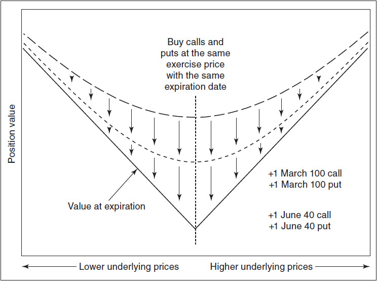

<!-- source:block 33969c1437fdd224 -->

*Figure 11-2 Short straddle as time passes or volatility declines. / Figure 11-2 Short straddle as time passes or volatility declines.*

<!-- source:block bbd3b376ad5c5d86 -->

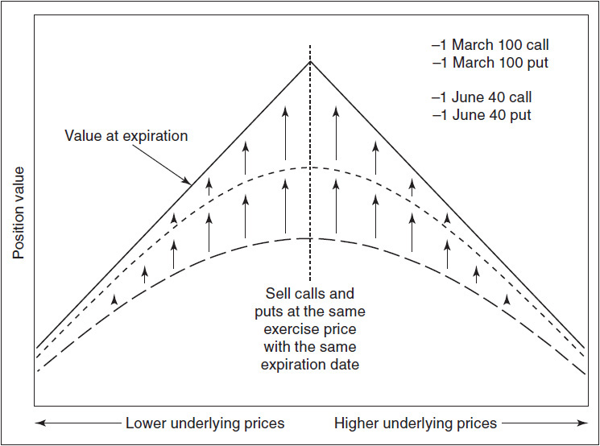

<!-- source:block c37befbcfb9f067e -->

> [!quote]- English 16
> At expiration, the value of a straddle can be expressed as a simple parity graph. But what about its value prior to expiration? As with all option positions, some changes in market conditions will help the strategy and some changes will hurt. From Figure 11-1, we can see that a long straddle becomes more valuable when the underlying market moves away from the exercise price and less valuable as time passes if no movement occurs. At the same time, any increase in volatility will help, while any decline will hurt. These characteristics are indicated by the risk measures associated with the position:

到期时，跨式头寸的价值可以用一张简单的内在价值图（即本书所称的“平价图”）表示。那么在到期前，它的价值会怎样变化？与所有期权头寸一样，市场条件的某些变化有利于该策略，另一些则不利。从图 11-1 可以看出，当标的价格偏离行权价时，多头跨式的价值会上升；如果标的价格没有变动，其价值则会随着时间流逝而下降。同时，隐含波动率上升对多头跨式有利，隐含波动率下降则对其不利。这些特征可以用该头寸的风险指标表示如下：

<!-- source:block 627fe716fa74a683 -->

> [!quote]- English 17
> +Gamma (desire for movement in the underlying contract)

$$
+\text{Gamma} (\text{desire for movement in the underlying contract})
$$

<!-- source:block 37b8e0cd6758e266 -->

> [!quote]- English 18
> –Theta (the value of the position declines as time passes)

$$
-\text{Theta} (\text{the value of the position declines as time passes})
$$

<!-- source:block 80f314da47f45caa -->

> [!quote]- English 19
> +Vega (the value of the position increases as implied volatility rises)

$$
+\text{Vega} (\text{the value of the position increases as implied volatility rises})
$$

<!-- source:block e7e43e45822d9cff -->

> [!quote]- English 20
> The characteristics of a short straddle are shown in Figure 11-2:

空头跨式的特征如图11-2所示：

<!-- source:block 6bc56be4a50f2667 -->

> [!quote]- English 21
> –Gamma (movement in the underlying contract will hurt the position)

$$
-\text{Gamma} (\text{movement in the underlying contract will hurt the position})
$$

<!-- source:block e38566b5e38cb52f -->

> [!quote]- English 22
> +Theta (the value of the position increases as time passes)

$$
+\text{Theta} (\text{the value of the position increases as time passes})
$$

<!-- source:block 2fee66ee2d486baa -->

> [!quote]- English 23
> –Vega (the value of the position increases as implied volatility falls)

$$
-\text{Vega} (\text{the value of the position increases as implied volatility falls})
$$

<!-- source:block 97aec6fd88b9e3ca -->

> [!quote]- English 24
> Straddles are most often executed one to one (one call for each put) using at-the-money options. When this is done, the spread will be approximately delta neutral because the delta values of the call and put will be close to 50 and –50. A straddle can also be done with options that are either in the money or out of the money. For example, with the underlying contract trading at 100, we might buy the September 95 straddle. If the September 95 calls, which are in the money, have a delta of 75 and the September 95 puts, which are out of the money, have a delta of –25, the total delta will be 75 – 25 = 50, resulting in a *bull straddle*. If we want the straddle to be delta neutral, we will need to adjust the number of contracts by purchasing three puts for every call:

跨式通常用同一到期日、同一行权价的看涨和看跌期权按 $1:1$ 的数量构建（每 1 份看涨期权对应 1 份看跌期权）。若采用平值期权，看涨期权的 Delta 约为 $+50$，看跌期权的 Delta 约为 $-50$，因此组合整体接近 Delta 中性。

跨式也可以使用价内或价外期权。假设标的合约现价为 100，交易者买入 9 月到期、行权价为 95 的跨式。若其中价内看涨期权的 Delta 为 $+75$，价外看跌期权的 Delta 为 $-25$，按 $1:1$ 配置时，组合 Delta 为

$$
+75+(-25)=+50.
$$

因此，该组合带有明显的多头方向敞口，原书称之为**偏多跨式**（bull straddle）。若要使其恢复 Delta 中性，就必须调整两条腿的数量比例：每买入 1 份看涨期权，同时买入 3 份看跌期权：

<!-- source:block a798317356fb8946 -->

> [!quote]- English 25
> Buy 1 September 95 call (delta = 75).

$$
\text{买入 1 份 9 月 95 看涨期权：}\quad \Delta=+75
$$

<!-- source:block fe5958f316edf90a -->

> [!quote]- English 26
> Buy 3 September 95 puts (delta = –25).

$$
\text{买入 3 份 9 月 95 看跌期权：}\quad
\Delta=3\times(-25)=-75
$$

$$
\Delta_{\text{组合}}=+75-75=0.
$$

<!-- source:block 99d9855d685b3635 -->

> [!quote]- English 27
> This spread still qualifies as a straddle because we are buying calls and puts at the same exercise price. But, more specifically, this is a *ratio straddle* because the number of long market contracts (the calls) and the number of short market contracts (the puts) are unequal.

这个组合仍属于跨式，因为看涨期权和看跌期权具有相同的行权价；更准确地说，它是一个**比率跨式**（ratio straddle），因为正 Delta 的看涨期权与负 Delta 的看跌期权数量并不相等。这里的“多头市场合约”和“空头市场合约”描述的是两条腿的方向性敞口，并不是说看跌期权被卖出；本例中的看涨与看跌期权均为买入头寸。

<!-- source:block 43fdda4002528c12 -->

## 宽跨式策略 / Strangle

<!-- source:block 8a31640a0241e992 -->

> [!quote]- English 28
> Like a straddle, a *strangle* consists of a long call and a long put (a long strangle) or a short call and a short put (a short strangle), where both options expire at the same time. But in a strangle the options have different exercise prices. Typical long and short strangles are shown in Figures 11-3 and 11-4.

与跨式类似，宽跨式可以由买入一份看涨期权和一份看跌期权构成（多头宽跨式），也可以由卖出一份看涨期权和一份看跌期权构成（空头宽跨式）；两条腿具有相同的到期日，但行权价不同。典型的多头与空头宽跨式分别见图 11-3 和图 11-4。

<!-- source:block 58c8e642b9fa877c -->

*图11-3随着时间的推移或波动率的下降，多头宽跨式。 / Figure 11-3 Long strangle as time passes or volatility declines.*

<!-- source:block aa6e07c43353e69a -->

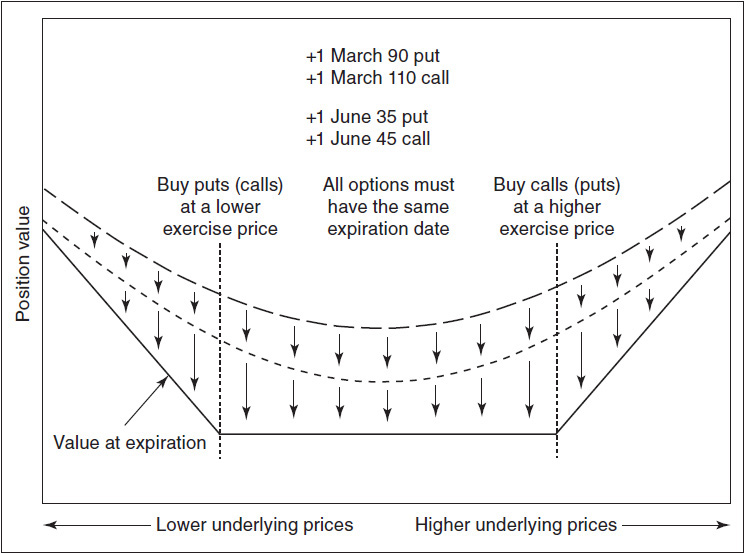

<!-- source:block fb7569cc269a6289 -->

*图11-4随着时间的推移或波动率的下降，空头宽跨式。 / Figure 11-4 Short strangle as time passes or volatility declines.*

<!-- source:block e0b13f371478028b -->

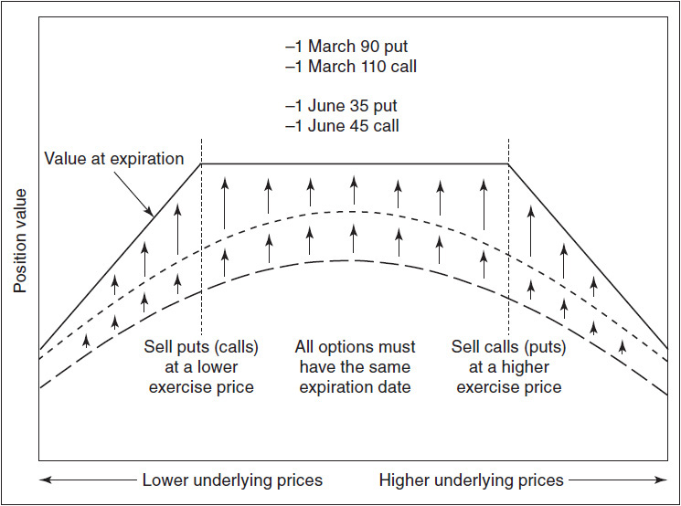

<!-- source:block 60ca4a3e29c66c5e -->

> [!quote]- English 31
> As with a straddle, strangles are most often done one to one (one call for each put). In order to ensure that the position is delta neutral, exercise prices are usually chosen so that the call and put deltas are approximately equal.

与跨式一样，宽跨式通常按 $1{:}1$ 的数量构建，即每 1 份看涨期权对应 1 份看跌期权。为使组合接近 Delta 中性，通常会选择合适的两个行权价，使看涨腿与看跌腿的 Delta 绝对值大致相等、符号相反。

<!-- source:block 6a5e065c5c52d804 -->

> [!quote]- English 32
> If a strangle is identified only by its expiration month and exercise prices, there may be some confusion as to the specific options involved. A March 90/110 strangle might consist of a March 90 put and a March 110 call. But it might also consist of a March 90 call and a March 110 put. Both strategies are consistent with the definition of a strangle. To avoid confusion, a strangle is commonly assumed to consist of out-of-the-money options. If the underlying market is currently at 100 and a trader wants to purchase the March 90/110 strangle, everyone will assume that he wants to purchase a March 90 put and a March 110 call. Although both strangles have essentially the same P&L profile, in-the-money options tend to be less actively traded than their out-of-the-money counterparts. A strangle consisting of in-the-money options is sometimes referred to as a *guts*.

如果只用到期月份和两个行权价来标识宽跨式，具体包含哪两份期权可能并不明确。例如，“3 月 90/110 宽跨式”既可能是由 3 月 90 看跌期权和 3 月 110 看涨期权组成，也可能是由 3 月 90 看涨期权和 3 月 110 看跌期权组成；两种组合都符合“同一到期日、不同行权价的一份看涨期权与一份看跌期权”这一定义。

为避免歧义，市场通常默认宽跨式由价外期权组成。假设标的价格为 100，那么“买入 3 月 90/110 宽跨式”通常指买入 90 行权价的价外看跌期权和 110 行权价的价外看涨期权。另一种组合——买入 90 行权价的价内看涨期权和 110 行权价的价内看跌期权——具有基本相同的到期损益形状，但价内期权通常不如对应的价外期权活跃。这种由两份价内期权构成的宽跨式变体称为 **Guts（价内宽跨式）**，不应按字面译为“胆量”。

<!-- source:block f35545fc5b9f4dde -->

> [!quote]- English 33
> Note that the risk characteristics of a strangle are similar to those of a straddle:

请注意，宽跨式的风险特征与跨式的风险特征相似：

<!-- source:block 87af43f1b6c1c8ea -->

> [!quote]- English 34
> Long strangle: +gamma/–theta/+vega

$$
\text{Long strangle}: +\text{gamma}/-\text{theta}/+\text{vega}
$$

<!-- source:block 27acfaa75787cb08 -->

> [!quote]- English 35
> Long straddle: +gamma/–theta/+vega

$$
\text{Long straddle}: +\text{gamma}/-\text{theta}/+\text{vega}
$$

<!-- source:block 0afa34302c4375f6 -->

> [!quote]- English 36
> A new option trader often finds long straddles and strangles attractive because strategies with limited risk and unlimited profit potential offer great appeal, especially when the profit is unlimited in both directions. However, if the hoped-for movement fails to materialize, a trader will find that losing money, even a limited amount, can also be a painful experience. This is not an endorsement of either long or short straddles. Under the right conditions, either strategy may be sensible. But an intelligent trader needs to consider not only whether the risk and reward is limited or unlimited but also the likelihood of the various outcomes. This, of course, is one important reason for using a theoretical pricing model.

期权交易新手往往觉得多头跨式和多头宽跨式很有吸引力，因为这类策略风险有限，同时在标的大幅变动时具有很高的盈利潜力。然而，如果预期中的行情没有出现，即使最大损失有限，实际亏掉这笔金额仍然会令人痛苦。这里并不是要笼统推荐多头或空头跨式；在适当的市场条件下，两类策略都可能合理。理性的交易者不仅要判断风险与收益是否有限，还必须评估各种结果发生的可能性，而这正是使用理论定价模型的重要原因之一。

<!-- source:block ca63d829cb5eadde -->

## 蝶式价差 / Butterfly

<!-- source:block b6690a23534cda3d -->

> [!quote]- English 37
> Thus far we have looked at spreads that involve buying or selling two different option contracts. However, we can also construct spreads consisting of three, four, or even more different options. A *butterfly* is a common three-sided spread consisting of options with equally spaced exercise prices, where all options are of the same type (either all calls or all puts) and expire at the same time. In a long butterfly, the outside exercise prices are purchased and the inside exercise price is sold, and vice versa for a short butterfly. Moreover, the ratio of a butterfly never varies. It is always 1 × 2 × 1, with two of each inside exercise price traded for each one of the outside exercise prices. Typical long and short butterflies are shown in Figures 11-5 and 11-6.

到目前为止，我们讨论的价差只涉及两种不同的期权合约；但价差也可以由三种、四种甚至更多合约组成。**蝶式价差**是一种常见的三腿策略：三条腿的执行价等距，期权类型相同——全部为 Call 或全部为 Put——且到期日相同。多头蝶式买入两个外侧执行价的期权，并卖出中间执行价的期权；空头蝶式则完全反向。标准蝶式的数量比固定为 $1:2:1$，即每买入（或卖出）外侧两翼各 1 份，就卖出（或买入）蝶身 2 份。典型的多头与空头蝶式见图 11-5 和图 11-6。

<!-- source:block 252171a7d74e5527 -->

*图 11-5 时间流逝或波动率下降时的多头蝶式价差。 / Figure 11-5 Long butterfly as time passes or volatility declines.*

<!-- source:block 6fb61bcd24eb4f0a -->

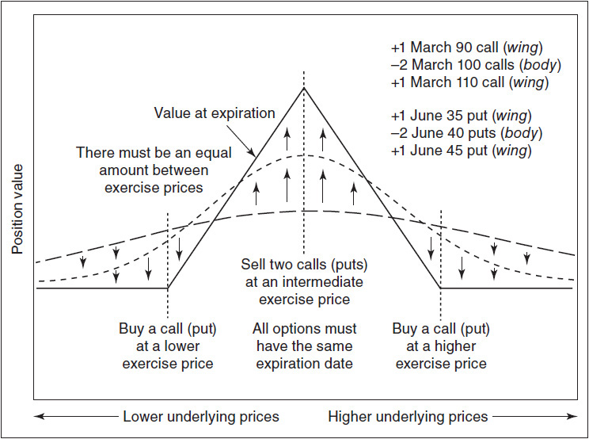

<!-- source:block 0cd303c5a8c87c2f -->

*图 11-6 时间流逝或波动率下降时的空头蝶式价差。 / Figure 11-6 Short butterfly as time passes or volatility declines.*

<!-- source:block 4d27823315dccdec -->

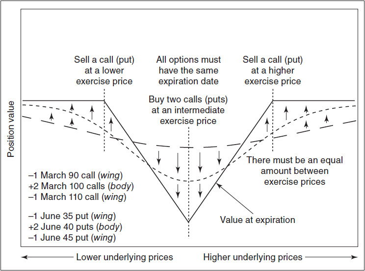

<!-- source:block 72ed0d9637dd0b57 -->

> [!quote]- English 40
> To a new trader, a butterfly may look quite complex since it involves three different options in different quantities. But butterflies have very simple and well-defined characteristics that make them popular trading strategies. To understand these characteristics, let’s consider the value of a long butterfly at expiration:

对新交易者而言，蝶式价差可能显得复杂，因为它包含三个不同期权系列，而且各腿数量并不相同。但它的风险形状清晰、边界明确，因此很常用。下面先考察多头蝶式在到期时的价值：

<!-- source:block ef094586df4af8e8 -->

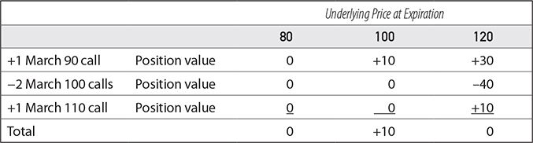

<!-- source:block abd4c94adc4698e3 -->

> [!quote]- English 41
> If the underlying price is below 90 at expiration, all the calls will expire worthless, and the value of the position will be 0. If the underlying contract is above 120 at expiration, the combined value of the 90 and 110 calls will equal the value of the two 100 calls. Again, the value of the butterfly will be 0. Now suppose that the underlying contract is between 90 and 110 at expiration, specifically, right at the inside exercise price of 100. The 90 call will be worth 10.00, while the 100 and 110 calls will be worthless. The position will be worth exactly 10.00. If the underlying moves away from 100, the value of the butterfly will decline, but its value can never fall below 0. Summarizing, at expiration, a butterfly is worthless if the underlying contract is above or below the outside exercise prices (sometimes referred to as the *wings* of the butterfly). It has its maximum value at expiration when the underlying contract is right at the inside exercise price (sometimes referred to as the *body* of the butterfly). And the maximum value is always equal to the amount between exercise prices, in our example 10.00.

若到期标的价格低于 90，三档 Call 均到期无价值，组合价值为 0。若标的价格高于 110，90 Call 与 110 Call 的合计内在价值恰好等于两份 100 Call 的内在价值，组合价值同样为 0。若到期标的价格恰好为中间执行价 100，则 90 Call 价值 10.00，而 100 Call 与 110 Call 均无内在价值，组合达到最大价值 10.00。标的价格越偏离 100，蝶式价值越低，但不会低于 0。概括而言：最低与最高执行价称为**蝶翼**（wings），中间执行价称为**蝶身**（body）；标准等距蝶式在到期价格落于两翼之外时价值为 0，在蝶身处价值最大，最大价值等于相邻执行价间距，本例为 10.00。

> [!note] 译校说明
> 原文此处写作 “above 120”；但本例三个执行价是 90/100/110，且后文结论是标的高于最高蝶翼时组合价值为 0，因此中文按 110 校正。

<!-- source:block 4227e8e0ced62e2c -->

> [!quote]- English 42
> Because a butterfly at expiration always has a value between 0 and the amount between exercise prices, in our example, a trader should be willing to pay some amount between 0 and 10.00 for the position. The exact amount depends on the likelihood of the underlying contract finishing close to the inside price at expiration. If there is a high probability of this occurring, a trader might be willing to pay as much as 8.00 for the butterfly since it might very well expand to its full value of 10.00. If, however, there is a low probability of this occurring and, consequently, a high probability that the underlying contract will finish outside the extreme exercise prices, a trader may only be willing to pay 1.00 or 2.00 because he may very well lose his entire investment. This also explains why our example position is a *long* butterfly. Because the position can never be worth less than 0, a trader will always be required to pay some amount for the position. Otherwise, there would be a riskless profit opportunity. When a position requires an outlay of cash, a trader has bought, or is long, the position.

本例蝶式的到期价值始终介于 0 与 10.00 之间，因此合理价格也应落在这一范围内。具体价格取决于市场认为标的到期时接近蝶身 100 的可能性：若概率较高，交易者可能愿意支付接近 8.00；若标的更可能落在两翼之外，可能只愿支付 1.00 或 2.00，因为全部净支出都可能损失。这个例子称为**多头蝶式**，是因为建立头寸需要支付净权利金；若其价格为 0 或负数，在忽略交易摩擦且可持有至到期的前提下便可能产生无风险获利机会。

<!-- source:block 8e3ec7bebce1e205 -->

> [!quote]- English 43
> A butterfly will tend to be delta neutral when the inside exercise price is approximately at the money. Under these conditions, a long butterfly will tend to act like a short straddle, while a short butterfly will tend to act like a long straddle. With either a long butterfly or a short straddle, a trader wants the underlying market to sit still (–gamma, +theta) and implied volatility to fall (–vega). With either a short butterfly or a long straddle, a trader wants the underlying market to make a large move (+gamma, –theta) and implied volatility to rise (+vega). But there is one important difference. While a straddle is open-ended in terms of either profit potential or risk, a butterfly is strictly limited. It can never be worth less than 0 nor more than the amount between exercise prices. This is important for a trader who might want to sell straddles but who is uncomfortable with the possibility of unlimited loss. Of course, there is always a risk-reward tradeoff. If a long butterfly has reduced risk when the trader is wrong, it will also have increased profit when the trader is right. For this reason, butterflies tend to be executed in much larger sizes than straddles. A trader may find that buying 300 butterflies (300 × 600 × 300) is actually less risky than selling 100 straddles. In option trading, size and risk do not always correlate. Some strategies done in large sizes can have a relatively small risk, while other strategies, even when done in small sizes, can have a relatively large risk. Risk depends not only on the size in which a strategy is executed but also on the characteristics of the strategy.

当蝶身的中间行权价接近平值时，蝶式价差通常接近 Delta 中性。在这种情况下，多头蝶式与空头跨式具有相似的风险敏感度：交易者希望标的价格停留在中间行权价附近，并希望隐含波动率下降，即

$$
\Gamma<0,\qquad \Theta>0,\qquad \mathrm{Vega}<0.
$$

反过来，空头蝶式与多头跨式具有相似的风险敏感度：交易者希望标的价格出现较大幅度的变动，并希望隐含波动率上升，即

$$
\Gamma>0,\qquad \Theta<0,\qquad \mathrm{Vega}>0.
$$

二者的重要区别在于风险边界。跨式在某一方向上的盈利潜力或亏损风险可以不断扩大，而等宽蝶式的到期价值受到严格限制：其最低价值为 0，最高价值为相邻行权价之间的距离；实际最大盈亏还需计入建仓时的净支出或净收入。这使多头蝶式成为空头跨式的一种有限风险替代方案，适合不愿承担空头跨式无限上行亏损风险的交易者。

当然，降低风险也意味着牺牲潜在收益。多头蝶式在判断错误时损失较小，判断正确时可获得的利润通常也较小。因此，蝶式往往采用比跨式更大的合约规模。例如，买入 300 组标准蝶式意味着三条腿分别为 $+300:-600:+300$，合计涉及 1,200 份期权合约；即便如此，其总体风险仍可能低于卖出 100 组跨式。期权策略的合约数量与风险并不总是成正比：风险不仅取决于头寸规模，也取决于策略本身的损益结构。

> [!note] 译校说明
> 原文此处写作 “If a long butterfly has reduced risk when the trader is wrong, it will also have **increased** profit when the trader is right.” 但这与前一句的“风险收益权衡”以及后文通过扩大蝶式规模弥补收益较小的逻辑相矛盾。此处按上下文将其理解为 **reduced profit**，即“风险降低的同时，潜在利润也会降低”。

<!-- source:block eb09bf9b9dd07d4c -->

> [!quote]- English 44
> We know that a butterfly at expiration is worth its maximum when the underlying contract is right at the inside exercise price. If we assume that all options are European, with no possibility of early exercise, both a call and a put butterfly with the same exercise prices and the same expiration dates desire exactly the same outcome and therefore have identical characteristics. Both the March 90/100/110 call butterfly and the March 90/100/110 put butterfly will be worth a maximum of 10.00 with the underlying price exactly at 100 at expiration and a minimum of 0 with the underlying price below 90 or above 110. If both butterflies are not trading at the same price, there is a sure profit opportunity available by purchasing the cheaper and selling the more expensive.1

当标的到期价格等于蝶身执行价时，蝶式价值最大。若所有期权均为欧式、执行价等距且到期日相同，看涨蝶式与看跌蝶式具有相同的到期价值和风险形状。3 月 90/100/110 看涨蝶式与看跌蝶式在标的到期价格为 100 时都达到最大价值 10.00；当到期价格低于 90 或高于 110 时，两者的最小价值均为 0。若两种构造的市场价格不同，理论上可以买入较便宜者并卖出较昂贵者锁定价差收益。[^ovp11-1]

<!-- source:block e55e59b5a60d17e3 -->

## 鹰式价差 / Condor

<!-- source:block 05cdbf2dd4ae5a04 -->

> [!quote]- English 45
> Just as a butterfly can be thought of as a straddle with limited risk or reward, a *condor* can be thought of as a strangle with limited risk or reward. A condor consists of four options, two inside exercise prices (the body of the condor) and two outside exercise prices (the wings of the condor).2 The ratio of a condor is always 1 × 1 × 1 × 1. Although the amount between the two inside exercise prices can vary, there must be an equal amount between the two lowest exercise prices and the two highest exercise prices. As with a butterfly, all options must expire at the same time and be of the same type (either all calls or all puts). In a long condor, the two outside exercise prices are purchased and the two inside exercise prices are sold, and vice versa for a short condor. Typical long and short condors are shown in Figures 11-7 and 11-8.

正如蝶式价差可以看作风险和收益均受限的跨式，鹰式价差也可以看作风险和收益均受限的宽跨式。鹰式价差由四份期权组成：两个中间行权价构成鹰身（body），最低和最高两个行权价构成鹰翼（wings）。[^ovp11-2]

鹰式价差的四条腿始终采用 $1:1:1:1$ 的数量比。两个中间行权价之间的距离可以变化，但下侧翼宽与上侧翼宽必须相等，即最低两个行权价的间距必须等于最高两个行权价的间距。与蝶式价差一样，四份期权必须具有相同的到期日，并且全部为看涨期权或全部为看跌期权。

构建**多头鹰式价差**时，买入最低和最高行权价的两条外侧腿，卖出两个中间行权价的两条内侧腿；**空头鹰式价差**的买卖方向则完全相反。典型的多头与空头鹰式价差分别见图 11-7 和图 11-8。

<!-- source:block 84bebcddeac09c34 -->

*图 11-7 时间流逝或波动率下降时的多头鹰式价差。 / Figure 11-7 Long condor as time passes or volatility declines.*

<!-- source:block afb38a0986465082 -->

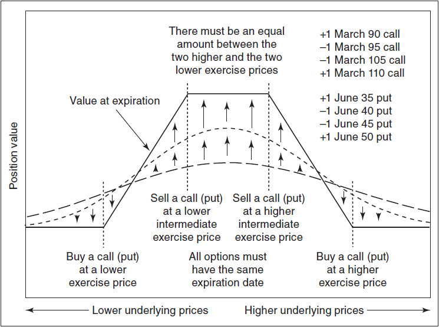

<!-- source:block f5507e9cb841cfcc -->

*图 11-8 时间流逝或波动率下降时的空头鹰式价差。 / Figure 11-8 Short condor as time passes or volatility declines.*

<!-- source:block 6b1c079422c21809 -->

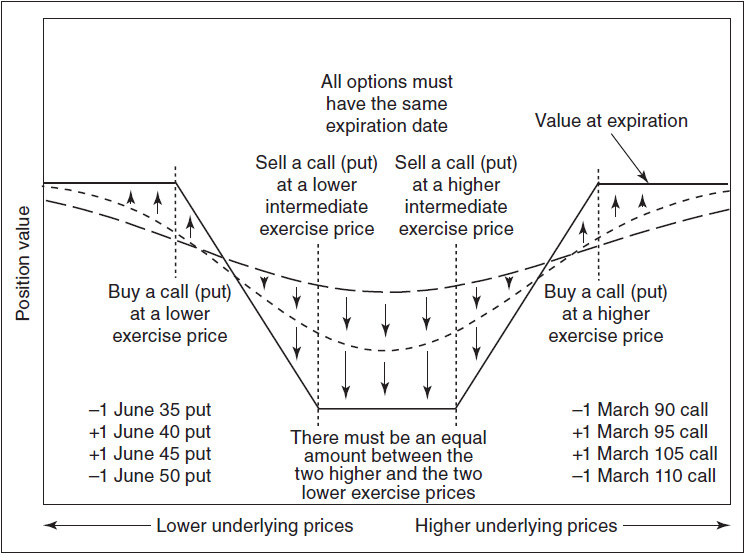

<!-- source:block 9aa16609e475e8f0 -->

> [!quote]- English 48
> The value of a condor at expiration can never be less than 0 nor more than the amount between the two higher or the two lower exercise prices. A trader who buys a condor will pay some amount between these values, expecting that the underlying contract will finish between the two intermediate exercise prices, where the condor will be worth its maximum. A trader who sells a condor will take in some amount, expecting that the underlying contract will finish outside the extreme exercise prices, where the condor will be worthless.

鹰式价差的到期价值不会低于 0，也不会高于一侧翼部的宽度，即最低两个行权价或最高两个行权价之间的距离。买入鹰式价差的交易者需要支付一笔净权利金，并预期标的到期价格落在两个中间行权价之间，此时组合达到最大价值。卖出鹰式价差的交易者则会获得一笔净收入，并预期标的到期价格落在最低行权价以下或最高行权价以上，此时组合的到期价值为 0。

<!-- source:block ca2ff4046bcbc7dd -->

> [!quote]- English 49
> A condor will be approximately delta neutral when the underlying contract is midway between the two inside exercise prices. When all options are European, the value and characteristics of a call condor and put condor will be identical.

当标的价格位于两个中间行权价的中点附近时，鹰式价差通常接近 Delta 中性。如果所有期权均为欧式期权，那么具有相同行权价和到期日的看涨鹰式价差与看跌鹰式价差具有相同的价值和风险特征。

<!-- source:block d634ddee717f73b0 -->

> [!quote]- English 50
> The four volatility spreads that we just described—straddles, strangles, butterflies, and condors—all have symmetrical P&L graphs. When executed delta neutral, as is most common, these strategies have no preference as to the direction of movement in the underlying market. Long straddles and strangles and short butterflies and condors prefer movement in the underlying market and an increase in implied volatility (+gamma, –theta, +vega). Short straddles and strangles and long butterflies and condors prefer no movement in the underlying market and a decline in implied volatility (–gamma, +theta, –vega). These characteristics are summarized in Figure 11-9.

以上四类波动率价差——跨式、宽跨式、蝶式和鹰式——都具有对称的损益图。它们通常以 Delta 中性方式建立，因此并不偏好标的价格向某个特定方向运动。

多头跨式、多头宽跨式、空头蝶式和空头鹰式受益于标的价格的大幅变动以及隐含波动率上升，其风险特征为 $+\Gamma$、$-\Theta$、$+\mathrm{Vega}$。空头跨式、空头宽跨式、多头蝶式和多头鹰式则受益于标的价格保持稳定以及隐含波动率下降，其风险特征为 $-\Gamma$、$+\Theta$、$-\mathrm{Vega}$。图 11-9 汇总了这些特征。

<!-- source:block 4111f318a51c6f02 -->

*图11-9对称策略。 / Figure 11-9 Symmetrical strategies.*

<!-- source:block 447260c0c2b05774 -->

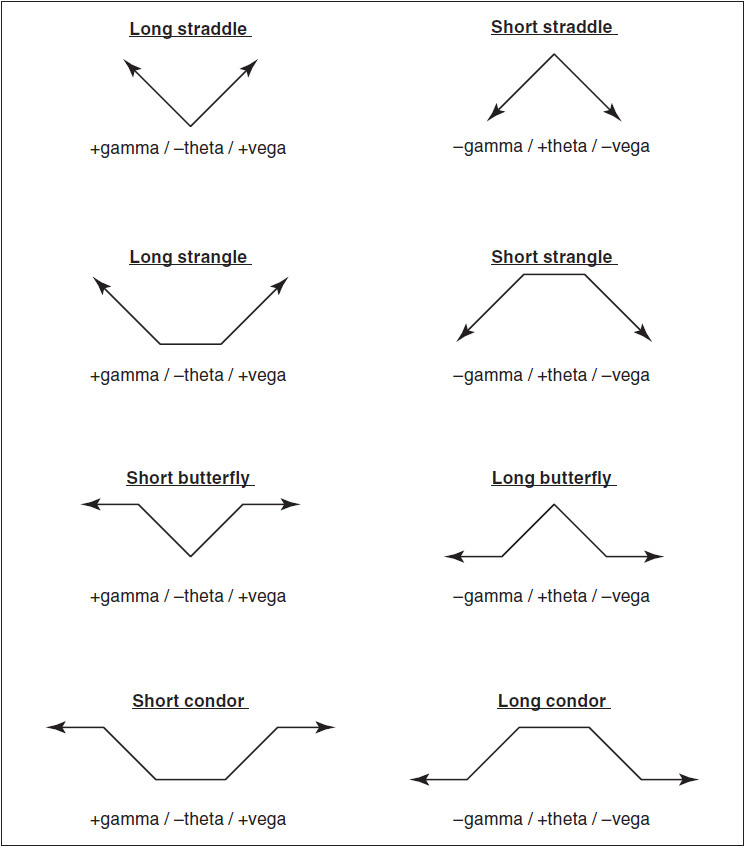

<!-- source:block 8b38a01d9804f501 -->

## 比率价差 / Ratio Spread

<!-- source:block 30a34debced11c79 -->

> [!quote]- English 52
> In a volatility spread, a trader need not be totally indifferent to the direction of movement in the underlying market. The trader may believe that movement in one direction is more likely than movement in the other direction. Given this, the trader may wish to construct a spread that either maximizes his profit or minimizes his loss when movement occurs in one direction rather than the other. In order to achieve this, a trader can construct a *ratio spread*—buying and selling unequal numbers of options where all options are the same type and expire at the same time. As with other volatility positions, the spread is typically delta neutral.

构建波动率价差并不意味着交易者必须对标的价格的上涨或下跌完全没有看法。交易者可能认为，标的向某一方向运动的概率高于向另一方向运动的概率，因此希望让组合在该方向上获得更高利润，或者在不利方向上减少损失。

实现这种非对称收益的一种方法是构建**比率价差**（ratio spread）：买入与卖出数量不相等的期权，同时要求各条腿均为同一类型——全部为看涨期权或全部为看跌期权——并具有相同的到期日。与其他波动率头寸一样，比率价差在建立时通常会调整为 Delta 中性，但其到期损益可以明显偏向某一方向。

<!-- source:block 6795b90b1c9868bf -->

> [!quote]- English 53
> Consider the following delta-neutral position with the underlying contract trading at 100 (delta values are in parentheses):

假设标的合约现价为 100，考虑下面这个 Delta 中性头寸；括号内为每份期权的 Delta：

<!-- source:block b0d2a6a8fa7a2225 -->

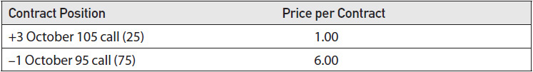

三份 105 看涨期权提供 $3\times(+25)=+75$ Delta；卖出一份 95 看涨期权产生 $-75$ Delta，因此

$$
\Delta_{\text{组合}}=3\times(+25)-1\times(+75)=0.
$$

<!-- source:block f26aac1882d1e78b -->

> [!quote]- English 54
> Now let’s consider three possible prices for the underlying contract at expiration:

现在让我们考虑标的合约到期时的三种可能价格：

<!-- source:block c9888b14a5a91489 -->

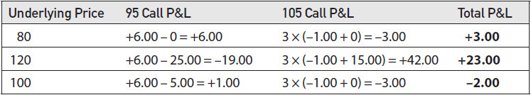

<!-- source:block 5b1fc114de536b07 -->

> [!quote]- English 55
> If the underlying contract makes a very big move in either direction, the position will show a profit. Of course, the profit will be much larger if the move is upward. If the underlying sits at 100 until expiration, the position will show a loss. This *call ratio spread*, where more calls are purchased than sold, wants movement in the underlying contract but clearly prefers upward movement, where the potential profit is unlimited. The P&L diagram for this type of strategy is shown in Figure 11-10.

如果标的价格向任一方向大幅变动，该头寸都可能盈利，但上涨时的利润会大得多。若标的到期价格仍为 100，头寸则会亏损。这种买入看涨期权数量多于卖出数量的看涨比率价差受益于标的大幅变动，并明显偏好上涨方向，因为净多出的看涨期权使上行盈利潜力不封顶。其损益图见图 11-10。

<!-- source:block bc6a0c96527e5c49 -->

*图11-10随着时间的推移或波动率下降的看涨比率价差（买入多于卖出）。 / Figure 11-10 Call ratio spread (buy more than sell) as time passes or volatility declines.*

<!-- source:block d697c80f4d76a933 -->

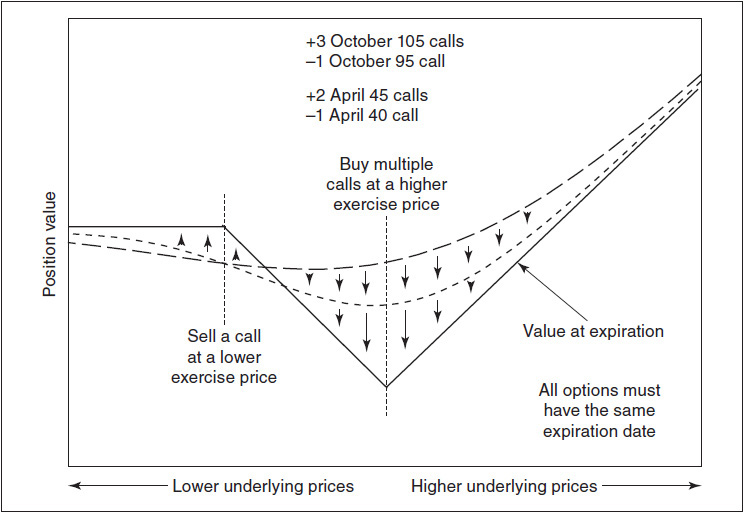

<!-- source:block 2d0986cb3c34e88b -->

> [!quote]- English 57
> The same type of position can be created using puts. A *put ratio spread*, where more puts are purchased than sold, also prefers movement in the underlying contract. But now there is a preference for downward movement because the profit potential on the downside will be unlimited. This is shown in Figure 11-11.

同类头寸也可以用看跌期权构建。买入数量多于卖出数量的看跌比率价差同样受益于标的价格的大幅变动，但更偏好下跌，因为净多出的看跌期权会扩大下行收益，如图 11-11 所示。

> [!note] 适用边界
> 原书将下行盈利潜力称为“无限”。对于价格下限为 0 的股票类标的，利润实际上会在标的价格降至 0 时达到上限；只有在标的价格理论上可以继续向负值移动的模型或合约语境下，才可称为不封顶。

<!-- source:block a8e399e0e4fa8758 -->

*图11-11随着时间的推移或波动率下降，看跌比率价差（买入多于卖出）。 / Figure 11-11 Put ratio spread (buy more than sell) as time passes or volatility declines.*

<!-- source:block 4184a2ddecdf8b92 -->

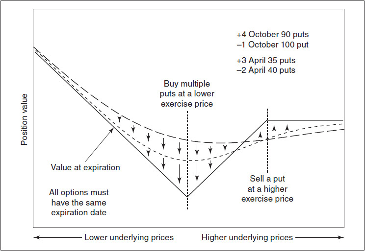

<!-- source:block cf9b8c388da0c000 -->

> [!quote]- English 59
> A ratio spread where more options are purchased than sold is sometimes referred to as *backspread*. Regardless of whether the spread consists of calls or puts, this type of spread always wants movement in the underlying market (+gamma, –theta) and/or an increase in implied volatility (+vega).

买入期权数量多于卖出数量的比率价差，有时称为**反向比率价差**（backspread，也称“买多卖少”）。无论由看涨期权还是看跌期权构成，这类头寸通常受益于标的价格的大幅变动和隐含波动率上升，风险特征为 $+\Gamma$、$-\Theta$、$+\mathrm{Vega}$。

<!-- source:block f1508d76f0795ba1 -->

> [!quote]- English 60
> In a ratio spread where more options are purchased than sold, the spread will be worthless if the underlying contract makes a large enough downward move in the case of calls or a large enough upward move in the case of puts. For either spread to result in a profit, it must be executed initially for a credit, and this is a typical characteristic of these types of spreads. Indeed, under the assumptions of a traditional theoretical pricing model, a delta-neutral ratio spread where more options are purchased than sold should always result in a credit.

对于买多卖少的看涨反向比率价差，如果标的价格大幅下跌，所有期权都可能在到期时归零；对于相应的看跌结构，如果标的价格大幅上涨，也会出现同样情况。若希望组合在这个“所有期权均归零”的方向上仍然盈利，建仓时就必须获得净权利金收入（credit）。在传统理论定价模型的假设下，按 Delta 中性构建的买多卖少比率价差通常应形成净收入；这一结论依赖模型、执行价与 Delta 中性等前提，并不意味着净支出建仓的反向比率价差在有利尾部也无法盈利。

> [!note] 译校说明：比率价差不一定是 Credit
> 比率价差究竟以净收入（credit）还是净支出（debit）建立，取决于行权价、数量比、期限、波动率偏斜和实际成交价格。这里的“必须获得 credit”只针对组合到期内在价值为 0 的那一侧：若建仓时没有净收入，该侧自然不可能产生利润。以 debit 建立的反向比率价差仍可在标的向净多期权所在的有利尾部充分移动时盈利。

<!-- source:block 52a651009cc28975 -->

> [!quote]- English 61
> Ratio spreads are often used to limit the risk in one direction. If we sell more calls than we buy, the spread will act like a short straddle (–gamma, +theta, –vega) but with limited downside risk. If we sell more puts than we buy, the spread will have limited upside risk. The P&L diagrams for these types of spreads are shown Figures 11-12 and 11-13.

比率价差也常用于限制某一方向的风险。如果卖出的看涨期权多于买入的看涨期权，头寸的局部风险特征类似空头跨式（$-\Gamma$、$+\Theta$、$-\mathrm{Vega}$），下跌侧风险有限，但上涨侧因净卖出看涨期权而可能出现无上限亏损。如果卖出的看跌期权多于买入的看跌期权，上涨侧风险有限，但下跌侧包含额外的裸卖看跌风险；对于价格下限为 0 的股票类标的，该损失虽有数学上限，仍可能十分巨大。相应损益图见图 11-12 和图 11-13。

<!-- source:block d50e4677fd618684 -->

*图11-12随着时间的推移或波动率下降，看涨比率价差（卖出多于买入）。 / Figure 11-12 Call ratio spread (sell more than buy) as time passes or volatility declines.*

<!-- source:block 4765258a9277dc48 -->

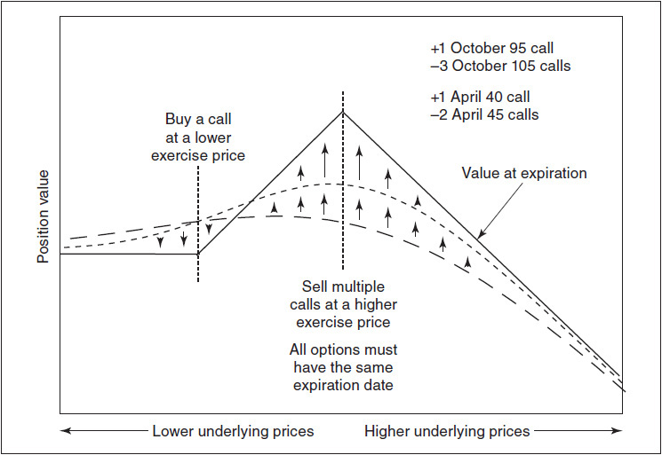

<!-- source:block ce6766b56ef5ee0f -->

*图11-13随着时间的推移或波动率下降，看跌比率价差（卖出多于买入）。 / Figure 11-13 Put ratio spread (sell more than buy) as time passes or volatility declines.*

<!-- source:block 05f1f75941c9c7bf -->

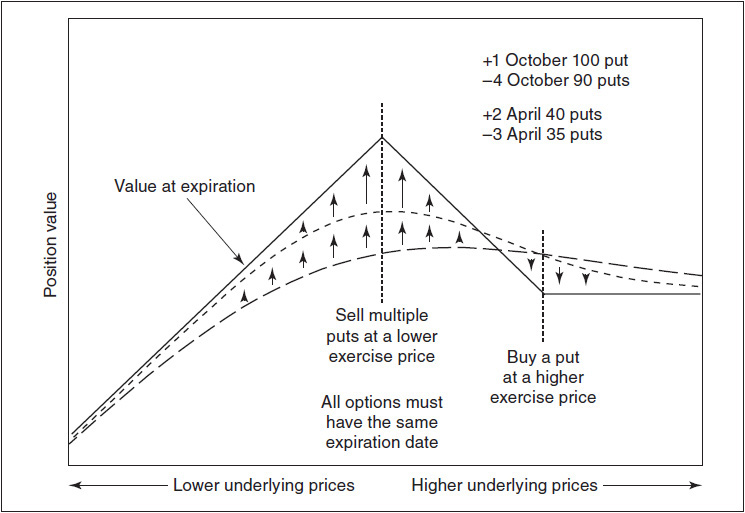

<!-- source:block 357ae62ad0f576b4 -->

> [!quote]- English 64
> A ratio spread where more options are sold than purchased is sometimes referred to as *frontspread*.3 Using calls, the position will be worthless at expiration if the underlying contract is below the lower exercise price. Using puts, the position will be worthless at expiration if the underlying contract is above the higher exercise price. The fact that the value of the position cannot fall below 0 limits the downside risk if more calls are sold than purchased and the upside risk if more puts are sold than purchased.

卖出期权数量多于买入数量的比率价差，有时称为**正向比率价差**（frontspread，也称“卖多买少”）。[^ovp11-3] 对于看涨结构，当标的到期价格低于较低行权价时，各腿的到期内在价值均为 0，因此下跌侧风险受到限制；对于看跌结构，当标的到期价格高于较高行权价时，各腿同样归零，因此上涨侧风险受到限制。

这里的“归零”只描述上述安全一侧的到期内在价值，并不表示整个策略不会亏损。最终损益还取决于建仓净收入或净支出，而且另一侧仍存在由额外裸卖期权造成的开放尾部风险。

<!-- source:block 6151e938e1883cbe -->

> [!quote]- English 65
> When executed as a single trade, ratio spreads are usually submitted using simple ratios, the most common being 2 to 1. However, other ratios—3 to 1, 4 to 1, or 3 to 2—are also relatively common.

比率价差作为一笔组合订单提交时，通常采用简单数量比，最常见的是 $2:1$；$3:1$、$4:1$ 和 $3:2$ 也较常见。实际报价或记录时必须同时注明哪一侧是买入、哪一侧是卖出，或明确写出“多头数量 : 空头数量”，不能只给出一个缺少方向的比值。

<!-- source:block ee3b5d1fb6ce5c26 -->

## 圣诞树价差 / Christmas Tree

<!-- source:block b522e7f776b6ae91 -->

> [!quote]- English 66
> Ratio spreads tend to mimic straddles, but with the risk or reward limited in one direction. We can also construct strategies that mimic strangles, but again with limited risk or reward in one direction. Such spreads are known as either *Christmas trees* or *ladders*.4

比率价差的风险形状通常类似跨式，但会把某一方向的风险或收益限制住。采用相同思路，也可以构建类似宽跨式、但在一侧具有有限风险或有限收益的组合；这类策略称为**圣诞树价差**（Christmas tree）或**阶梯价差**（ladder）。[^ovp11-4]

<!-- source:block 3534184a026096c4 -->

> [!quote]- English 67
> A call Christmas tree involves buying (selling) a call at a lower exercise price and selling (buying) one call each at two higher exercise prices. A put Christmas tree involves buying (selling) a put at a higher exercise price and selling (buying) one put each at two lower exercise prices. All options must be the same type and expire at the same time, with exercise prices most often chosen so that the entire position is delta neutral. When one option is bought and two options sold (a long Christmas tree), the position acts like a short strangle but with limited risk in one direction. When one option is sold and two options bought (a short Christmas tree), the position acts like a long strangle but with limited profit potential in one direction. P&L diagrams for typical Christmas trees are shown in Figures 11-14 through 11-17.

看涨圣诞树由三个不同行权价的看涨期权构成：多头结构买入 1 份较低行权价看涨期权，并在两个更高行权价上各卖出 1 份看涨期权；空头结构的买卖方向完全相反。看跌圣诞树则以三个不同行权价的看跌期权构建：多头结构买入 1 份较高行权价看跌期权，并在两个更低行权价上各卖出 1 份看跌期权；空头结构反向操作。

若 $K_1<K_2<K_3$，四种结构可以简写为：

$$
\begin{aligned}
\text{多头看涨圣诞树：}&\quad +C(K_1)-C(K_2)-C(K_3),\\
\text{空头看涨圣诞树：}&\quad -C(K_1)+C(K_2)+C(K_3),\\
\text{多头看跌圣诞树：}&\quad +P(K_3)-P(K_2)-P(K_1),\\
\text{空头看跌圣诞树：}&\quad -P(K_3)+P(K_2)+P(K_1).
\end{aligned}
$$

所有期权必须类型相同、到期日相同，行权价通常选择为使整个组合在建仓时接近 Delta 中性。买入 1 份、卖出 2 份的**多头圣诞树价差**，风险形状类似空头宽跨式，但其中一个方向的风险受到限制；卖出 1 份、买入 2 份的**空头圣诞树价差**，风险形状类似多头宽跨式，但其中一个方向的盈利潜力受到限制。典型结构见图 11-14 至图 11-17。

> [!note] 多空命名与尾部风险
> 本书把“买入 1 份、卖出 2 份”称为**多头圣诞树**，把完全反向的“卖出 1 份、买入 2 份”称为**空头圣诞树**，不能按期权净张数理解多空。多头看涨圣诞树只限制下跌侧风险，上涨侧仍有净卖出看涨期权的开放风险；多头看跌圣诞树只限制上涨侧风险，下跌侧仍有净卖出看跌期权风险。空头结构的尾部收益方向与之相反。

<!-- source:block 3fab60f3d716c5dc -->

*图 11-14 时间流逝或波动率下降时的多头看涨圣诞树价差。 / Figure 11-14 Long call Christmas tree as time passes or volatility declines.*

<!-- source:block bd147b5d574bc47d -->

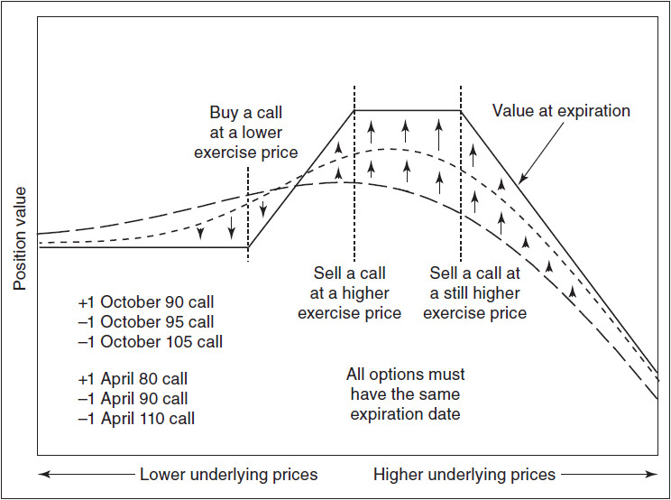

<!-- source:block c09560a64d99698b -->

*图 11-15 时间流逝或波动率下降时的空头看涨圣诞树价差。 / Figure 11-15 Short call Christmas tree as time passes or volatility declines.*

<!-- source:block 866f4d2eeafc22e2 -->

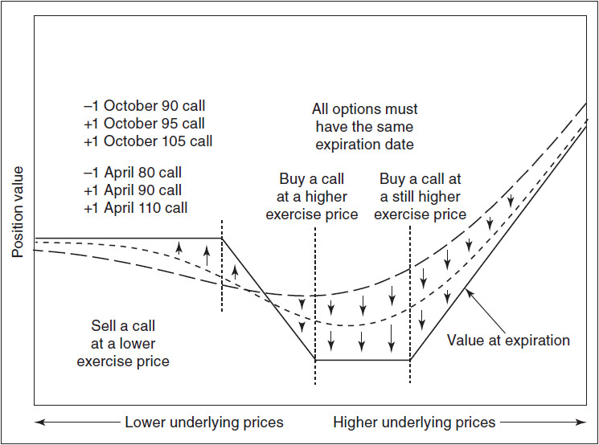

<!-- source:block 42a2fbdcf782e8ee -->

*图 11-16 时间流逝或波动率下降时的多头看跌圣诞树价差。 / Figure 11-16 Long put Christmas tree as time passes or volatility declines.*

<!-- source:block 5844b791070ba83e -->

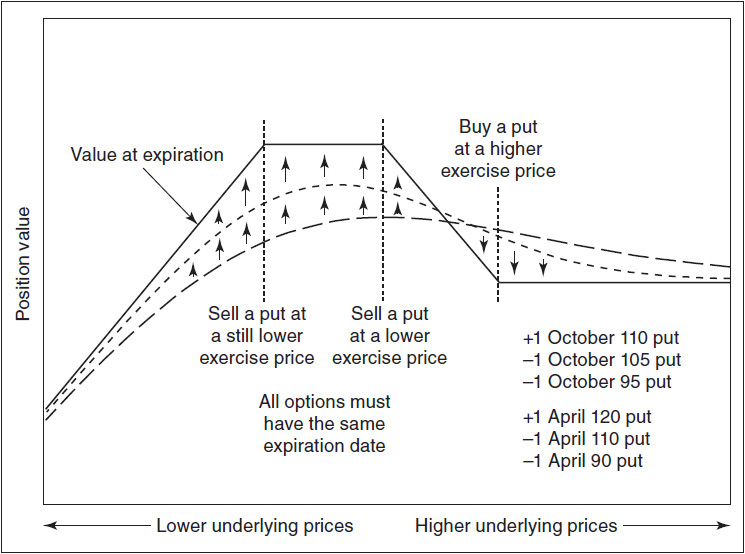

<!-- source:block 54661752a3fe2831 -->

*图 11-17 时间流逝或波动率下降时的空头看跌圣诞树价差。 / Figure 11-17 Short put Christmas tree as time passes or volatility declines.*

<!-- source:block a9fd667eb4509e3c -->

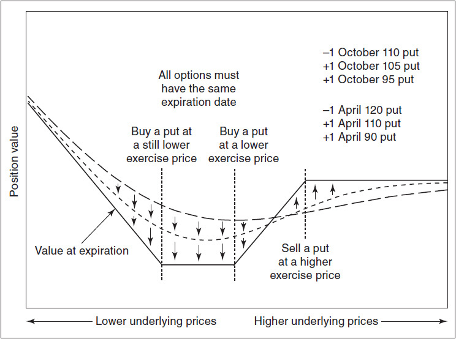

<!-- source:block 45ec74dacbae541d -->

> [!quote]- English 72
> Although ratio spreads and Christmas trees have nonsymmetrical P&L graphs, their volatility characteristics tend to mimic straddles and strangles. A spread in which more options are purchased than sold will prefer movement in the underlying market and/or an increase in implied volatility (+gamma, –theta, +vega). A spread in which more options are sold than purchased will prefer no movement in the underlying market and/or a decline in implied volatility (–gamma, +theta, –vega). The characteristics of nonsymmetrical spreads are summarized in Figure 11-18.

虽然比率价差和圣诞树价差的损益图并不对称，但其波动率风险特征通常分别类似跨式或宽跨式。买入期权数量多于卖出数量的组合，通常受益于标的价格的大幅变动或隐含波动率上升，风险特征为 $+\Gamma$、$-\Theta$、$+\mathrm{Vega}$；卖出数量多于买入数量的组合，则通常受益于标的价格保持稳定或隐含波动率下降，风险特征为 $-\Gamma$、$+\Theta$、$-\mathrm{Vega}$。图 11-18 汇总了这些非对称价差的特征。

<!-- source:block 1313e4bc8f6c4d2f -->

*图11-18非对称策略。 / Figure 11-18 Nonsymmetrical strategies.*

<!-- source:block 50b4a1b8cfec4202 -->

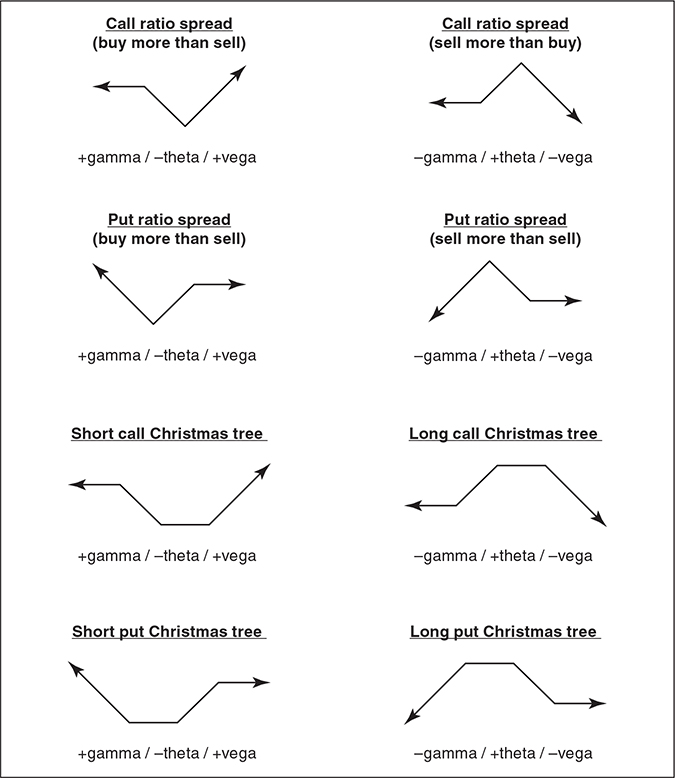

<!-- source:block c0e2cde5b848d0f9 -->

## 日历价差 / Calendar Spread

<!-- source:block 33c0d24789d68ac0 -->

> [!quote]- English 74
> If all options in a spread expire at the same time, the value of the spread at expiration depends solely on the underlying price. If, however, the spread consists of options that expire at different times, the spread’s value depends not only on where the underlying market is when the short-term option expires but also on what will happen between that date and the date on which the long-term option expires. Calendar spreads, sometimes referred to as *time spreads* or *horizontal spreads*,5 consist of option positions that expire in different months.

如果价差中的所有期权同时到期，到期时的价差价值只取决于标的价格。若两腿到期时间不同，那么在近月期权到期时，价差价值不仅取决于当时的标的价格，还取决于从近月到期日到远月到期日之间的市场变化。**日历价差**（calendar spread），也称**时间价差**（time spread）或**水平价差**（horizontal spread），[^ovp11-5]由到期月份不同的期权头寸组成。

<!-- source:block 0559b8b6f308f860 -->

> [!quote]- English 75
> The most common type of calendar spread consists of opposing positions in two options of the same type (either both calls or both puts) where both options have the same exercise price. When the long-term option is purchased and the short-term option is sold, a trader is long the calendar spread; when the short-term option is purchased and the long-term option is sold, the trader is short the calendar spread. Because a long-term option will typically be worth more than a short-term option, this is consistent with the practice of referring to any strategy that is executed at a debit as a long position and any spread that is executed for a credit as a short position.

最常见的日历价差由两份类型相同、行权价相同但到期月份不同的期权构成，两条腿方向相反。买入远月期权并卖出近月期权，称为**多头日历价差**；买入近月期权并卖出远月期权，称为**空头日历价差**。远月期权通常比近月期权更贵，因此前者一般需要净支出（debit），符合“净支出头寸称为多头”的惯例；后者一般形成净收入（credit），因而称为空头日历价差。

<!-- source:block b513eacdcd514b27 -->

> [!quote]- English 76
> Although calendar spreads are most commonly executed one to one (one contract purchased for each contract sold), a trader may ratio a calendar spread to reflect a bullish, bearish, or neutral market sentiment. For purposes of discussion, we will focus on one-to-one calendar spreads (one long-term option for each short-term option) that are approximately delta neutral. Because at-the-money options have delta values close to 50, the most common calendar spreads consist of long and short at-the-money options.6

日历价差最常按 $1{:}1$ 的数量比建仓，即每买入一份期权，同时卖出一份另一到期月份的期权。交易者也可使用不等数量的比例日历价差，以表达看涨、看跌或中性观点。本书以近似 Delta 中性的 $1{:}1$ 组合为主：一份远月期权对应一份近月期权，两者持仓方向相反。由于平值期权的 Delta 绝对值通常接近 $0.50$（原书按 50 点表示），常见日历价差由一多一空的平值期权构成。[^ovp11-6]

<!-- source:block 562c672b7035d7cb -->

> [!quote]- English 77
> The value of a calendar spread depends not only on movement in the underlying market but also on the marketplace’s expectations about future market movement as reflected in the implied volatility. Because of this, a calendar spread has characteristics that differ from the other spreads we have discussed. If we assume that the options making up a calendar spread are approximately at the money, calendar spreads have two important characteristics:

日历价差的价值不仅取决于标的价格变动，还取决于市场对未来波动幅度的预期，而这种预期会反映在隐含波动率中。因此，日历价差具有不同于前述其他价差的特征。假设构成日历价差的期权均大致处于平值（ATM）状态，则该组合有两个重要特征：

<!-- source:block 0f87f9caa394353c -->

> [!quote]- English 78
> 1. A calendar spread will increase in value if time passes with no movement in the underlying contract.

1.如果标的合约没有变动，则日历价差的价值将增加。

<!-- source:block 40fa1633038360c2 -->

> [!quote]- English 79
> 2. A calendar spread will increase in value if implied volatility rises and decline in value if implied volatility falls.

2.如果隐含波动率上升，日历价差的价值将增加，如果隐含波动率下降，日历价差的价值将下降。

<!-- source:block 1474963290470e23 -->

> [!quote]- English 80
> Why should a calendar spread become more valuable as time passes? Consider the following spread, where the underlying contract, which is currently trading at 100, is the same for both options:

为什么日历价差会随着时间流逝而增值？考虑下面这个组合：两条腿以同一合约为标的，标的现价为 100。

<!-- source:block b843959eb1978849 -->

> [!quote]- English 81
> +1 June 100 call

$$
+1 \text{June} 100 \text{call}
$$

<!-- source:block 92cfd62f9f758089 -->

> [!quote]- English 82
> –1 April 100 call

$$
-1 \text{April} 100 \text{call}
$$

<!-- source:block 37d6ba09137791c3 -->

> [!quote]- English 83
> Suppose that there are four months remaining to June expiration and two months remaining to April expiration. If we assume a constant underlying price of 100 and a constant volatility of 20 percent, the value of the individual options as time passes, as well as the value of the spread, is shown in Figure 11-19.

假设距离 6 月到期还有四个月，距离 4 月到期还有两个月。若标的价格始终为 100、波动率始终为 20%，两份期权及其价差的价值随时间变化的结果见图 11-19。

<!-- source:block f76ae6b2bea524b9 -->

*图11-19随着时间的推移日历价差的价值。 / Figure 11-19 The value of a calendar spread as time passes.*

<!-- source:block f381d7f4d95f7f27 -->

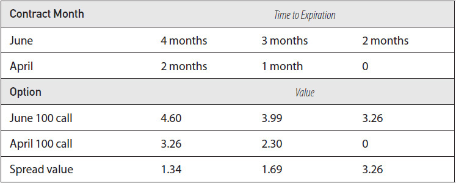

<!-- source:block 4deeb8482d223547 -->

> [!quote]- English 85
> The spread is initially worth 1.34, but as time passes, both options begin to decay. However the April option, with less time remaining to expiration, decays more rapidly than the June option. Over the first month, the April option loses 0.96, while the June option loses only 0.61. The spread has increased to 1.69.

价差的初始价值为 1.34。随着时间流逝，两份期权都发生时间价值衰减；但 4 月期权剩余期限较短，衰减速度快于 6 月期权。第一个月内，4 月期权价值减少 0.96，6 月期权仅减少 0.61，因此“远月多头减近月空头”的日历价差价值净增加 0.35，由 1.34 扩大至 1.69。

<!-- source:block 55c2acee17c69c34 -->

> [!quote]- English 86
> Over the next month, with the underlying contract still at 100, the April option, because it is at the money, must give up its entire value of 2.30. The June option will also continue to decay, and at a slightly greater rate, losing 0.73. But the calendar spread has still increased to 3.26.

再过一个月，标的价格仍为 100。4 月平值期权到期，其剩余价值 2.30 全部衰减至 0；6 月期权也继续衰减，这个月价值减少 0.73。由于近月空头腿减少的价值更多，日历价差仍由 1.69 扩大至 3.26。

<!-- source:block 0dc00b6e067ca2a2 -->

> [!quote]- English 87
> The increase in value of the calendar spread as time passes is the result of an important characteristic of theta that was noted in Chapter 8: as time to expiration grows shorter, the theta of an at-the-money option increases. A short-term at-the-money option decays more rapidly than a long-term at-the-money option.

日历价差随时间流逝而增值，源于第 8 章讨论的 Theta 特征：平值期权越接近到期，时间价值衰减率的绝对值通常越大。因此，近月平值期权往往比远月平值期权衰减得更快。

<!-- source:block c4ac4a163e718bb4 -->

> [!quote]- English 88
> What will happen if the underlying contract does not sit still but instead makes a large upward or downward move? The value of a calendar spread depends on the long-term option retaining as much time value as possible while the short-term option decays. This will be true if both options remain at the money because an at-the-money option always has the greatest amount of time value. As an option moves either into the money or out of the money, its time value will disappear. A long-term option will always have greater time value than a short-term option. But, if the movement in the underlying contract is large enough and the option moves very deeply into the money or very far out of the money, even a long-term option will eventually lose almost all or its time value. This will cause the calendar spread to collapse, as shown in Figure 11-20.

如果标的价格并非保持不变，而是大幅上涨或下跌，会发生什么？日历价差能否维持价值，取决于近月期权衰减时，远月期权还能保留多少时间价值。两份期权都处于平值（ATM）附近时，这一条件最容易满足，因为平值期权的时间价值通常最高。随着标的价格远离执行价，期权变成深度实值（ITM）或深度虚值（OTM），其时间价值都会逐渐减少。远月期权通常比近月期权保留更多时间价值；但若标的价格移动幅度足够大，即使远月期权也可能失去几乎全部时间价值，远月腿与近月腿之间的价值差便会明显收窄，日历价差随之收缩，如图 11-20 所示。

<!-- source:block ac44dac8954e0dee -->

*图11-20随着标的价格变化的日历价差的价值。 / Figure 11-20 The value of a calendar spread as the underlying price changes.*

<!-- source:block 194e9ec2d1a75e57 -->

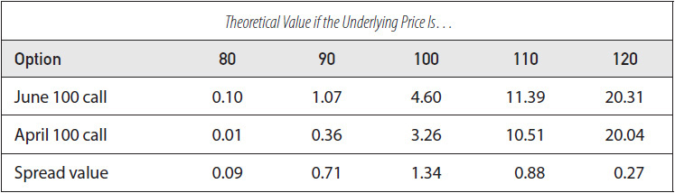

<!-- source:block 6b7557e1891e90b1 -->

> [!quote]- English 90
> Now let’s consider the effect of changing volatility on a calendar spread. The value of the April/June 100 call calendar spread at different volatilities is shown in Figure 11-21.

下面考察波动率变化的影响。4 月/6 月、执行价 100 的 Call 日历价差在不同波动率下的价值见图 11-21。

<!-- source:block 7c6636c002a249a3 -->

*图11-21随着波动率变化的日历价差的价值。 / Figure 11-21 The value of a calendar spread as volatility changes.*

<!-- source:block bd35764ad15aca24 -->

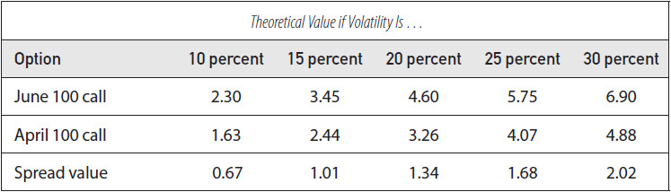

<!-- source:block a37e79bb90bb399f -->

> [!quote]- English 92
> As we raise or lower volatility, both options rise or fall in value, but the June option changes more quickly than the April option. We touched on this characteristic in Chapter 6, where we noted that a change in volatility will have a greater effect on a long-term option than on an equivalent short-term option. In other words, long-term options have greater vega values than short-term options. This difference in sensitivity to a change in volatility causes the calendar spread to widen if we increase volatility and to narrow if we reduce volatility.

当隐含波动率上升或下降时，4 月与 6 月期权的价值会同向变化，但远月的 6 月期权变化幅度更大。第 6 章已说明：其他条件相同时，长期期权对波动率变化更敏感，即 Vega 通常大于短期期权。因此，对“空近月、多远月”的多头日历价差而言，隐含波动率上升时价差扩大，隐含波动率下降时价差收窄。

<!-- source:block 90c295f60110b14e -->

> [!quote]- English 93
> A trader who is long a calendar spread wants two apparently contradictory conditions in the marketplace. First, he wants the underlying contract to sit still in order to take advantage of the greater time decay for the short-term option. Second, he wants everyone to think that the market is going to move so that implied volatility will rise, causing the long-term option to rise in price more quickly than the short-term option. Can this happen? Can the market remain unchanged yet everyone think that it will move? In fact, it happens quite often because events that do not have an immediate effect on the underlying contract may be perceived to have a future effect on the underlying.

多头日历价差的交易者希望同时出现两个看似矛盾的条件：一方面，标的价格暂时保持平稳，以利用近月空头腿更快的时间衰减；另一方面，市场参与者预期标的未来会出现较大波动，从而推高隐含波动率，使远月多头腿比近月腿增值更多。“当下不动，但市场预期以后会动”并不罕见：有些事件短期内不影响现价，却可能对未来价格造成显著影响。

<!-- source:block 578997f4f073a195 -->

> [!quote]- English 94
> The most common example occurs when news is pending that is likely to affect the underlying contract but whose exact effect is unknown. Consider a company that announces that its CEO will make an important statement one week from today. If no one knows the content of the statement, there is unlikely to be any significant change in the company’s stock price prior to the statement. But traders will assume that the statement, when it is made, will have an effect, perhaps a dramatic one, on the stock price. The possibility of future movement in the stock price will cause implied volatility to rise. This combination of conditions—the lack of movement in the underlying stock together with rising implied volatility—will cause calendar spreads to widen.

最常见的情形是：市场已知某项尚未公布的消息可能影响标的，却不知道影响的方向和幅度。例如，某公司宣布 CEO 将于一周后发表重要声明。在内容公布之前，股价未必会明显变动；但交易者预期声明可能对股价产生重大影响，对未来大幅波动的预期会推高隐含波动率。因此，“当前股价平稳 + 隐含波动率上升”的组合会使多头日历价差扩大。

<!-- source:block 7f252c3199957db7 -->

> [!quote]- English 95
> Of course, the assumption of future stock movement as a result of the CEO’s statement is just that—an assumption. If the statement turns out to be irrelevant to the company’s fortunes (the CEO wanted to announce that he and his wife just became grandparents), any presumption of future volatility is removed. The result will be a decline in implied volatility, causing calendar spreads to narrow.

当然，声明会引发股价大幅波动只是市场的预期。如果公布内容原来与公司经营无关——例如 CEO 只是宣布他和妻子刚成为祖父母——那么市场对未来大幅波动的预期就会消失。隐含波动率随之下降，日历价差也会收窄。

<!-- source:block bcda9ca5dae6834d -->

> [!quote]- English 96
> The effect of implied volatility is what distinguishes time spreads from the other types of spreads we have discussed. Long straddles, long strangles, and short butterflies all want the volatility of the underlying contract as well as implied volatility to rise (+gamma, +vega). Short straddles, short strangles, and long butterflies all want the volatility of the underlying contract as well as implied volatility to fall (–gamma, –vega). But with calendar spreads underlying volatility and implied volatility have opposite effects. A quiet market or an increase in implied volatility will help a long calendar spread (–gamma, +vega), while a big move in the underlying market or a decline in implied volatility will help a short calendar spread (+gamma, –vega). This opposite effect is what gives calendar spreads their unique characteristics.

隐含波动率的作用，是日历价差与前述其他价差策略的重要区别。多头跨式、多头宽跨式和空头蝶式都受益于标的价格波动加大以及隐含波动率上升（$+\Gamma$、$+\mathrm{Vega}$）；空头跨式、空头宽跨式和多头蝶式则受益于标的价格波动减小以及隐含波动率下降（$-\Gamma$、$-\mathrm{Vega}$）。

日历价差不同：标的价格波动与隐含波动率对头寸的影响方向相反。市场保持平静或隐含波动率上升，有利于多头日历价差（$-\Gamma$、$+\mathrm{Vega}$）；标的价格大幅变动或隐含波动率下降，则有利于空头日历价差（$+\Gamma$、$-\mathrm{Vega}$）。这种相反作用构成了日历价差的独特风险特征。

<!-- source:block 5ced4be8054a6f8c -->

> [!quote]- English 97
> Figures 11-22 and 11-23 show the value of long and short calendar spreads as time passes. Figures 11-24 and 11-25 show the value as volatility changes.

图 11-22 和图 11-23 展示了多头与空头日历价差的价值如何随时间变化；图 11-24 和图 11-25 则展示其价值如何随波动率变化。

<!-- source:block 16d96c802b01d7c3 -->

*图 11-22 时间流逝时的多头日历价差。 / Figure 11-22 Long calendar spread as time passes.*

<!-- source:block 877c50d0bcfe10e3 -->

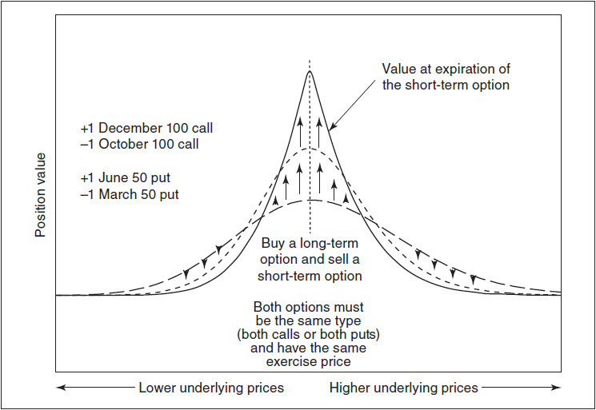

<!-- source:block 0302b95ed06e5f6e -->

*图 11-23 时间流逝时的空头日历价差。 / Figure 11-23 Short calendar spread as time passes.*

<!-- source:block 5f2997be434a8a22 -->

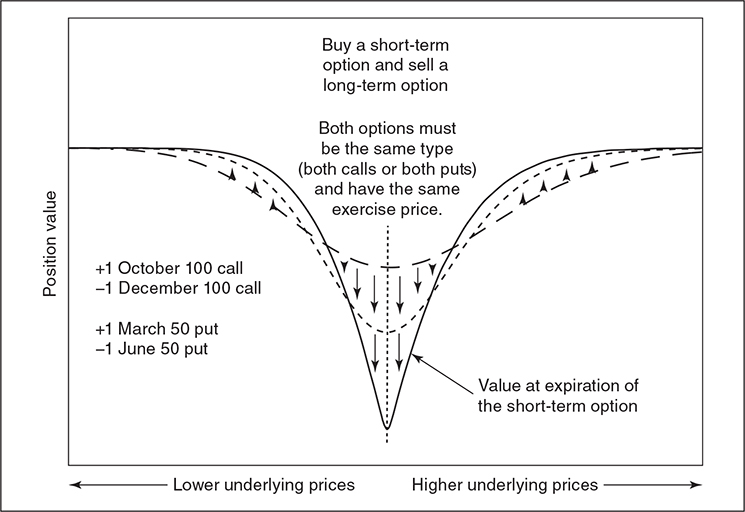

<!-- source:block eca3fef0df5956ce -->

*图 11-24 波动率下降时的多头日历价差。 / Figure 11-24 Long calendar spread as volatility declines.*

<!-- source:block 6e849084987b5fe1 -->

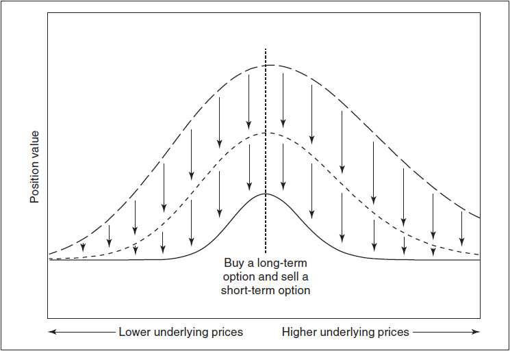

<!-- source:block eb02d1b7e1999e2d -->

*图 11-25 波动率下降时的空头日历价差。 / Figure 11-25 Short calendar spread as volatility declines.*

<!-- source:block 6aa9efaf841e795b -->

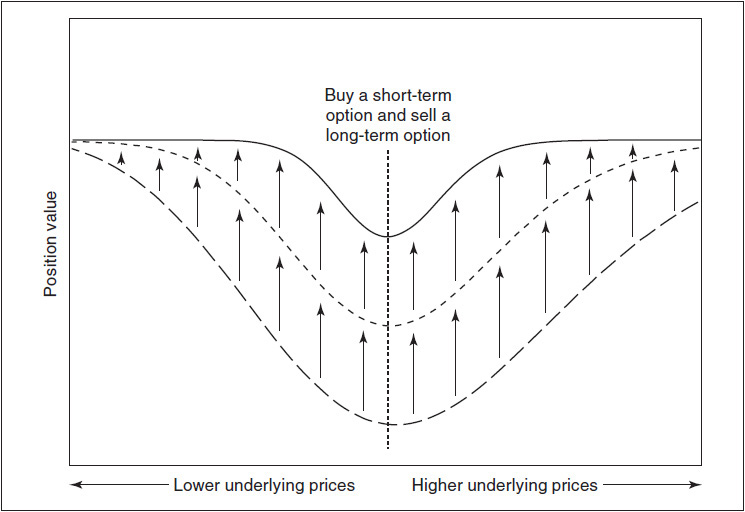

<!-- source:block 0699a3d8eab79f56 -->

> [!quote]- English 102
> Although the effects of time and volatility apply to calendar spreads in all markets, there may be other considerations, depending on the specific underlying market. In the foregoing examples, we assumed that the underlying contract for both the short- and long-term option was the same. In the stock option market, this will always be true. The underlying contract for General Electric (GE) options, regardless of the expiration month, is always GE stock. And GE stock can only have a single price at any one time. But in a futures market the underlying for a futures option is a specific futures contract, and different option expirations can have different underlying futures contracts.

时间与波动率的影响适用于各类市场中的日历价差，但具体标的还可能带来其他风险。前文假设近月和远月期权共用同一标的。对股票期权而言始终如此：无论到期月份为何，通用电气（GE）期权的标的都是同一只 GE 股票，它在同一时刻只有一个现价。但期货期权的标的是某一特定交割月份的期货合约，因此不同到期月份的期权可能对应不同的标的期货合约。

<!-- source:block a736dc323cb700f7 -->

> [!quote]- English 103
> Consider a futures market where there are four futures months: March, June, September, and December. If serial months are available, an April/June calendar spread will have the same underlying contract, June futures. But a March/June calendar spread will have one underlying contract for March options, a March future, and a different underlying contract for June options, a June future. Although one might expect March futures and June futures to move together, there is no guarantee that they will. Particularly in commodity markets, short-term supply and demand considerations can cause futures contracts on the same commodity to move in different directions. In addition to volatility considerations, a trader who buys a June/March call calendar spread must also consider the possibility that March futures will rise relative to June futures.

假设期货市场的主要交割月份是 3 月、6 月、9 月和 12 月。若交易所另外挂牌连续月份期权（serial-month options），4 月期权和 6 月期权都可能以 6 月期货为标的，因此 4 月/6 月日历价差的两腿共用同一标的合约。但 3 月期权以 3 月期货为标的，6 月期权以 6 月期货为标的，所以 3 月/6 月日历价差实际涉及两份不同的期货合约。两个月份的期货通常同向变动，但并无保证；尤其在大宗商品市场，短期供需可能使同一商品的不同合约月份向不同方向变动。因此，买入 6 月 Call、卖出 3 月 Call 的日历价差不仅有波动率风险，还必须考虑 3 月期货相对 6 月期货上涨的风险。

<!-- source:block 5e33a2a6c299923a -->

> [!quote]- English 104
> In order to offset the risk of futures contracts moving against a calendar-spread position, it is common in commodity futures markets for a trader to offset a calendar spread with an opposing position in the futures market. In our example, if a trader buys the March/June call calendar spread, he can offset the position by purchasing March futures and selling June futures.

为对冲两个月份期货相对变动对日历价差造成的风险，大宗商品期权交易者通常会同时建立方向相反的期货价差。在本例中，若买入 3 月/6 月 Call 日历价差，可通过买入 3 月期货、卖出 6 月期货来对冲。

<!-- source:block 29709085bafe09d8 -->

> [!quote]- English 105
> How many futures spreads should the trader execute? If he wants a position that is sensitive only to volatility, he ought to trade the number of futures spreads required to be delta neutral. If both calls are at the money, with deltas of approximately 50, a trader who buys 10 call calendar spreads (buy 10 June calls, sell 10 March calls) will be long 500 deltas in June and short 500 deltas in March. Therefore, he should buy 5 March futures contracts and sell 5 June futures contracts. The entire position will be (delta values are in parentheses)

应该用多少期货头寸来对冲？若目标是尽量只保留波动率暴露，就应选择能使组合 Delta 中性的期货价差数量。假设两份 Call 都是平值期权，Delta 约为 50。买入 10 组 Call 日历价差——即买入 10 份 6 月 Call、卖出 10 份 3 月 Call——会产生 6 月 $+500$ Delta 和 3 月 $-500$ Delta。因此，交易者应买入 5 份 3 月期货、卖出 5 份 6 月期货。完整头寸如下（括号内为 Delta）：

<!-- source:block 48bdfabd8827bf5f -->

> [!quote]- English 106
> +10 June calls (+500), – June futures (–500)

$$
+10 \text{June calls} (+500), -5 \text{June futures} (-500)
$$

> [!note] 译校说明
> 英文原文这一行漏写了 June futures 的合约数量；由上一段的计算可知应为卖出 5 份，因此公式按 $-5$ 校正。

<!-- source:block 0b59e6477a3c43b7 -->

> [!quote]- English 107
> –10 March calls (–500), +5 March futures (+500)

$$
-10 \text{March calls} (-500), +5 \text{March futures} (+500)
$$

<!-- source:block 359306288761e3e1 -->

> [!quote]- English 108
> This type of balancing is not necessary—indeed, not possible—in stock options because the underlying for all months is identical.

股票期权不需要、也无法按上述方式用不同月份的标的合约作跨期对冲，因为各到期月份的期权都以同一只股票为标的。

<!-- source:block 843fa0cafd0f4c75 -->

## 时间蝶式价差 / Time Butterfly

<!-- source:block cb5074bf7b7414b5 -->

> [!quote]- English 109
> In futures markets, as opposed to option markets, a butterfly is a position in three futures months. A trader will buy (sell) one each of a short- and long-term futures contract and sell (buy) two intermediate-term futures contracts. A similar type of strategy can be done in option markets. A traditional option butterfly consists of options at three different exercise prices but with the same expiration date. A time butterfly (sometimes shortened to *time fly*) consists of options at the same exercise price but with three different expiration dates. All options must be the same type (either all calls or all puts), with approximately the same amount of time between expirations. The outside expiration months are usually referred to as the *wings* and the inside expiration month as the *body*. Some typical time butterflies might be

在期货市场中，蝶式价差通常指横跨三个交割月份的头寸：交易员买入（或卖出）近月和远月期货各 1 份，同时卖出（或买入）中间月份期货 2 份。期权市场也可以构造类似的跨期组合。传统期权蝶式使用三个不同执行价、同一到期日；**时间蝶式价差**（time butterfly，也简称 time fly）则使用同一执行价、三个不同到期日的期权。所有期权必须类型相同——全部为 Call 或全部为 Put——且相邻两个到期日之间的时间间隔应大致相等。近月和远月到期腿称为**蝶翼**（wings），中间到期腿称为**蝶身**（body）。典型的时间蝶式结构如下：

<!-- source:block 66b717286fd58f16 -->

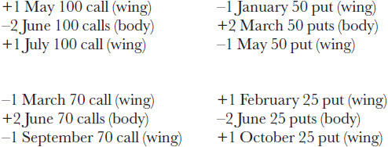

<!-- 原 EPUB 中此公式为图片，已原样保留 -->

<!-- source:block f62476310ae7c88a -->

> [!quote]- English 110
> Note that a time butterfly consists of simultaneously buying or selling a long-term calendar spread and taking an opposing position in a short-term calendar spread, where each spread has one common expiration month. The example May/June/July 100 call time butterfly consists of buying the May 100 call and selling the June 100 call (selling the May/June calendar spread) and simultaneously selling the June 100 call and buying the July 100 call (buying the June/July calendar spread).

时间蝶式可以拆成两个方向相反、并共享中间到期月份的相邻日历价差。以 5 月/6 月/7 月、执行价 100 的 Call 时间蝶式为例：

1. **卖出 5 月/6 月日历价差**：买入 5 月 100 Call，卖出 6 月 100 Call；
2. **买入 6 月/7 月日历价差**：再次卖出 6 月 100 Call，买入 7 月 100 Call。

合并两组头寸后，两组头寸中的 6 月空头合约合并为数量 $-2$ 的蝶身，得到

$$
+C_{\mathrm{May}}(100)-2C_{\mathrm{June}}(100)+C_{\mathrm{July}}(100).
$$

因此，时间蝶式是“近月与远月各 1 份、中间月 2 份反向头寸”的 $1:2:1$ 跨期结构。按下一段的命名，上述具体腿方向是**空头时间蝶式价差**。

<!-- source:block fc9c9bfec4227640 -->

> [!quote]- English 111
> If all options remain at the money, as time passes, the value of a calendar spread will increase. The short-term spread must therefore be worth more than the long-term spread. Consequently, if we buy the short-term calendar spread and sell the long-term calendar spread (buying the body and selling the wings), in total, we will pay more than we receive. Because the entire position will result in a debit, we are *long* the time butterfly. If we do the opposite, selling the short-term calendar spread and buying the long-term spread (selling the body and buying the wings), we are *short* the time butterfly.7 This can be somewhat confusing because in a traditional butterfly consisting of different exercise prices, the combination of buying the wings and selling the body results in a debit. But in a time butterfly consisting of different expiration months, buying the wings and selling the body results in a credit.

假定所有到期月份的隐含波动率相同，且各期权始终处于 ATM。随着近月到期日逼近，日历价差的价值会增加；因此，由较早两个到期月份组成的**近端日历价差**，会比由较晚两个到期月份组成的**远端日历价差**更值钱。以 5 月、6 月和 7 月期权为例：

- **多头时间蝶式价差**：买入 5 月/6 月日历价差（卖出 5 月、买入 6 月），同时卖出 6 月/7 月日历价差（买入 6 月、卖出 7 月）。合并后为“卖出两翼、买入两份蝶身”，即 $-C_{\text{May}}+2C_{\text{June}}-C_{\text{July}}$；通常产生净借记（debit）。
- **空头时间蝶式价差**：将上述各腿全部反向，即“买入两翼、卖出两份蝶身”，头寸为 $+C_{\text{May}}-2C_{\text{June}}+C_{\text{July}}$；通常产生净贷记（credit）。

容易混淆的是：传统蝶式价差按**行权价**排列，买入蝶翼、卖出蝶身的多头组合通常是净借记；时间蝶式价差则按**到期月份**排列，同样的“买翼、卖身”在本书的命名中属于空头时间蝶式，并通常是净贷记。 [^ovp11-7]

<!-- source:block 6ae9c5477503ea03 -->

> [!quote]- English 112
> The value of a long time butterfly as time passes and as volatility falls is shown in Figures 11-26 and 11-27. The value of the spread will tend to collapse as the underlying contract moves away from the exercise price, implying that the spread has a negative gamma. Consequently, the spread must also have a positive theta. Finally, the value of the spread falls as volatility declines, implying that the spread has a positive vega. In sum, a long time butterfly has characteristics similar to those of a long calendar spread.

图 11-26 和图 11-27 展示了多头时间蝶式价差的价值如何随时间流逝和波动率下降而变化。当标的价格远离行权价时，该价差的价值往往迅速收缩，说明其 Gamma 为负，因此 Theta 为正；其价值也会随波动率下降而降低，说明 Vega 为正。总体而言，多头时间蝶式价差的风险特征与多头日历价差相似。

<!-- source:block 3c6170d036e3ec73 -->

*图11-26随着时间的推移，多头时间蝶式价差。 / Figure 11-26 Long time butterfly as time passes.*

<!-- source:block 6b2c29ce42bb37da -->

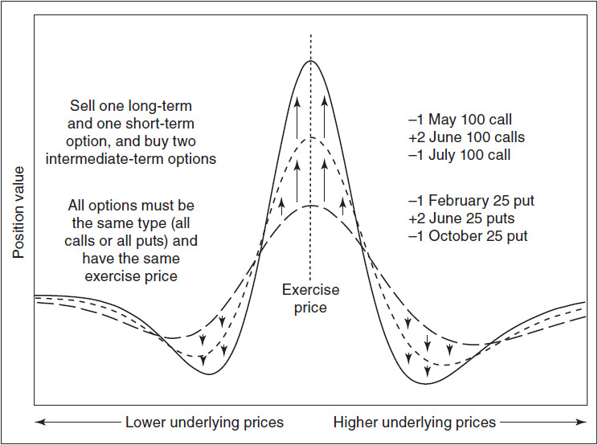

<!-- source:block fec594b57d5c9ec0 -->

*Figure 11-27 Long time butterfly as volatility declines. / Figure 11-27 Long time butterfly as volatility declines.*

<!-- source:block b8a395f80272a35c -->

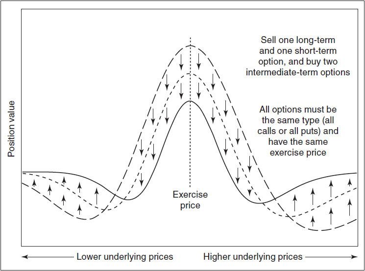

<!-- source:block c1f63e7a2cc37f6c -->

## 利率与股息变化的影响 / Effect of Changing Interest Rates and Dividends

<!-- source:block 0c7f20a106c8bdb8 -->

> [!quote]- English 115
> Thus far we have considered only the effects of changes in underlying price, time, and volatility on the value of a volatility spread. What about changes in interest rates and, in the case of stocks, dividends?

到目前为止，我们仅考虑了标的价格、时间和波动率的变化对波动率价差价值的影响。利率的变化又如何？就股票而言，股息的变化又如何？

<!-- source:block 15d687f91a29bef7 -->

> [!quote]- English 116
> Because there is no carrying cost associated with the purchase or sale of a futures contract, interest rates have only a minor impact on futures options and, consequently, a relatively minor effect on the value of all futures option volatility spreads.8 However, in a stock option market, a change in interest rates will cause the forward price of stocks to change. If all options in a spread expire at the same time, the change in forward price is likely to affect all options equally, causing only small changes in the value of the spread. However, if we have a stock option position involving two different expiration dates, we must consider two different forward prices. And these two forward prices may not be equally sensitive to a change in interest rates.

建立期货合约多空头寸本身不需像现货买卖那样支付全额持有成本，因此利率对期货期权的影响通常较小，对期货期权波动率价差的影响也相对有限。[^ovp11-8] 股票期权则不同：利率变化会改变股票的远期价格。若价差中所有期权同日到期，远期价格变化往往近似同等地影响各腿，因而对净价差的影响较小。若两腿的到期日不同，则对应两个不同的股票远期价格，二者对利率变化的敏感度也可能不同。

<!-- source:block 055c88454602d80e -->

> [!quote]- English 117
> Consider the following situation:

考虑以下情况：

<!-- source:block 02c711dcee53d17c -->

> [!quote]- English 118
> Stock price = 100 interest rate = 8.00% dividend = 0

$$
\text{股票现价}=100,\qquad \text{利率}=8.00\%,\qquad \text{股息}=0
$$

<!-- source:block bab88cacdc233037 -->

> [!quote]- English 119
> Suppose that a trader buys a call calendar spread:

假设交易者买入如下 Call 日历价差：

<!-- source:block b72cd0e9ca686afe -->

> [!quote]- English 120
> +10 June 100 calls–10 March 100 calls

买入 10 份 6 月到期、行权价 100 的 Call；卖出 10 份 3 月到期、行权价 100 的 Call。

<!-- source:block 52556e843f04103c -->

> [!quote]- English 121
> If there are three months remaining to March expiration and six months remaining to June expiration, the forward prices for March stock and June stock are 102.00 and 104.00, respectively. If interest rates rise to 10 percent, the forward price for March will be 102.50 and the forward price for June will be 105. With more time remaining to June expiration, the June forward price is more sensitive to a change in interest rates. Assuming that the deltas of both options are approximately equal, the June option will be more affected by the increase in interest rates than the March option, and the calendar spread will expand. In the same way, if interest rates decline, the calendar spread will narrow because the June forward price will fall more quickly than the March forward price. A long call calendar spread in the stock option market must therefore have a positive rho, and a short call calendar spread must have a negative rho.

假设距离 3 月到期还有三个月，距离 6 月到期还有六个月，则与两个到期日对应的股票远期价格分别为 102.00 和 104.00。若利率升至 10%，两个远期价格将分别升至 102.50 和 105.00。由于 6 月到期日更远，其远期价格对利率更敏感。若两腿 Call 的 Delta 大致相等，利率上升时，远月 Call 的增值将大于近月 Call，因而“空近月、多远月”的多头 Call 日历价差扩大。利率下降时方向相反，价差收窄。因此，在上述假设下，多头 Call 日历价差的 Rho 为正，空头 Call 日历价差的 Rho 为负。

<!-- source:block 04402f7950df3356 -->

> [!quote]- English 122
> Changes in interest rates have the opposite effect on stock option puts. In our example, if interest rates rise from 8 to 10 percent, the June forward price will rise more than the March forward price. If we assume, again, that the deltas of both options are approximately equal, and recalling that puts have negative deltas, the June put will show a greater decline in value than the March put. The put calendar spread will therefore narrow. In the same way, if interest rates decline, the put calendar spread will expand. A long put calendar spread in the stock option market must therefore have a negative rho, and a short put calendar spread must have a positive rho.

利率变化对 Put 的影响方向与 Call 相反。在上例中，利率从 8% 升至 10% 时，6 月远期价格的升幅大于 3 月远期价格。若两腿 Put 的 Delta 大致相等（且均为负），远月 Put 的跌幅将大于近月 Put，因而多头 Put 日历价差收窄。利率下降时方向相反，价差扩大。因此，在上述假设下，多头 Put 日历价差的 Rho 为负，空头 Put 日历价差的 Rho 为正。

> [!important] Call 与 Put 日历价差的利率方向
> 对标准多头日历价差（空近月、多远月），并在两腿 Delta 约略相当的局部条件下：
> - 多头 **Call** 日历价差：利率上升时通常增值，$\rho>0$；空头相反。
> - 多头 **Put** 日历价差：利率上升时通常减值，$\rho<0$；空头相反。
> Rho 是对利率微小变化的局部模型敏感度，不是在标的价格、波动率曲面与股息同时变动时的盈亏保证。

<!-- source:block 97a6a455b85dabca -->

> [!quote]- English 123
> The degree to which stock option calendar spreads are affected by changes in interest rates depends primarily on the amount of time between expirations. If there are six months between expirations (e.g., March/September), the effect will be much greater than if there is only one month between expirations (e.g., March/April).

股票期权日历价差对利率的敏感程度，主要取决于两个到期月份之间的间隔。例如，3 月/9 月价差相隔六个月，利率变化对它的影响通常远大于仅相隔一个月的 3 月/4 月价差。

<!-- source:block 835dbb968a367aa5 -->

> [!quote]- English 124
> Changes in dividends can also affect the value of stock option calendar spreads because it may change the forward price of the stock. Dividends, however, have the opposite effect on stock options as changes in interest rates. An increase in the dividend lowers the forward price of stock, while a cut in the dividend raises the forward price. If all options expire at the same time, the change in the forward price for the stock will have an equal effect on all options, and the change in the value of a spread will be negligible. But in a calendar spread, if at least one dividend payment is expected between the expiration dates, an increase in dividends will cause a call calendar spread to narrow and put calendar spread to expand. A decrease in dividends will have the opposite effect, causing a call calendar spread to widen and a put calendar spread to narrow. Even though there is no Greek letter associated with dividend risk, we might say that a call calendar spread has negative dividend risk (its value falls as dividends rise) and a put calendar spread has positive dividend risk (its value rises as dividends rise). Examples of the effects of changing interest rates and dividends on stock option calendar spreads are shown in Figure 11-28.

股息变化也会通过改变股票的远期价格，影响股票期权日历价差。股息与利率对远期价格的影响方向相反：股息增加会压低远期价格，股息减少则会推高远期价格。如果各腿同时到期，这种远期价格变化对各腿的影响大致相抵，对价差净值的影响很小。但对日历价差而言，如果两个到期日之间预计至少支付一次股息，股息增加会使 Call 日历价差收窄、Put 日历价差扩大；股息减少则使 Call 日历价差扩大、Put 日历价差收窄。虽然股息风险没有专属的希腊字母名称，但可以说 Call 日历价差具有负股息敏感度（股息上升时价差价值下降），Put 日历价差具有正股息敏感度（股息上升时价差价值上升）。图 11-28 汇总了利率与股息变化对股票期权日历价差的影响。

<!-- source:block 82947987c8eb524c -->

*图 11-28 利率与股息变化对股票期权日历价差的影响。 / Figure 11-28 Effect of changing interest rates and changing dividends on stock option calendar spreads.*

<!-- source:block 3e998a0a21880c41 -->

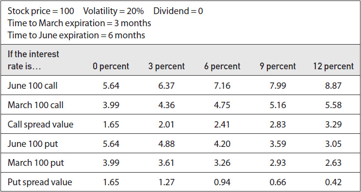

<!-- source:block f45e38fdd0fef486 -->

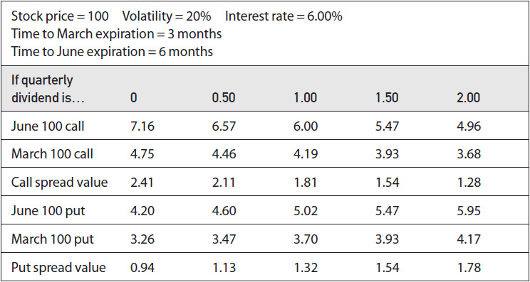

<!-- source:block f622973ad80f940f -->

> [!quote]- English 126
> In Figure 11-28, we can see that an increase in interest rates will reduce the value of a put calendar spread and an increase in dividends will reduce the value of a call calendar spread. Indeed, if we raise interest rates high enough, the put calendar spread can take on a negative value, with the long-term put having a lower value than the short-term put. The same will be true for a call calendar spread if we increase dividends enough. If a stock pays no dividends, the value of a call calendar spread should always have some value greater than 0. Even if volatility is very low, the spread should still be worth a minimum of the cost of carry on the stock between expiration months. This is only true, however, if a trader can carry a short stock position between expiration months. If a situation arises where no stock can be borrowed, the trader who owns a call calendar spread may be forced to exercise his long-term option, thereby losing the time value associated with the option. This is sometimes referred to as a *short squeeze*.

图 11-28 表明：利率上升会降低看跌日历价差的价值，股息增加则会降低看涨日历价差的价值。若利率高到一定程度，远月 Put 甚至可能比近月 Put 便宜，使多头 Put 日历价差呈负值；股息率足够高时，Call 日历价差也可能出现对应情形。对不支付股息的股票，Call 日历价差的理论价值应始终大于 0；即使波动率很低，其最低价值仍来自两个到期月份之间的股票持有成本。但这一结论要求交易者能在两个到期月份之间持续维持股票空头。若股票无法借入，持有 Call 日历价差的交易者可能被迫提前行权远月期权，因而牺牲其时间价值。这种情形称为**逼空**（short squeeze）。

<!-- source:block 2449fec734fef42f -->

## 对角价差 / Diagonal Spreads

<!-- source:block 2637737255807d4e -->

> [!quote]- English 127
> A *diagonal spread* is similar to a calendar spread except that the options have different exercise prices. Although many diagonal spreads are executed one to one (one long-term option for each short-term option), diagonal spreads can also be ratioed, with unequal numbers of long and short market contracts. With the large number of variations in diagonal spreads, it is almost impossible to generalize about their characteristics. Each diagonal spread must be analyzed separately to determine the risks and rewards associated with the spread.

对角价差与日历价差类似，但两条腿的行权价也不相同。许多对角价差按 $1{:}1$ 的数量比建仓，即一份远月期权对应一份近月期权，两者持仓方向相反；也可采用多头与空头合约数量不等的比例结构。由于对角价差的变体极多，几乎无法对其风险收益特征作统一概括；必须逐一分析具体组合。

<!-- source:block 43aa4348622b79b0 -->

> [!quote]- English 128
> There is, however, one type of diagonal spread about which we can generalize. If a diagonal spread is done one to one and both options are of the same type and have approximately the same delta, the diagonal spread will act very much like a conventional calendar spread. Examples of this type of diagonal spread are shown in Figure 11-29 (delta values are in parentheses).

不过，有一类对角价差可以作大致概括：若两腿数量比为 $1{:}1$，且期权类型相同、Delta 也大致相等，该组合的表现会很像传统日历价差。图 11-29 给出了这类对角价差的示例（括号内为 Delta 值）。

<!-- source:block 1b72bda19fb03283 -->

*Figure 11-29 Diagonal spreads. / Figure 11-29 Diagonal spreads.*

<!-- source:block 74de1d0069e6e980 -->

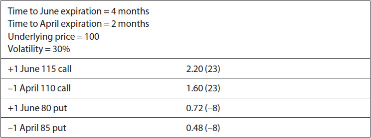

<!-- source:block 4b5bc4bc8774df0c -->

> [!quote]- English 130
> Even though there are many different volatility spreads, traders tend to classify spreads in terms of their basic volatility characteristics. While some volatility spreads may prefer movement in one direction rather than the other, a trader who initiates a volatility spread is concerned primarily with the magnitude of movement in the underlying contract and only secondarily with the direction of movement. Therefore, all volatility spreads tend to be approximately delta neutral. If a trader has a large positive or negative delta such that directional considerations become more important than volatility considerations, the position can no longer be considered a volatility spread.

尽管存在许多不同的波动率价差，但交易员倾向于根据其基本波动率特征对价差进行分类。虽然一些波动率价差可能更喜欢一个方向而不是另一个方向的移动，但发起波动率价差的交易员主要关心标的合约的移动幅度，其次才关心移动方向。因此，所有波动率价差往往大致为Delta中性。如果交易者有很大的正或负的Delta，使得方向性考虑变得比波动率考虑更重要，则该头寸不能再被视为波动率价差。

<!-- source:block c039d94688f9f741 -->

> [!quote]- English 131
> All spreads that are helped by movement in the underlying market have a positive gamma. All spreads that are hurt by movement in the underlying market have a negative gamma. A trader who has a positive gamma position is said to be *long premium* and is hoping for a volatile market with large moves in the underlying contract. A trader who has a negative gamma is said to be *short premium* and is hoping for a quiet market with only small moves in the underlying market.

能从标的价格变动中受益的价差具有正 Gamma；标的价格变动会使其受损的价差则具有负 Gamma。持有正 Gamma 头寸的交易者被称为**做多权利金（long premium）**：他希望市场波动加剧，标的合约出现较大幅度的变动。持有负 Gamma 头寸的交易者则被称为**做空权利金（short premium）**：他希望市场保持平稳，标的只发生小幅变动。

> [!note] 这里的“受益于变动”是局部曲率概念
> 上述结论针对 Delta 大致中性、或持续进行 Delta 对冲的头寸。Gamma 描述的是标的价格变动所带来的二阶局部影响；对未对冲头寸，初始 Delta、Theta、隐含波动率及跳空都可能主导实际盈亏。

<!-- source:block 3ba1e524085db497 -->

> [!quote]- English 132
> Because the effect of market movement and the effect of time decay always work in opposite directions, any spread with a positive gamma will necessarily have a negative theta, and any spread with a negative gamma will necessarily have a positive theta. If market movement helps, the passage of time hurts, and if market movement hurts, the passage of time helps. An option trader cannot have it both ways.

在本章所讨论的、大致 Delta 中性的波动率价差中，标的价格变动与时间衰减通常作用相反：正 Gamma 价差通常伴随负 Theta，负 Gamma 价差通常伴随正 Theta。如果标的变动对头寸有利，时间流逝往往对头寸不利；如果标的变动对头寸不利，时间流逝则往往对头寸有利。也就是说，交易者通常不能同时免费获得“变动收益”和“时间衰减收益”。

<!-- source:block ab39900f8929be11 -->

> [!quote]- English 133
> Finally, spreads that are helped by rising volatility have a positive vega. Spreads that are helped by falling volatility have a negative vega. In theory, the vega refers to the sensitivity of a theoretical value to a change in the volatility of the underlying contract over the life of the option. In practice, however, traders associate the vega with the sensitivity of an option’s price to a change in implied volatility. Spreads with a positive vega will be helped by any increase in implied volatility and hurt by any decline; spreads with a negative vega will be helped by any decline in implied volatility and hurt by any increase. The delta, gamma, theta, and vega characteristics of the primary types of volatility spreads are summarized in Figure 11-30.

最后，隐含波动率上升时受益的价差具有正 Vega；隐含波动率下降时受益的价差具有负 Vega。从理论上说，Vega 衡量期权理论价值对“标的在期权剩余期限内的波动率”这一模型输入的敏感度；在实际交易中，交易者通常把它理解为期权价格对隐含波动率变化的局部敏感度。因此，在当前市场状态附近，隐含波动率上升通常有利于正 Vega 价差、不利于负 Vega 价差；隐含波动率下降时方向相反。图 11-30 汇总了主要波动率价差的 Delta、Gamma、Theta 和 Vega 特征。

> [!note] 净 Vega 不等于整条曲面风险
> 上述判断假设各腿的隐含波动率发生近似平行的小幅变化。若变化的是不同执行价之间的[[波动率偏斜 Skew|偏斜]]、曲率或不同到期月份之间的期限结构，即使头寸的净 Vega 接近零，也可能出现显著损益。

<!-- source:block ed3370c3e713f8c8 -->

*图 11-30 常见波动率价差摘要。 / Figure 11-30 Summary of common volatility spreads.*

<!-- source:block d5687133d1aaffbe -->

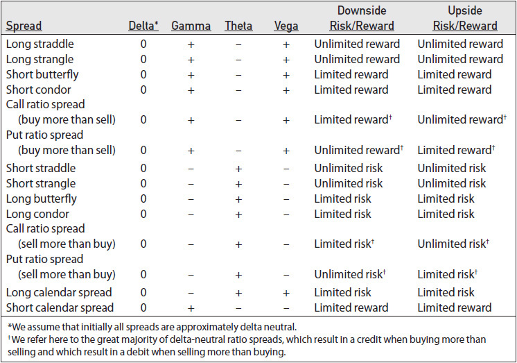

<!-- source:block 8db40b416ace60c3 -->

> [!quote]- English 135
> Because volatility spreads tend to be delta neutral and the theta and gamma are always of opposite sign, we can place volatility spreads into one of four categories depending on the effect of movement in the underlying contract (positive or negative gamma) and the effect of changes in implied volatility (positive or negative vega):

由于波动率价差往往是Delta中性的，并且Theta和Gamma总是相反的符号，因此我们可以根据标的合约变动的影响（正或负Gamma）和隐含波动率变化的影响（正或负Vega）将波动率价差分为四种类型之一：

<!-- source:block cd9cbf4bf9b7e90f -->

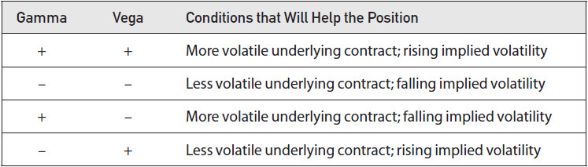

<!-- source:block 0caa2927b08f1779 -->

> [!quote]- English 136
> Of course, within each of these categories, some spreads will have larger gamma or vega values and some spreads will have smaller values. Of these, straddles and strangles tend to have the largest gamma and vega values and therefore the greatest risk. They will result in the greatest profit when the trader is correct in his assessment of market conditions, but they will result in the greatest loss when the trader is wrong. Butterflies and condors are at the other end of the spectrum. These spreads yield smaller profits when the trader is right but also result in smaller losses when the trader is wrong. Ratio spreads and Christmas trees fall somewhere in between.

当然，即使属于同一类，不同价差的 Gamma 或 Vega 暴露大小也会不同。跨式和宽跨式通常处于这一风险—收益连续谱上暴露较大的一端：它们的 Gamma 和 Vega 绝对值往往较大，因而对标的波动和隐含波动率的判断正确时，潜在收益幅度较大；判断错误时，潜在损失幅度也较大。蝶式价差和鹰式价差处于这一连续谱的另一端：判断正确时收益通常较小，判断错误时损失通常也较小。比率价差和圣诞树价差大致介于两者之间。

> [!note] 理解“连续谱”
> 这是在持仓规模可比、仓位近似 Delta 中性的语境下，对局部 Gamma 和 Vega 暴露幅度所作的相对比较，并不是对任意头寸的无条件风险排名。

<!-- source:block 33a53d48b455d584 -->

> [!quote]- English 137
> Volatility spreads can be further distinguished by their limited or unlimited risk-reward characteristics, both on the upside and on the downside. These characteristics are also summarized in Figure 11-30.

波动率价差还可按照标的价格上涨与下跌两个方向上的风险和收益是有限还是无限，作进一步区分。图 11-30 也总结了这些特征。

<!-- source:block b5c835fd8593c4c6 -->

> [!quote]- English 138
> Figure 11-31 is an evaluation table with the theoretical value, delta, gamma, theta, vega, and rho of several different options. Following this table are examples of volatility spreads of the types discussed in this chapter, along with their total delta, gamma, theta, vega, and rho. (Although the examples in Figure 11-31 assume that the underlying is stock, except for the rho, the characteristics of each type of spread will tend to be the same for options on futures.) The reader will see that each spread does indeed have the positive or negative sensitivities summarized in Figure 11-30. Note also that a volatility spread need not be exactly delta neutral. (Indeed, as we saw in Chapter 7, no trader can say with absolute certainty whether a position is really delta neutral.) In practice, a volatility spread should have a delta that is small enough that the directional considerations are less important than the volatility considerations. This is often a subjective judgment.

图 11-31 先列出若干期权的理论价值以及 Delta、Gamma、Theta、Vega 和 Rho，随后给出本章各类波动率价差的示例及其组合 Greeks。图中标的假设为股票；除 Rho 受定价与结算结构影响外，同类期货期权价差通常也呈现相似的风险特征。各示例的正负敏感度与图 11-30 的总结一致。但波动率价差无须精确 Delta 中性；正如第 7 章所述，交易者也无法绝对确定某头寸是否真正中性。实务中的要求是净 Delta 足够小，使方向风险不至于压过波动率暴露；“足够小”通常需要根据头寸规模与风险容忍度主观判断。

<!-- source:block 962b654bcff4a2cf -->

*图11-31常见波动率价差示例。 / Figure 11-31 Examples of common volatility spreads.*

<!-- source:block eb972e2c35061857 -->

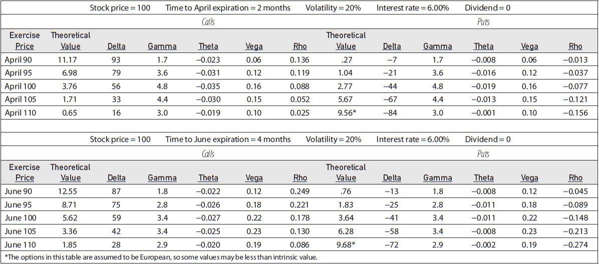

<!-- source:block e0c227751b1db045 -->

> [!quote]- English 140
> Also included in Figure 11-31 is the theoretical value of each spread. This is simply the cash flow that results if each spread is executed at theoretical value. Purchases of options result in a cash debit (indicated with a negative sign), and sales represent a cash credit (indicated with a positive sign). In common terminology, a trader is said to be long the spread if it results in a cash debit and short the spread if it results in a cash credit.

图 11-31 还列出了每种价差的理论价值，即各价差按理论价值成交时产生的现金流。买入期权产生 `cash debit`（以负号表示），卖出期权产生 `cash credit`（以正号表示）。按市场惯例，产生 `cash debit` 的价差称为多头价差，产生 `cash credit` 的价差称为空头价差。

<!-- source:block 691e6e7da96231d5 -->

> [!quote]- English 141
> Note that no price is given for any of the option contracts in Figure 11-31, and therefore, no theoretical edge can be calculated for any of the spreads. The prices at which a spread is executed may be good or bad, resulting in a positive or negative theoretical edge. But, once the spread has been established, the market conditions that will help or hurt the spread are determined by its characteristics, not by the initial prices. Like all traders, an option trader must not let his previous trading activity affect his current judgment. A trader’s primary concern should not be what happened yesterday but what can be done today to make the most of the current situation, whether attempting to maximize a potential profit or minimize a potential loss.

图 11-31 没有给出各期权的实际市场价格，因此无法计算任何价差的理论优势。价差的实际成交价可能有利也可能不利，对应正或负的理论优势。但头寸一旦建立，之后哪些市场变化有利、哪些不利，取决于该策略的风险特征，而不是最初的成交价。交易者不应让过去的成交影响对当前市场的判断；重点不是昨天发生了什么，而是今天如何在现有条件下扩大潜在收益或限制潜在损失。

<!-- source:block 097bcc4b3590ac7f -->

## 选择合适的策略 / Choosing an Appropriate Strategy

<!-- source:block b4ff2d7ef898ab8a -->

> [!quote]- English 142
> With so many spreads available, how can we decide which type of spread is best? First and foremost, we will want to choose spreads that have a positive theoretical edge to ensure that if we are right about market conditions, we have a reasonable expectation of showing a profit. Ideally, we want to construct a spread by purchasing options that are underpriced (too cheap) and selling options that are overpriced (too expensive). If we can do this, the resulting spread, whatever its type, will always have a positive theoretical edge.

面对众多价差，应如何选择？首要原则是尽量选择具有**正理论优势**的组合，使市场判断正确时具有合理的获利期望。理想情形是买入被低估的期权、卖出被高估的期权；若能如此构建，无论组合属于哪一类型，都会具有正理论优势。

<!-- source:block e920e1d14ba7d210 -->

> [!quote]- English 143
> More often, however, our opinion about volatility will result in all options appearing either overpriced or underpriced. When this happens, it will be impossible to both buy and sell options at advantageous prices. Such a market can be easily identified by comparing our volatility estimate with the implied volatility in the option marketplace. If implied volatility is lower than the volatility estimate, options will be underpriced. If implied volatility is higher than our estimate, options will be overpriced. This leads to the following principle:

更常见的是，我们对波动率的判断会使各行权价的期权整体看起来都偏贵或都偏便宜，此时无法同时在买入腿与卖出腿上都获得有利价格。将自己的波动率估计与市场隐含波动率比较，就能识别这类情形：市场隐含波动率低于自己的估计时，期权显得低估；反之则显得高估。由此可得下列原则：

<!-- source:block f9370ad87ca3d939 -->

> [!quote]- English 144
> *If implied volatility is low, such that options generally appear underpriced, look for spreads with a positive vega. If implied volatility is high, such that options generally appear overpriced, look for spreads with a negative vega*.

若隐含波动率较低、期权整体显得低估，应寻找正 Vega 价差；若隐含波动率较高、期权整体显得高估，应寻找负 Vega 价差。

<!-- source:block 08e83ff6ee1fdbfd -->

> [!quote]- English 145
> The theoretical values and deltas in Figure 11-31 have been reproduced in Figures 11-32 and 11-33, but now prices have been included, reflecting implied volatilities that differ from the volatility input of 20 percent. The prices in Figure 11-32 reflect an implied volatility of 17 percent. In this case, only spreads with a positive vega will have a positive theoretical edge:

图11-31中的理论值和Delta已在图11-32和11-33中再现，但现在价格已被包括在内，反映了与20%的波动率输入不同的隐含波动率。图11-32中的价格反映了17%的隐含波动率。在这种情况下，只有具有正Vega的价差才会具有正的理论优势：

<!-- source:block 4599503a7c516be6 -->

> [!quote]- English 146
> Long straddles and strangles

多头跨式和多头宽跨式

<!-- source:block 848d105d597051f4 -->

> [!quote]- English 147
> Short butterflies and condors

空头蝶式价差和空头鹰式价差

<!-- source:block abfba94401925698 -->

> [!quote]- English 148
> Ratio spreads—long more than short (including short Christmas trees)

比率价差——多头合约数大于空头合约数（包括空头圣诞树价差）

<!-- source:block 403d2cc6cb6af904 -->

> [!quote]- English 149
> Long calendar spreads

多头日历价差

<!-- source:block 2a31bfd6e862594f -->

*图11-32 / Figure 11-32*

<!-- source:block e99006e0865eade8 -->

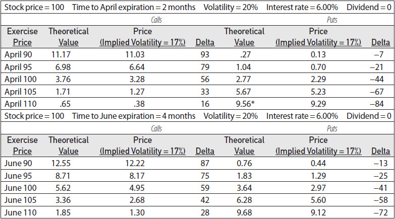

<!-- source:block 461520d82ac3e314 -->

*图11-33 / Figure 11-33*

<!-- source:block 0ec5f85b442b4fd6 -->

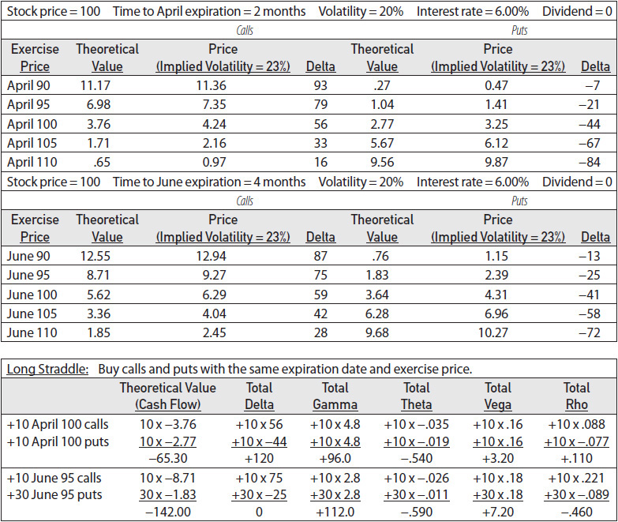

<!-- source:block 41166213fbe883e9 -->

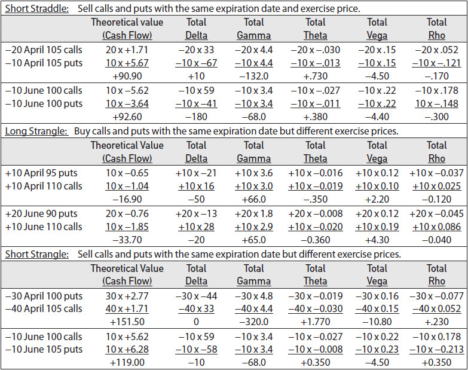

<!-- source:block be951d7b07d296ba -->

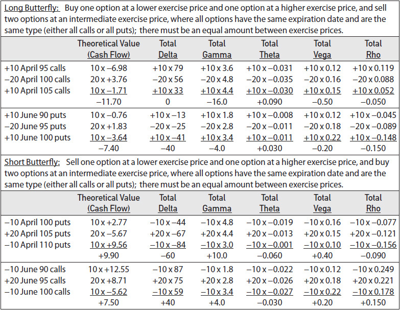

<!-- source:block e3df5712e16025d9 -->

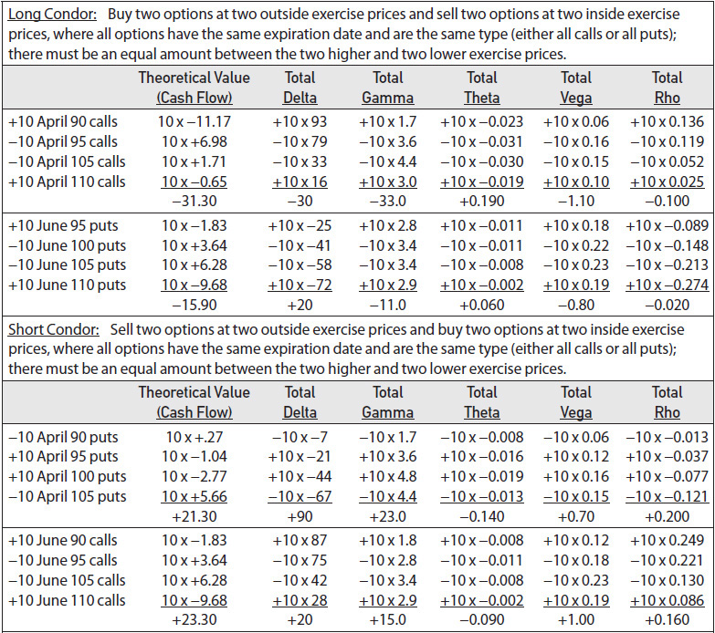

<!-- source:block 9828b498403ccb88 -->

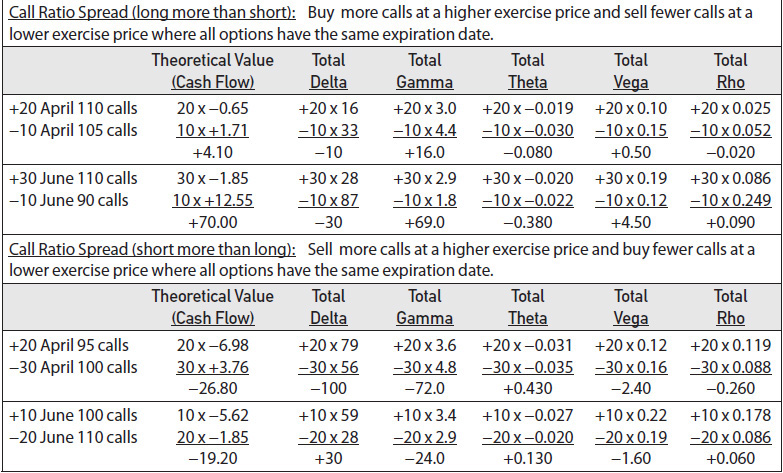

<!-- source:block a8c4572cde8c43a5 -->

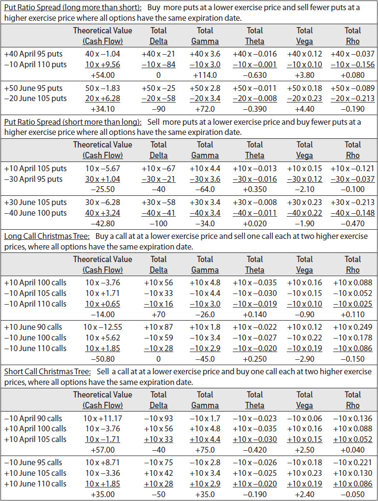

<!-- source:block 8d42ea0cacaaa53b -->

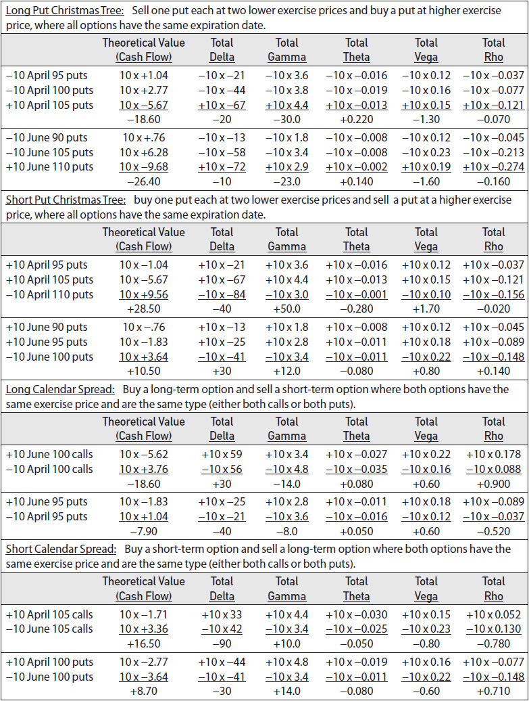

<!-- source:block abf979ea69d53ea8 -->

> [!quote]- English 152
> The prices in Figure 11-33 reflect an implied volatility of 23 percent. Now only spreads with a negative vega will have a positive theoretical edge:

图11-33中的价格反映了23%的隐含波动率。现在只有负Vega的价差才会具有正的理论优势：

<!-- source:block 223bfa0d05a88360 -->

> [!quote]- English 153
> Short straddles and strangles

空头跨式和空头宽跨式

<!-- source:block a0bc41308e74d2fe -->

> [!quote]- English 154
> Long butterflies and condors

多头蝶式价差和多头鹰式价差

<!-- source:block becf41dee3c2247f -->

> [!quote]- English 155
> Ratio spreads—short more than long (including long Christmas trees)

比率价差——空头合约数多于多头合约数（包括多头圣诞树价差）

<!-- source:block 277abb27aa5d3f8e -->

> [!quote]- English 156
> Short calendar spreads

空头日历价差

<!-- source:block 6378fc492f81a71b -->

> [!quote]- English 157
> It may seem that if one encounters a market where all options are either underpriced or overpriced, the sensible strategies are either long straddles and strangles or short straddles and strangles. Such strategies will enable a trader to take a position with a positive theoretical edge on both sides of the spread. Straddles and strangles are certainly possible strategies when all options are too cheap or too expensive. But we will see in Chapter 13 that straddles and strangles, while often having a large positive theoretical edge, can also be among the riskiest of all strategies. For this reason, a trader will often want to consider other spreads such as ratio spreads and butterflies, even if such spreads entail buying some overpriced options or selling some underpriced options.

当市场上的期权整体偏便宜或整体偏贵时，看似最直接的选择是分别买入或卖出跨式、宽跨式，因为这些组合的两条腿都能获得正理论优势。这些策略确实可行，但第 13 章将说明：跨式和宽跨式虽然往往具有较大的正理论优势，也可能属于风险最高的策略。因此，交易者常会考虑比率价差或蝶式等其他结构，即使这意味着同时买入一部分高估期权，或卖出一部分低估期权。

<!-- source:block f0621dec3fb2d994 -->

> [!quote]- English 158
> An important assumption in traditional theoretical pricing models is that volatility is constant over the life of an option. The volatility input into the model is assumed to be the one volatility that best describes price fluctuations in the underlying instrument over the life of the option. When all options expire at the same time, it is this one volatility that will, in theory, determine whether a spread is profitable or unprofitable. But a trader may also believe that implied volatility will rise or fall over time.

传统理论定价模型中的一个重要假设是，波动率在期权的有效期内是恒定的。假设模型中的波动率输入是最能描述期权有效期内标的工具价格波动的一种波动率。当所有期权同时到期时，理论上，正是这种波动率将决定价差是有利可图还是无利可图。但交易员也可能相信隐含波动率会随着时间的推移而上升或下降。

<!-- source:block 3ce73e1358953af1 -->

> [!quote]- English 159
> Because calendar spreads are particularly sensitive to changes in implied volatility, rising or falling implied volatility will often affect the profitability of calendar spreads. Consequently, we can add this corollary to the other spread guidelines:

由于日历价差对隐含波动率的变化特别敏感，隐含波动率的上升或下降往往会影响日历价差的盈利能力。因此，我们可以将这个推论添加到其他价差准则中：

<!-- source:block 5e5e12a93616bc07 -->

> [!quote]- English 160
> *Long calendar spreads are likely to be profitable when implied volatility is low but is expected to rise; short calendar spreads are likely to be profitable when implied volatility is high but is expected to fall*.

当隐含波动率较低但预计将上升时，多头日历价差更可能盈利；当隐含波动率较高但预计将下降时，空头日历价差更可能盈利。

<!-- source:block a350636ae2e2d0a3 -->

> [!quote]- English 161
> These are only general guidelines, and an experienced trader may decide to violate them if he has reason to believe that the implied volatility will not correlate with the volatility of the underlying contract. A long calendar spread might still be desirable in a high-implied-volatility market, but the trader must make a prediction of how implied volatility might change with changes in realized volatility. If the market stagnates, with no movement in the underlying contract, but the trader feels that implied volatility will remain high, a long calendar spread is a sensible strategy. The short-term option will decay, while the long-term option will retain its value. In the same way, a short calendar spread might still be desirable in a low-implied-volatility market if the trader feels that the underlying contract is likely to make a large move with no commensurate increase in implied volatility.

这些只是一般性准则。如果经验丰富的交易者认为隐含波动率不会随标的实际波动同步变化，也可以采用相反判断。在高隐含波动率环境中，多头日历价差仍可能合理，但交易者必须判断隐含波动率会如何响应已实现波动率的变化。若标的价格保持平稳，而交易者预计隐含波动率仍将维持高位，多头日历价差便可能合适：近月期权会较快衰减，远月期权则能保留更多价值。反之，在低隐含波动率环境中，如果交易者预计标的将大幅波动、但隐含波动率不会相应上升，空头日历价差仍可能合理。

<!-- source:block 4587732aa3ff7b6b -->

## 调整 / Adjustments

<!-- source:block 1cf847a93c12baeb -->

> [!quote]- English 162
> A volatility spread may be delta neutral initially, but the delta of the position will change as market conditions change—as the price of the underlying contract rises or falls, as volatility changes, and as time passes. A spread that is delta neutral today is unlikely to be delta neutral tomorrow. The use of a theoretical pricing model requires a trader to continuously maintain a delta-neutral position throughout the life of the spread. Continuous adjustments are neither possible nor practical in the real world of trading, so when a trader initiates a spread, he ought to give some thought as to how he will adjust the position. There are essentially four possibilities:

波动率价差在建仓时可能是 Delta 中性的，但净 Delta 会随着标的价格、波动率和剩余期限的变化而改变。今天的 Delta 中性头寸，明天通常不再中性。理论上，持续的 Delta 对冲要求交易者在组合存续期内不断再平衡；现实中却无法连续交易，这样做也不实际。因此，建仓时就应事先确定后续的 Delta 调整规则。大致有以下四种做法：

<!-- source:block ad16839bf69344f1 -->

> [!quote]- English 163
> 1. *Adjust at regular intervals*. In theory, the adjustment process is assumed to be continuous because volatility is assumed to be a continuous measure of the speed of the market. In practice, however, volatility is measured over regular time intervals, so a reasonable approach is to adjust a position at similar regular intervals. If a trader’s volatility estimate is based on daily price changes, the trader might adjust daily. If the estimate is based on weekly price changes, he might adjust weekly. By doing this, the trader is making the best attempt to emulate the assumptions built into the theoretical pricing model.

1. **按固定时间间隔调整。** 理论模型以连续的波动率刻画市场价格变动的快慢，因而也将对冲调整理想化为连续过程。实务中，波动率是根据离散时间间隔的价格变动来估计的，因此可以按相应的固定频率调整头寸：若波动率估计基于日度价格变动，可每日调整；若基于周度变动，可每周调整。这是尽量贴近理论模型假设的一种实务处理。

<!-- source:block 4a925bcbd3d85f53 -->

> [!quote]- English 164
> 2. *Adjust when the position becomes a predetermined number of deltas long or short*. Very few traders insist on being delta neutral all the time. Most traders accept that this is not a realistic approach both because a continuous adjustment process is physically impossible and because no one can be certain that all the assumptions and inputs in a theoretical pricing model, from which the delta is calculated, are correct. Even if one could be certain that all delta calculations were accurate, a trader might still be willing to take on some directional risk. But a trader ought to know just how much directional risk he is willing to accept. If he wants to pursue delta-neutral strategies but believes that he can comfortably live with a position that is up to 500 deltas long or short, then he can adjust the position any time his delta position reaches this limit. Unlike the trader who adjusts at regular intervals, a trader who adjusts based on a fixed number of deltas cannot be sure how often he will need to adjust his position. In some cases, he may have to adjust very frequently; in other cases, he may go for long periods of time without adjusting.

2. **当净 Delta 达到预设阈值时调整。** 很少有交易者坚持每时每刻都将 Delta 精确归零：连续调整在现实中无法实现，而且定价模型的假设和输入也不会绝对正确。即使 Delta 计算完全准确，交易者也可能愿意承担一定的方向性暴露；关键是事先确定可接受的上限。例如，若将可容忍区间设为 $-500\leq\Delta_{\text{net}}\leq+500$，则当净 Delta 触及任一边界时再调整。这种规则没有固定调整频率：市场变动大时可能频繁触发，平稳时则可能很久都不触发。

<!-- source:block 0cfcbd66eaacb9a3 -->

> [!quote]- English 165
> The number of deltas, either long or short, that a trader is willing to accept without adjusting depends on many factors—the typical size of the trader’s positions, his capitalization, and his trading experience. A new independent trader may find that he is uncomfortable with a position that is only 200 deltas long or short. A large trading firm may consider a position that is several thousand deltas long or short as being approximately delta neutral.

不调整时可容忍的净 Delta 阈值，取决于头寸的常见规模、资本金和交易经验等因素。新入市的独立交易者，可能连净 Delta 为 $+200$ 或 $-200$ 都难以承受；相对于大型交易机构的整体头寸，数千个单位的净 Delta 暴露却可能仍被视为“近似 Delta 中性”。

> [!note] Delta 数量的口径
> 这里的“500 Delta”是指组合的净 Delta 暴露，可理解为约 500 单位标的的方向敏感度；它不是某一份期权的 Delta 取值为 500。实际风险还应结合合约乘数、头寸规模和标的价格判断。

<!-- source:block a2d22ac93dfebe85 -->

> [!quote]- English 166
> 3. *Adjust by feel*. This suggestion is not made facetiously. Some traders have good market feel. They can sense when the market is about to move in one direction or another. If a trader has this ability, there is no reason why he shouldn’t make use of it. Suppose that the underlying market is at 50.00 and a trader is delta neutral with a gamma of –200. If the market falls to 48.00, the trader can estimate that he is approximately 400 deltas long. If 400 deltas is the limit of the risk he is willing to accept, he might decide to adjust at this point. If, however, he is also aware that 48.00 represents strong support for the market, he might choose not to adjust under the assumption that the market is likely to rebound from the support level. If he is right, he will have avoided an unprofitable adjustment. Of course, if he is wrong and the market continues downward through the support level, he will regret not having adjusted. But if the trader is right more often than not, there is no reason why he shouldn’t take advantage of this skill.

3. **凭盘感调整。** 这并非戏言。有些交易员对市场节奏和短期方向有较好的判断力，可将这种判断纳入调整决策。例如，标的价格为 50.00，组合当前 Delta 中性且 Gamma 为 $-200$。若标的跌至 48.00，则用 Delta–Gamma 的局部近似可得

$$
\Delta_{\text{new}}\approx 0+\Gamma\,\Delta S=(-200)\times(-2)=+400,
$$

即组合约有 400 Delta 的多头方向暴露。若这已达到交易者的风险上限，他可以立即调整；但若他判断 48.00 是强支撑位、市场可能反弹，也可以选择暂不调整。判断正确时，他就避免了一次本会造成亏损的对冲调整；判断错误且市场继续跌破支撑位时，未调整所留下的方向暴露则会扩大损失。这种做法本质上是主动加入一项短期方向判断。

<!-- source:block 155a0cc265463dca -->

> [!quote]- English 167
> 4. *Don’t adjust at all*. This is really an extension of the second possibility, adjusting by the number of deltas. A trader who does not adjust at all is willing to accept a directional risk equal to the maximum number of deltas that the position can take on. If the trader sells five straddles, the position can take on a maximum delta of ±500. The appeal of this approach is that it eliminates all subsequent transaction costs. But, if the position takes on a large delta, the directional considerations may become more important than the volatility considerations. If the position was initiated because of an opinion about volatility, does it make sense for a trader to subsequently change to an opinion about direction? Usually not. If the trader does not want to adjust the position but he also does not want directional considerations to dominate, the only choice left is to close out the position. If the trader decides not to adjust, when he initiates the position, he must decide under what conditions he will be willing to hold the position and under what conditions he will close the position.

4. **完全不调整。** 这可视为第二种做法的极端情形：将可容忍的 Delta 阈值直接设为该组合可能达到的最大绝对值。例如，卖出 5 组跨式时，组合的极限 Delta 约为 $\pm500$。这种做法避免了所有后续再平衡的交易成本，但组合一旦累积较大的净 Delta，方向性风险就可能压过最初的波动率观点。若交易本来是因为对波动率有判断而建立，通常不应在无意中让它变成一笔主要依赖标的方向的交易。如果既不想调整，又不愿让方向暴露占主导，则剩下的选择是平仓。因此，决定采用“不调整”规则时，建仓之初就必须同时设定继续持有与退出头寸的条件。

<!-- source:block 1ff1aca54b602a4d -->

## 提交价差委托 / Submitting a Spread Order

<!-- source:block ae868f42d0d119da -->

> [!quote]- English 168
> We noted in Chapter 10 that a spread order can often be executed all at one time and at one single price. This is particularly common in option markets, where spreads are quoted with a single bid price and a single offer price regardless of the complexity of the spread. Suppose that a trader is interested in buying a straddle and receives a quote from a market maker of 6.25/6.75. If the trader wants to sell the straddle, he will have to do so at a price of 6.25 (the bid price); if he wants to buy the straddle, he will have to pay 6.75 (the ask price). If the trader decides that he is willing to pay 6.75, neither he nor the market maker really cares whether the trader pays 3.75 for the call and 3.00 for the put or 2.00 for the call and 4.75 for the put or some other combination of call and put prices. The only consideration is that the prices of the call and put taken together add up to 6.75.

我们在第 10 章已经说明，价差订单往往可作为一个整体，以单一组合净价一次执行。期权市场尤其如此：无论组合多么复杂，做市商都可以对整个价差报出一个买价（bid）和一个卖价（ask）。假设交易者询价买入跨式，做市商报价为 $6.25/6.75$：若交易者卖出跨式，可按买价 $6.25$ 成交；若买入，则需支付卖价 $6.75$。当交易者接受 $6.75$ 的组合净价时，看涨腿和看跌腿在成交回报中如何分配这个价格并不重要：可以是 $3.75+3.00$，也可以是 $2.00+4.75$，只要两腿合计为 $6.75$ 即可。

<!-- source:block 415c34e7e1a6b221 -->

> [!quote]- English 169
> A market maker will always endeavor to give one bid price and one ask price for an entire spread. If the spread is a common type, such as a straddle, strangle, butterfly, or calendar spread, a bid and ask can usually be given very quickly. But market makers are only human. If a spread is very complex, involving several different options in unusual ratios, it may take a market maker several minutes to calculate the value of the spread. Regardless of the complexity of a spread, however, the market maker will make an effort to give his best two-sided (bid and ask) market.

做市商会尽量对整个价差报出一组买卖双边价。对跨式、宽跨式、蝶式或日历价差等常见组合，通常可以很快报价。但做市商毕竟也是人；若组合包含多种期权，且数量比例不寻常，做市商可能需要数分钟才能完成估值。无论结构多么复杂，其目标都是尽可能给出最优的双边市场。

<!-- source:block 9028ab3ab15581df -->

> [!quote]- English 170
> Spread orders are common in almost all option markets, whether electronic or open outcry. Depending on the trading platform, an electronic exchange will usually allow traders to submit bids or offers for the most common types of spreads—simple call or put spreads, straddles, strangles, and calendar spreads. More complex spreads—butterflies, Christmas trees, and spreads with unusual ratios—must either be executed piecemeal or submitted to a broker for execution on an open-outcry exchange where an exact description of the spread can be communicated directly to one or more market makers.

无论是电子市场还是公开喊价市场，价差订单在期权交易中都很常见。视平台功能而定，电子交易系统通常允许交易者直接对常见组合提交整体买价或卖价，例如看涨或看跌期权价差、跨式、宽跨式和日历价差。在原书所述的交易环境中，蝶式、圣诞树以及数量比例异常的复杂价差，则必须分腿执行，或交由经纪人在公开喊价市场中将完整结构直接报给一名或多名做市商。

<!-- source:block 3d6e74963a3ad4e9 -->

> [!quote]- English 171
> Option spread orders may often be submitted with specific instructions as to how the spread is to be executed. Most commonly, a spread will be submitted as either a market order (an order to be filled at the current market price) or a limit order (an order to be filled only at a specified price). But the spread may also be submitted as a *contingency order* with special execution instructions. The following contingency orders, all of which are defined in Appendix A, are often used in option markets:

期权价差订单可以附带具体的执行指示。最常见的是 **Market Order（市价单）**，即按当前可得的市场价格执行；或 **Limit Order（限价单）**，即只在指定限价或更优价格上执行。价差订单也可作为 **Contingency Order（条件单）**，附加特殊的触发或成交条件。下列英文名称是美股期权交易界面中常见的标准表述，具体定义见附录 A：

<!-- source:block a50786f3968d0301 -->

> [!quote]- English 172
> All or none

**All or None (AON)**（全部成交或不成交）

<!-- source:block ff5f8f4799597697 -->

> [!quote]- English 173
> Fill or kill

**Fill or Kill (FOK)**（立即全部成交，否则取消）

<!-- source:block d4b2b5149b707a31 -->

> [!quote]- English 174
> Immediate or cancel

**Immediate or Cancel (IOC)**（立即成交可成交部分，其余取消）

<!-- source:block 2a54f498c6379dc1 -->

> [!quote]- English 175
> Market if touched

**Market If Touched (MIT)**（触价后转为市价单）

<!-- source:block d0b9b275334f857d -->

> [!quote]- English 176
> Market on close

**Market on Close (MOC)**（收盘市价单）

<!-- source:block b2b9b144ee8866f1 -->

> [!quote]- English 177
> Not held

**Not Held (NH)**（非严格指示委托，授权经纪人酌情执行）

<!-- source:block fe0acd67ddf02781 -->

> [!quote]- English 178
> One cancels the other

**One Cancels the Other (OCO)**（二择一委托：一单成交或触发后取消另一单）

<!-- source:block fc9b05f6468c9d05 -->

> [!quote]- English 179
> Stop limit order

**Stop Limit Order**（止损限价单）

<!-- source:block d1e344323ae2698a -->

> [!quote]- English 180
> Stop loss order

**Stop Loss Order**（止损单；触发后转为市价单）

<!-- source:block 26f64e65f8731fef -->

> [!quote]- English 181
> A broker executing a spread order is responsible for adhering to any special instructions that accompany the order. Unless a trader is fully knowledgeable about market conditions or has a great deal of confidence in the broker who will be executing the order, it may be wise to submit specific instructions with the order as to how it is to be executed. Additionally, when one considers all the information that must be communicated with a spread order (i.e., the quantity, the expiration months, the exercise prices, the type of option, and whether the order is a buy or sell), it is easy to see how incorrect information might inadvertently be transmitted with the order. For this reason, it is also wise to double-check all orders before submitting them for execution. Option trading can be difficult enough without the additional problems of miscommunication.

负责执行价差订单的经纪人，必须遵守订单附带的所有特殊指示。除非交易者对当前市场状况十分了解，或对负责执行的经纪人充分信任，否则最好在订单中明确写明执行方式。价差订单需要传达的信息很多，包括数量、到期月份、行权价、期权类型（看涨或看跌），以及各腿的买卖方向；任何一项都可能在沟通中被误传。因此，订单送出执行前应对所有字段逐项复核。期权交易本已足够复杂，不应再让沟通错误带来额外麻烦。

<!-- source:block 6f8672742afc7c18 -->

> [!note] Footnote 182
> 1 This is not necessarily true for butterflies consisting of American options, where early exercise is a possibility. A sure profit would exist only if one could be certain of carrying the position to expiration.

[^ovp11-1]: 对由美式期权构成的蝶式价差，上述无套利结论未必成立，因为各腿可能被提前行权。只有能够确保整个头寸持有至到期时，才可锁定无风险利润。

<!-- source:block cdb24b7ed6633735 -->

> [!note] Footnote 183
> 2 Butterflies and condors fall under the general category of strategies known as wingspreads.

[^ovp11-2]: 蝶式价差与鹰式价差统属**翼式价差**（wingspread）。

<!-- source:block daa1128558802082 -->

> [!note] Footnote 184
> 3 The terms backspread and frontspread date from the early days of option trading in the United States but are now used infrequently except by some older traders. Most traders simply refer to these strategies as ratio spreads, specifying whether more options are purchased or sold and the ratio of long to short options.

[^ovp11-3]: **反向比率价差**（backspread）与**正向比率价差**（frontspread）这两个名称源自美国期权交易早期，如今除少数资深交易者外已较少单独使用。多数交易者会统称其为比率价差，并进一步说明是买多卖少还是卖多买少，以及多头与空头期权的具体数量比。

<!-- source:block 32db5d158541bd57 -->

> [!note] Footnote 185
> 4 The term *ladder* may also refer to a type of exotic option.

[^ovp11-4]: “Ladder（阶梯）”也可指一种奇异期权，不能仅凭名称判断其是否为本章所说的价差策略。

<!-- source:block 7d103fd659de5617 -->

> [!note] Footnote 186
> 5 In the early days of floor trading on option exchanges, expiration months were listed horizontally on the exchange display boards—hence the term *horizontal spread* for strategies consisting of options with different expiration months.

[^ovp11-5]: 在早期场内期权交易中，各到期月份在交易所报价板上横向排列，因此跨不同到期月份建立的组合被称为“水平价差”（horizontal spread）。

<!-- source:block d6660440d303fc82 -->

> [!note] Footnote 187
> 6 To be more exact, at-the-forward options tend to have deltas closest to 50. For this reason, a trader might prefer a calendar spread that consists of at-the-forward options.

[^ovp11-6]: 更准确地说，**平远期（at-the-forward, ATF）期权**，即执行价接近相应远期价格的期权，其 Delta 通常最接近 50。因此，交易者可能更偏好用 ATF 期权构建日历价差。

<!-- source:block 016f97a67facff1f -->

> [!note] Footnote 188
> 7 We are making the assumption here that the implied volatility of all expirations is the same. If the implied volatility differs across expiration months, a long time butterfly might in fact result in a credit.

[^ovp11-7]: 这里假设所有到期月份的隐含波动率相同。如果不同到期月份的隐含波动率存在差异，多头时间蝶式价差也可能以净贷记（credit）建仓。

<!-- source:block 4eafef3c2b641734 -->

> [!note] Footnote 189
> 8 Interest rates can, of course, affect the relative value of different futures months. As noted, we can offset this risk by trading a futures spread along with the futures option calendar spread.

[^ovp11-8]: 利率也会影响不同期货月份的相对价值。如前所述，持有期货期权日历价差时，可同时用相应的期货价差对冲这项风险。

---

[[阅读导航|← 返回阅读导航]]

<!-- chapter-nav:start -->
> [!tip] 章节导航（章末）
> [[价差策略导论 Introduction to Spreading|← 上一章]] · [[阅读导航|全书导航]] · [[牛市与熊市价差 Bull and Bear Spreads|下一章 →]]
<!-- chapter-nav:end -->
