# 波动率合约 / Volatility Contracts

[[阅读导航|← 返回阅读导航]]

> [!warning] 翻译状态
> 本章双语稿已生成，尚待逐段人工复核。英文原文、数字、公式和图表保留用于核对。

<!-- chapter-toc:start -->
## 本章目录 / Chapter Outline

> [!abstract] 结构导航
> 以下标题按原书顺序保留；点击可直接跳转。

- [[#已实现波动率合约 / Realized Volatility Contracts|已实现波动率合约 / Realized Volatility Contracts]]
- [[#隐含波动率合约 / Implied Volatility Contracts|隐含波动率合约 / Implied Volatility Contracts]]
  - [[#VIX 的一些特征 / Some VIX Characteristics|VIX 的一些特征 / Some VIX Characteristics]]
- [[#交易 VIX / Trading the VIX|交易 VIX / Trading the VIX]]
  - [[#VIX 期货 / VIX Futures|VIX 期货 / VIX Futures]]
  - [[#VIX 期权 / VIX Options|VIX 期权 / VIX Options]]
- [[#复制波动率合约 / Replicating a Volatility Contract|复制波动率合约 / Replicating a Volatility Contract]]
- [[#波动率合约的应用 / Volatility Contract Applications|波动率合约的应用 / Volatility Contract Applications]]
<!-- chapter-toc:end -->
<!-- chapter-nav:start -->
> [!tip] 章节导航（章首）
> [[波动率偏斜 Volatility Skews|← 上一章]] · [[阅读导航|全书导航]]
<!-- chapter-nav:end -->
<!-- source:block edb1d2dcee519ef7 -->

> [!quote]- English 1
> Volatility contracts have been one of the major success stories in the derivatives market. They enable market participants to pursue strategies that were previously either impossible or, even under the best conditions, difficult to execute. But volatility contracts have unusual characteristics, and any trader hoping to make the best use of these contracts must be fully familiar with these characteristics.

波动率合约一直是衍生品市场的主要成功故事之一。它们使市场参与者能够追求以前不可能或即使在最好的条件下也难以执行的策略。但波动率合约具有不同寻常的特征，任何希望充分利用这些合约的交易员都必须完全熟悉这些特征。

<!-- source:block 5173082db78244e1 -->

> [!quote]- English 2
> Prior to the introduction of options and option pricing models, there was no effective way for a trader to capture volatility value or to profit from a perceived mispricing of volatility in the marketplace. Once listed options were introduced, however, it became possible to use the implied volatility in an option market to determine how the marketplace was pricing volatility. In Chapter 8, we showed that a trader could then capture a volatility mispricing by either buying or selling options and dynamically hedging the position over the life of the option.

在期权和期权定价模型引入之前，交易员没有有效的方法来捕捉波动率价值或从市场上明显的波动率定价错误中获利。然而，一旦上市期权被引入，就有可能使用期权市场中的隐含波动率来确定市场如何对波动率定价。在第8章中，我们表明，交易员可以通过购买或出售期权并在期权有效期内动态对冲头寸来捕捉波动率错误定价。

<!-- source:block 41792b59785c011e -->

> [!quote]- English 3
> This all sounds very good in theory, but in the real world, things are not so simple. Even if we are somehow able to look into the future and determine the true volatility of the underlying contract over the life of the option, the actual results of any single dynamic hedging strategy will almost certainly differ from the results predicted by the theoretical pricing model. This is often due to the weaknesses in traditional theoretical pricing models, many of which we touched on in Chapter 23:

这一切在理论上听起来很好，但在现实世界中，事情并没有那么简单。即使我们能够以某种方式展望未来并确定标的合约在期权有效期内的真实波动率，任何单一动态对冲策略的实际结果几乎肯定会与理论定价模型预测的结果不同。这通常是由于传统理论定价模型的弱点造成的，其中许多我们在第23章中谈到了：

<!-- source:block d869152a7b2cb1c8 -->

> [!quote]- English 4
> The order in which price changes occur can affect the results of a dynamic hedging strategy.

价格变化发生的顺序可能会影响动态对冲策略的结果。

<!-- source:block 597fba32e62c3ed8 -->

> [!quote]- English 5
> If gaps occur in the underlying price, it may not be possible to buy or sell the underlying contract in a way that is consistent with the dynamic hedging process.

如果标的价格出现缺口，则可能无法以与动态对冲流程一致的方式购买或出售标的合约。

<!-- source:block c916f20ca60dc448 -->

> [!quote]- English 6
> The returns for an underlying contract may not be normally distributed.

标的合约的回报可能不是正态分布。

<!-- source:block 30f12c8e96b9f04a -->

> [!quote]- English 7
> In addition to weakness in the model, the costs of dynamically hedging a position may be significant. Each time the position is rehedged, a trader may have to give up the bid-ask spread, and there will also be brokerage and exchange fees. These costs will certainly reduce, and may even erase, any expected profit.

除了模型的弱点之外，动态对冲头寸的成本也可能很大。每次头寸重新对冲时，交易员可能不得不放弃买卖价差，并且还会收取经纪费和交易所费用。这些成本肯定会减少甚至可能抹去任何预期利润。

<!-- source:block 83cc64ddd44319f9 -->

> [!quote]- English 8
> Even if one is interested in trading volatility, the drawbacks of using a dynamic hedging approach will often deter a trader from using options to trade volatility. To overcome this obstacle, traders have sought a less complicated method of implementing volatility strategies. This has led to the development of volatility contracts, contracts that enable a trader to take a position on volatility without going through a complex and costly dynamic hedging process. At expiration, the value of these contracts depends solely on a relatively straightforward volatility calculation.

即使一个人对交易波动率感兴趣，使用动态对冲方法的缺点往往会阻止交易者使用期权交易波动率。为了克服这一障碍，交易员们寻求一种不那么复杂的方法来实施波动率策略。这导致了波动率合约的发展，这些合约使交易者能够在不经过复杂和昂贵的动态对冲过程的情况下对波动率进行头寸。在到期时，这些合约的价值完全取决于相对简单的波动率计算。

<!-- source:block 10899f8208d69756 -->

> [!quote]- English 9
> There are two primary types of volatility—realized volatility and implied volatility. Consequently, there are two types of volatility contracts. *Realized volatility contracts* settle into the realized volatility of an underlying contract over a specified period of time. *Implied volatility contracts* settle into the implied volatility of options on an underlying contract on a specified date.

波动率有两种主要类型——已实现波动率和隐含波动率。因此，有两种类型的波动率合约。已实现波动率合约在指定时间段内结算为标的合约的已实现波动率。隐含波动率合约在指定日期结算为标的合约期权的隐含波动率。

<!-- source:block d0bfdd0e485d692f -->

## 已实现波动率合约 / Realized Volatility Contracts

<!-- source:block 0bfef7775ac95de2 -->

> [!quote]- English 10
> At expiration, the value of a realized volatility contract is equal to the annualized standard deviation of logarithmic price returns over the life of the contract. The returns are typically calculated from daily settlement prices on the primary exchange on which the contract is traded. This means that the annualization factor will depend on the number of trading days in a year on that particular exchange. If there are 252 trading days, the settlement volatility will be

到期时，已实现波动率合约的价值等于合约有效期内对数价格回报的年化标准差。回报通常根据合约交易的主要交易所的每日结算价格计算。这意味着年化因素将取决于该特定交易所一年中的交易天数。如果有252个交易日，结算波动率将为

<!-- source:block d1e734b119f644ec -->

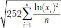

<!-- 原 EPUB 中此公式为图片，已原样保留 -->

<!-- source:block a0ab87e30492a3af -->

> [!quote]- English 11
> where each data point *xi* is equal to the daily price returns *pi*/*pi–1* (today’s settlement price divided by yesterday’s settlement price), and *n* is the number of trading days in the calculation period.

其中每个数据点xi等于每日价格回报pi/pi-1（今日结算价除以昨日结算价），n为计算期内交易天数。

<!-- source:block 25e0693e0e482f18 -->

> [!quote]- English 12
> There are two points of particular note. First, the expiration value represents the true volatility over the calculation period rather than a volatility estimate. We therefore use the population standard deviation rather than the sample standard deviation, dividing by *n* rather than *n* – 1. Second, the volatility calculation is independent of any trend in prices. We therefore assume a 0 mean, using ln(*xi*) for each data point rather than ln(*xi*) – *µ*. These calculation conventions are common to most realized volatility contracts.

有两点需要特别注意。首先，到期值代表计算期内的真实波动率，而不是波动率估计。因此，我们使用总体标准差而不是样本标准差，除以n而不是n-1。其次，波动率计算独立于价格的任何趋势。因此，我们假设平均值为0，对每个数据点使用ln(xi)而不是ln(xi)- µ。这些计算惯例对于大多数已实现的波动率合约来说是常见的。

<!-- source:block 3b8a892814ec701b -->

> [!quote]- English 13
> The profit or loss at expiration for a realized volatility contract will depend on the price at which the initial trade was made, the notional amount of the trade, and the value of the contract at expiration. If the buyer of a realized volatility contract enters into the trade at a price of 20 percent with an agreed-on notional amount equal to \$1,000 per volatility point and the realized volatility over the calculation period turns out to be 23.75 percent, the buyer will show a profit of

已实现波动率合约到期时的损益将取决于初始交易的价格、交易的名义金额以及到期时合约的价值。如果已实现波动率合约的买家以20%的价格进行交易，商定的名义金额等于每个波动点1,000美元，并且计算期内的已实现波动率为23.75%，那么买家将显示利润

<!-- source:block fc12ca5ba271e0a6 -->

> [!quote]- English 14
> \$1,000 × (23.75 – 20.00) = \$3,750

$$
\$1{,}000 \times (23.75 - 20.00) = \$3{,}750
$$

<!-- source:block 18ae5a924767704a -->

> [!quote]- English 15
> If the realized volatility turns out to be 18.60 percent, the buyer will show a loss of

如果已实现波动率为18.60%，则买家将显示损失

<!-- source:block bd46ba7f8c1a86f7 -->

> [!quote]- English 16
> \$1,000 × (18.60 – 20.00) = –\$1,400

$$
\$1{,}000 \times (18.60 - 20.00) = -\$1{,}400
$$

<!-- source:block ad8a7209ce8a7783 -->

> [!quote]- English 17
> Realized volatility contracts are most often traded in the off-exchange market, with banks and proprietary trading firms acting as market makers.1 Quotes for realized volatility contracts typically include a price, quoted in volatility points, and a volatility exposure, quoted as *notional vega*. A market maker who offers a quote for realized volatility of 19.50 –20.50 for \$10,000 notional vega is willing to buy the contract at a volatility of 19.50 percent and sell the contract at a volatility of 20.50 percent, with every volatility point having a value of \$10,000. In the same way, a client may put in an order to buy \$25,000 notional vega at 30. The client is prepared to pay a volatility of 30 percent, with every volatility point having a value of \$25,000.

已实现波动率合约最常在场外市场交易，银行和自营交易公司充当做市商。已实现波动率合约的报价通常包括以波动点报价的价格和以名义Vega报价的波动率风险敞口。 为\\$10,000名义Vega提供19.50 -20.50的已实现波动率报价的做市商愿意以19.50 %的波动率买入合约，并以20.50 %的波动率卖出合约，每个波动率点的价值为\\$10,000。 以同样的方式，客户可以在30下单购买\\$25,000名义Vega。客户准备支付30 %的波动率，每个波动点的价值为\\$25,000。 [^ovp25-1]

<!-- source:block 06bc17cff9c42da6 -->

> [!quote]- English 18
> In these examples, the price of the volatility contract was quoted in volatility points and settled in volatility points. In fact, most realized volatility contracts are settled in *variance points*, where variance is equal to the square of volatility

在这些示例中，波动率合约的价格以波动点报价并以波动点结算。事实上，大多数已实现的波动率合约都以方差点结算，方差等于波动率的平方

<!-- source:block 08788bdb1fbfe0ef -->

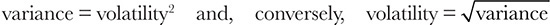

<!-- 原 EPUB 中此公式为图片，已原样保留 -->

<!-- source:block a6b66957be60b431 -->

> [!quote]- English 19
> For this reason, realized volatility contracts are often referred to as *variance contracts* or, more commonly, *variance swaps*.

因此，已实现波动率合约通常被称为方差合约，或者更常见的是方差掉期。

<!-- source:block dc3b3f6b3392c825 -->

> [!quote]- English 20
> Why settle a volatility contract in variance points rather than volatility points? As we shall see later, for purposes of hedging a volatility contract, it is much easier to replicate a variance position than a volatility position. Additionally, the reader may recall from the discussion of forward volatility in Chapter 20 that variance has the very desirable characteristic that it is proportional to time. If the variance over some time period *t*1 is equal to σ12 and the variance over a second successive time period *t*2 is equal to σ22, then the variance over the combined time periods is

为什么在方差点而不是波动点结算波动率合约？正如我们稍后将看到的那样，为了对冲波动率合约，复制方差头寸比复制波动率头寸容易得多。 此外，读者可能会从第20章中对远期波动率的讨论中回忆起，方差具有非常理想的特征，即与时间成正比。 如果某个时间段t1上的方差等于σ1_2，并且第二个连续时间段t2上的方差等于σ2_2,，那么组合时间段上的方差为

<!-- source:block 38c77483bbe679db -->

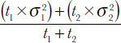

<!-- 原 EPUB 中此公式为图片，已原样保留 -->

<!-- source:block f9c62c51c5050d8e -->

> [!quote]- English 21
> This means that variance contracts can be easily combined to cover consecutive time periods, even if the time periods are not of equal length.

这意味着差异合约可以很容易地组合以覆盖连续的时间段，即使时间段不等长。

<!-- source:block 6c6d7a371d211f16 -->

> [!quote]- English 22
> For example, if the annualized volatility over a two-month time period is 25 (expressing the volatility in points) and the annualized volatility over the following one-month time period is 22, the annualized variance over the entire three-month period is

例如，如果两个月期间的年化波动率为25（以点表示波动率），而接下来一个月期间的年化波动率为22，则整个三个月期间的年化方差为

<!-- source:block 0245b7f30627cad2 -->

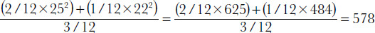

<!-- 原 EPUB 中此公式为图片，已原样保留 -->

<!-- source:block 6ccdb00f96699b5a -->

> [!quote]- English 23
> If a volatility contract is quoted in volatility points with a notional vega amount, but settlement is in variance points, how much is each variance point worth? Without going into the mathematics, by convention, each variance point is equal to the notional amount divided by twice the volatility price

如果波动率合约以波动点报价，具有名义Vega金额，但结算以方差点计算，则每个方差点值多少？在不深入数学的情况下，按照惯例，每个方差点等于名义金额除以波动率价格的两倍

<!-- source:block 1b7b3d029fe746eb -->

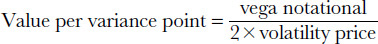

<!-- 原 EPUB 中此公式为图片，已原样保留 -->

<!-- source:block 4286e2a6afca4918 -->

> [!quote]- English 24
> If the buyer of a volatility contract pays 20 for \$10,000 vega notional, but the contract is settled in variance points, each variance point has a value of

如果波动率合约的买家为10,000美元的Vega名义金额支付20美元，但合约以方差点结算，则每个方差点的价值为

<!-- source:block 2865978063507654 -->

> [!quote]- English 25
> \$10,000/2 × 20 = \$250

$$
\$10{,}000/2 \times 20 = \$250
$$

<!-- source:block 31b1b6769d4601c7 -->

> [!quote]- English 26
> If the realized volatility over the life of the contract turns out to be 19 percent, the buyer will show a loss of

如果合约有效期内的已实现波动率为19%，则买家将显示损失

<!-- source:block 1603a8f3f934c02e -->

> [!quote]- English 27
> \$250 × (192 – 202) = \$250 × (361 – 400) = \$9,750

$$
\$250 \times (19^{2} - 20^{2}) = \$250 \times (361 - 400) = \$9{,}750
$$

<!-- source:block 7b2965d58aa3fd27 -->

> [!quote]- English 28
> If the realized volatility over the life of the contract turns out to be 23 percent, the buyer will show a profit of

如果合约有效期内的已实现波动率为23%，则买家将显示利润

<!-- source:block 5eae2e59f2f58eb1 -->

> [!quote]- English 29
> \$250 × (232 – 202) = \$250 × (529 – 400) = \$32,250

$$
\$250 \times (23^{2} - 20^{2}) = \$250 \times (529 - 400) = \$32{,}250
$$

<!-- source:block 28515c106d6320b2 -->

> [!quote]- English 30
> Because variance is the square of volatility, if a contract is settled in variance points, the value at settlement can quickly escalate with higher volatilities. If a single dramatic event occurs that causes the underlying contract to make an unexpectedly large move, resulting in a volatility over the calculation period of 50, the profit to the buyer in our example will be

由于方差是波动率的平方，如果合约以方差点结算，则结算时的价值可能会随着波动率更高而迅速上升。如果发生单一戏剧性事件，导致标的合约意外大幅变动，导致计算期内波动率为50，则我们示例中买家的利润将为

<!-- source:block 6b1dae76d675ee45 -->

> [!quote]- English 31
> \$250 × (502 – 202) = \$250 × (2,500 – 400) = \$525,000

$$
\$250 \times (50^{2} - 20^{2}) = \$250 \times (2{,}500 - 400) = \$525{,}000
$$

<!-- source:block 40d945989dca3e3d -->

> [!quote]- English 32
> Of course, the seller will have an equal loss. Indeed, the seller of a variance swap may not be willing to take on the risk of a one-time dramatic event that causes volatility to skyrocket. Many variance swaps therefore have a cap that limits the expiration value of the contract. If the contract trades at a price of 20 and has a volatility cap of 40 (equal to a variance of 1,600), no matter how high volatility goes, the profit to the buyer and risk to the seller can never be greater than

当然，卖家也会有同等的损失。事实上，方差掉期的卖家可能不愿意承担导致波动率飙升的一次性戏剧性事件的风险。因此，许多方差掉期都有一个上限，可以限制合约的到期价值。如果合约的价格为20，波动率上限为40（等于方差1,600），那么无论波动率有多高，买家的利润和卖家的风险永远不会大于

<!-- source:block 715e96713e246435 -->

> [!quote]- English 33
> \$250 × (402 – 202) = \$250 × (1,600 – 400) = \$300,000

$$
\$250 \times (40^{2} - 20^{2}) = \$250 \times (1{,}600 - 400) = \$300{,}000
$$

<!-- source:block 9008e91f8307a964 -->

> [!quote]- English 34
> Caps are most common for variance swaps on individual stocks, where a one-time event can result in a dramatic increase in volatility. Caps are less common for variance swaps on broad-based indexes, where a one-time event affecting one index component is unlikely to have a correspondingly large effect on the volatility of the entire index. Of course, variance swaps are primarily an off-exchange product. The buyer and seller of the swap are free to negotiate any contract specifications, including a cap, that are mutually agreeable to both parties.

上限最常见于单个股票的方差互换，一次性事件可能导致波动率急剧增加。上限对于广泛指数的方差掉期来说并不常见，其中影响一个指数组成部分的一次性事件不太可能对整个指数的波动率产生相应的较大影响。当然，方差掉期主要是一种场外产品。互换的买方和卖方可以自由协商双方共同同意的任何合约规格，包括上限。

<!-- source:block f71394d035576b83 -->

## 隐含波动率合约 / Implied Volatility Contracts

<!-- source:block e36b204d0f563ff1 -->

> [!quote]- English 35
> Realized volatility is an important consideration in option pricing, but it is something that cannot be directly observed, at least at any given moment in time. When option traders talk about volatility, they are most often referring to implied volatility, which is something that can be observed. The implied volatility is a consensus, derived from the prices of options in the marketplace, of what the volatility of the underlying contract will be over some period in the future. Because option prices can be observed at any moment in time, implied volatility at any moment can likewise be observed.

实现波动率是期权定价中的一个重要考虑因素，但它是无法直接观察到的，至少在任何特定时刻是如此。当期权交易员谈论波动率时，他们最常指的是隐含波动率，这是可以观察到的东西。隐含波动率是根据市场期权价格得出的共识，即未来一段时期标的合约的波动率。由于期权价格可以在任何时刻观察到，因此同样可以观察到任何时刻的隐含波动率。

<!-- source:block c772b32f6e1f8a79 -->

> [!quote]- English 36
> In the early days of exchange-traded options, the concept of implied volatility was not well understood, at least not among most nonprofessional traders. However, as option trading increased in popularity, all market participants, both professional and nonprofessional, began to pay closer attention to the implied volatility in option markets. As a means of promoting a better understanding of options and as an aid to both traders and end users, exchanges began disseminating implied volatility data. With growing public interest in options, these numbers began to appear with increasing frequency in financial news reports.

在交易所交易期权的早期，隐含波动率的概念并没有得到很好的理解，至少在大多数非专业交易员中是这样。然而，随着期权交易的日益流行，所有市场参与者，无论是专业的还是非专业的，都开始更加密切地关注期权市场的隐含波动率。作为促进更好地理解期权的一种手段，并作为对交易员和最终用户的帮助，交易所开始传播隐含波动率数据。随着公众对期权的兴趣日益浓厚，这些数字开始越来越频繁地出现在金融新闻报道中。

<!-- source:block c9965d8b75b64736 -->

> [!quote]- English 37
> There are, of course, many different implied volatilities. Not only are there many different underlying markets, but for each underlying, there are many different exercise prices and expiration months. What exchanges wanted was one number that reflected the general implied volatility environment. This led the Chicago Board Options Exchange (CBOE) to focus on the implied volatility of a broad-based index, specifically its most actively traded product, the Options Exchange Index, with ticker symbol OEX. In 1993, the CBOE began disseminating values for the volatility index (VIX), a theoretical 30-day implied volatility calculated from the prices of options on the OEX. The VIX eventually developed into a widely recognized financial indicator not only in the option community but also in the financial world in general. Other exchanges have followed suit by creating volatility indexes of their own, but the VIX remains the best known of all implied volatility indexes.

当然，有许多不同的隐含波动率。不仅有许多不同的标的市场，而且对于每个标的市场，还有许多不同的行权价和到期月份。交易所想要的是一个反映一般隐含波动率环境的数字。这导致芝加哥期权交易所（CBOE）关注广泛指数的隐含波动率，特别是其交易最活跃的产品期权交易所指数，股票代码为OEX。1993年，CBOE开始传播波动率指数（VIX）的值，这是一种理论上的30天隐含波动率，根据开放交易所期权价格计算。VIX最终发展成为不仅在期权界而且在整个金融界广泛认可的财务指标。其他交易所也纷纷效仿，创建了自己的波动率指数，但VIX仍然是所有隐含波动率指数中最著名的指数。

<!-- source:block 2031a469c38e3262 -->

> [!quote]- English 38
> As the VIX became more widely recognized, the CBOE began to consider the possibility of creating a tradable contract based on the VIX. This necessitated two major changes in the index. The first change had to do with the underlying contract. Initially, VIX values disseminated by the CBOE were derived from the prices of OEX options. However, the CBOE subsequently introduced options on the Standard and Poor’s (S&P) 500 Index, with ticker symbol SPX, and these eventually replaced the OEX as the exchange’s most actively traded index product. That, combined with the fact that the S&P 500 was a much more widely followed index than the OEX, led the exchange in 2003 to begin calculating the VIX from the prices of S&P 500 options rather than OEX options.

随着波动率指数得到越来越广泛的认可，芝加哥期权交易所开始考虑基于波动率指数创建可交易合约的可能性。这需要对指数进行两项重大修改。第一个变化与标的合约有关。最初，CBOE传播的波动率指数值来自于开放交易所期权的价格。然而，CBOE随后推出了标准普尔（S & P）500指数期权，股票代码为SPX，这些期权最终取代了OE，成为该交易所交易最活跃的指数产品。再加上标准普尔500指数是比开放式指数更受关注的指数，导致该交易所于2003年开始根据标准普尔500指数而不是开放式指数期权的价格计算波动率指数。

<!-- source:block 7985a881cc8c38d1 -->

> [!quote]- English 39
> The second change had to do with the calculation method. The original VIX was calculated from calls and puts at the two exercise prices that bracketed the index price—essentially the at-the-money options. For a given expiration month, the call and put implied volatilities at each exercise price were averaged, and these were then weighted by the difference between the exercise price and the index price to yield an implied volatility for that expiration month. In order to determine a theoretical 30-day implied volatility, the two near-term expiration months were weighted to derive a final value.2 An example may help to clarify the methodology.

第二个变化与计算方法有关。最初的VIX是根据指数价格的两个行权价的看涨和看跌计算的，本质上是平值期权。对于给定的到期月份，将每个行权价的看涨和看跌隐含波动率取平均值，然后通过行权价和指数价格之间的差异对这些波动率进行加权，以得出该到期月份的隐含波动率。为了确定理论上的30天隐含波动率，对两个近期到期月份进行加权以得出最终值。[^ovp25-2]一个例子可能有助于澄清方法。

<!-- source:block 43b21eef0fd5ee0c -->

> [!quote]- English 40
> Assume that the index price is 863.40 and that the two exercise prices that bracket this number are 860 and 870. Assume also that the nearest option contract, Month 1, has 14 days remaining to expiration and that the second option contract, Month 2, has 42 days remaining. Implied volatilities for the two exercise prices in each month are as follows:

假设指数价格为863.40，包含该数字的两个行权价为860和870。还假设最近的期权合约（第1个月）还剩14天到期，而第二个期权合约（第2个月）还剩42天。每月两个行权价的隐含波动率如下：

<!-- source:block 516e8651e3ca3c41 -->

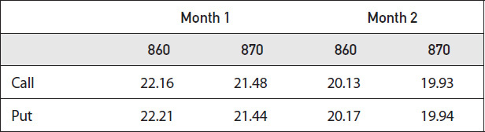

<!-- source:block 79eee8ac21777279 -->

> [!quote]- English 41
> The average implied volatilities for each exercise price and month are

每个行权价和月份的平均隐含波动率为

<!-- source:block fb37bbb308177bc5 -->

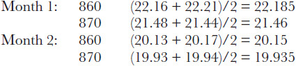

<!-- 原 EPUB 中此公式为图片，已原样保留 -->

<!-- source:block cbb77eeff7ef656a -->

> [!quote]- English 42
> The implied volatility in each month is the interpolated implied volatility between the two exercise prices—the implied volatilities weighted by their distance from the index price. The closer the exercise price is to the index price, the greater is the weighting:

每月的隐含波动率是两个行权价之间的内插隐含波动率——根据其与指数价格的距离加权的隐含波动率。行权价与指数价格越接近，权重越大：

<!-- source:block 8a9a5e9f91e8fd11 -->

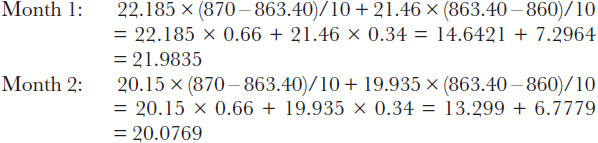

<!-- 原 EPUB 中此公式为图片，已原样保留 -->

<!-- source:block 2f516a6f31ec74ac -->

> [!quote]- English 43
> The VIX value is the interpolated implied volatility between the two expiration months—the implied volatilities weighted by how close their expirations are to 30 days. The closer to 30, the greater the weighting. With expirations of 14 and 42 days, the final VIX value is

VIX值是两个到期月份之间的内插隐含波动率——根据到期日与30天的接近程度加权的隐含波动率。越接近30，权重越大。如果间隔为14天和42天，最终VIX值为

<!-- source:block e4f7c1481db7f888 -->

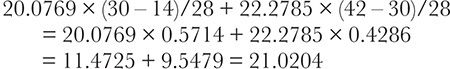

<!-- 原 EPUB 中此公式为图片，已原样保留 -->

<!-- source:block fe040646503b53c8 -->

> [!quote]- English 44
> The final VIX value disseminated by the exchange is the calculated VIX value rounded to two decimal points, in this case 21.02.

交易所传播的最终VIX值是计算出的VIX值，四舍五入到两位小数点，在本例中为21.02。

<!-- source:block 441423ca05775730 -->

> [!quote]- English 45
> When the exchange began planning for trading in VIX-related products, there were two major objections to the original calculation methodology. First, any exchange-traded product has to have a very well-defined value on which everyone can agree. If there are significant disagreements as to the value of a contract, especially at expiration, some traders will feel that they are being treated unfairly. This will certainly inhibit trading in the product and might, in some situations, lead to legal action against the exchange. The original VIX calculation required a theoretical pricing model to determine implied volatilities. This in itself can result in disagreements. Which model should be used? The Black-Scholes model? The binomial model? Some other more exotic model? (Recall from Chapter 22 that the OEX is an American option, carrying with it the right of early exercise.) Even if there is general agreement on an appropriate model, there may be disagreements as to the inputs into the model. What interest rate ought to be used? What dividend assumptions should be made? The exchange concluded that if it wanted to introduce trading in VIX-related products, it would be necessary to improve on the existing calculation methodology.

当该交易所开始规划VIX相关产品的交易时，对最初的计算方法存在两个主要反对意见。首先，任何交易所交易的产品都必须具有非常明确的价值，每个人都能同意。如果对合约的价值存在重大分歧，尤其是在到期时，一些交易员会觉得他们受到了不公平对待。这肯定会抑制产品的交易，并且在某些情况下可能会导致针对交易所的法律诉讼。最初的VIX计算需要理论定价模型来确定隐含波动率。这本身可能会导致分歧。应该使用哪种型号？布莱克-斯科尔斯模型？二项模型？还有一些更异国情调的模特吗？（回想第22章，开放式期权是一种美式期权，具有提前行权的权利。）即使对适当的模型达成了普遍一致，但对模型的输入也可能存在分歧。应该使用什么利率？应该做出哪些股息假设？该交易所得出的结论是，如果想引入VIX相关产品的交易，有必要改进现有的计算方法。

<!-- source:block f7a0a9fe075f64e4 -->

> [!quote]- English 46
> The second objection had to do with the fact that only at-the-money options were used to calculate VIX values. As traders became more knowledgeable about options, the volatility skew, or smile, became increasingly important in describing the volatility environment and in determining appropriate strategies. Traders wanted an implied volatility index that would encompass not only the implied volatility of at-the-money options but also the implied volatility across a broad range of exercise prices.

第二个反对意见与仅使用平值期权来计算VIX值这一事实有关。随着交易员对期权的了解越来越多，波动率倾斜或微笑在描述波动率环境和确定适当的策略中变得越来越重要。交易员想要一个隐含波动率指数，不仅包括平值期权的隐含波动率，还包括广泛行权价的隐含波动率。

<!-- source:block 34ada60fc4505fc3 -->

> [!quote]- English 47
> The VIX calculation methodology that was eventually chosen to replace the old methodology was suggested in a research paper from Goldman Sachs published in 1999.3 The paper essentially asked this question: is it possible to create an option position that will capture the true volatility of the underlying contract under all possible volatility scenarios?

最终选择取代旧方法的VIX计算方法是在高盛1999年发表的一篇研究论文中提出的。[^ovp25-3]该论文本质上提出了这个问题：是否有可能创建一个期权头寸，以捕捉所有可能的波动情况下标的合约的真实波动率？

<!-- source:block ea61d26baecd285f -->

> [!quote]- English 48
> In theory, if we want to take a volatility position, we can either buy options (a long volatility position) or sell options (a short volatility position) and then dynamically hedge the position to expiration. For example, we might take a long volatility position by purchasing one or more at-the-money options and selling a delta-neutral amount of the underlying contract.4 By periodically rehedging the position to remain delta neutral, we will capture the volatility value of the underlying contract.

理论上，如果我们想持有波动率头寸，我们可以购买期权（多头波动率头寸）或出售期权（空头波动率头寸），然后动态对冲头寸直至到期。例如，我们可能会通过购买一个或多个平值期权并出售Delta中性金额的标的合约来持有多头波动率头寸。[^ovp25-4]通过定期重新对冲头寸以保持Delta中性，我们将捕获标的合约的波动率价值。

<!-- source:block d220361c19e5bf33 -->

> [!quote]- English 49
> This all sounds very nice in theory, but it almost never works out exactly as expected. Perhaps the greatest drawback to the strategy is the fact that exposure to the volatility of the underlying market, as measured by the vega, will change over the life of the strategy. An option’s vega value is greatest when the option is at the money, but even if we begin by purchasing at-the-money options, the options will almost certainly not remain at the money. As the underlying price rises or falls, the options will either go into the money or out of the money, and the vega of the position will decline. This was discussed in Chapter 9 and is shown again in Figure 25-1.

理论上这一切听起来非常好，但它几乎从来没有完全按照预期进行。也许该策略的最大缺点是，以Vega指数衡量的标的市场波动率性风险将在策略的整个生命周期内发生变化。 当期权是ATM时，期权的Vega价值最大，但即使我们开始购买ATM期权，期权几乎肯定不会仍然是ATM。 随着标的价格上涨或下跌，期权要么进入货币，要么进入OTM，头寸的Vega就会下降。这在第9章中进行了讨论，并在图25-1中再次显示。

<!-- source:block 443e2d136f9d1a35 -->

*图25-1期权的vega（波动率敏感度）。 / Figure 25-1 The vega (volatility sensitivity) of an option.*

<!-- source:block 23474ca968fcdff3 -->

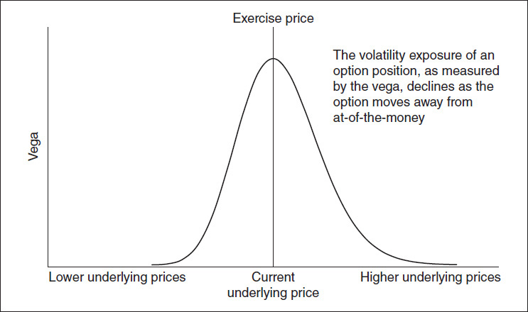

<!-- source:block 3b570c334c1f0b92 -->

> [!quote]- English 51
> If we want to create a long volatility position, we want a constant exposure to volatility regardless of changes in the price of the underlying contract. We might try to accomplish this by purchasing options across a broad range of exercise prices. In this scenario, shown in Figure 25-2, one exercise price will always be at the money. Unfortunately, this will still not result in a constant vega exposure because at-the-money options with higher exercise prices have greater vega values than at-the-money options with lower exercise prices. If we add up all the vega values in Figure 25-2 at each underlying price, the total vega will be lower at lower underlying prices and higher at higher underlying prices.

如果我们想创建多头波动率头寸，我们希望无论标的合约价格如何变化，都能持续承受波动率。我们可能会尝试通过购买广泛的行权价的期权来实现这一目标。在这种情况下，如图25-2所示，一个行权价将始终处于平值状态水平。不幸的是，这仍然不会导致持续的Vega风险敞口，因为行权价较高的平值期权比行权价较低的平值。如果我们将图25-2中每个标的价格的所有Vega值相加，那么标的价格越低，Vega值越低，标的价格越高，Vega值越高。

<!-- source:block bb853d380761bda6 -->

*图25-2如果我们以每个行权价购买一个期权，则波动率风险敞口。 / Figure 25-2 Volatility exposure if we purchase one option at each exercise price.*

<!-- source:block 79ff0c6f6ea76be5 -->

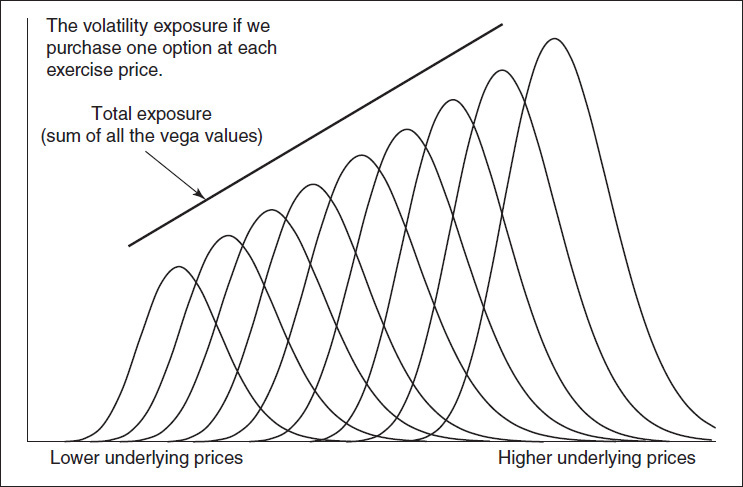

<!-- source:block a5a06e7d476426ed -->

> [!quote]- English 53
> To achieve a constant volatility exposure, we need to buy more options with lower exercise prices and fewer options with higher exercise prices. How many options at each exercise price should we buy? It turns out that the proper proportion of each exercise price needed to create a position with constant volatility exposure is inversely proportional to the square of the exercise price

为了实现稳定的波动率敞口，我们需要购买更多具有较低行权价的期权，并购买更少具有较高行权价的期权。每个行权价我们应该购买多少个期权？事实证明，创建具有恒定波动率敞口的头寸所需的每个行权价的适当比例与行权价的平方成正比

<!-- source:block 43ce3908c4c9a702 -->

> [!quote]- English 54
> 1/*X*2

$$
1/X^{2}
$$

<!-- source:block 078b021cdc0e118f -->

> [!quote]- English 55
> The result of doing this is shown in Figure 25-3.

这样做的结果如图25-3所示。

<!-- source:block 2ab934ef7ad8d6e4 -->

*图25-3在每个行权价购买1/X2期权 / Figure 25-3 Purchasing 1/*X*2 options at each exercise price.*

<!-- source:block b6e770dbb1e3ed44 -->

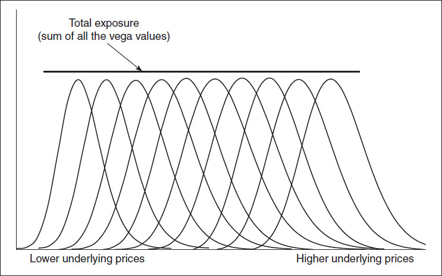

<!-- source:block 4064b947cb6a5882 -->

> [!quote]- English 57
> Of course, to exactly replicate a volatility position, we would have to purchase options, in the correct proportion, at every possible exercise price—essentially an infinite number of options. Exchanges, however, only list a finite number of exercise prices. Still, it might be possible to use the exercise prices that are listed to create a position that closely approximates a theoretically constant volatility position. This is the basis for the VIX calculation methodology used by the CBOE.

当然，要准确复制波动率头寸，我们必须以正确的比例，以每一个可能的行权价购买期权——基本上是无限多的期权。然而，交易所只列出有限数量的行权价。尽管如此，还是有可能使用列出的行权价来创建一个非常接近理论上恒定波动率的头寸。这是CBOE使用的VIX计算方法的基础。

<!-- source:block bbaa3851120ac253 -->

> [!quote]- English 58
> Essentially, the value of the VIX is the cost of purchasing a strip consisting of options at every available exercise price. Because the VIX represents a 30-day implied volatility, the value of the VIX is derived from strips of options in the two monthly expirations that bracket 30 days. The values of the strips are then weighted by how close each expiration is to 30 days. Without going into the complete derivation of the VIX,5 there are some important aspects that are worth pointing out:

本质上，VIX的价值是以每个可用的行权价购买由期权组成的条带的成本。由于VIX代表30天的隐含波动率，因此VIX的价值来自两个每月期限（涵盖30天）中的期权条。然后根据每次有效期与30天的接近程度对条带的值进行加权。在不深入VIX的完整推导的情况下，[^ovp25-5]有一些重要方面值得指出：

<!-- source:block 712f73fa012138b3 -->

> [!quote]- English 59
> 1. The value of the VIX is derived from the volatility value (time value) of the options in the underlying index, not the intrinsic value. Therefore, only the prices of out-of-the-money options (compared with the forward price) are used.

1.波动率指数的价值源自标的指数中期权的波动率值（时间值），而不是内在价值。因此，仅使用价外期权的价格（与远期价格相比）。

<!-- source:block 07b4a33f48c89b93 -->

> [!quote]- English 60
> 2. The (implied) forward price for the index is determined using put-call parity for the closest-to-the-money exercise price.

2.该指数的（隐含）远期价格是使用最接近货币的行权价的看跌期权平价确定的。

<!-- source:block 907a92e5e1e59f28 -->

> [!quote]- English 61
> 3. The option value used at each exercise price is the average of the quoted bid price and ask price.

3.每个行权价使用的期权价值是报价买入价和要价的平均值。

<!-- source:block 7788d432bed23c45 -->

> [!quote]- English 62
> 4. When two exercise prices with a nonzero bid are encountered, no lower exercise prices for puts or higher exercise prices for calls are included in the calculation

4.当遇到两个非零出价的行权价时，计算中不包括看跌期权的较低行权价或看涨期权的较高行权价

<!-- source:block 5ef35c5115311fcf -->

> [!quote]- English 63
> 5. Because only a finite number of exercise prices are available, the contribution of each option to the final VIX calculation is adjusted based on the distance between consecutive exercise prices. The greater the distance between exercise prices, the greater is the weighting in the index for a specific option.

5.由于只有有限数量的行权价可用，因此每个期权对最终VIX计算的贡献根据连续行权价之间的距离进行调整。行权价之间的距离越大，特定期权在指数中的权重就越大。

<!-- source:block 31c30e47dfa5fedb -->

> [!quote]- English 64
> Note that the VIX calculation depends only on the prices of options—no theoretical pricing model is required. Other than option prices, the only other required input is an interest rate, which is necessary to determine the index forward price under put-call parity as well as the interest cost of purchasing the options. For this, the CBOE uses the risk-free rate—the U.S. Treasury bill rate with maturity closest to the option expiration. Otherwise, calculation of the VIX is relatively straightforward.

请注意，VIX计算仅取决于期权的价格-不需要理论定价模型。除了期权价格之外，唯一的其他所需输入是利率，这是确定看涨-看跌平价下的指数远期价格以及购买期权的利息成本所必需的。为此，CBOE使用无风险利率——期限最接近期权到期的美国国债利率。否则，VIX的计算相对简单。

<!-- source:block 13de89a8eddf2fab -->

> [!quote]- English 65
> Because the VIX represents a theoretical 30-day implied volatility, traded contracts on the VIX typically expire 30 days prior to expiration of the options used to calculate VIX values, usually the third Wednesday of the previous month. VIX January contracts expire 30 days prior to expiration of February SPX options; VIX February contracts expire 30 days prior to expiration of March SPX options; and so on.

由于VIX代表理论上的30天隐含波动率，因此VIX交易合约通常在用于计算VIX价值的期权到期前30天到期，通常是上个月的第三个星期三。VIX一月合约在2月SPX期权到期前30天到期; VIX二月合约在3月SPX期权到期前30天到期;等等。

<!-- source:block b9d0b8ae5a157681 -->

> [!quote]- English 66
> With exactly 30 days remaining to expiration of SPX options, the value of the VIX at expiration is determined solely by the prices of SPX options in the expiration month. For purposes of settlement, rather than using the average of the bid and ask, the expiration value of the VIX is calculated from the actual opening trade prices of SPX options on expiration Wednesday. The trade prices are determined through a *special opening rotation* where standing buy and sell orders are automatically matched to determine one opening trade price for each option. If no trade takes place for an option, the price used for that option reverts to the average of the bid and ask. This procedure can sometimes cause unusual jumps in the VIX value at expiration. If all options trade at the ask price on the opening (a *buy print*), the expiration value is likely to be higher than expected. If all options trade at the bid price on the opening (a *sell print*), the expiration value is likely to be lower than expected. Immediately after the VIX expiration value is determined by the special opening rotation, calculation reverts to its normal methodology using the average of the bid-ask spread.

SPX期权还有30天到期，到期时的VIX值完全由SPX期权在到期月份的价格决定。为了结算的目的，VIX的到期值不是使用买入价和卖出价的平均值，而是从周三到期的SPX期权的实际开盘交易价格计算出来的。交易价格是通过一个特殊的开盘轮换来确定的，在这个轮换中，买入和卖出订单自动匹配，以确定每个期权的一个开盘交易价格。如果一个期权没有交易发生，该期权的价格将恢复为买入价和卖出价的平均值。此过程有时可能会导致到期时VIX值出现异常跳跃。如果所有期权都以开盘价交易（买入印花），则到期价值可能高于预期。如果所有期权均以开盘时的买入价格交易（卖出印刷），则到期价值可能低于预期。VIX到期值由特殊开盘轮换确定后，计算立即恢复到使用买卖价差平均值的正常方法。

<!-- source:block 2e29a85458f7b707 -->

### VIX 的一些特征 / Some VIX Characteristics

<!-- source:block 3aba034f2d56266f -->

> [!quote]- English 67
> While volatility is, in theory, independent of the direction in which the underlying contract is moving, in the real world, traders have long recognized that some markets tend to become more volatile as the underlying price rises, while other markets tend to become more volatile as the underlying price falls. There is a widely held belief that stock index markets exhibit the latter characteristic. It should therefore not come as a surprise that the VIX is generally negatively correlated with the S&P 500 Index. When the index falls, the VIX tends to rise; when the index rises, the VIX tends to fall. This inverse correlation between changes in the S&P 500 and changes in the VIX for the 10-year period from 2003 to 2012 can be seen in Figures 25-4 and 25-5. Figure 25-4 confirms the tendency of S&P 500 prices and VIX prices to move in opposite directions. Figure 25-5 shows the strong inverse correlation value of –0.7444 between percent changes in the values of the two indexes. Figure 25-5 also includes a best-fit line for the two sets of values: the percent change in the VIX is approximately 5.7 times greater than the percent change in the S&P 500, but in the opposite direction.

虽然理论上波动率与标的合约的移动方向无关，但在现实世界中，交易员长期以来都认识到，随着标的价格上涨，一些市场往往会变得更加波动，而其他市场往往会变得更加波动，因为标的价格下跌。人们普遍认为，股指市场表现出后一种特征。因此，波动率指数总体上与标准普尔500指数呈负相关并不令人惊讶。当指数下跌时，VIX往往会上升;当指数上涨时，VIX往往会下降。2003年至2012年10年期间标准普尔500指数变化与波动率指数变化之间的负相关关系可以在图25-4和25-5中看出。图25-4证实了标准普尔500指数和波动率指数走势相反的趋势。图25-5显示了两个指数值的百分比变化之间的强反相关值-0.7444。图25-5还包括两组值的最佳吻合线：VIX的百分比变化约为标准普尔500指数的百分比变化的5.7倍，但方向相反。

<!-- source:block e79ee89e18b36ccc -->

*图25-4标准普尔500指数和ViX价格：2003-2012年。 / Figure 25-4 s&P 500 and ViX prices: 2003–2012.*

<!-- source:block 0f240af5af06aad7 -->

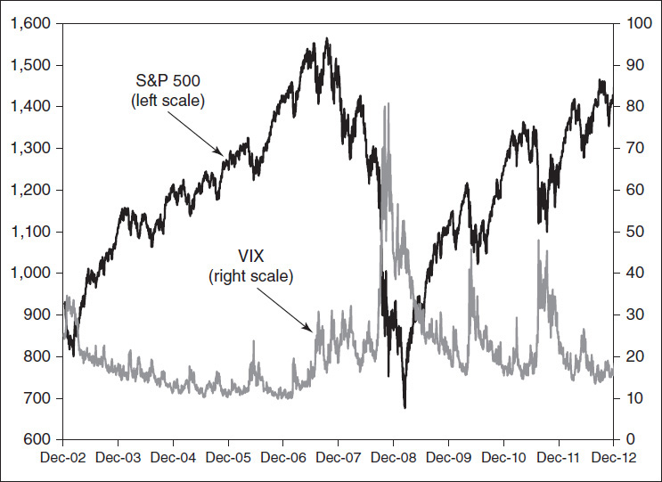

<!-- source:block a65f3fa262ee69bf -->

*图25-5标准普尔500指数每日变化与ViX每日变化：2003-2012年。 / Figure 25-5 Daily s&P 500 index changes versus daily ViX changes: 2003–2012.*

<!-- source:block 07f76569dd6458c2 -->

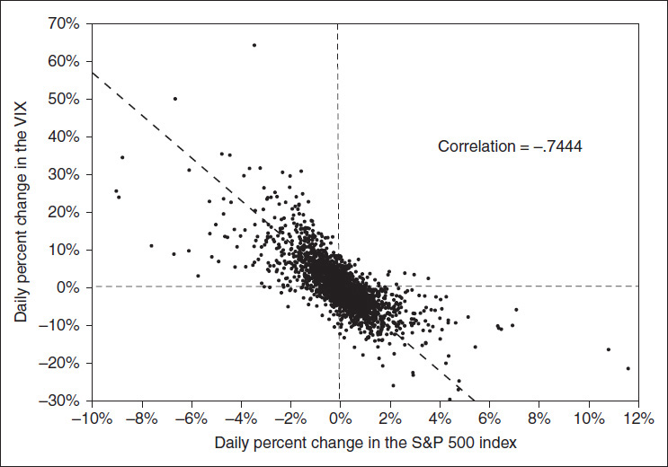

<!-- source:block 969c6c300b6c911f -->

> [!quote]- English 70
> Given the apparent inverse correlation between the S&P 500 Index and the VIX, one might wonder whether this is actually supported by market data. If the VIX rises, will the S&P 500 Index become more volatile? If the VIX falls, will the index become less volatile? Because the VIX represents a 30-day implied volatility, if the marketplace is correct, whenever the VIX rises, the next 30 days ought to be more volatile than the previous 30 days, and whenever the VIX falls, the next 30 days ought to be less volatile than the previous 30 days. The more the VIX rises or falls, the greater should be the change in realized volatility. The actual results over the sample 10-year period are shown in Figure 25-6.

鉴于标准普尔500指数与波动率指数之间明显呈负相关，人们可能会想知道这是否真的得到了市场数据的支持。如果VIX上涨，标准普尔500指数是否会变得更加波动？如果波动率指数下跌，该指数的波动率会减弱吗？由于VIX代表30天的隐含波动率，如果市场是正确的，每当VIX上涨时，未来30天的波动率应该比前30天更大，而每当VIX下跌时，未来30天的波动率应该比前30天小。波动率指数上升或下降越多，已实现波动率的变化就应该越大。图25-6显示了10年样本期的实际结果。

<!-- source:block 0f4144f39c72925d -->

*图25-6 ViX的变化是否预示着已实现波动率的变化？ / Figure 25-6 Does a change in the ViX predict a change in realized volatility?*

<!-- source:block 67be15d8dd429fa8 -->

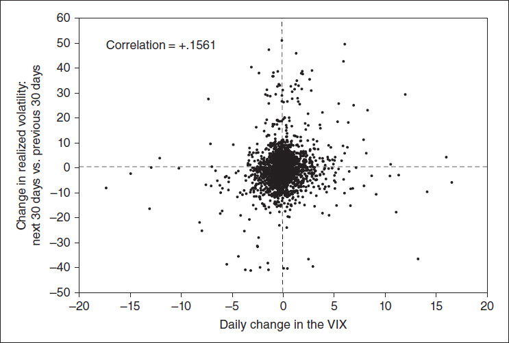

<!-- source:block 1990f4ccf468a3be -->

> [!quote]- English 72
> If there is a correlation between changes in the VIX and changes in realized volatility, it is not apparent from the data. Sometimes the VIX rises and sometimes it falls, but there is no obvious increase or decline in volatility over the following 30-day period. (There is a very small but probably insignificant positive correlation of +0.1561.) Therefore, one might conclude that the VIX has no predictive value as an indicator of rising or falling realized volatility. Perhaps what drives the VIX is not the expectation of future realized volatility, but the desire to buy protection in a falling stock market. In a falling market, more hedgers enter the market, and they are often willing to pay higher prices for protective options without regard to considerations of realized volatility. They are driven by the fear of further declines in the market. For this reason, the VIX is sometimes referred to as the *fear index*.

如果VIX变化与已实现波动率变化之间存在相关性，那么从数据中并不明显。波动率指数时而上涨，时而下跌，但在接下来的30天内波动率没有明显的上升或下降。（+0.1561存在一个非常小但可能微不足道的正相关性。）因此，人们可能会得出结论，VIX作为已实现波动率上升或下降的指标没有预测价值。也许驱动VIX的因素不是对未来已实现波动率的预期，而是在股市下跌时购买保护的愿望。在下跌的市场中，更多的对冲者进入市场，他们通常愿意为保护性期权支付更高的价格，而不考虑已实现的波动率。他们是出于对市场进一步下跌的担忧。因此，VIX有时被称为恐惧指数。

<!-- source:block a579d7be41277d0f -->

> [!quote]- English 73
> We have also noted the widely held belief that stock index markets tend to become more volatile as the underlying price falls and less volatile as the underlying price rises. We might ask whether this assumption is borne out by the available data. Figure 25-7 shows the change in the price of the s&P 500 Index over a 30-day period compared with the realized volatility over the same period. If the conjecture is true, more data points ought to fall in both the upper left portion (a falling index together with higher volatility) and the lower right portion (a rising index together with lower volatility).

我们还注意到人们普遍认为，随着标的价格下跌，股指市场往往会变得更加波动，而随着标的价格上涨，股指市场的波动率就会减弱。我们可能会问，现有数据是否证实了这一假设。图25-7显示了标准普尔500指数30天内价格与同期已实现波动率的变化。如果猜测属实，那么更多数据点应该出现在左上部分（指数下降，波动率更高）和右下部分（指数上升，波动率更低）。

<!-- source:block 3766e5bddf4eba81 -->

*图25-7下跌的股市是否比上涨的市场波动更大？ / Figure 25-7 Are falling stock markets more volatile than rising markets?*

<!-- source:block 80493e2aafd8a76e -->

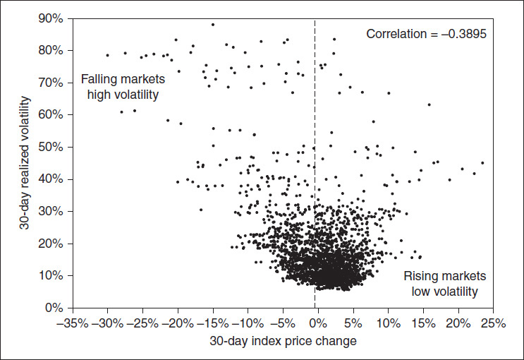

<!-- source:block 757f19acdfb51524 -->

> [!quote]- English 75
> Here there is some reason to believe that falling stock markets do indeed tend to be more volatile than rising stock markets. We can see from the sample period (2003–2012) that there are more high-volatility occurrences to the left of the 0 line and more low-volatility occurrences to the right of the 0 line. There is a moderate inverse correlation of –0.3895.

这里有一些理由相信，下跌的股市确实往往比上涨的股市更不稳定。从样本期（2003-2012年）我们可以看到，0线左侧出现的高波动率较多，0线右侧出现的低波动率较多。存在-0.3895的中度负相关。

<!-- source:block 4327553769a34010 -->

## 交易 VIX / Trading the VIX

<!-- source:block 0378467f94813cd1 -->

> [!quote]- English 76
> As with all indexes, the VIX is composed of components, with each component having a weight within the index

与所有指数一样，VIX由成分组成，每个成分在指数中都有一个权重

<!-- source:block ab60b5a5648c459b -->

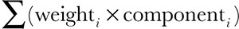

<!-- 原 EPUB 中此公式为图片，已原样保留 -->

<!-- source:block 26504315e4ea7a67 -->

> [!quote]- English 77
> An index can often be replicated by purchasing all or a large number of the index components in the correct proportion. This is commonly done in the stock index market to create a portfolio that tracks an index or as part of an arbitrage strategy. But unlike a stock index, it is not easy to replicate the VIX. As options go into and out of the money, the index components and their weights within the index are constantly changing. For most traders, the only practical method of buying or selling the VIX is through its derivative products: futures and options or products linked to these contracts. Because the VIX itself cannot be easily bought or sold, VIX derivatives do not always track the index or perform as expected, and new traders are often surprised by the results of VIX-related strategies.

通常可以通过以正确比例购买所有或大量指数成分来复制指数。这通常在股指市场中进行，以创建跟踪指数的投资组合或作为套利策略的一部分。 但与股指不同的是，复制波动率指数并不容易。随着期权进入OTM，指数组成部分及其在指数中的权重不断变化。 对于大多数交易员来说，购买或出售VIX的唯一实用方法是通过其衍生品产品：期货和期权或与这些合约相关的产品。 由于VIX本身不能轻易买卖，VIX衍生品并不总是跟踪指数或表现如预期，新交易者往往对VIX相关策略的结果感到惊讶。

<!-- source:block 3fd5e60694af3a80 -->

### VIX 期货 / VIX Futures

<!-- source:block db747b18e97f1d4a -->

> [!quote]- English 78
> The CBOE began trading VIX futures contracts (with ticker symbol UX or VX depending on the quote vendor) in 2004. The futures contracts settle into the value of the VIX at the opening of trading on expiration Wednesday, with each volatility point having a value of \$1,000.

CBOE开始在2004交易VIX期货合约（股票代码UX或VX，具体取决于报价供应商）。期货合约在到期周三开盘时结算为波动率指数的价值，每个波动率点的价值为1,000美元。

<!-- source:block dd5f385b7009e02e -->

> [!quote]- English 79
> VIX futures have unusual characteristics when compared with more traditional futures markets, and traders who enter the VIX futures market for the first time are often surprised and frequently disappointed at the results of a VIX futures strategy. There are two primary reasons for this. First, VIX futures exhibit a term structure, which can affect how futures prices change as market conditions change. Second, unlike a position in other futures markets, an underlying position in the VIX cannot be easily replicated. In a stock index futures market, a trader can replicate an underlying index position by buying or selling the component stocks. In a physical commodity futures market, a trader can replicate a long underlying position by purchasing the commodity. But for most traders, replicating an underlying VIX position directly using options from which the index is calculated is usually not a practical choice.

与更传统的期货市场相比，VIX期货具有不寻常的特征，首次进入VIX期货市场的交易员经常对VIX期货策略的结果感到惊讶和失望。这有两个主要原因。首先，VIX期货具有期限结构，这可能会影响期货价格如何随着市场条件的变化而变化。其次，与其他期货市场的头寸不同，VIX的标的头寸无法轻易复制。在股指期货市场中，交易员可以通过买卖成分股来复制标的指数头寸。在实物商品期货市场中，交易员可以通过购买商品来复制多头标的头寸。但对于大多数交易员来说，直接使用计算指数的期权复制标的 VIX头寸通常不是一个实际的选择。

<!-- source:block 21853daf53e5cda3 -->

> [!quote]- English 80
> VIX futures tend to reflect the term structure of implied volatility in the s&P 500 discussed in Chapter 20 and shown in Figure 20-13. Most often VIX futures exhibit a contango (upward-sloping) relationship, where long-term maturities trade at higher prices than short-term maturities. A typical VIX contango structure, for futures during August 2012, is shown in Figure 25-8. Although less common, VIX futures can also exhibit a backward (downward-sloping) relationship. Such a structure for futures prices one year earlier, in August 2011, is shown in Figure 25-9. Figure 25-10 shows the VIX moving from contango to backward during the financial crisis in the latter half of 2008.

VIX期货往往反映第20章讨论的标准普尔500指数隐含波动率的期限结构，如图20-13所示。VIX期货通常表现出期货溢价（向上倾斜）关系，即长期债券的交易价格高于短期债券。2012年8月期货的典型VIX期货结构如图25-8所示。尽管不太常见，但VIX期货也可以表现出向后（向下倾斜）的关系。一年前（即2011年8月）的期货价格结构如图25-9所示。图25-10显示了2008年下半年金融危机期间波动率指数从期货溢价转向后移的情况。

<!-- source:block 7837b348d1f5bf6b -->

*图25-8连续盘形式的ViX期货（向上倾斜）。 / Figure 25-8 ViX futures in contango (upward sloping).*

<!-- source:block 97f11b7daf3b2e6c -->

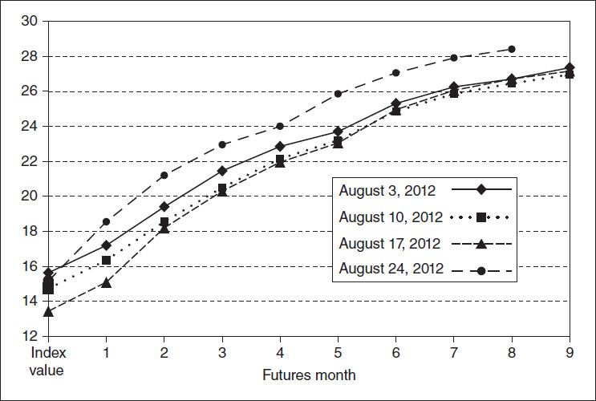

<!-- source:block 8ca4bc7dc7ece00d -->

*图25-9溢价下的ViX期货（向下倾斜）。 / Figure 25-9 ViX futures in backwardation (downward sloping).*

<!-- source:block e0bb5f0bb32f7d81 -->

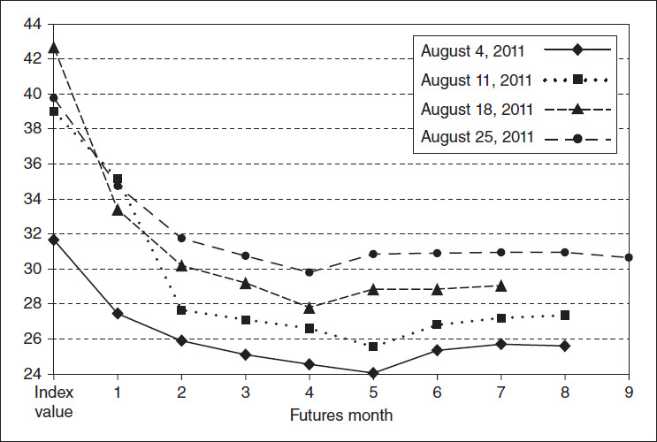

<!-- source:block a509470cf20b7714 -->

*图25-10 2008年底金融危机期间，ViX期货从期货溢价急剧转变为倒退。 / Figure 25-10 ViX futures moved dramatically from contango to backward during the financial crisis in late 2008.*

<!-- source:block 9111cec25fd7ceeb -->

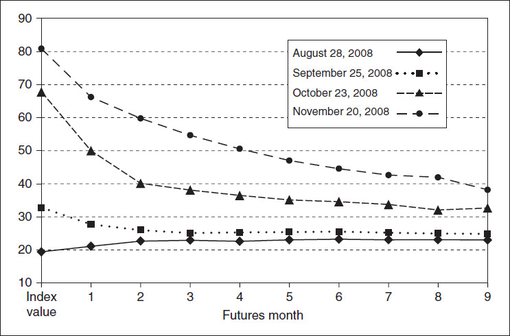

<!-- source:block f23fdb55cde530ff -->

> [!quote]- English 84
> When VIX futures are in a normal contango relationship, as in Figure 25-8, if there is no change in market conditions, as time passes, the futures contract will move down the term-structure curve, gradually losing value as time passes. How does this affect trading decisions in the VIX futures market?

当VIX期货处于正常的期货溢价关系时，如图25-8所示，如果市场条件没有变化，随着时间的推移，期货合约将沿着期限结构曲线向下移动，随着时间的推移逐渐失去价值。这如何影响VIX期货市场的交易决策？

<!-- source:block 8984962729736584 -->

> [!quote]- English 85
> Logically, a trader will want to buy a futures contract when he believes that the futures price will rise and sell a futures contract when he believes that the price will fall. Most traders assume that when an underlying index rises or falls, futures contracts on that index will also rise or fall, and this is generally true of the VIX—when the index rises, VIX futures rise; when the index falls, VIX futures fall. Most traders also assume that when an index rises or falls, futures prices will rise or fall by approximately the same amount. But VIX futures prices reflect where the marketplace thinks SPX implied volatility will be at maturity of the futures contract. Implied volatility, as reflected in the index value, may be high or low today. If, however, the marketplace believes that implied volatility will change between now and expiration of the futures contract, the futures contract will be priced accordingly. A trader will be disappointed indeed if he buys a VIX futures contract, sees an increase in the index, but finds that there is no corresponding increase in the futures price.

从逻辑上讲，当交易者相信期货价格会上涨时，他会想要购买期货合约，当他相信价格会下跌时，他会想要出售期货合约。大多数交易员认为，当标的指数上涨或下跌时，该指数的期货合约也会上涨或下跌，VIX通常如此——当指数上涨时，VIX期货上涨;当指数下跌时，VIX期货下跌。大多数交易员还假设，当指数上涨或下跌时，期货价格将上涨或下跌大致相同的金额。但VIX期货价格反映了市场认为期货合约到期时SPX隐含波动率的情况。正如指数值所反映的那样，隐含波动率今天可能高或低。然而，如果市场认为隐含波动率从现在到期货合约到期之间将会发生变化，则期货合约将进行相应的定价。如果交易员购买了VIX期货合约，看到指数上涨，但发现期货价格没有相应上涨，他确实会感到失望。

<!-- source:block 702b0fc7b74b1744 -->

> [!quote]- English 86
> Suppose that VIX futures are in a normal contango relationship and that a trader believes that there is likely to be a rise in the value of the VIX in the near future. If he buys a futures contract and the expected increase in the VIX occurs, what will be the result? The trader might assume that the futures price will increase by the same amount as the index, but this will not necessarily be true. If the increase in the VIX occurs well before expiration of the futures contract, the futures price may rise much less than the index price. Such a scenario is shown in Figure 25-11. Over a four-day period in July 2011, the index value rose from approximately 19.4 to 23.7, an increase of 4.4 index points. But over the same period, the front-month August futures contract, with approximately three weeks remaining to expiration, rose only 2.0, from 19.3 to 21.3. Indeed, over the last two days, even though the index rose from 23.0 to 23.8, futures prices hardly changed at all. A trader who owned an August futures contract would have shown a profit because the futures price rose. But seeing the increase in the VIX value without a similar increase in the futures price, the trader would almost certainly have been disappointed at the result.

假设VIX期货处于正常的期货溢价关系，并且交易员认为VIX的价值在不久的将来可能会上涨。如果他购买了期货合约，VIX出现预期上涨，结果会是什么？交易员可能会假设期货价格将上涨与指数相同的幅度，但这不一定是真的。如果波动率指数的上涨发生在期货合约到期之前，那么期货价格的涨幅可能会远低于指数价格。这种情况如图25-11所示。2011年7月四天内，指数值从约19.4上升至23.7，上升了4.4个指数点。但同期，距离到期约三周的前月8月期货合约仅上涨2.0，从19.3上涨至21.3。事实上，过去两天，尽管指数从23.0上涨至23.8，但期货价格几乎没有变化。拥有8月期货合约的交易员会因为期货价格上涨而显示利润。但看到VIX值上涨而期货价格没有类似上涨，交易员几乎肯定会对结果感到失望。

<!-- source:block 6b4426bbf4dbcdad -->

*图25-11 ViX期货价格变化不如指数那么快。 / Figure 25-11 ViX futures prices do not change as quickly as the index.*

<!-- source:block fb4cacc3c0f70bec -->

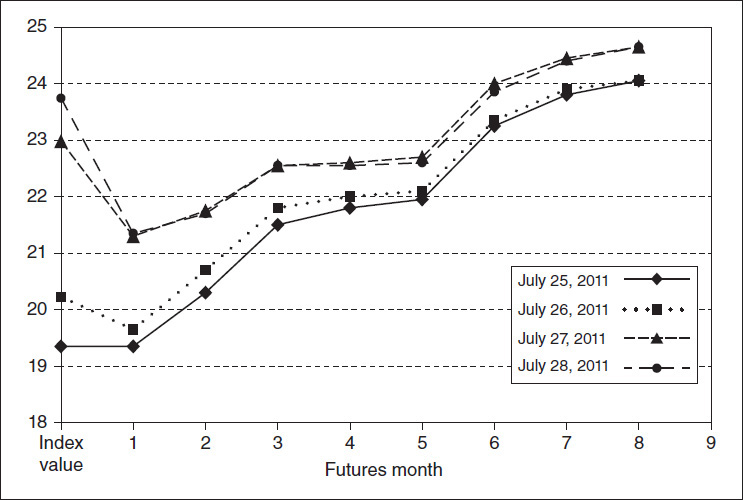

<!-- source:block 37fb9c18c049e6e7 -->

> [!quote]- English 88
> A similar situation can occur if VIX futures are in a backward structure and the index begins to fall. Figure 25-12 shows the change in VIX prices over a four-day period in December 2008. During this period, the VIX fell from approximately 52.4 to 44.9, a decline of 7.5 index points. But the front-month January futures price fell only 5.0, from 52.4 to 47.4. A trader who sold January futures would likewise be disappointed with the results.

如果VIX期货处于后向结构且指数开始下跌，也可能出现类似的情况。图25-12显示了2008年12月四天内VIX价格的变化。期间，VIX指数从约52.4下跌至44.9，下跌7.5个指数点。但前月1月期货价格仅下跌5.0，从52.4下跌至47.4。出售一月份期货的交易员同样会对结果感到失望。

<!-- source:block 9d1d2074a30f8d5d -->

*图25-12 ViX期货价格变化不如指数那么快。 / Figure 25-12 ViX futures prices do not change as quickly as the index.*

<!-- source:block 4292f0a0a39e0e7a -->

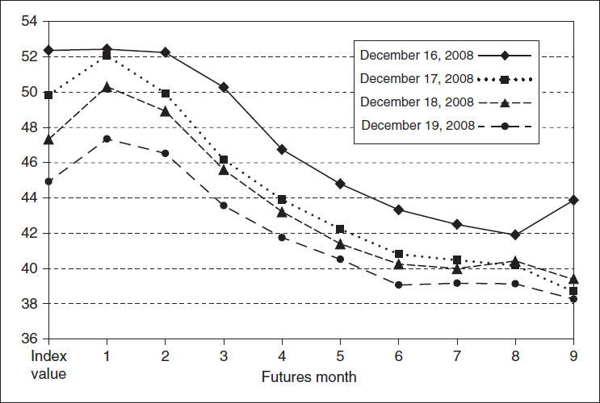

<!-- source:block 76404a08e0079db1 -->

> [!quote]- English 90
> In a traditional futures market, where it is usually possible to take a long or short position in the underlying index or commodity, futures prices must change at approximately the same rate as underlying prices. If this were not true, there would be an arbitrage opportunity available. In a stock index market, if the futures price rises faster than the index price, traders will sell the futures contract and buy the component stocks; if the index rises faster than the futures price, traders will buy the futures contract and sell the component stocks. A trader can hold both positions to maturity, knowing that at maturity the index and futures prices must converge. Unlike a stock index, though, the VIX is not easily tradable. Consequently, VIX futures prices need not change at the same rate as the index. If the index price rises or falls, VIX futures may not rise or fall by the same amount. Indeed, futures prices might not change at all.

在传统的期货市场中，通常可以在标的指数或商品中持有多头或空头头寸，期货价格的变化速度必须与标的价格大致相同。如果情况并非如此，那么就会有套利机会。在股指市场中，如果期货价格上涨快于指数价格，交易者就会卖出期货合约并买入成分股;如果指数上涨快于期货价格，交易者就会买入期货合约并卖出成分股。交易员可以将这两种头寸持有至到期，因为他们知道在到期时指数和期货价格必须趋同。不过，与股指不同，波动率指数并不容易交易。因此，VIX期货价格不需要以与指数相同的速度变化。如果指数价格上涨或下跌，VIX期货可能不会上涨或下跌相同幅度。事实上，期货价格可能根本不会改变。

<!-- source:block e313eb1ff9873d0b -->

> [!quote]- English 91
> At expiration, the price of a VIX futures contract will settle into the index value regardless of any term-structure considerations. Therefore, the closer the futures contract to expiration, the more closely it will respond to any change in the index value. A change in the index value at expiration will be reflected immediately in the futures price.

到期时，无论任何条款结构考虑如何，VIX期货合约的价格都将与指数价值结算。因此，期货合约越接近到期，它对指数价值的任何变化的反应就越紧密。到期时指数值的变化将立即反映在期货价格中。

<!-- source:block dd338e25caa5778c -->

> [!quote]- English 92
> Given the foregoing discussion, when choosing a simple futures strategy, a trader should always keep the following in mind:

鉴于前面的讨论，当选择简单的期货策略时，交易者应该始终牢记以下几点：

<!-- source:block 4c7ba09704c6d0bd -->

> [!quote]- English 93
> 1. When the VIX term structure is contango, as time passes with no change in the index value, VIX futures prices will inevitably decline.

1.当VIX期限结构为期货溢价时，随着时间的推移，指数值没有变化，VIX期货价格将不可避免地下跌。

<!-- source:block d2b465bb678a90b7 -->

> [!quote]- English 94
> 2. The price of a VIX futures contract will almost never change as quickly as the index price.

2. VIX期货合约的价格几乎永远不会像指数价格那样变化得那么快。

<!-- source:block 95652b79a12b9bba -->

> [!quote]- English 95
> 3. Futures prices and index prices must converge at futures expiration.

3.期货价格和指数价格必须在期货到期时趋同。

<!-- source:block cd7275779e73602f -->

> [!quote]- English 96
> 4. For most traders, replicating the index is not a realistic choice. Therefore, futures prices must often be evaluated independent of the index price.

4.对于大多数交易员来说，复制指数并不是一个现实的选择。因此，期货价格通常必须独立于指数价格进行评估。

<!-- source:block 71a80503ce9724ed -->

> [!quote]- English 97
> Because of its unusual characteristics, trading VIX futures may sound complex. But VIX futures are not necessarily more complex than other futures markets. They are simply different, and a trader must recognize these differences. Buying a VIX futures contract can be profitable if a trader believes that an increase in the index value will occur, especially if the increase occurs close to expiration, or if the trader believes that there will be a large increase in the value of the index, perhaps resulting in an inversion of the term-structure curve from contango to backward. In the same way, selling a VIX futures contract can be profitable if a trader believes that a decline in the index value will occur close to expiration or if the trader believes that there will be a large decline in the value of the index, perhaps resulting in an inversion of the term structure from backward to contango. But in both cases the trader must also temper his expectations, knowing that the change in the futures price will almost always be less than the change in the index price.

由于VIX期货的不寻常特征，交易VIX期货可能听起来很复杂。但VIX期货并不一定比其他期货市场更复杂。它们只是不同，交易者必须认识到这些差异。如果交易者相信指数价值将会上涨，特别是如果上涨发生在临近到期时，或者如果交易者相信指数价值将会大幅上涨，可能会导致期限结构曲线从期货溢价倒置，那么购买VIX期货合约就可以盈利。同样，如果交易员认为指数价值将在临近到期时下跌，或者交易员认为指数价值将大幅下跌，可能导致期限结构从倒向期货合约，那么出售VIX期货合约就可以盈利。但在这两种情况下，交易员还必须降低他的预期，因为他们知道期货价格的变化几乎总是小于指数价格的变化。

<!-- source:block 8a51557525999eef -->

> [!quote]- English 98
> Instead of simply buying or selling a single futures month, a trader might consider a futures spread, buying one futures month and selling a different month. VIX futures spreads, like individual futures, are sensitive to the term structure of the futures market. In the unlikely situation where the term structure is a straight line with constant slope, regardless of whether futures prices rise or fall, the spread value will remain unchanged. Even if both futures contracts lose value as time passes (a contango term structure) or gain value as time passes (a backward term structure), their relationship will remain constant. They will lose or gain value at exactly the same rate. If, however, the term structure is curved, a much more common situation, the short-term futures contract will change value more quickly than the long-term futures contract. Under these conditions, if the shape of the term structure remains unchanged, the purchase of a long-term futures contract and the sale of a short-term future contract will be profitable in a contango market, and the purchase of a short-term futures contract and the sale of a long-term future contract will be profitable in a backward market. Examples of this are shown for a contango market in Figure 25-13.

交易员可能会考虑期货价差，购买一个期货月并出售另一个月，而不是简单地购买或出售一个期货月。VIX期货价差与单个期货一样，对期货市场的期限结构很敏感。在期限结构是一条直线且斜率不变的不太可能的情况下，无论期货价格上涨还是下跌，价差值都将保持不变。即使两个期货合约随着时间的推移而失去价值（期货期限结构）或随着时间的推移而增加价值（向后期限结构），它们的关系也将保持不变。它们将以完全相同的速度失去或获得价值。然而，如果期限结构是弯曲的（这是一种更常见的情况），短期期货合约的价值变化速度将比长期期货合约更快。在此条件下，如果期限结构形态保持不变，购买长期期货合约和出售短期期货合约将在期货溢价市场中盈利，购买短期期货合约和出售长期期货合约将在落后市场中盈利。图25-13显示了期货交易市场的例子。

<!-- source:block 91d1b42c6a3517ff -->

*图25-13期货市场的价差。 / Figure 25-13 a futures spread in a contango market.*

<!-- source:block b8bda25293939033 -->

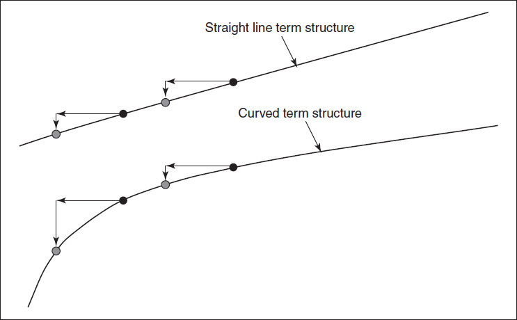

<!-- source:block 5b132b8ccee657ce -->

> [!quote]- English 100
> Of course, it is unlikely that the term structure will remain constant. As market conditions change, the structure can alternate between contango and backward, with varying degrees of curvature for each structure. Because a short-term futures contract will almost always change more quickly than a long-term contract, if a trader believes that a contango structure will become less curved or will move toward a backward structure, the sale of a futures spread (i.e., sell long term, buy short term) is likely to be profitable. If the trader believes that a backward structure will become less curved or will move toward a contango structure, the purchase of a futures spread (i.e., buy long term, sell short term) is likely to be profitable. These two scenarios are shown in Figures 25-14 and 25-15.

当然，期限结构不太可能保持不变。随着市场条件的变化，该结构可以在连续式和向后式之间交替，每个结构的弯曲程度都不同。由于短期期货合约几乎总是比长期合约变化得更快，如果交易者认为期货合约结构将变得不那么弯曲或将转向向后结构，那么期货价差的出售（即，长期出售，短期购买）可能会盈利。如果交易者认为向后结构将变得不那么弯曲或将转向期货溢价结构，则购买期货价差（即，长期买入，短期卖出）可能会盈利。这两种情况如图25-14和25-15所示。

<!-- source:block e2342c2855fec77f -->

*图25-14当期限结构从期货溢价向后移动时的期货价差。 / Figure 25-14 a futures spread when the term structure moves from contango toward backward.*

<!-- source:block 550e0397a640f1df -->

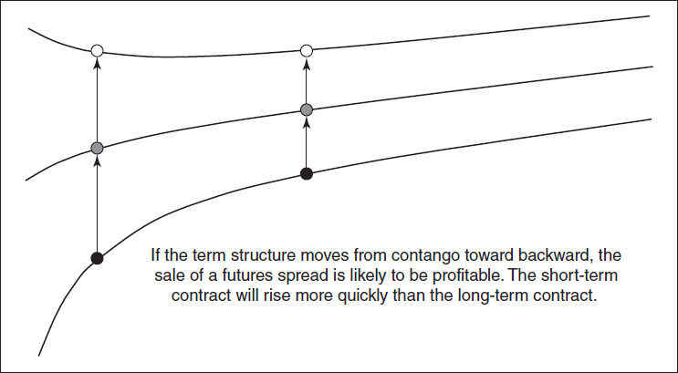

<!-- source:block 3559c6fc905360ad -->

*图25-15期限结构从后向期货溢价移动时的期货价差。 / Figure 25-15 a futures spread when the term structure moves from backward toward contango.*

<!-- source:block dff7daf375b1129d -->

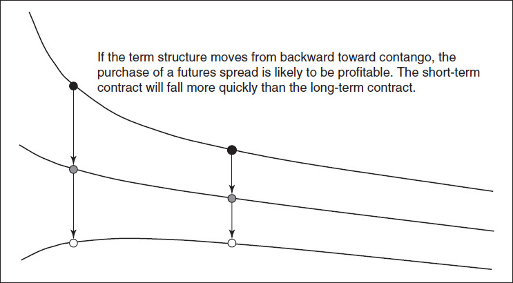

<!-- source:block f4a12c54e28536e2 -->

### VIX 期权 / VIX Options

<!-- source:block 819322d00f1957ac -->

> [!quote]- English 103
> The CBOE began trading VIX options in 2006. The options are European (no early exercise) and settle into the value of the VIX at the opening of trading on expiration Wednesday, with each volatility point having a value of \$100.

芝加哥期权交易所于2006开始交易VIX期权。这些期权是欧洲期权（不得提前行权），并在周三到期交易开盘时结算VIX的价值，每个波动率点的价值为\\$100。

<!-- source:block f8d15f66daec76ac -->

> [!quote]- English 104
> Compared with other financial indexes, the VIX is highly volatile. From Figure 25-4, it’s evident that the VIX can double or even triple in price over short periods of time. The volatile nature of the VIX is confirmed in Figure 25-16, the 50- and 250-day volatilities of the VIX from 2003 to 2012. Over the 10-year sample period, the 50-day volatility occasionally reached highs of almost 200 percent, while it rarely fell below 50 percent. A trader might assume that options on the VIX will be priced accordingly, with implied volatilities that reflect the highly volatile nature of the index. This would be true if one could hedge a VIX option position with the VIX. But because the index itself cannot be easily bought or sold, the instrument that is most commonly used to hedge a VIX option position is a VIX futures contract. VIX futures, however, are less volatile than the index because futures prices tend to change at a slower rate than the price of the index. Figure 25-17 shows the 50-day volatility of the index compared with the same 50-day volatility of the first three futures months. Rarely is the front-month futures contract as volatile as the index. Moreover, back months become progressively less volatile, reflecting the converging term structure of the index.

与其他金融指数相比，波动率指数波动率很大。从图25-4可以看出，VIX的价格可能在短时间内翻一番甚至三倍。VIX的波动率在图25-16中得到了证实，即2003年至2012年VIX的50天和250天波动率。在10年的样本期内，50天波动率偶尔达到近200%的高点，但很少跌破50%。交易员可能会假设VIX期权将相应定价，隐含波动率反映指数的高度波动率。如果可以用VIX对冲VIX期权头寸，这就是正确的。但由于指数本身不能轻易买卖，因此最常用于对冲VIX期权头寸的工具是VIX期货合约。然而，VIX期货的波动率低于指数，因为期货价格的变化速度往往低于指数价格。图25-17显示了该指数50日波动率与前三个期货月相同的50日波动率的比较。上个月期货合约的波动率很少像指数一样大。此外，后几个月的波动率逐渐减弱，反映了该指数的趋同期限结构。

<!-- source:block df81ed8f32327267 -->

*图25-16 ViX 50天和250天历史波动率：2003-2012年。 / Figure 25-16 ViX 50- and 250-day historical volatility: 2003–2012.*

<!-- source:block a85a6295f081d36b -->

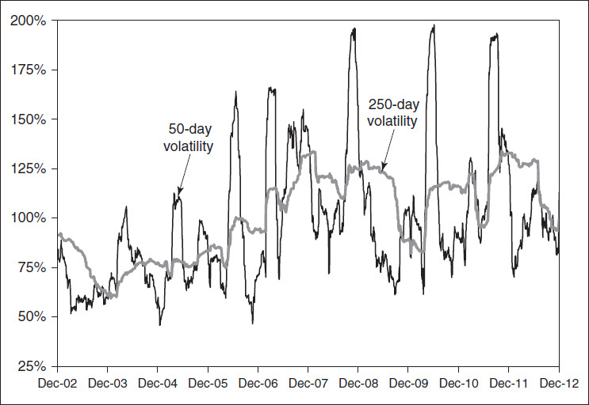

<!-- source:block b3fd8cbf3793cd75 -->

*Figure 25-17 Fifty-day historical volatility of the ViX and the first three futures months. / Figure 25-17 Fifty-day historical volatility of the ViX and the first three futures months.*

<!-- source:block a6f86b97b2fae5d7 -->

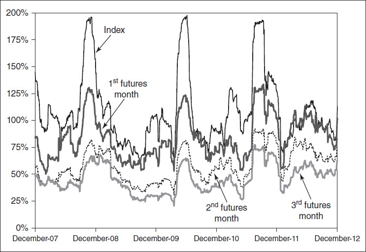

<!-- source:block 6e244f9c73f0b323 -->

> [!quote]- English 107
> Just as a VIX futures trader is likely to be disappointed when a futures contract fails to move as much as the index, a VIX options trader is likely to be disappointed when the value of an option does not react to the full volatility of the index. For a theoretical trader who follows a dynamic hedging procedure, expectations about VIX volatility should focus on the volatility of the futures contract used to hedge the option position, not the volatility of the index.

正如VIX期货交易员可能会在期货合约的波动幅度未能与指数一样大时感到失望一样，VIX期权交易员也可能会在期权的价值不对指数的完全波动率做出反应时感到失望。对于遵循动态对冲程序的理论交易者来说，对VIX波动率的预期应该集中在用于对冲期权头寸的期货合约的波动率上，而不是指数的波动率。

<!-- source:block 0c0ffd58e445e147 -->

> [!quote]- English 108
> Not only do VIX options tend to carry lower implied volatilities than one would expect from the volatility of the index, but the distribution of implied volatilities differs significantly from other option markets. The price of a traditional stock or commodity can, in theory, rise without limit. Moreover, over long periods of time, there is an expectation that the prices of many traded stocks and commodities will appreciate, with longer time periods accompanied by greater appreciation. This is the philosophy behind long-term investing. But, unlike the price of a stock or commodity, over any given period of time, there are practical limits beyond which implied volatility is unlikely to go. An option trader would be surprised indeed to see implied volatility in a stock index market fall below 5 percent, no matter how long he observed the market. A trader would likewise be surprised to see implied volatility rise above 100 percent. Moreover, the value of the VIX is influenced by the mean reverting characteristics of volatility. When the VIX is at a very low level, there is a greater likelihood that it will rise; when it is at a very high level, there is a greater likelihood that it will fall. Consequently, expectations about VIX prices will differ from expectations about the price of traditional underlying contracts. These expectations are reflected in the volatility skew, the distribution of implied volatilities for VIX options across exercise prices.

波动率指数期权的隐含波动率往往低于指数波动率的预期，而且隐含波动率的分布与其他期权市场有很大不同。理论上，传统股票或商品的价格可以无限上涨。此外，在很长一段时间内，人们预期许多交易的股票和商品的价格将升值，时间越长，升值幅度越大。这就是长期投资背后的哲学。但是，与股票或大宗商品的价格不同，在任何特定时期内，隐含波动率都不太可能超过实际限制。无论期权交易员观察市场多久，当他看到股指市场的隐含波动率降至5%以下时，他确实会感到惊讶。交易员同样会惊讶地看到隐含波动率升至100%以上。此外，VIX的价值受到波动率均值恢复特征的影响。当VIX处于非常低的水平时，上涨的可能性更大;当VIX处于非常高的水平时，下跌的可能性更大。因此，对VIX价格的预期将与对传统标的合约价格的预期不同。这些预期反映在波动率偏差中，即VIX期权隐含波动率在行权价中的分布。

<!-- source:block dd1b3781a0c6129e -->

> [!quote]- English 109
> The volatility skews for VIX options on March 19, 2012, are shown in Figure 25-18. The shape of these skews is considerably different from the skew for a typical stock or commodity. With some variation, in most stock and commodity option markets, exercise prices that are farther away from the current underlying price tend to carry increasingly higher implied volatilities—hence the term *volatility smile*. But, for VIX options, the implied volatility of lower exercise prices drops off very quickly. While higher exercise prices carry higher implied volatilities, at some point on the upside, implied volatilities stop increasing and tend to flatten out. Rather than being a smile, the shape of the skew might be described as a half frown.

2012年3月19日VIX期权的波动率倾斜如图25-18所示。这些倾斜的形状与典型股票或商品的倾斜有很大不同。在大多数股票和大宗商品期权市场中，由于存在一定差异，距离当前标的价格较远的行权价往往会带来越来越高的隐含波动率-因此波动率一词微笑。但是，对于VIX期权来说，较低行权价的隐含波动率很快就会下降。虽然较高的行权价带来较高的隐含波动率，但在上行的某个时刻，隐含波动率会停止增加并趋于平缓。倾斜的形状不是微笑，而是可以描述为半皱眉。

<!-- source:block f9ca126c2be9eeeb -->

> [!quote]- English 110
> VIX options seem to be implying a price distribution that is different from a traditional stock or commodity. Using option prices and the butterfly approach described in Chapter 24, we can construct an implied price distribution for the VIX. This distribution is shown in Figure 25-19 for June options on March 19, 2012 with approximately three months remaining to expiration. At the time, June VIX futures were trading at 23.95. Compared with a traditional lognormal distribution, the left tail is much more restricted, reflecting a belief that there is almost no chance that the VIX will be below 10.00 at June expiration. The right tail is also more restricted, perhaps reflecting a belief that large upward moves are less likely than in a lognormal distribution. Although it may be difficult to discern from the graph, the marketplace also seems to be implying a slightly better chance of a very large upward move at the far end of the right tail.

VIX期权似乎意味着与传统股票或商品不同的价格分布。使用期权价格和第24章描述的蝶式价差方法，我们可以构建VIX的隐含价格分布。图25-19显示了2012年3月19日6月期权的分布，距离到期还剩大约三个月。当时，6月VIX期货交易价为23.95。与传统的对数正态分布相比，左尾受到更大的限制，这反映出人们相信VIX在6月到期时几乎不可能低于10.00。右尾也受到更多限制，这也许反映了一种信念，即大幅上涨的可能性低于对正态分布。尽管可能很难从图表中辨别出来，但市场似乎也暗示着右尾远端出现大幅上涨的可能性稍高一些。

<!-- source:block c3423d3f324a9f62 -->

*图25-18 ViX期权隐含波动率倾斜，2012年3月19日。 / Figure 25-18 ViX option implied volatility skews, March 19, 2012.*

<!-- source:block 42a2e593806598ba -->

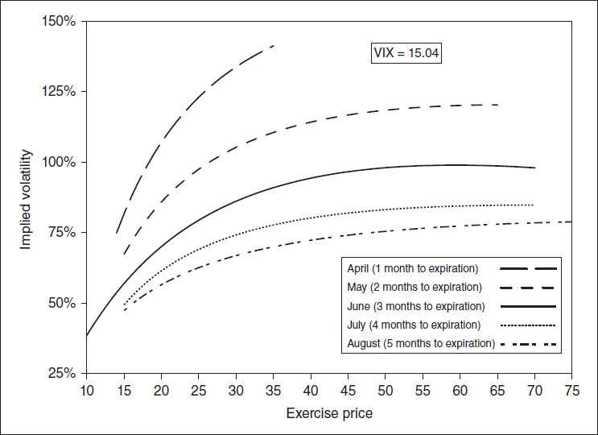

<!-- source:block 8d8b25c1af68f555 -->

*图25-19 ViX期权价格暗示的三个月价格分布，2012年3月19日[三个月（6月）未来为23.95]。 / Figure 25-19 three-month price distribution implied from ViX option prices, March 19, 2012 [with the three-month (June) future at 23.95].*

<!-- source:block 4bd7bf281b89b73a -->

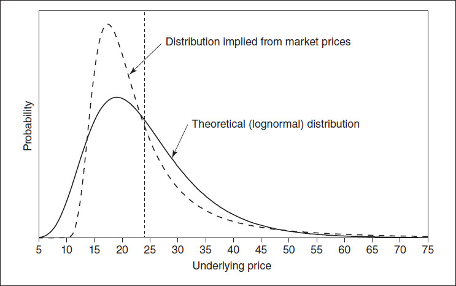

<!-- source:block 785069277227abe1 -->

## 复制波动率合约 / Replicating a Volatility Contract

<!-- source:block 98d64a9acdafa53b -->

> [!quote]- English 113
> Even though replication of a realized variance or VIX position is not a practical choice for most traders, in theory, it is possible to create such a position. How can this be done?

尽管复制已实现方差或VIX头寸对于大多数交易者来说并不是一个实用的选择，但理论上，创建这样的头寸是可能的。这怎么能做到呢？

<!-- source:block fb73f31b875a368e -->

> [!quote]- English 114
> Suppose that a trader sells a realized variance contract at a volatility of 20 (percent), equal to a variance of 202 = 400. If the actual realized volatility over the life of the contract is greater than 20 percent, the trader will lose money; if the actual realized volatility is less than 20 percent, the trader will make money. How can a trader hedge this position? A variance position can be replicated by purchasing a strip of options across all exercise prices. To create a position with a constant-variance exposure, it is necessary to purchase 1/*X*2 (where *X* is the exercise price) of each option. Then, by dynamically hedging the entire position in order to remain delta neutral throughout the life of the variance swap, the total value of the strategy will exactly match the actual realized variance of the variance contract.

假设交易员在波动率为 20% 时卖出一份已实现方差合约，对应的方差为 $20^2 = 400$。若合约存续期内的实际已实现波动率高于 20%，交易员亏损；若低于 20%，交易员获利。如何对冲该头寸？方差头寸可以通过购买横跨所有行权价的一系列期权来复制。为了建立方差敞口保持不变的头寸，对每个行权价 $X$ 都需购买 $1/X^2$ 份期权。随后，在方差互换的整个存续期内对全部头寸进行动态对冲，以维持 Delta 中性，则策略总价值将与方差合约的实际已实现方差完全匹配。

<!-- source:block 425a4f55e8367ac4 -->

> [!quote]- English 115
> It may seem that a volatility position can be replicated using the same approach. But the fact that volatility is the square root of variance means that if the variance exposure is constant, the volatility exposure cannot be constant. Let’s return to an earlier example where a realized volatility contract with a vega exposure of \$10,000 was purchased at a price of 20. We can compare the outcomes in two different cases. In the first case, the contract is settled in variance points, with each point having a value equal to the notional vega divided by twice the volatility price: \$10,000/(2 × 20) = \$250. In the second case, the contract is settled in volatility points with each point have a value of \$10,000.

似乎可以使用相同的方法复制波动率头寸。但波动率是方差的平方根这一事实意味着，如果方差暴露恒定，那么波动率暴露就不可能恒定。让我们回到之前的例子，其中以20的价格购买了Vega风险敞口为10,000美元的已实现波动率合约。我们可以比较两种不同情况下的结果。在第一种情况下，合约以方差点结算，每个点的值等于名义Vega除以波动率价格的两倍：10,000美元/（2 × 20）= 250美元。在第二种情况下，合约以波动点结算，每个点的价值为10,000美元。

<!-- source:block 0b4e12c2582e3225 -->

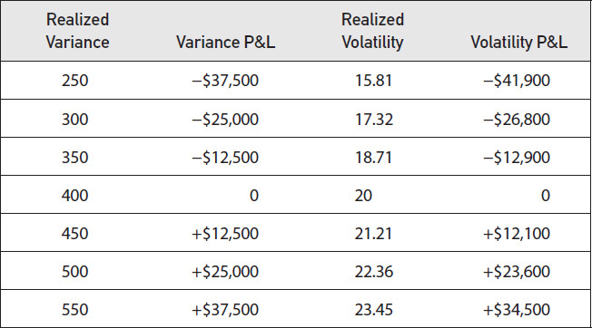

<!-- source:block dc46327eb99a96aa -->

> [!quote]- English 116
> At a realized variance of 400 (a realized volatility of 20), the variance P&L and the volatility P&L are the same. However, as the difference between the contract variance price of 400 (a volatility price of 20) and the realized variance increases, the difference between the variance P&L and volatility P&L increases.

当已实现方差为400（已实现波动率为20）时，方差P & L和波动率P & L相同。然而，随着合约方差价格400（波动率价格20）与已实现方差之间的差异增加，方差P & L和波动率P & L之间的差异也增加。

<!-- source:block 00fb93de72a66a1e -->

> [!quote]- English 117
> A strip of options done in the correct proportion of 1/*X*2 yields a constant exposure to variance. But the same strip of options does not yield a constant exposure to volatility. As realized volatility rises or falls, a trader who uses a strip of options to hedge a volatility position cannot be certain that the strip will exactly offset his position. This uncertainty makes it difficult to hedge volatility exposure, which is why such contracts are usually settled in variance points.

按 $1/X^2$ 的正确比例构建的期权条带，可以产生恒定的方差敞口；但同一期权条带并不能产生恒定的波动率敞口。随着已实现波动率上升或下降，用期权条带对冲波动率头寸的交易员无法确信该条带会恰好抵消其头寸。这种不确定性使波动率敞口难以对冲，因此此类合约通常以方差点结算。

<!-- source:block 38e32f93eb5f897d -->

> [!quote]- English 118
> In our example, if the trader can create the hedge that replicates a long volatility position at a price of 19 (percent), the trader will have a certain profit in the form of an arbitrage. He has a short volatility position at a price of 20 (a variance of 400) and a long variance position at a price 19 (a variance of 361). If the contract is settled in variance points, he must show a profit of 39 × \$250 = \$9,750.

在我们的例子中，如果交易员可以以19（%）的价格创建复制多头波动率头寸的对冲，则交易员将以套利的形式获得一定的利润。他的空头波动率头寸为20（方差为400），多头波动率头寸为19（方差为361）。如果合约以差异点结算，他必须显示39 × 250美元= 9,750美元的利润。

<!-- source:block 6176975851b7d490 -->

> [!quote]- English 119
> If a trader buys the entire strip of options in order to achieve a constant-variance exposure, how can he determine the volatility value of the strip? Did he buy the strip at a volatility of 19 percent, or 20 percent, or 21 percent, or some other volatility? The methodology used by the CBOE to calculate the VIX is essentially a way of turning the cost of the strip into a volatility value. This is analogous to taking the price of an option and turning it into an implied volatility. The VIX methodology takes the prices of all the options in the strip and turns them into an implied volatility position, but one with constant-variance exposure.

如果交易者购买整个期权带以实现恒方差风险敞口，他如何确定期权带的波动率值？他是否以19%、20%、21%的波动率购买了这条带子，或者其他波动率？CBOE计算VIX的方法本质上是将票据成本转化为波动率值的一种方法。这类似于获取期权的价格并将其转化为隐含波动率。VIX方法采用条带中所有期权的价格，并将其转换为隐含波动率头寸，但具有恒定方差风险敞口。

<!-- source:block e846bb9cfc45b34c -->

> [!quote]- English 120
> At expiration, the value of a VIX contract is determined by a single strip of SPX options that expire 30 days in the future. But the VIX represents a constant 30-day implied volatility, and prior to expiration, there are no options that expire in exactly 30 days. Consequently, two strips of options that bracket 30 days are required to calculate the VIX, with appropriate weighting of each strip to yield a 30-day implied volatility. In theory, each strip must be dynamically hedged to remain delta neutral. But VIX replication requires the purchase of one strip and the sale of the one strip, and it turns out that gamma values of each strip will approximately offset each other. With a total gamma close to 0, no delta-neutral rehedging is necessary. The position can be carried to expiration of the VIX contract, at which time the long-term strip can be closed out at the option market prices that will determine the expiration value of the VIX.

到期时，VIX合约的价值由未来30天到期的单一SPX期权决定。但VIX代表了30天不变的隐含波动率，并且在到期之前，没有恰好在30天内到期的期权。因此，需要两条涵盖30天的期权来计算VIX，并对每条期权进行适当的加权以产生30天的隐含波动率。理论上，每个地带都必须动态对冲以保持Delta中性。但VIX复制需要购买一个条带并出售一个条带，事实证明每条条带的Gamma值将大致相互抵消。由于总Gamma接近0，因此不需要Delta中性重新对冲。该头寸可以持续至VIX合约到期，届时长期债券可以以决定VIX到期价值的期权市场价格平仓。

<!-- source:block 9b1eed9d02df217d -->

> [!quote]- English 121
> Unfortunately, there are several problems with this strategy. When the long-term strip is closed, a trader will also want to close the short-term strip. However, while the long-term strip is closed by the special opening rotation on VIX expiration Wednesday, the short-term strip actually expires on either the Friday immediately preceding or immediately following VIX expiration. If the options that make up the short-term strip expire on the Friday after Wednesday VIX expiration, the trader can try to close the short-term strip himself on expiration Wednesday. But in order to do so, he will have to give up the bid-ask spread on every option, and this can be costly. If the options that make up the short-term strip expire on the Friday prior to Wednesday VIX expiration, the trader will have to carry a naked position in the long-term strip for an additional five days. This can also be costly. How can the trader deal with the risk that the short- and long-term strips do not expire at the same time? Unfortunately, there is no good solution to this problem, which is one reason why replicating the VIX is so difficult.

不幸的是，这种策略存在几个问题。当长期条带关闭时，交易员也会希望关闭短期条带。然而，虽然长期条在周三VIX到期时通过特殊开盘轮换而关闭，但短期条实际上在VIX到期前或之后的周五到期。如果构成短期条的期权在周三VIX到期后的周五到期，则交易员可以尝试在周三到期时自己关闭短期条。但为了做到这一点，他将不得不放弃每个期权的买卖价差，而这可能是昂贵的。如果构成短期债券的期权在周三VIX到期前的周五到期，则交易员必须在长期债券中额外持有五天的裸头寸。这也可能很昂贵。交易员如何应对短期和长期票据不同时到期的风险？不幸的是，这个问题没有好的解决方案，这也是复制VIX如此困难的原因之一。

<!-- source:block 8ba6ab63312f62b8 -->

> [!quote]- English 122
> An additional problem arises because the value of the VIX is calculated from the prices of out-of-the-money options. If a trader replicates the VIX by buying one strip and selling another, some of the options that were previously out of the money will almost certainly go into the money over the life of the strip. To have a position that is equal to the VIX value at expiration, the in-the-money options must be converted to out-of-the-money options. We know from synthetics that an in-the-money option hedged with an underlying contract is equivalent to an out-of-the-money option of the opposite type. Therefore, for each option that is in the money, a trader can buy or sell, as necessary, one underlying contract. When the entire position, including the underlying contracts, is closed at expiration, it will exactly equal the expiration value of the VIX. The only problem with this approach is that there is no easily traded underlying for SPX options because the underlying consists of a basket of the 500 stocks that make up the s&P 500. If there are s&P 500 futures available that expire at the same time as the VIX, the futures can be used as a proxy for the underlying contract. Otherwise, a trader may have to create a proxy underlying, perhaps in the form of combos (i.e., long call/short put or short call/long put, with the same exercise price) expiring at the same time as the short-term strip.

还出现了一个额外的问题，因为VIX的价值是根据价外期权的价格计算的。如果交易员通过购买一个条带并出售另一个条带来复制VIX，那么一些之前未存入货币的期权几乎肯定会在该条带的生命周期内进入货币。为了拥有等于到期时VIX值的头寸，价内期权必须转换为价外期权。我们从合成物中知道，用标的合约对冲的价内期权相当于相反类型的价外期权。因此，对于每种货币期权，交易员可以根据需要购买或出售一份标的合约。当整个头寸（包括标的合约）在到期时平仓时，它将完全等于VIX的到期价值。这种方法的唯一问题是SPX期权没有易于交易的标的，因为标的由组成标准普尔500指数的一篮子500只股票组成。如果有标准普尔500指数期货与VIX同时到期，则该期货可以用作标的合约的代理。否则，交易员可能必须创建一个标的代理，可能是组合形式（即，多头看涨/空头看跌或空头看涨/多头看跌，具有相同的行权价）与短期票据同时到期。

<!-- source:block df913bcb8a93b7d0 -->

> [!quote]- English 123
> While a professional derivatives trading firm might in some cases seek to replicate a realized variance or VIX contract in the option market, for most traders, given the complexities, replicating these contracts is not a realistic possibility.

虽然专业衍生品交易公司在某些情况下可能会寻求在期权市场中复制已实现方差或VIX合约，但对于大多数交易员来说，鉴于其复杂性，复制这些合约并不现实。

<!-- source:block 478fffdd310add25 -->

## 波动率合约的应用 / Volatility Contract Applications

<!-- source:block 2349f8f47141db62 -->

> [!quote]- English 124
> Certainly the most common use of VIX and variance contracts is to speculate on volatility. A trader who has an opinion on whether realized volatility will rise or fall can speculate by buying or selling a variance swap. A trader who has an opinion on whether implied volatility will rise or fall can speculate by buying or selling a VIX contract. In the latter case, a trader can speculate directly on implied volatility by trading VIX futures or speculate on VIX volatility by trading VIX options.

当然，VIX和方差合约最常见的用途是投机波动率。对已实现波动率是否会上升或下降有意见的交易员可以通过购买或出售方差掉期来进行投机。对隐含波动率是否上升或下降有意见的交易员可以通过买卖VIX合约进行投机。在后一种情况下，交易员可以通过交易VIX期货直接投机隐含波动率，或者通过交易VIX期权投机VIX波动率。

<!-- source:block 2d60b3a89d2516a1 -->

> [!quote]- English 125
> Volatility contracts can also be used as a hedging instrument. Market makers and hedge fund managers sometimes acquire volatility positions, perhaps unintentionally, as a result of their market activities. If they want to hedge away some of this volatility risk, variance and VIX contracts offer a simple way of doing this. A trader who has a realized volatility position, either a positive or negative gamma, can trade variance contracts to hedge his realized volatility risk. A trader who has an implied volatility position, either a positive or negative vega, can trade VIX contracts to hedge his implied volatility risk.

波动率合约也可以用作对冲工具。做市商和对冲基金经理有时会因其市场活动而无意地获得波动率头寸。 如果他们想对冲部分波动率风险，方差和VIX合约提供了一种简单的方法。拥有已实现波动率头寸（正或负Gamma）的交易员可以交易方差合约来对冲其已实现波动率风险。 拥有隐含波动率头寸（无论是正值还是Vega）的交易员可以交易VIX合约以对冲其隐含波动率风险。

<!-- source:block ecf3f81e346df771 -->

> [!quote]- English 126
> In addition to hedging a volatility position, VIX contracts can sometimes be used as a hedge against a market position, especially a market position that approximates a broad-based portfolio. Because there is an inverse correlation between movement in the stock market and changes in implied volatility (see Figures 25-4 and 25-5), a portfolio manager who is long equities might take a long position in the VIX by either buying VIX futures, buying VIX calls, or selling VIX puts. If stock prices decline, there is an expectation that implied volatility will rise, and the resulting increase in value of the VIX position will offset at least some of the losses in the stock market.

除了对冲波动率头寸外，VIX合约有时还可用于对冲市场头寸，尤其是接近广泛投资组合的市场头寸。由于股市走势与隐含波动率变化之间存在负相关性（见图25-4和25-5），做多股票的投资组合经理可能会通过购买VIX期货、购买VIX看涨期权或出售VIX看跌期权来持有VIX看涨头寸。如果股价下跌，预计隐含波动率将上升，由此产生的波动率头寸价值增加将至少抵消股市的部分损失。

<!-- source:block c4eae1c326cba9a2 -->

> [!quote]- English 127
> Although volatility contracts are used most often to address direct volatility concerns, market participants sometimes take on indirect volatility positions, positions that have volatility implications that are not immediately apparent. For example, an option market maker typically profits from higher option trading volume. But higher volume is often the result of higher volatility. When there is greater volatility, there is greater demand for options. As such, the market maker has an indirect long volatility position. He would like volatility to increase not because he has intentionally taken a long volatility position but because he is in a business where higher volatility tends to result in higher profits. To hedge this indirect long volatility position, market makers sometimes take a short volatility position in volatility contracts, most commonly the VIX. Of course, the market maker is really hedging trading volume, and he should not take such a large VIX position that his attention is diverted from his primary market-making activities.

尽管波动率合约最常用于解决直接波动率担忧，但市场参与者有时会采取间接波动率头寸，这些头寸具有不明显的波动率影响。例如，期权做市商通常从更高的期权交易量中获利。但成交量的增加往往是波动率较高的结果。当波动率更大时，对期权的需求就更大。因此，做市商拥有间接多头波动头寸。他希望波动率增加，并不是因为他故意持有多头波动率头寸，而是因为他所处的业务波动率更高往往会带来更高的利润。为了对冲这种间接多头波动率头寸，做市商有时会在波动率合约（最常见的是VIX）中采取空头波动率头寸。当然，做市商实际上是在对冲交易量，他不应该持有如此大的VIX头寸，从而转移他的注意力从他的主要做市活动上。

<!-- source:block 3cb67d3c9644c65f -->

> [!quote]- English 128
> Another type of indirect volatility position is one in which a portfolio manager is required to periodically rebalance a portfolio. There is a cost to the rebalancing process, and the cost is typically higher in times of high volatility when bid-ask spreads tend to widen. The portfolio manager therefore takes on a short volatility position as the rebalancing period approaches. He can hedge this short volatility position by taking a long volatility position in the VIX.

另一种类型的间接波动率头寸是要求投资组合经理定期重新平衡投资组合的头寸。再平衡过程是有成本的，而且在高波动时期，当买卖价差趋于扩大时，成本通常会更高。因此，随着再平衡期的临近，投资组合经理采取空头波动率头寸。他可以通过持有波动率指数的多头波动率头寸来对冲这种空头波动率头寸。

<!-- source:block 9c845bf02db3366f -->

> [!quote]- English 129
> Finally, there are some positions that are taken in the option market that are not usually thought of as volatility positions but that have volatility implications. Perhaps the most common option hedging strategy is the covered call, the sale of call options against a long underlying position. Consider a portfolio manager who sells index calls against a broad-based portfolio of stocks. What are his goals? First, he wants the value of his portfolio to increase. Second, he wants to outperform some benchmark against which his performance is measured, perhaps a broad-based index such as the s&P 500.

最后，在期权市场中，有一些头寸通常不被认为是波动率头寸，但具有波动率影响。也许最常见的期权套期保值策略是备兑看涨期权，即针对多头标的头寸出售看涨期权。考虑一个投资组合经理，他出售一个基础广泛的股票投资组合的指数看涨期权。他的目标是什么？首先，他希望他的投资组合的价值增加。其次，他希望超越衡量他业绩的某个基准，也许是标准普尔500指数等广泛的指数。

<!-- source:block da3c94d97a4b96fa -->

> [!quote]- English 130
> If the manager sells calls against his portfolio holdings and the market rises, he will achieve his first goal because the portfolio will increase in value. But, if the market rises too far, eventually the calls he sold will be exercised, limiting the upside profit potential. If the market continues to rise, he will fail in his second goal because the benchmark index will eventually outperform the portfolio.

如果经理出售针对他的投资组合持有的看涨期权并且市场上涨，他将实现他的第一个目标，因为投资组合的价值将会增加。但是，如果市场上涨太多，他出售的看涨期权最终将被行权，从而限制上行利润潜力。如果市场继续上涨，他的第二个目标就会失败，因为基准指数最终将优于投资组合。

<!-- source:block d80afa2b16f8bb17 -->

> [!quote]- English 131
> If the manager sells calls against his portfolio and the market declines, he will achieve his second goal of outperforming the index because he will have taken in premium through the sale of calls. But, if the decline is great enough, he will fail in his first goal because the covered calls offer only a partial hedge against a declining market.

如果经理出售针对其投资组合的看涨期权并且市场下跌，他将实现表现优于指数的第二个目标，因为他将通过出售看涨期权获得溢价。但是，如果跌幅足够大，他的第一个目标就会失败，因为备兑看涨期权只能部分对冲市场下跌。

<!-- source:block 117e7649c2716995 -->

> [!quote]- English 132
> From the portfolio manager’s point of view, the covered call strategy will perform best, and he will achieve both his goals when the market either doesn’t move or moves very little. The portfolio will increase in value as a result of the premium received for the covered calls. And the portfolio will outperform a benchmark index that consists only of stocks. If the portfolio manager wants the market to sit still, he has a short volatility position. He can hedge away some of the risk of a short volatility position by taking a long VIX position, usually by buying VIX futures.

从投资组合经理的角度来看，备兑看涨期权策略将表现最好，当市场不动或波动很小时，他将实现他的两个目标。由于备兑看涨期权获得的溢价，该投资组合的价值将增加。 该投资组合的表现将优于仅由股票组成的基准指数。如果投资组合经理希望市场保持静止，他就会持有空头波动率头寸。 他可以通过持有VIX多头头寸（通常通过购买VIX期货）来对冲空头波动率头寸的部分风险。

<!-- source:block 25a4aa41d1099c26 -->

> [!note] Footnote 133
> 1 When a contract is traded between private parties without an exchange as an intermediary, the possibility of one party defaulting on its obligations adds an additional risk dimension to the trade. Counterparty risk can be an important consideration in the off-exchange market.

[^ovp25-1]: 当合约在没有交易所作为中间人的私人当事人之间进行交易时，一方违约义务的可能性会给交易增加额外的风险维度。交易对手风险可能是场外市场的一个重要考虑因素。

<!-- source:block 922e2063fc99a975 -->

> [!note] Footnote 134
> 2 For a description of the original VIX methodology, see Robert Whaley, “Derivatives on Market Volatility: Hedging Tools Long Overdue,” *Journal of Derivatives*, Fall 1993, pp. 71–84.

[^ovp25-2]: 有关原始VIX方法的描述，请参阅Robert Whaley，“市场波动率的衍生品：对冲工具长期运行”，Journal of Derivals，Fall 1993，pp。71-84.

<!-- source:block 4f86af0637ed0498 -->

> [!note] Footnote 135
> 3 Kresimir Demeterfi, Emmanuel Derman, Michael Kamal, and Joseph Zou, “More than You Ever Wanted to Know about Volatility Swaps,” Goldman Sachs Quantitative Strategies Research Notes, New York, March 1999.

[^ovp25-3]: Kresimir Demeterfi、Emmanuel Derman、Michael Kamal和Joseph Zou，“关于波动率互换的信息比你想知道的还要多”，高盛量化策略研究笔记，纽约，3月1999。

<!-- source:block 223952028fe8c7f7 -->

> [!note] Footnote 136
> 4 This is essentially equivalent to buying at-the-money straddles.

[^ovp25-4]: 这实质上等同于买入平值跨式期权组合。

<!-- source:block 4dfee3b77693d395 -->

> [!note] Footnote 137
> 5 For a detailed description of the VIX calculation methodology, see “The CBOE Volatility Index,” available at: https://www.cboe.com/micro/vix/vixwhite.pdf.

[^ovp25-5]: 有关波动率指数计算方法的详细说明，请参阅“芝加哥期权交易所波动率指数”，网址：https://www.cboe.com/micro/vix/vixwhite.pdf。

---

[[阅读导航|← 返回阅读导航]]

<!-- chapter-nav:start -->
> [!tip] 章节导航（章末）
> [[波动率偏斜 Volatility Skews|← 上一章]] · [[阅读导航|全书导航]]
<!-- chapter-nav:end -->
