# 牛市与熊市价差 / Bull and Bear Spreads

[[阅读导航|← 返回阅读导航]]

> [!warning] 翻译状态
> 本章双语稿已生成，尚待逐段人工复核。英文原文、数字、公式和图表保留用于核对。

<!-- chapter-toc:start -->
## 本章目录 / Chapter Outline

> [!abstract] 结构导航
> 以下标题按原书顺序保留；点击可直接跳转。

- [[#裸头寸 / Naked Positions|裸头寸 / Naked Positions]]
- [[#牛市与熊市比率价差 / Bull and Bear ratio Spreads|牛市与熊市比率价差 / Bull and Bear ratio Spreads]]
- [[#牛市与熊市蝶式及日历价差 / Bull and Bear Butterflies and Calendar Spreads|牛市与熊市蝶式及日历价差 / Bull and Bear Butterflies and Calendar Spreads]]
- [[#垂直价差 / Vertical Spreads|垂直价差 / Vertical Spreads]]
<!-- chapter-toc:end -->
<!-- chapter-nav:start -->
> [!tip] 章节导航（章首）
> [[波动率价差策略 Volatility Spreads|← 上一章]] · [[阅读导航|全书导航]] · [[风险考量 Risk Considerations|下一章 →]]
<!-- chapter-nav:end -->
<!-- source:block 6fb68652c6f376b8 -->

> [!quote]- English 1
> Although delta-neutral volatility trading is the foundation of theoretical option pricing, there is no law that requires a trader to initiate and maintain a delta-neutral position. Many traders prefer to trade from a bullish or bearish perspective. The trader who wishes to take a directional position has the choice of doing so in either the underlying instrument itself, buying or selling a futures contract or stock, or by taking the position in the option market. If the trader takes a directional position in the option market, he must still be aware of the volatility implications. Otherwise, he may be no better off, and perhaps even worse, than if he had taken an outright position in the underlying contract.

尽管Delta中性波动率交易是理论期权定价的标的，但没有法律要求交易员发起并维持Delta中性头寸。许多交易者更喜欢从看涨或看跌的角度进行交易。希望持有方向性头寸的交易者可以选择在标的工具本身中这样做，购买或出售期货合约或股票，或者通过在期权市场上进行头寸。如果交易员在期权市场采取方向性头寸，他仍然必须意识到波动率的影响。否则，他的处境可能不会比他在标的合约中直接采取头寸更好，甚至可能更糟。

<!-- source:block 8a62406751090412 -->

## 裸头寸 / Naked Positions

<!-- source:block 726ccafca3e267b7 -->

> [!quote]- English 2
> Because the purchase of calls or the sale of puts will create a positive delta position and the sale of calls or purchase of puts will create a negative delta position, we can always take a directional position in a market by taking an appropriate naked position in either calls or puts. If implied volatility is high, we can sell puts to create a bullish position or sell calls to create a bearish position. If implied volatility is low, we can buy calls to create a bullish position or buy puts to create a bearish position.

由于购买看涨期权或出售看跌期权将产生正的Delta头寸，而出售看涨期权或购买看跌期权将产生负的Delta头寸，因此我们始终可以通过在看涨期权或看跌期权中采取适当的裸头寸来在市场上采取定向头寸。如果隐含波动率很高，我们可以卖出看跌期权以创建看涨头寸，或者卖出看涨期权以创建看跌头寸。如果隐含波动率较低，我们可以买入看涨看涨头寸或买入看跌头寸以创建看跌头寸。

<!-- source:block c2beb3d25d0ad2e7 -->

> [!quote]- English 3
> The problem with this approach is that there is very little margin for error. If we purchase options, we will lose money not only if the market moves in the wrong direction but also if the market fails to move fast enough to offset the option’s time decay. If we sell options, time will work in our favor, but we face the prospect of unlimited risk if the market moves violently against us. An experienced trader will prefer a strategy that improves the risk-reward tradeoff by looking for positions with the greatest possible margin for error. This philosophy applies no less to directional strategies than to volatility strategies.

这种方法的问题在于误差幅度很小。如果我们购买期权，我们不仅会在市场走势错误的情况下赔钱，而且如果市场走势不够快来抵消期权的时间衰退，我们也会赔钱。如果我们出售期权，时间会对我们有利，但如果市场对我们剧烈波动，我们将面临无限风险的前景。经验丰富的交易员会更喜欢通过寻找具有最大误差保证金的头寸来改善风险回报权衡的策略。这种理念不仅适用于波动率策略，也适用于方向性策略。

<!-- source:block 160b6e131b1d371c -->

## 牛市与熊市比率价差 / Bull and Bear ratio Spreads

<!-- source:block f301270f95e3f456 -->

> [!quote]- English 4
> Consider a situation where we believe that implied volatility is too high. One possible strategy is a ratio spread where more options are sold than purchased. With the underlying market at 101, ten weeks remaining to June expiration, and a volatility of 30 percent, a June 100 call has a delta of 56 and a June 110 call has a delta of 28.1 A delta-neutral spread might consist of

考虑我们认为隐含波动率过高的情况。一种可能的策略是比例价差，即出售的期权多于购买的期权。 由于标的市场在6月到期前还有101,十周，且波动率为30 %，因此6月100的看涨期权的Delta为56，6月110的看涨期权的Delta为28。Delta中性价差可能包括 [^ovp12-1]

<!-- source:block 402a62f5caf0f6c0 -->

> [!quote]- English 5
> Buy 1 June 100 call (56)

购买6月1日100看涨期权（56）

<!-- source:block e0dbb4c23ee7f284 -->

> [!quote]- English 6
> Sell 2 June 110 calls (28)

出售6月2日110看涨期权（28）

<!-- source:block 4db1ee6e4f94c600 -->

> [!quote]- English 7
> Because the spread is delta neutral, it has no particular preference for upward or downward movement in the underlying market.

由于价差是Delta中性的，因此它对标的市场的向上或向下移动没有特别偏好。

<!-- source:block f3f8a406097ac968 -->

> [!quote]- English 8
> Now suppose that we believe that this ratio spread is a sensible strategy, but at the same time, we are also bullish on the market. There is no law that requires us to do this spread in a delta-neutral ratio. If we want the spread to reflect a bullish sentiment, we might adjust the ratio slightly

现在假设我们认为这个价差是一个明智的策略，但同时，我们也看好市场。没有法律要求我们以Delta中性比例进行这种价差。如果我们希望价差反映看涨情绪，我们可能会稍微调整比率

<!-- source:block fecbe4f3a61dd184 -->

> [!quote]- English 9
> Buy 2 June 100 calls (56)

购买6月2日100个看涨期权（56）

<!-- source:block 6926afc75ef43d50 -->

> [!quote]- English 10
> Sell 3 June 110 calls (28)

出售6月3日110看涨期权（28）

<!-- source:block 7de4623317dcc632 -->

> [!quote]- English 11
> We have essentially the same ratio spread, but with a bullish bias. This is reflected in the total delta of +28.

我们的价差基本上相同，但存在看涨偏见。这反映在+28的总Delta中。

<!-- source:block 02f5c4a4c0f923b2 -->

> [!quote]- English 12
> There is, however, an important limitation if we use a ratio strategy to create a bullish or bearish position. In our example, we are initially bullish, but the position is still a ratio spread with a negative gamma. If the underlying market moves up too quickly, the spread can invert from a positive to a negative delta. If the market rises far enough, to 130 or 140, eventually all options will go deeply into the money, and the deltas of both the June 100 and June 110 calls will approach 100. We will be left with a delta position of –100. Even though we may be correct in our bullish sentiment, the volatility characteristics of the position will eventually outweigh any considerations of market direction. The delta values of both ratios, 1 × 2 and 2 × 3, with respect to changes in the underlying price, are shown in Figure 12-1.

然而，如果我们使用比率策略来创建看涨或看跌头寸，则存在一个重要的限制。在我们的例子中，我们最初看涨，但头寸仍然是负Gamma的比率价差。如果标的市场上涨过快，价差可能会从正值转变为负值。如果市场上涨足够远，达到130或140，最终所有期权都会深入资金，6月100日和6 月到期、行权价为 110 的看涨期权的Delta都将接近100。我们的Delta头寸将为-100。尽管我们的看涨情绪可能是正确的，但头寸的波动率特征最终将超过对市场方向的任何考虑。图12-1显示了1 × 2和2 × 3两个比率相对于标的价格变化的Delta值。

<!-- source:block b0e2eb7ab1d7f815 -->

*图12-1随着标的价格变化的比率价差Delta。80 / Figure 12-1 Delta of a ratio spread as the underlying price changes. 80*

<!-- source:block f5ff98ea70f7a2e6 -->

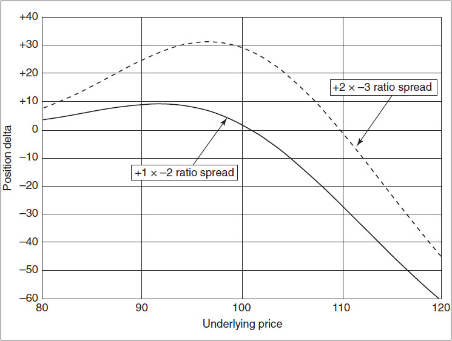

<!-- source:block 8bc3804066ae8481 -->

> [!quote]- English 14
> The delta can also invert in a ratio spread in which more options are purchased than sold. Unlike a negative gamma position, where the inversion is caused by swift price movement in the underlying contract, this type of ratio spread can invert when volatility declines or time passes. Suppose that conditions are the same as in our preceding example, but we believe that implied volatility is too low. Now we might do the following delta-neutral strategy:

Delta还可以在比例差中倒置，购买的期权多于出售的期权。与负Gamma头寸（倒置是由标的合约的快速价格波动引起的）不同，这种类型的比率价差可以在波动率下降或时间过去时倒置。假设条件与前面的例子相同，但我们认为隐含波动率太低。现在我们可能会采取以下Delta中性策略：

<!-- source:block 28e40230a4dc5e08 -->

> [!quote]- English 15
> Buy 2 June 110 calls (28)

购买6月2日110看涨期权（28）

<!-- source:block 1f12fca95164d46c -->

> [!quote]- English 16
> Sell 1 June 100 call (56)

6月1日卖出100看涨（56）

<!-- source:block bb48912033409939 -->

> [!quote]- English 17
> However, if we are bullish on the market, we can, as in the preceding example, adjust the ratio to reflect this sentiment

然而，如果我们看好市场，我们可以像前面的例子一样调整比率以反映这种情绪

<!-- source:block f940190e3f6bdcef -->

> [!quote]- English 18
> Buy 3 June 110 calls (28)

购买6月3日110看涨期权（28）

<!-- source:block 1f12fca95164d46c -->

> [!quote]- English 19
> Sell 1 June 100 call (56)

6月1日卖出100看涨（56）

<!-- source:block 144e8d8e2931f77c -->

> [!quote]- English 20
> The delta position of +28 reflects this bullish bias.

+28的Delta头寸反映了这种看涨偏见。

<!-- source:block 03e208d4b1986225 -->

> [!quote]- English 21
> We know from Chapter 9 that as time passes or as volatility declines, all deltas move away from 50. If time passes with no movement in the underlying contract, the delta of the June 100 call will tend to rise, while the delta of the June 110 call will tend to decline. If, after a period of time, the delta of the June 100 call rises to 70 and the delta of the June 110 call falls to 15, the delta of the position will no longer be +28 but will instead be –25. Because this strategy is a volatility spread, the primary consideration, as before, is the volatility of the market. Only secondarily are we concerned with the direction of movement. If we overestimate volatility and the market moves more slowly than expected, the spread, which is initially delta positive, can instead become delta negative. The delta values of both positions with respect to the passage of time are shown in Figure 12-2.

我们从第9章知道，随着时间的推移或波动率的下降，所有Delta都会远离50。如果随着时间的推移，标的合约没有变化，6 月到期、行权价为 100 的看涨期权的Delta将趋于上升，而6 月到期、行权价为 110 的看涨期权的Delta将趋于下降。如果一段时间后，6 月到期、行权价为 100 的看涨期权的Delta上升到70，6 月到期、行权价为 110 的看涨期权的Delta下降到15，那么头寸的Delta将不再是+28，而是-25。由于该策略是波动率价差，因此与以前一样，主要考虑因素是市场的波动率。其次，我们关心的是运动的方向。如果我们高估了波动率，并且市场走势比预期慢，那么最初为Delta正的价差可能会变成Delta负的。两个头寸相对于时间流逝的Delta值如图12-2所示。

<!-- source:block ac31b31b226a7f37 -->

*图12-2随着时间的推移，比率价差的Delta。 / Figure 12-2 Delta of a ratio spread as time passes.*

<!-- source:block a6cb90d3b9e55389 -->

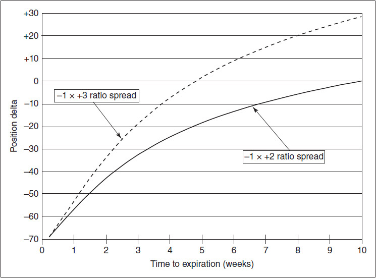

<!-- source:block aefacda1498949b0 -->

## 牛市与熊市蝶式及日历价差 / Bull and Bear Butterflies and Calendar Spreads

<!-- source:block 994f790c07914211 -->

> [!quote]- English 23
> Butterflies and calendar spreads can also be executed in a way that reflects a bullish or bearish bias. As with ratio spreads, though, their delta characteristics can invert as market conditions change.

蝶式价差和日历价差也可以以反映看涨或看跌偏见的方式执行。不过，与比率价差一样，它们的Delta特征可能会随着市场条件的变化而逆转。

<!-- source:block b91a78a28ddfa51f -->

> [!quote]- English 24
> With high implied volatility and the underlying contract at 100, we might create a delta-neutral position by buying the June 95/100/105 call butterfly (buy a 95 call, sell two 100 calls, buy a 105 call). We hope that the underlying will stay close to 100 so that at expiration the butterfly will widen to its maximum value of 5.00. If, however, we want to buy a butterfly but are also bullish on the market, we can choose a butterfly in which the inside exercise price is above the current price of the underlying contract. If the underlying is currently at 100, we might choose to buy the June 105/110/115 call butterfly. Because this position wants the underlying contract to be at the inside exercise price of 110 at expiration and it is currently at 100, the position is a bullish butterfly. This will be reflected in the position having a positive delta.

由于隐含波动率高且标的合约为100，我们可能会通过买入6月95/100/105看涨期权（买入95看涨期权，卖出两个100看涨期权，买入105看涨期权）来创建Delta中性头寸。我们希望标的指数保持在100附近，以便到期时蝶式价差将扩大到最大值5.00。然而，如果我们想购买一只蝴蝶，但又看涨市场，我们可以选择一只内部行权价高于标的合约当前价格的蝴蝶。如果标的目前为100，我们可能会选择购买6月105/110/115看涨蝴蝶。由于该头寸希望标的合约到期时的内部行权价为110，而目前为100，因此该头寸是看涨蝴蝶。这将反映在具有正Delta的头寸上。

<!-- source:block eb770f5dfd7ed660 -->

> [!quote]- English 25
> Unfortunately, if the underlying market moves up too far, say, to 120, the butterfly will invert from a positive to a negative delta position. Now we want the market to fall back from 120 to 110. Whenever the underlying market is below 110, the position will be bullish; whenever the underlying market is above 110, the position will be bearish.

不幸的是，如果标的市场上涨太远，例如达到120，蝶式价差就会从正Delta头寸翻转为负Delta头寸。现在我们希望市场从120回落到110。每当标的市场低于110时，该头寸就会看涨;每当标的市场高于110时，该头寸就会看跌。

<!-- source:block 5125c4fc6f3ebcb4 -->

> [!quote]- English 26
> Conversely, if we are bearish, we can choose to buy a butterfly in which the inside exercise price is below the current price of the underlying market. But again, if the market moves down too quickly and goes through the inside exercise price, the position will invert from a negative to a positive delta. The delta position of a butterfly with respect to changes in the underlying price is shown in Figure 12-3.

相反，如果我们看空，我们可以选择购买内部行权价低于标的市场当前价格的蝶式价差。但同样，如果市场下跌过快并经历内部行权价，头寸将从负转变为正Delta。蝶式价差相对于标的价格变化的Delta头寸如图12-3所示。

<!-- source:block eef644bd4b5fca9a -->

*Figure 12-3 Delta of a long butterfly as the underlying price changes. / Figure 12-3 Delta of a long butterfly as the underlying price changes.*

<!-- source:block 27cec74e0931043a -->

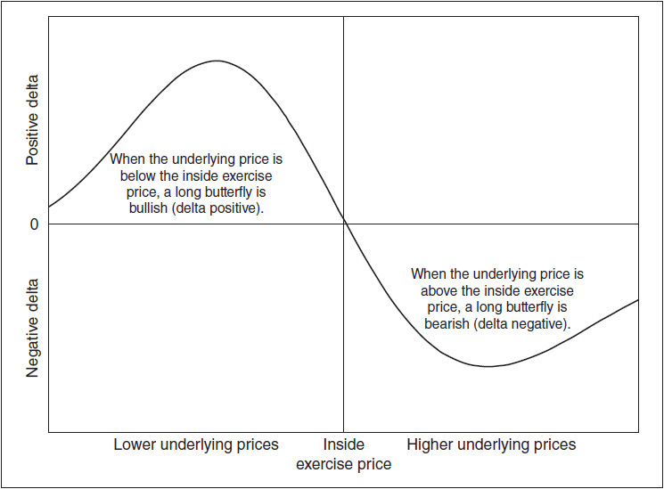

<!-- source:block 0c911ce88bb12cd7 -->

> [!quote]- English 28
> We can also choose a bullish or bearish calendar spread. A long calendar spread always wants the short-term option to expire exactly at the money. A long calendar spread will be initially bullish if the exercise price is above the current price of the underlying contract.2 With the underlying at 100, the June/April 110 calendar spread (buy the June 110 option, sell the April 110 option of the same type) will be bullish because the trader will want the underlying price to rise to 110 by April expiration. The June/April 90 calendar spread (buy the June 90 option, sell the April 90 option of the same type) will be bearish because the trader will want the underlying price to fall to 90 by April expiration. But like a long butterfly, a long calendar spread has a negative gamma. If the underlying contract moves through the exercise price, the delta will invert. If the market moves from 100 to 120, the June/April 110 calendar spread, which was initially bullish, will become bearish. If the market moves from 100 to 80, the June/April 90 calendar spread, which was bearish initially, will become bullish. The delta values of long calendar spreads with respect to changes in the underlying price are shown in Figure 12-4.3

我们还可以选择看涨或看跌的日历价差。长日历价差总是希望短期期权在ATM机上到期。如果行权价高于标的合约的当前价格，那么长日历价差最初将看涨。 如果标的价格为100,，则6月/4月的110日历价差（买入6月的110期权，卖出4月的110同类型期权）将看涨，因为交易员希望标的价格在4月到期前升至110。 6月/4月的90日历价差（买入6月的90期权，卖出4月的90同类型期权）将是看跌的，因为交易员希望标的价格在4月到期前跌至90。但就像多头蝶式价差一样，长日历价差具有负的Gamma。 如果标的合约变动至行权价，则Delta将倒置。如果市场从100移动到120,，最初看涨的6月/4月110日历价差将变成看跌。 如果市场从100移动到80,，6月/4月90日历价差最初为熊市，将变成看涨。长日历价差相对于标的价格变化的Delta值如图12-4所示。 [^ovp12-2] [^ovp12-3]

<!-- source:block 36c40e95abaebcbd -->

*图12-4随着标的价格变化的长日历价差Delta。 / Figure 12-4 Delta of a long calendar spread as the underlying price changes.*

<!-- source:block f3d51c8dd3c06fa7 -->

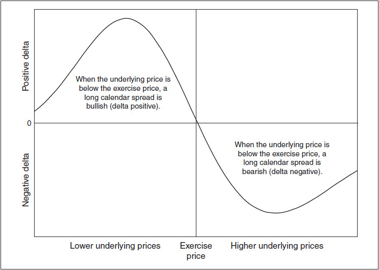

<!-- source:block ac66f2d709b4b55c -->

## 垂直价差 / Vertical Spreads

<!-- source:block 2b606a4fb47150df -->

> [!quote]- English 30
> Although we may take a bullish or bearish position by choosing an appropriate ratio spread, butterfly, or calendar spread, in each of these positions, volatility is still the primary concern. We can be right about market direction, but if we are wrong about volatility, the spread may not retain the directional characteristics that we originally intended.

尽管我们可能会通过选择适当的比率价差、蝶式价差或日历价差来采取看涨或看跌的头寸，但在每一种头寸中，波动率仍然是主要问题。我们对市场方向的判断可能是正确的，但如果我们对波动率的判断是错误的，那么价差可能无法保留我们最初预期的方向特征。

<!-- source:block fde68fa23c23565b -->

> [!quote]- English 31
> If we want to focus primarily on the direction of the underlying market, we might look for a spread in which the directional characteristics are the primary concern and the volatility characteristics are only of secondary importance. We would like to be certain that if the spread is initially bullish (delta positive), it will remain bullish under all possible market conditions, and if it is initially bearish (delta negative), it will remain bearish under all possible market conditions.

如果我们想主要关注标的市场的方向，我们可能会寻找一种价差，其中方向特征是主要关注的，波动率特征只是次要的。我们希望确定的是，如果价差最初看涨（Delta为正），那么在所有可能的市场条件下它将保持看涨，如果最初看跌（Delta为负），那么在所有可能的市场条件下它将保持看跌。

<!-- source:block aa2765a0eb0498a3 -->

> [!quote]- English 32
> The most common class of spreads that meet these requirements are simple call and put spreads. One option is purchased and one option is sold, where both options are the same type (either both calls or both puts) and expire at the same time. The options are distinguished only by their different exercise prices. Such spreads may also be referred to as *credit* and *debit spreads* or *vertical spreads*.4 Typical spreads of this type might be

满足这些要求的最常见的价差是简单的看涨价差和看跌价差。购买一个期权，出售一个期权，其中两个期权类型相同（要么是看涨期权，要么是看跌期权）并且同时到期。期权仅通过其不同的行权价来区分。此类价差也可称为 credit spread和 debit spread或垂直价差。[^ovp12-4]此类典型价差可能是

<!-- source:block 9bfd5565083be6d9 -->

> [!quote]- English 33
> Buy 1 June 100 call

购买6月1日100看涨期权

<!-- source:block 69ad571a81bd28f8 -->

> [!quote]- English 34
> Sell 1 June 105 call

卖出6月1日105看涨

<!-- source:block 7e7222de590dad25 -->

> [!quote]- English 35
> or

或

<!-- source:block 6c7a81b328846fad -->

> [!quote]- English 36
> Buy 1 December 105 put

买入 1 份 December 105 put

<!-- source:block 6fa4ea9f186ad9b1 -->

> [!quote]- English 37
> Sell 1 December 95 put

卖出 1 份 December 95 put

<!-- source:block 1406f246b7eddff0 -->

> [!quote]- English 38
> Simple call and put spreads are initially either bullish or bearish, and they remain bullish or bearish no matter how market conditions change. Two options that have different exercise prices but that are otherwise identical cannot have identical deltas. In the first example, where the trader is long a June 100 call and short a June 105 call, the June 100 call will always have a delta greater than the June 105 call. If both options are deeply in the money or very far out of the money, the deltas may tend toward 100 or 0. But even then, the June 100 call will have a delta that is slightly greater than that of the June 105 call. In the second example, no matter how market conditions change, the December 105 put will always have a greater negative delta than the December 95 put.

简单看涨价差和看跌价差在建立时要么偏多、要么偏空，而且无论市场条件怎样变化，这一方向性都不会改变。除行权价外其他条件完全相同的两份期权，不可能具有相同的 Delta。在第一个例子中，交易员持有 `long a June 100 call` 和 `short a June 105 call`，June 100 call 的 Delta 始终大于 June 105 call。若两份期权都处于深度 ITM 或极度 OTM，其 Delta 可能分别趋近 100 或 0；即便如此，June 100 call 的 Delta 仍会略大于 June 105 call。在第二个例子中，无论市场条件如何变化，December 105 put 的负 Delta 绝对值始终大于 December 95 put。

<!-- source:block 731f8bde7faff54e -->

> [!quote]- English 39
> At expiration, a call or put vertical spread will have a minimum value of 0 if both options are out of the money and a maximum value of the amount between exercise prices if both options are in the money. If the underlying contract is below 100 at expiration, the June 100/105 call spread will be worthless because both options will be worthless. If the underlying contract is above 105, the spread will be worth 5.00 because the June 100 call will be worth exactly five points more than the June 105 call. Similarly, the March 95/105 put spread will be worthless if the underlying market is above 105 at expiration, and it will be worth 10.00 if the market is below 95.

到期时，若两份期权都为价外，看涨或看跌垂直价差的最小价值为 0；若两份期权都为价内，其最大价值等于两个行权价之差。若到期时标的合约低于 100，6 月 100/105 看涨价差中的两份期权均无价值，因而该价差也无价值。若标的合约高于 105，该价差价值为 5.00，因为 6 月 100 看涨期权的价值恰好比 6 月 105 看涨期权高五点。同理，若到期时标的市场高于 105，3 月 95/105 看跌价差毫无价值；若市场低于 95，其价值为 10.00。

<!-- source:block 90e515681f526659 -->

> [!quote]- English 40
> Because a vertical spread at expiration will always have a value between 0 and the amount between exercise prices, a trader can expect the price of such a spread to be somewhere within this range. A 100/105 call vertical spread will trade for some amount between 0 and 5.00; a 95/105 put vertical spread will trade for some amount between 0 and 10.00. The exact value will depend on the likelihood of the underlying market finishing below the lower exercise price, above the higher exercise price, or somewhere in between. If the market is currently at 80 and gives little indication of rising, the price of the 100/105 call vertical spread will be close to 0, while the price of the 95/105 put vertical spread will be close to 10.00. If the market is currently at 120 with little likelihood that it will fall, the price of the 100/105 call vertical spread will be close to 5.00, while the price of the 95/105 put vertical spread will be close to 0.

由于到期时垂直价差的值始终介于0和行权价之间，因此交易员可以预计此类价差的价格将在此价差内。100/105看涨垂直价差的交易价格在0到5.00之间; 95/105看跌垂直价差的交易价格在0到10.00之间。确切价值将取决于标的市场跌破较低行权价、高于较高行权价或介于两者之间的可能性。如果市场目前处于80并且几乎没有上涨迹象，那么100/105看涨垂直价差的价格将接近0，而95/105看跌垂直价差的价格将接近10.00。如果市场目前处于120，下跌的可能性很小，那么100/105看涨垂直价差的价格将接近5.00，而95/105看跌垂直价差的价格将接近0。

<!-- source:block 65dc37d4bf63f668 -->

> [!quote]- English 41
> If we want to do a simple bull or bear vertical spread, we have essentially four choices. If we are bullish, we can choose a bull call spread or a bull put spread; if we are bearish, we can choose a bear call spread or a bear put spread. For example,

如果我们想进行简单的牛市或熊市垂直价差，我们基本上有四个选择。如果我们看涨，我们可以选择看涨价差或看涨看跌价差;如果我们看跌，我们可以选择看跌价差或看跌价差。例如，

<!-- source:block c2a8dafd6de465df -->

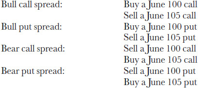

<!-- 原 EPUB 中此公式为图片，已原样保留 -->

<!-- source:block 9a9870df8de22440 -->

> [!quote]- English 42
> If we are bullish, we can buy a 100 call and sell a 105 call, or buy a 100 put and sell a 105 put (in both cases, buy the lower exercise price and sell the higher). If we are bearish, we can buy a 105 call and sell a 100 call, or buy a 105 put and sell and 100 put (in both cases, sell the lower exercise price and buy the higher). This may seem counterintuitive because one expects spreads that consist of puts to have characteristics that are the opposite of those that consist of calls. But regardless of whether a spread consists of calls or puts, *whenever a trader buys the lower exercise price and sells the higher exercise price, the position is bullish, and whenever a trader buys the higher exercise price and sells the lower exercise price, the position is bearish*.

如果我们看涨，我们可以买入100看涨期权并卖出105看涨期权，或者买入100看跌期权并卖出105看跌期权（在这两种情况下，买入较低的行权价并卖出较高的行权价）。如果我们看跌，我们可以买入105看涨期权并卖出100看涨期权，或者买入105看跌期权并卖出100看跌期权（在这两种情况下，卖出较低的行权价并买入较高的行权价）。这似乎违反直觉，因为人们预计由看跌组成的价差具有与由看涨组成的价差相反的特征。但无论价差是由看涨还是看跌组成，每当交易员买入较低的行权价并卖出较高的行权价时，该头寸就是看涨的，每当交易员买入较高的行权价并卖出较低的行权价时，该头寸就是看跌的。

<!-- source:block 64bcedb05608884c -->

> [!quote]- English 43
> We can see why this is true by considering either the deltas of the position or the potential profit and loss (P&L) for the position. Consider the two example bull spreads:

我们可以通过考虑头寸的Delta或头寸的潜在损益（P & L）来理解为什么这是正确的。考虑两个牛市价差示例：

<!-- source:block e4dcd41476916c69 -->

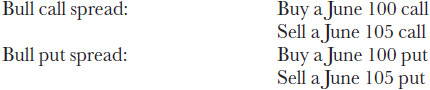

<!-- 原 EPUB 中此公式为图片，已原样保留 -->

<!-- source:block bcba013e0a0f6df6 -->

> [!quote]- English 44
> Both spreads must have a positive delta. The June 100 call has a greater positive delta than the June 105 call. The June 105 put has a greater negative delta than the June 100 put. Multiplying with a positive sign for a purchase and a negative sign for a sale and adding up the deltas give a total positive delta in each case.

两种价差都必须有正的Delta。6 月到期、行权价为 100 的看涨期权的正Delta比6 月到期、行权价为 105 的看涨期权的正Delta更大。6月105看跌期权的负Delta大于6月100看跌期权。将购买的正号和销售的正号相乘，并将Delta相加，在每种情况下都会得到总的正Delta。

<!-- source:block 9c5e533128bd9525 -->

> [!quote]- English 45
> In terms of potential profit or loss, the call spread will be done for a debit (the June 100 call will cost more than the June 105 call) and will expand to its maximum value of 5.00 if the underlying contract is above 105 at expiration. The put spread will be done for a debit (the June 100 put will cost less than the June 105 put) but will collapse to 0 if the underlying contract is above 105 at expiration. Each spread wants the underlying to rise above 105, so each spread must be bullish.

就潜在利润或损失而言，看涨期权价差将用于 debit（6 月到期、行权价为 100 的看涨期权的成本将高于6 月到期、行权价为 105 的看涨期权），如果标的合约到期时高于105，看涨期权价差将扩大至最大值5.00。看跌期权价差将用于 debit（6 月到期、行权价为 100 的看跌期权的成本将低于6 月到期、行权价为 105 的看跌期权的成本），但如果标的合约到期时高于105，则将暴跌至0。每个价差都希望标的指数升至105以上，因此每个价差必须看涨。

<!-- source:block 7563c02e9bf72f80 -->

> [!quote]- English 46
> Not only will the total delta be very similar for call and put spreads that expire at the same time and that consist of the same exercise prices, but the profit or loss potential for each spread, whether a call spread or put spread, will be approximately the same.5 The expiration P&L profiles for simple bull and bear spreads are shown in Figures 12-5 and 12-6.

同时到期且由相同行权价组成的看涨和看跌价差的总Delta不仅非常相似，而且每个价差（无论是看涨价差还是看跌价差）的潜在利润或损失也将大致相同。[^ovp12-5]简单牛市和熊市价差的到期损益曲线如图12-5和12-6所示。

<!-- source:block fca5bca895c38a22 -->

*图12-5牛市价差。 / Figure 12-5 Bull spread.*

<!-- source:block 483a00dc3d6fee82 -->

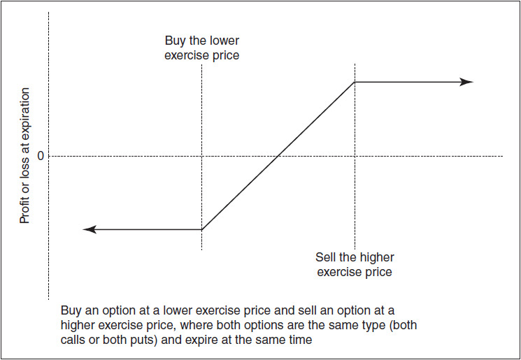

<!-- source:block 194515ae72005938 -->

*Figure 12-6 Bear spread. / Figure 12-6 Bear spread.*

<!-- source:block 063c294790b80119 -->

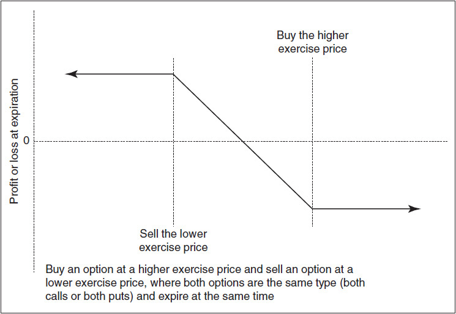

<!-- source:block 69812072450cc7f2 -->

> [!quote]- English 49
> Given the many different exercise prices and expiration months available, how can we choose the bull or bear spread that best reflects our directional expectations and that gives us the best chance to profit from those expectations?

鉴于有许多不同的行权价和到期月份，我们如何选择最能反映我们的方向预期并为我们提供最好机会从这些预期中获利的牛市或熊市价差？

<!-- source:block 3d1944c7a3472292 -->

> [!quote]- English 50
> Because options have fixed expiration dates, a trader who wants to use options to take advantage of an expected market move must first determine his time horizon. Is the movement likely to occur in the next month? In the next three months? In the next nine months? If it is currently May and the trader foresees upward movement but believes that the movement is unlikely to occur within the next two months, it does not make much sense to take a position in June or July options. If his expectations are long term, he may have to take his position in September or even December options. Of course, as he moves farther out in time, market liquidity may become a problem. This is a factor that he will have to take into consideration.

由于期权有固定的到期日期，因此想要使用期权利用预期市场走势的交易员必须首先确定他的时间范围。下个月可能会发生这一变动吗？未来三个月内？未来九个月内？如果现在是5月，交易者预计价格会上涨，但认为在未来两个月内不太可能上涨，那么在6月或7月的期权中建仓就没有多大意义。如果他的预期是长期的，他可能不得不在9月甚至12月的期权中采取他的头寸。当然，随着他在时间上走得更远，市场流动性可能会成为一个问题。这是他必须考虑的一个因素。

<!-- source:block 4ea5ae42e9d4403b -->

> [!quote]- English 51
> Next, a trader will have to decide just how bullish or bearish he is. Is he very confident and therefore willing to take a very large directional position? Or is he less certain and willing to take only a limited position? Two factors determine the total directional characteristics of the position:

接下来，交易者必须决定他的看涨或看跌程度。他是否非常有信心，因此愿意采取非常大的方向性头寸？或者他是否不太确定，只愿意采取有限的头寸？有两个因素决定了头寸的总方向特征：

<!-- source:block 80bc0c1118c07daa -->

> [!quote]- English 52
> 1. The delta of the selected spread

1.所选排列的Delta

<!-- source:block ec589c44a0b17d89 -->

> [!quote]- English 53
> 2. The size in which the spread is executed

2.行权价差的规模

<!-- source:block b67a546a1f5cd1dc -->

> [!quote]- English 54
> A trader who wants to take a position that is 500 deltas long (equivalent to purchasing five underlying contracts) can choose a spread that is 50 deltas long and execute it 10 times. Or the trader can choose a different spread that is only 25 deltas long but execute it 20 times. Both strategies result in a position that is long 500 deltas.

若交易员希望建立 500 Delta 多头（相当于买入 5 份标的合约），可以选择每组为 50 Delta 多头的价差并执行 10 组；也可以选择另一种每组仅为 25 Delta 多头的价差并执行 20 组。两种策略最终都会形成 500 Delta 多头。

<!-- source:block 63098f3d70231760 -->

> [!quote]- English 55
> In general, if all options expire at the same time and are close to at the money, the greater the amount between exercise prices, the greater will be the delta value of the spread. A 95/110 bull spread will be more bullish than a 95/105 bull spread, which will, in turn, be more bullish than a 95/100 bull spread.6 Moreover, increasing the amount between exercise prices will also increase the spread’s maximum potential profit or loss. This is shown in Figure 12-7.

一般而言，若所有期权同时到期且均接近平值，行权价间距越大，价差的 Delta 也越大。95/110 牛市价差比 95/105 牛市价差更偏多，而后者又比 95/100 牛市价差更偏多。此外，扩大行权价间距还会提高价差的最大潜在利润或亏损，如图 12-7 所示。 [^ovp12-6]

<!-- source:block 7509b3fea484378b -->

*图12-7随着行权价的差距越来越大，价差呈现出更大的看涨或看跌特征。 / Figure 12-7 As the exercise prices become farther apart, the spread takes on greater bullish or bearish characteristics.*

<!-- source:block 1c7aec6be143c5c5 -->

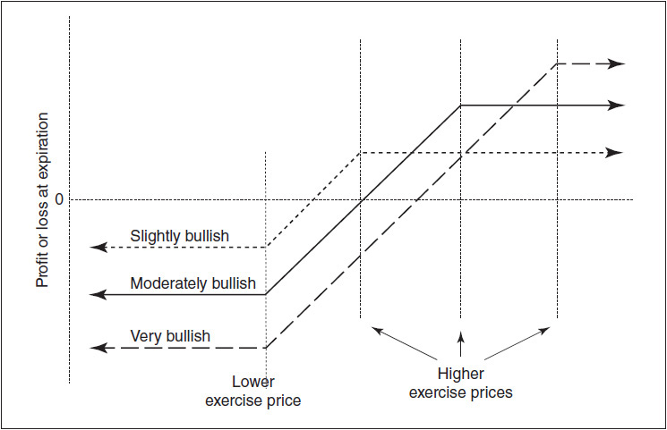

<!-- source:block f74e878189fa6670 -->

> [!quote]- English 57
> Once a trader decides on the option expiration in which to take his directional position, he must decide which specific spread is best. That is, he must decide which exercise prices to use. Consider the following table of theoretical values and deltas:

一旦交易者决定持有方向头寸的期权到期，他必须决定哪个特定价差是最好的。也就是说，他必须决定使用哪些行权价。考虑下表的理论值和Delta：

<!-- source:block c1a39050af87b68f -->

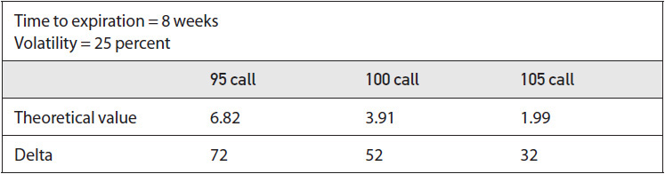

<!-- source:block 91b44daac417aafe -->

> [!quote]- English 58
> Suppose that we want to do a bull call spread with these options. One choice is to buy the 95 call and sell the 100 call. A second choice is to buy the 100 call and sell the 105 call. Which spread is best?

假设我们想用这些期权进行牛市价差。一种选择是购买95看涨期权并出售100看涨期权。第二种选择是购买100看涨期权并出售105看涨期权。哪个价差最好？

<!-- source:block bd9931c35039e129 -->

> [!quote]- English 59
> The theoretical value and delta for each spread are

每个价差的理论值和Delta为

<!-- source:block a000bff4663e9c50 -->

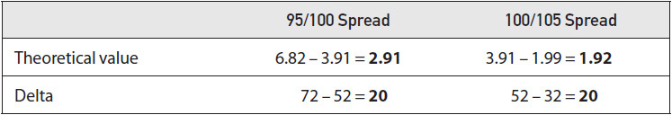

<!-- source:block c33758727543c941 -->

> [!quote]- English 60
> In theory, both spreads seem to be equally bullish because they are both long 20 deltas. But the 100/105 spread, with a value of 1.92, appears to be cheaper than the 95/100 spread, with a value of 2.91. From this we might conclude that the 100/105 spread represents the better value. But is the spread’s value the only consideration? The value of a strategy is only important if we can compare it with the price of the strategy. But nowhere have we said anything about price.

理论上，这两个价差似乎同样看涨，因为它们都是20 Delta 多头。但价值为1.92的100/105价差似乎比价值为2.91的95/100价差便宜。由此，我们可以得出结论，100/105的价差代表了更好的价值。但价差的价值是唯一的考虑因素吗？只有当我们能够将策略与策略的价格进行比较时，策略的价值才重要。但我们没有在任何地方谈论过价格。

<!-- source:block da6c4a242e08b433 -->

> [!quote]- English 61
> From an option trader’s point of view, the price of an option or strategy is determined by the implied volatility in the marketplace. In this example, our best estimate of volatility over the life of the options may be 25 percent, but what will be the prices of the options if the implied volatility is either higher or lower than 25 percent? Let’s expand our table to include option values at volatilities of 20 and 30 percent (delta values are in parentheses).

从期权交易员的角度来看，期权或策略的价格是由市场隐含波动率决定的。在本例中，我们对期权寿命内波动率的最佳估计可能是25%，但如果隐含波动率高于或低于25%，期权的价格将是多少？让我们扩展表格，以包括波动率为20%和30%的期权值（Delta值在括号中）。

<!-- source:block b956bc3c4264a81b -->

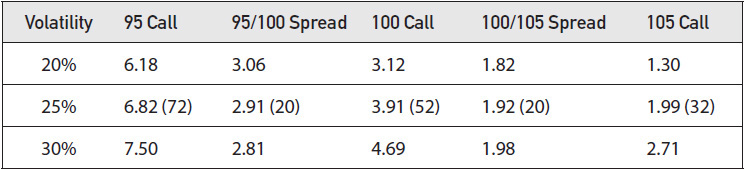

<!-- source:block 2de55386ce7c0b91 -->

> [!quote]- English 62
> If implied volatility in the marketplace is 20 percent, the prices of the 95/100 spread and the 100/105 spread will be 3.06 and 1.82, respectively. If our best volatility estimate is 25 percent, we have a choice. We can pay 3.06 for a spread that we believe is worth 2.91 (the 95/100 spread), or we can pay 1.82 for a spread that we believe is worth 1.92 (the 100/105 spread). If creating a positive theoretical edge is our goal, the 100/105 spread, with a theoretical edge of .10, makes more sense than the 95/100 spread with its negative theoretical edge of –.15.

如果市场隐含波动率为20%，则95/100价差和100/105价差的价格将分别为3.06和1.82。如果我们的最佳波动率估计是25%，那么我们有一个选择。我们可以为我们认为价值2.91的价差（95/100价差）支付3.06，或者我们可以为我们认为价值1.92的价差（100/105价差）支付1.82。如果我们的目标是创造正的理论优势，那么理论优势为0.10的100/105价差比理论优势为-0.15的95/100价差更有意义。

<!-- source:block 88a522d8ddee33cb -->

> [!quote]- English 63
> Now suppose that implied volatility in the marketplace is 30 percent. The prices of the 95/100 spread and the 100/105 spread are 2.81 and 1.98, respectively. Again we have a choice. We can pay 2.81 for a spread that is worth 2.91 (the 95/100 spread), or we can pay 1.98 for a spread that is worth 1.92 (the 100/105 spread). The 95/100 spread, with its positive theoretical edge of .10, is now the better choice.

现在假设市场的隐含波动率为30%。95/100价差和100/105价差的价格分别为2.81和1.98。我们再次有一个选择。我们可以支付2.81购买价值2.91的价差（95/100价差），或者我们可以支付1.98购买价值1.92的价差（100/105价差）。95/100价差的理论正优势为0.10，现在是更好的选择。

<!-- source:block 9af9556ebbbc06ec -->

> [!quote]- English 64
> Even though both spreads have the same delta values, under one volatility scenario, we seem to prefer the 95/100 spread, while under a different scenario, we seem to prefer the 100/105 spread. The reason becomes clear if we recall one of the basic characteristics of option evaluation introduced in Chapter 6:

尽管两种价差具有相同的Delta值，但在一种波动率情景下，我们似乎更喜欢95/100价差，而在另一种情景下，我们似乎更喜欢100/105价差。如果我们回顾第6章介绍的期权评估的基本特征之一，原因就变得很明显了：

<!-- source:block 987056dcdc7c231a -->

> [!quote]- English 65
> *If we consider three options—in the money, at the money, and out of the money—option that are identical except for their exercise prices, the at-the-money option is always the most sensitive in total points to a change in volatility*.

如果我们考虑三种期权——价内期权、平值期权和价外期权，除了其行权价之外，它们都是相同的，则平值期权总是对波动率变化的总分最敏感的。

<!-- source:block e46f0c1700e71c6e -->

> [!quote]- English 66
> If all options appear overpriced because we believe that implied volatility is too high, in total points, the at-the-money option will be the most overpriced. If all options appear underpriced because we believe that implied volatility is too low, in total points, the at-the-money option will be the most underpriced. This characteristic leads to a very simple rule for choosing bull and bear vertical spreads:

如果所有期权都因我们认为隐含波动率太高而显得定价过高，则以总分计算，那么平值期权将是定价最高的。如果所有期权都因我们认为隐含波动率太低而显得定价过低，则以总分计算，那么平值的期权将是定价最低的。这一特征导致了选择牛市和熊市垂直价差的非常简单的规则：

<!-- source:block 0ed4c9909797797f -->

> [!quote]- English 67
> *If implied volatility is low, the choice of spreads should focus on purchasing the at-the-money option. If implied volatility is high, the choice should focus on selling the at-the-money option*.

如果隐含波动率较低，则价差的选择应侧重于购买平值期权。如果隐含波动率很高，则选择应重点出售平值期权。

<!-- source:block 90e0558e56e6dd74 -->

> [!quote]- English 68
> Now we can see why the 100/105 call spread is a better value if implied volatility is 20 percent, whereas the 95/100 spread is a better value if implied volatility is 30 percent. If implied volatility is low (20 percent), we prefer to buy the at-the-money (100) call. Having done this, we have only one choice if we want to create a bull spread—we must sell the out-of-the-money (105) call. On the other hand, if implied volatility is high (30 percent), we want to sell the at-the-money (100) call. Having done this, we again have only one choice if we want to create a bull spread—we must buy the in-the-money (95) call.

现在我们可以明白为什么如果隐含波动率为20 %，则100/105 看涨期权价差的值更好，而如果隐含波动率为30 %，则95/100价差的值更好。如果隐含波动率较低（20 %），我们更愿意购买ATM机（100）看涨期权。 完成此操作后，如果要创建多头价差，我们只有一个选择-必须卖出OTM（105）看涨期权。另一方面，如果隐含波动率很高（30 %），我们希望出售ATM（100）看涨期权。 完成此操作后，如果我们想要创建牛市价差，我们再次只有一个选择-我们必须购买ITM（95）看涨期权。

<!-- source:block 576b18da12879a2f -->

> [!quote]- English 69
> The same principle is equally true for bull and bear put spreads. We always want to focus on the at-the-money option, buying the at-the-money put when implied volatility is low and selling the at-the-money put when implied volatility is high. This is confirmed in the following table (delta values are in parentheses):

同样的原则也适用于多头和空头看跌期权价差。我们始终希望关注ATM期权，在隐含波动率较低时购买ATM 看跌期权期权，在隐含波动率较高时出售ATM 看跌期权。 下表证实了这一点（Delta值在括号中）：

<!-- source:block 7f14ebed1b72842d -->

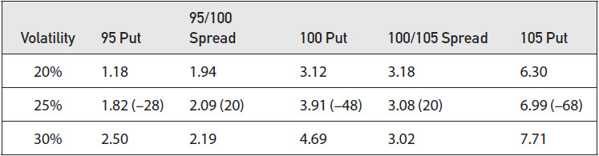

<!-- source:block 5f2327d0ec7bf026 -->

> [!quote]- English 70
> Suppose that we want to do a bear put spread when implied volatility is low. In this case, we want to buy the at-the-money (100) put. Having done this, we are forced to sell the out-of-the-money (95) put to create our bear spread (buy the higher exercise price, sell the lower). We will pay 1.94 for the spread, but the spread is worth 2.09. The result will be a delta position of –20 and a positive theoretical edge of .15.

假设我们想在隐含波动率较低时进行看跌价差。在这种情况下，我们想购买平值出售（100）。这样做后，我们被迫出售价外看跌期权（95）以创造熊市价差（买入较高的行权价，卖出较低的行权价）。我们将为价差支付1.94，但价差值2.09。结果将是Delta头寸为-20，理论正边缘为0.15。

<!-- source:block 07fe511a5895dac3 -->

> [!quote]- English 71
> Notice that in every case, whether in a low-volatility or high-volatility environment, the spread that includes the in-the-money option always has a higher price than the spread that includes the out-of-the-money option. To understand why, consider the result of choosing between a 95/100 and a 100/105 bull call spread under three different scenarios. In scenario 1, the market rises and is at 110 at expiration. If this happens, both spreads will show a profit because they will both widen to their maximum value of 5.00. In scenario 2, the market drops and is at 90 at expiration. Now both spreads will show a loss because they will both collapse to 0. Finally, consider the case where the underlying market fails to rise but also does not fall. It simply remains at 100 until expiration. If this happens, the 100/105 spread will collapse to 0, while the 95/100 spread will widen to its maximum value of 5.00. The 95/100 spread is always more valuable than the 100/105 spread because it profits in more cases. The 100/105 spread needs the market to rise to show a profit. The 95/100 spread does not need the market to rise; it just needs for the market not to fall. Because the 100/105 spread requires movement, it has a positive gamma and, consequently, a negative theta. It will decline in value as time passes. The 95/100 spread will profit even if the market sits still. It has a positive theta and, consequently, a negative gamma.

请注意，在任何情况下，无论是在低波动率还是高波动率环境中，包括ITM期权的价差的价格始终高于包括OTM期权的价差。 要了解原因，请考虑在三种不同情况下在95/100和100/105牛市看涨期权之间进行选择的结果。在情况1,下，市场上涨并在到期时处于110。 如果发生这种情况，两个价差都将显示利润，因为它们都将扩大到其最大值5.00。在场景2,中，市场下跌，到期时位于90。现在这两个价差都将显示损失，因为它们都将崩溃至0。 最后，考虑一下标的市场没有上涨但也没有下跌的情况。它只是保留为100直到到期。如果发生这种情况，100/105价差将崩溃至0,，而95/100价差将扩大至其最大值5.00。 95/100价差总是比100/105价差更有价值，因为它在更多情况下获利。100/105价差需要市场上涨才能显示盈利。95/100价差不需要市场上涨;它只需要市场不下跌。 由于100/105价差需要移动，因此它具有正的Gamma，因此具有负的Theta。随着时间的推移，它的价值会下降。即使市场静止不动，95/100价差也会获利。它有一个正的Theta，因此，有一个负的Gamma。

<!-- source:block 9bb87f53626794a1 -->

> [!quote]- English 72
> Note also the results if the market does move. If the market rises to 110, both spreads will show a profit, but the 100/105 spread will show a greater profit because it was purchased at a lower price. If the market falls to 90, both spreads will show a loss, but the 100/105 spread, because of its lower price, will show a smaller loss. If there is a greater likelihood that the market will move, we will always prefer the 100/105 spread. We will maximize our profits when we are right, and we will minimize our losses when we are wrong. The likelihood of movement will depend on our estimate of volatility. If our estimate is higher than the implied volatility, we are saying that there is a greater likelihood of movement, so we prefer the 100/105 spread. If our estimate of volatility is lower than the implied volatility, we are saying that there is a lower likelihood of movement, so we prefer the 95/100 spread.

如果市场确实发生变化，请注意结果。如果市场上涨至110，两个价差都会显示利润，但100/105价差会显示更大的利润，因为它是以较低的价格购买的。如果市场跌至90，两个价差都会显示损失，但100/105价差由于价格较低，将显示较小的损失。如果市场变动的可能性更大，我们将始终更喜欢100/105的价差。当我们是正确的时，我们会最大限度地提高利润，当我们是错误的时，我们会最大限度地减少损失。变动的可能性将取决于我们对波动率的估计。如果我们的估计高于隐含波动率，我们就说波动的可能性更大，因此我们更喜欢100/105的价差。如果我们对波动率的估计低于隐含波动率，我们就说波动的可能性较低，因此我们更喜欢95/100的价差。

<!-- source:block bc072214cadc72df -->

> [!quote]- English 73
> Even though we have focused on the at-the-money option, a trader is not required to execute a bull or bear spread by first buying or selling the at-the-money option. Such spreads always involve two options, and a trader can choose to either execute the complete spread in one transaction or leg into the spread by trading one option at a time. In the latter case, a trader may decide to trade the in-the-money or out-of-the-money option first and trade the at-the-money option at a later time. This is a decision that a trader must make based on practical considerations. But regardless of how the spread is executed, the trader should focus on the at-the-money option, either buying it when implied volatility is low or selling it when implied volatility is high.

尽管我们关注的是平值期权，但交易员并不需要首先购买或出售平值期权来执行牛市或熊市价差。此类价差始终涉及两种选择，交易员可以选择在一次交易中执行完整价差，也可以通过一次交易一种选择来扩大价差。在后一种情况下，交易者可能会决定首先交易物内或价外期权，然后再交易价内期权。这是交易者必须根据实际考虑做出的决定。但无论价差如何执行，交易者都应该关注平值期权，要么在隐含波动率较低时买入，要么在隐含波动率较高时卖出。

<!-- source:block 04bc1de0c8ccd182 -->

> [!quote]- English 74
> In practice, it is unlikely that one option will be exactly at the money. If there is no exactly at-the-money option, a trader can focus on an option that is closer to at the money. If the underlying market is at 103, with 95, 100, 105, and 110 calls available, it is logical to focus on the 105 call because it is closest to at the money. If implied volatility is low, a trader will want to buy the 105 call; if implied volatility is high, a trader will want to sell the 105 call. He can then trade a different option in order to create a bull or bear vertical spread.

在实践中，一种选择不太可能完全平值。如果没有完全符合金钱要求的选择，交易者可以专注于更接近金钱要求的选择。如果标的市场位于103，有95、100、105和110个看涨期权可用，那么关注105看涨期权是合乎逻辑的，因为它最接近货币。如果隐含波动率较低，交易员将希望购买105看涨期权;如果隐含波动率较高，交易员将希望出售105看涨期权。然后他可以交易不同的期权，以创造牛市或熊市垂直价差。

<!-- source:block edf9a7ee39433c04 -->

> [!quote]- English 75
> Nor does a trader have to include the option that is closest to the money as part of his spread. A trader who has a strong directional opinion can choose a spread where both options are very far out of the money or very deeply in the money. The delta values of such spreads will be very low, but the trader can create a highly leveraged position by executing each spread many times. For example, with the underlying market at 100, a trader who is strongly bullish might buy the 115/120 call spread (assuming that such exercise prices are available). The cost of this spread will be very low because there is a high probability that the spread will expire worthless. But the trader will also be able to execute the spread many times because of its low cost. If he is right and the market does rise above 120, the spread will widen to its maximum value of 5.00, resulting in a very large profit. Regardless of the exercise prices chosen, if implied volatility is low, the trader should buy an option that is closer to the money, and if implied volatility is high, the trader should sell an option that is closer to the money.

交易者也不必将最接近资金的期权作为其价差的一部分。具有强烈方向性意见的交易者可以选择两种选择都非常价外或非常价内的价差。此类价差的Delta值非常低，但交易员可以通过多次执行每个价差来创建高杠杆头寸。例如，当标的市场为100时，强烈看涨的交易员可能会购买115/120看涨价差（假设此类行权价可用）。这种价差的成本将非常低，因为价差到期时很有可能变得一文不值。但由于价差成本低，交易员也将能够多次行权价差。如果他是对的，并且市场确实升至120以上，那么价差将扩大到最大值5.00，从而产生非常大的利润。无论选择何种行权价，如果隐含波动率较低，交易者应该购买更接近货币的期权，如果隐含波动率较高，交易者应该出售更接近货币的期权。

<!-- source:block 05187193208038d0 -->

> [!quote]- English 76
> Our choice of bull or bear strategies has focused thus far on the at-the-money option, typically the option whose delta is closest to 50. This does indeed tend to be the case for options on futures. In other markets, though, the at-the-money option may not be the option with a delta closest to 50 because, as discussed in Chapter 5, the theoretical value of an option depends not on the current price of the underlying contract but on the forward price. For this reason, the choice of bull or bear spreads should really focus on the *at-the-for-ward* option. Especially in the stock option market, if interest rates are high and there is a significant amount of time to expiration, the at-the-forward option may have an exercise price that is considerably higher than the current stock price. Having noted this distinction, for practical purposes, a trader will not go too far wrong if he focuses on the at-the-money option, buying it when implied volatility is low and selling it when implied volatility is high.

到目前为止，我们对牛市或熊市策略的选择主要集中在平值期权上，通常是Delta最接近50的期权。期货期权的情况确实如此。不过，在其他市场中，平值期权可能不是Delta最接近50的期权，因为正如第5章所讨论的那样，期权的理论价值不取决于标的合约的当前价格，而是取决于远期价格。出于这个原因，牛市或熊市价差的选择实际上应该集中在向前选择上。特别是在股票期权市场中，如果利率很高并且到期时间很长，那么远期期权的行权价可能会远高于当前股价。注意到这种区别后，出于实际目的，如果交易员专注于平值期权，在隐含波动率较低时买入，在隐含波动率较高时卖出，就不会犯太大错误。

<!-- source:block a28e2e6bf5952e99 -->

> [!quote]- English 77
> Before concluding our discussion of bull and bear spreads, it will be useful to look at graphs of the theoretical value, delta, gamma, vega, and theta for a typical bull vertical spread, as shown in Figures 12-8 through 12-13. The reader should take some time to look at these graphs not only because they highlight some of the important characteristics of this very common class of spreads but also because they serve as examples of some of the more important characteristics of risk measurement discussed in Chapter 9. This will be especially helpful when we take a closer look at risk analysis in later chapters.

在结束对牛市和熊市价差的讨论之前，查看典型牛市垂直价差的理论值、Delta、Gamma、Vega和Theta的图表会很有用，如图12-8至12-13所示。读者应该花一些时间查看这些图表，不仅因为它们强调了这种非常常见的价差类型的一些重要特征，而且还因为它们是第9章讨论的风险测量的一些更重要特征的例子。当我们在后面的章节中仔细研究风险分析时，这将特别有帮助。

<!-- source:block aff86627a054c461 -->

*图12-8随着时间的推移或波动率下降的牛市价差的价值。 / Figure 12-8 Value of a bull spread as time passes or volatility declines.*

<!-- source:block 91d2035e0ea035e1 -->

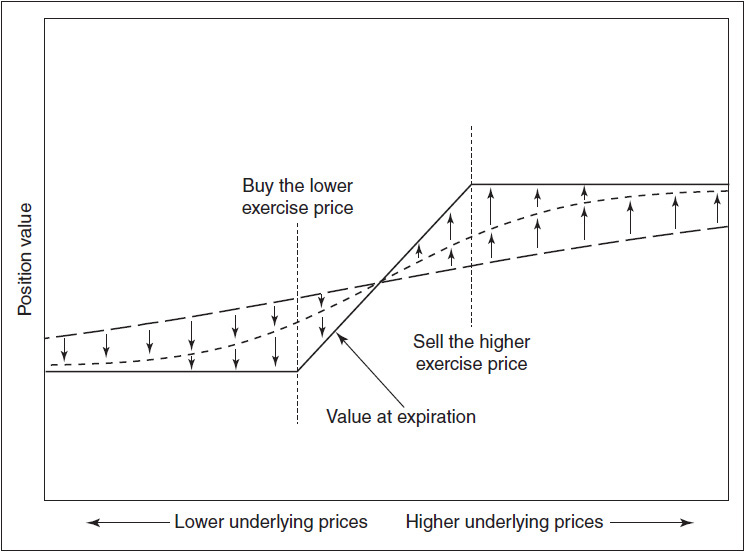

<!-- source:block dc924e2372b88557 -->

> [!quote]- English 79
> For the graphs of theoretical value, delta, gamma, and vega (Figures 12-8 through 12-11), the effect of time passing or volatility declining is similar. For the theta, however, there are slight differences, so separate theta graphs for declining volatility (Figure 12-12) and the passage of time (Figure 12-13) are shown. Note also that the maximum gamma, vega, and theta for vertical spreads tend to occur when the underlying price is either just below the lowest exercise price or just above the highest exercise price.

对于理论值、Delta、Gamma和Vega的图表（图12-8至12-11），时间流逝或波动率下降的影响相似。然而，对于Theta来说，存在细微差异，因此显示了波动率下降（图12-12）和时间流逝（图12-13）的单独Theta图。另请注意，垂直价差的最大Gamma、Vega和Theta往往发生在标的价格略低于最低行权价或略高于最高行权价时。

<!-- source:block 834287893cc7f241 -->

*图12-9随着时间的推移或波动率下降的牛市价差Delta。 / Figure 12-9 Delta of a bull spread as time passes or volatility declines.*

<!-- source:block 1c94c508196be8ae -->

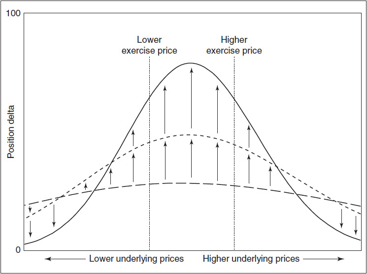

<!-- source:block a85fb6aca2828fcc -->

*Figure 12-10 Gamma of a bull spread as time passes or volatility declines. / Figure 12-10 Gamma of a bull spread as time passes or volatility declines.*

<!-- source:block 5bcd045908e6546b -->

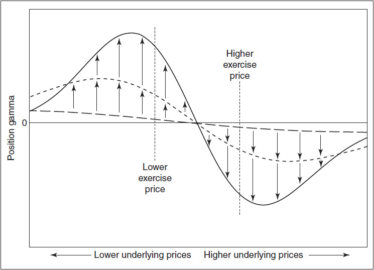

<!-- source:block fae3dcaa30150901 -->

*图12-11随着时间的推移或波动率下降，牛市价差的Vega。 / Figure 12-11 Vega of a bull spread as time passes or volatility declines.*

<!-- source:block f18cf969b92a9d39 -->

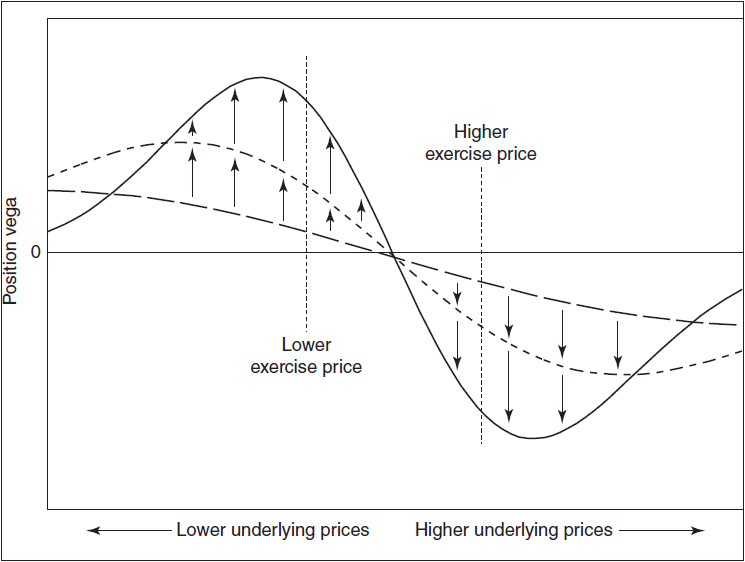

<!-- source:block fa3409048d388ca6 -->

*图12-12波动率下降时牛市价差的Theta。 / Figure 12-12 Theta of a bull spread as volatility declines.*

<!-- source:block da5e3658e61b69f8 -->

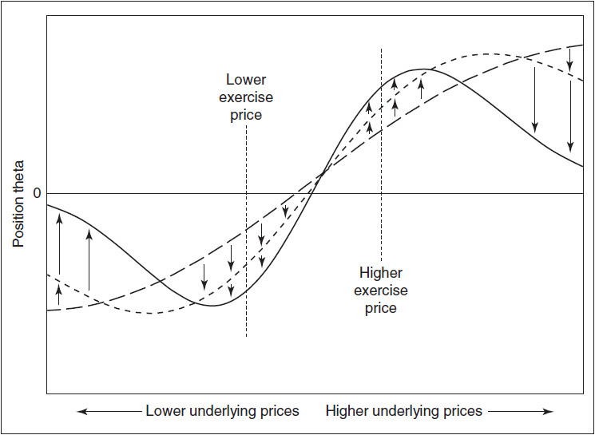

<!-- source:block c8ad09e1d58adab9 -->

*Figure 12-13 Theta of a bull spread as time passes. / Figure 12-13 Theta of a bull spread as time passes.*

<!-- source:block b4a41434c18d30cb -->

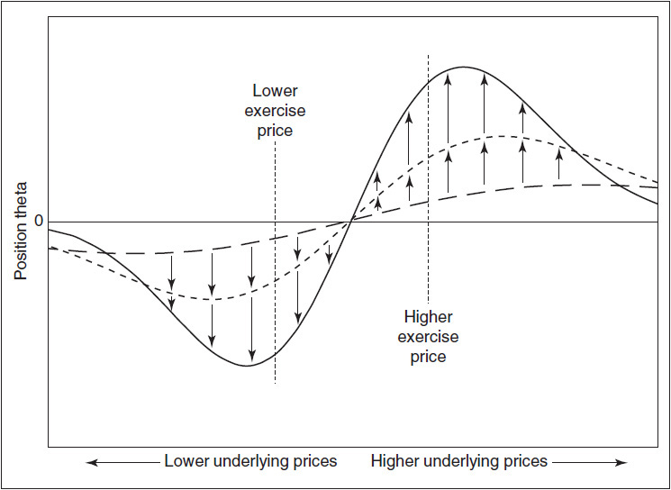

<!-- source:block 92b8ab80520603cc -->

> [!quote]- English 85
> Finally, we might ask why a trader with a directional opinion might prefer a vertical spread to an outright long or short position in the underlying instrument. For one thing, a vertical spread is much less risky than an outright position. A trader who wants to take a position that is 500 deltas long can either buy 5 underlying contracts or buy 25 vertical call spreads with a delta of 20 each. The 25 vertical spreads may sound riskier than 5 underlying contracts, until we remember that a vertical spread has limited risk, whereas the position in the underlying has open-ended risk. Of course, greater risk also means greater reward. A trader with a long or short position in the underlying market can reap huge rewards if the market makes a large move in his favor. By contrast, the vertical spreader’s profits are limited, but he will also be much less bloodied if the market makes an unexpected move in the wrong direction.

最后，我们可能会问为什么具有方向性观点的交易者可能更喜欢垂直价差而不是标的工具的完全多头或空头头寸。首先，垂直价差的风险比直接头寸小得多。想要持有500个Delta的头寸的交易员可以购买5个标的合约或购买25个垂直看涨价差，每份Delta为20。25个垂直价差听起来可能比5个标的合约风险更高，直到我们记住垂直价差的风险有限，而标的合约的头寸具有开放式风险。当然，更大的风险也意味着更大的回报。如果市场对标的市场持有多头或空头头寸的交易者做出对他有利的重大举动，他可以获得巨大的回报。相比之下，垂直价差者的利润是有限的，但如果市场出人意料地朝着错误的方向移动，他的损失也会少得多。

<!-- source:block 9448b9559b102b32 -->

> [!quote]- English 86
> Ignoring interest considerations, the only way to profit from trading the underlying contract is to be right about direction. If we buy the underlying contract, the market must rise. If we sell the underlying, the market must fall. But, with options, one need not necessarily be right about market direction. Options also offer the additional dimension of volatility. Depending on the exercise prices that have been chosen, if the trader has correctly estimated volatility, a bull spread can be profitable if the market fails to rise or in some cases even if it declines. A bear spread can be profitable even if the market fails to fall. This flexibility is just one of the factors that has lead to the dramatic growth in option markets.

忽略利益考虑，从交易标的合约中获利的唯一方法就是正确的方向。如果我们购买标的合约，市场一定会上涨。如果我们出售标的，市场一定会下跌。但是，对于期权，人们不一定对市场方向是正确的。期权还提供了额外的波动率维度。根据所选择的行权价，如果交易员正确估计了波动率，那么如果市场未能上涨，或者在某些情况下即使下跌，牛市价差也可以盈利。即使市场没有下跌，熊市价差也可以盈利。这种灵活性只是导致期权市场急剧增长的因素之一。

<!-- source:block 6c24954b9c186046 -->

> [!note] Footnote 87
> 1 To generalize this and subsequent examples and to eliminate the differences between stock options and futures options, we will assume an interest rate of 0.

[^ovp12-1]: 为了概括这个和后续的例子并消除股票期权和期货期权之间的差异，我们假设利率为0。

<!-- source:block fbc9bb49e3af25ac -->

> [!note] Footnote 88
> 2 In the futures market, the situation may be complicated by the fact that different futures months may be trading at different prices. Instead of choosing a traditional calendar spread, where both options have the same exercise price, the trader may have to choose a diagonal spread to ensure that the position is either bullish (delta positive) or bearish (delta negative).

[^ovp12-2]: 在期货市场中，由于不同的期货月份可能以不同的价格交易，情况可能会变得复杂。交易者可能不得不选择传统的日历价差（两种期权具有相同的行权价），而不得不选择对角线价差以确保头寸看涨（Delta正）或看跌（Delta负）。

<!-- source:block 2bb3dd8eb8b7c28e -->

> [!note] Footnote 89
> 3 Figures 12-3 and 12-4 are very similar, and one might conclude that the characteristics of butterflies and calendar spreads are similar. But this is only true with respect to changes in the underlying price, as reflected in the delta. The spreads will react quite differently to the passage of time and changes in implied volatility.

[^ovp12-3]: 图12-3和12-4非常相似，人们可能会得出结论，蝶式价差和日历价差的特征相似。但这仅适用于标的价格的变化（如Delta所反映的那样）。 价差将对时间的推移和隐含波动率的变化做出截然不同的反应。

<!-- source:block ed1174793505b1dc -->

> [!note] Footnote 90
> 4 In the early days of trading on option exchanges, exercise prices were listed vertically on the exchange display boards—hence the term vertical spread for strategies consisting of options with difference exercise prices.

[^ovp12-4]: 在期权交易所交易的早期，行权价在交易所显示板上垂直列出-因此垂直价差一词是指由具有不同行权价的期权组成的策略。

<!-- source:block 1b15a0a8f3943718 -->

> [!note] Footnote 91
> 5 We are assuming for the moment that all options are European, with no possibility of early exercise.

[^ovp12-5]: 我们目前假设所有选择都是欧洲的，没有提前行权的可能性。

<!-- source:block 1f0f6f740abf833f -->

> [!note] Footnote 92
> 6 This is not necessarily true for very deeply in-the-money spreads or very far out-of-the-money spreads. In such cases, the deltas of both options may be very close to 100 or 0, so separating the exercise prices will have little effect on the total delta of the spread.

[^ovp12-6]: 对于非常深的价内价差或非常远的价外价差来说，这不一定是正确的。在这种情况下，两种期权的Delta可能非常接近100或0，因此分开行权价对价差的总Delta影响很小。

---

[[阅读导航|← 返回阅读导航]]

<!-- chapter-nav:start -->
> [!tip] 章节导航（章末）
> [[波动率价差策略 Volatility Spreads|← 上一章]] · [[阅读导航|全书导航]] · [[风险考量 Risk Considerations|下一章 →]]
<!-- chapter-nav:end -->
