# 理论定价模型 / Theoretical Pricing Models

[[阅读导航|← 返回阅读导航]]

> [!success] 翻译状态
> 本章翻译与风险审计已完成。英文原文、数字、公式和图表继续保留，便于逐段核对。

<!-- chapter-toc:start -->
## 本章目录 / Chapter Outline

> [!abstract] 结构导航
> 以下标题按原书顺序保留；点击可直接跳转。

- [[#概率的重要性 / The importance of Probability|概率的重要性 / The importance of Probability]]
  - [[#期望值 / Expected Value|期望值 / Expected Value]]
  - [[#理论价值 / Theoretical Value|理论价值 / Theoretical Value]]
  - [[#关于模型的补充说明 / A Word on Models|关于模型的补充说明 / A Word on Models]]
- [[#一种简单方法 / A Simple Approach|一种简单方法 / A Simple Approach]]
- [[#Black–Scholes 模型 / The Black-Scholes Model|Black–Scholes 模型 / The Black-Scholes Model]]
  - [[#行权价 / Exercise Price|行权价 / Exercise Price]]
  - [[#距到期时间 / Time to Expiration|距到期时间 / Time to Expiration]]
  - [[#标的价格 / Underlying Price|标的价格 / Underlying Price]]
  - [[#利率 / Interest Rates|利率 / Interest Rates]]
  - [[#股息 / Dividends|股息 / Dividends]]
  - [[#波动率 / Volatility|波动率 / Volatility]]
<!-- chapter-toc:end -->
<!-- chapter-nav:start -->
> [!tip] 章节导航（章首）
> [[到期盈亏 Expiration Profit and Loss|← 上一章]] · [[阅读导航|全书导航]] · [[波动率 Volatility|下一章 →]]
<!-- chapter-nav:end -->
<!-- source:block 29a419a343361f9e -->

> [!quote]- English 1
> In Chapter 4, we considered the value of an option and the profit or loss resulting from an option strategy at the moment of expiration. From the expiration profit and loss (P&L) graphs, we can see clearly that the direction in which an underlying contract moves can be an important consideration in choosing an option strategy. A trader who believes that the underlying market will rise will be more inclined either to buy calls or sell puts. A trader who believes that the underlying market will fall will be more inclined either to buy puts or sell calls. In each case, the directional movement in the underlying market will increase the likelihood that the strategy will be profitable.

在第四章中，我们考虑了期权的价值以及期权策略在到期时产生的损益。从到期损益（P & L）图中，我们可以清楚地看到，标的合约的走势方向可以成为选择期权策略的重要考虑因素。相信标的市场将会上涨的交易员更倾向于买入看涨期权或卖出看跌期权。相信标的市场将会下跌的交易员更倾向于买入看跌期权或卖出看涨期权。在每种情况下，标的市场的方向性走势都会增加该策略盈利的可能性。

<!-- source:block cdfe0cfa9718940e -->

> [!quote]- English 2
> However, an option trader has an additional problem that we might call the “speed” of the market. If we ignore interest and dividend considerations, a trader who believes that a stock will rise in price within a specified period can be reasonably certain of making a profit if he is right. He can simply buy the stock, wait for it to reach his target price, and then sell the stock at a profit.

然而，期权交易者还有一个额外的问题，我们可以称之为市场的“速度”。如果我们忽视利息和股息的考虑，相信股票将在指定期限内上涨的交易员如果是对的，就可以合理地确定盈利。他可以简单地购买股票，等待其达到目标价格，然后以盈利的方式出售股票。

<!-- source:block d2ec438d0d98c678 -->

> [!quote]- English 3
> The situation is not quite so simple for an option trader. Suppose that a trader believes that a stock will rise in price from \$100, its present price, to \$115 within the next five months. Suppose also that a \$110 call expiring in three months is available at a price of \$2. If the stock rises to \$115 by expiration, the purchase of the \$110 call will result in a profit of \$3 (\$5 intrinsic value minus the \$2 cost of the option). But is this profit a certainty? What will happen if the price of the stock remains below \$110 for the next three months and only reaches \$115 after the option expires? Then the option will expire worthless, and the trader will lose his \$2 investment.

对于期权交易者来说，情况并不那么简单。假设一位交易员相信一只股票的价格将在未来五个月内从现价100美元上涨到115美元。还假设三个月后到期的110美元看涨期权的价格为2美元。如果股票到期时上涨至115美元，则购买110美元看涨期权将产生3美元的利润（5美元的内在价值减去2美元的期权成本）。但这种利润是肯定的吗？如果股票价格在未来三个月内保持在110美元以下，并且期权到期后才达到115美元，会发生什么？然后期权到期时将毫无价值，交易员将失去2美元的投资。

<!-- source:block 822cb23f07f753d4 -->

> [!quote]- English 4
> Perhaps the trader would do better to purchase a \$110 call that expires in six months rather than three months. Now he can be certain that when the stock reaches \$115, the call will be worth at least \$5 in intrinsic value. But what if the price of the six-month option is \$6? In this case, the trader still might show a loss. Even if the underlying stock reaches the target price of \$115, there is no guarantee that the \$110 call will ever be worth more than its \$5 intrinsic value.

也许交易员最好购买六个月而不是三个月后到期的110美元看涨期权。现在他可以确定，当股票达到115美元时，看涨期权的内在价值至少为5美元。但如果六个月期权的价格是6美元怎么办？在这种情况下，交易者仍然可能会表现出损失。即使标的股票达到115美元的目标价格，也不能保证110美元看涨期权的价值会超过其5美元的内在价值。

<!-- source:block 1e223ae5ec402b21 -->

> [!quote]- English 5
> A trader in an underlying market is interested almost exclusively in the direction in which the market will move. Although an option trader is also sensitive to directional considerations, he must also give some thought to how fast the market is likely to move. If a trader in the underlying stock and an option trader in the same market take long market positions in their respective instruments and the market does in fact move higher, the stock trader is assured of a profit, while the option trader may show a loss. If the market fails to move sufficiently fast, the favorable directional move may not be enough to offset the option’s loss in time value. A speculator will often buy options for their seemingly favorable risk-reward characteristics (limited risk, unlimited reward), but if he purchases options, not only must he be right about market direction, he must also be right about market speed. Only if he is right on both counts can he expect to make a profit. If predicting the correct market direction is difficult, correctly predicting direction and speed is probably beyond most traders’ capabilities.

标的市场的交易者几乎只对市场走势感兴趣。尽管期权交易员对方向性考虑也很敏感，但他也必须考虑市场可能移动的速度。如果标的股票的交易员和同一市场的期权交易员在各自的工具中持有多头头寸，并且市场实际上确实走高，那么股票交易员就保证盈利，而期权交易员可能会出现亏损。如果市场走势不够快，有利的方向走势可能不足以抵消期权的时间价值损失。投机者经常会因为期权看似有利的风险回报特征（风险有限，回报无限）而购买期权，但如果他购买期权，他不仅必须正确判断市场方向，而且必须正确判断市场速度。只有当他在这两点上都正确时，他才能指望盈利。如果预测正确的市场方向很困难，那么正确预测方向和速度可能超出了大多数交易者的能力。

<!-- source:block 2fb27da4ba277bb3 -->

> [!quote]- English 6
> The concept of speed is crucial in trading options. Indeed, many option strategies depend only on the speed of the underlying market and not at all on its direction. If a trader is highly proficient at predicting directional moves in the underlying market, he is probably better advised to trade the underlying instrument. Only when a trader has some feel for the speed component can he hope to successfully enter the option market.

速度的概念在期权交易中至关重要。事实上，许多期权策略仅取决于标的市场的速度，而根本不取决于其方向。如果交易员非常擅长预测标的市场的方向性走势，那么最好建议他交易标的工具。只有当交易者对速度部分有了一定的感觉时，他才有希望成功进入期权市场。

<!-- source:block b73b1ae516a9e702 -->

## 概率的重要性 / The importance of Probability

<!-- source:block 16809ea11b364aee -->

> [!quote]- English 7
> One can never be certain about future market conditions, so almost all trading decisions are based on some estimate of probability. We often express our opinions about probability using words such as *likely*, *good chance*, *possible*, and *probable*. But in an option evaluation we need to be more specific. We need to define probability in way that will enable us to do the types of calculations required to make intelligent decisions in the marketplace. If we can do this, we will find that probability and the choice of strategy go hand in hand. If a trader believes that a strategy has a very high probability of profit and a very low probability of loss, he will be satisfied with a small potential profit because the profit is likely to be quite secure. On the other hand, if the probability of profit is very low, the trader will demand a large profit when market conditions develop favorably. Because of the importance of probability in the decision-making process, it will be worthwhile to consider some simple probability concepts.

未来的市场状况永远无法完全确定，因此几乎所有交易决策都建立在某种概率估计之上。我们经常用 `likely`（很可能）、`good chance`（把握很大）、`possible`（存在可能性）和 `probable`（概率较高）等措辞来表达对概率的判断。但在期权估值中，我们必须更加精确：需要以能够进行必要计算的方式定义概率，才能在市场中作出明智决策。做到这一点后就会发现，概率与策略选择密切相关。如果交易者认为某项策略的获利概率很高、亏损概率很低，那么即使潜在利润较小，他也会接受，因为获得这笔利润的把握较大。相反，如果获利概率很低，那么当市场条件向有利方向发展时，交易者就会要求更高的利润回报。鉴于概率在决策过程中的重要性，接下来值得考察几个基本的概率概念。

<!-- source:block c726905ac3a19496 -->

### 期望值 / Expected Value

<!-- source:block 9a34578ebc0118af -->

> [!quote]- English 8
> Suppose that we are given the opportunity to roll a six-sided die, and each time we roll, we will be paid a dollar amount equal to the number that comes up. If we roll a one, we are paid \$1; if we roll a two, we are paid \$2; and so on up to six, in which case we are paid \$6. If we are given the opportunity to roll the die an infinite number of times, on average, how much do we expect to receive per roll?

假设我们有机会掷出六面骰子，每次掷出时，我们将获得与出现的数字相等的美元金额。如果我们掷一个1，我们会得到1美元的报酬;如果我们掷二，我们会得到2美元的报酬;以此类推，最多六个，在这种情况下我们会得到6美元的报酬。如果我们有机会掷骰子无限次，平均而言，我们每掷骰子预计会收到多少钱？

<!-- source:block b3f96d34bd802f08 -->

> [!quote]- English 9
> We can calculate the answer using some simple arithmetic. There are six possible numbers, each with equal probability. If we add up the six possible outcomes 1 + 2 + 3 + 4 + 5 + 6 = 21 and divide this by the six faces on the die, we get 21/6 = 3½. That is, on average, we can expect to get back \$3½ each time we roll the die. This is the average payback, or *expected value*. If we must pay for the privilege of rolling the die, what is a reasonable price? If we purchase the chance to roll the die for less than \$3½, in the long run, we expect to show a profit. If we pay more than \$3½, in the long run, we expect to show a loss. And if we pay exactly \$3½, we expect to break even. Note the qualifying phrase *in the long run*. The expected value of \$3½ is realistic only if we are allowed to roll the die many, many times. If we are allowed to roll only once, we cannot be certain of getting back \$3½. Indeed, on any one roll, it is impossible to get back \$3½ because no face of the die has exactly 3½ spots. Nevertheless, if we pay less than \$3½ for even one roll of the die, the laws of probability are on our side because we have paid less than the expected value.

我们可以使用一些简单的算术计算出答案。有六个可能的数字，每个数字的概率相等。如果我们将六个可能的结果1 + 2 + 3 + 4 + 5 + 6 = 21相加，并将其除以骰子上的六个面，我们得到21/6 = 3½。 也就是说，平均而言，每次掷骰子时，我们可以期望返回\\$3½。这是平均回报或预期价值。如果我们必须为掷骰子的特权付出代价，那么合理的价格是多少？ 如果我们以低于\\$3½的价格购买掷骰子的机会，从长远来看，我们预计会显示利润。如果我们支付超过\\$3½，从长远来看，我们预计会出现亏损。如果我们支付的正好是3½美元，我们希望收支平衡。从长远来看，请注意限定短语。 只有当我们被允许掷骰子很多次时，\\$3½的预期值才是现实的。如果我们只被允许滚动一次，我们无法确定收回\\$3½。事实上，在任何一个卷上，都不可能收回\\$3½，因为模具的表面没有恰好有3½斑点。 然而，如果我们为一卷骰子支付的费用低于\\$3½，那么概率定律就站在我们一边，因为我们支付的费用低于预期价值。

<!-- source:block 900299ee0194df2b -->

> [!quote]- English 10
> In a similar vein, consider a roulette bet. The roulette wheel has 38 slots, numbers 1 through 36 and 0 and 00.1 Suppose that a casino allows a player to choose a number. If the player’s number comes up, he receives \$36; if any other number comes up, he receives nothing. What is the expected value for this proposition? There are 38 slots on the roulette wheel, each with equal probability, but only one slot will return \$36 to the player. If we divide the one outcome where the player wins \$36 by the 38 slots on the wheel, the result is \$36/38 = \$0.9474, or about 95 cents. A player who pays 95 cents for the privilege of picking a number at the roulette table can expect to approximately break even in the long run.

同样，考虑轮盘赌。轮盘赌轮盘有38插槽、数字[^ovp05-1]至36以及0和00。假设赌场允许玩家选择一个号码。如果出现玩家的号码，他将收到\\$36;如果出现任何其他号码，他将一无所获。 该主张的预期价值是多少？轮盘赌轮盘上有38个老虎机，每个老虎机的概率相等，但只有一个老虎机会向玩家返回\\$36。 如果我们将玩家赢得\\$36的结果除以轮盘上的38插槽，则结果为\\$36/38 = \\$0.9474，或约95美分。从长远来看，支付95美分以获得在轮盘赌桌上选择号码的特权的玩家预计将大致收支平衡。 1

<!-- source:block 071187f1bff76e8b -->

> [!quote]- English 11
> Of course, no casino will let a player buy such a bet for 95 cents. Under those conditions, the casino would make no profit. In the real world, a player who wants to purchase such a bet will have to pay more than the expected return, typically \$1. The 5-cent difference between the \$1 price of the bet and the 95-cent expected value represents the profit potential, or *edge*, to the casino. In the long run, for every dollar bet at the roulette table, the casino can expect to keep about 5 cents.

当然，没有赌场会让玩家以95美分的价格购买这样的赌注。在这种情况下，赌场将无法盈利。在现实世界中，想要购买此类赌注的玩家必须支付高于预期回报的费用，通常为1美元。1美元的赌注价格与95美分的预期价值之间的5美分差异代表赌场的利润潜力或优势。从长远来看，轮盘赌桌上每下注一美元，赌场预计可以保留约5美分。

<!-- source:block a19b41be5783dd28 -->

> [!quote]- English 12
> Given the preceding conditions, any player interested in making a profit would rather switch places with the casino. Then he would have a 5-cent edge on his side by selling bets worth 95 cents for \$1. Alternatively, the player would like to find a casino where he could purchase the bet for less than its expected value of 95 cents, perhaps 88 cents. Then the player would have a 7-cent edge over the casino.

鉴于上述条件，任何有兴趣赚钱的玩家都宁愿与赌场交换位置。然后他将通过以1美元出售价值95美分的赌注来获得5美分的优势。或者，玩家希望找到一家赌场，在那里他可以以低于预期价值95美分（也许88美分）的价格购买赌注。那么玩家将比赌场拥有7美分的优势。

<!-- source:block 12fff16ab47359b3 -->

### 理论价值 / Theoretical Value

<!-- source:block 9397ac1ce597b89b -->

> [!quote]- English 13
> The *theoretical value* of a proposition is the price one would be willing to pay now to just break even in the long run. Thus far, the only factor we have considered in determining the value of a proposition is the expected value. We used this concept to calculate the 95-cent fair price for the roulette bet.

一个提案的理论价值是一个人现在愿意为长期收支平衡而支付的价格。到目前为止，我们在确定命题价值时考虑的唯一因素是期望价值。我们使用这个概念来计算轮盘赌的95美分公平价格。

<!-- source:block 8be39a38c9d7a133 -->

> [!quote]- English 14
> Suppose that in our roulette example the casino decides to change the conditions slightly. The player may now purchase the roulette bet for its expected value of 95 cents, and as before, if he loses, the casino will immediately collect his 95 cents. Under the new conditions, however, if the player wins, the casino will send him his \$36 winnings in two months. Will both the player and the casino still break even on the proposition?

假设在我们的轮盘赌示例中，赌场决定稍微改变条件。玩家现在可以以95美分的预期价值购买轮盘赌赌注，与以前一样，如果他输了，赌场将立即收取他的95美分。然而，在新条件下，如果玩家获胜，赌场将在两个月内将36美元奖金寄给他。玩家和赌场仍然会在这个提议上收支平衡吗？

<!-- source:block bf95225be2529d18 -->

> [!quote]- English 15
> Where did the player get the 95 cents that he bet at the roulette wheel? In the immediate sense, he may have taken it out of his pocket. But a closer examination may reveal that he withdrew the money from his bank prior to visiting the casino. Because he won’t receive his winnings for two months, he will have to take into consideration the two months of interest he would have earned had he left the 95 cents in the bank. The *theoretical value* of the bet is really the present value of its expected value, the 95 cents expected value discounted by interest. If interest rates are 12 percent annually, the theoretical value is

玩家在轮盘赌盘上下注的95美分是从哪里得到的？从直接意义上说，他可能已经把它从口袋里拿出来了。但仔细检查可能会发现，他在参观赌场之前从银行提取了钱。因为他在两个月内不会收到奖金，所以他必须考虑如果他将95美分留在银行，他将获得的两个月利息。赌注的理论价值实际上是其预期价值的现值，即95美分的预期价值减去利息。如果年利率为12%，理论值为

<!-- source:block cfd3dba59477702e -->

> [!quote]- English 16
> 95 cents/(1 + 0.12 × 2/12) ≈ 93 cents

$$
95 \text{cents}/(1 + 0.12 \times 2/12) \approx 93 \text{cents}
$$

<!-- source:block 96120dde00469377 -->

> [!quote]- English 17
> Even if the player purchases the bet for its expected return of 95 cents, he will still lose 2 cents because of the interest that he could have earned for two months if he had left his money in the bank. The casino, on the other hand, will take the 95 cents, put it in an interest-bearing account, and at the end of two months collect 2 cents in interest. Under the new conditions, if a player pays 93 cents for the roulette bet today and receives his winnings in two months, neither he nor the casino can expect to make any profit in the long run.

即使玩家以95美分的预期回报购买赌注，他仍然会损失2美分，因为如果他把钱留在银行，他本可以赚取两个月的利息。另一方面，赌场将收取95美分，将其存入生息账户，并在两个月底收取2美分的利息。在新条件下，如果玩家今天为轮盘赌支付93美分，并在两个月内收到奖金，那么从长远来看，他和赌场都无法指望获得任何利润。

<!-- source:block 00f63117c3a4341c -->

> [!quote]- English 18
> The two most common considerations in option evaluation are the expected return and interest. There may, however, be other considerations. Suppose that the player is a good client, and the casino decides to send him a 1-cent bonus a month from now. He can add this additional payment to the previous theoretical value of 93 cents to get a new theoretical value of 94 cents. This is similar to the dividend paid to owners of stock in a company. In fact, dividends can be an additional consideration in evaluating both stock and options on stock.

期权评估中最常见的两个考虑因素是预期回报和利息。然而，可能还有其他考虑因素。假设玩家是一位好客户，赌场决定从现在开始一个月后向他发送1美分的奖金。他可以将这笔额外付款添加到之前的理论值93美分上，得到新的理论值94美分。这类似于向公司股票所有者支付的股息。事实上，股息可以是评估股票和股票期权的额外考虑因素。

<!-- source:block d503ed301b6c7f3e -->

> [!quote]- English 19
> If a casino is selling roulette bets that have an expected value of 95 cents for a price of \$1, does this guarantee that the casino will make a profit? It does if the casino can be certain of staying in business for the “long run” because over long periods of time the good and bad luck will tend to even out. Unfortunately, before the casino reaches the long run, it must survive the short run. It’s possible that someone can walk up to the roulette wheel, make a series of bets, and have their number come up 20 times in succession. Clearly, this is very unlikely, but the laws of probability say that it could happen. If the player’s good luck results in the casino going out of business, the casino will never reach the long run.

如果赌场以1美元的价格出售预期价值为95美分的轮盘赌，这是否能保证赌场能够盈利？如果赌场能够确定“长期”继续营业，情况就会如此，因为在很长一段时间内，好运气和坏运气往往会趋于平衡。不幸的是，在赌场达到长期之前，它必须在短期内生存。有人可能走到轮盘赌盘前，进行一系列投注，然后让他们的号码连续出现20次。显然，这是不太可能的，但概率定律表明这是可能发生的。如果玩家的好运气导致赌场倒闭，那么赌场永远不会走到长远的道路。

<!-- source:block 73c3b92317862024 -->

> [!quote]- English 20
> The goal of option evaluation is to determine, through the use of a theoretical pricing model, the theoretical value of an option. The trader can then make an intelligent decision whether the price of the option in the marketplace is either too low or too high and whether the theoretical edge is sufficient to justify making a trade. But determining the theoretical value is only half the problem. Because an option’s theoretical value is based on the laws of probability, which are only reliable in the long run, the trader must also consider the question of risk. Even if a trader has correctly calculated an option’s theoretical value, how will he control the short-term bad luck that goes with any probability calculation? We shall see that in the real world, an option’s theoretical value is always open to question. For this reason, a trader’s ability to manage risk is at least as important as his ability to calculate a theoretical value.

期权评估的目标是通过使用理论定价模型来确定期权的理论价值。然后，交易者可以做出明智的决定，判断市场上期权的价格是否太低或太高，以及理论优势是否足以证明进行交易的合理性。但确定理论值只是问题的一半。由于期权的理论价值基于概率定律，而概率定律只有从长远来看才是可靠的，因此交易者还必须考虑风险问题。即使交易者正确计算出期权的理论价值，他将如何控制概率计算带来的短期霉运？我们将会看到，在现实世界中，期权的理论价值总是值得质疑的。因此，交易者管理风险的能力至少与计算理论价值的能力同等重要。

<!-- source:block a80207e3e4660564 -->

### 关于模型的补充说明 / A Word on Models

<!-- source:block 1247744889738e20 -->

> [!quote]- English 21
> What is a model? We can think of a model as a scaled-down or more easily managed representation of the real world. The model may be a physical one, such as a model airplane or architectural model, or it may be a mathematical one, such as a formula. In each case, we use the model to better understand the world around us. However, it is unwise, and sometimes dangerous, to assume that the model and the real world that it represents are identical in every way. We may have an excellent model, but it is unlikely to be an exact replica of the real world.

什么是模型？我们可以将模型视为现实世界的缩小规模或更容易管理的表示。该模型可以是物理模型，例如飞机模型或建筑模型，也可以是数学模型，例如公式。在每种情况下，我们都会使用该模型来更好地了解我们周围的世界。然而，假设模型及其所代表的现实世界在各方面都相同是不明智的，有时甚至是危险的。我们可能有一个优秀的模型，但它不太可能是现实世界的精确复制品。

<!-- source:block 5899b783bd8946c6 -->

> [!quote]- English 22
> All models, if they are to be effective, require us to make certain prior assumptions about the real world. Mathematical models require the input of numbers that quantify these assumptions. If we feed incorrect data into a model, we can expect an incorrect representation of the real world. As every model user knows, “Garbage in, garbage out.”

所有模型如果要有效，都需要我们对现实世界做出某些预先假设。数学模型需要输入量化这些假设的数字。如果我们将错误的数据输入到模型中，我们可能会期望对现实世界的不正确表示。正如每个模特用户所知，“垃圾进，垃圾出。”

<!-- source:block 72ac61385b5ac58d -->

> [!quote]- English 23
> These general observations about models are no less true for option pricing models. An option model is only someone’s idea of how an option might be evaluated under certain conditions. Because either the model itself or the data that we feed into the model might be incorrect, there is no guarantee that model-generated values will be accurate. Nor can we be sure that these values will bear any logical resemblance to actual prices in the marketplace.

这些关于模型的一般观察对于期权定价模型来说也同样正确。期权模型只是某人对在某些条件下如何评估期权的想法。由于模型本身或我们输入到模型中的数据可能不正确，因此无法保证模型生成的值是准确的。我们也不能确定这些价值是否与市场上的实际价格有任何逻辑相似之处。

<!-- source:block e5e3093a069e78db -->

> [!quote]- English 24
> A new option trader is like someone entering a dark room for the first time. Without any guidance, he may grope around, hoping that he eventually finds what he is looking for. The trader who is armed with a basic understanding of theoretical pricing models enters the same room with a candle. He can make out the general layout of the room, but the dimness of the candle prevents him from distinguishing every detail. Moreover, some of what he sees may be distorted by the flickering of the candle. In spite of these limitations, a trader is more likely to find what he is looking for with a small candle than with no illumination at all.2

一个新的期权交易者就像一个人第一次进入一个黑暗的房间。在没有任何指导的情况下，他可能会四处摸索，希望最终找到他想要的东西。对理论定价模型有基本了解的交易员拿着蜡烛进入同一个房间。他可以看出房间的总体布局，但蜡烛的昏暗使他无法区分每个细节。而且，他看到的一些东西可能会被蜡烛的闪烁所扭曲。尽管有这些局限性，交易者还是更有可能用一根小蜡烛找到他想要的东西，而不是完全没有照明。 [^ovp05-2]

<!-- source:block 174dad094a17ab1a -->

> [!quote]- English 25
> The real problems with theoretical pricing models arise after the trader has acquired some sophistication. As he gains confidence, he may begin to increase the size of his trades. When this happens, his inability to make out every detail in the room, as well as the distortions caused by the flickering candle flame, take on increased importance. Now a misinterpretation of what he thinks he sees can lead to financial disaster because any error in judgment will be greatly magnified.

理论定价模型的真正问题是在交易员掌握了一定的技巧之后出现的。随着他信心的增强，他可能会开始增加交易规模。当这种情况发生时，他无法辨别房间里的每个细节，以及闪烁的烛光造成的扭曲，就变得更加重要。现在，对他所看到的内容的误解可能会导致金融灾难，因为任何判断错误都会被大大放大。

<!-- source:block d04e49104ebfd882 -->

> [!quote]- English 26
> The sensible approach is to make use of a model, but with a full awareness of what it can and cannot do. Option traders will find that a theoretical pricing model is an invaluable tool to understanding the pricing of options. Because of the insights gained from a model, the great majority of successful option traders rely on some type of theoretical pricing model. However, an option trader, if he is to make the best use of a theoretical pricing model, must be aware of its limitations as well as its strengths. Otherwise, he may be no better off than the trader groping in the dark.3

明智的方法是利用模型，但充分意识到它能做什么和不能做什么。期权交易者会发现，理论定价模型是了解期权定价的宝贵工具。由于从模型中获得的见解，绝大多数成功的期权交易者都依赖于某种类型的理论定价模型。然而，如果期权交易者要充分利用理论定价模型，就必须意识到它的局限性和优势。否则，他的处境可能并不比黑暗中摸索的商人好多少。[^ovp05-3]

<!-- source:block 97ff9682c1bc0410 -->

## 一种简单方法 / A Simple Approach

<!-- source:block a88c4bc1c82d0e42 -->

> [!quote]- English 27
> How might we adapt the concepts of expected value and theoretical value to the pricing of options? Consider an underlying contract that at expiration can take on one of five different prices: \$80, \$90, \$100, \$110, or \$120. Assume, moreover, that each of the five prices is equally likely with 20 percent probability. The prices and probabilities are shown Figure 5-1.

我们如何将预期价值和理论价值的概念适应期权定价？考虑一份标的合约，到期时可以采用五种不同价格之一：80美元、90美元、100美元、110美元或120美元。此外，假设五种价格中的每一种的可能性相同，概率为20%。价格和概率如图5-1所示。

<!-- source:block b37ca41af8991e56 -->

*图5-1 / Figure 5-1*

<!-- source:block 13cd9d698bb14b43 -->

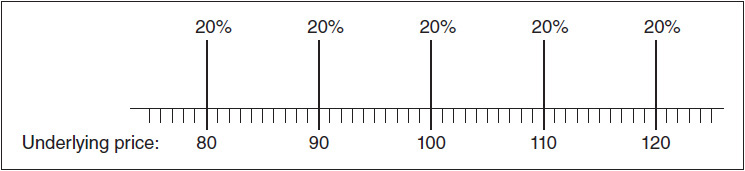

<!-- source:block d5bfba000944e728 -->

> [!quote]- English 29
> What will be the expected value for this contract at expiration? Twenty percent of the time, the contract will be worth \$80; 20 percent of the time, the contract will be worth \$90; and so on, up to the 20 percent of the time, the contract is worth \$120:

这份合约到期时的预期价值是多少？20%的情况下，合约价值80美元; 20%的情况下，合约价值90美元;以此类推，直到20%的情况下，合约价值120美元：

<!-- source:block 2685809a757a3cdb -->

> [!quote]- English 30
> (20% × \$80) + (20% × \$90) + (20% × 100) + (20% × \$110) + (20% × \$120) = \$100

$$
(20\% \times \$80) + (20\% \times \$90) + (20\% \times 100) + (20\% \times \$110) + (20\% \times \$120) = \$100
$$

<!-- source:block c973ce7b333e236d -->

> [!quote]- English 31
> At expiration, the expected value for the contract is \$100.

到期时，合约的预期价值为100美元。

<!-- source:block ac37943c7ad420ac -->

> [!quote]- English 32
> Now consider the expected value of a 100 call using the same underlying prices and probabilities. We can more easily see the value of the call by overlaying the parity graph for the call on our probability distribution. This has been done in Figure 5-2. If the underlying contract is at \$80, \$90, or \$100, the call is worthless. If, however, the underlying contract is at \$110 or \$120, the option will be worth its intrinsic value of \$10 and \$20, respectively:

现在考虑使用相同标的价格和概率的100看涨期权的预期价值。通过将看涨期权的平价图叠加在我们的概率分布上，我们可以更容易地看到看涨期权的价值。这已在图5-2中完成。如果标的合约为80美元、90美元或100美元，则看涨期权毫无价值。然而，如果标的合约价格为110美元或120美元，则期权的内在价值分别为10美元和20美元：

<!-- source:block 231e63e8ee15536e -->

> [!quote]- English 33
> (20% × 0) + (20% × 0) + (20% × 0) + (20% × \$10) + (20% × \$20) = \$6

$$
(20\% \times 0) + (20\% \times 0) + (20\% \times 0) + (20\% \times \$10) + (20\% \times \$20) = \$6
$$

<!-- source:block 859d636025a902b4 -->

*图5-2 / Figure 5-2*

<!-- source:block 02cfae195aae004e -->

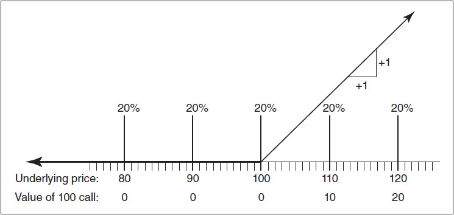

<!-- source:block 46338870228d5887 -->

> [!quote]- English 35
> If we want to develop a theoretical pricing model using this approach, we might propose a series of possible prices and probabilities for the underlying contract at expiration. Then, given an exercise price, we can calculate the intrinsic value of the option at each underlying price, multiply this value by its associated probability, add up all these numbers, and thereby obtain an expected value for the option. The expected value for a call at expiration is

如果我们想使用这种方法开发理论定价模型，我们可能会为标的合约在到期时提出一系列可能的价格和概率。然后，给定一个行权价，我们可以计算期权在每个标的价格下的内在价值，将该值乘以其相关概率，将所有这些数字相加，从而获得期权的预期价值。到期时看涨期权的预期值为

<!-- source:block ea3bd6b54a05dd03 -->

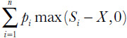

<!-- 原 EPUB 中此公式为图片，已原样保留 -->

<!-- source:block 82f736538825fa21 -->

> [!quote]- English 36
> where each *S**i* is a possible underlying price at expiration, and *p**i* is the probability associated with that price. The expected value for a put is

其中每个Si是到期时可能的标的价格，pi是与该价格相关的概率。看跌期权的预期价值是

<!-- source:block e9e6f363f2db36b7 -->

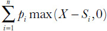

<!-- 原 EPUB 中此公式为图片，已原样保留 -->

<!-- source:block f4a9e65a606f1bd5 -->

> [!quote]- English 37
> In the foregoing example, we used a simple scenario with only five possible price outcomes, each with identical probability. Obviously, this is not very realistic. What changes might we make to develop a model that more accurately reflects the real world? For one thing, we need to know the settlement procedure for the option. If the option is subject to stock-type settlement, we must pay the full price of the option. If the 100 call has an expected value of \$6 at expiration, the theoretical value will be the present value of this amount. If interest rates are 12 percent annually (1 percent per month) and the option will expire in two months, the theoretical value of the option is

在前面的例子中，我们使用了一个简单的场景，其中只有五种可能的价格结果，每个结果的概率都相同。显然，这不是很现实。我们可以做出哪些改变来开发更准确反映现实世界的模型？首先，我们需要了解该期权的结算程序。如果期权进行股票型结算，我们必须支付期权全价。如果100看涨期权到期时的预期价值为6美元，则理论价值将是该金额的现值。如果年利率为12%（每月1%）且期权将在两个月后到期，则期权的理论价值为

<!-- source:block ff97fca6f0b88497 -->

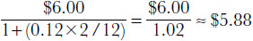

<!-- 原 EPUB 中此公式为图片，已原样保留 -->

<!-- source:block 3313282514327ef4 -->

> [!quote]- English 38
> What other factors might we consider? We assumed that all five price outcomes were equally likely. Is this a realistic assumption? Suppose that you were told that only two prices were possible at expiration, \$110 and \$250. If the current price of the underlying contract is close to \$100, which do you think is more likely? Experience suggests that extreme price changes that are far away from today’s price are less likely than small changes that remain close to today’s price. For this reason, \$110 is more likely than \$250. Perhaps our probability distribution ought to reflect this by concentrating the probabilities around the current price of the underlying contract. One possible distribution is shown in Figure 5-3. Using these new probabilities, the expected value for the 100 call is now

我们还可以考虑哪些其他因素？我们假设所有五种价格结果的可能性相同。这是现实的假设吗？假设您被告知到期时只有两种价格：110美元和250美元。如果标的合约当前价格接近100美元，您认为哪一个的可能性更大？经验表明，远离今天价格的极端价格变化的可能性低于保持接近今天价格的微小变化。因此，110美元比250美元更有可能。也许我们的概率分布应该通过将概率集中在标的合约当前价格周围来反映这一点。一种可能的分布如图5-3所示。使用这些新概率，100看涨期权的预期值现在是

<!-- source:block 4351b4dbed60c12a -->

> [!quote]- English 39
> (0% × 0) + (20% × 0) + (0% × 0) + (20% × \$10) + (10% × \$20) = \$4

$$
(0\% \times 0) + (20\% \times 0) + (0\% \times 0) + (20\% \times \$10) + (10\% \times \$20) = \$4
$$

<!-- source:block 38bae815409235ed -->

*图5-3 / Figure 5-3*

<!-- source:block 4b532454faaf045c -->

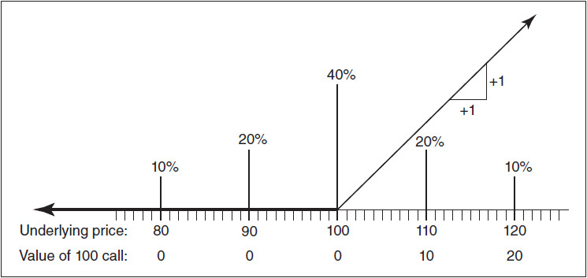

<!-- source:block feb52ed844a1073c -->

> [!quote]- English 41
> If, as before, the option is subject to stock-type settlement, the theoretical value is

如果像以前一样，期权实行股票型结算，则理论价值为

<!-- source:block 1633b56b7b92930d -->

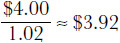

<!-- 原 EPUB 中此公式为图片，已原样保留 -->

<!-- source:block e2eb1642f4be4503 -->

> [!quote]- English 42
> Note that the new probabilities did not change the expected value for the underlying contract. Because the probabilities are symmetrical around \$100, the expected value for the underlying contract at expiration is still \$100.

请注意，新的概率不会改变标的合约的预期价值。由于概率在100美元左右对称，因此标的合约到期时的预期价值仍然是100美元。

<!-- source:block fe6f2eee89238727 -->

> [!quote]- English 43
> No matter how we assign probabilities, we will want to do so in such a way that the expected value for the underlying contract represents the most likely, or average, value at expiration. What is the most likely future value for the underlying contract? In fact, there is no way to know. But we might ask what the marketplace thinks the most likely value is. Recall what would happen if the theoretical forward price were different from the actual price of a forward contract in the marketplace. Everyone would execute an arbitrage by either buying or selling the forward contract and taking the opposite position in the cash market. In a sense, the marketplace must think that the forward price is the most likely future value for the underlying contract. If we assume that the underlying market is *arbitrage-free*, the expected value for the underlying contract must be equal to the forward price.

无论我们如何分配概率，我们都希望以这样的方式来实现，即标的合约的预期价值代表到期时最有可能或平均价值。标的合约最有可能的未来价值是多少？事实上，没有办法知道。但我们可能会问市场认为最有可能的价值是多少。回想一下，如果理论远期价格与市场上远期合约的实际价格不同会发生什么。每个人都会通过购买或出售远期合约并在现货市场采取相反的头寸来执行套利。从某种意义上说，市场必须认为远期价格是标的合约最有可能的未来价值。如果我们假设标的市场是无套利的，则标的合约的预期价值必须等于远期价格。

<!-- source:block 8811edac2cdbe411 -->

> [!quote]- English 44
> Suppose in our example that the underlying contract is a stock that is currently trading at \$100 and that pays no dividend prior to expiration. The two-month forward price for the stock is

假设在我们的例子中，标的合约是一只目前交易价格为100美元且在到期前不支付股息的股票。该股两个月远期价格为

<!-- source:block 2c9b6a6843a79c23 -->

> [!quote]- English 45
> \$100 × [1 + (0.12 × 2/12) ] = \$100 × 1.02 = \$102

$$
\$100 \times [1 + (0.12 \times 2/12) ] = \$100 \times 1.02 = \$102
$$

<!-- source:block 5d3bfe38091cb63b -->

> [!quote]- English 46
> If \$102 is the expected value for the stock, instead of assigning the probabilities symmetrically around \$100, we may want to assign them symmetrically around \$102. This distribution is shown in Figure 5-4. Now the expected value for the 100 call is

如果股票的期望值为 102 美元，我们可能不再以 100 美元为中心对称分配概率，而改为以 102 美元为中心对称分配。图 5-4 展示了这一概率分布。此时，100 call（看涨期权）的期望值为

<!-- source:block ca4c40e62f3eb1d3 -->

> [!quote]- English 47
> (10% × 0) + (20% × 0) + (40% × \$2) + (20% × \$12) + (10% × \$22) = \$5.40

$$
(10\% \times 0) + (20\% \times 0) + (40\% \times \$2) + (20\% \times \$12) + (10\% \times \$22) = \$5.40
$$

<!-- source:block dd8353e3294d279f -->

*图5-4 / Figure 5-4*

<!-- source:block d9f8845e0a35d0c4 -->

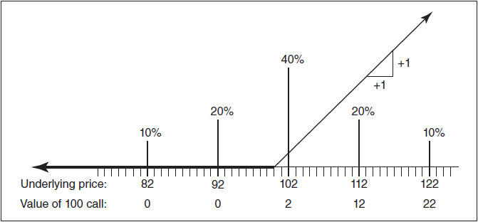

<!-- source:block 46128d89d6220458 -->

> [!quote]- English 49
> and the theoretical value is

理论价值是

<!-- source:block 11c1deabc235ae57 -->

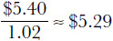

<!-- 原 EPUB 中此公式为图片，已原样保留 -->

<!-- source:block 1aacbdbe22c0d1ed -->

> [!quote]- English 50
> In the examples thus far, we have assumed a symmetrical probability distribution. But as long as the expected value is equal to the forward price, there is no requirement that the probabilities be assigned symmetrically. Figure 5-5 shows a distribution where the price outcomes are neither centered around the forward price nor are the probabilities symmetrical. Nonetheless, the expected value for the underlying contract is still equal to \$102

在迄今为止的例子中，我们假设了对称的概率分布。但只要预期价值等于远期价格，就不要求对称分配概率。图5-5显示了价格结果既不以远期价格为中心，概率也不对称的分布。尽管如此，标的合约的预期价值仍等于102美元

<!-- source:block d27004de7b7d611b -->

> [!quote]- English 51
> (6% × 83) + (15% × 90) + (39% × \$99) + (33% × \$110) + (7% × \$123) = 4.98 + 13.5 + 38.61 + 36.30 + 8.61 = \$102

$$
(6\% \times 83) + (15\% \times 90) + (39\% \times \$99) + (33\% \times \$110) + (7\% \times \$123) = 4.98 + 13.5 + 38.61 + 36.30 + 8.61 = \$102
$$

<!-- source:block 4e3141b0e0c43b31 -->

*图5-5 / Figure 5-5*

<!-- source:block 0a0d375cb07e25e4 -->

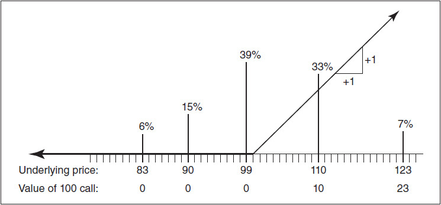

<!-- source:block a8ed6dc98aca55f6 -->

> [!quote]- English 53
> Using these probabilities, the theoretical value of the 100 call is

使用这些概率，100看涨期权的理论值为

<!-- source:block 67f2b009c6bb8589 -->

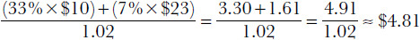

<!-- 原 EPUB 中此公式为图片，已原样保留 -->

<!-- source:block b760c03800954fb3 -->

> [!quote]- English 54
> The forward price of the underlying contract plays a central role in all option pricing models. For European options, the current price of the underlying contract is important only insofar as it can be turned into a forward price. Because of this, traders sometimes make the distinction between options that are at the money (the exercise price is equal to the current underlying price) and options which are *at the forward* (the exercise price is equal to the forward price at expiration). In many markets, at-the-forward options are the most actively traded, and such options are often used by traders as a benchmark for evaluating and trading other options.

标的合约的远期价格在所有期权定价模型中发挥着核心作用。对于欧洲期权，标的合约的当前价格只有在可以转化为远期价格时才重要。 因此，交易员有时会区分ATM期权（行权价等于当前标的价格）和远期平值期权（行权价等于到期时的远期价格）。 在许多市场中，远期期权是交易最活跃的，交易员经常将此类期权用作评估和交易其他期权的基准。

<!-- source:block 0220664e71956f32 -->

> [!quote]- English 55
> Even if we assume an arbitrage-free market in the underlying contract, we still have a major hurdle to overcome. In our simplified model, we assumed that there were only five possible price outcomes. In the real world, however, there are an infinite number of possibilities. To enable our model to more closely approximate the real world, we would like to construct a probability distribution with every possible price outcome together with its associated probability. This may seem an insurmountable obstacle, but we will see in subsequent chapters how we might approximate such a probability distribution.

即使我们假设标的合约是无套利市场，我们仍然有一个重大障碍需要克服。在我们的简化模型中，我们假设只有五种可能的价格结果。然而，在现实世界中，可能性是无限的。为了使我们的模型能够更接近现实世界，我们想要构建一个概率分布，其中包含每个可能的价格结果及其相关的概率。这似乎是一个不可逾越的障碍，但我们将在后续章节中看到如何逼近这样的概率分布。

<!-- source:block de7bb999ee2540d6 -->

> [!quote]- English 56
> We can now summarize the necessary steps in developing a model:

我们现在可以总结开发模型的必要步骤：

<!-- source:block 6406a9979a5fb1d3 -->

> [!quote]- English 57
> 1. Propose a series of possible prices at expiration for the underlying contract.

1.为标的合约到期时提出一系列可能的价格。

<!-- source:block 80ae80492d929439 -->

> [!quote]- English 58
> 2. Assign a probability to each possible price with the restriction that the underlying market is arbitrage-free—the expected value for the underlying contract must be equal to the forward price.

2.为每个可能的价格分配一个概率，但前提是标的市场无套利-标的合约的预期价值必须等于远期价格。

<!-- source:block 55a5b9dc15c8fd42 -->

> [!quote]- English 59
> 3. From the prices and probabilities in steps 1 and 2, and from the chosen exercise price, calculate the expected value of the option.

3.根据第1步和第2步中的价格和概率，以及选择的行权价，计算期权的预期价值。

<!-- source:block 81b17c50120e4c04 -->

> [!quote]- English 60
> 4. Lastly, depending on the option’s settlement procedure, calculate the present value of the expected value.

4.最后，根据期权的结算程序，计算预期价值的现值。

<!-- source:block b8af7431ef88b010 -->

## Black–Scholes 模型 / The Black-Scholes Model

<!-- source:block 6d3f3bff35dd9e94 -->

> [!quote]- English 61
> One of the first attempts to describe traded options in detail was a pamphlet written by Charles Castelli and published in London in 1877, “The Theory of Options in Stocks and Shares.”4 This pamphlet included a description of some commonly used hedging and trading strategies such as the “call-of-more” and the “call-and-put.” Today, these strategies are known as a *covered-write* and a *straddle*.

查尔斯·卡斯特利（Charles Castelli）于 1877 年在伦敦出版的小册子《股票与股份期权理论》（*The Theory of Options in Stocks and Shares*）[^ovp05-4]，是最早尝试详细描述交易所交易期权的著作之一。书中介绍了当时常用的一些对冲与交易策略，例如 “call-of-more” 和 “call-and-put”；今天，这两种策略分别称为 covered write（备兑卖出）和 straddle（跨式）。

<!-- source:block 6613af4780ffed9c -->

> [!quote]- English 62
> The origins of modern option pricing theory are most often ascribed to the year 1900, when French mathematician Louis Bachelier published *The Theory of Speculation*, the first attempt to use higher mathematics to price option contracts.5 Although Bachelier’s treatise was an interesting academic study, it resulted in little practical application because there were no organized option markets at that time. However, in 1973, concurrent with the opening of the Chicago Board Options Exchange, Fischer Black, at the time associated with the University of Chicago, and Myron Scholes, associated with the Massachusetts Institute of Technology, built on the work of Bachelier and other academics to introduce the first practical theoretical pricing model for options.6 The *Black-Scholes model*,7 with its relatively simple arithmetic and limited number of inputs, most of which were easily observable, proved an ideal tool for traders in the newly opened U.S. option market. Although other models have subsequently been introduced to overcome some of its original weaknesses, the Black-Scholes model remains the most widely used of all option pricing models.

现代期权定价理论的起源通常追溯至 1900 年。当时，法国数学家路易·巴舍利耶（Louis Bachelier）发表《投机理论》（*The Theory of Speculation*），首次尝试运用高等数学为期权合约定价。[^ovp05-5] 巴舍利耶的论著虽然是一项颇有价值的学术研究，却几乎没有得到实际应用，因为当时尚不存在有组织的期权市场。1973 年，恰逢芝加哥期权交易所开业，时任职于芝加哥大学的费舍尔·布莱克（Fischer Black）与任职于麻省理工学院的迈伦·斯科尔斯（Myron Scholes），在巴舍利耶及其他学者研究成果的基础上，提出了第一个具有实用性的期权理论定价模型。[^ovp05-6] 布莱克–斯科尔斯模型（Black–Scholes model）[^ovp05-7] 运算相对简单、所需输入参数较少，而且大多数参数都易于观察，因此成为新成立的美国期权市场中交易者的理想工具。尽管后来又出现了其他模型来克服其早期缺陷，布莱克–斯科尔斯模型至今仍是应用最广泛的期权定价模型。

<!-- source:block d5564823478e4fbe -->

> [!quote]- English 63
> In its original form, the Black-Scholes model was intended to evaluate European options (no early exercise permitted) on non-dividend-paying stocks. Shortly after its introduction, realizing that many stocks pay dividends, Black and Scholes added a dividend component. In 1976, Fischer Black made slight modifications to the model to allow for the evaluation of options on futures contracts.8 In 1983, Mark Garman and Steven Kohlhagen of the University of California at Berkeley made additional modifications to allow for the evaluation of options on foreign currencies.9 The futures version and the foreign-currency version are known formally as the *Black model* and the *Garman-Kohlhagen model*, respectively. However, the evaluation method in each variation, whether the original Black-Scholes model for stock options, the Black model for futures options, or the Garman-Kohlhagen model for foreign currency options, is so similar that they have all come to be known simply as the *Black-Scholes model*. The various forms of the model differ only in how they calculate the forward price of the underlying contract and the settlement procedure for the options. An option trader will simply choose the form appropriate to the options and underlying instrument in which he is interested.

布莱克–斯科尔斯模型最初用于估值不支付股息股票上的欧式期权（不允许提前行权）。模型问世后不久，布莱克和斯科尔斯考虑到许多股票会支付股息，便加入了股息因素。1976 年，费舍尔·布莱克对模型略作修改，使其能够估值期货期权。[^ovp05-8] 1983 年，加州大学伯克利分校的马克·加曼（Mark Garman）和史蒂文·科尔哈根（Steven Kohlhagen）又作进一步修改，使其能够估值外汇期权。[^ovp05-9] 期货期权版本和外汇期权版本的正式名称分别为布莱克模型（Black model）与加曼–科尔哈根模型（Garman–Kohlhagen model）。不过，无论是用于股票期权的原始布莱克–斯科尔斯模型、用于期货期权的布莱克模型，还是用于外汇期权的加曼–科尔哈根模型，其估值方法都十分相似，因此通常统称为布莱克–斯科尔斯模型。各版本之间的差别，仅在于如何计算标的合约的远期价格，以及采用何种期权结算程序。期权交易者只需选用适合相关期权和标的工具的版本即可。

<!-- source:block 40f0d1f16d751c7c -->

> [!quote]- English 64
> Given its widespread use and its importance in the development of other pricing models, we will, for the moment, restrict ourselves to a discussion of the Black-Scholes model and its various forms. In later chapters we will consider the question of early exercise. We will also look at alternative methods for pricing options when we question some of the basic assumptions in the Black-Scholes model.

鉴于其广泛使用及其在其他定价模型开发中的重要性，我们目前将仅限于讨论布莱克-斯科尔斯模型及其各种形式。在后面的章节中，我们将考虑提前行权的问题。当我们质疑布莱克-斯科尔斯模型中的一些基本假设时，我们还将研究期权定价的替代方法。

<!-- source:block 9efc05fccf0dabd1 -->

> [!quote]- English 65
> The reasoning that led to the development of the Black-Scholes model is similar to the simple approach we took earlier in this chapter for evaluating options. Black and Scholes worked originally with call values, but put values can be derived in much the same way. Alternatively, we will see later that for European options there is a unique pricing relationship between an underlying contract and a call and put with the same exercise price and expiration date. This relationship will enable us to derive a put value from the companion call value or a call value from the companion put value.

导致布莱克-斯科尔斯模型发展的推理与我们在本章早些时候评估期权所采用的简单方法相似。布莱克和斯科尔斯最初研究看涨价值，但看跌价值可以以大致相同的方式推导。或者，我们稍后会看到，对于欧洲期权，标的合约与具有相同行权价和到期日的看涨和看跌之间存在独特的定价关系。这种关系将使我们能够从伴随看跌价值中推导出看跌价值，或者从伴随看跌价值中推导出看涨价值。

<!-- source:block c9eb7172f88e1779 -->

> [!quote]- English 66
> To calculate an option’s theoretical value using the Black-Scholes model, we need to know, at a minimum, five characteristics of the option and its underlying contract:

为了使用Black-Scholes模型计算期权的理论价值，我们至少需要知道期权及其标的合约的五个特征：

<!-- source:block e58bae230da6df01 -->

> [!quote]- English 67
> 1. The option’s exercise price

1.期权的行权价

<!-- source:block c3c3daadc10cf84d -->

> [!quote]- English 68
> 2. The time remaining to expiration

2.距离到期的剩余时间

<!-- source:block 7be4549d8be94669 -->

> [!quote]- English 69
> 3. The current price of the underlying contract

3.标的合约的当前价格

<!-- source:block cf1959a384806f67 -->

> [!quote]- English 70
> 4. The applicable interest rate over the life of the option

4.期权有效期内适用的利率

<!-- source:block ef2ffd21a69d9559 -->

> [!quote]- English 71
> 5. The volatility of the underlying contract

5.标的合约的波动率

<!-- source:block 9fc69eac59a30a3e -->

> [!quote]- English 72
> The last input, volatility, may be unfamiliar to a new trader. While we will put off a detailed discussion of this input to Chapter 6, from our previous discussion, we can reasonably infer that volatility is related to either the speed of the underlying market or the probabilities of different price outcomes.

最后一个输入，波动率，对于新交易者来说可能不熟悉。虽然我们将推迟到第6章对这一输入的详细讨论，但从之前的讨论中，我们可以合理地推断波动率与标的市场的速度或不同价格结果的可能性有关。

<!-- source:block 5895e20966dba9ac -->

> [!quote]- English 73
> If we know each of the required inputs, we can feed them into the theoretical pricing model and thereby generate a theoretical value (see Figure 5-6).

如果我们知道每个所需的输入，我们就可以将它们输入到理论定价模型中，从而生成理论价值（见图5-6）。

<!-- source:block 46f34c1341c4d9d3 -->

*图5-6 / Figure 5-6*

<!-- source:block bd6163ae0257ee7e -->

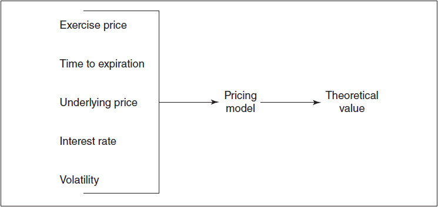

<!-- source:block 0d325ba76b0e90d4 -->

> [!quote]- English 75
> Black and Scholes also incorporated into their model the concept of a *riskless hedge*. For every option position, there is a theoretically equivalent position in the underlying contract such that, for small price changes in the underlying contract, the option position will gain or lose value at exactly the same rate as the underlying position. To take advantage of a theoretically mispriced option, it is necessary to establish this riskless hedge by offsetting the option position with a theoretically equivalent underlying position. That is, whatever option position we take, we must take an opposing market position in the underlying contract. The correct proportion of underlying contracts needed to establish this riskless hedge is determined by the option’s *hedge ratio*.

布莱克和斯科尔斯还将无风险对冲的概念融入到他们的模型中。对于每一个期权头寸，标的合约中都存在一个理论上等效的头寸，因此，对于标的合约的小幅价格变化，期权头寸将以与标的头寸完全相同的利率增值或亏损。为了利用理论上定价错误的期权，有必要通过用理论上等效的标的头寸抵消期权头寸来建立这种无风险对冲。也就是说，无论我们采取何种期权头寸，我们都必须在标的合约中采取相反的市场头寸。建立这种无风险对冲所需的标的合约的正确比例由期权的对冲比率决定。

<!-- source:block 9ae35f25379f24b4 -->

> [!quote]- English 76
> Why is it necessary to establish a riskless hedge? Recall that in our simplified approach, an option’s theoretical value depended on the probability of various price outcomes for the underlying contract. As the price of the underlying contract changes, the probability of each outcome will also change. If the underlying price is currently \$100 and we assign a 25 percent probability to \$120, we might drop the probability for \$120 to 10 percent if the price of the underlying contract falls to \$90. By initially establishing a riskless hedge and then adjusting the hedge as market conditions change, we are taking into consideration these changing probabilities.

为什么有必要建立无风险对冲？回想一下，在我们的简化方法中，期权的理论价值取决于标的合约各种价格结果的可能性。随着标的合约价格的变化，每个结果的可能性也会发生变化。如果标的价格当前为100美元，并且我们将25%的可能性分配给120美元，那么如果标的合约的价格跌至90美元，我们可能会将120美元的可能性降低到10%。通过最初建立无风险对冲，然后随着市场条件的变化调整对冲，我们正在考虑这些变化的可能性。

<!-- source:block 7cfa1c9df11dfb57 -->

> [!quote]- English 77
> In this sense, an option can be thought of as a substitute for a position in the underlying contract. A call is a substitute for a long position; a put is a substitute for a short position. Whether the substitute position is better than an outright position in the underlying contract depends on the theoretical value of the option compared with its price in the marketplace. If a call can be purchased for less than its theoretical value or a put can be sold for more than its value, in the long run, it will be more profitable to take a long market position by purchasing calls or selling puts than by purchasing the underlying contract. In the same way, if a put can be purchased for less than its theoretical value or a call can be sold for more than its value, in the long run, it will be more profitable to take a short market position by purchasing puts or selling calls than by selling the underlying contract.

从这个意义上说，期权可以视为标的合约头寸的替代工具：看涨期权可替代多头头寸，看跌期权可替代空头头寸。期权替代头寸是否优于直接持有标的，取决于期权理论价值相对于市场价格的高低。若能以低于理论价值的价格买入看涨期权，或以高于理论价值的价格卖出看跌期权，那么从长期来看，通过买入看涨期权或卖出看跌期权建立市场多头，可能比直接买入标的合约更有利。同理，若能低价买入看跌期权或高价卖出看涨期权，那么通过买入看跌期权或卖出看涨期权建立市场空头，可能比直接卖出标的合约更有利。

<!-- source:block 1a53424368442b23 -->

> [!quote]- English 78
> In later chapters we will discuss the concept of a riskless hedge in greater detail. For now, we simply summarize the four basic option positions, their corresponding market positions, and the appropriate hedges:

在后面的章节中，我们将更详细地讨论无风险对冲的概念。目前，我们简单总结了四种基本期权头寸、其相应的市场头寸以及适当的对冲：

<!-- source:block 2d467bcc9af12c45 -->

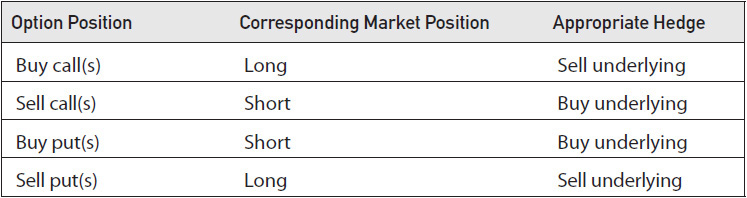

<!-- source:block 10ebe6a2de122adc -->

> [!quote]- English 79
> For new traders, it may be helpful to point out that we are always doing the opposite with calls and the underlying (i.e., *buy* calls, *sell* the underlying; *sell* calls, *buy* the underlying) and doing the same with puts and the underlying (i.e., *buy* puts, *buy* the underlying; *sell* puts, *sell* the underlying). Especially with puts, more than a few new traders have initially done it backwards, buying puts and selling the underlying or selling puts and buying the underlying. This, of course, is no hedge at all.

对于新交易者来说，指出我们在看涨期权和标的交易中总是采取相反的做法可能会有所帮助（即，买入看涨期权，卖出标的;卖出看涨期权，买入标的）并对看跌期权和标的做同样的事情（即，购买看跌期权，购买标的;出售看跌期权，出售标的）。特别是对于看跌期权，不止一些新交易者最初都是反向进行的，购买看跌期权并出售标的，或者出售看跌期权并购买标的。当然，这根本不是对冲措施。

<!-- source:block 75e1ae57ba32a7e7 -->

> [!quote]- English 80
> Because the theoretical value obtained from a theoretical pricing model is no better than the inputs into the model, a few comments on each of the inputs will be worthwhile.

由于从理论定价模型中获得的理论价值并不比模型的输入更好，因此对每个输入做一些评论是值得的。

<!-- source:block 78568a64dbcaaf6f -->

### 行权价 / Exercise Price

<!-- source:block 19af1a5518d49cc7 -->

> [!quote]- English 81
> There should never be any doubt about the exercise price of an option because it is fixed under the terms of the contract and does not vary over the life of the option.10 A March 60 call cannot suddenly turn into a March 55 call. A September 100 put cannot turn into a September 110 put.

永远不应该对期权的行权价有任何怀疑，因为它是根据合约条款固定的，并且不会在期权的有效期内发生变化。[^ovp05-10] 3 月到期、行权价为 60 的看涨期权不能突然变成3 月到期、行权价为 55 的看涨期权。9月100看跌期权不能变成9月110看跌期权。

<!-- source:block 4112f83be3021dde -->

### 距到期时间 / Time to Expiration

<!-- source:block dd52c317855df336 -->

> [!quote]- English 82
> As with the exercise price, an option’s expiration date is fixed and will not vary. A March 60 call will not suddenly turn into an April 60 call, nor will a September 100 put turn into an August 100 put. Of course, each day that passes brings us closer to expiration, so in this sense the time to expiration is constantly growing shorter. However, the expiration date, like the exercise price, is fixed by the exchange and will not change.

与行权价一样，期权的到期日是固定的，不会变化。3 月到期、行权价为 60 的看涨期权不会突然变成4 月到期、行权价为 60 的看涨期权，9 月到期、行权价为 100 的看跌期权也不会突然变成8 月到期、行权价为 100 的看跌期权。当然，每过一天，我们都离到期更近，所以从这个意义上说，到期的时间不断缩短。然而，到期日与行权价一样，由交易所固定，不会改变。

<!-- source:block 4875e3902de25395 -->

> [!quote]- English 83
> In financial models, one year is typically the standard unit of time. Therefore, time to expiration is entered into the Black-Scholes model as an annualized number. If we express time in terms of days, we must make the appropriate adjustment by dividing the number of days to expiration by 365. However, most option-evaluation computer programs already have this transformation incorporated into the software, so we need only enter the correct number of days remaining to expiration.

在财务模型中，一年通常是标准时间单位。因此，到期时间作为年化数字输入Black-Scholes模型。如果我们用天数来表示时间，我们必须通过将到期天数除以365来进行适当的调整。然而，大多数期权评估计算机程序已经将这种转换整合到软件中，因此我们只需输入正确的到期天数即可。

<!-- source:block 649fff51541f999d -->

> [!quote]- English 84
> It may seem that we have a problem in deciding what number of days to enter into the model. We need the amount of time remaining to expiration for two purposes: (1) to determine the likelihood of price movement in the underlying contract and (2) to make interest calculations. For the former, we are only interested in days on which the price of the underlying contract can change. For exchange-traded contracts, this can only occur on business days. This might lead us to drop weekends and holidays from our calculations. On the other hand, for interest-rate purposes, we must include every day. If we borrow or lend money, we expect interest to accrue every day, no matter that some of those days are not business days.

看起来我们在决定进入模型的天数时有问题。我们需要剩余的时间来达到两个目的：（1）确定标的合约价格变动的可能性;（2）计算利息。对于前者，我们只对标的合约价格可能发生变化的日期感兴趣。对于交易所交易合约，这只能在工作日发生。这可能会导致我们从计算中删除周末和假期。另一方面，出于利率目的，我们必须包括每天。如果我们借钱或借钱，我们预计每天都会产生利息，无论其中一些日子不是工作日。

<!-- source:block 4a5c167aa2e7ca11 -->

> [!quote]- English 85
> However, this is not really a problem. In determining the likelihood of price movement in the underlying contract, we observe only business days because these are the only days on which price changes can occur. Then we scale these values to an annualized number before feeding it into the theoretical pricing model. The result is that we can feed into our model the actual number of days remaining to expiration, knowing that the model will interpret all inputs correctly.

然而，这实际上并不是问题。在确定标的合约价格变动的可能性时，我们仅观察工作日，因为这些是价格可能发生变化的唯一日子。然后我们将这些值扩展到年化数字，然后将其输入理论定价模型。结果是，我们可以将距离到期的实际天数输入到我们的模型中，因为我们知道模型将正确解释所有输入。

<!-- source:block 37a536d1588f2a1c -->

> [!quote]- English 86
> Although traders typically express time to expiration in days, a trader may want to use a different measure. Especially as expiration approaches, a trader may prefer to use hours or even minutes. In theory, finer time increments should yield more accurate values. But there is a practical limitation to using very small increments of time. As time passes, the discrete increments of time we feed into a theoretical pricing model may not accurately represent the continuous passage of time in the real world. Most traders have learned through experience that as expiration approaches, the use of a theoretical pricing model becomes less reliable because the inputs become less reliable. Indeed, very close to expiration, many traders stop using model-generated values altogether.

尽管交易员通常以天来表示到期时间，但交易员可能希望使用不同的衡量标准。特别是随着到期临近，交易者可能更喜欢使用小时甚至分钟。理论上，更细的时间增量应该会产生更准确的值。但使用非常小的时间增量存在实际限制。随着时间的推移，我们输入理论定价模型的离散时间增量可能无法准确表示现实世界中时间的连续流逝。大多数交易者通过经验了解到，随着到期日的临近，理论定价模型的使用变得不那么可靠，因为输入变得不那么可靠。事实上，在接近到期时，许多交易者完全停止使用模型生成的值。

<!-- source:block 6b18f3cf9ec9fffd -->

### 标的价格 / Underlying Price

<!-- source:block 77985401bac93d19 -->

> [!quote]- English 87
> Unlike the exercise price and time to expiration, the correct price of the underlying contract is not always obvious. At any one time, there is a bid price and an ask price (the *bid-ask spread*), and it may not be clear whether we ought to use one or the other of these prices or perhaps some price in between.

与行权价和到期时间不同，标的合约的正确价格并不总是显而易见的。在任何时候，都有一个买入价和一个卖出价（买卖价差），并且可能不清楚我们是否应该使用这些价格中的一个或另一个价格，或者也许是介于两者之间的某个价格。

<!-- source:block 4d251f9c0ad689b2 -->

> [!quote]- English 88
> Consider an underlying market where the last trade price was 75.25 but that is currently displaying the following bid-ask spread:

考虑一个标的市场，其最后交易价格为75.25，但目前显示以下买卖价差：

<!-- source:block f265b2afb4d8d5c8 -->

> [!quote]- English 89
> 75.20–75.40

$$
75.20-75.40
$$

<!-- source:block 707884d9cf0c3d07 -->

> [!quote]- English 90
> If a trader is using a theoretical pricing model to evaluate options on this market, what price should he feed into the model? One possibility is 75.25, the last trade price. Another possibility might be 75.30, the midpoint of the bid-ask spread.

如果交易者使用理论定价模型来评估市场上的期权，他应该向模型中输入什么价格？一种可能性是75.25，最后的交易价格。另一种可能性可能是75.30，即买卖价差的中点。

<!-- source:block e9aaff33a6fa5b87 -->

> [!quote]- English 91
> Even though we are focusing on the use of theoretical pricing models, we should emphasize that there is no law that says a trader must make any decisions based on or consistent with a theoretical pricing model. A trader can simply buy or sell options and hope that the trade turns out favorably. But a disciplined trader who uses a pricing model knows that he is required to hedge the option position by taking an opposing market position in the underlying contract. Therefore, the underlying price that he feeds into the theoretical pricing model ought to be the price at which he believes he can make the opposing trade. If the trader intends to purchase calls or sell puts, both of which are long market positions, he will hedge by selling the underlying contract. In this case, he will want to use something close to the bid price because that is the price at which he can probably sell the underlying. On the other hand, if the trader intends to sell calls or buy puts, both of which are short market positions, he will hedge by purchasing the underlying contract. Now he will want to use something close to the ask price because that is the price at which he can probably buy the underlying.

尽管我们专注于理论定价模型的使用，但我们应该强调，没有法律规定交易员必须根据理论定价模型或与理论定价模型一致做出任何决策。交易者可以简单地购买或出售期权并希望交易结果良好。但使用定价模型的纪律严明的交易员知道，他需要通过在标的合约中采取相反的市场头寸来对冲期权头寸。因此，他输入理论定价模型的标的价格应该是他认为可以进行相反交易的价格。如果交易员打算购买看涨期权或卖出看跌期权（两者都是市场多头头寸），他将通过出售标的合约进行对冲。在这种情况下，他希望使用接近出价的价格，因为这是他可能可以出售标的物的价格。另一方面，如果交易员打算出售看涨期权或买入看跌期权（两者都是市场空头头寸），他将通过购买标的合约进行对冲。现在他想使用接近要价的东西，因为这是他可能可以购买标的价格。

<!-- source:block ff9ad85e242971e2 -->

> [!quote]- English 92
> In practice, if the underlying market is very *liquid*, with a narrow bid-ask spread and many contracts available at each price, a trader who must make a quick decision may very well use a price close to the midpoint because that probably represents a reasonable estimate of where the underlying can be bought or sold. But in an *illiquid* market, with a very wide bid-ask spread and only a few contracts available at each price, the trader must give extra thought to the appropriate underlying price. In such a market, particularly if the prices are changing rapidly, it may be difficult to execute even a small order at the quoted prices.

在实践中，如果标的市场流动性很强，买卖价差很窄，每个价格都有许多可用的合约，那么必须快速做出决定的交易员很可能会使用接近中点的价格，因为这可能代表了对标的市场可以买卖的合理估计。但在流动性不高的市场中，买卖价差非常大，每个价格只有少数合约可用，交易员必须额外考虑合适的标的价格。在这样的市场中，特别是如果价格变化迅速，可能很难以报价执行即使是小订单。

<!-- source:block c1e79581744a09b1 -->

### 利率 / Interest Rates

<!-- source:block 42151414c374deee -->

> [!quote]- English 93
> Because an option trade may result in either a cash credit or debit to a trader’s account, the interest considerations resulting from this cash flow must also play a role in option evaluation. This is a function of interest rates over the life of the option.

由于期权交易可能使交易者账户产生 `cash credit` 或 `cash debit`，这些现金流对应的利息因素也必须纳入期权估值；其大小取决于期权剩余期限内的利率。

<!-- source:block c0813dbf54e22abf -->

> [!quote]- English 94
> Interest rates play two roles in the theoretical evaluation of options. First, they may affect the forward price of the underlying contract. If the underlying contract is subject to stock-type settlement, as we raise interest rates, we raise the forward price, increasing the value of calls and decreasing the value of puts. Second, interest rates may affect the present value of the option. If the option is subject to stock-type settlement, as we raise interest rates, we reduce the present value of the option. Although interest rates may affect both the forward price and the present value, in most cases, the same rate is applicable, and we need only input one interest rate into the model. If, however, different rates are applicable, as would be the case with foreign-currency options (the foreign-currency interest rate plays one role, and the domestic-currency interest rate plays a different role), the model will require the input of two interest rates. This is the case with the Garman-Kohlhagen version of the Black-Scholes model.

利率在期权的理论评估中发挥着两个作用。首先，它们可能会影响标的合约的远期价格。如果标的合约须接受股票型结算，当我们提高利率时，我们会提高远期价格，增加看涨期权的价值并减少看跌期权的价值。其次，利率可能会影响期权的现值。如果期权需要股票型结算，随着我们提高利率，我们会降低期权的现值。尽管利率可能同时影响远期价格和现值，但在大多数情况下，适用相同的利率，并且我们只需要在模型中输入一个利率。然而，如果适用不同的利率，就像外币期权的情况一样（外币利率起一个作用，本币利率起不同作用），则模型将需要输入两个利率。布莱克-斯科尔斯模型的Garman-Kohletts版本就是这种情况。

<!-- source:block 8fade6dd7c1fd4dc -->

> [!quote]- English 95
> What interest rate should a trader use when evaluating options? Textbooks often suggest using the *risk-free rate*, the rate that applies to the most creditworthy borrower. In most markets, the government is considered the most secure borrower of funds, so the yield on a government security with a maturity equivalent to the life of the option is the general benchmark. For a 60-day option denominated in dollars, we might use the yield on a 60-day U.S. Treasury bill; for a 180-day option, we might use the yield on a 180-day U.S. Treasury bill.

交易员在评估期权时应该使用什么利率？教科书通常建议使用无风险利率，即适用于最有信誉的借款人的利率。在大多数市场中，政府被认为是最安全的资金借款人，因此期限相当于期权期限的政府证券的收益率是一般基准。对于以美元计价的60天期权，我们可能会使用60天美国国债的收益率;对于180天期权，我们可能会使用180天美国国债的收益率。

<!-- source:block 4819f0395d0ba3b8 -->

> [!quote]- English 96
> In practice, no individual can borrow or lend at the same rate as the government, so it seems unrealistic to use the risk-free rate. To determine a more realistic rate, a trader might look to a freely traded market in interest-rate contracts. In this respect, traders often use either the *London Interbank Offered Rate* (LIBOR)11 or the Eurocurrency markets to determine the applicable rate. For dollar-denominated options, Eurodollar futures traded at the Chicago Mercantile Exchange are often used to determine a benchmark interest rate.

在实践中，任何个人都不能以与政府相同的利率借款或放贷，因此使用无风险利率似乎不切实际。为了确定更现实的利率，交易员可能会寻找利率合约的自由交易市场。在这方面，交易员通常使用伦敦银行间拆借利率（LIBOR）[^ovp05-11]或欧洲货币市场来确定适用的利率。对于以美元计价的期权，在芝加哥商品交易所交易的欧洲美元期货通常用于确定基准利率。

<!-- source:block f6779df8022ed08a -->

> [!quote]- English 97
> The situation is further complicated by the fact that most traders do not borrow and lend at the same rate, so the correct interest rate will, in theory, depend on whether the trade will create a credit or a debit. In the former case, the trader will be interested in the borrowing rate; in the latter case, he will be interested in the lending rate. However, among the inputs into the model—the underlying price, time to expiration, interest rates, and volatility—interest rates tend to play the least important role. Using a rate that “makes sense” is usually a reasonable solution. Of course, for very large positions or for very long-term options, small changes in the interest rate can have a large impact. But for most traders, getting the interest rate exactly right is usually not a major consideration.

由于大多数交易员的借贷利率并不相同，情况变得更加复杂，因此理论上正确的利率将取决于交易是否会创造 credit 或 debit。在前一种情况下，交易员将对借款利率感兴趣;在后一种情况下，他将对贷款利率感兴趣。然而，在模型的输入（标的价格、到期时间、利率和波动率）中，利率往往扮演的角色最不重要。使用“有意义”的费率通常是一个合理的解决方案。当然，对于非常大的头寸或非常长期的期权，利率的微小变化可能会产生很大的影响。但对于大多数交易员来说，获得完全正确的利率通常不是一个主要考虑因素。

<!-- source:block 0d3ab479fca350f0 -->

### 股息 / Dividends

<!-- source:block 465c5f361702b0ba -->

> [!quote]- English 98
> We did not list dividends as a model input in Figure 5-5 because they are only a factor in the theoretical evaluation of stock options and then only if the stock is expected to pay a dividend over the life of the option. In order to evaluate a stock option, the model must accurately calculate the forward price for the stock. This requires us to estimate both the amount of the dividend and the date on which the dividend will be paid. In practice, rather than using the date of dividend payment, an option trader is likely to focus on the *ex-dividend date*, the date on which the stock is trading without the rights to the dividend. The exact dividend payment date is important in calculating the interest that can be earned on the dividend payment and thereby calculating a more accurate forward price. But for a trader ownership of the stock in order to receive the dividend is the primary consideration. A deeply in-the-money option may have many of the same characteristics as stock, but only ownership of the stock carries with it the rights to the dividend.

我们没有将股息列为图5-5中的模型输入，因为它们只是股票期权理论评估中的一个因素，并且只有当股票预计在期权有效期内支付股息时。为了评估股票期权，模型必须准确计算股票的远期价格。这需要我们估计股息金额和支付股息的日期。在实践中，期权交易者可能不会使用股息支付日期，而是关注除息日期，即股票在没有股息权利的情况下进行交易的日期。准确的股息支付日期对于计算股息支付可以赚取的利息并从而计算更准确的远期价格非常重要。但对于交易员来说，为了获得股息而拥有股票是首要考虑因素。深度价内期权可能具有许多与股票相同的特征，但只有股票的所有权才附带股息权。

<!-- source:block 15c74129c6aa8f24 -->

> [!quote]- English 99
> In the absence of other information, most traders assume that a company is likely to continue its past dividend policy. If a company has been paying a 75-cent dividend each quarter, it will probably continue to do so. However, until the company officially declares the dividend, this is not a certainty. A company may increase or reduce its dividend or omit it completely. If there is the possibility of a change in a company’s dividend policy, a trader must consider its impact on option values. Additionally, if the ex-dividend date is expected just prior to expiration, a delay of several days will cause the ex-dividend date to fall after expiration. For purposes of option evaluation, this is the same as eliminating the dividend entirely. In such a situation, a trader will need to make a special effort to ascertain the exact ex-dividend date.

在缺乏其他信息的情况下，大多数交易者认为公司可能会继续其过去的股息政策。如果一家公司每个季度支付75美分的股息，它可能会继续这样做。不过，在公司正式宣布分红之前，这还不能确定。公司可以增加或减少股息，也可以完全取消股息。如果公司的股息政策有可能发生变化，交易员必须考虑其对期权价值的影响。此外，如果除息日期预计在到期前，则延迟几天将导致除息日期在到期后落下。出于期权评估的目的，这与完全消除股息相同。在这种情况下，交易员需要做出特别努力来确定确切的除息日期。

<!-- source:block 9cd392769f033613 -->

### 波动率 / Volatility

<!-- source:block 2b4fc1554292571c -->

> [!quote]- English 100
> Of all the inputs required for option evaluation, volatility is the most difficult for traders to understand. At the same time, volatility often plays the most important role in actual trading decisions. Changes in our assumptions about volatility can have a dramatic effect on an option’s value. And the manner in which the marketplace assesses volatility can have an equally dramatic effect on an option’s price. For these reasons, we will begin a detailed discussion of volatility in Chapter 6.

在期权评估所需的所有输入中，波动率是交易员最难理解的。与此同时，波动率往往在实际交易决策中发挥着最重要的作用。我们对波动率假设的变化可能会对期权的价值产生巨大影响。市场评估波动率的方式也会对期权价格产生同样巨大的影响。出于这些原因，我们将在第6章开始详细讨论波动率。

<!-- source:block bccdba7118c14579 -->

> [!note] Footnote 101
> 1 We assume a roulette wheel with 38 slots, as is customary in the United States. In some parts of the world, a roulette wheel may have no slot numbered 00. This, of course, changes the probabilities.

[^ovp05-1]: 这里假设轮盘有 38 个号码格，这符合美国的惯例。在世界其他一些地区，轮盘可能没有编号为 00 的号码格；这当然会改变相应概率。

<!-- source:block 7438f9cebfda4a2b -->

> [!note] Footnote 102
> 2 One might also argue that a trader with a candle (i.e., theoretical pricing model) might drop the candle and burn down the entire building. Financial crises seem to occur when many traders drop their candles at the same time.

[^ovp05-2]: 有人可能还认为，一个拿着蜡烛的交易员（即，理论定价模型）可能会掉蜡烛并烧毁整个建筑。当许多交易员同时放下蜡烛时，金融危机似乎就会发生。

<!-- source:block 5ce463768be86cb5 -->

> [!note] Footnote 103
> 3 Some interesting discussion on the limitations of models: Fischer Black, “The Holes in Black Scholes,” *Risk* 1(4):30–33, 1988; Stephen Figlewski, “What Does an Option Pricing Model Tell Us about Option Prices?” *Financial Analysts Journal*, September–October 1989, pp. 12–15; Fischer Black, “Living Up to the Model,” *Risk* 3(3):11–13, 1990; and Emanuel Derman and Paul Wilmott, “The Financial Modelers’ Manifesto” (January 2009), http://www.wilmott.com/blogs/paul/index.cfm/2009/1/8/Financial-Modelers-Manifesto.

[^ovp05-3]: 关于模型局限性的一些有趣讨论：Fischer Black，“The Holes in Black Scholes”，Risk 1（4）：30-33，1988; Stephen Figlewski，“期权定价模型告诉我们什么期权价格？”《金融分析师杂志》，1989年9月至10月，pp。12-15; Fischer Black，“Living Up the Model”，Risk 3（3）：11-13，1990; Emanuel Derman和Paul Wilmott，“The Financial Modellers ' Manifesto”（2009年1月），http://www.wilmott.com/blogs/paul/index.cfm/2009/1/8/Financial-Modelers-Manifesto。

<!-- source:block 090b94993eefb43c -->

> [!note] Footnote 104
> 4 A photocopy of the Castelli pamphlet, which is now in the public domain, is available at books.google.com.

[^ovp05-4]: Castelli小册子的复印件现已公开，可在books.google.com上获取。

<!-- source:block 0bd767be55397ad3 -->

> [!note] Footnote 105
> 5 See Louis Bachelier’s *Theory of Speculation*, Mark Davis and Alison Etheridge, trans. (Princeton, NJ: Princeton University Press, 2006). A translation of Bachelier’s treatise also appears in *The Random Character of Stock Market Prices*, Paul Cootner, ed. (Cambridge, MA: MIT Press, 1964).

[^ovp05-5]: 参见 Louis Bachelier，*Theory of Speculation*，Mark Davis 与 Alison Etheridge 译（Princeton, NJ: Princeton University Press, 2006）。巴舍利耶论著的另一译本亦收录于 Paul Cootner 编著的 *The Random Character of Stock Market Prices*（Cambridge, MA: MIT Press, 1964）。

<!-- source:block 0364d6af579dfd23 -->

> [!note] Footnote 106
> 6 Fischer Black and Myron Scholes, “The Pricing of Options and Corporate Liabilities,” *Journal of Political Economy* 81(3):637–654, 1973.

[^ovp05-6]: Fischer Black and Myron Scholes，“The Pricing of Options and Corporate Liabilities，”Journal of Political Economy 81（3）：637-654，1973.

<!-- source:block 4f8650f1d644a689 -->

> [!note] Footnote 107
> 7 Robert Merton, who, at the time, was, like Myron Scholes, associated with MIT, is also credited with some of the same work that led to the development of the original Black-Scholes model. His paper, “The Rational Theory of Option Pricing,” appeared in the *Bell Journal of Economics and Management Science* 4(Spring):141–183, 1973. In recognition of Merton’s contribution, the model is sometimes referred to as the *Black-Scholes-Merton model*. Scholes and Merton were awarded the Nobel Prize in Economic Sciences in 1997; Fischer Black, unfortunately, died in 1995.

[^ovp05-7]: 罗伯特·默顿（Robert Merton）当时与迈伦·斯科尔斯（Myron Scholes）一样，都与麻省理工学院有联系，他的一些工作也与最初的布莱克-斯科尔斯模型的发展有关。他的论文《期权定价的理性理论》发表在《贝尔经济与管理科学杂志》4（春季）：141-183，1973年。为了表彰默顿的贡献，该模型有时被称为布莱克-斯科尔斯-默顿模型。斯科尔斯和默顿于1997年获得诺贝尔经济学奖;不幸的是，费舍尔·布莱克于1995年去世。

<!-- source:block 48f57b0eafd6bf62 -->

> [!note] Footnote 108
> 8 Fischer Black, “The Pricing of Commodity Contracts,” *Journal of Financial Economics* 3:167–179, 1976.

[^ovp05-8]: 费舍尔·布莱克，“商品合约的定价”，《金融经济学杂志》3：167-179，1976年。

<!-- source:block c359f8e1189cd4fb -->

> [!note] Footnote 109
> 9 Mark B. Garman and Steven W. Kohlhagen, “Foreign Currency Option Values,” *Journal of International Money and Finance* 2(3):239–253, 1983. We are speaking here of options on a physical foreign currency rather than options on a foreign-currency futures contract. The latter may be evaluated using the Black model for futures options.

[^ovp05-9]: Mark B. Garman 与 Steven W. Kohlhagen，“Foreign Currency Option Values”，*Journal of International Money and Finance* 2(3):239–253, 1983。这里讨论的是实物外币期权，而非外汇期货期权；后者可以使用适用于期货期权的 Black model 估值。

<!-- source:block 45fdff253fe82545 -->

> [!note] Footnote 110
> 10 An exchange may adjust the exercise price of a stock option as the result of a stock split or in the case of an extraordinary dividend. In practical terms, this is only an accounting change. The characteristics of the option contract remain essentially unchanged.

[^ovp05-10]: 交易所可以因股票分割或特殊股息而调整股票期权的行权价。实际上，这只是会计变更。期权合约的特征基本保持不变。

<!-- source:block bf6f944212cf5a05 -->

> [!note] Footnote 111
> 11 The *London Interbank Offered Rate* (LIBOR) is the rate paid by the London banks on dollar deposits. As such, it reflects the free-market interest rate for dollars. LIBOR is the underlying for Eurodollar futures traded at the Chicago Mercantile Exchange. The value of these contracts at maturity is determined by the average three-month LIBOR rate quoted by the largest London banks.

[^ovp05-11]: 伦敦银行间拆借利率（LIBOR）是伦敦银行对美元存款支付的利率。因此，它反映了美元的自由市场利率。LIBOR是芝加哥商品交易所交易的欧洲美元期货的标的。这些合约的到期价值由伦敦最大银行报价的三个月伦敦银行同业拆借利率平均决定。

---

[[阅读导航|← 返回阅读导航]]

<!-- chapter-nav:start -->
> [!tip] 章节导航（章末）
> [[到期盈亏 Expiration Profit and Loss|← 上一章]] · [[阅读导航|全书导航]] · [[波动率 Volatility|下一章 →]]
<!-- chapter-nav:end -->
