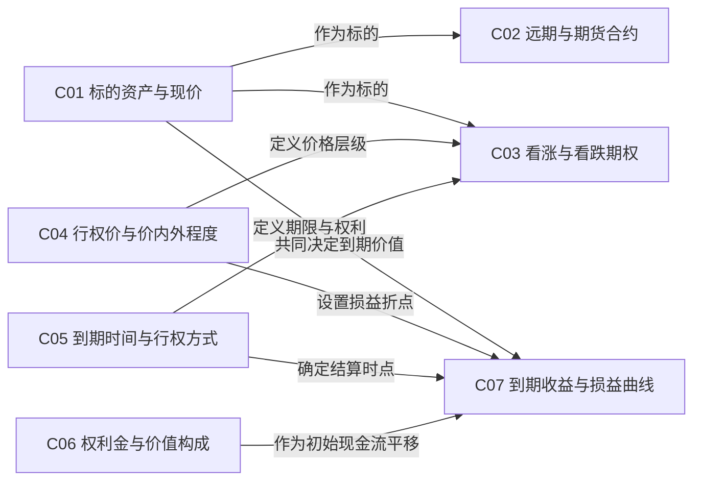

# 第1层：合约与损益语义 / Contracts and Payoffs

> [!question] 交易的究竟是什么？
> 从合约条款、权利金和结算方式还原实际现金流。

## 本层核心概念

- [[C01-标的资产与现价|C01 标的资产与现价]] — 期权与远期价值所依附的资产及其当前可交易价格，通常记为 $S_0$。
- [[C02-远期与期货合约|C02 远期与期货合约]] — 约定在未来日期按约定价格交换标的的线性合约。
- [[C03-看涨与看跌期权|C03 看涨与看跌期权]] — 看涨期权赋予按行权价买入标的的权利，看跌期权赋予卖出标的的权利；买方拥有权利，卖方承担或有义务。
- [[C04-行权价与价内外程度|C04 行权价与价内外程度]] — 行权价 $K$ 是非线性损益的折点；价内外程度描述现价或远期价相对行权价的位置，是偏斜和相对价值比较的坐标。
- [[C05-到期时间与行权方式|C05 到期时间与行权方式]] — 剩余期限决定不确定性累积和时间价值；欧式期权仅到期行权，美式期权可在到期前行权。
- [[C06-权利金与价值构成|C06 权利金与价值构成]] — 权利金是期权的市场成交价格，可分为内在价值与时间价值；它不是理论价值，也不必等于中间价。
- [[C07-到期收益与损益曲线|C07 到期收益与损益曲线]] — 把各腿到期现金流与初始权利金相加，得到头寸在不同到期标的价格下的静态损益形状。

## 本层关系图

## 跨层接口

- [[C10-远期价格与期货基差|C10 远期价格与期货基差]] **—提供无套利交割基准→** [[C02-远期与期货合约|C02 远期与期货合约]]：远期价格把现货和持有成本映射为合约的理论交割价。
- [[C02-远期与期货合约|C02 远期与期货合约]] **—作为指数线性工具→** [[C44-指数期货期权与指数套利|C44 指数期货期权与指数套利]]：指数期货为篮子替代、基差和指数套利提供可交易载体。
- [[C13-结算行权与指派|C13 结算行权与指派]] **—定义履约方式→** [[C03-看涨与看跌期权|C03 看涨与看跌期权]]：结算与指派规则决定期权如何转成现金或头寸。
- [[C13-结算行权与指派|C13 结算行权与指派]] **—转化为实际现金流→** [[C07-到期收益与损益曲线|C07 到期收益与损益曲线]]：结算方式决定最终现金或标的头寸。
- [[C01-标的资产与现价|C01 标的资产与现价]] **—提供现货输入→** [[C10-远期价格与期货基差|C10 远期价格与期货基差]]：远期价格从现货和持有成本出发。
- [[C06-权利金与价值构成|C06 权利金与价值构成]] **—经模型反解为→** [[C17-隐含波动率|C17 隐含波动率]]：市场权利金在给定其他输入后映射成隐含波动率。
- [[C03-看涨与看跌期权|C03 看涨与看跌期权]] **—通过跨行权价组合复制→** [[C45-波动率合约方差掉期与VIX|C45 波动率合约方差掉期与VIX]]：期权条带可近似复制方差暴露。
- [[C05-到期时间与行权方式|C05 到期时间与行权方式]] **—通过时间流逝实现→** [[C28-Theta|C28 Theta]]：剩余期限减少会改变期权价值。
- [[C34-垂直价差与牛熊价差|C34 垂直价差与牛熊价差]] **—塑造有界到期损益→** [[C07-到期收益与损益曲线|C07 到期收益与损益曲线]]：两个执行价限定最大收益与损失。

## 风险经理阅读顺序

1. 先核对条款和结算，再看权利金与到期损益。
2. 把静态损益图与持有期风险分开。
