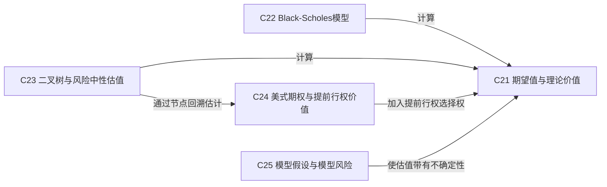

# 第4层：估值模型与模型风险 / Valuation and Model Risk

> [!question] 如何把假设转化为理论价值？
> 比较期望值、Black–Scholes、二叉树和美式期权估值。

## 本层核心概念

- [[C21-期望值与理论价值|C21 期望值与理论价值]] — 理论价值是在一组概率和市场假设下对未来现金流进行风险调整或风险中性贴现得到的模型结果。
- [[C22-Black-Scholes模型|C22 Black-Scholes模型]] — 在连续交易、对数正态扩散及确定利率和波动率等假设下，通过动态复制给出欧式期权价值和 Greeks。
- [[C23-二叉树与风险中性估值|C23 二叉树与风险中性估值]] — 把期限拆成离散节点，在风险中性概率下由未来节点价值向后递推，能自然处理路径节点和提前行权判断。
- [[C24-美式期权与提前行权价值|C24 美式期权与提前行权价值]] — 美式期权在每个可行权时点比较立即行权价值与继续持有价值，其价值至少不低于对应欧式期权。
- [[C25-模型假设与模型风险|C25 模型假设与模型风险]] — 模型风险来自分布、参数、市场摩擦和动态假设与现实不一致，表现为理论价值、Greeks 和对冲结果系统性偏差。

## 本层关系图

## 跨层接口

- [[C14-概率分布|C14 概率分布]] **—提供概率结构→** [[C21-期望值与理论价值|C21 期望值与理论价值]]：理论价值依赖未来状态及其权重。
- [[C14-概率分布|C14 概率分布]] **—假设偏离传导为→** [[C25-模型假设与模型风险|C25 模型假设与模型风险]]：跳空、厚尾与非对称分布会使连续对数正态模型产生结构误差。
- [[C16-波动率预测|C16 波动率预测]] **—提供波动率假设→** [[C22-Black-Scholes模型|C22 Black-Scholes模型]]：预测波动率可作为正向估值输入。
- [[C16-波动率预测|C16 波动率预测]] **—提供波动率假设→** [[C23-二叉树与风险中性估值|C23 二叉树与风险中性估值]]：树模型的节点幅度需要波动率假设。
- [[C22-Black-Scholes模型|C22 Black-Scholes模型]] **—提供反解机制→** [[C17-隐含波动率|C17 隐含波动率]]：隐波是模型依赖的报价坐标。
- [[C20-偏度峰度与隐含分布|C20 偏度峰度与隐含分布]] **—揭示假设偏离→** [[C25-模型假设与模型风险|C25 模型假设与模型风险]]：偏度和峰度说明单一对数正态分布不足。
- [[C22-Black-Scholes模型|C22 Black-Scholes模型]] **—导出局部敏感度→** [[C26-Delta|C26 Delta]]：模型对标的价格求一阶敏感度。
- [[C22-Black-Scholes模型|C22 Black-Scholes模型]] **—导出局部敏感度→** [[C27-Gamma|C27 Gamma]]：模型对标的价格求二阶敏感度。
- [[C22-Black-Scholes模型|C22 Black-Scholes模型]] **—导出局部敏感度→** [[C28-Theta|C28 Theta]]：模型衡量时间流逝的局部影响。
- [[C22-Black-Scholes模型|C22 Black-Scholes模型]] **—导出局部敏感度→** [[C29-Vega|C29 Vega]]：模型衡量波动率输入变化的局部影响。
- [[C22-Black-Scholes模型|C22 Black-Scholes模型]] **—导出局部敏感度→** [[C30-Rho|C30 Rho]]：模型衡量利率输入变化的局部影响。
- [[C23-二叉树与风险中性估值|C23 二叉树与风险中性估值]] **—以节点差分估计→** [[C26-Delta|C26 Delta]]：树上价值变化可估计 Delta。
- [[C23-二叉树与风险中性估值|C23 二叉树与风险中性估值]] **—以节点差分估计→** [[C27-Gamma|C27 Gamma]]：相邻 Delta 变化可估计 Gamma。
- [[C25-模型假设与模型风险|C25 模型假设与模型风险]] **—造成敏感度误差→** [[C32-组合Greeks与头寸分析|C32 组合Greeks与头寸分析]]：模型误设会让组合 Greeks 低估或错配真实风险。

## 风险经理阅读顺序

1. 记录模型输入与假设。
2. 用替代模型和压力情景量化模型误差。
