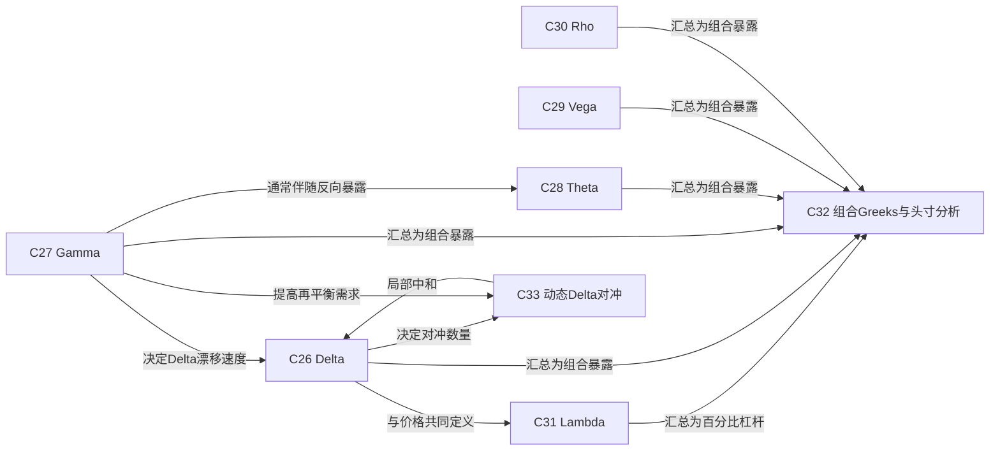

# 第5层：Greeks与动态对冲 / Greeks and Dynamic Hedging

> [!question] 价值变化如何传导到头寸？
> 用局部敏感度汇总风险，并通过再平衡管理方向暴露。

## 本层核心概念

- [[C26-Delta|C26 Delta]] — Delta 衡量期权价值对标的价格的局部一阶敏感度，也常作为等价标的头寸和动态对冲比率。
- [[C27-Gamma|C27 Gamma]] — Gamma 衡量 Delta 对标的价格的变化率，是头寸凸性以及再平衡需求的核心指标。
- [[C28-Theta|C28 Theta]] — Theta 衡量其他条件不变时，日历时间流逝对期权价值的局部影响，通常与 Gamma 暴露形成权衡。
- [[C29-Vega|C29 Vega]] — Vega 衡量模型波动率变化对期权价值的局部敏感度，是隐含波动率头寸的主要尺度。
- [[C30-Rho|C30 Rho]] — Rho 衡量利率变化对期权价值的局部敏感度，在长期限、外汇和融资敏感头寸中更重要。
- [[C31-Lambda|C31 Lambda]] — Lambda 是期权价值对标的百分比变化的弹性，反映单位资本上的方向杠杆。
- [[C32-组合Greeks与头寸分析|C32 组合Greeks与头寸分析]] — 把各合约按数量、乘数和币种汇总为组合风险，并结合情景全重估形成做市账簿的风险视图。
- [[C33-动态Delta对冲|C33 动态Delta对冲]] — 根据模型 Delta 买卖标的并持续再平衡，使头寸在局部保持方向中性，并把价格路径转化为调整现金流。

## 本层关系图

## 跨层接口

- [[C15-历史与已实现波动率|C15 历史与已实现波动率]] **—相对入场隐波决定波动捕获→** [[C33-动态Delta对冲|C33 动态Delta对冲]]：实现路径与入场定价的差异通过再平衡损益体现。
- [[C17-隐含波动率|C17 隐含波动率]] **—设定波动交易盈亏平衡基准→** [[C33-动态Delta对冲|C33 动态Delta对冲]]：入场隐波决定时间价值与预期调整收入的平衡。
- [[C22-Black-Scholes模型|C22 Black-Scholes模型]] **—导出局部敏感度→** [[C26-Delta|C26 Delta]]：模型对标的价格求一阶敏感度。
- [[C22-Black-Scholes模型|C22 Black-Scholes模型]] **—导出局部敏感度→** [[C27-Gamma|C27 Gamma]]：模型对标的价格求二阶敏感度。
- [[C22-Black-Scholes模型|C22 Black-Scholes模型]] **—导出局部敏感度→** [[C28-Theta|C28 Theta]]：模型衡量时间流逝的局部影响。
- [[C22-Black-Scholes模型|C22 Black-Scholes模型]] **—导出局部敏感度→** [[C29-Vega|C29 Vega]]：模型衡量波动率输入变化的局部影响。
- [[C22-Black-Scholes模型|C22 Black-Scholes模型]] **—导出局部敏感度→** [[C30-Rho|C30 Rho]]：模型衡量利率输入变化的局部影响。
- [[C23-二叉树与风险中性估值|C23 二叉树与风险中性估值]] **—以节点差分估计→** [[C26-Delta|C26 Delta]]：树上价值变化可估计 Delta。
- [[C23-二叉树与风险中性估值|C23 二叉树与风险中性估值]] **—以节点差分估计→** [[C27-Gamma|C27 Gamma]]：相邻 Delta 变化可估计 Gamma。
- [[C25-模型假设与模型风险|C25 模型假设与模型风险]] **—造成敏感度误差→** [[C32-组合Greeks与头寸分析|C32 组合Greeks与头寸分析]]：模型误设会让组合 Greeks 低估或错配真实风险。
- [[C05-到期时间与行权方式|C05 到期时间与行权方式]] **—通过时间流逝实现→** [[C28-Theta|C28 Theta]]：剩余期限减少会改变期权价值。
- [[C17-隐含波动率|C17 隐含波动率]] **—变化时经由Vega传导→** [[C29-Vega|C29 Vega]]：隐波平移首先表现为 Vega 损益。
- [[C08-利率与融资成本|C08 利率与融资成本]] **—变化时经由Rho传导→** [[C30-Rho|C30 Rho]]：利率变化影响贴现和远期。
- [[C31-Lambda|C31 Lambda]] **—约束资本与头寸规模→** [[C41-策略选择与调整|C41 策略选择与调整]]：高弹性头寸需与最大损失、保证金和可退出性一起决定规模。
- [[C32-组合Greeks与头寸分析|C32 组合Greeks与头寸分析]] **—约束→** [[C41-策略选择与调整|C41 策略选择与调整]]：组合风险限额决定可选策略、规模和调整。
- [[C33-动态Delta对冲|C33 动态Delta对冲]] **—通过换手产生→** [[C43-流动性执行与结算风险|C43 流动性执行与结算风险]]：每次再平衡消耗价差、费用和市场冲击。
- [[C43-流动性执行与结算风险|C43 流动性执行与结算风险]] **—造成离散对冲误差→** [[C33-动态Delta对冲|C33 动态Delta对冲]]：跳空、滑点和市场关闭使理论对冲无法连续执行。
- [[C34-垂直价差与牛熊价差|C34 垂直价差与牛熊价差]] **—主要形成方向暴露→** [[C26-Delta|C26 Delta]]：垂直价差用有界损益表达看多或看空观点。
- [[C35-跨式与宽跨式|C35 跨式与宽跨式]] **—多头通常形成正凸性→** [[C27-Gamma|C27 Gamma]]：多头跨式和宽跨式受益于大幅运动。
- [[C35-跨式与宽跨式|C35 跨式与宽跨式]] **—多头通常形成正波动率暴露→** [[C29-Vega|C29 Vega]]：隐波上升通常提高多头结构价值。
- [[C35-跨式与宽跨式|C35 跨式与宽跨式]] **—多头通常承担时间衰减→** [[C28-Theta|C28 Theta]]：若运动不足，权利金随时间损耗。
- [[C36-蝶式与鹰式|C36 蝶式与鹰式]] **—表达局部曲率→** [[C27-Gamma|C27 Gamma]]：多执行价结构把 Gamma 集中在特定区间。
- [[C38-比率价差与圣诞树|C38 比率价差与圣诞树]] **—可能形成非对称尾部凸性→** [[C27-Gamma|C27 Gamma]]：不等数量使一侧远端风险突出。
- [[C39-保护性备兑与领式|C39 保护性备兑与领式]] **—变换标的方向风险→** [[C26-Delta|C26 Delta]]：保护、备兑和领式改变组合 Delta。
- [[C34-垂直价差与牛熊价差|C34 垂直价差与牛熊价差]] **—汇总成风险画像→** [[C32-组合Greeks与头寸分析|C32 组合Greeks与头寸分析]]：策略必须还原为组合 Greeks 与情景损益。
- [[C35-跨式与宽跨式|C35 跨式与宽跨式]] **—汇总成风险画像→** [[C32-组合Greeks与头寸分析|C32 组合Greeks与头寸分析]]：波动率策略不能只用名称判断风险。
- [[C36-蝶式与鹰式|C36 蝶式与鹰式]] **—汇总成风险画像→** [[C32-组合Greeks与头寸分析|C32 组合Greeks与头寸分析]]：曲率结构的风险随标的和期限变化。
- [[C37-日历与对角价差|C37 日历与对角价差]] **—汇总成风险画像→** [[C32-组合Greeks与头寸分析|C32 组合Greeks与头寸分析]]：跨期风险需要期限分桶。
- [[C38-比率价差与圣诞树|C38 比率价差与圣诞树]] **—汇总成风险画像→** [[C32-组合Greeks与头寸分析|C32 组合Greeks与头寸分析]]：尾部裸露必须进入全重估情景。
- [[C39-保护性备兑与领式|C39 保护性备兑与领式]] **—汇总成风险画像→** [[C32-组合Greeks与头寸分析|C32 组合Greeks与头寸分析]]：保护头寸仍保留残余方向与波动率风险。
- [[C40-合成与箱式套利|C40 合成与箱式套利]] **—汇总成风险画像→** [[C32-组合Greeks与头寸分析|C32 组合Greeks与头寸分析]]：套利结构也占用融资、保证金和流动性限额。
- [[C45-波动率合约方差掉期与VIX|C45 波动率合约方差掉期与VIX]] **—提供直接波动率暴露→** [[C29-Vega|C29 Vega]]：波动率和方差产品减少逐期权管理但仍有波动率敏感度。

## 风险经理阅读顺序

1. 统一单位后汇总 Greeks。
2. 用全重估情景检查局部近似和动态对冲失效。
