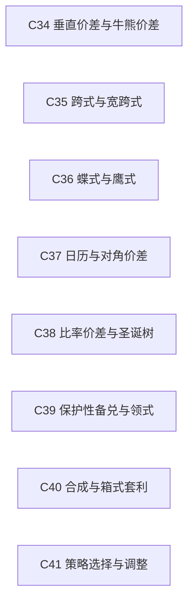

# 第6层：策略与风险形状 / Strategies and Risk Shapes

> [!question] 如何组合合约得到目标暴露？
> 按方向、凸性、期限、偏斜和保护需求组织策略。

## 本层核心概念

- [[C34-垂直价差与牛熊价差|C34 垂直价差与牛熊价差]] — 同到期、不同执行价期权的多空组合，用有限成本换取有界方向性收益。
- [[C35-跨式与宽跨式|C35 跨式与宽跨式]] — 同时持有相同或不同执行价的看涨和看跌，主要表达实际波动相对入场隐含波动的观点。
- [[C36-蝶式与鹰式|C36 蝶式与鹰式]] — 由多个执行价构造的局部曲率头寸，可表达到期价格区间、偏斜曲率或中间执行价相对价值。
- [[C37-日历与对角价差|C37 日历与对角价差]] — 使用不同到期、必要时也使用不同执行价的期权，交易期限结构、远期波动率和不同期限时间衰减。
- [[C38-比率价差与圣诞树|C38 比率价差与圣诞树]] — 以不等数量组合不同执行价期权，形成非对称、通常带尾部暴露的损益与 Greeks 形状。
- [[C39-保护性备兑与领式|C39 保护性备兑与领式]] — 保护性看跌为多头标的设置下行地板，备兑看涨用上行权利换取权利金，领式把两者组合成区间保护。
- [[C40-合成与箱式套利|C40 合成与箱式套利]] — 利用看涨看跌平价把期权组合复制为标的、债券或固定到期现金流，并交易相对价格偏离。
- [[C41-策略选择与调整|C41 策略选择与调整]] — 在预期收益、Greeks、尾部情景、流动性和风险承受能力之间选择头寸，并随市场变化调整，而非仅追求最大理论优势。

## 本层关系图

## 跨层接口

- [[C12-看涨看跌平价与合成头寸|C12 看涨看跌平价与合成头寸]] **—提供复制恒等式→** [[C40-合成与箱式套利|C40 合成与箱式套利]]：合成和箱式结构由平价关系构造。
- [[C11-无套利定价与套利边界|C11 无套利定价与套利边界]] **—偏离时触发→** [[C40-合成与箱式套利|C40 合成与箱式套利]]：只有可执行价格越过成本调整后的边界才形成套利机会。
- [[C43-流动性执行与结算风险|C43 流动性执行与结算风险]] **—把恒等式转成实施风险→** [[C40-合成与箱式套利|C40 合成与箱式套利]]：多腿成交、融资和结算会破坏理论锁定。
- [[C18-期限结构与远期波动率|C18 期限结构与远期波动率]] **—提供期限相对价值维度→** [[C37-日历与对角价差|C37 日历与对角价差]]：日历和对角价差交易不同区间的总方差。
- [[C19-波动率偏斜与曲面|C19 波动率偏斜与曲面]] **—提供跨行权价相对价值维度→** [[C36-蝶式与鹰式|C36 蝶式与鹰式]]：蝶式和鹰式对曲面曲率敏感。
- [[C19-波动率偏斜与曲面|C19 波动率偏斜与曲面]] **—提供尾部定价维度→** [[C38-比率价差与圣诞树|C38 比率价差与圣诞树]]：比率结构常暴露于远端偏斜。
- [[C39-保护性备兑与领式|C39 保护性备兑与领式]] **—通过对冲供需塑造→** [[C19-波动率偏斜与曲面|C19 波动率偏斜与曲面]]：保护性看跌买盘和备兑看涨供给影响股票偏斜。
- [[C31-Lambda|C31 Lambda]] **—约束资本与头寸规模→** [[C41-策略选择与调整|C41 策略选择与调整]]：高弹性头寸需与最大损失、保证金和可退出性一起决定规模。
- [[C32-组合Greeks与头寸分析|C32 组合Greeks与头寸分析]] **—约束→** [[C41-策略选择与调整|C41 策略选择与调整]]：组合风险限额决定可选策略、规模和调整。
- [[C34-垂直价差与牛熊价差|C34 垂直价差与牛熊价差]] **—主要形成方向暴露→** [[C26-Delta|C26 Delta]]：垂直价差用有界损益表达看多或看空观点。
- [[C34-垂直价差与牛熊价差|C34 垂直价差与牛熊价差]] **—塑造有界到期损益→** [[C07-到期收益与损益曲线|C07 到期收益与损益曲线]]：两个执行价限定最大收益与损失。
- [[C35-跨式与宽跨式|C35 跨式与宽跨式]] **—多头通常形成正凸性→** [[C27-Gamma|C27 Gamma]]：多头跨式和宽跨式受益于大幅运动。
- [[C35-跨式与宽跨式|C35 跨式与宽跨式]] **—多头通常形成正波动率暴露→** [[C29-Vega|C29 Vega]]：隐波上升通常提高多头结构价值。
- [[C35-跨式与宽跨式|C35 跨式与宽跨式]] **—多头通常承担时间衰减→** [[C28-Theta|C28 Theta]]：若运动不足，权利金随时间损耗。
- [[C36-蝶式与鹰式|C36 蝶式与鹰式]] **—表达局部曲率→** [[C27-Gamma|C27 Gamma]]：多执行价结构把 Gamma 集中在特定区间。
- [[C37-日历与对角价差|C37 日历与对角价差]] **—交易期限结构→** [[C18-期限结构与远期波动率|C18 期限结构与远期波动率]]：不同到期腿比较不同区间总方差。
- [[C38-比率价差与圣诞树|C38 比率价差与圣诞树]] **—可能形成非对称尾部凸性→** [[C27-Gamma|C27 Gamma]]：不等数量使一侧远端风险突出。
- [[C39-保护性备兑与领式|C39 保护性备兑与领式]] **—变换标的方向风险→** [[C26-Delta|C26 Delta]]：保护、备兑和领式改变组合 Delta。
- [[C40-合成与箱式套利|C40 合成与箱式套利]] **—承担多腿执行风险→** [[C43-流动性执行与结算风险|C43 流动性执行与结算风险]]：理论锁定仍依赖同时成交和持仓能力。
- [[C34-垂直价差与牛熊价差|C34 垂直价差与牛熊价差]] **—汇总成风险画像→** [[C32-组合Greeks与头寸分析|C32 组合Greeks与头寸分析]]：策略必须还原为组合 Greeks 与情景损益。
- [[C35-跨式与宽跨式|C35 跨式与宽跨式]] **—汇总成风险画像→** [[C32-组合Greeks与头寸分析|C32 组合Greeks与头寸分析]]：波动率策略不能只用名称判断风险。
- [[C36-蝶式与鹰式|C36 蝶式与鹰式]] **—汇总成风险画像→** [[C32-组合Greeks与头寸分析|C32 组合Greeks与头寸分析]]：曲率结构的风险随标的和期限变化。
- [[C37-日历与对角价差|C37 日历与对角价差]] **—汇总成风险画像→** [[C32-组合Greeks与头寸分析|C32 组合Greeks与头寸分析]]：跨期风险需要期限分桶。
- [[C38-比率价差与圣诞树|C38 比率价差与圣诞树]] **—汇总成风险画像→** [[C32-组合Greeks与头寸分析|C32 组合Greeks与头寸分析]]：尾部裸露必须进入全重估情景。
- [[C39-保护性备兑与领式|C39 保护性备兑与领式]] **—汇总成风险画像→** [[C32-组合Greeks与头寸分析|C32 组合Greeks与头寸分析]]：保护头寸仍保留残余方向与波动率风险。
- [[C40-合成与箱式套利|C40 合成与箱式套利]] **—汇总成风险画像→** [[C32-组合Greeks与头寸分析|C32 组合Greeks与头寸分析]]：套利结构也占用融资、保证金和流动性限额。
- [[C43-流动性执行与结算风险|C43 流动性执行与结算风险]] **—限制可交易性→** [[C41-策略选择与调整|C41 策略选择与调整]]：成本和深度决定理论策略能否实施。
- [[C42-提前行权指派与钉住风险|C42 提前行权指派与钉住风险]] **—施加事件约束→** [[C41-策略选择与调整|C41 策略选择与调整]]：临近到期和除息时策略可能被指派拆解。

## 风险经理阅读顺序

1. 把策略名称还原成腿、Greeks 和到期损益。
2. 用成本、尾部和调整规则筛选策略。
