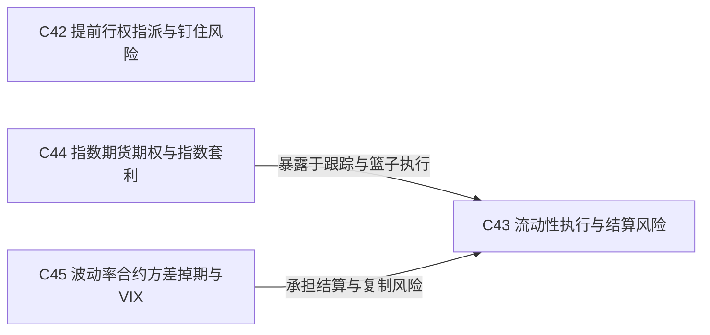

# 第7层：市场实施与专门产品 / Implementation and Products

> [!question] 现实市场如何改变理论结果？
> 纳入事件、流动性、执行、指数和波动率产品风险。

## 本层核心概念

- [[提前行权指派与钉住风险|C42 提前行权指派与钉住风险]] — 美式持有人可能提前行权，卖方可能被指派；临近执行价到期时，最终标的头寸和指派数量可能不确定。
- [[流动性执行与结算风险|C43 流动性执行与结算风险]] — 买卖价差、冲击成本、费用、保证金、腿风险和结算规则决定理论优势能否转化为可实现利润。
- [[指数期货期权与指数套利|C44 指数期货期权与指数套利]] — 指数产品把成分股篮子风险转化为期货和期权暴露，期货公允价值、篮子复制和指数基差构成指数套利框架。
- [[波动率合约方差掉期与VIX|C45 波动率合约方差掉期与VIX]] — 已实现波动率或方差合约直接按观察期结果结算；VIX 及其期货期权提供基于期权条带的隐含波动率暴露。

## 本层关系图

## 跨层接口

- [[远期与期货合约|C02 远期与期货合约]] **—作为指数线性工具→** [[指数期货期权与指数套利|C44 指数期货期权与指数套利]]：指数期货为篮子替代、基差和指数套利提供可交易载体。
- [[结算行权与指派|C13 结算行权与指派]] **—产生事件风险→** [[提前行权指派与钉住风险|C42 提前行权指派与钉住风险]]：指派和结算时点造成不确定头寸。
- [[利率与融资成本|C08 利率与融资成本]] **—改变机会成本→** [[提前行权指派与钉住风险|C42 提前行权指派与钉住风险]]：利率改变提前支付行权价的成本。
- [[股息与持有成本|C09 股息与持有成本]] **—改变持有收益→** [[提前行权指派与钉住风险|C42 提前行权指派与钉住风险]]：除息事件可能改变看涨期权提前行权判断。
- [[流动性执行与结算风险|C43 流动性执行与结算风险]] **—放宽可执行边界→** [[无套利定价与套利边界|C11 无套利定价与套利边界]]：摩擦使小幅理论偏离无法锁定利润。
- [[流动性执行与结算风险|C43 流动性执行与结算风险]] **—把恒等式转成实施风险→** [[合成与箱式套利|C40 合成与箱式套利]]：多腿成交、融资和结算会破坏理论锁定。
- [[历史与已实现波动率|C15 历史与已实现波动率]] **—作为结算基础→** [[波动率合约方差掉期与VIX|C45 波动率合约方差掉期与VIX]]：已实现波动率或方差合约按观察结果结算。
- [[隐含波动率（Natenberg）|C17 隐含波动率]] **—作为定价基础→** [[波动率合约方差掉期与VIX|C45 波动率合约方差掉期与VIX]]：VIX 及隐含波动率产品来自期权价格。
- [[看涨与看跌期权|C03 看涨与看跌期权]] **—通过跨行权价组合复制→** [[波动率合约方差掉期与VIX|C45 波动率合约方差掉期与VIX]]：期权条带可近似复制方差暴露。
- [[动态Delta对冲（Natenberg）|C33 动态Delta对冲]] **—通过换手产生→** [[流动性执行与结算风险|C43 流动性执行与结算风险]]：每次再平衡消耗价差、费用和市场冲击。
- [[流动性执行与结算风险|C43 流动性执行与结算风险]] **—造成离散对冲误差→** [[动态Delta对冲（Natenberg）|C33 动态Delta对冲]]：跳空、滑点和市场关闭使理论对冲无法连续执行。
- [[合成与箱式套利|C40 合成与箱式套利]] **—承担多腿执行风险→** [[流动性执行与结算风险|C43 流动性执行与结算风险]]：理论锁定仍依赖同时成交和持仓能力。
- [[流动性执行与结算风险|C43 流动性执行与结算风险]] **—限制可交易性→** [[策略选择与调整|C41 策略选择与调整]]：成本和深度决定理论策略能否实施。
- [[提前行权指派与钉住风险|C42 提前行权指派与钉住风险]] **—施加事件约束→** [[策略选择与调整|C41 策略选择与调整]]：临近到期和除息时策略可能被指派拆解。
- [[远期价格与期货基差|C10 远期价格与期货基差]] **—提供基差框架→** [[指数期货期权与指数套利|C44 指数期货期权与指数套利]]：指数期货公允价值来自现货、融资和股息。
- [[无套利定价与套利边界|C11 无套利定价与套利边界]] **—约束指数相对价格→** [[指数期货期权与指数套利|C44 指数期货期权与指数套利]]：篮子、期货和指数期权由复制关系联系。
- [[波动率合约方差掉期与VIX|C45 波动率合约方差掉期与VIX]] **—提供直接波动率暴露→** [[Vega（Natenberg）|C29 Vega]]：波动率和方差产品减少逐期权管理但仍有波动率敏感度。
- [[期限结构与远期波动率|C18 期限结构与远期波动率]] **—塑造期货期限结构→** [[波动率合约方差掉期与VIX|C45 波动率合约方差掉期与VIX]]：VIX 期货反映不同到期的波动率定价。

## 风险经理阅读顺序

1. 用真实成交和结算规则重算理论优势。
2. 为事件、流动性和不可复制风险设置独立限额。
