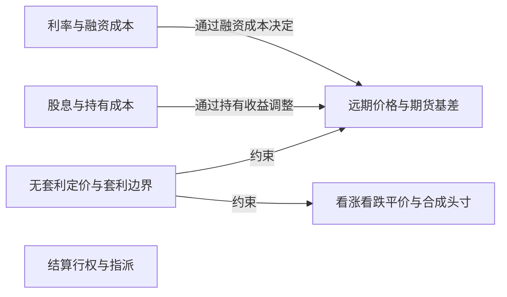

# 第2层：无套利与持有成本 / No-Arbitrage and Carry

> [!question] 不同合约价格为什么互相约束？
> 用融资、股息、远期价格和平价关系建立相对价格边界。

## 本层核心概念

- [[利率与融资成本|利率与融资成本]] — 资金的时间价值影响远期价格、期权现值、持仓融资以及提前行权机会成本；实际融资常与无风险利率不对称。
- [[股息与持有成本|股息与持有成本]] — 股息或持有收益降低持有标的的净成本，并改变远期价格、看涨看跌相对价值和美式行权边界。
- [[远期价格与期货基差|远期价格与期货基差]] — 远期价格是无套利持有成本关系给出的未来交割价格；本书将基差定义为现货价格减去远期或期货价格，它不是对未来现货价格的预测。
- [[无套利定价与套利边界|无套利定价与套利边界]] — 如果两组未来现金流相同，其当前价格在可执行市场中应一致；边界刻画期权价格不能长期越过的范围。
- [[看涨看跌平价与合成头寸|看涨看跌平价与合成头寸]] — 同一标的、行权价和期限的看涨、看跌、标的及债券可通过现金流复制互相转换，是合成头寸和套利的核心恒等关系。
- [[结算行权与指派|结算行权与指派]] — 行权把期权权利转成现金、标的或期货头寸；指派把对应义务分配给卖方，结算规则决定最终风险落点。

## 本层关系图

## 跨层接口

- [[远期价格与期货基差|远期价格与期货基差]] **—提供无套利交割基准→** [[远期与期货合约|远期与期货合约]]：远期价格把现货和持有成本映射为合约的理论交割价。
- [[结算行权与指派|结算行权与指派]] **—定义履约方式→** [[看涨与看跌期权|看涨与看跌期权]]：结算与指派规则决定期权如何转成现金或头寸。
- [[结算行权与指派|结算行权与指派]] **—转化为实际现金流→** [[到期收益与损益曲线|到期收益与损益曲线]]：结算方式决定最终现金或标的头寸。
- [[标的资产与现价|标的资产与现价]] **—提供现货输入→** [[远期价格与期货基差|远期价格与期货基差]]：远期价格从现货和持有成本出发。
- [[看涨看跌平价与合成头寸|看涨看跌平价与合成头寸]] **—提供复制恒等式→** [[合成与箱式套利|合成与箱式套利]]：合成和箱式结构由平价关系构造。
- [[无套利定价与套利边界|无套利定价与套利边界]] **—偏离时触发→** [[合成与箱式套利|合成与箱式套利]]：只有可执行价格越过成本调整后的边界才形成套利机会。
- [[结算行权与指派|结算行权与指派]] **—产生事件风险→** [[提前行权指派与钉住风险|提前行权指派与钉住风险]]：指派和结算时点造成不确定头寸。
- [[利率与融资成本|利率与融资成本]] **—改变机会成本→** [[提前行权指派与钉住风险|提前行权指派与钉住风险]]：利率改变提前支付行权价的成本。
- [[股息与持有成本|股息与持有成本]] **—改变持有收益→** [[提前行权指派与钉住风险|提前行权指派与钉住风险]]：除息事件可能改变看涨期权提前行权判断。
- [[流动性执行与结算风险|流动性执行与结算风险]] **—放宽可执行边界→** [[无套利定价与套利边界|无套利定价与套利边界]]：摩擦使小幅理论偏离无法锁定利润。
- [[利率与融资成本|利率与融资成本]] **—变化时经由Rho传导→** [[Rho|Rho]]：利率变化影响贴现和远期。
- [[远期价格与期货基差|远期价格与期货基差]] **—提供基差框架→** [[指数期货期权与指数套利|指数期货期权与指数套利]]：指数期货公允价值来自现货、融资和股息。
- [[无套利定价与套利边界|无套利定价与套利边界]] **—约束指数相对价格→** [[指数期货期权与指数套利|指数期货期权与指数套利]]：篮子、期货和指数期权由复制关系联系。

## 风险经理阅读顺序

1. 先建立可交易的远期和融资基准。
2. 再判断平价偏离是否覆盖全部实施成本。
