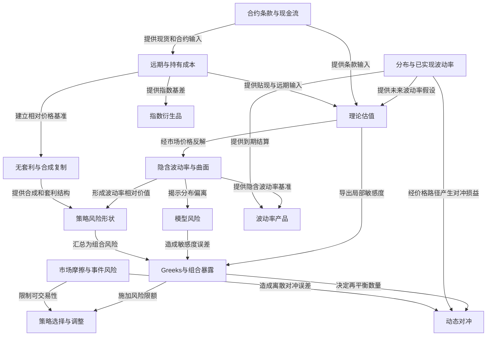

# 期权知识图谱 / Option Knowledge Graph

> [!abstract] 使用方法
> 这不是章节目录，而是从合约定义到风险落地的因果地图。先选择一个层级，再沿带有关系动词的概念链接向上追溯输入、向下追踪风险传导。
> 全图包含 7 个知识层、45 个核心概念和 102 条语义关系；封面、版权、献词、作者、导航与审计文件不进入本网络。

> [!tip] Obsidian 局部关系图
> 打开本页的“局部关系图”，在搜索过滤器输入 `path:"Option Volatility and Pricing 双语版/知识图谱"`：深度 2 显示“总图 → 知识层 → 概念”。概念页中的“主要章节”可直接跳转到教材；封面、版权、导航和审计页不会进入该过滤结果。

## 七层入口

1. [[合约与损益语义|合约与损益语义 / Contracts and Payoffs]] — 交易的究竟是什么？
2. [[无套利与持有成本|无套利与持有成本 / No-Arbitrage and Carry]] — 不同合约价格为什么互相约束？
3. [[概率分布与波动率|概率分布与波动率 / Distributions and Volatility]] — 不确定性如何观察、预测和交易？
4. [[估值模型与模型风险|估值模型与模型风险 / Valuation and Model Risk]] — 如何把假设转化为理论价值？
5. [[Greeks与动态对冲|Greeks与动态对冲 / Greeks and Dynamic Hedging]] — 价值变化如何传导到头寸？
6. [[策略与风险形状|策略与风险形状 / Strategies and Risk Shapes]] — 如何组合合约得到目标暴露？
7. [[市场实施与专门产品|市场实施与专门产品 / Implementation and Products]] — 现实市场如何改变理论结果？

## 主因果图

## 六条风险传导主链

1. 现货、利率与股息 → 远期价格 → 无套利边界 → 平价与合成 → 套利实施。
2. 概率分布与波动率预测 → 估值模型 → 理论价值 → 市场价格差异 → 策略。
3. 市场权利金与模型 → 隐含波动率 → 期限结构与偏斜 → 相对价值策略。
4. 标的变动 → Delta → Gamma 导致 Delta 漂移 → 动态再对冲 → 对冲损益。
5. 隐含波动率变化 → Vega → 组合风险 → 波动率价差与调整。
6. 模型假设失效 → Greeks 偏差 → 离散对冲误差 → 流动性和执行损失。

## 曲面因子与主要策略表达

| 曲面因子 | 主要策略表达 | 核心风险传导 | 不能忽略的剩余风险 |
|---|---|---|---|
| 整体水平 Level | 跨式、宽跨式、Delta 对冲期权组合 | Vega → 盯市损益；Gamma → 再平衡损益 | Theta、实现波动率、交易成本 |
| 偏斜 Skew | 比率价差、风险逆转、保护性结构 | 翼部隐波 → 非对称 Vega/Gamma | 尾部跳空、翼部流动性 |
| 曲率 Curvature | 蝶式、鹰式 | 中间与翼部相对价值 → 局部 Gamma | 厚尾、插值和多腿成交 |
| 期限结构 Term | 日历价差、对角价差 | 总方差差额 → 远期波动率 | 近月 Gamma/Theta、事件日、展期 |
| 已实现方差 | Delta 对冲跨式、方差/波动率合约 | 价格路径 → 调整现金流或结算 | 采样频率、跳空、复制误差 |

## 组合损益归因骨架

$$
\Delta V \approx \Delta\,\Delta S + \frac{1}{2}\Gamma(\Delta S)^2 + \Theta\,\Delta t + \mathrm{Vega}\,\Delta\sigma + \rho\,\Delta r - TC + \varepsilon
$$

其中 $TC$ 是价差、手续费与市场冲击，$\varepsilon$ 是模型、曲面、跳空、离散对冲和数据误差等无法解释残差。

> [!warning] 解释边界
> 远期价格不是未来现货预测；隐含波动率不决定未来已实现波动率；Delta 中性也不等于无风险。
