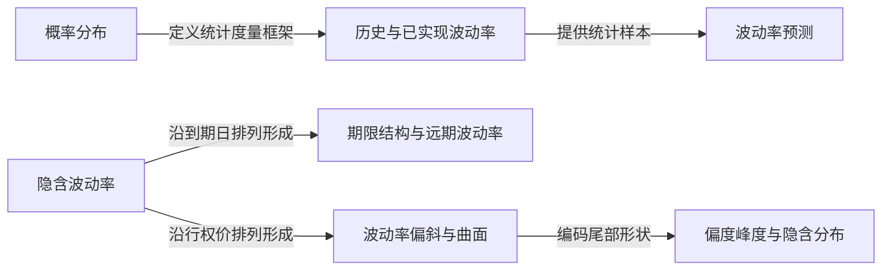

# 概率分布与波动率 / Distributions and Volatility

> [!question] 不确定性如何观察、预测和交易？
> 区分已实现、预测与隐含波动率，并理解期限结构和偏斜。

## 本层核心概念

- [[概率分布|概率分布]] — 概率分布描述未来价格或收益的可能范围；经典模型常从随机游走、正态收益或对数正态价格出发。
- [[历史与已实现波动率|历史与已实现波动率]] — 历史波动率由过去收益估计，已实现波动率描述指定观察期实际发生的价格变化；二者都依赖采样与年化规则。
- [[波动率预测|波动率预测]] — 利用历史特征、制度信息和市场状态估计未来持有期可能实现的波动率，预测值是交易观点而非可观察事实。
- [[隐含波动率（Natenberg）|隐含波动率]] — 在给定模型及其他输入后，使模型价格等于市场权利金的波动率参数；它是价格的模型化表达，不等于未来已实现波动率。
- [[期限结构与远期波动率|期限结构与远期波动率]] — 不同到期的隐含波动率构成期限结构；远期波动率是由两个期限的总方差差额推导出的未来区间波动率。
- [[波动率偏斜与曲面|波动率偏斜与曲面]] — 隐含波动率随行权价和期限变化形成偏斜、微笑及完整曲面，反映尾部定价、供需和模型局限。
- [[偏度峰度与隐含分布|偏度峰度与隐含分布]] — 偏度刻画分布非对称性，峰度刻画尾部与尖峭程度；期权跨行权价价格可反推出风险中性隐含分布。

## 本层关系图

## 跨层接口

- [[概率分布|概率分布]] **—提供概率结构→** [[期望值与理论价值|期望值与理论价值]]：理论价值依赖未来状态及其权重。
- [[概率分布|概率分布]] **—假设偏离传导为→** [[模型假设与模型风险|模型假设与模型风险]]：跳空、厚尾与非对称分布会使连续对数正态模型产生结构误差。
- [[波动率预测|波动率预测]] **—提供波动率假设→** [[Black-Scholes模型|Black-Scholes模型]]：预测波动率可作为正向估值输入。
- [[波动率预测|波动率预测]] **—提供波动率假设→** [[二叉树与风险中性估值|二叉树与风险中性估值]]：树模型的节点幅度需要波动率假设。
- [[权利金与价值构成|权利金与价值构成]] **—经模型反解为→** [[隐含波动率（Natenberg）|隐含波动率]]：市场权利金在给定其他输入后映射成隐含波动率。
- [[Black-Scholes模型|Black-Scholes模型]] **—提供反解机制→** [[隐含波动率（Natenberg）|隐含波动率]]：隐波是模型依赖的报价坐标。
- [[偏度峰度与隐含分布|偏度峰度与隐含分布]] **—揭示假设偏离→** [[模型假设与模型风险|模型假设与模型风险]]：偏度和峰度说明单一对数正态分布不足。
- [[历史与已实现波动率|历史与已实现波动率]] **—相对入场隐波决定波动捕获→** [[动态Delta对冲（Natenberg）|动态Delta对冲]]：实现路径与入场定价的差异通过再平衡损益体现。
- [[隐含波动率（Natenberg）|隐含波动率]] **—设定波动交易盈亏平衡基准→** [[动态Delta对冲（Natenberg）|动态Delta对冲]]：入场隐波决定时间价值与预期调整收入的平衡。
- [[期限结构与远期波动率|期限结构与远期波动率]] **—提供期限相对价值维度→** [[日历与对角价差|日历与对角价差]]：日历和对角价差交易不同区间的总方差。
- [[波动率偏斜与曲面|波动率偏斜与曲面]] **—提供跨行权价相对价值维度→** [[蝶式与鹰式|蝶式与鹰式]]：蝶式和鹰式对曲面曲率敏感。
- [[波动率偏斜与曲面|波动率偏斜与曲面]] **—提供尾部定价维度→** [[比率价差与圣诞树|比率价差与圣诞树]]：比率结构常暴露于远端偏斜。
- [[保护性备兑与领式|保护性备兑与领式]] **—通过对冲供需塑造→** [[波动率偏斜与曲面|波动率偏斜与曲面]]：保护性看跌买盘和备兑看涨供给影响股票偏斜。
- [[历史与已实现波动率|历史与已实现波动率]] **—作为结算基础→** [[波动率合约方差掉期与VIX|波动率合约方差掉期与VIX]]：已实现波动率或方差合约按观察结果结算。
- [[隐含波动率（Natenberg）|隐含波动率]] **—作为定价基础→** [[波动率合约方差掉期与VIX|波动率合约方差掉期与VIX]]：VIX 及隐含波动率产品来自期权价格。
- [[隐含波动率（Natenberg）|隐含波动率]] **—变化时经由Vega传导→** [[Vega（Natenberg）|Vega]]：隐波平移首先表现为 Vega 损益。
- [[日历与对角价差|日历与对角价差]] **—交易期限结构→** [[期限结构与远期波动率|期限结构与远期波动率]]：不同到期腿比较不同区间总方差。
- [[期限结构与远期波动率|期限结构与远期波动率]] **—塑造期货期限结构→** [[波动率合约方差掉期与VIX|波动率合约方差掉期与VIX]]：VIX 期货反映不同到期的波动率定价。

## 风险经理阅读顺序

1. 严格区分历史、未来实现、预测和隐含波动率。
2. 再沿期限与行权价两个维度检查曲面。
