# 美式期权的提前行权 / Early Exercise of American Options

[[阅读导航|← 返回阅读导航]]

> [!warning] 翻译状态
> 本章双语稿已生成，尚待逐段人工复核。英文原文、数字、公式和图表保留用于核对。

<!-- chapter-toc:start -->
## 本章目录 / Chapter Outline

> [!abstract] 结构导航
> 以下标题按原书顺序保留；点击可直接跳转。

- [[#套利边界 / Arbitrage Boundaries|套利边界 / Arbitrage Boundaries]]
- [[#股票看涨期权的提前行权 / Early Exercise of Call Options on stock|股票看涨期权的提前行权 / Early Exercise of Call Options on stock]]
- [[#股票看跌期权的提前行权 / Early Exercise of Put Options on stock|股票看跌期权的提前行权 / Early Exercise of Put Options on stock]]
- [[#股票空头对提前行权的影响 / Impact of Short Stock on Early Exercise|股票空头对提前行权的影响 / Impact of Short Stock on Early Exercise]]
- [[#期货期权的提前行权 / Early Exercise of Options on Futures|期货期权的提前行权 / Early Exercise of Options on Futures]]
- [[#保护价值与提前行权 / Protective Value and Early Exercise|保护价值与提前行权 / Protective Value and Early Exercise]]
- [[#美式期权定价 / Pricing of American Options|美式期权定价 / Pricing of American Options]]
- [[#提前行权策略 / Early Exercise Strategies|提前行权策略 / Early Exercise Strategies]]
- [[#提前行权风险 / Early Exercise Risk|提前行权风险 / Early Exercise Risk]]
<!-- chapter-toc:end -->
<!-- chapter-nav:start -->
> [!tip] 章节导航（章首）
> [[期权套利 Option Arbitrage|← 上一章]] · [[阅读导航|全书导航]] · [[使用期权进行对冲 Hedging with Options|下一章 →]]
<!-- chapter-nav:end -->
<!-- source:block 4ebaaaa1cc8a9f68 -->

> [!quote]- English 1
> Thus far we have assumed that all option strategies involve holding a position to expiration. Because many exchange-traded options are American, carrying with them the right of early exercise, it will be worthwhile to consider some of the characteristics of American options. Specifically, we will want to answer three questions:

到目前为止，我们假设所有期权策略都涉及持有头寸至到期。由于许多交易所交易的期权是美式期权，具有提前行权的权利，因此值得考虑美式期权的一些特征。具体来说，我们想回答三个问题：

<!-- source:block b0ce09f0451e84d9 -->

> [!quote]- English 2
> 1. Under what circumstances might a trader consider exercising an American option prior to expiration?

1.在什么情况下，交易者可以考虑在到期前行权美式期权？

<!-- source:block bf8d08050a7a79c9 -->

> [!quote]- English 3
> 2. If early exercise is deemed desirable, is there an optimal time to do so?

2.如果认为提前行权是可取的，那么是否有最佳时间？

<!-- source:block c226d2b24d948667 -->

> [!quote]- English 4
> 3. How much more should a trader be willing to pay for an American option over an equivalent European option?

3.交易者愿意为美式期权支付多少钱，而不是同等的欧洲期权？

<!-- source:block 690a72cea3357c4f -->

> [!quote]- English 5
> In order for early exercise to be desirable, there must be some advantage to holding a position in the underlying contract rather than a position in the option contract. This advantage can come in the form of dividends that the owner of stock will receive or in the form of a positive cash flow on which interest can be earned. If there are no dividend or interest considerations, there is no value to early exercise. In that case,

为了希望尽早行权，持有标的合约中的头寸而不是期权合约中的头寸必须有一些优势。这种优势可以是股票所有者将获得的股息的形式，也可以是可以赚取利息的正现金流的形式。如果没有股息或利息考虑，提前行权就没有价值。在这种情况下，

<!-- source:block 7267c3d5fb683ddf -->

> [!quote]- English 6
> value of an American option = value of a European option

$$
\text{value of an American option} = \text{value of a European option}
$$

<!-- source:block 976c48a51294916e -->

> [!quote]- English 7
> This is generally true for options on futures traded on exchanges outside the United States, where the options are subject to futures-type settlement. Futures contracts do not pay dividends, and no cash flow takes place when either the underlying futures contract or options on that contract are traded. Even though the options may be American, there is effectively no early exercise value associated with such options.

对于在美国境外交易所交易的期货期权来说，情况通常如此，这些期权须接受期货型结算。期货合约不支付股息，当标的期货合约或该合约上的期权交易时，也不会产生现金流。尽管期权可能是美式期权，但此类期权实际上没有任何早期行权价值。

<!-- source:block 460d78a87ca5ca88 -->

## 套利边界 / Arbitrage Boundaries

<!-- source:block 6cd2b0e8fbaf363f -->

> [!quote]- English 8
> When evaluating a contract, a trader might try to determine an *arbitrage boundary* for that contract—the lowest price (the lower arbitrage boundary) or highest price (the upper arbitrage boundary) at which the contract can trade without there being some arbitrage opportunity. Identifying the arbitrage boundaries for European and American options can help us understand the early exercise criteria for American options.

在评估合约时，交易员可能会尝试确定该合约的套利边界-合约在没有套利机会的情况下可以交易的最低价格（套利下限）或最高价格（套利上限）。确定欧美期权的套利边界可以帮助我们了解美式期权的早期行权标准。

<!-- source:block 1a8fe361209b9bc4 -->

> [!quote]- English 9
> Consider these prices:

考虑这些价格：

<!-- source:block c6cb023a9044a588 -->

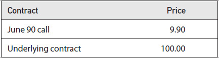

<!-- source:block 107d37e133e434d0 -->

> [!quote]- English 10
> If the June 90 call is American, everyone will want to buy the call for 9.90, sell the underlying contract for 100.00, and immediately exercise the option. The resulting cash flow will be

如果6 月到期、行权价为 90 的看涨期权是美国的，那么每个人都会想以9.90的价格购买看涨期权，以100.00的价格出售标的合约，并立即行权期权。由此产生的现金流将是

<!-- source:block 9158fe7e622a4cc9 -->

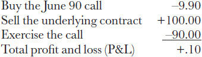

<!-- 原 EPUB 中此公式为图片，已原样保留 -->

<!-- source:block 0e161ac1cf142041 -->

> [!quote]- English 11
> There is an arbitrage profit of 0.10.

套利利润为0.10。

<!-- source:block 470d967f94404415 -->

> [!quote]- English 12
> Now consider these prices:

现在考虑这些价格：

<!-- source:block f32a68538070d1ee -->

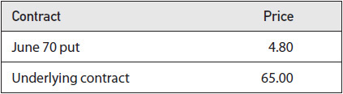

<!-- 原 EPUB 中此公式为图片，已原样保留 -->

<!-- source:block 2d08d038d18dc873 -->

> [!quote]- English 13
> If the June 70 put is American, everyone will want to buy the put for 4.80, buy the underlying contract for 65.00, and immediately exercise the option. The resulting cash flow will be

如果6 月到期、行权价为 70 的看跌期权是美国的，每个人都会想以4.80美元的价格买入看跌期权，以65.00美元的价格买入标的合约，并立即行权期权。由此产生的现金流将是

<!-- source:block d51aa22d3a84a338 -->

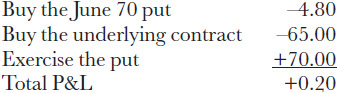

<!-- 原 EPUB 中此公式为图片，已原样保留 -->

<!-- source:block 1145829b49d5be31 -->

> [!quote]- English 14
> There is an arbitrage profit of 0.20.

套利利润为0.20。

<!-- source:block 77289f24306dd61b -->

> [!quote]- English 15
> We can conclude from these examples that an American option should never trade for less than intrinsic value. If it does, everyone will buy the option, hedge the position with the underlying contract, and exercise the option, all of which will result in an immediate arbitrage profit. We can express the lower arbitrage boundary for an American option as

我们可以从这些例子中得出结论，美式期权的交易价格永远不应低于内在价值。如果确实如此，每个人都会购买期权，用标的合约对冲头寸，然后行权期权，所有这些都将立即产生套利利润。我们可以将美式期权的套利下限表示为

<!-- source:block d0398af12b1210dc -->

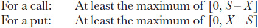

<!-- 原 EPUB 中此公式为图片，已原样保留 -->

<!-- source:block 19e6a0ac2aa2b612 -->

> [!quote]- English 16
> where *X* is the exercise price, and *S* is the price of the underlying contract.

其中X是行权价，S是标的合约的价格。

<!-- source:block 295942a28bf6a2e4 -->

> [!quote]- English 17
> We have included the qualifier *at least* for both calls and puts because, as we will see, the lower arbitrage boundary for an American option may in fact be greater than intrinsic value. For the present, we will simply say that it cannot be less than intrinsic value.

我们至少对看涨和看跌都包含了限定词，因为正如我们将看到的那样，美式期权的套利下限实际上可能大于内在价值。就目前而言，我们简单地说它不能低于内在价值。

<!-- source:block 44614038ee57e600 -->

> [!quote]- English 18
> To determine the lower arbitrage boundary for a European option, we can use put-call parity

为了确定欧式期权的套利下限，我们可以使用看跌期权平价

<!-- source:block adcfa4de8efa2527 -->

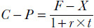

<!-- 原 EPUB 中此公式为图片，已原样保留 -->

<!-- source:block 1eb967b5c748dc82 -->

> [!quote]- English 19
> The lowest possible price for a put is 0, so the lower arbitrage boundary for a European call must be

看跌期权的最低可能价格为0，因此欧洲看涨的套利下限必须为

<!-- source:block 94605b92494d3d10 -->

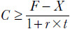

<!-- 原 EPUB 中此公式为图片，已原样保留 -->

<!-- source:block 49a3914e3caae089 -->

> [!quote]- English 20
> where *F* is either the price of an underlying futures contract or the forward price for an underlying stock.

其中F是标的期货合约的价格或标的股票的远期价格。

<!-- source:block 468436c616c63ca2 -->

> [!quote]- English 21
> For a futures option, the lower arbitrage boundary for a call is the present value of the intrinsic value. This means that if European options on futures are subject to stock-type settlement, the lower arbitrage boundary will always be less than intrinsic value because the present value must be less than intrinsic value.

对于期货期权，看涨的套利下限是内在价值的现值。这意味着，如果欧洲期货期权受到股票型结算，那么套利下限将始终小于内在价值，因为现值必须小于内在价值。

<!-- source:block 240604cb938205a9 -->

> [!quote]- English 22
> For example,

例如，

<!-- source:block d374279090d2b804 -->

> [!quote]- English 23
> Futures price = 1,167.00

$$
\text{Futures price} = 1{,}167.00
$$

<!-- source:block 8a31e2f299ac2ce1 -->

> [!quote]- English 24
> Time to expiration = 6 months

$$
\text{Time to expiration} = 6 \text{months}
$$

<!-- source:block 161c59d5bc18ccbc -->

> [!quote]- English 25
> Interest rate = 4.00 percent

$$
\text{Interest rate} = 4.00 \text{percent}
$$

<!-- source:block 5915a784ac41b948 -->

> [!quote]- English 26
> If options are subject to stock-type settlement, the lower arbitrage boundary for the 1,100 call is

如果期权须接受股票型结算，则1,100看涨期权的套利下限为

<!-- source:block c44fac7b187d54fa -->

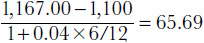

<!-- 原 EPUB 中此公式为图片，已原样保留 -->

<!-- source:block 8fce564063c6103a -->

> [!quote]- English 27
> Even though the intrinsic value is 67.00, the lower arbitrage boundary is 65.69.

尽管内在价值为67.00，但套利下限为65.69。

<!-- source:block a92eab28a7e5b515 -->

> [!quote]- English 28
> For stock options, if we replace *F* with the forward price for the stock and we ignore interest on dividends, the lower arbitrage boundary for a European call is

对于股票期权，如果我们用股票的远期价格代替F，并且忽略股息的利息，欧式看涨期权的套利下限为

<!-- source:block 6b664d35564e33c7 -->

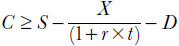

<!-- 原 EPUB 中此公式为图片，已原样保留 -->

<!-- source:block c290cb282e6a6f26 -->

> [!quote]- English 29
> A stock option call cannot trade for less than the stock price minus the discounted value of the exercise price less dividends. This means that the lower arbitrage boundary for an out-of-the-money stock option call can be greater than 0. For example,

股票期权看涨期权的交易价格不能低于股价减去行权价的贴现值减去股息。这意味着价外股票期权看涨的套利下限可以大于0。例如，

<!-- source:block f266ce501f0fae63 -->

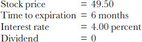

<!-- 原 EPUB 中此公式为图片，已原样保留 -->

<!-- source:block 1b4fef3f61c222e1 -->

> [!quote]- English 30
> A 50 call, even though it is out of the money, has a lower arbitrage boundary of

50 看涨期权，即使是OTM，其套利下限为

<!-- source:block 983565ce5b0e2e7a -->

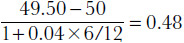

<!-- 原 EPUB 中此公式为图片，已原样保留 -->

<!-- source:block 40ed5a5030433795 -->

> [!quote]- English 31
> If the call is trading for less than 0.48, say, 0.40, we can buy the call, sell the stock, and exercise the call at expiration. The cash flows will be

如果看涨期权的交易价格低于0.48，例如0.40，我们可以购买看涨期权、出售股票并在到期时行权看涨期权。现金流将是

<!-- source:block 99e5c325be86dacc -->

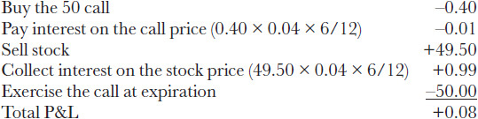

<!-- 原 EPUB 中此公式为图片，已原样保留 -->

<!-- source:block c9a72c80871c64ac -->

> [!quote]- English 32
> This is exactly the difference between the call price of 0.40 and the lower arbitrage boundary of 0.48.

这正是看涨价格0.40和套利下限0.48之间的差异。

<!-- source:block 97b7080e83ff0b7d -->

> [!quote]- English 33
> In this example, we can be certain of an arbitrage profit of at least 0.08 because we know that we can close out the position at expiration by exercising the call, thereby purchasing the stock back at a price no higher than 50. Suppose, however, that the stock price at expiration is less than 50. Instead of exercising the call, we can purchase the stock at its market price. This will result in an even greater profit than 0.08. The lower arbitrage boundary tells us the price below which there is an arbitrage opportunity and at the same time determines the *minimum* amount that can be made. The maximum amount can be even greater if at expiration the stock is trading at a price below the exercise price.

在这个例子中，我们可以确定套利利润至少为0.08，因为我们知道我们可以通过执行看涨来在到期时平仓头寸，从而以不高于50的价格回购股票。然而，假设到期时股价低于50。我们可以以市场价格购买股票，而不是行权看涨期权。这将导致比0.08更高的利润。套利下限告诉我们低于该价格就有套利机会，同时确定可以进行的最低金额。如果股票到期时交易价格低于行权价，最高金额可能会更高。

<!-- source:block 44ca2406a4de5e84 -->

> [!quote]- English 34
> What is the lower arbitrage boundary for the 50 call if it is an American option? We might assume that it must be 0 because the option is out of the money, and no one would ever exercise an out-of-the-money option. But early exercise is a right, not an obligation. We can convert an American option into a European option simply by choosing not to exercise it early. The lower arbitrage boundary for an American option is therefore at least intrinsic value. If the lower arbitrage boundary for an equivalent European option is greater than intrinsic value, as it is in this example, then this number also serves as the lower arbitrage boundary for the American option:

如果是美式期权，50看涨期权的套利下限是多少？我们可能会假设它一定是0，因为该期权是在价外的，并且没有人会行权价外的期权。但提前行权是一种权利，而不是义务。我们只需选择不尽早行权美国期权就可以将其转换为欧洲期权。因此，美式期权的套利下限至少是内在价值。如果等效欧式期权的套利下限大于内在价值（如本例中所示），那么这个数字也充当美式期权的套利下限：

<!-- source:block a348b8bdc4bdc1c5 -->

> [!quote]- English 35
> American call ≥ maximum [0, *S* – *X*, (*F* – *X*)/(1 + *r* × *t*)]

$$
\text{American call} \ge \text{maximum} [0,\,S -\,X, (F\,-\,X)/(1 +\,r \times\,t)]
$$

<!-- source:block 4facd971772a1f32 -->

> [!quote]- English 36
> In this example, the lower arbitrage boundary for the 50 call is 0.48 regardless of whether the option is European or American.

在本例中，无论期权是欧洲还是美国，50看涨期权的套利下限都是0.48。

<!-- source:block 8961ccecbf5609d4 -->

> [!quote]- English 37
> Let’s change our example slightly:

让我们稍微改变一下例子：

<!-- source:block ca6b8ce00d37fe5c -->

> [!quote]- English 38
> Stock price = 49.50

$$
\text{Stock price} = 49.50
$$

<!-- source:block 8a31e2f299ac2ce1 -->

> [!quote]- English 39
> Time to expiration = 6 months

$$
\text{Time to expiration} = 6 \text{months}
$$

<!-- source:block 9d1b758e78dae55f -->

> [!quote]- English 40
> Interest rate = 4.00 percent

$$
\text{Interest rate} = 4.00 \text{percent}
$$

<!-- source:block 59d2cd162ff25085 -->

> [!quote]- English 41
> Dividend = 0.65 payable every three months (total dividend of 1.30)

$$
\text{Dividend} = 0.65 \text{payable every three months} (\text{total dividend of} 1.30)
$$

<!-- source:block bb0990133424c226 -->

> [!quote]- English 42
> What is the lower arbitrage boundary for a European 45 call?

欧洲45看涨期权的套利下限是多少？

<!-- source:block 7a89f85b00bf716b -->

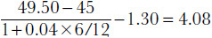

<!-- 原 EPUB 中此公式为图片，已原样保留 -->

<!-- source:block d77d03505bdd5695 -->

> [!quote]- English 43
> If the call is American, its intrinsic value (49.50 – 45 = 4.50) is greater than the European value of 4.08. Therefore, the lower arbitrage boundary for an American 45 call is 4.50.

如果看涨期权是美式看涨期权，则其内在价值（49.50 - 45 = 4.50）大于欧洲价值4.08。因此，美国45看涨期权的套利下限为4.50。

<!-- source:block bb495782c1200367 -->

> [!quote]- English 44
> By reversing *F* and *X*, we can use put-call parity to determine the lower arbitrage boundary for a European put

通过颠倒F和X，我们可以使用看跌期权-看涨期权平价来确定欧式看跌期权的套利下限

<!-- source:block 2e5887e406e6d197 -->

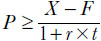

<!-- 原 EPUB 中此公式为图片，已原样保留 -->

<!-- source:block 19f5bd7f26b81f3d -->

> [!quote]- English 45
> As with a futures option call, the lower arbitrage boundary for a European put is the present value of the intrinsic value.

与期货期权看涨一样，欧式看跌期权的套利下限是内在价值的现值。

<!-- source:block 1f8d61c34e1dddb7 -->

> [!quote]- English 46
> For stock options, we can replace *F* with the stock forward price, giving us the lower arbitrage boundary for a put

对于股票期权，我们可以用股票远期价格替换F，为我们提供看跌期权的较低套利边界

<!-- source:block 4427a0a75fbdaed4 -->

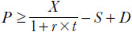

<!-- 原 EPUB 中此公式为图片，已原样保留 -->

<!-- source:block 7ee129e32f10878e -->

> [!quote]- English 47
> A stock option put cannot trade for less than the discounted value of the exercise price minus the stock price plus dividends.

股票期权看跌期权的交易价格不得低于行权价减去股价加上股息的贴现值。

<!-- source:block ca6b8ce00d37fe5c -->

> [!quote]- English 48
> Stock price = 49.50

$$
\text{Stock price} = 49.50
$$

<!-- source:block 8a31e2f299ac2ce1 -->

> [!quote]- English 49
> Time to expiration = 6 months

$$
\text{Time to expiration} = 6 \text{months}
$$

<!-- source:block 9d1b758e78dae55f -->

> [!quote]- English 50
> Interest rate = 4.00 percent

$$
\text{Interest rate} = 4.00 \text{percent}
$$

<!-- source:block 0b27cb9fc6058b2a -->

> [!quote]- English 51
> Dividend = 0

$$
\text{Dividend} = 0
$$

<!-- source:block 306dabe1eae095a9 -->

> [!quote]- English 52
> The lower arbitrage boundary for a European 50 put must be 0 because

欧洲50看跌期权的套利下限必须为0，因为

<!-- source:block 64feb1c92cde26b4 -->

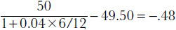

<!-- 原 EPUB 中此公式为图片，已原样保留 -->

<!-- source:block 63f43a615093799e -->

> [!quote]- English 53
> If, however, the option is American, the lower arbitrage boundary will be the option’s intrinsic value of 0.50.

然而，如果期权是美式期权，则套利下限将是期权的内在价值0.50。

<!-- source:block d456b0bcfca18de1 -->

> [!quote]- English 54
> Because we can always turn an American put into a European put simply by choosing not to exercise it, the lower arbitrage boundary for an American put is

因为我们总是可以通过选择不行权美国看跌期权而将其转变为欧洲看跌期权，因此美国看跌期权的套利下限是

<!-- source:block ddafbf2f6479dbcd -->

> [!quote]- English 55
> American put ≥ maximum [0, *X* – *S*, (*X* – *F*)/(1 + *r* × *t*)]

$$
\text{American put} \ge \text{maximum} [0,\,X -\,S, (X\,-\,F)/(1 +\,r \times\,t)]
$$

<!-- source:block d761330d5023ea61 -->

> [!quote]- English 56
> Because the lower arbitrage boundary for European options is a function of time, interest rates, and, in the case of stock, dividends, as time passes, the boundary is constantly changing. For futures options that are subject to stock-type settlement, the boundary is always rising because the present value is always rising toward intrinsic value. For stock options, however, the boundary may rise or fall depending on whether the forward price is greater than or less than the cash price. If the forward price is greater than the cash price (interest is greater than dividends), the lower arbitrage boundary will rise for calls and fall for puts. If the forward price is less than the cash price (interest is less than dividends), the boundary will fall for calls and rise for puts. A graphic representation of these changes is shown in Figures 16-1 through 16-4.

因为欧式期权的套利下限是时间、利率的函数，对于股票来说，还有股息的函数，随着时间的推移，边界不断变化。对于进行股票型结算的期货期权，边界总是在上升，因为现值总是在向内在价值上升。然而，对于股票期权，边界可能会上升或下降，具体取决于远期价格是否大于或小于现金价格。如果远期价格大于现金价格（利息大于股息），则看涨的套利下限将上升，看跌的套利下限将下降。如果远期价格低于现金价格（利息低于股息），则看涨期权的边界将下降，看跌期权的边界将上升。这些变化的图形表示如图16-1至16-4所示。

<!-- source:block 71b34e518e589d73 -->

*图16-1欧洲期货看涨套利下限（股票型结算）。 / Figure 16-1 Lower arbitrage boundary for a European call on futures (stock-type settlement).*

<!-- source:block 8701a112151571ab -->

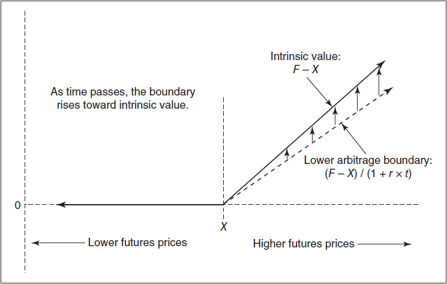

<!-- source:block d06bdc704499550e -->

*图16-2欧洲期货看跌套利下限（股票型结算）。 / Figure 16-2 Lower arbitrage boundary for a European put on futures (stock-type settlement).*

<!-- source:block a44a52a01916a4b8 -->

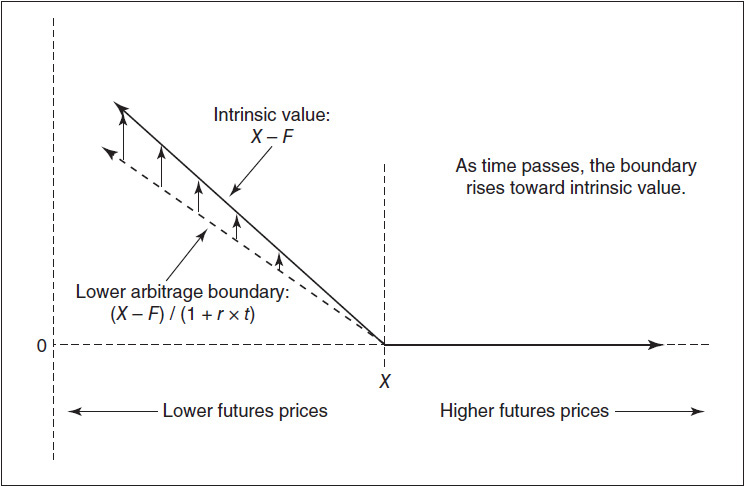

<!-- source:block a4297d2d25e9b174 -->

*图16-3欧洲看涨股票的套利下限。 / Figure 16-3 Lower arbitrage boundary for a European call on stock.*

<!-- source:block 4df2c064877253b1 -->

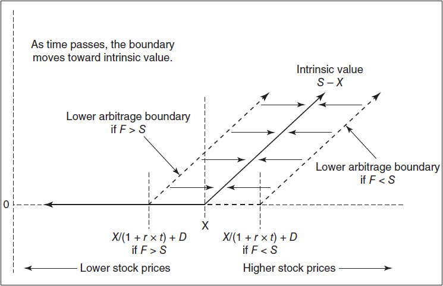

<!-- source:block a8e6ced50f5e903b -->

*图16-4欧洲看跌股票的套利下限。 / Figure 16-4 Lower arbitrage boundary for a European put on stock.*

<!-- source:block ff4235cd4d1d8be1 -->

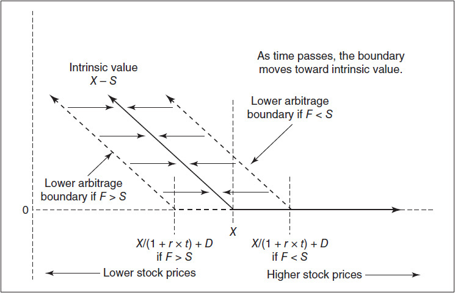

<!-- source:block 2c3fd6cc14e804ff -->

> [!quote]- English 61
> If the lower arbitrage boundary for a European option is less than intrinsic value, a European option can, in some cases, be worth less than intrinsic value. When this occurs, as time passes, the value of the option will rise toward intrinsic value. As a consequence, the option will have a positive theta. This was discussed in Chapter 7 and shown graphically in Figure 7-9.

如果欧式期权的套利下限低于内在价值，那么在某些情况下，欧式期权的价值可能低于内在价值。当这种情况发生时，随着时间的推移，期权的价值将上升至内在价值。因此，该期权将具有正的Theta。第7章对此进行了讨论，并以图形方式显示在图7-9中。

<!-- source:block 58a407f752db7984 -->

> [!quote]- English 62
> Although traders are primarily interested in the lower exercise boundary for an option, for completeness, we might also want to determine the upper arbitrage boundary for an option. Because the underlying contract cannot fall below 0, the upper arbitrage boundary for an American put, whether on futures or stock, must be the exercise price. For a European put, which is subject to stock-type settlement, the upper boundary is the present value of the exercise price

尽管交易员主要对期权的下行权边界感兴趣，但为了完整性，我们可能还想确定期权的上套利边界。由于标的合约不能跌破0，因此美国看跌期权（无论是期货还是股票）的套利上限必须是行权价。对于实行股票型结算的欧洲看跌期权，上限是行权价的现值

<!-- source:block c105cfb353a90961 -->

> [!quote]- English 63
> American put ≤ *X*

$$
\text{American put} \le\,X
$$

<!-- source:block 2d103f6ee4e4a3ba -->

> [!quote]- English 64
> European put ≤ *X*/(1 + *r* × *t*)

$$
\text{European put} \le\,X/(1 +\,r \times\,t)
$$

<!-- source:block 027646458e803d85 -->

> [!quote]- English 65
> To determine the upper arbitrage boundary for a call, we can use put-call parity

为了确定看涨的套利上限，我们可以使用看涨-看跌平价

<!-- source:block 1d7039e17046e885 -->

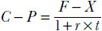

<!-- 原 EPUB 中此公式为图片，已原样保留 -->

<!-- source:block ac9458cd1b61318a -->

> [!quote]- English 66
> We know that the maximum value for a European put is *X*/(1 + *r* × *t*). Therefore, the maximum value for a European call is

我们知道欧洲看跌期权的最大值是X/（1 + r x t）。因此，欧洲看涨期权的最大值为

<!-- source:block f32c925a5a1a3103 -->

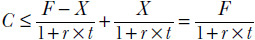

<!-- 原 EPUB 中此公式为图片，已原样保留 -->

<!-- source:block 6a5b07a2f6a9fe31 -->

> [!quote]- English 67
> A European call on a futures contract has a maximum value equal to the futures price discounted by interest. If options are subject to futures-type settlement, the maximum value is simply the price of the underlying futures contract.

欧洲期货合约看涨的最大价值等于期货价格按利息贴现。如果期权须接受期货型结算，则最大价值只是标的期货合约的价格。

<!-- source:block 820101babf1673fa -->

> [!quote]- English 68
> For a European call on stock, we can replace *F* with the forward price for stock *S* × (1 + *r* × *t*) – *D*

对于欧洲股票看涨，我们可以用股票的远期价格S x（1 + r x t）- D取代F

<!-- source:block c8d0ece15cf45ca2 -->

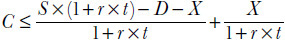

<!-- 原 EPUB 中此公式为图片，已原样保留 -->

<!-- source:block f54da16ea41d0f14 -->

> [!quote]- English 69
> Ignoring interest on dividends gives us

忽视股息利息给我们

<!-- source:block d09585d5d0560e40 -->

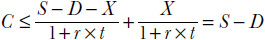

<!-- 原 EPUB 中此公式为图片，已原样保留 -->

<!-- source:block 7fff8d4d91bcc8b7 -->

> [!quote]- English 70
> A European call on stock has a maximum value equal to the stock price less dividends. An American call has a maximum value equal to the stock price. A summary of arbitrage boundaries is shown in Figure 16-5.

欧洲股票看涨的最大价值等于股价减去股息。美式看涨期权的最大价值等于股价。套利边界摘要如图16-5所示。

<!-- source:block c0905a77b89298c7 -->

*图16-5套利边界摘要。 / Figure 16-5 Summary of arbitrage boundaries.*

<!-- source:block 2e0cbae42ef5b7e9 -->

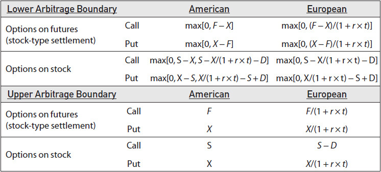

<!-- source:block b03fa52ba2171ea5 -->

## 股票看涨期权的提前行权 / Early Exercise of Call Options on stock

<!-- source:block 73914bdd774df109 -->

> [!quote]- English 72
> Under what conditions might we choose to exercise an American call option on stock prior to expiration? To answer this question, let’s think about the components that make up the value of a call.

在什么条件下我们可以选择在到期前对股票行权美式看涨期权？为了回答这个问题，让我们考虑一下构成看涨期权价值的组件。

<!-- source:block 4f6644a9154245cd -->

> [!quote]- English 73
> Clearly, if we are considering exercising an option, it must be in the money. Therefore, one component must be *intrinsic value*. A call also offers some protective value over a stock position because the call’s loss is limited by the exercise price. The likelihood that the stock will fall below the exercise price depends on the volatility, so we might refer to this protective value as *volatility value*. As volatility rises, we are willing to pay more for the call. The call also includes some *interest-rate value*. As interest rates rise, the call becomes a more desirable substitute for holding a stock position. Finally, there is *dividend value*. But unlike volatility value and interest value, both of which increase the value of the call, the dividend reduces the value of the call. Therefore,

显然，如果我们正在考虑行权一种选择，那么它一定是ITM。因此，其中一个组成部分必须是内在价值。看涨期权还为股票头寸提供了一些保护价值，因为看涨期权的损失受到行权价的限制。 股票跌破行权价的可能性取决于波动率，因此我们可以将此保护值称为波动率值。随着波动率上升，我们愿意为看涨期权支付更多费用。该看涨期权还包括一些利率价值。 随着利率上升，看涨期权成为持有股票头寸的更理想替代品。最后，还有股息价值。但与波动率价值和利息价值（两者都会增加看涨期权的价值）不同，股息会减少看涨期权的价值。因此，

<!-- source:block df3e41ebd46c3e82 -->

> [!quote]- English 74
> Call value = intrinsic value + volatility value + interest value – dividend value

$$
\text{Call value} = \text{intrinsic value} + \text{volatility value} + \text{interest value} - \text{dividend value}
$$

<!-- source:block 71042a89684fd801 -->

> [!quote]- English 75
> Suppose that we are able determine the value of each of these components and find that the dividend value is greater than the combined volatility value and interest value

假设我们能够确定这些组成部分中的每个组成部分的价值，并发现股息价值大于波动率价值和利息价值的组合

<!-- source:block b65fc3e5c09b9799 -->

> [!quote]- English 76
> Dividend value > volatility value + interest value

$$
\text{Dividend value} > \text{volatility value} + \text{interest value}
$$

<!-- source:block a0c4392e2d3ed088 -->

> [!quote]- English 77
> In this case, the value of the call will be less than intrinsic value. And, indeed, European options can, in some cases, trade for less than intrinsic value. But, if the call is American, it becomes an early exercise candidate because we can collect the intrinsic value now by simultaneously exercising the call and selling the stock.

在这种情况下，看涨期权的价值将小于内在价值。事实上，在某些情况下，欧洲期权的交易价格可能低于内在价值。但是，如果看涨期权是美国的，它就会成为早期行权候选者，因为我们现在可以通过同时行权看涨期权和出售股票来收集内在价值。

<!-- source:block e46bfdfd31e8c262 -->

> [!quote]- English 78
> How can we estimate the value of the volatility, interest-rate, and dividend components? The dividend component is simply the total dividend the stock is expected to pay over the life of the option. The interest value must be the interest that we would have to pay if we were to sell the call and buy the stock and carry this position to expiration. If the call is deeply in the money, its value will be very close to intrinsic value, and the total cash flow will be approximately equal to the exercise price

我们如何估计波动率、利率和股息部分的价值？股息部分只是股票在期权有效期内预计支付的总股息。利息价值必须是如果我们出售看涨期权并购买股票并将此头寸持续至到期，我们必须支付的利息。如果看涨期权价内，其价值将非常接近内在价值，总现金流将大致等于行权价

<!-- source:block 079134ae562ef4d1 -->

> [!quote]- English 79
> Intrinsic value = stock price – exercise price

$$
\text{Intrinsic value} = \text{stock price} - \text{exercise price}
$$

<!-- source:block 8bc078466de0b215 -->

> [!quote]- English 80
> We might reach the same conclusion by observing that if we exercise the call, we will have to pay the exercise price. The interest value must be the approximate cost of carrying the exercise price to expiration.

我们可能会通过观察到如果我们行权看涨期权，我们将不得不支付行权价来得出同样的结论。利息价值必须是将行权价持续至到期的大致成本。

<!-- source:block 41ea805aa0846aa2 -->

> [!quote]- English 81
> The volatility component is somewhat more difficult to determine. But we know that the volatility value depends on the likelihood of the stock price falling below the exercise price. The value of the companion put (the put with the same exercise price and expiration date as the call) must be a good estimate of this value. We know from put-call parity that the vegas of calls and puts with the same exercise price and expiration date are the same—they have the same sensitivity to changes in volatility. Therefore, their volatility values ought to be the same.1

波动率成分比较难以确定。但我们知道波动率值取决于股价跌破行权价的可能性。对应的看跌期权（与看涨期权具有相同的行权价和到期日的看跌期权）的价值必须是这个价值的一个很好的估计。我们从看跌期权和看涨期权的平价中知道，具有相同行权价和到期日的看涨期权和看跌期权的Vega斯是相同的，它们对波动率的变化具有相同的敏感性。因此，它们的波动率值应该相同。[^ovp16-1]

<!-- source:block 3728e935d4a8162d -->

> [!quote]- English 82
> For example, consider the following:

例如，考虑以下内容：

<!-- source:block 2232d2d7b60ca590 -->

> [!quote]- English 83
> Stock price = 100

$$
\text{Stock price} = 100
$$

<!-- source:block 9da1ec051587f521 -->

> [!quote]- English 84
> Time to expiration = 1 month

$$
\text{Time to expiration} = 1 \text{month}
$$

<!-- source:block 67718da191cd8f24 -->

> [!quote]- English 85
> Interest rate = 6.00 percent

$$
\text{Interest rate} = 6.00 \text{percent}
$$

<!-- source:block 77d5e1d93dcd6837 -->

> [!quote]- English 86
> Dividend = 0.75, payable in 15 days

$$
\text{Dividend} = 0.75, \text{payable in} 15 \text{days}
$$

<!-- source:block ffbeba0fad2eef7c -->

> [!quote]- English 87
> Is the 90 call an early exercise candidate if the price of the 90 put is 0.20?

如果90看跌期权的价格为0.20，那么90看涨期权是否属于提前行权候选股票？

<!-- source:block 87ff2d8f8e6eb0a1 -->

> [!quote]- English 88
> We know the dividend value (0.75) and the volatility value (0.20), so the only component we need to calculate is the cost of carrying the exercise price to expiration

我们知道股息价值（0.75）和波动率价值（0.20），所以我们需要计算的唯一组成部分是将行权价格持有到到期的成本

<!-- source:block 9a13c90e75805d46 -->

> [!quote]- English 89
> 90 × .06 × 1/12 = .45

$$
90 \times .06 \times 1/12 = .45
$$

<!-- source:block 86621b713c4f0891 -->

> [!quote]- English 90
> The early exercise criteria are satisfied because

提前行权标准得到满足，因为

<!-- source:block 4ce1e23881a846e7 -->

> [!quote]- English 91
> Dividend value > volatility value + interest value 0.75 > 0.20 + 0.45 = 0.65

$$
\text{Dividend value} > \text{volatility value} + \text{interest value} 0.75 > 0.20 + 0.45 = 0.65
$$

<!-- source:block 28bdfd0d6f3464ec -->

> [!quote]- English 92
> In Figure 16-6 we can see why the 90 call has become an early exercise candidate—its European value has fallen below intrinsic value.2 If given the choice between exercising now or carrying the option position to expiration, we will come out ahead by 0.10 if we exercise now.

在图16-6中，我们可以看到为什么90看涨期权成为早期行权候选者——其欧洲价值已跌破内在价值。[^ovp16-2]如果在现在行权或将期权头寸持有至到期之间做出选择，如果我们现在行权，我们将领先0.10。

<!-- source:block defec6562019129a -->

*图16-6 / Figure 16-6*

<!-- source:block e6998ab0b149cb26 -->

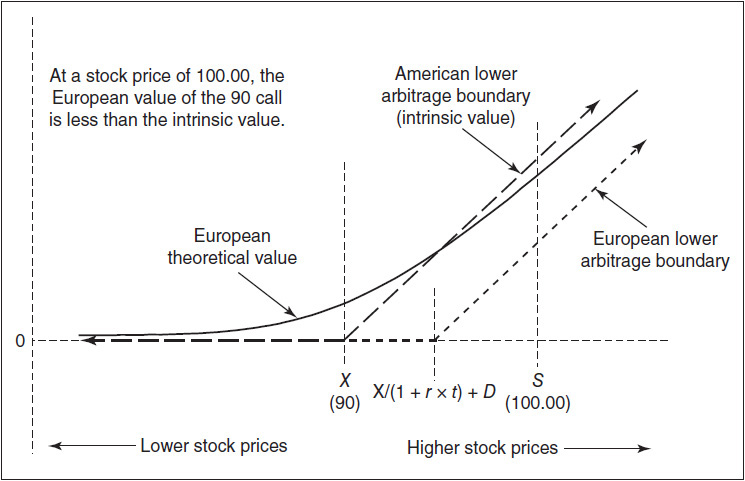

<!-- source:block 3d3abdfa2513cfe7 -->

> [!quote]- English 94
> But are those our only two choices—exercise now or not at all? An American option can be exercised at any time prior to expiration. Instead of exercising today, what about exercising the option tomorrow? Or the day after that?

但这是我们仅有的两个选择吗——现在行权还是根本不行权？美式期权可以在到期前随时行权。与其今天行权，不如明天行权选择怎么样？或者后天？

<!-- source:block 3b903982f2839fd6 -->

> [!quote]- English 95
> Suppose that we exercise today instead of exercising tomorrow. What will we gain, and what will we lose? We will lose one day’s worth of volatility value. We will also lose one day’s worth of interest on the exercise price. In return, we get . . . nothing. We are exercising to get the dividend. But the dividend will not be paid for 15 days. Because we always give up some volatility value and some interest value when we exercise an American call option on stock prior to expiration, the only time we will consider exercising the option early is the day before the stock pays the dividend. On no other day will early exercise be optimal.

假设我们今天行权而不是明天行权。我们会得到什么，又会失去什么？我们将失去一天的波动率价值。我们还将损失行权价一天的利息。作为回报，我们得到了。. .没什么我们正在努力获得股息。但股息将在15天内支付。因为当我们在到期前对股票行权美式看涨期权时，我们总是放弃一些波动率价值和一些利息价值，因此我们唯一会考虑行权期权的时间是股票支付股息的前一天。没有哪一天提前行权是最佳选择。

<!-- source:block da083b2ff65e1e54 -->

> [!quote]- English 96
> For an American call option on stock to be an early exercise candidate, the early exercise criteria must hold true over the entire life of the option

对于股票美式看涨期权作为早期行权候选者，早期行权标准必须在期权的整个生命周期内成立

<!-- source:block b65fc3e5c09b9799 -->

> [!quote]- English 97
> Dividend value > volatility value + interest value

$$
\text{Dividend value} > \text{volatility value} + \text{interest value}
$$

<!-- source:block c428f45fc92b8e7e -->

> [!quote]- English 98
> But, for an option to be an *immediate* early exercise candidate, this condition must also hold true over the next day. For a call option on stock, the only day on which a trader need consider early exercise is the day before the stock pays a dividend. Indeed, if a stock pays no dividend over the life of the option, there is never any reason to exercise the call prior to expiration.

但是，对于立即成为提前行权候选人的选择，这种条件也必须在第二天成立。对于股票看涨期权，交易员唯一需要考虑提前行权的日子是股票支付股息的前一天。事实上，如果股票在期权有效期内不支付股息，那么就没有任何理由在到期前行权看涨期权。

<!-- source:block 2f264147c42ca407 -->

## 股票看跌期权的提前行权 / Early Exercise of Put Options on stock

<!-- source:block c85be7efcc05bc0a -->

> [!quote]- English 99
> Under what conditions might we choose to exercise an American put option on stock prior to expiration? Just as we separated the value of a stock option call into its components, we can do the same with a stock option put. Again, we begin with the intrinsic value. To this, we can add the volatility value—the protective value afforded by the put in the event that the stock price rises above the exercise price. There will also be interest value—if we exercise the put, we will collect interest on the exercise price. Finally, there will be some dividend value.

在什么条件下我们可以选择在到期前对股票行权美式看跌期权？正如我们将股票期权看涨的价值分为其组成部分一样，我们也可以对股票期权看跌进行同样的处理。再次，我们从内在价值开始。除此之外，我们可以添加波动率价值——在股价升至行权价以上时看跌期权提供的保护价值。还会有利息价值——如果我们行权看跌期权，我们将收取行权价的利息。最后，会有一定的股息价值。

<!-- source:block e70d842e6a96a08d -->

> [!quote]- English 100
> Put value = intrinsic value + volatility value – interest value + dividend value

看跌价值=内在价值+波动率价值-利息价值+股息价值

<!-- source:block 2aafe7824b921004 -->

> [!quote]- English 101
> Note that volatility value and dividend value increase the value of the put, while the interest value reduces the put’s value. Suppose that we are able to determine the value of each of these components and find that the interest value is greater than the combined volatility value and dividend value

请注意，波动率价值和股息价值会增加看跌期权的价值，而利息价值会减少看跌期权的价值。假设我们能够确定这些组成部分中的每个组成部分的价值，并发现利息价值大于波动率价值和股息价值的组合

<!-- source:block d641f4e125068d98 -->

> [!quote]- English 102
> Interest value > volatility value + dividend value

$$
\text{Interest value} > \text{volatility value} + \text{dividend value}
$$

<!-- source:block 8aba57b1c08fa1c3 -->

> [!quote]- English 103
> If this is true, the value of the option will be less than intrinsic value. But, if the option is American, it becomes an early exercise candidate because we can collect the intrinsic value right now by exercising the put.

如果这是真的，那么期权的价值将小于内在价值。但是，如果期权是美式期权，它就会成为早期行权的候选者，因为我们现在可以通过行权看跌期权来收集内在价值。

<!-- source:block 5d1144866795ac03 -->

> [!quote]- English 104
> We can estimate the value of these components in the same way we estimated them for a call. The interest value is the amount of interest we will earn on the exercise price to expiration if we exercise the put. The dividend value is the total dividend the stock is expected to pay over the life of the option. The volatility value is approximately the price of the companion out-of-the-money call.

我们可以像在看涨期权中估计这些组件的价值一样估计这些组件的价值。利息价值是如果我们行权看跌期权，我们将从到期的行权价中赚取的利息金额。股息价值是股票在期权有效期内预计支付的总股息。波动率值大约是伴随的价外看涨期权的价格。

<!-- source:block 38516489814d105e -->

> [!quote]- English 105
> Consider this situation:

考虑一下这种情况：

<!-- source:block 2232d2d7b60ca590 -->

> [!quote]- English 106
> Stock price = 100

$$
\text{Stock price} = 100
$$

<!-- source:block bb5476aa69091708 -->

> [!quote]- English 107
> Time to expiration = 2 months

$$
\text{Time to expiration} = 2 \text{months}
$$

<!-- source:block 67718da191cd8f24 -->

> [!quote]- English 108
> Interest rate = 6.00 percent

$$
\text{Interest rate} = 6.00 \text{percent}
$$

<!-- source:block c3af70f1b11da5db -->

> [!quote]- English 109
> Dividend = 0.40

$$
\text{Dividend} = 0.40
$$

<!-- source:block 1bc23f935119430f -->

> [!quote]- English 110
> Is the 120 put an early exercise candidate if the price of the 120 call is 0.55?

如果120 看涨期权的价格为0.55，那么120看跌是否看跌期权早期行权候选项？

<!-- source:block 76046c926efda7b0 -->

> [!quote]- English 111
> We know the volatility value (0.55) and dividend value (0.40). The interest on the exercise price to expiration is

我们知道波动率值（0.55）和股息值（0.40）。到期前的行权价利息为

<!-- source:block f2c8e57f9f6c4d4f -->

> [!quote]- English 112
> 120 × .06 × 1/6 = 1.20

$$
120 \times .06 \times 1/6 = 1.20
$$

<!-- source:block 86621b713c4f0891 -->

> [!quote]- English 113
> The early exercise criteria are satisfied because

提前行权标准得到满足，因为

<!-- source:block f53ac9931ed442d5 -->

> [!quote]- English 114
> Interest value > volatility value + dividend value 1.20 > .55 + .40 = .95

$$
\text{Interest value} > \text{volatility value} + \text{dividend value} 1.20 > .55 + .40 = .95
$$

<!-- source:block 218506d28ce50124 -->

> [!quote]- English 115
> We can see in Figure 16-7 that at a stock price of 100, the value of the European 120 put falls below intrinsic value, making the put an early exercise candidate. If given the choice between exercising now or carrying the option position to expiration, we will come out ahead by 0.25 if we exercise now.3

从图16-7中我们可以看到，当股价为100时，欧洲120看跌期权的价值跌破内在价值，使看跌期权成为早期期权。如果可以在现在行权或将期权头寸持有至到期之间做出选择，那么如果我们现在行权，我们将领先0.25。[^ovp16-3]

<!-- source:block edb67cd6ccd5e04a -->

*图16-7 / Figure 16-7*

<!-- source:block b1229c4e34a6f014 -->

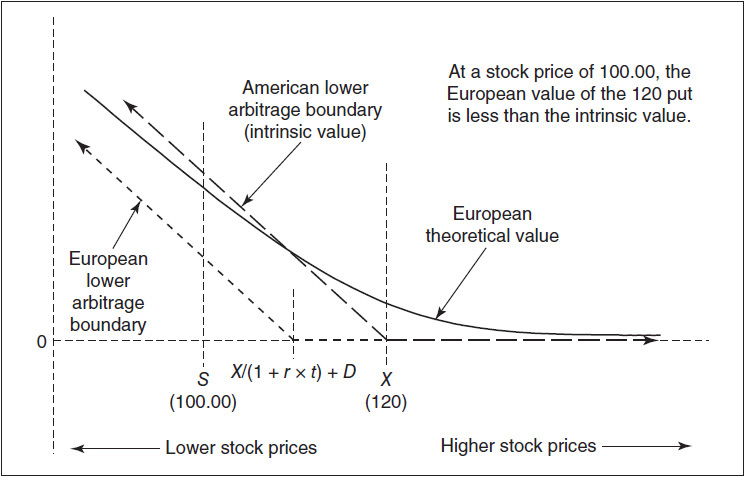

<!-- source:block ff999d9fb61572af -->

> [!quote]- English 117
> As with a call, for a put to be an immediate early exercise candidate, the early exercise criteria must hold true not only over the entire life of the option but also over the next day. We will exercise today only if we expect to gain more over the next day through early exercise than we lose. Will this be true for our 120 put?

与看涨期权一样，为了让看跌期权成为立即的提前行权候选者，提前行权标准必须不仅在期权的整个生命周期中有效，而且在第二天也有效。只有当我们希望通过提前行权在第二天获得比失去的更多时，我们才会今天行权。对于我们的120看跌期权来说，情况会如此吗？

<!-- source:block 15f9f85ec4ee1d73 -->

> [!quote]- English 118
> Suppose that the dividend of 0.40 will be paid tomorrow. If we exercise today instead of tomorrow, we will gain one day’s worth of interest

假设明天支付0.40的股息。如果我们今天行权而不是明天行权，我们就会获得一天的兴趣

<!-- source:block 303a376ec3f168f2 -->

> [!quote]- English 119
> 120 ×0.06/365 = 0.02

$$
120 \times0.06/365 = 0.02
$$

<!-- source:block 7da76e315fd51738 -->

> [!quote]- English 120
> In return, we are giving up one day’s worth of volatility value as well as the value of the dividend. Even if we assume that the volatility value is negligible, the dividend of 0.40 that we will lose is far greater than the interest of 0.02 that we will earn. Clearly, we should wait one day before exercising the option, foregoing one day’s worth of interest but retaining the value of the dividend.

作为回报，我们放弃了一天的波动率价值以及股息价值。即使我们假设波动率值可以忽略不计，我们损失的0.40股息也远远大于我们将获得的0.02利息。显然，我们应该等一天再行权选择权，放弃一天的利息，但保留股息的价值。

<!-- source:block 49d228236b4c30e3 -->

> [!quote]- English 121
> Suppose that the dividend will be paid two days from now. If we exercise today instead of waiting until the dividend is paid, we will earn two days’ worth of interest, 0.04, but we will still lose the dividend of 0.40. Waiting two days to exercise is still a better strategy.

假设股息将在两天后支付。如果我们今天行权而不是等到股息支付，我们将获得相当于两天的利息0.04，但我们仍然会失去0.40的股息。等两天行权仍然是更好的策略。

<!-- source:block 1b24ae05b98d2ce3 -->

> [!quote]- English 122
> When should we exercise a put early? Because a trader will not want to give up the value of the dividend, the most common day on which to exercise a stock option put early is the day on which the stock pays the dividend. But unlike stock option calls, where the *only* day on which the option ought to be exercised early is the day before the stock pays the dividend, a stock option put might be exercised any time prior to expiration. Early exercise will be optimal if the interest that can be earned is greater than the combined volatility and dividend value.

我们什么时候应该早点行权看跌？由于交易者不想放弃股息的价值，因此最常见的提前行权股票期权的日子是股票支付股息的日子。但与股票期权看涨期权不同的是，股票期权看涨期权应该提前行权的唯一一天是股票支付股息的前一天，股票期权看跌期权看涨期权可能会在到期前的任何时间被行权。如果可以赚取的利息大于波动率和股息价值的总和，早期行权将是最佳选择。

<!-- source:block f348f5655d7f5235 -->

> [!quote]- English 123
> Ignoring the volatility value, we can see that no trader will exercise a put early if the total interest that can be earned is less than the dividend. In our example, where we expect to earn 0.02 in interest per day, early exercise can never be optimal if the dividend will be paid within the next 20 days because

忽略波动率值，我们可以看到，如果可以赚取的总利息低于股息，那么没有交易员会提前行权看跌期权。在我们的例子中，我们预计每天赚取0.02的利息，如果股息将在未来20天内支付，提前行权永远不是最佳选择，因为

<!-- source:block 8331ffb673c2d2ab -->

> [!quote]- English 124
> 0.40/.02 = 20

$$
0.40/.02 = 20
$$

<!-- source:block 60cceaaa0e6ee687 -->

> [!quote]- English 125
> With fewer than 20 days to the dividend payment, we can never earn enough interest to offset the loss of the dividend. For put options, this *blackout period* can be easily calculated by dividing the dividend by the daily interest that can be earned on the exercise price. During this period, no knowledgeable trader will exercise a put because the loss of the dividend will be greater than the total interest earned.

由于离派息只有不到20天的时间，我们永远无法赚取足够的利息来抵消股息的损失。对于看跌期权，这个管制期可以很容易地通过将股息除以行权价可以赚取的每日利息来计算。在此期间，没有知识渊博的交易者会行权看跌期权，因为股息的损失将大于所赚取的总利息。

<!-- source:block e50a68a4b39fbb6a -->

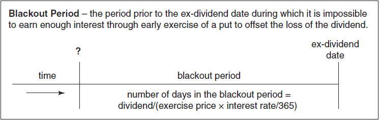

<!-- source:block 343c907d3939f7c8 -->

> [!quote]- English 126
> This does not mean that a put should never be exercised prior to the dividend payment. In our example, if the dividend will be paid in 30 days and we exercise now, we will earn 30 days’ worth of interest, that is, 30 × 0.02 = 0.60. This is greater than the 0.40 value of the dividend. As long as the volatility value over the next 30 days is less than 0.20, immediate early exercise is a sensible choice.

这并不意味着在股息支付之前不应行权看跌期权。在我们的例子中，如果股息将在30天内支付并且我们现在行权，我们将获得相当于30天的利息，即30 × 0.02 = 0.60。这大于股息的0.40值。只要未来30天的波动率值小于0.20，立即提前行权就是明智的选择。

<!-- source:block 0c659f090e0a28fb -->

## 股票空头对提前行权的影响 / Impact of Short Stock on Early Exercise

<!-- source:block efbe3f0781aec889 -->

> [!quote]- English 127
> Interest rates are an important factor in deciding whether to exercise a stock option early. If we reduce interest rates, calls are more likely to be exercised early (early exercise results in a smaller interest loss), and puts are less likely to be exercised early (early exercise results in smaller interest earnings). Because a short stock position entails a lower interest rate (the rate is reduced by the borrowing costs), a trader who has a short stock position is more likely to exercise a call option early. At the same time, a trader who does not already own stock will be less likely to exercise a put option early. This is consistent with the general rule that we proposed in Chapter 7:

利率是决定是否提前行权股票期权的重要因素。如果我们降低利率，看涨期权更有可能被提前执行（提前执行会导致较小的利息损失），而看跌期权更不可能被提前执行（提前执行会导致较小的利息收益）。由于空头股票头寸需要较低的利率（利率因借贷成本而降低），因此持有空头股票头寸的交易员更有可能提前行权看涨期权。与此同时，尚未拥有股票的交易员不太可能提前行权看跌期权。这与我们在第7章中提出的一般规则是一致的：

<!-- source:block 2520c79167cc11b4 -->

> [!quote]- English 128
> *Whenever possible, a trader should avoid a short stock position*.

只要有可能，交易者就应避免空头头寸。

<!-- source:block b210c9a86f811de7 -->

> [!quote]- English 129
> If a trader is carrying a short stock position, exercise of a call will reduce or eliminate this position. If a trader is carrying no stock position, exercise of a put will result in a short stock position. In the former case, a call is more likely to be exercised early; in the latter case, a put is less likely to be exercised early.

如果交易者持有空头股票头寸，则执行看涨期权将减少或消除该头寸。如果交易者没有持有股票头寸，则看跌期权的行权将导致股票空头头寸。在前一种情况下，看涨期权更有可能被提前执行;在后一种情况下，看跌期权更不可能被提前执行。

<!-- source:block d8bdef23e1cec258 -->

## 期货期权的提前行权 / Early Exercise of Options on Futures

<!-- source:block ecc6da29d3806ad7 -->

> [!quote]- English 130
> What happens when we exercise a futures option? Exercise of a call option enables us to buy the underlying futures contract at the exercise price. Exercise of a put option enables us to sell the underlying futures contract at the exercise price. Because the futures contract is subject to futures-type settlement, there will be a variation credit equal to the option’s intrinsic value, the difference between the exercise price and the price of the futures contract. If the option is subject to futures-type settlement, exercise will cause the option to disappear, and we will be debited by an amount equal to the option’s value. Assuming that the price of the option is equal to its intrinsic value, the credit and debit will cancel out, resulting in no cash flow. Because there is no cash flow, there can be no advantage to early exercise. If, however, the option is subject to stock-type settlement, as is the practice on futures exchanges in the United States, there is no cash flow when the option position disappears. The only cash flow is the variation credit on the futures position, a credit on which we can earn interest.

行权期货期权时会发生什么？行权 call（看涨期权）使我们能够按行权价买入标的期货合约，行权 put（看跌期权）则使我们能够按行权价卖出标的期货合约。由于期货采用期货式结算，账户会产生一笔等于期权内在价值（期货价格与行权价之差）的 `variation credit`。如果期权本身也采用期货式结算，行权会使期权头寸消失，同时账户产生一笔等于期权价值的 `debit`。假设期权价格等于其内在价值，这笔 `credit` 与 `debit` 将相互抵消，净现金流为零，因此提前行权没有优势。若期权采用美国期货交易所常见的股票式结算，期权头寸消失时不会产生现金流；唯一的现金流来自期货头寸的 `variation credit`，而该笔 `credit` 可以赚取利息。

<!-- source:block 8c7079167afc0c83 -->

> [!quote]- English 131
> For a futures option to be an early exercise candidate, the option must be subject to stock-type settlement, and the interest that can be earned on the intrinsic value must be greater than the volatility value that we are giving up

期货期权要成为提前行权候选者，期权必须服从股票型结算，内在价值可以赚取的利息必须大于我们放弃的波动率价值

<!-- source:block 07c67164d04e0946 -->

> [!quote]- English 132
> Interest value > volatility value

$$
\text{Interest value} > \text{volatility value}
$$

<!-- source:block 5b5dcd740ce51606 -->

> [!quote]- English 133
> The interest on the option’s intrinsic value is either

对期权内在价值的兴趣是

<!-- source:block 27496aa79d401a67 -->

> [!quote]- English 134
> (*F* – *X*) × *r* × *t*

$$
(F\,-\,X) \times\,r \times\,t
$$

<!-- source:block bf2f5dbf763bdaf7 -->

> [!quote]- English 135
> for calls or

用于看涨期权或

<!-- source:block 4ebb554f909d8b75 -->

> [!quote]- English 136
> (*X* – *F*) × *r* × *t*

$$
(X\,-\,F) \times\,r \times\,t
$$

<!-- source:block 3dc72b2558b56cbe -->

> [!quote]- English 137
> for puts.

对于看跌期权。

<!-- source:block 40de98123b2d5fef -->

> [!quote]- English 138
> As with stock options, we can estimate the volatility value of an option by looking at the price of the companion out-of-the-money option. Suppose that we have the following:

与股票期权一样，我们可以通过查看配套的价外期权的价格来估计期权的波动率价值。假设我们有以下内容：

<!-- source:block f7bc005cfce6f5ab -->

> [!quote]- English 139
> Futures price = 100

$$
\text{Futures price} = 100
$$

<!-- source:block b8b5a73c2a724f74 -->

> [!quote]- English 140
> Time to expiration = 3 months

$$
\text{Time to expiration} = 3 \text{months}
$$

<!-- source:block fe817e482d5a5582 -->

> [!quote]- English 141
> Interest rate = 8.00 percent

$$
\text{Interest rate} = 8.00 \text{percent}
$$

<!-- source:block d538182573c5b2fe -->

> [!quote]- English 142
> Is the 80 call an early exercise candidate if the price of the 80 put is 0.15?

如果80看跌期权的价格为0.15，那么80看涨期权是否属于提前行权候选者？

<!-- source:block 8b315a4ac496718b -->

> [!quote]- English 143
> The interest we can earn through early exercise is

我们通过提前行权可以获得的兴趣是

<!-- source:block 8d764ab12b3458f6 -->

> [!quote]- English 144
> (100 – 80) × 0.08 × 3/12 = 0.40

$$
(100 - 80) \times 0.08 \times 3/12 = 0.40
$$

<!-- source:block bd055530095ded8d -->

> [!quote]- English 145
> Because this is greater than the volatility value of .15, the option is an early exercise candidate. If given the choice between exercising now and holding the position to expiration, we will come out ahead by 0.25 if we exercise now. For the option to be an immediate early exercise candidate, it must also meet the early exercise criteria over the next day. One day’s worth of interest must be greater than one day’s worth of volatility value.

由于这大于0.15的波动率值，因此该期权是早期行权的候选期权。如果可以在现在行权和持有头寸至到期之间做出选择，那么如果我们现在行权，我们将领先0.25。为了成为立即提前行权候选者，它还必须满足第二天的提前行权标准。一天的利息价值必须大于一天的波动率价值。

<!-- source:block 4eedc3e8e08a9005 -->

> [!quote]- English 146
> We can easily calculate one day’s worth of interest

我们可以轻松计算出一天的利息

<!-- source:block ecbc93537c209752 -->

> [!quote]- English 147
> (100 – 80) × .08/365 = 0.0044

$$
(100 - 80) \times .08/365 = 0.0044
$$

<!-- source:block 434581eb07ef39c8 -->

> [!quote]- English 148
> How can we calculate one day’s worth of volatility value? We know that the price of the companion option, in this case, the 80 put, is almost all volatility value. As each day passes, the value of the option will fall by one day’s worth of volatility value. This daily loss in value is simply the option’s theta. By determining the theta of the companion out-of-the-money option, we can estimate one day’s worth of volatility value. Unlike the other calculations, this will require the use of a theoretical pricing model.

如何计算一天的波动率值？我们知道，伴随期权（在这种情况下是80看跌期权）的价格几乎都是波动率值。随着时间的推移，期权的价值将下降一天的波动率价值。这种每日价值损失只是期权的Theta。通过确定配套的价外期权的Theta，我们可以估计一天的波动率价值。与其他计算不同，这需要使用理论定价模型。

<!-- source:block ea2f6e7ba172fd15 -->

> [!quote]- English 149
> Using the Black-Scholes model, we find that the implied volatility of the 80 put is 24.68 percent. At this implied volatility, the option’s theta is –0.0046, slightly greater (in absolute value) than the daily interest. If we exercise the 80 call today instead of tomorrow, we will gain 0.0044 in interest, but we will lose 0.0046 in volatility value. Because we will lose more than we gain, the option is not an immediate early exercise candidate.

使用Black-Scholes模型，我们发现80看跌期权的隐含波动率为24.68%。在此隐含波动率下，期权的Theta为-0.0046，略高于日利率（绝对值）。如果我们今天而不是明天行权80看涨期权，我们将获得0.0044的利息，但波动率值将损失0.0046。因为我们失去的将多于得到的，因此该选择不是立即提前行权的候选者。

<!-- source:block 4e3047bf29e6b50a -->

> [!quote]- English 150
> When should we exercise the 80 call? Assuming that the early exercise criteria are met over the entire life of the option, we will want to exercise when the daily volatility value is less than the daily interest. In our example, we will want to exercise when the option’s theta is less than .0044. Using the Black-Scholes model, we can estimate that this will occur in four days, at which time the theta of the 80 put will be –0.0043.4

我们应该什么时候行权80 看涨期权？假设在期权的整个生命周期内满足早期行权标准，我们将希望在每日波动率值小于每日利息时行权。在我们的示例中，我们希望在期权的Theta小于.0044时行权。 使用Black-Scholes模型，我们可以估计这将在四天内发生，此时80 看跌期权的Theta将为-0.0043。 [^ovp16-4]

<!-- source:block df1930a901556003 -->

> [!quote]- English 151
> Not exercising an option to retain the theta value may seem counterintuitive. If we do not exercise the 80 call and the price of the futures contract does not move, we not only lose one day’s worth of interest, but we also lose one day’s worth of theta. But this is true only if the price of the futures contract does not move. If the futures contract does move, the fact that we have a positive gamma position will work in our favor. If the movement is large enough, we will prefer to hold the option position rather than a futures position. In an extreme case, if the futures contract were to fall below 80, we would clearly prefer the option position because of the protective value offered by the 80 call. How likely is it that we will get sufficient movement in the futures price over the next day to justify holding the 80 call rather than exercising it? This is one day’s worth of volatility value—the theta of the 80 put.

不行权保留Theta值的期权可能看起来违反直觉。如果我们不行权80看涨期权，并且期货合约的价格不变动，我们不仅会损失一天的利息，还会损失一天的Theta。但只有当期货合约的价格不变动时，这才成立。如果期货合约确实发生变化，我们拥有正Gamma头寸这一事实将对我们有利。如果变动足够大，我们更愿意持有期权头寸而不是期货头寸。在极端情况下，如果期货合约跌破80，我们显然更喜欢期权头寸，因为80看涨期权提供的保护价值。我们在第二天获得期货价格足够的波动来证明持有80看涨期权而不是行权它的可能性有多大？这是一天的波动率值——80看跌期权的Theta。

<!-- source:block 90f1300c61bea244 -->

> [!quote]- English 152
> For an American option that might be an early exercise candidate, we have considered two choices—hold the option or exercise the option. There is also a third choice—sell the option and replace it with a position in the underlying contract. The result is equivalent to exercising the option because both strategies result in the option position being replaced by an underlying position.

对于可能是早期行权候选的美式期权，我们考虑了两种选择-持有期权或行权期权。还有第三种选择——出售期权并用标的合约中的头寸取代它。结果相当于行权期权，因为这两种策略都会导致期权头寸被标的头寸取代。

<!-- source:block 3a3eb82cef627074 -->

> [!quote]- English 153
> When does selling an option rather than exercising make sense? When we decide to exercise an American option prior to expiration, we have, in effect, concluded that the value of the option is equal to its intrinsic value. If the price of the option in the marketplace is exactly intrinsic value, there is no difference between exercising the option or selling the option and replacing it with an underlying position. If, however, the option is trading at a price greater than intrinsic value, and transaction costs are not a factor, the best choice will always be to sell the option and replace it with a position in the underlying contract. As a practical matter, however, selling an option that is an early exercise candidate will usually not be a viable alternative. If the option is deeply enough in the money to justify early exercise, the market for the option will be relatively illiquid. Under these conditions, the bid-ask spread is likely to be so wide that any sale will almost certainly have to be done at a price that is no greater than intrinsic value.

什么时候出售期权而不是行权才有意义？当我们决定在到期前行权美式期权时，我们实际上已经得出这样的结论：期权的价值等于其内在价值。如果期权在市场上的价格正好是内在价值，那么行权期权或出售期权并以标的头寸取代它之间没有区别。然而，如果期权的交易价格高于内在价值，并且交易成本不是一个因素，那么最好的选择始终是出售期权并用标的合约中的头寸替换它。然而，实际上，出售早期行权候选期权通常不是可行的替代方案。如果期权价内足以证明提前行权是合理的，那么期权市场的流动性就会相对较差。在这些条件下，买卖价差可能会如此之大，以至于任何销售几乎肯定都必须以不高于内在价值的价格进行。

<!-- source:block f50f09417160e7d7 -->

## 保护价值与提前行权 / Protective Value and Early Exercise

<!-- source:block b318dd9dc5aaad5b -->

> [!quote]- English 154
> When we exercise an option prior to expiration, we are giving up the protective value afforded by the option’s exercise price. If the price of the underlying contract were to fall through the exercise price in the case of a call or rise through the exercise price in the case of a put, we would always prefer the option position to an underlying position. To better understand the consequences of giving up this protective value, let’s go back to an earlier stock option example, but with the dividend payable tomorrow:

当我们在到期前行权期权时，我们放弃了期权行权价提供的保护价值。如果标的合约的价格在看涨的情况下下跌至行权价，或者在看跌的情况下上涨至行权价，那么我们始终更喜欢期权头寸而不是标的头寸。为了更好地理解放弃这种保护价值的后果，让我们回到早期的股票期权示例，但明天支付股息：

<!-- source:block 2232d2d7b60ca590 -->

> [!quote]- English 155
> Stock price = 100

$$
\text{Stock price} = 100
$$

<!-- source:block 9da1ec051587f521 -->

> [!quote]- English 156
> Time to expiration = 1 month

$$
\text{Time to expiration} = 1 \text{month}
$$

<!-- source:block 67718da191cd8f24 -->

> [!quote]- English 157
> Interest rate = 6.00 percent

$$
\text{Interest rate} = 6.00 \text{percent}
$$

<!-- source:block b8d38013e9f48dd8 -->

> [!quote]- English 158
> Dividend = 0.75, payable tomorrow

$$
\text{Dividend} = 0.75, \text{payable tomorrow}
$$

<!-- source:block 7b6f791cccd45065 -->

> [!quote]- English 159
> If the 90 put is trading at 0.20, we know that the 90 call is an immediate early exercise candidate because

如果90看跌期权的交易价格为0.20，我们知道90看涨期权是立即提前行权的候选者，因为

<!-- source:block c6aa07540bde52b3 -->

> [!quote]- English 160
> Dividend value > volatility value + interest value .75 > 0.20 + .45 = .65

$$
\text{Dividend value} > \text{volatility value} + \text{interest value} .75 > 0.20 + .45 = .65
$$

<!-- source:block 5835c360f232ce79 -->

> [!quote]- English 161
> If we exercise the 90 call, the result is that we will have no option position, but we will have a long position in the underlying stock. This is the same position that would result had we sold the option and bought the stock. However, if we sell a call and buy the underlying, this is synthetically equivalent to selling a put. In a sense, exercising the 90 call is the same as selling the 90 put. What will cause us to regret selling the 90 put? Whether we sell the 90 put or exercise the 90 call early, in both cases, we will regret our choice if the stock price is below 90 at expiration.

如果我们行权90看涨期权，结果是我们将没有期权头寸，但我们将在标的股票中拥有多头头寸。如果我们出售期权并购买股票，这与我们出售期权并购买股票的结果相同。然而，如果我们出售看涨期权并购买标的，这综合相当于出售看跌期权。从某种意义上说，行权90看涨期权与出售90看跌期权是一样的。是什么会让我们后悔出售90看跌期权？无论我们出售90看跌期权还是提前行权90看涨期权，在这两种情况下，如果到期时股价低于90，我们都会后悔自己的选择。

<!-- source:block 3f83a76a686f5ccb -->

> [!quote]- English 162
> If exercising the 90 call is the same as selling the 90 put, we might ask, if we exercise the 90 call, at what price are we selling the 90 put? Because

如果行权90看涨期权与出售90看跌期权相同，我们可能会问，如果我们行权90看涨期权，我们以什么价格出售90看跌期权？因为

<!-- source:block d569886e761a572b -->

> [!quote]- English 163
> .75 > 0.20 + 0.45 = 0.65

$$
75 > 0.20 + 0.45 = 0.65
$$

<!-- source:block b686fed5bc4ec23a -->

> [!quote]- English 164
> we can see that we will gain .10 by exercising the 90 call. This must mean that we have sold the 90 put at a price that is .10 better than its market price of 0.20. Therefore, exercising the 90 call is equivalent to selling the 90 put at a price of 0.30.

我们可以看到通过行权90看涨期权我们将获得0.10。这一定意味着我们以比市场价格0.20高0.10的价格出售90看跌期权。因此，行权90看涨相当于以0.30的价格出售90看跌。

<!-- source:block 9bba130aa8f01e52 -->

> [!quote]- English 165
> How can a trader who believes that early exercise is indicated protect himself from the possibility of the underlying contract going through the exercise price? The solution is simple: at the same time the trader exercises an option, he can purchase the companion out-of-the-money option. In our example, if the trader exercises the 90 call and simultaneously buys the 90 put at a price of 0.20, he will have the same protection afforded by the 90 call, but at a cost that is 0.10 lower. Whether the trader actually chooses to purchase the 90 put is a decision that he will have to make based on his assessment of market conditions. If the trader believes that implied volatility is low, a price of 0.20 will seem cheap, and he ought to be happy to purchase the 90 put. If implied volatility is high, a price of 0.20 will seem expensive, and the trader will look for some other way of controlling his downside risk.

相信表明提前行权的交易者如何保护自己免受标的合约经历行权价的可能性的影响？解决方案很简单：在交易者行权期权的同时，他可以购买配套的价外期权。在我们的例子中，如果交易者行权90看涨期权并同时以0.20的价格购买90看跌期权，那么他将获得与90看涨期权相同的保护，但成本低0.10。交易员是否真的选择购买90看跌期权是他必须根据对市场状况的评估做出的决定。如果交易员认为隐含波动率很低，那么0.20的价格看起来很便宜，他应该很乐意购买90看跌期权。如果隐含波动率很高，0.20的价格看起来很贵，交易员会寻找其他方法来控制其下跌风险。

<!-- source:block ca3981ed8326c0cb -->

## 美式期权定价 / Pricing of American Options

<!-- source:block 3c5fee83defe337d -->

> [!quote]- English 166
> Our discussion thus far has focused on why and when an American option might be exercised prior to expiration. But we also want to consider the question of pricing. How much is an American option worth? Unless interest rates are 0 and there are no dividend considerations, an American option should always be worth more than an equivalent European option. But how much more?

到目前为止，我们的讨论集中在为什么以及何时可以在到期前行权美式期权。但我们也想考虑定价问题。美式期权值多少钱？除非利率为0并且没有股息考虑，否则美式期权的价值应该始终高于同等的欧式期权。但还有多少呢？

<!-- source:block 086d4d7b0cf24cf4 -->

> [!quote]- English 167
> The Black-Scholes model makes no attempt to evaluate American options because it is a European pricing model. When the Chicago Board Options Exchange opened in 1973, the first listed stock options were American. In spite of this, traders continued to use the Black-Scholes model for several years because no model of equal simplicity existed for American options. Traders tried to approximate American values by making adjustments to Black-Scholes–generated values.

Black-Scholes模型并不试图评估美式期权，因为它是一个欧式定价模型。当芝加哥期权交易所于1973年开业时，第一批上市的股票期权是美国的。尽管如此，交易员们还是继续使用布莱克-斯科尔斯模型好几年，因为没有一个模型能像它一样简单地适用于美式期权。交易员们试图通过调整布莱克-斯科尔斯模型得出的价值来逼近美国的价值。

<!-- source:block 1c0c1df3221dd44f -->

> [!quote]- English 168
> For example, when a stock is expected to pay a dividend, an American call value can be approximated by comparing the Black-Scholes value of the call option under two circumstances:

例如，当股票预计支付股息时，美国看涨价值可以通过比较两种情况下看涨期权的布莱克-斯科尔斯价值来估算：

<!-- source:block 7829ff3f72f3d64c -->

> [!quote]- English 169
> 1. The call expires the day before the stock goes ex-dividend.

1.看涨期权在股票除息前一天到期。

<!-- source:block be43c7c433d934a4 -->

> [!quote]- English 170
> 2. The call expires on its customary date, but the underlying stock price used to evaluate the call is the current price less the expected dividend.

2.看涨期权于惯例日期到期，但用于评估看涨期权的标的股价是当前价格减去预期股息。

<!-- source:block 253de2e4733cd7e7 -->

> [!quote]- English 171
> Whichever value is greater is the *pseudo-American* call value.

价值越大的就是伪美式看涨价值。

<!-- source:block ee951b36adcf4e8e -->

> [!quote]- English 172
> In the case of options on futures or put options on stock, traders used Black-Scholes–generated values but raised any option with a theoretical value less than parity to exactly parity. Unfortunately, neither of these methods resulted in a truly accurate value for an American option.

对于期货期权或股票看跌期权，交易员使用布莱克-斯科尔斯生成的价值，但将任何理论价值低于平价的期权提高到精确平价。不幸的是，这两种方法都没有为美式期权带来真正准确的价值。

<!-- source:block 50407341cd809cac -->

> [!quote]- English 173
> The first widely used model to evaluate American options was introduced in 1979 by John Cox of the Massachusetts Institute of Technology, Stephen Ross of Yale University, and Mark Rubinstein of the University of California at Berkeley.5 Unlike the Black-Scholes model, which is closed form and therefore returns a single option value, the *Cox-Ross-Rubinstein*, or *binomial*, *model* is an algorithm or loop. The more times the model passes through the loop, the closer it comes to the true value of an American option. The Cox-Ross-Rubinstein model is relatively easy to understand, both intuitively and mathematically, and is the most common method by which students are introduced to option pricing theory. (We will take a closer look at binomial option pricing in Chapter 19.) However, in terms of computation, the model may require numerous passes through the loop to generate an acceptable value. In an effort to reduce the computational time required by the Cox-Ross-Rubinstein model, in 1987, Giovanni Barone-Adesi of the University of Alberta and Robert Whaley of Duke University introduced an alternative model for pricing American options.6 Although the *Barone-Adesi-Whaley*, or *quadratic*, *model* is more complex mathematically, it converges to an acceptable value for American options much more quickly than the Cox-Ross-Rubinstein model. The Barone-Adesi-Whaley model has the limitation of treating all cash flows as if they were interest payments that accumulate at a constant rate. Dividends, however, are paid all in one lump sum, and for this reason, the Cox-Ross-Rubinstein model is more often used to evaluate options on dividend-paying stocks.

第一个广泛使用的评估美式期权的模型是由麻省理工学院的约翰·考克斯、耶鲁大学的斯蒂芬·罗斯和加州大学伯克利分校的马克·鲁宾斯坦于1979年提出的。[^ovp16-5]与布莱克-斯科尔斯模型不同，布莱克-斯科尔斯模型是封闭形式，因此返回单一期权值，考克斯-罗斯-鲁宾斯坦模型或二项模型是一个算法或循环。模型经过循环的次数越多，就越接近美式期权的真实价值。考克斯-罗斯-鲁宾斯坦模型无论在直观上还是在数学上都相对容易理解，并且是向学生介绍期权定价理论的最常见方法。(We将在第19章中仔细研究二项期权定价。）然而，就计算而言，模型可能需要多次通过循环才能生成可接受的值。为了减少Cox-Ross-Rubinstein模型所需的计算时间，1987年，阿尔伯塔大学的乔瓦尼·巴伦-阿德西（Giovanni Barone-Adesi）和杜克大学的罗伯特·惠利（Robert Whaley）引入了一种为美国期权定价的替代模型。[^ovp16-6]尽管巴伦-阿德西-惠利（Barone-Adesi-Whaley）模型在数学上更为复杂，它比考克斯-罗斯-鲁宾斯坦模型更快地收敛到美式期权的可接受价值。Barone-Adesi-Whaley模型的局限性在于，将所有现金流视为以固定利率积累的利息支付。然而，股息是一次性支付的，因此，考克斯-罗斯-鲁宾斯坦模型更常用于评估股息支付股票的期权。

<!-- source:block ab47a58de1903e77 -->

> [!quote]- English 174
> In addition to generating values for American options, both the Cox-Ross-Rubinstein and Barone-Adesi-Whaley models specify when early exercise of an American option is optimal. Although we were somewhat subjective on this point in our earlier discussion, using a true American pricing model, an option is optimally exercised early when its theoretical value is exactly to parity and its delta is exactly 100.

除了生成美式期权的价值，Cox-Ross-Rubinstein和Barone-Adesi-Whaley模型都指定了何时提前行权美式期权是最佳的。 尽管我们在之前的讨论中对此有些主观，但使用真正的美国定价模型，当期权的理论价值恰好与平价并且其Delta恰好是100时，期权的早期最佳行权。

<!-- source:block 6933e7201962219a -->

> [!quote]- English 175
> The extent to which American and European option values differ depends on many factors, including time to expiration, volatility, interest rates, and, in the case of stock options, the amount of the dividend. The likelihood of early exercise will increase, and with it the difference between American and European values, as the option goes more deeply into the money. We can see this in Figure 16-8, the value of a 90 call on stock where

美式期权和欧式期权价值的差异程度取决于许多因素，包括到期时间、波动率、利率，以及（就股票期权而言）股息金额。随着期权更深入地涉及金钱，提前行权的可能性将会增加，美国和欧洲价值观之间的差异也随之增加。我们可以在图16-8中看到这一点，即90股看涨的价值，其中

<!-- source:block 2fa9a4bf838194f6 -->

*图16-8 90看涨期权的理论值。 / Figure 16-8 Theoretical value of a 90 call.*

<!-- source:block aba1d2bf33fbbeeb -->

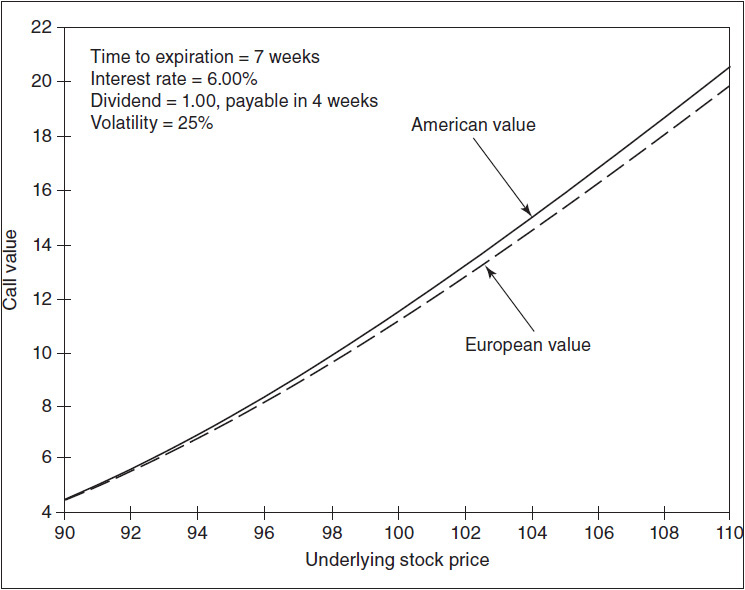

<!-- source:block 0727c6e4b7d07989 -->

> [!quote]- English 177
> Time to expiration = 7 weeks

$$
\text{Time to expiration} = 7 \text{weeks}
$$

<!-- source:block 67718da191cd8f24 -->

> [!quote]- English 178
> Interest rate = 6.00 percent

$$
\text{Interest rate} = 6.00 \text{percent}
$$

<!-- source:block a67d314e6bf21f2b -->

> [!quote]- English 179
> Dividend = 1.00, payable in 4 weeks

$$
\text{Dividend} = 1.00, \text{payable in} 4 \text{weeks}
$$

<!-- source:block 8b210b7e8bf4eda3 -->

> [!quote]- English 180
> Volatility = 25 percent

$$
\text{Volatility} = 25 \text{percent}
$$

<!-- source:block 7df31402f759544b -->

> [!quote]- English 181
> As the underlying stock price rises from 90 to 110, the call moves from out of the money, with a very small likelihood of early exercise, to in the money, with a very high likelihood. Figure 16-9 shows the net difference in values not only at a volatility of 25 percent but also at volatilities of 15 and 35 percent. At a higher volatility, the difference in values is smaller because the American call is less likely to be exercised early. At a lower volatility, the difference is greater because the call is more likely to be exercised early. In all cases, as the option goes more deeply into the money, the difference approaches 0.67, the amount of the dividend less the interest cost of purchasing the stock at 90 the day before the dividend is paid and carrying the position to expiration

随着标的股价从90上涨至110，看涨期权从提前行权的可能性非常小的价外转向提前行权的可能性非常大的价内。图16-9显示了波动率为25%时的净差异，而且波动率为15%和35%时的净差异。在波动率较高的情况下，价值差异较小，因为早期执行美式看涨期权的可能性较小。在波动率较低的情况下，差异更大，因为看涨期权更有可能提前执行。在所有情况下，随着期权更深入地进入货币，差异接近0.67，即股息金额减去在支付股息前一天以90购买股票并将头寸持有至到期的利息成本

<!-- source:block 9252e0504152ef73 -->

*图16-9美国和欧洲90看涨期权的理论价值之差（美国价值减去欧洲价值） / Figure 16-9 Difference between the theoretical value of an American and European 90 call (American value less European value).*

<!-- source:block 96f8d8cbb936a29f -->

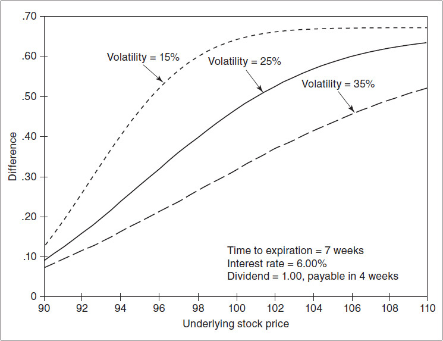

<!-- source:block 5b317dd4f3a0d2cc -->

> [!quote]- English 183
> 1.00 – (90 × 0.06 × 22/365) ≈ 0.67

$$
1.00 - (90 \times 0.06 \times 22/365) \approx 0.67
$$

<!-- source:block 06fd60d9518e2c8b -->

> [!quote]- English 184
> Now consider the value of a 110 put under the same conditions. As with a call, the more deeply the put goes into the money, the greater the difference between the American value and the European value. This can be seen in Figure 16-10. The net difference under three volatility assumptions is shown in Figure 16-11. At a higher volatility, the difference in values is smaller because the American put is less likely to be exercised early. At a lower volatility, the difference is greater because the put is more likely to be exercised early. In all cases, as the option goes more deeply into the money, the difference approaches 0.38, the amount of interest that can be earned on the exercise price for the three weeks remaining to expiration following payment of the dividend

现在考虑在相同条件下110看跌期权的价值。与看涨期权一样，投入资金越深，美国价值和欧洲价值之间的差异就越大。这可以从图16-10中看出。三种波动率假设下的净差异如图16-11所示。在波动率较高的情况下，价值差异较小，因为美国看跌期权不太可能提前执行。在波动率较低的情况下，差异更大，因为看跌期权更有可能提前执行。在所有情况下，随着期权更深入地进入货币，差额接近0.38，即支付股息后剩余三周内行权价可以赚取的利息金额

<!-- source:block f73c541b13846d67 -->

*Figure 16-10 Theoretical value of a 110 put. / Figure 16-10 Theoretical value of a 110 put.*

<!-- source:block 91314d0d858d0567 -->

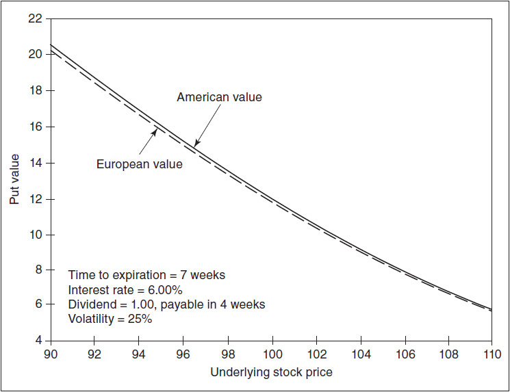

<!-- source:block 648e86381cbba967 -->

*图16-11美国和欧洲110看跌期权理论价值之间的差异（美国价值减去欧洲价值）。 / Figure 16-11 Difference between the theoretical value of an American and European 110 put (American value less European value).*

<!-- source:block 96eaa756e918a560 -->

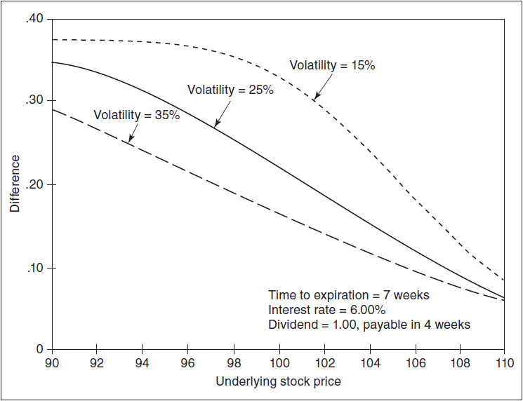

<!-- source:block 544d14b76d7a117c -->

> [!quote]- English 187
> 110 × 0.06 × 21/365 ≈ 0.38

$$
110 \times 0.06 \times 21/365 \approx 0.38
$$

<!-- source:block 44c51867d5e5485d -->

> [!quote]- English 188
> In our discussion of synthetics, we noted that for European stock options, the delta values of a call and put with the same exercise price and expiration date always add up to 100. But, for American options, the deltas can add up to more than 100. This is because the delta of an in-the-money American option goes to 100 more quickly than an equivalent European option. At the same time, the companion out-of-the-money option still retains some delta value. As a result, if we calculate the delta of the synthetic underlying (long call and short put) by adding the American call delta and subtracting the American put delta, we find that the deltas add up to more than 100. Figure 16-12 shows the American delta values for the 100 synthetic under the same conditions as in our preceding example:

在讨论合成头寸时，我们注意到：对于行权价和到期日相同的欧式股票期权，看涨期权与看跌期权的 Delta 之和始终为 100。但对美式期权而言，两者 Delta 之和可能超过 100。这是因为美式价内期权的 Delta 比同等欧式期权更快趋近 100，而对应的价外期权仍保留一定 Delta。因此，用美式看涨期权多头加看跌期权空头构造合成标的头寸时，看涨期权 Delta 减去看跌期权 Delta 后的结果会大于 100。图 16-12 给出了与前例相同条件下、行权价为 100 的合成头寸所对应的美式 Delta：

<!-- source:block 93a50a1ebd169eef -->

*图16-12如果所有期权都是美式期权，则100合成的Delta（100看涨Delta - 100看跌Delta）。 / Figure 16-12 Delta of the 100 synthetic (100 call delta – 100 put delta) if all options are American.*

<!-- source:block a4755b7a5387530a -->

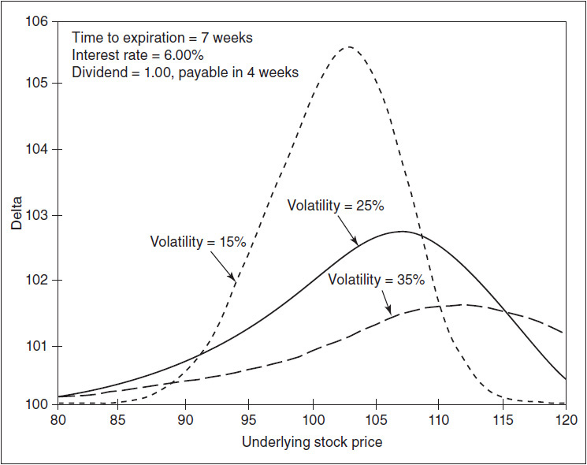

<!-- source:block 0727c6e4b7d07989 -->

> [!quote]- English 190
> Time to expiration = 7 weeks

$$
\text{Time to expiration} = 7 \text{weeks}
$$

<!-- source:block 67718da191cd8f24 -->

> [!quote]- English 191
> Interest rate = 6.00 percent

$$
\text{Interest rate} = 6.00 \text{percent}
$$

<!-- source:block a67d314e6bf21f2b -->

> [!quote]- English 192
> Dividend = 1.00, payable in 4 weeks

$$
\text{Dividend} = 1.00, \text{payable in} 4 \text{weeks}
$$

<!-- source:block 8b210b7e8bf4eda3 -->

> [!quote]- English 193
> Volatility = 25 percent

$$
\text{Volatility} = 25 \text{percent}
$$

<!-- source:block 0d45e913c3a26032 -->

> [!quote]- English 194
> Higher volatility tends to reduce the differences between American and European options, so the delta of the synthetic will remain closer to 100.

较高的波动率往往会缩小美式期权和欧式期权之间的差异，因此合成期权的Delta将保持接近100。

<!-- source:block a2beee4b7c9a3262 -->

> [!quote]- English 195
> Because delta values are affected by the likelihood of early exercise, arbitrage strategies such as conversions and reversals, boxes, and rolls, which may be delta neutral if all options are European, may not be delta neutral if the options are American. Although these strategies may deviate from delta neutral only by a small amount, the fact that they are often done in large sizes can result in additional risk that a trader should not ignore.

由于Delta价值受到提前行权可能性的影响，因此转换和逆转、箱型和滚动等套利策略（如果所有期权都是欧洲期权，这些策略可能是Delta中性的），如果期权是美国期权，这些策略可能不是Delta中性的。尽管这些策略可能只偏离Delta中性值很小，但它们通常是大规模进行的，这一事实可能会导致交易员不应忽视的额外风险。

<!-- source:block 53e1fbe2c6c92163 -->

> [!quote]- English 196
> An American pricing model is necessary to evaluate individual American options, but it may still be possible to estimate the value of some strategies without the use of a pricing model. For example, suppose we know the following:

美式定价模型对于评估单个美式期权是必要的，但是仍然可以在不使用定价模型的情况下估计某些策略的价值。例如，假设我们知道以下内容：

<!-- source:block 8efbb037489877f0 -->

> [!quote]- English 197
> Time to expiration = 24 days

$$
\text{Time to expiration} = 24 \text{days}
$$

<!-- source:block 67718da191cd8f24 -->

> [!quote]- English 198
> Interest rate = 6.00 percent

$$
\text{Interest rate} = 6.00 \text{percent}
$$

<!-- source:block 741578b43927a6ac -->

> [!quote]- English 199
> Dividend = 0.60, payable in 9 days

$$
\text{Dividend} = 0.60, \text{payable in} 9 \text{days}
$$

<!-- source:block 22e52e32fe5c52c2 -->

> [!quote]- English 200
> What should be the value of a 100/110 box if all options are American? To answer this question, we can first evaluate an equivalent European box. Then we can adjust the box value depending on which options might be exercised early.

如果所有期权都是美式的，那么100/110盒子的价值应该是多少？为了回答这个问题，我们可以先评估一个等效的欧洲盒子。然后，我们可以根据哪些期权可能提前行权来调整盒子的价值。

<!-- source:block 8dd40ae7e1373b30 -->

> [!quote]- English 201
> The value of the European box is simply the present value of the amount between exercise prices

欧洲盒子的价值只是行权价之间金额的现值

<!-- source:block 936901d9a666f738 -->

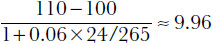

<!-- 原 EPUB 中此公式为图片，已原样保留 -->

<!-- source:block 171e7c0cf042781c -->

> [!quote]- English 202
> Now we can consider the various possibilities for early exercise:

现在我们可以考虑提前行权的各种可能性：

<!-- source:block 02e9171c4718ad4f -->

> [!quote]- English 203
> *Case 1: Both the 100 and 110 put are exercised early*. The puts will be exercised the day the dividend is paid. The box value will increase by the interest earned on 10.00 for 15 days

案例1：100和110看跌期权均提前行权。看跌期权将在支付股息当天行权。盒子价值将增加10.00赚取的利息，持续15天

<!-- source:block b15fec3792f8d127 -->

> [!quote]- English 204
> 9.96 + (10 × 0.06 × 15/365) = 9.96 + 0.025 = 9.985

$$
9.96 + (10 \times 0.06 \times 15/365) = 9.96 + 0.025 = 9.985
$$

<!-- source:block 50ca49d564667bc1 -->

> [!quote]- English 205
> *Case 2: Both the 100 and 110 call are exercised early*. The calls will be exercised the day before the dividend is paid. The box value will increase by the interest earned on 10.00 for 16 days

情况2：100和110看涨期权均提前行权。看涨期权将在支付股息的前一天行权。盒子价值将增加16天内10.00赚取的利息

<!-- source:block dd9bbce868e0c474 -->

> [!quote]- English 206
> 9.96 + (10 × 0.06 × 16/365) = 9.96 + 0.026 = 9.986

$$
9.96 + (10 \times 0.06 \times 16/365) = 9.96 + 0.026 = 9.986
$$

<!-- source:block 0e86be5592f1be41 -->

> [!quote]- English 207
> *Case 3: Only the 110 put is exercised early*. The box value will increase by the interest earned on 110 for 15 days

案例3：只有110看跌期权提前行权。盒子价值将增加110上15天赚取的利息

<!-- source:block d023574a05dd4eaa -->

> [!quote]- English 208
> 9.96 + (110 × 0.06 × 15/365) = 9.96 + 0.271 = 10.231

$$
9.96 + (110 \times 0.06 \times 15/365) = 9.96 + 0.271 = 10.231
$$

<!-- source:block f1d873fdb52008bb -->

> [!quote]- English 209
> *Case 4: Only the 100 call is exercised early*. The box value will increase by the amount of the dividend less the interest cost on 100 for 16 days

情况4：仅提前行权100看涨期权。盒子价值将增加16天的股息金额减去100的利息成本

<!-- source:block 84f3d57c04c64769 -->

> [!quote]- English 210
> 9.96 + 0.60 – (100 × 0.06 × 16/365) = 9.96 + 0.60 – 0.263 = 10.297

$$
9.96 + 0.60 - (100 \times 0.06 \times 16/365) = 9.96 + 0.60 - 0.263 = 10.297
$$

<!-- source:block a6275e76583feca0 -->

> [!quote]- English 211
> *Case 5: Both the 100 call and 110 put are exercised early*. The box value will increase by the amount of the dividend plus the interest earned on 110 for 15 days less the interest cost on 100 for 16 days

情况5：100看涨和110看跌都提前行权。盒子价值将增加股息加上110 15天赚取的利息减去100 16天利息成本

<!-- source:block 79957d257d7deaaf -->

> [!quote]- English 212
> 9.96 + 0.60 + (110 × 0.06 × 15/365) – (100 × 0.06 × 16/365) = 9.96 + 0.60 + 0.271 – 0.263 = 10.568

$$
9.96 + 0.60 + (110 \times 0.06 \times 15/365) - (100 \times 0.06 \times 16/365) = 9.96 + 0.60 + 0.271 - 0.263 = 10.568
$$

<!-- source:block b92298acbaeaa1d4 -->

> [!quote]- English 213
> At very low stock prices, where both puts are early exercise candidates, and at very high stock prices, where both calls are early exercise candidates, the box will have a value close to 9.99. If one option, either the 100 call or 110 put, is an early exercise candidate, the value of the box will be somewhere between 10.23 and 10.30. Finally, the box will have its maximum value of approximately 10.57 if both the 100 call and the 110 put are early exercise candidates. This will occur if both options are in the money, most likely with the stock price close to 105. Volatility must also be low because in a high-volatility market, no one will want to give up an option’s volatility value by exercising early. The value of the 100/110 box at different stock prices and under three different volatility assumptions is shown in Figure 16-13.

在非常低的股价下，两个看跌期权都是早期行权候选者，在非常高的股价下，两个看涨期权都是早期行权候选者，该盒子的价值将接近9.99。如果有一个期权（无论是100看涨还是110看跌）是提前行权候选期权，则方框的值将介于10.23和10.30之间。最后，如果100看涨和110看跌都是提前行权候选者，那么该框的最大值约为10.57。如果两种期权都价内，最有可能的是股价接近105时，就会发生这种情况。波动率也必须很低，因为在高波动率的市场中，没有人愿意通过提前行权来放弃期权的波动率价值。图16-13显示了不同股价和三种不同波动率假设下100/110箱的价值。

<!-- source:block 474e346fc6d318ec -->

*图16-13如果所有期权都是美式期权，则100/110方框的值。 / Figure 16-13 Value of a 100/110 box if all options are American.*

<!-- source:block 7ebbc2659a75dabc -->

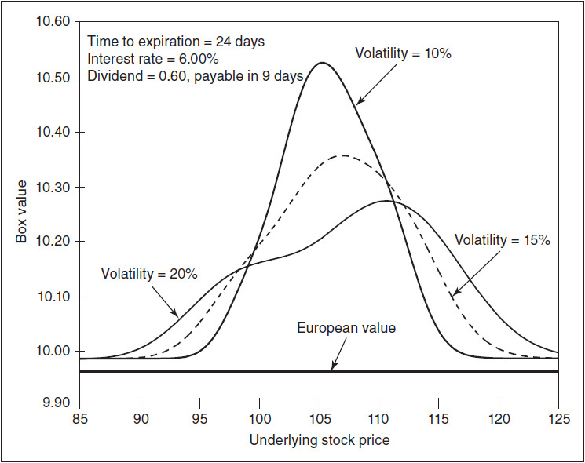

<!-- source:block e1f465bcf69e629b -->

> [!quote]- English 215
> The difference between European and American values is usually greatest for options on dividend-paying stocks. But even futures options, if the options are subject to stock-type settlement, have some additional early exercise value. We can see this in Figure 16-14, the value of a 90 call on a futures contract, where

欧洲和美国价值之间的差异通常是派息股票期权最大的。但即使是期货期权，如果期权需要股票型结算，也有一些额外的早期行权价值。我们可以在图16-14中看到这一点，即期货合约90看涨的价值，其中

<!-- source:block c72e189a3365b802 -->

*图16-14期权须接受股票型结算的期货合约90看涨期权的理论价值。 / Figure 16-14 Theoretical value of a 90 call on a futures contract where the option is subject to stock-type settlement.*

<!-- source:block 91fc3594dcccf607 -->

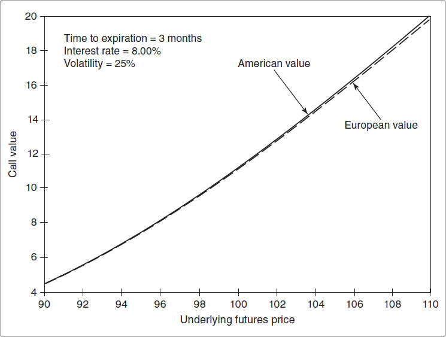

<!-- source:block b8b5a73c2a724f74 -->

> [!quote]- English 217
> Time to expiration = 3 months

$$
\text{Time to expiration} = 3 \text{months}
$$

<!-- source:block d60a15b7e6709839 -->

> [!quote]- English 218
> Interest rate = 8.00 percent

$$
\text{Interest rate} = 8.00 \text{percent}
$$

<!-- source:block 8b210b7e8bf4eda3 -->

> [!quote]- English 219
> Volatility = 25 percent

$$
\text{Volatility} = 25 \text{percent}
$$

<!-- source:block 959e6ceac824e1b2 -->

> [!quote]- English 220
> The difference between the European and American option values is shown in Figure 16-15. Unlike a stock option, where there is a maximum difference, the difference for options on futures continues to increase as the option goes further into the money. This is because the early exercise value depends on the interest that can be earned on the option’s intrinsic value. And the more deeply in the money, the greater the intrinsic value. In our example, with the underlying futures contract trading at 110, the additional early exercise value for the 90 call will approach the interest that can be earned on the intrinsic value

图16-15显示了欧式和美式期权价值的差异。与股票期权不同的是，期货期权的差价会随着期权价值的增加而不断增加。这是因为提前行权价值取决于期权内在价值所能赚取的利息。而且越是价内，内在价值就越大。在我们的例子中，标的期货合约交易价为110，90看涨期权的额外早期行权价值将接近内在价值可以赚取的利息

<!-- source:block 5b1d8426476e14c6 -->

*图16-15期权进行股票型结算的期货合约美国和欧洲90看涨期权理论价值之间的差异（美国价值-欧洲价值）。 / Figure 16-15 Difference between the theoretical value of an American and European 90 call on a futures contract where the options are subject to stock-type settlement (American value – European value).*

<!-- source:block 4405ba4c228ce4c4 -->

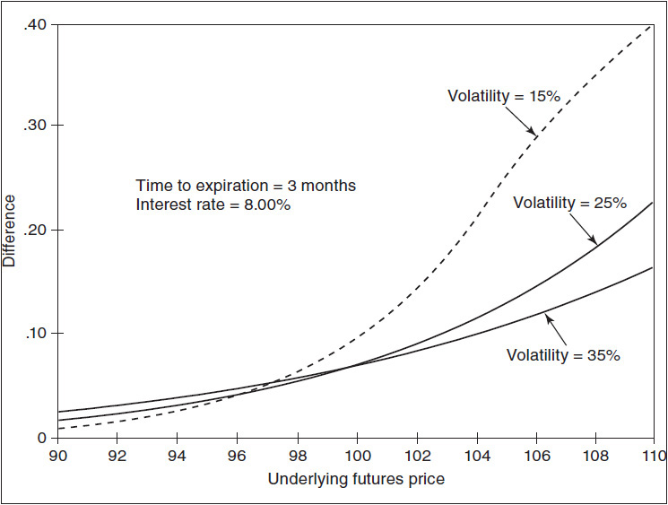

<!-- source:block 531528c8518340db -->

> [!quote]- English 222
> (110 – 90) × 0.08 × 3/12 = 0.40

$$
(110 - 90) \times 0.08 \times 3/12 = 0.40
$$

<!-- source:block a09be60b471563f5 -->

> [!quote]- English 223
> Regardless of the model a trader chooses, the accuracy of model-generated values will depend at least as much on the inputs into the model as on the theoretical accuracy of the model itself. If a trader evaluates an American option using an incorrect volatility, an incorrect interest rate, or an incorrect underlying price, the fact that he derives his values from an American rather than a European model is likely to make little difference. Both models will generate incorrect values because the inputs are incorrect. The American model may produce less error, but that will be small consolation if the incorrect inputs lead to a large trading loss.

无论交易者选择哪种模型，模型生成的值的准确性至少取决于模型的输入和模型本身的理论准确性。如果交易员使用不正确的波动率、不正确的利率或不正确的标的价格来评估美式期权，那么他的价值来自美国而不是欧洲模型这一事实可能不会产生什么影响。由于输入不正确，这两个模型都会生成不正确的值。美国模式可能会产生更少的错误，但如果不正确的输入导致巨大的交易损失，这将是一个小小的安慰。

<!-- source:block bd3b145adb2d208c -->

> [!quote]- English 224
> The importance of early exercise is greatest when there is a significant difference between the cost of carrying an option position and the cost of carrying a position in the underlying contract. This difference can be relatively large in the stock option market, where the cash outlay required to buy stock is much greater than the cash outlay required to buy options. Moreover, dividend considerations will also affect the cost of carrying a stock position compared with the cost of carrying an option position. A trader in a stock option market will usually find that the additional accuracy afforded by an American model will indeed be worthwhile.

当持有期权头寸的成本与持有标的合约中持有头寸的成本之间存在显着差异时，早期行权的重要性最为重要。这种差异在股票期权市场中可能相对较大，购买股票所需的现金支出远高于购买期权所需的现金支出。此外，与持有期权头寸的成本相比，股息考虑也会影响持有股票头寸的成本。股票期权市场的交易员通常会发现，美国模型提供的额外准确性确实是值得的。

<!-- source:block 0bf0abec0b731a79 -->

> [!quote]- English 225
> In futures options markets, where the options are subject to futures-type settlement, there is no cost of carry associated with either options or the underlying futures contract. In this case, a European pricing model will suffice because there is no difference between European and American option values. Even if options on futures are subject to stock-type settlement, there is a relatively small cost associated with carrying an option position because the price of the option is small compared with the price of the underlying futures contract. The additional value for early exercise is therefore small and is only likely to be a consideration for very deeply in-the-money options. Practical considerations, such as the accuracy of the trader’s volatility estimate, his ability to anticipate directional trends in the underlying market, and his ability to control risk through effective spreading strategies, will far outweigh any small advantage gained by using an American rather than a European model.7

在期货期权市场中，期权须接受期货型结算，因此期权或标的期货合约不存在任何相关的套利成本。在这种情况下，欧式定价模型就足够了，因为欧式期权和美式期权之间没有区别 价值观即使期货期权是股票型结算，持有期权头寸的成本也相对较小，因为期权的价格与标的期货合约的价格相比很小。早期行权的额外价值是 因此，规模很小，只可能是非常深入的ITM期权的考虑因素。实际考虑因素，例如交易员波动率估计的准确性、他预测标的市场方向趋势的能力，以及他通过有效控制风险的能力 价差策略将远远超过使用美国模式而不是欧洲模式所获得的任何小优势。 [^ovp16-7]

<!-- source:block bf998790c173824a -->

## 提前行权策略 / Early Exercise Strategies

<!-- source:block a00a21d13b599801 -->

> [!quote]- English 226
> Early exercise of an option is a right rather than an obligation, and there are strategies that depend on someone making an error and not exercising an option early when it ought to be exercised. For example, consider this situation:

行权期权是一种权利而不是一种义务，有些策略取决于某人犯了错误并且在应该行权的时候没有尽早行权期权。例如，考虑这种情况：

<!-- source:block 703ab00fbe4eccb6 -->

> [!quote]- English 227
> Stock price = 98.75

$$
\text{Stock price} = 98.75
$$

<!-- source:block 0cf2eedb0e723cb6 -->

> [!quote]- English 228
> Time to expiration = 5 days

$$
\text{Time to expiration} = 5 \text{days}
$$

<!-- source:block c80cca130f92a04d -->

> [!quote]- English 229
> Dividend = 1.00, payable tomorrow

$$
\text{Dividend} = 1.00, \text{payable tomorrow}
$$

<!-- source:block 1692fd2bfb4341bd -->

> [!quote]- English 230
> Suppose that there is a 90 call that is American and ought to be exercised today in order not to lose the dividend of 1.00. If this is true, the option ought to be worth approximately parity, or 8.75. Suppose that a trader is able to sell a 90 call for 8.75 and at the same time buy 100 shares of stock for 98.75. Because the 90 call ought to be exercised today, the trader probably will be assigned, requiring him to sell the stock at 90. If this occurs, excluding transaction costs, the trader will break even:

假设有一个90看涨期权是美国的，今天应该执行，以避免失去1.00的股息。如果这是真的，那么该期权的价值应该大约为平价，即8.75。假设一名交易员能够以8.75的价格出售90看涨期权，同时以98.75的价格购买100股股票。由于今天应该行权90看涨期权，因此交易员可能会被分配，要求他在90点出售股票。如果发生这种情况，不包括交易成本，交易员将收支平衡：

<!-- source:block d27c964f2e68f1a9 -->

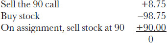

<!-- 原 EPUB 中此公式为图片，已原样保留 -->

<!-- source:block 32675612d8d855aa -->

> [!quote]- English 231
> But suppose that the trader is not assigned on the 90 call. If the stock opens unchanged, its new price will be 97.75 (the stock price of 98.75 less the dividend of 1.00). Because the call is trading at parity, it will open at approximately 7.75. The trader will show a loss of 1.00 on the stock and a profit of 1.00 on the 90 call. But the trader, because he owns the stock, will also receive the dividend. Excluding transaction costs, the profit for the entire position will be equal to the dividend of 1.00.

但假设交易员没有被指派到90看涨期权中。如果该股开盘不变，其新价格将为97.75（股价98.75减去股息1.00）。由于看涨期权以平价交易，开盘价约为7.75。交易员将显示股票损失1.00，90看涨时显示利润1.00。但是交易员，因为他拥有股票，也将获得股息。不包括交易成本，整个头寸的利润将等于股息1.00。

<!-- source:block 1845159c024bfc25 -->

> [!quote]- English 232
> In a *dividend play*, as the ex-dividend day approaches, a trader will try to sell deeply in-the-money calls and simultaneously buy an equal amount of stock. If the trader is assigned on the calls, as he should be, he will essentially break even. But, if he is not assigned, he will show a profit approximately equal to the amount of the dividend. What is the likelihood of the trader being assigned? Because assignment for most exchange-traded options is random, one determinant is the amount of open interest in the call that was sold. The more outstanding call options, the lower the likelihood of assignment. A second determinant is the relative sophistication of the market—whether most market participants are familiar with the criteria for early exercise. Dividend plays were much more common in the early days of option trading when the market was less sophisticated and many options that should have been exercised were not. As markets have become more efficient, only a professional trader with very low transaction costs will try to take advantage of such a possibility. Even then, he may find that he is assigned on the great majority of calls he has sold.

在股息交易中，随着除息日的临近，交易员将尝试深度抛售价内看涨期权，同时购买等量的股票。如果交易员被指派参加看涨期权（他应该这样做），他基本上就会收支平衡。但是，如果他没有被指派，他将显示大约等于股息金额的利润。交易员被指派的可能性有多大？由于大多数交易所交易期权的指派是随机的，一个决定因素是卖出的看涨期权的未平仓合约数量。未行权的看涨期权越多，指派的可能性越低。第二个决定因素是市场的相对复杂性，即大多数市场参与者是否熟悉提前行权的标准。在期权交易的早期，股息交易更为常见，当时市场还不太成熟，许多本应行权的期权都没有行权。随着市场变得更加高效，只有交易成本非常低的专业交易者才会尝试利用这种可能性。即便如此，他可能会发现他所售出的绝大多数看涨期权都被指派了。

<!-- source:block fb36513b0a7eef64 -->

> [!quote]- English 233
> A trader also might attempt to execute an *interest play* by selling stock and simultaneously selling deeply in-the-money American puts that ought to be exercised early. If the puts are not exercised, the trader will profit by the amount of the interest he can earn on the exercise price (the proceeds of the stock sale and the put sale combined). This profit will continue to accrue as long as the puts remain unexercised. If the puts are exercised, the trader does no worse than break even. Again, only a professional trader, with low transaction costs, is likely to attempt such a strategy.

交易者也可能试图通过出售股票并同时出售应该提前行权的深度ITM美国看跌期权来执行利益游戏。 如果看跌期权未被行权，交易者将通过其从行权价中赚取的利息（股票出售和看跌期权出售的合并收益）获利。只要看跌期权未被行权，该利润将继续累积。 如果看跌期权被行权，交易者的表现不会比收支平衡差。同样，只有交易成本较低的专业交易员才会尝试这种策略。

<!-- source:block fd79b1964e4485d4 -->

> [!quote]- English 234
> If options are subject to stock-type settlement, an interest play can also be done in a futures option market by either purchasing a futures contract and simultaneously selling a deeply in-the-money call or selling a futures contract and simultaneously selling a deeply in-the-money put. If the option is deeply enough in the money, it ought to be exercised early. But, if the option remains unexercised, the trader will continue to earn interest on the proceeds from the option sale. Because the amount on which the trader will earn interest is approximately the intrinsic value (the difference between the exercise price and futures price), this will not be as profitable as a similar strategy in the stock option market where the trader will earn interest on the exercise price. Still, if the transaction costs are low enough, it may be worthwhile.

如果期权受股票型结算的约束，则也可以在期货期权市场上通过购买期货合约同时出售深度价内看涨期权或出售期货合约同时出售深度价内看跌期权来进行兴趣游戏。如果期权在金钱上足够深，那么就应该尽早行权。但是，如果期权仍未行权，交易员将继续从期权出售的收益中赚取利息。由于交易者赚取利息的金额大约是内在价值（行权价和期货价格之间的差异），因此这不会像股票期权市场中交易者赚取利息的类似策略那么有利可图。尽管如此，如果交易成本足够低，这可能是值得的。

<!-- source:block 4afd411aee1c5fc7 -->

> [!quote]- English 235
> Instead of entering into an early exercise strategy by selling options and trading the underlying contract, a trader may also be able to execute the strategy by trading deeply in-the-money call or put spreads. In our dividend-play example, the trader sold 90 calls and bought stock. Suppose that both the 85 call and the 90 call ought to be exercised to avoid losing the dividend. If this is true, the 85/90 call spread ought to be worth 5.00, exactly the difference between exercise prices. One might assume that if requested, a market maker will quote a bid price for this spread below 5.00, perhaps 4.90, and an ask price for the spread above 5.00, perhaps 5.10. In fact, a market maker might quote an identical bid and ask price of 5.00. This may seem illogical, quoting the same bid and ask price, but consider what will happen if the market maker is able to either buy or sell the spread at a price of 5.00.

交易者不必通过出售期权并交易标的合约来进入早期行权策略，而是可以通过深度交易ITM 看涨期权或看跌期权价差来行权该策略。在我们的股息玩法示例中，交易员出售了90看涨期权并购买了股票。 假设应该行权85 看涨期权和90 看涨期权以避免失去股息。如果这是真的，则85/90 看涨期权价差应该值5.00，恰好是行权价格之间的差异。 人们可能会假设，如果请求，做市商将为低于5.00（也许是4.90）的该价差报价，并为高于5.00（也许是5.10）的价差报价。事实上，做市商可能会报价相同的买价和要价为5.00。 这似乎不符合逻辑，报价相同，但请考虑如果做市商能够以5.00的价格购买或出售价差，会发生什么。

<!-- source:block 5f5c8d7db654d5e0 -->

> [!quote]- English 236
> If the market maker buys the spread (i.e., buy the 85 call, sell the 90 call), he will immediately exercise the 85 call, thereby purchasing stock. He has effectively entered into the same dividend play that we originally described (i.e., short call, long stock). If he is not assigned on the 90 call, he will again profit by the amount of the dividend. If, instead, the market maker sells the spread (i.e., sell the 85 call, buy the 90 call), he will immediately exercise the 90 call. Now he has executed the dividend play by purchasing stock and selling the 85 call. If he is not assigned on the 85 call, he will again profit by the amount of the dividend. The market maker is willing to give up the edge on the bid-ask spread in return for the potential profit that will result if the short options go unexercised.

如果做市商购买价差（即，买入85看涨，卖出90看涨），他会立即行权85看涨，从而购买股票。他实际上参与了我们最初描述的相同股息游戏（即，空头看涨，多头股票）。如果他没有被指派到90看涨期权中，他将再次通过股息金额获利。相反，如果做市商出售价差（即，卖出85看涨，买入90看涨），他会立即行权90看涨。现在，他通过购买股票并出售85看涨期权来执行股息策略。如果他没有被指派参加85看涨期权，他将再次通过股息金额获利。做市商愿意放弃买卖价差的优势，以换取卖空期权未行权时将产生的潜在利润。

<!-- source:block 8958e9e970592849 -->

## 提前行权风险 / Early Exercise Risk

<!-- source:block e927d5318cee1b01 -->

> [!quote]- English 237
> How concerned should a trader be that an option that he has sold will be exercised early? “What will happen if I am suddenly assigned?” Early assignment can sometimes result in a loss. But there are many factors that can cause a trader to lose money; early exercise is only one such factor. A trader should be prepared to deal with the possibility of early exercise, just as he should be prepared to deal with the possibility of movement in the price of the underlying contract or the possibility of changes in implied volatility. Margin requirements established by the clearinghouses often require a trader to keep sufficient funds in his account to cover the possibility of early assignment. But this is not always true. If the trader is short deeply in-the-money options, an early assignment notice may cause a cash squeeze. If this happens, he will need sufficient capital to cover the situation. Otherwise, he may be forced to liquidate some or all of the remaining position. And forced liquidations are invariably losing propositions.

交易者应该在多大程度上担心他卖出的期权会被提前执行？“如果我突然被指派了怎么办？”过早的指派有时会导致损失。但是有很多因素会导致交易者赔钱;提前行权只是其中一个因素。 交易员应该准备好应对提前行权的可能性，就像他应该准备好应对标的合约价格变动的可能性或隐含波动率变化的可能性一样。 清算所制定的保证金要求通常要求交易员在其账户中保留足够的资金以应对提前指派的可能性。但这并不总是正确的。如果交易者做空深度ITM期权，提前指派通知可能会导致现金短缺。 如果发生这种情况，他将需要足够的资金来应对这种情况。否则，他可能会被迫清算部分或全部剩余头寸。强制清算总是会失败。

<!-- source:block 430b7d3d3dbc11ec -->

> [!quote]- English 238
> In spite of the risk of early assignment, it should rarely come as a surprise. A trader need only ask himself, “If I owned this option, would I logically exercise it now?” If the answer is yes then the trader ought to be prepared for assignment. If the answer is no and the trader is still assigned, it is probably good for the trader. It means that someone has mistakenly abandoned the option’s interest or volatility value. When that happens, the trader who is assigned will find that he is the recipient of an unexpected gift.

尽管有提前指派的风险，但这很少会让人感到意外。交易者只需要问自己：“如果我拥有这份期权，我现在会合理地行权它吗？”如果答案是肯定的，那么交易者应该做好指派的准备。如果答案是否定的，交易者仍然被指派，这可能对交易者有好处。这意味着有人错误地放弃了期权的利息或波动率价值。当这种情况发生时，被指派的交易员会发现他收到了一份意想不到的礼物。

<!-- source:block 42770fcb4939bb0f -->

> [!note] Footnote 239
> 1 Although the companion put also has some interest and dividend value, these components will tend to be small. Changing interest rates or dividends will cause the forward price to change, which is similar to changing the underlying price. But the put, with its small delta, will be relatively insensitive to these changes. Consequently, the out-of-the-money put has only a small interest-rate and dividend value. There is no sensitivity measure for dividends, but we can confirm that the put is relatively insensitive to changes in interest rates by noting that an out-of-the-money option has a small rho value compared with an in-the-money option.

[^ovp16-1]: 尽管配套看跌期权也具有一定的利息和股息价值，但这些成分往往较小。改变利率或股息将导致远期价格发生变化，这类似于改变标的价格。但由于Delta较小，看跌期权对这些变化相对不敏感。因此，价外看跌期权的利率和股息价值很小。没有股息的敏感性衡量标准，但我们可以通过注意到价外期权与价内期权相比具有较小的Rho值来确认看跌期权对利率变化相对不敏感。

<!-- source:block 0e75de6251b3b930 -->

> [!note] Footnote 240
> 2 Figure 16-6 is clearly not drawn to scale. The point at which the European lower arbitrage boundary graph bends appears to be halfway between 90 and 100. The actual point is *X*/(1 + *r* × *t*) + *D* = 90/(1 + 0.06/12) + 0.75 =90.30.

[^ovp16-2]: 图16-6显然没有按比例绘制。欧洲套利下限图表的弯曲点似乎在90和100之间的一半。实际点为X/（1 + r x t）+ D = 90/（1 + 0.06/12）+ 0.75 =90.30。

<!-- source:block d6a6724b050024d8 -->

> [!note] Footnote 241
> 3 Figure 16-7, like Figure 16-6, is not drawn to scale. The point at which the European lower arbitrage boundary graph bends is *X*/(1 + *r* × *t*) + *D* = 120/(1 + 0.06/6) + 0.40 = 119.21.

[^ovp16-3]: 图16-7与图16-6一样，未按比例绘制。欧洲套利下限图弯曲的点是X/（1 + r x t）+ D = 120/（1 + 0.06/6）+ 0.40 = 119.21。

<!-- source:block 1360383024508355 -->

> [!note] Footnote 242
> 4 The term *fugit* is sometimes used to refer to the number of days remaining until an option becomes an immediate early exercise candidate.

[^ovp16-4]: “fugit”一词有时用于指期权成为立即早期行权候选期权之前剩余的天数。

<!-- source:block 09dc9d1465e58056 -->

> [!note] Footnote 243
> 5 John C. Cox, Stephen A. Ross, and Mark Rubinstein, “Option Pricing: A Simplified Approach,” *Journal of Financial Economics* 7:229–263, 1979.

[^ovp16-5]: 约翰·C斯蒂芬·A·考克斯Ross和Mark Rubinstein，“期权定价：简化方法”，Journal of Financial Economics 7：229-263，1979。

<!-- source:block 8377c5b47a479653 -->

> [!note] Footnote 244
> 6 Giovanni Baron-Adesi and Robert Whaley, “Efficient Analytic Approximation of American Option Values,” *Journal of Finance* 42(2):301–320, 1987.

[^ovp16-6]: Giovanni Baron-Adesi和Robert Whaley，“美式期权价值的有效分析逼近”，Journal of Finance 42（2）：301-320，1987。

<!-- source:block 0cd6a9ad2703968c -->

> [!note] Footnote 245
> 7 Early exercise considerations may also be important in a foreign-exchange market if the interest rates associated with the domestic currency (the currency in which the option is settled) and foreign currency (the currency to be delivered in the event of exercise) are significantly different.

[^ovp16-7]: 如果与本币（期权结算的货币）和外币（在行权时交付的货币）相关的利率显着不同，那么在外汇市场上，早期行权的考虑也可能很重要。

---

[[阅读导航|← 返回阅读导航]]

<!-- chapter-nav:start -->
> [!tip] 章节导航（章末）
> [[期权套利 Option Arbitrage|← 上一章]] · [[阅读导航|全书导航]] · [[使用期权进行对冲 Hedging with Options|下一章 →]]
<!-- chapter-nav:end -->
