# 第22章 股票指数期货与期权 / Stock Index Futures and Options

[[阅读导航|← 返回阅读导航]] · [[翻译说明与术语表|术语表]]

> [!warning] 翻译状态
> 本章为机器初译，并使用本地术语表校验。英文原文、数字、公式和图表用于核对；中文将在后续复核中继续修订。

<!-- chapter-toc:start -->
## 本章目录 / Chapter Outline

> [!abstract] 结构导航
> 以下标题按原书顺序保留；点击可直接跳转。

- [[#什么是指数？ / What Is an Index?|什么是指数？ / What Is an Index?]]
  - [[#指数计算 / Calculating an Index|指数计算 / Calculating an Index]]
  - [[#指数除数 / The Index Divisor|指数除数 / The Index Divisor]]
  - [[#总回报指数 / Total-Return Indexes|总回报指数 / Total-Return Indexes]]
  - [[#个股价格变化对指数的影响 / Impact of Individual Stock price Changes on an Index|个股价格变化对指数的影响 / Impact of Individual Stock price Changes on an Index]]
  - [[#成交量加权平均价（VWAP） / Volume-Weighted Average Price|成交量加权平均价（VWAP） / Volume-Weighted Average Price]]
- [[#股票指数期货 / Stock Index Futures|股票指数期货 / Stock Index Futures]]
  - [[#指数套利 / Index Arbitrage|指数套利 / Index Arbitrage]]
  - [[#复制指数 / Replicating an Index|复制指数 / Replicating an Index]]
  - [[#期货市场中的偏差 / Bias in the Futures Market|期货市场中的偏差 / Bias in the Futures Market]]
- [[#股票指数期权 / Stock Index options|股票指数期权 / Stock Index options]]
  - [[#股票指数期货期权 / Options on Stock Index Futures|股票指数期货期权 / Options on Stock Index Futures]]
  - [[#现货指数期权 / Options on a Cash Index|现货指数期权 / Options on a Cash Index]]
<!-- chapter-toc:end -->
<!-- chapter-nav:start -->
> [!tip] 章节导航（章首）
> [[头寸分析 Position Analysis|← 上一章]] · [[阅读导航|全书导航]] · [[模型与现实世界 Models and the Real World|下一章 →]]
<!-- chapter-nav:end -->
<!-- source:block d985bb180cf8906b -->

> [!quote]- English 1
> Because stock index futures and options are among the most actively traded of all derivatives, it will be worthwhile to take a closer look at these contracts. Even though the focus of this book is primarily options, stock index futures and options are so closely related, and so many strategies involve both contracts, that it is almost impossible to discuss one without discussing the other. We will therefore include both instruments in our discussion.

由于股票指数期货和期权是所有衍生品中交易最活跃的，因此值得仔细研究这些合约。尽管本书的重点主要是期权，但股指期货和期权是如此密切相关，而且如此多的策略涉及两种合约，以至于几乎不可能只讨论其中一种而不讨论另一种。因此，我们将把这两项文书都包括在我们的讨论中。

<!-- source:block e2253bdee34940a2 -->

## 什么是指数？ / What Is an Index?

<!-- source:block b663320bee22ebca -->

> [!quote]- English 2
> An *index* is a number that represents the composite value of a group of items. In the case of a stock index, the value of the index is determined by the market prices of the stocks that make up the index. As the stocks in the index rise in price, the value of the index rises; as the stocks fall in price, the value of the index falls. If some stocks in the index rise while others fall, the offsetting changes in stock prices may result in the index itself remaining unchanged, even though the price of every stock in the index may have changed. Although the index is made up of individual stocks, the value of the index always reflects the total value of the stocks that make up the index.

指数是表示一组项目的综合值的数字。就股票指数而言，指数的价值由组成指数的股票的市场价格决定。随着指数中股票价格上涨，指数价值就会上升;随着股票价格下跌，指数价值就会下降。如果指数中的一些股票上涨而另一些股票下跌，那么股价的抵消性变化可能会导致指数本身保持不变，即使指数中每只股票的价格可能都发生了变化。尽管指数由股票组成，但指数的价值始终反映构成指数的股票的总价值。

<!-- source:block b527a797bf24995b -->

> [!quote]- English 3
> Stock indexes are often classified as being either *broad based* or *narrow based*. A broad-based index is usually made up of a large number of stocks and is intended to represent the value of the market as a whole or at least a large portion of the market. Below are some widely followed broad-based indexes.

股指通常分为广义指数或狭义指数。广泛的指数通常由大量股票组成，旨在代表整个市场或至少是市场的大部分价值。以下是一些广泛关注的广泛指数。

<!-- source:block fecafa6a9f7874ea -->

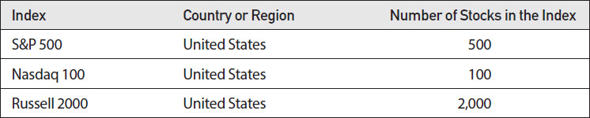

<!-- source:block 1d9ee56b09073bd6 -->

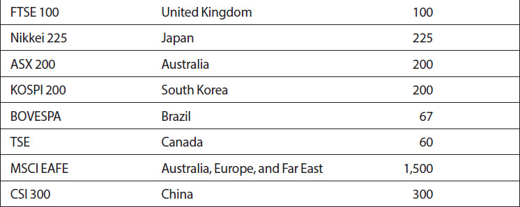

<!-- source:block f94b3f482d1aa902 -->

> [!quote]- English 4
> The designation of an index as broad based can be somewhat subjective. Even if an index is composed of a smaller number of stocks, it may still be considered broad based if the companies that make up the index represent a wide cross section of the economy in a country or region.

将指数指定为广泛指数可能有点主观。即使一个指数由较少数量的股票组成，如果组成该指数的公司代表了一个国家或地区经济的广泛部门，则该指数仍然可能被认为是广泛的。

<!-- source:block 3d240d6db25a1074 -->

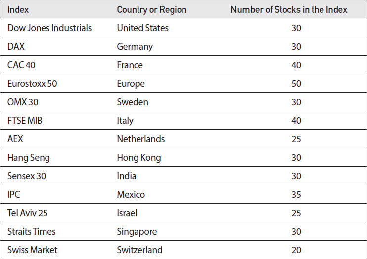

<!-- source:block 9a9b9365a2b73f4f -->

> [!quote]- English 5
> A narrow-based index is usually composed of a small number of stocks and reflects the value of a particular market segment.

狭义指数通常由少量股票组成，反映特定细分市场的价值。

<!-- source:block 9d2c11235d66f6cd -->

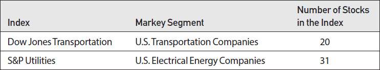

<!-- source:block 8201f692b889d649 -->

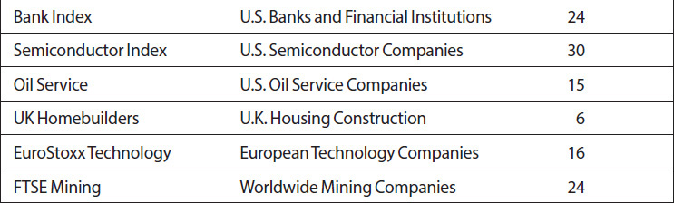

<!-- source:block 8b36967105689a0b -->

### 指数计算 / Calculating an Index

<!-- source:block 13a7272b199aae50 -->

> [!quote]- English 6
> There are several methods that can be used to calculate the value of a stock index, but the most common methods focus on either the prices of the stocks in the index or the *capitalization* of the companies that make up the index. To see how these methods work, consider the ABC Index composed of the following three stocks:

有多种方法可用于计算股票指数的价值，但最常见的方法要么关注指数中股票的价格，要么关注组成指数的公司的市值。要了解这些方法的工作原理，请考虑由以下三只股票组成的ABC指数：

<!-- source:block 41e7075e3ef7df15 -->

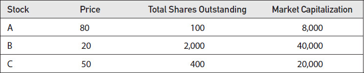

<!-- source:block a5ec874c57e506a4 -->

> [!quote]- English 7
> The market capitalization of each company is equal to the stock price multiplied by the number of outstanding shares. This represents the total value of all stock in the company.

每个公司的市值等于股票价格乘以发行在外的股票数量。这代表了公司所有股票的总价值。

<!-- source:block 7bfab01aa6d94f09 -->

> [!quote]- English 8
> If an index is *price weighted*, the value of the index is the sum of the individual stock prices

如果指数是价格加权的，则指数的价值就是单个股票价格的总和

<!-- source:block e7ae6cae3b57a5d3 -->

> [!quote]- English 9
> ABC Index (price weighted) = ∑ price*i* = 80 + 20 + 50 = 150

$$
\text{ABC Index} (\text{price weighted}) = ∑ \text{price}_{i} = 80 + 20 + 50 = 150
$$

<!-- source:block cd96c3c9633ba3a0 -->

> [!quote]- English 10
> If an index is *capitalization weighted* (*cap weighted* for short), the value of the index is the sum of the individual capitalizations

如果指数是资本加权（简称上限加权），则指数的价值就是各个资本的总和

<!-- source:block c8de5a232858d177 -->

> [!quote]- English 11
> ABC Index (cap weighted) = ∑ (price*i* × sharesi) = 8,000 + 40,000 + 20,000 = 68,000

$$
\text{ABC Index} (\text{cap weighted}) = ∑ (\text{price}_{i} \times \text{shares}_{i}) = 8{,}000 + 40{,}000 + 20{,}000 = 68{,}000
$$

<!-- source:block 51317032f03ef6b1 -->

> [!quote]- English 12
> Suppose that the price of Stock A rises 10 percent to 88. How will the value of the ABC Index change if the index is price weighted? The new index value will be

假设股票A的价格上涨10%至88。如果ABC指数是价格加权的，该指数的价值将如何变化？新指数值将是

<!-- source:block 17ffc055ff5a9cce -->

> [!quote]- English 13
> 88 + 20 + 50 = 158

$$
88 + 20 + 50 = 158
$$

<!-- source:block 98e8ecebe40489d7 -->

> [!quote]- English 14
> In percent terms, this is an increase of

按百分比计算，这是一个增长，

<!-- source:block 23f9fff31f201f5a -->

> [!quote]- English 15
> 8/150 = 5.33%

$$
8/150 = 5.33\%
$$

<!-- source:block 9666ec53585d0607 -->

> [!quote]- English 16
> We can make the same calculation for the price-weighted index if Stock B rises 10 percent to 22 or if Stock C rises 10 percent to 55. The percent increases in the index are

如果股票B上涨10%至22或股票C上涨10%至55，我们可以对价格加权指数进行相同的计算。该指数的增幅百分比为

<!-- source:block 5ded019081063e53 -->

> [!quote]- English 17
> Stock B: 2/150 = 1.33%

$$
\text{Stock B}: 2/150 = 1.33\%
$$

<!-- source:block 3c8751cd94f03366 -->

> [!quote]- English 18
> Stock C: 5/150 = 3.33%

$$
\text{Stock C}: 5/150 = 3.33\%
$$

<!-- source:block 186a28bca257d36c -->

> [!quote]- English 19
> In percent terms, changes in the highest-priced stock, Stock A, have the greatest effect on the value of the index. Stock A has the greatest index *weighting*—it accounts for the largest portion of the index. We can calculate the role that each stock plays in the index by calculating the individual weightings:

以百分比计算，价格最高的股票A股的变化对指数价值的影响最大。A股的指数权重最大，占指数的最大部分。我们可以通过计算单个权重来计算每只股票在指数中所扮演的角色：

<!-- source:block 204f94db441c1441 -->

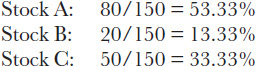

<!-- 原 EPUB 中此公式为图片，已原样保留 -->

<!-- source:block ae10e5b2883835df -->

> [!quote]- English 20
> We can also calculate the weightings for each stock (with small rounding errors) if the ABC Index is capitalization weighted:

如果ABC指数是资本加权的，我们还可以计算每只股票的权重（四舍五入误差很小）：

<!-- source:block e85e41c918e225fb -->

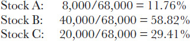

<!-- 原 EPUB 中此公式为图片，已原样保留 -->

<!-- source:block cffea01cb8f1a3d9 -->

> [!quote]- English 21
> Now Stock B, the stock with the greatest capitalization, has the greatest index weighting.

现在，市值最高的股票B拥有最大的指数权重。

<!-- source:block fe4c60a58026a669 -->

> [!quote]- English 22
> In a price-weighted index, stocks with the highest price have the greatest index weighting. In a capitalization-weighted index, stocks with the greatest capitalization (stocks with a large number of outstanding shares) have the greatest weighting.

在价格加权指数中，价格最高的股票具有最大的指数权重。在资本加权指数中，资本最大的股票（拥有大量流通股的股票）的权重最大。

<!-- source:block cd64ffdc5e307be8 -->

> [!quote]- English 23
> We can also create an *equal-weighted* index where, in percent terms, each stock plays exactly the same role in the index. We can do this by making the initial contribution of each stock to the index identical. For example, suppose that initially the value of our index is

我们还可以创建一个等加权指数，其中，以百分比计算，每只股票在指数中扮演完全相同的角色。我们可以通过使每只股票对指数的初始贡献相同来做到这一点。例如，假设我们的指数的值最初是

<!-- source:block b0939d2ce79aebde -->

> [!quote]- English 24
> ∑ (price*i*/price*i*) = 1 + 1 + 1 = 3

$$
∑ (\text{price}_{i}/\text{price}_{i}) = 1 + 1 + 1 = 3
$$

<!-- source:block 86195d06de28bb9f -->

> [!quote]- English 25
> Here each stock contributes exactly 33.33 percent to the index. Of course, if we always divide each stock by itself, the value of the index will never change. But this is only the value when the index is first introduced. Subsequently, as the price of each stock changes, the new price is divided by the old price to determine the new value of the index. If any one stock in the index rises 10 percent, the effect on the index will be the same because

这里每只股票对指数的贡献率恰好为33.33%。当然，如果我们总是将每只股票除以本身，那么指数的价值永远不会改变。但这只是该指数首次推出时的价值。随后，随着每只股票的价格变化，新价格除以旧价格，以确定指数的新值。如果指数中任何一只股票上涨10%，对指数的影响将是相同的，因为

<!-- source:block aaa849bfb82c7ca4 -->

> [!quote]- English 26
> 88/80 = 22/20 = 55/50

$$
88/80 = 22/20 = 55/50
$$

<!-- source:block 02e89d466a9b5295 -->

> [!quote]- English 27
> If all three stocks rise 10 percent, the new value of the index will be

如果这三只股票全部上涨10%，该指数的新值将是

<!-- source:block dee3379e0b195702 -->

> [!quote]- English 28
> 88/80 + 22/20 + 55/50 = 1.10 + 1.10 + 1.10 = 3.30

$$
88/80 + 22/20 + 55/50 = 1.10 + 1.10 + 1.10 = 3.30
$$

<!-- source:block 614484b2168f1764 -->

> [!quote]- English 29
> The index will rise exactly 10 percent.1

该指数将上涨10点。[^ovp22-1]

<!-- source:block eeb26d6a64f965eb -->

> [!quote]- English 30
> As time passes and some stocks in an equal-weighted index outperform other stocks, the weighting of the stocks will change so that the index will no longer be equal weighted. In order to ensure that each stock in the index accounts for approximately the same value, equal-weighted indexes are periodically *rebalanced*.

随着时间的推移，等加权指数中的一些股票表现优于其他股票，这些股票的权重将会发生变化，使指数不再具有等加权。为了确保指数中每只股票所占的价值大致相同，等加权指数会定期进行重新平衡。

<!-- source:block c68dd02337d0dc84 -->

> [!quote]- English 31
> Suppose that at a later date the prices of Stocks A, B, and C are 76, 25, and 51, respectively. The value of the equal-weighted index now will be

假设稍后股票A、B和C的价格分别为76、25和51。现在等加权指数的价值将是

<!-- source:block 508dba2053249659 -->

> [!quote]- English 32
> 76/80 + 25/20 + 51/50 = 0.95 + 1.25 + 1.02 = 3.22

$$
76/80 + 25/20 + 51/50 = 0.95 + 1.25 + 1.02 = 3.22
$$

<!-- source:block 4328b46eb87f87d6 -->

> [!quote]- English 33
> Stock B now accounts for a greater portion of the index than either Stock A or Stock C. To ensure that all stocks again have an equal weighting, the index is now rebalanced

股票B现在在指数中所占的比例大于股票A或股票C。为了确保所有股票再次拥有平等的权重，该指数现已重新平衡

<!-- source:block f42a68309a494c14 -->

> [!quote]- English 34
> 76/76 + 25/25 + 51/51 = 3.00

$$
76/76 + 25/25 + 51/51 = 3.00
$$

<!-- source:block cfcbd3dae0b5ce5c -->

> [!quote]- English 35
> Of course, the index value of 3.00 seems inconsistent with the preceding index value of 3.22. In order to generate a continuous index value, the index value after the rebalancing must be multiplied by the percent increase in the index during the previous rebalancing period. In our example, the index after the rebalancing, we must multiply the index value by

当然，指数值3.00似乎与之前的指数值3.22不一致。为了生成连续的指数值，重新平衡后的指数值必须乘以上一个重新平衡期间指数的百分比增加。在我们的例子中，重新平衡后的指数，我们必须将指数值乘以

<!-- source:block 91cf4279ecbce5de -->

> [!quote]- English 36
> 3.22/3.00 = 1.0733

$$
3.22/3.00 = 1.0733
$$

<!-- source:block 8b4cc74ac7dbc7cd -->

> [!quote]- English 37
> because the index rose by 7.33 percent over the last rebalancing period.

因为该指数在上一个再平衡期上涨了7.33%。

<!-- source:block 10572aa651f0bd8b -->

> [!quote]- English 38
> It is a relatively easy task to add up a list of individual stock prices. Consequently, the earliest indexes were price weighted. The Dow Jones Industrial Average, introduced in 1896, is probably the best known of all price-weighted indexes. However, a capitalization-weighted index gives a more accurate picture of each company’s value. With the advent of computer technology to make the calculations, most widely followed indexes are now capitalization weighted.

汇总单个股票价格列表是一项相对容易的任务。因此，最早的指数是价格加权的。道琼斯工业平均指数于1896年推出，可能是所有价格加权指数中最著名的。然而，资本加权指数可以更准确地反映每家公司的价值。随着计算机技术的出现来进行计算，最广泛关注的指数现在都是资本加权的。

<!-- source:block 0f2a69bf58eb5940 -->

> [!quote]- English 39
> The total capitalization of a company depends on the number of outstanding shares in the company. However, company restrictions may prevent some of these shares from being available for trading. Shares held in the company treasury, by company officers, or in employee investment plans may not be available to the public. The shares that are available for trading are referred to as the *free float*, and it is the number of shares in the free float that typically is used to calculate the value of a capitalization-weighted index.

公司的总资本取决于公司已发行股票的数量。然而，公司限制可能会阻止其中一些股票可供交易。公司金库、公司高管或员工投资计划中持有的股份可能不向公众开放。可供交易的股票称为自由流通股，通常用于计算资本加权指数价值的自由流通股中的股票数量。

<!-- source:block 8df0e3e83bab5dd9 -->

### 指数除数 / The Index Divisor

<!-- source:block 46e53722ce758e94 -->

> [!quote]- English 40
> When an index is first introduced, it is common to set the value of the index to some round number. Suppose that we initially want the value of the ABC Index to be 100. To accomplish this, we must adjust the raw index price of either 150 (price weighted) or 68,000 (cap weighted) by using a *divisor* to achieve our target value of 100. Because

当首次引入索引时，通常会将索引的值设置为某个舍入数。假设我们最初希望ABC指数的值为100。为了实现这一目标，我们必须使用约数调整150（价格加权）或68,000（上限加权）的原始指数价格，以实现我们的目标值100。因为

<!-- source:block 675cf8ef8af9ed43 -->

> [!quote]- English 41
> Raw index value/divisor = target index value

$$
\text{Raw index value}/\text{divisor} = \text{target index value}
$$

<!-- source:block e1a7a1addbb51f13 -->

> [!quote]- English 42
> the divisor must be

除数必须是

<!-- source:block ce17f6345c194470 -->

> [!quote]- English 43
> Divisor = target index value/raw index value

$$
\text{Divisor} = \text{target index value}/\text{raw index value}
$$

<!-- source:block eeef866847ea2ffd -->

> [!quote]- English 44
> For our ABC Indexes, the respective divisors are

对于我们的ABC指数，各自的因子为

<!-- source:block 951708174ccc981d -->

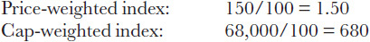

<!-- 原 EPUB 中此公式为图片，已原样保留 -->

<!-- source:block 550c0f3914864e91 -->

> [!quote]- English 45
> Once the divisor has been determined, all subsequent index calculations are made by dividing the raw index value by the divisor. If the price of Stock B rises to 25, the price-weighted index value, which was initially 100, will now be

确定约数后，所有后续指数计算都是通过将原始指数值除以约数来进行的。如果B股的价格上涨到25，那么最初为100的价格加权指数值现在将是

<!-- source:block 5437fe394cfd83a3 -->

> [!quote]- English 46
> (80 + 25 + 50)/1.50 = 155/1.50 = 103.33

$$
(80 + 25 + 50)/1.50 = 155/1.50 = 103.33
$$

<!-- source:block 5606711a1ff46375 -->

> [!quote]- English 47
> The capitalization of Company B will now be 25 × 2,000 = 50,000, and the cap-weighted index value will be

B公司的市值现在为25 × 2,000 = 50,000，上限加权指数值为

<!-- source:block 2bdded0f00380b8f -->

> [!quote]- English 48
> (8,000 + 50,000 + 20,000)/680 = 78,000/680 = 114.71

$$
(8{,}000 + 50{,}000 + 20{,}000)/680 = 78{,}000/680 = 114.71
$$

<!-- source:block a690fc0ca3f3fad6 -->

> [!quote]- English 49
> It is sometimes necessary to adjust the divisor to ensure that the index accurately reflects the performance of the component stocks. Consider what will happen if Stock A, which was trading at 80, splits 2 for 1. The stock price is now 40, but with 200 shares outstanding. Stock price total Shares outstanding Market Capitalization

有时需要调整约数，以确保指数准确反映成分股的表现。考虑一下，如果A股交易价为80，将2比1分拆会发生什么。目前股价为40，但已发行200股。股价总数已发行股份市值

<!-- source:block 799909ffc045bc94 -->

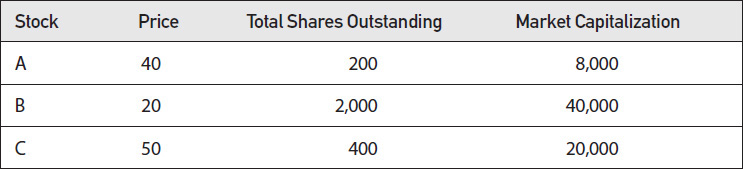

<!-- source:block 95c0d64e6b89fca9 -->

> [!quote]- English 50
> If the ABC Index is price weighted, the index value, which was previously 100 (using our divisor of 1.50), will now be

如果ABC指数是价格加权的，则指数值之前为100（使用我们的约数1.50），现在将为

<!-- source:block 77535153a26c708c -->

> [!quote]- English 51
> (40 + 20 + 50)/1.50 = 110/1.50 = 73.33

$$
(40 + 20 + 50)/1.50 = 110/1.50 = 73.33
$$

<!-- source:block 168781fc2ca19ab2 -->

> [!quote]- English 52
> But is this logical? From the point of view of an investor in Company A, the value of his holdings has not changed, so why should the index value change? To generate a continuous and logical index value, the index divisor must be adjusted. With a new raw index value of 110 and a target index value of 100 (assuming that no other price changes occurred), the new index divisor will be

但这合乎逻辑吗？从A公司投资者的角度来看，他持有的价值没有变化，那么为什么指数价值要变化呢？要生成连续且逻辑的索引值，必须调整索引因子。新的原始指数值为110，目标指数值为100（假设没有发生其他价格变化），新的指数约数将为

<!-- source:block 5478321c2925aeb9 -->

> [!quote]- English 53
> New divisor = 110/100 = 1.10

$$
\text{New divisor} = 110/100 = 1.10
$$

<!-- source:block ea502c26312f8aba -->

> [!quote]- English 54
> When an index divisor is adjusted, the organization responsible for calculating the index will typically issue a press release announcing the new divisor and the reason for the adjustment: “The new ABC Index divisor is 1.10 as a result of the 2 for 1 stock split of Company A.”

当调整指数约数时，负责计算指数的组织通常会发布新闻稿，宣布新约数和调整原因：“由于A公司2比1股票分拆，新ABC指数约数为1.10。”

<!-- source:block 50c12f2551327516 -->

> [!quote]- English 55
> How will the 2 for 1 stock split affect the divisor in our cap-weighted ABC Index? We can see that the capitalization of Stock A is unchanged at 8,000. Therefore, no adjustment is required. The divisor is still 680.

2比1的股票分割将如何影响我们的上限加权ABC指数中的约数？我们可以看到A股的市值不变，为8,000。因此，无需调整。约数仍然是680。

<!-- source:block b1d7762bccfc7512 -->

> [!quote]- English 56
> The component stocks that make up an index are not permanent. A company may cease to exist because it has gone out of business or because it has been taken over by another company. Or a company may no longer meet the criteria for inclusion in an index because its price or capitalization has dropped below some threshold. To maintain a constant number of index components, a company that is removed from an index must be replaced with a new company. This will require an adjustment to the divisor.

构成指数的成分股不是永久性的。一家公司可能因倒闭或被另一家公司收购而不复存在。或者，一家公司可能不再符合纳入指数的标准，因为其价格或资本已降至某个阈值以下。为了保持指数成分数量不变，从指数中删除的公司必须用新公司替换。这需要调整分母。

<!-- source:block f5a640349eaee121 -->

> [!quote]- English 57
> Suppose that Company C is replaced in the ABC Index with Company D, currently trading at 75 with 500 shares outstanding:

假设ABC指数中C公司被D公司取代，D公司目前交易价为75股，发行股数为500股：

<!-- source:block 7e67573504830470 -->

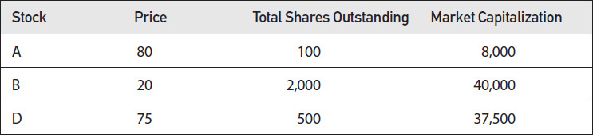

<!-- source:block e86e1c45927d0a1e -->

> [!quote]- English 58
> The new divisors for ABC Index will be

ABC指数的新因子将是

<!-- source:block d32b493433ef4912 -->

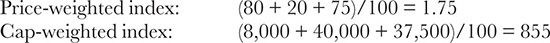

<!-- 原 EPUB 中此公式为图片，已原样保留 -->

<!-- source:block 3d59e1b903f2d947 -->

### 总回报指数 / Total-Return Indexes

<!-- source:block 28cb20653def6d86 -->

> [!quote]- English 59
> In a traditional stock index, when the price of a component stock falls, the price of the index will fall. This is true even if the price decline is the result of a dividend payout. In a *total-return index*, all dividends are assumed to be immediately reinvested in the index. Consequently, stock price declines resulting from a dividend payout do not cause the index value to decline.

在传统的股指中，当成分股价格下跌时，指数价格就会下跌。即使价格下跌是股息支付的结果，这也是正确的。在总回报指数中，假设所有股息立即再投资于该指数。因此，股息支付导致的股价下跌不会导致指数价值下跌。

<!-- source:block a7cd29b159eff9e0 -->

> [!quote]- English 60
> The value of the price-weighted ABC Index composed of our original three stocks with a divisor of 1.50 is

由我们最初的三只股票组成的价格加权ABC指数，其分母为1.50

<!-- source:block 5d8d49430755860e -->

> [!quote]- English 61
> (80 + 20 + 50)/1.50 = 100.00

$$
(80 + 20 + 50)/1.50 = 100.00
$$

<!-- source:block 736e32f364fb1c4d -->

> [!quote]- English 62
> If Stock A pays a dividend of 1.00 and opens at a price of 79 on the ex-dividend day, the opening index value will be

如果A股派息1.00，除息日开盘价为79，则开盘指数值为

<!-- source:block 0fb53d582f651c1e -->

> [!quote]- English 63
> (79 + 20 + 50)/1.50 = 99.33

$$
(79 + 20 + 50)/1.50 = 99.33
$$

<!-- source:block 66114fb5d1f9ba2f -->

> [!quote]- English 64
> But if the ABC Index is a total-return index, the opening index value will remain at 100 because the 1.00 decline in Stock A was solely the result of the dividend payout. To maintain an index value of 100, the index divisor must be adjusted to 1.49 because

但如果ABC指数是总回报指数，则开盘指数值将保持在100，因为A股下跌1.00完全是派息的结果。要保持指数值为100，指数约数必须调整为1.49，因为

<!-- source:block 12f1e0bd200e3fdc -->

> [!quote]- English 65
> (79 + 20 + 50)/1.49 = 100.00

$$
(79 + 20 + 50)/1.49 = 100.00
$$

<!-- source:block 9cdea9bb354eb375 -->

> [!quote]- English 66
> Whenever a component stock in a total-return index pays a dividend, the divisor will be adjusted to reflect the dividend payout.

每当总回报指数中的成分股支付股息时，分母就会被调整以反映股息支付。

<!-- source:block 645413d3e3a74d40 -->

> [!quote]- English 67
> Although they are less common than traditional indexes, there are some widely followed total-return indexes. The best known of these is probably the German DAX Index. Occasionally, an index, such as the Standard and Poor’s (S&P) 500 Index, will be published in two versions, as both a traditional index and a total-return index. The former, however, is much more widely followed.

尽管它们比传统指数不那么常见，但也有一些广泛关注的总回报指数。其中最著名的可能是德国DAX指数。有时，标准普尔（S & P）500指数等指数会以两种版本发布，既作为传统指数又作为总回报指数。然而，前者得到了更广泛的关注。

<!-- source:block 93031443f0ff1c52 -->

### 个股价格变化对指数的影响 / Impact of Individual Stock price Changes on an Index

<!-- source:block aec2533c94a63283 -->

> [!quote]- English 68
> If an individual component stock price changes, how will this affect the value of an index? Suppose that the current value of the price-weighted ABC Index is *I*. If the price of Stock A (price *A*) changes by an amount *a*, what will be the new value of the index? The raw value of the index should rise by *a* because

如果单个成分股价格发生变化，将如何影响指数的价值？假设价格加权ABC指数的现值为I。如果股票A的价格（价格A）变化幅度为a，那么指数的新值将是多少？该指数的原始值应该上涨a，因为

<!-- source:block 7cd3bede0b22e1fe -->

> [!quote]- English 69
> (*A* + *a*) + *B* + *C* = *I* + *a*

$$
(A\,+\,a) +\,B +\,C =\,I +\,a
$$

<!-- source:block aabd553ecd824844 -->

> [!quote]- English 70
> In percent terms, the change in the index is *a*/*I*. Suppose that we rewrite *a*/*I* in a slightly different form

以百分比计算，指数的变化为a/I。假设我们以稍微不同的形式重写a/I

<!-- source:block 04fcf5d69870b2c8 -->

> [!quote]- English 71
> *a*/*I* = (*a*/*A*) × (*A*/*I*)

$$
\frac{a}{I}\,= (\frac{a}{A}) \times (\frac{A}{I})
$$

<!-- source:block 3ba41cbf0a19e9bb -->

> [!quote]- English 72
> *a*/*A* is the percent change in the stock price, while *A*/*I* is the stock’s weighting in the index. The percent change in the index must therefore be equal to the percent change in the stock multiplied by the stock’s weighting in the index. This is true regardless of whether the index is price weighted, cap weighted, or equal weighted.

a/A是股价的百分比变化，而A/I是股票在指数中的权重。因此，指数的百分比变化必须等于股票的百分比变化乘以股票在指数中的权重。无论指数是价格加权、上限加权还是同等加权，这都是正确的。

<!-- source:block fc364a51a3107924 -->

> [!quote]- English 73
> We can confirm this through an example. Suppose that Stock A in the price-weighted ABC Index, currently trading at 100 with a divisor of 1.50, rises one point. The new index value is

我们可以通过一个例子来证实这一点。假设价格加权ABC指数中的股票A，目前交易价格为100，除数为1.50，上涨1点。新索引值为

<!-- source:block 8a1597a11a916874 -->

> [!quote]- English 74
> (81 + 20 + 50)/1.50 = 151/1.50 = 100.67

$$
(81 + 20 + 50)/1.50 = 151/1.50 = 100.67
$$

<!-- source:block b45da9b2726d29fd -->

> [!quote]- English 75
> The weighting of Stock A (before its one-point rise) was 53.33 percent, so the percent change in the index should be

A股的权重（在上涨一个百分点之前）为53.33%，因此该指数的百分比变化应为

<!-- source:block abf0548041426f00 -->

> [!quote]- English 76
> 0.5333 × (1/80) = 0.5333 × 0.0125 = 0.0067

$$
0.5333 \times (1/80) = 0.5333 \times 0.0125 = 0.0067
$$

<!-- source:block 2e63f1f588c6282a -->

> [!quote]- English 77
> From this we get a new index value of

由此我们得到一个新的指数值

<!-- source:block 43178d4eaeebf641 -->

> [!quote]- English 78
> (1 + 0.0067) × 100 = 100.67

$$
(1 + 0.0067) \times 100 = 100.67
$$

<!-- source:block 798bd1d15585c6b5 -->

> [!quote]- English 79
> For the cap-weighted ABC Index, currently trading at 100 with a divisor of 680, the new index value will be

对于上限加权ABC指数（目前交易价为100，分母为680），新指数值将为

<!-- source:block 2a5ab00734db9a50 -->

> [!quote]- English 80
> [(81 × 100) + 40,000 + 20,000]/680 = 68,100/680 = 100.147

$$
[(81 \times 100) + 40{,}000 + 20{,}000]/680 = 68{,}100/680 = 100.147
$$

<!-- source:block a0724efa29a94f39 -->

> [!quote]- English 81
> The weighting of Stock A (before its one-point rise) was 11.76 percent, so the percent change in the index should be

A股权重（上涨一个百分点前）为11.76%，因此该指数的百分比变化应为

<!-- source:block ef9339b7957d9243 -->

> [!quote]- English 82
> 0.1176 × (1/80) = 0.1176 × 0.0125 = 0.00147

$$
0.1176 \times (1/80) = 0.1176 \times 0.0125 = 0.00147
$$

<!-- source:block 3d6cfbce0f0bb8cb -->

> [!quote]- English 83
> From this we get a new index value of

由此我们得到一个新的指数值

<!-- source:block b1420ca77de08734 -->

> [!quote]- English 84
> (1 + 0.00147) × 100 = 100.147

$$
(1 + 0.00147) \times 100 = 100.147
$$

<!-- source:block d730b051b089fe41 -->

> [!quote]- English 85
> As the price of each stock changes, the new index price is

随着每只股票价格的变化，新指数价格为

<!-- source:block 32a72b08397bfa3d -->

> [!quote]- English 86
> Old index price × (1 + ∑ percent change*i* × weight*i*)

$$
\text{Old index price} \times (1 + ∑ \text{percent change}_{i} \times \text{weight}_{i})
$$

<!-- source:block f62e55c2c7b14bc3 -->

> [!quote]- English 87
> For a price-weighted index, if we know the index divisor, we can simplify this calculation by noting that the change in the index per one-point move in any individual component is always given by

对于价格加权指数，如果我们知道指数除数，我们可以简化计算，注意到任何单个成分每移动一点指数的变化总是由下式给出：

<!-- source:block f1e58e20d314af13 -->

> [!quote]- English 88
> Change in stock price/divisor

$$
\text{Change in stock price}/\text{divisor}
$$

<!-- source:block a76cd8236bff2d0b -->

> [!quote]- English 89
> Each 1.00 change in a stock in the price-weighted ABC Index will cause the index to change by

价格加权ABC指数中股票每发生1.00变化，将导致该指数变化

<!-- source:block 08b39614d73c6163 -->

> [!quote]- English 90
> 1.00/1.50 = 0.67

$$
1.00/1.50 = 0.67
$$

<!-- source:block 22eef6f760ab3c75 -->

> [!quote]- English 91
> It may seem odd that every point change in a component stock has the same effect on an index. If a component stock rises one point and then rises a second point, the second point will cause a smaller percent increase in the stock price. One might therefore expect the second point to have a smaller effect on the index. But this is offset by the fact that each point increase in the stock also increases the stock’s weighting in the index. Taken together, the percent change in the stock and its weighting combine to yield a constant point change in the index.

一只成份股的每一个点的变化对一个指数的影响都是一样的，这似乎很奇怪。如果一只成份股上涨一个点，然后上涨第二个点，第二个点将导致股价上涨较小的百分比。因此，人们可能会认为第二点对指数的影响较小。但这被一个事实所抵消，即股票的每一点上涨也会增加股票在指数中的权重。总而言之，股票的百分比变化及其权重结合在一起，会产生指数的恒定点变化。

<!-- source:block 4bb4ea5251915fbf -->

> [!quote]- English 92
> A trader can occasionally use the foregoing calculations to make a more accurate estimate of an index’s true value. Most indexes are calculated from the last trade price of each component stock. But the last trade price may not be an accurate reflection of where the stock is currently trading. Suppose that trading in an index component stock has been temporarily halted.2 The index value will be based on the last trade price of the halted stock, but this last price may differ significantly from the expected price when trading in the stock resumes.

交易者偶尔可以使用上述计算来更准确地估计指数的真实价值。大多数指数是根据每只成分股的最后交易价格计算的。但最后的交易价格可能并不能准确反映股票当前的交易位置。假设指数成分股的交易已暂时停止。[^ovp22-2]指数值将基于停止股票的最后一个交易价格，但该最后一个价格可能与股票恢复交易时的预期价格存在显着差异。

<!-- source:block ca6fd3530ec760f8 -->

> [!quote]- English 93
> Suppose that the current value of an index is 1,425.50 and that the last trade price for a component stock is 63.00. However, trading in the stock has been halted pending news that is expected to cause the stock price to rise significantly. Although no one knows the exact price at which the stock will reopen, the indication (very often disseminated by the exchange) is somewhere between 67.50 and 68.00. If the weighting of the stock in the index is 2.5 percent, an index trader might use a price of 67.75 to estimate the new index price when the stock reopens, that is,

假设指数的当前值为1,425.50，而成分股的最后交易价格为63.00。然而，该股已暂停交易，等待预计导致股价大幅上涨的消息。尽管没有人知道该股重新开盘的确切价格，但该指示（交易所经常传播）在67.50至68.00之间。如果该股在指数中的权重为2.5%，则指数交易员可能会使用67.75的价格来估计该股重新开盘时的新指数价格，即

<!-- source:block 19b9dd38c3752921 -->

> [!quote]- English 94
> 1,425.50 × [1 + .025 × (67.75 – 63.00)/63.00] = 1,428.19

$$
1{,}425.50 \times [1 + .025 \times (67.75 - 63.00)/63.00] = 1{,}428.19
$$

<!-- source:block b609f54ff61d33b6 -->

> [!quote]- English 95
> Alternatively, the trader may have already determined that each point change in the stock price will cause a change of 0.57 in the index value, yielding a new index estimate of

或者，交易者可能已经确定股价的每个点变化都会导致指数值变化0.57，从而产生新的指数估计值

<!-- source:block ea70767b8b2bb7fd -->

> [!quote]- English 96
> 1,425.50 + (4.75 × .57) = 1,428.21

$$
1{,}425.50 + (4.75 \times .57) = 1{,}428.21
$$

<!-- source:block 2f144caebe3a634a -->

> [!quote]- English 97
> Either estimate will enable the trader to make a more informed decision.

任何一种估计都能使交易者做出更明智的决定。

<!-- source:block c9f83ee00fc3646e -->

### 成交量加权平均价（VWAP） / Volume-Weighted Average Price

<!-- source:block 5c62f5d23abb1ee4 -->

> [!quote]- English 98
> The index value at the end of a trading day is usually determined by the last price of each component stock when trading closes. But the last trade price may not accurately reflect trading activity in the stock. Suppose that at the close of the trading day the quoted bid-ask spread for a stock is 43.10–43.30 and that the very last trade in the stock was for 300 shares at a price of 43.30. Suppose, however, that just prior to the last trade, 2,400 shares traded at 43.15, and just prior to that, another 1,800 shares traded at 43.10. The last trade of 43.30 seems to be an anomaly, and logic suggests that perhaps one of the other prices ought to be used for the index calculation. To solve this problem, some exchanges use a *volume-weighted average price* (VWAP) over a designated period prior to closing. In our example, if the last three trades during the VWAP period are those just given, the closing price for the stock will be

交易日结束时的指数值通常由交易结束时各成分股的最后价格决定。但最后的交易价格可能无法准确反映股票的交易活动。假设在交易日收盘时，一只股票的报价价差为43.10-43.30，并且该股票的最后一笔交易是以43.30的价格交易300股。然而，假设就在上次交易之前，2,400股股票的交易价格为43.15，而就在此之前，另外1,800股股票的交易价格为43.10。最后一笔交易43.30似乎是一个异常现象，逻辑表明也许应该使用其他价格之一来计算指数。为了解决这个问题，一些交易所在收盘前的指定时期内使用交易量加权平均价格（VWAP）。在我们的示例中，如果VWAP期间的最后三笔交易是刚刚给出的，则股票的收盘价将为

<!-- source:block 59b3b05b38861fdb -->

> [!quote]- English 99
> [(300 × 43.30) + (2,400 × 43.15) + (1,800 × 43.10) ]/(300 + 2,400 + 1,800) = 43.14

$$
[(300 \times 43.30) + (2{,}400 \times 43.15) + (1{,}800 \times 43.10) ]/(300 + 2{,}400 + 1{,}800) = 43.14
$$

<!-- source:block 5b9933ec6ae08f06 -->

> [!quote]- English 100
> The volume-weighted average price of 43.14 will be used to calculate the index value.

成交量加权平均价格43.14将用于计算指数值。

<!-- source:block 23ea60f92f010ec4 -->

## 股票指数期货 / Stock Index Futures

<!-- source:block acb62a70fb5c3d76 -->

> [!quote]- English 101
> In theory, one can create a futures contract on a stock index in exactly the same way that futures contracts are created on traditional commodities. At expiration, the holder of a long stock index futures position will be required to take delivery of all the stocks that make up the index in their correct proportions. The holder of a short position will be required to make delivery of the stocks.

理论上，人们可以以与传统大宗商品期货合约创建完全相同的方式创建股指期货合约。到期时，股指期货多头头寸的持有者将被要求以正确比例交割构成该指数的所有股票。空头头寸持有者将被要求交付股票。

<!-- source:block 759a25de3e1a759f -->

> [!quote]- English 102
> In fact, no stock index futures contracts are settled through the physical delivery of the stocks that make up the index. Such a process, requiring the delivery of the correct number of shares of many different stocks, would be unmanageable for most clearing organizations. Moreover, settlement might require the delivery of fractional shares of stock, which is not possible. For these reasons, exchanges typically settle stock index futures at expiration in cash rather than through physical delivery of the component stocks.

事实上，没有任何股指期货合约是通过构成指数的股票的实物交割来结算的。这样的过程需要交付许多不同股票的正确数量的股票，对于大多数清算组织来说是难以管理的。此外，和解可能需要交付零碎股票，但这是不可能的。出于这些原因，交易所通常在到期时以现金而不是通过成分股的实物交割来结算股指期货。

<!-- source:block fe94b269c54d7813 -->

> [!quote]- English 103
> As with all futures, stock index futures are subject to margin and variation, with a final cash payment equal to the difference between the expiration value of the index and the previous day’s futures settlement price. If the index value at the moment of expiration is 462.50 and the preceding day’s settlement price for the futures contract was 461.00, the holder of a long position will be credited with a final payment of 1.50. If the value of each index point is \$100, the long futures position will be credited with \$100 × 1.50 = \$150, and the short futures position will be debited by an equal amount. Once this final payment has been made, both parties are *out of the market* and unaffected by any subsequent index movement

与所有期货一样，股指期货受保证金和变动的影响，最终现金支付等于指数到期价值与前一天期货结算价之间的差额。如果到期时的指数值为462.50，且期货合约前一天的结算价为461.00，则多头头寸持有人将获得1.50的最终付款。如果每个指数点的价值为100美元，则期货多头头寸将被记入100美元x 1.50 = 150美元，期货空头头寸将被扣除等值金额。一旦完成最后付款，双方都将退出市场，并且不受任何后续指数变动的影响

<!-- source:block f19e1f0febe21dbc -->

> [!quote]- English 104
> What should be the fair price for a stock index forward contract? In Chapter 2, we calculated the forward price for an individual stock by adding the interest costs to the stock price (the cost of buying now) and subtracting the expected dividends (the benefit of buying now)

股指远期合约的公平价格应该是多少？在第二章中，我们通过将利息成本添加到股价（现在购买的成本）并减去预期股息（现在购买的收益）来计算单个股票的远期价格

<!-- source:block 1f02be7b32d55627 -->

> [!quote]- English 105
> *F* = *S* × (1 + *r* × *t*) – *D*

$$
F\,=\,S \times (1 +\,r \times\,t) -\,D
$$

<!-- source:block efe1ca1cca55e698 -->

> [!quote]- English 106
> The forward price for the index can be calculated using the same procedure. We add the interest cost to the current index price and subtract the total dividends that the index components are expected to pay prior to maturity. But unlike an individual stock, where dividends are paid in one lump sum, the dividend payments for an index are likely to be spread out over time. An exact forward price calculation requires us to know the amount of the dividend for each stock, the payment date, and the weighting of the stock in the index. From this, we can calculate the total value of all the dividends, including the interest that can be earned on each dividend payment from the payment date to maturity of the forward contract.

可以使用相同的程序计算指数的远期价格。我们将利息成本添加到当前指数价格中，并减去指数成分在到期前预计支付的总股息。但与一次性支付股息的单个股票不同，指数的股息支付可能会随着时间的推移而分散。准确的远期价格计算需要我们知道每只股票的股息金额、付款日期以及股票在指数中的权重。由此，我们可以计算所有股息的总价值，包括从付款日期到远期合约到期期间每次股息支付可以赚取的利息。

<!-- source:block 98102302d2b6f56d -->

> [!quote]- English 107
> Clearly, calculation of the dividend payout and, consequently, calculation of the forward price can be rather complex. To simplify this calculation, many traders use an approximation by treating the dividend flow as if it were a negative interest rate

显然，股息支付的计算以及远期价格的计算可能相当复杂。为了简化此计算，许多交易员使用一种近似方法，将股息流视为负利率

<!-- source:block 7bbb20cd0c09efe6 -->

> [!quote]- English 108
> *F* = *S* × [1 + (*r* – *d*) × t]

$$
F\,=\,S \times [1 + (r\,-\,d) \times t]
$$

<!-- source:block b83b1f54e2be4592 -->

> [!quote]- English 109
> where *d* is the average annualized dividend, in percent terms, for the index. If

其中d是该指数的平均年化股息（以百分比计算）。如果

<!-- source:block 47509d6730c53c41 -->

> [!quote]- English 110
> Current index price = 100.00

$$
\text{Current index price} = 100.00
$$

<!-- source:block 3078fbaeb47134c3 -->

> [!quote]- English 111
> Time to maturity of the forward contract = 4 months

$$
\text{Time to maturity of the forward contract} = 4 \text{months}
$$

<!-- source:block 67718da191cd8f24 -->

> [!quote]- English 112
> Interest rate = 6.00 percent

$$
\text{Interest rate} = 6.00 \text{percent}
$$

<!-- source:block 3a694acc5b6a4f8b -->

> [!quote]- English 113
> Average annualized dividend payout = 2.25 percent

$$
\text{Average annualized dividend payout} = 2.25 \text{percent}
$$

<!-- source:block 86dd56f73564b653 -->

> [!quote]- English 114
> the three-month forward price ought to be

三个月远期价格应为

<!-- source:block 0061835addf160a2 -->

> [!quote]- English 115
> 100.00 × [1 + (0.06 – 0.0225) × 4/12] = 100.00 × 1.0125 = 101.25

$$
100.00 \times [1 + (0.06 - 0.0225) \times 4/12] = 100.00 \times 1.0125 = 101.25
$$

<!-- source:block 2edd58249236df40 -->

> [!quote]- English 116
> For long-term forward contracts, this approximation represents a reasonable tradeoff between ease of calculation and accuracy. Unfortunately, for short-term contracts, the fact that dividend payments come in discrete bundles that are spread out unevenly over the life of the forward contract can result in large errors. We can see this in Figure 22-1, which shows the daily dividend payout of the Dow Jones Industrial Index over a three-month period. The total annualized dividend is approximately 2.75 percent, but depending on the time to maturity of a forward contract, this value can either overstate or understate the true dividend payout.

对于长期远期合约，这种近似代表了计算简易性和准确性之间的合理权衡。不幸的是，对于短期合约来说，股息支付以离散的捆绑形式出现，并且在远期合约的有效期内分布不均，这一事实可能会导致巨大的错误。我们可以在图22-1中看到这一点，该图显示了道琼斯工业指数在三个月内的每日股息支付情况。年化股息总额约为2.75%，但根据远期合约的到期时间，该值可以夸大或低估真实股息支付。

<!-- source:block aba0eaa30d3b45ee -->

*图22-1道琼斯工业指数每日股息支付，2012年10月至12月。 / Figure 22-1 dow Jones Industrial Index daily dividend payout, october–december 2012.*

<!-- source:block ddc31cd52d9fb438 -->

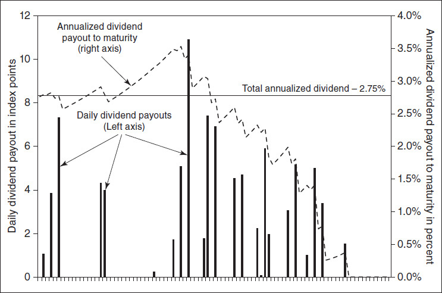

<!-- source:block b46485dd1fcf7835 -->

> [!quote]- English 118
> Suppose that a forward contract matures at the end of the three-month dividend cycle. If a position in the forward contract is taken at the beginning of this period, the 2.75 percent estimate of the dividend flow is a reasonably accurate reflection of the actual dividend payout. However, if the position is taken toward the end of the three-month period, after all the dividends have been paid, 2.75 percent is a gross overstatement; the true dividend payout is close to 0. The dotted line in Figure 22-1 shows the true dividend payout, on an annualized basis, from that point in time to maturity. If a position is taken when the dotted line is below 2.75 percent, this estimate overstates the true dividend payout. If a position is taken when the dotted line is above 2.75 percent, this estimate understates the true dividend payout.

假设远期合约在三个月股息周期结束时到期。如果在本期开始时买入远期合约的头寸，则股息流量的2.75%估计相当准确地反映了实际股息支付。然而，如果头寸是在三个月期末（所有股息均已支付后）采取的，则2.75%是严重夸大的;真实股息支付接近于0。图22-1中的虚线显示了从该时间点到到期日的真实股息支付（按年化计算）。如果在虚线低于2.75%时头寸，则该估计夸大了真实的股息支付。如果在虚线高于2.75%时头寸，则该估计低估了真实的股息支付。

<!-- source:block eb9ea47f808ee584 -->

### 指数套利 / Index Arbitrage

<!-- source:block 1ec86b4d3f620ba1 -->

> [!quote]- English 119
> In February 1982, the Kansas City Board of Trade began trading futures on the Value Line Stock Index. This was the first exchange-traded stock index futures contract listed in the United States. Two months later, in April 1982, the Chicago Mercantile Exchange began trading futures on the S&P 500 Index.

1982年2月，堪萨斯城贸易委员会开始交易价值线股票指数的期货。这是第一份在美国上市的交易所交易股指期货合约。两个月后，即1982年4月，芝加哥商品交易所开始交易标准普尔500指数的期货。

<!-- source:block 6aa25c67246fe76b -->

> [!quote]- English 120
> In theory, the price of a futures contract should reflect the fair value of holding the futures contract rather than holding the stocks making up the index. If the futures contract is not trading at fair value, a trader can execute an arbitrage by purchasing one asset, either the basket of stocks or the futures contract, and selling the other. If there are no other considerations, the trader should realize a profit equal to the mispricing of the futures contract. However, this profit will only be fully realized at expiration of the futures contract, at which time the futures contract and index value will converge. At expiration, the value of the futures contract will automatically be settled in cash, but the trader will have to place an order to liquidate the stock position. He will want to do this in such a way that the prices at which the basket of stocks are traded determine the value of the index at the moment of expiration. This can be done by placing a *market-on-close* order, guaranteeing that the last trade price for each stock, which determines the final index value, will be the liquidation price for the trader’s stock holdings.

理论上，期货合约的价格应该反映持有期货合约而不是持有构成指数的股票的公允价值。如果期货合约不是以公允价值交易，交易员可以通过购买一种资产（一篮子股票或期货合约）并出售另一种资产来执行套利。如果没有其他考虑，交易者应该实现相当于期货合约错误定价的利润。但这一利润只有在期货合约到期时才会完全实现，届时期货合约和指数价值就会趋同。到期时，期货合约的价值将自动以现金结算，但交易员必须下订单清算股票头寸。他会想以这样一种方式来做这件事，即一篮子股票的交易价格决定了指数在到期时的价值。这可以通过放置市场收盘订单来实现，保证每只股票的最后交易价格（决定最终指数价值）将是交易者所持股票的清算价格。

<!-- source:block 8a221c8db87de39d -->

> [!quote]- English 121
> Index arbitrage entails risks similar to any stock futures arbitrage strategy. If the trade has not been executed at a fixed interest rate, any change in rates represents a risk to the position. If dividends have been incorrectly estimated, this will also affect the profitability of the strategy. Moreover, if the strategy involves selling stock short, there may be restrictions that make the strategy impractical. And even if stock can be sold short, the short interest rate may make the strategy unprofitable. This type of strategy, where a trader buys or sells a mispriced stock index futures contract and takes an opposing position in the underlying stocks, is often referred to as *index arbitrage*. Because computers can be programmed to calculate the fair value of a futures contract and to execute the arbitrage when the futures contract is mispriced, such strategies are also known as *program trading*.

指数套利所涉及的风险与任何股票期货套利策略相似。如果交易未以固定利率执行，则利率的任何变化都会对头寸构成风险。如果股息估计错误，也会影响策略的盈利能力。此外，如果该策略涉及卖空股票，则可能存在一些限制，使该策略不切实际。即使股票可以卖空，短期利率也可能使该策略无利可图。这种类型的策略，即交易者购买或出售定价错误的股指期货合约，并在标的股票中采取相反的头寸，通常被称为指数套利。由于计算机可以被编程来计算期货合约的公允价值，并在期货合约定价错误时执行套利，因此此类策略也被称为程序交易。

<!-- source:block 6cb74570a5d5609d -->

> [!quote]- English 122
> With the advent of computer-driven trading, index arbitrage has become an increasingly popular strategy. When a computer detects an index futures contract that is mispriced with respect to the index itself, the computer can send orders to either sell futures contracts and buy the component stocks (a *buy program*) or buy futures contracts and sell the component stocks (a *sell program*). Once the strategy has been executed, it will usually be carried to expiration, at which time the position will be liquidated through a market-on-close order to either buy or sell the component stocks. Initially, exchanges were able to process market-on-close orders resulting from index arbitrage strategies without significant problems. However, as the popularity of program trading increased, exchanges found that as the close of business approached on the last day of trading, they were receiving ever-larger market-on-close orders. These large orders often caused disruptions in the normal trading process, with unexpected jumps in the prices of component stocks. For this reason, many derivative exchanges, at the behest of the relevant stock exchanges, agreed to settle index futures contracts at expiration based on the opening prices of the component stocks rather than the closing prices. This eliminated a last-minute rush to buy or sell stock and enabled stock exchanges to more easily match up buy and sell orders.

随着计算机驱动交易的出现，指数套利已成为一种越来越受欢迎的策略。当计算机检测到指数期货合约相对于指数本身定价错误时，计算机可以发送订单以出售期货合约并购买成分股票（买入程序）或购买期货合约并出售成分股票（卖出程序）。一旦策略被执行，它通常会被执行到到期日，届时头寸将通过收盘时买入或卖出成分股的市场订单进行清算。最初，交易所能够处理由指数套利策略产生的收盘时市场订单，而没有重大问题。然而，随着程序化交易的普及，交易所发现，随着交易最后一天收盘的临近，他们收到的收市订单越来越大。这些大额订单往往会扰乱正常交易流程，导致成分股价格意外上涨。为此，许多衍生品交易所在相关证券交易所的要求下，同意根据成分股的开盘价格而不是收盘价格在到期时结算指数期货合约。这消除了最后一刻抢购或抛售股票的情况，并使证券交易所能够更轻松地匹配买卖订单。

<!-- source:block 4e0b15e3b9737dca -->

> [!quote]- English 123
> Settlement at expiration based on opening prices rather than closing prices is now used for most stock index futures and option contracts. This settlement procedure is sometimes referred to as *AM expiration. PM expiration*, where the settlement value is determined by closing prices at the end of the trading day, is still used for a small number of stock index contracts.3

大多数股指期货和期权合约现在都使用基于开盘价而不是收盘价的到期结算。此结算程序有时被称为AM到期。PM到期日（结算值由交易日结束时的收盘价确定）仍用于少数股指合约。[^ovp22-3]

<!-- source:block 43709e8cf3fdfce9 -->

### 复制指数 / Replicating an Index

<!-- source:block 99d1bc744f61a00e -->

> [!quote]- English 124
> Sometimes a trader will want to create a holding of stocks that exactly replicates the value of the index. He can do this by holding an amount of each stock in the exact proportion to the stock’s weight in the index.

有时，交易员会希望持有完全复制指数价值的股票。他可以通过按照股票在指数中权重的确切比例持有一定数量的每只股票来做到这一点。

<!-- source:block e32d08e59cbc38ff -->

> [!quote]- English 125
> Returning to our ABC Index, we had the following values:

回到ABC指数，我们有以下值：

<!-- source:block 8bc839885384356b -->

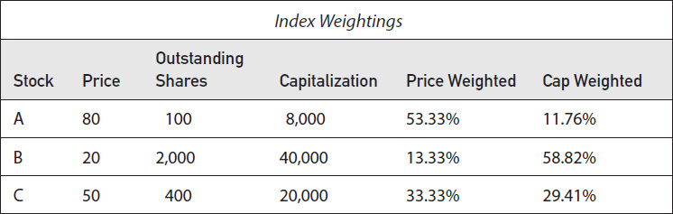

<!-- source:block fe0975e53b7517a6 -->

> [!quote]- English 126
> If a trader wants to replicate the price-weighted ABC Index, 53.33 percent of his holdings should be in Stock A, 13.33 percent in Stock B, and 33.33 percent in Stock C. If a trader wants to replicate the capitalization-weighted ABC Index, 11.76 percent of his holdings should be in Stock A, 58.82 percent in Stock B, and 29.41 percent in Stock C. If the trader has \$100,000 to invest, he needs to hold the following number of shares in each stock:

如果交易者想要复制价格加权ABC指数，他的持股量的53.33%应该是A股，13.33%是B股，33.33%是C股。如果交易者想要复制资本加权ABC指数，他的持股比例应为11.76%，58.82%为B股，29.41%为C股。如果交易者有100,000美元可投资，他需要持有每只股票以下数量的股票：

<!-- source:block 3308979991262421 -->

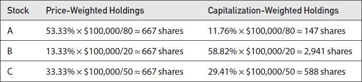

<!-- source:block 2ad8af63f92461df -->

> [!quote]- English 127
> Because the weighting of each stock in a price-weighted index is proportional to its price, we can replicate a price-weighted index by purchasing an equal number of shares of each component stock. The same, however, is not true for the capitalization-weighted index, where the weighting of each stock is proportional to its total capitalization. In both cases, however, we can confirm that the proper number of shares will replicate a \$100,000 investment in the index

由于价格加权指数中每只股票的权重与其价格成正比，因此我们可以通过购买相等数量的每只成分股股票来复制价格加权指数。然而，资本加权指数的情况并非如此，每只股票的权重与其总资本成正比。然而，在这两种情况下，我们可以确认适当数量的股票将复制对指数的100,000美元投资

<!-- source:block 369202cb55aee429 -->

> [!quote]- English 128
> (667 × 80) + (667 × 20) + (667 × 50) ≈ \$100,000 (price weighted)

$$
(667 \times 80) + (667 \times 20) + (667 \times 50) \approx \$100{,}000 (\text{price weighted})
$$

<!-- source:block 639f041729dd3d5f -->

> [!quote]- English 129
> (147 × 80) + (2,941 × 20) + (588 × 50) ≈ \$100,000 (capitalization weighted)

$$
(147 \times 80) + (2{,}941 \times 20) + (588 \times 50) \approx \$100{,}000 (\text{capitalization weighted})
$$

<!-- source:block 8270e542c02ea136 -->

> [!quote]- English 130
> Why might someone want to replicate an index? An investor may want to do so in order to earn a return equal to that of the index. This is a common method of diversifying investments. Indeed, the investor may further diversify by replicating several indexes representing various market segments. A trader may also want to replicate an index in order to take advantage of a mispriced arbitrage relationship. If a stock index futures contract is theoretically overpriced, the trader may seek to sell the futures contract and purchase all the component stocks. He will need to do so in such a way that he exactly replicates the index futures contract.

为什么有人想要复制索引？投资者可能希望这样做是为了获得与指数相等的回报。这是分散投资的常见方法。事实上，投资者可以通过复制代表各个市场细分的几个指数来进一步多元化。交易员可能还想要复制指数，以利用定价错误的套利关系。如果股指期货合约理论上定价过高，交易者可能会寻求出售该期货合约并购买所有成分股。他需要以完全复制指数期货合约的方式这样做。

<!-- source:block b9675d5df9ace4b5 -->

> [!quote]- English 131
> The amount of stock that the trader will need to purchase will depend on the size, or *notional value*, of the futures contract. This, in turn, will depend on the index multiplier that the exchange has assigned to the futures contract. Suppose that our capitalization-weighted index with a divisor of 68,000 is currently trading at 100.00 and that the exchange has assigned a multiplier of \$1,000 to each point. The notional value of the futures contract is therefore 100.00 × \$1,000 = \$100,000. Given this, it may seem that a trader who is able to sell an overpriced index futures contract can offset this position by purchasing 147 shares of Stock A, 2,941 shares of Stock B, and 588 shares of Stock C. The problem with this approach is that the trader needs to replicate the futures contract, not the actual index. And the futures contract and index may have different characteristics.

交易者需要购买的股票数量将取决于期货合约的规模或名义价值。反过来，这将取决于交易所为期货合约分配的指数乘数。假设我们的资本加权指数（分母为68,000）当前交易价格为100.00，并且交易所为每个点指定了1,000美元的乘数。因此，期货合约的名义价值为100.00 × 1,000美元= 100,000美元。鉴于此，似乎一个能够卖出定价过高的指数期货合约的交易者可以通过购买147股股票A、2,941股股票B和588股股票C来抵消这一头寸。这种方法的问题在于，交易者需要复制期货合约，而不是实际的指数。期货合约和指数可能具有不同的特征。

<!-- source:block 7b3689056418f3da -->

> [!quote]- English 132
> To understand why replicating the index will not exactly offset the futures position, consider what will happen over the life of the futures contract while the trader is waiting for expiration, when the futures price and index price will converge. The prices of the stocks will surely fluctuate, resulting in either a profit or loss to his stock position. But this profit or loss will be unrealized because the trader must hold the position to expiration to ensure an arbitrage profit. At the same time, the profit or loss resulting from futures contract will be immediately realized, resulting in a variation credit or debit each day. If there is a variation credit, the trader will earn interest; if there is a variation debit, the trader must pay interest. In either case, the resulting interest will change the arbitrage profit that the trader originally expected. This is another example of settlement risk, which we discussed in Chapter 15. A position that exactly replicates the index is an imperfect hedge against the futures contract because one side is subject to stock-type settlement, while the other side is subject to futures-type settlement. Given this, what should be the correct hedge?

要理解为什么复制指数不能完全抵消期货头寸，可以考察交易者等待到期期间的情况；到期时，期货价格与指数价格将收敛。成分股价格会不断波动，使股票头寸产生损益，但交易者必须将其持有至到期以锁定套利利润，因此这部分损益尚未实现。与此同时，期货合约的损益会立即实现，每日形成 `variation credit` 或 `variation debit`。前者可以赚取利息，后者则需要支付利息；无论哪种情况，利息都会改变交易者原先预期的套利利润。这是第 15 章所讨论的另一种结算风险。完全复制指数的头寸并不能完美对冲期货合约，因为一侧采用股票式结算，另一侧采用期货式结算。那么，正确的对冲方式是什么？

<!-- source:block fb23dfc4fe27b9b4 -->

> [!quote]- English 133
> Ignoring dividends, the fair value of a stock index forward contract is

忽略股息，股指远期合约的公允价值为

<!-- source:block 1fd83f8271847b84 -->

> [!quote]- English 134
> *F* = *S* × (1 + *r* × *t*)

$$
F\,=\,S \times (1 +\,r \times\,t)
$$

<!-- source:block cf7859702f6037be -->

> [!quote]- English 135
> For each point increase in the index, the index futures contract should rise by 1 + *r* × *t*. If we think of the cash index as the underlying contract, we can apply the concept of the delta to the futures contract in much the same way we do to an option contract. The delta is the rate at which the value of a contract will change with respect to movement in the underlying contract. If the goal is to be delta neutral, for each futures contract we hold, we must hold an opposing cash index position equal to 1 + *r* × *t*.

指数每上涨一点，指数期货合约应上涨1 + r x t。如果我们将现金指数视为标的合约，我们可以将Delta的概念应用于期货合约，就像应用于期权合约一样。Delta是合约价值相对于标的合约变动而变化的比率。如果目标是Delta中性，那么对于我们持有的每份期货合约，我们必须持有等于1 + r x t的相反现金指数头寸。

<!-- source:block 46a4ba824c84ec7b -->

> [!quote]- English 136
> The magnitude of the futures delta will depend on both the amount of time remaining to expiration and the level of interest rates. For a long-term futures contract in a high-interest-rate environment, the required holdings in the component stocks may be considerably greater than the equivalent futures position. As expiration approaches or in a low-interest-rate environment, the futures and stock holdings will be almost identical. Consequently, an index arbitrage strategy requires an adjustment to the stock position as time passes or interest rates change.

期货Delta的大小将取决于到期剩余时间和利率水平。对于高利率环境下的长期期货合约，所需的成分股持有量可能远高于同等期货头寸。随着到期临近或在低利率环境下，期货和股票持有量将几乎相同。因此，指数套利策略需要随着时间的推移或利率的变化而调整股票头寸。

<!-- source:block 01aa6e17948a5081 -->

> [!quote]- English 137
> Suppose that there are four months to expiration of our ABC Index futures contract and that the annual interest rate is 6.00 percent. If we sell an overpriced futures contract, we must offset this with a long stock holding of 1 + 0.06 × 4/12 = 1.02, or 2 percent greater than the holding required for an exact index replication. If a month passes so that there are now only three months to expiration, we should reduce our stock holding to 1 + 0.06 × 3/12 = 1.015, or 1½ percent greater than the shares required for an exact index replication. The required holdings for the capitalization-weighted ABC Index are as follows:

假设ABC指数期货合约还有四个月到期，年利率为6.00 %。 如果我们卖出一个定价过高的期货合约，我们必须用1 + 0.06 × 4/12 = 1.02的多头股票持有量来抵消，或者比精确复制指数所需的持有量高出2 %。 如果一个月过去了，现在距离到期只剩下三个月了，我们应该将股票持有量减少到1 + 0.06 × 3/12 = 1.015，即比精确指数复制所需的股票高出1½ %。资本加权ABC指数所需持有量如下：

<!-- source:block 98890e7eeba20d11 -->

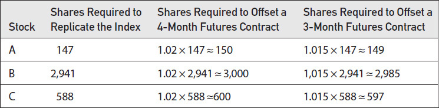

<!-- source:block 3adcba01a76e8d97 -->

> [!quote]- English 138
> A change in interest rates will not only affect the delta of the futures contract but can also affect the profitability of an index arbitrage strategy. If a trader initiates a buy program (i.e., buy stocks, sell futures), he is effectively borrowing cash in order to purchase the stocks. If the cost of funds is tied to a floating interest rate, any rate increase will hurt his position, and any decrease will help. If he institutes a sell program (i.e., sell stocks, buy futures), he is effectively lending cash. Now any rate increase will help his position, and any decrease will hurt it. If the change in interest rates is sufficiently large, an initially profitable strategy might become unprofitable. This is especially true if the program trade consists of long-term futures contracts. In such a case, the interest considerations are magnified because of the greater costs of borrowing or lending over extended periods. In the same way, because of reduced interest considerations, changes in interest rates are unlikely to affect program trades consisting of short-term futures.

利率变化不仅会影响期货合约的Delta，还会影响指数套利策略的盈利能力。如果交易者启动买入计划（即，购买股票，出售期货），他实际上是在借入现金来购买股票。如果资金成本与浮动利率挂钩，那么任何加息都会损害他的头寸，任何降息都会有所帮助。如果他制定了销售计划（即，出售股票，购买期货），他实际上是在放贷。现在，任何加息都会帮助他的头寸，任何降息都会损害他的头寸。如果利率变化足够大，最初有利可图的策略可能会变得无利可图。如果计划交易由长期期货合约组成，情况尤其如此。在这种情况下，由于长期借款或贷款的成本更高，利息考虑就会被放大。同样，由于利息考虑减少，利率变化不太可能影响由短期期货组成的计划交易。

<!-- source:block 016d6925dc80b348 -->

> [!quote]- English 139
> We have also assumed that the dividend payout of all the stocks in an index remains constant. But this is not necessarily true. Companies can have good years and bad years, and their dividend policies can change accordingly. In a buy program (i.e., buy the stocks, sell the futures), any increase in dividends will help the position, and any decrease will hurt. In a sell program (i.e., sell the stocks, buy the futures), the opposite is true. In a broadly based index consisting of hundreds of stocks, it is unlikely that a change in the dividend policy of any one company or even several companies will have a significant impact on the profitability of a program trade. But in a narrow-based index consisting of only a few stocks, a change in the expected dividend payout of even one firm can alter the potential profitability of the trade. In such a case, the trader must carefully consider beforehand the possibility of a dividend change for the companies that make up the index.

我们还假设指数中所有股票的股息支付保持不变。但这不一定是真的。公司可能有好年景和坏年景，他们的股息政策也可能相应改变。在购买计划中（即，购买股票，出售期货），股息的任何增加都会帮助头寸，而股息的任何减少都会伤害。在销售计划中（即，卖出股票，买入期货），反之亦然。在由数百只股票组成的广泛指数中，任何一家公司甚至几家公司的股息政策的变化都不太可能对计划交易的盈利能力产生重大影响。但在仅由少数股票组成的狭义指数中，即使是一家公司预期股息支付的变化也可能改变该行业的潜在盈利能力。在这种情况下，交易员必须事先仔细考虑构成指数的公司股息变化的可能性。

<!-- source:block 812fc769e33cfcc9 -->

### 期货市场中的偏差 / Bias in the Futures Market

<!-- source:block 4bc77e7c587a623b -->

> [!quote]- English 140
> Stock index futures are among the most liquid and actively traded of all futures contracts. These markets enable all types of traders to make decisions based on general market conditions rather than on unique conditions that might affect an individual stock. Most traders believe that the general market is less subject to manipulation than individual stocks and that index markets offer a more level playing field.

股指期货是所有期货合约中流动性最强、交易活跃的合约之一。这些市场使所有类型的交易者能够根据一般市场条件而不是可能影响单个股票的独特条件做出决策。大多数交易员认为，一般市场比股票更不容易受到操纵，并且指数市场提供了更公平的竞争环境。

<!-- source:block 5e257b108d5067a7 -->

> [!quote]- English 141
> One especially active participant in the stock index market is the portfolio manager whose goal is typically to generate a maximum return on capital with a minimum amount of risk. Historically, a portfolio manager has achieved this goal in the equity markets by maintaining a portfolio of stocks that the manager believes will outperform the general market. As the manager identifies new stocks that meet this criterion, he adds them to the portfolio while at the same time selling off stocks that have either met his performance goals or have ceased to perform as expected.

股指市场中一个特别活跃的参与者是投资组合经理，他们的目标通常是以最小的风险产生最大的资本回报。从历史上看，投资组合经理在股票市场上通过维持经理认为将优于一般市场的股票投资组合来实现这一目标。当经理识别出符合这一标准的新股票时，他会将它们添加到投资组合中，同时出售那些达到业绩目标或不再按预期表现的股票。

<!-- source:block 17de236b016e145a -->

> [!quote]- English 142
> Occasionally, a manager with an equity portfolio may want to protect his holding against an expected short-term decline in the general market. Prior to the introduction of index futures, the only way to do this was to sell off the stocks in the portfolio and then buy them back at a later date. Not only was this time consuming but the transaction costs also tended to reduce the expected profits from the position. But with the introduction of index futures a manager with a broadly based portfolio may decide that his holdings tend to mimic an index on which futures are available. If the manager believes that the characteristics of his portfolio are sufficiently similar to the index, index futures offer a method of hedging the stocks in the portfolio without the time-consuming and costly process of selling each individual stock in the portfolio.

有时，拥有股票投资组合的经理可能想要保护自己的持股免受一般市场预期的短期下跌的影响。在推出指数期货之前，唯一的方法是出售投资组合中的股票，然后在稍后回购。这不仅耗时，而且交易成本也往往会减少头寸的预期利润。但随着指数期货的引入，拥有广泛投资组合的经理可能会决定他的持有倾向于模仿可供选择的指数。如果经理相信他的投资组合的特征与指数足够相似，指数期货就提供了一种对冲投资组合中股票的方法，而无需耗时且昂贵地出售投资组合中每只股票的过程。

<!-- source:block 963a7d180919edd2 -->

> [!quote]- English 143
> The effect of portfolio hedging strategies on stock index futures tends to result in a one-sided market because the vast majority of equity portfolio managers take long positions in equities. Even if a manager believes that a stock will underperform the market, it is much less common for a manager to sell stock short (sell stock that he does not own) as part of his investment program. Hence, a portfolio manager is almost always trying to hedge a long position in the market. To achieve this, a portfolio manager is most often selling futures contracts. This constant selling pressure tends to depress the price of futures contracts compared with theoretical value.

投资组合对冲策略对股指期货的影响往往会导致单边市场，因为绝大多数股票投资组合经理都持有股票多头头寸。即使经理认为某只股票的表现会低于市场，经理在其投资计划中卖空股票（出售他不拥有的股票）的情况也不太常见。因此，投资组合经理几乎总是试图对冲市场上的多头头寸。为了实现这一目标，投资组合经理最常出售期货合约。与理论价值相比，这种持续的抛售压力往往会压低期货合约的价格。

<!-- source:block c2aa2d62ee169b1b -->

> [!quote]- English 144
> If there were a sure way to profit from this downward bias in the market, arbitrageurs would take the opposite position in the underlying index. But we have seen that replicating an index with a basket of stocks is not always possible. Moreover, when the portfolio manager protects his long equity position by selling futures, a market maker or arbitrageur ends up taking the opposite position; he is buying futures. If he wants to hedge his position with an underlying basket of stocks, he must sell stocks short. In some markets, the short sale of stock may be prohibited, but even if short sales are permitted, selling stocks short is never as easy as buying stocks. Moreover, the short sale of a stock, as discussed in Chapter 2, may not earn full interest.

如果有一种可靠的方法可以从市场的这种向下偏向中获利，那么套利者就会在标的指数中采取相反的头寸。但我们看到，用一篮子股票复制指数并不总是可能的。此外，当投资组合经理通过出售期货来保护他的多头股票头寸时，做市商或套利者最终会采取相反的头寸;他正在购买期货。如果他想用一篮子标的股票对冲自己的头寸，他就必须卖空股票。在某些市场，股票卖空可能会被禁止，但即使允许卖空，卖空股票也绝不像买入股票那么容易。此外，正如第二章所讨论的那样，卖空股票可能无法获得全额利息。

<!-- source:block a00d705c6ab298b3 -->

> [!quote]- English 145
> Given all these factors, buying and selling pressure in the stock index futures market is not symmetrical. Many more factors seem to result in downward pressure on futures prices than upward pressure. This does not mean that such markets can never become inflated, with futures contracts trading at prices greater than fair value, but this is by far the exception. In stock index markets around the world, there tends to be constant downward pressure on futures prices.

考虑到这些因素，股指期货市场的买卖压力并不对称。导致期货价格下跌压力的因素似乎比上涨压力多得多。这并不意味着此类市场永远不会膨胀，期货合约的交易价格高于公允价值，但这是迄今为止的例外。在全球股指市场中，期货价格往往存在持续的下行压力。

<!-- source:block c945e731d8e4be51 -->

## 股票指数期权 / Stock Index options

<!-- source:block bee3ca108054810b -->

> [!quote]- English 146
> There are really two types of stock index options—those where the underlying is an index futures contract and those where the underlying is a cash index. Although they are alike in many respects, they also have unique characteristics that set them apart from each other.4

实际上有两种类型的股指期权——标的是指数期货合约的期权和标的是现金指数的期权。尽管他们在很多方面都很相似，但他们也有独特的特征，使他们彼此与众不同。[^ovp22-4]

<!-- source:block f4eeb4b8794aba09 -->

### 股票指数期货期权 / Options on Stock Index Futures

<!-- source:block ae425d2a3e6b0c3d -->

> [!quote]- English 147
> Exchange-traded options on stock index futures were first listed in the United States in January 1983, when the Chicago Mercantile Exchange began trading options on S&P 500 futures contracts. Options on stock index futures are evaluated in the same way as any other futures option. Exercise or assignment results in a futures position, which is immediately subject to margin and variation. The only time exercise or assignment does not result in a futures position is when the options and the underlying futures contract expire at the same time. Because most stock index futures trade on the March-June-September-December quarterly cycle, there are four times each year when stock index futures, options on futures, and options on the cash index all expire at the same time. This *triple witching* typically occurs on the third Friday of the contract month, when all expiring stock index contracts, both futures and options, are settled in cash.

股指期货的交易所交易期权于1983年1月首次在美国上市，当时芝加哥商品交易所开始交易标准普尔500指数期货合约的期权。股指期货期权的评估方式与任何其他期货期权相同。行权或指派会导致期货头寸，该头寸立即受到保证金和变动的影响。行权或指派唯一不会导致期货头寸的时间是期权和标的期货合约同时到期。由于大多数股指期货交易的季度周期为3月至6月至9月至12月，因此每年有四次股指期货、期货期权和现金指数期权同时到期。这种三重操纵通常发生在合约月份的第三个星期五，此时所有到期的股指合约（包括期货和期权）都以现金结算。

<!-- source:block dc1ea3648decec78 -->

> [!quote]- English 148
> Consider a trader who owns a February 1,000 call on a stock index futures contract. Because February is a serial month (there are no February futures), the underlying contract is the March future. If the March future is trading at 1,025 at February expiration, the trader will exercise the February 1,000 call, resulting in a long March futures position. Unless the trader immediately sells the March future, the position will be subject to a margin requirement that the trader must deposit with the clearinghouse. At the same time, the trader, through exercise, will buy a March futures contract at 1,000. With the futures contract now trading at 1,025, the trader’s account will be credited with 25.00 points times the index point value. If the point value is \$100, the trader’s account will be credited with 25 × \$100 = \$2,500. In the same way, a trader who is assigned on a February 1,000 call will have a short March futures position. Unless the trader buys back the March future, he will also be required to post margin, and his account will be debited by \$2,500. Both the trader who exercises and the trader who is assigned still have market positions. One trader has a long futures position and therefore wants the market to rise. The other trader has a short futures position and therefore wants the market to decline.

假设一位拥有2月1,000点股指期货合约看涨期权的交易员。由于二月是连续月份（没有二月期货），因此标的合约是三月期货。如果3月期货在2月到期时交易于1,025，则交易员将行权2月1,000看涨期权，从而导致3月期货长头寸。除非交易员立即出售三月期货，否则该头寸将受到交易员必须向清算所存入的保证金要求的约束。与此同时，交易员将通过行权以1,000点购买3月期货合约。由于期货合约目前交易价格为1,025，交易员账户将存入指数点值的25.00点。如果积分值为100美元，交易者的账户将存入25 × 100美元= 2,500美元。同样，被指派到2月1,000看涨期权的交易员将拥有3月期货空头头寸。除非交易员回购3月期货，否则他还将被要求缴纳保证金，并且他的账户将扣除2,500美元。行权的交易员和被指派的交易员都仍然拥有市场头寸。一名交易员持有期货多头头寸，因此希望市场上涨。另一名交易者持有期货空头头寸，因此希望市场下跌。

<!-- source:block 5c89efc1403c2c8c -->

> [!quote]- English 149
> Now consider what will happen at expiration to a trader who owns a March 1,000 call in the same index futures market. Unlike the February option, which is subject to PM expiration (the option essentially expires at the close of business on expiration Friday), the March option is subject to AM expiration because the March future is subject to AM expiration. The value of the March future will be determined by the opening prices of all the component stocks on expiration Friday, and this, in turn, will determine the value of the March 1,000 call. If the call is out of the money, it will expire worthless. If the call is in the money, the exchange will automatically settle all expiring in-the-money options in cash. The trader who owns the call will be credited with an amount equal to the difference between the exercise price and the opening index value times the index multiplier. If the opening index value is 1,040 and the multiplier is again \$100, the trader who is long the option will be credited with \$4,000. At the same time, the trader who is short the option will be debited by an equal amount. Moreover, once this cash transfer takes place, both traders are out of the market. Whether the index subsequently rises or falls is of no consequence because no market position results from the cash settlement.

现在考虑在同一指数期货市场拥有3月1,000 看涨期权的交易员到期时会发生什么。 与二月期权（该期权基本上在周五到期时到期）不同，三月期权受制于AM到期，因为三月期货受制于AM到期。 3月期货的价值将由周五到期的所有成分股的开盘价格决定，而这反过来又将决定3月1,000 看涨期权的价值。如果看涨期权是OTM，它将过期，毫无价值。 如果看涨期权是ITM，交易所将自动以现金结算所有到期的ITM期权。拥有看涨期权的交易员将获得等于行权价与开盘指数值之间的差额乘以指数乘数的金额。 如果开盘指数值为1,040且乘数再次为\\$100,，则该期权做多的交易者将获得\\$4,000的积分。与此同时，做空期权的交易者将被扣除等值金额。 此外，一旦现金转移发生，两名交易员都会退出市场。指数随后上涨或下跌并不重要，因为现金结算不会产生市场头寸。

<!-- source:block 42c5ac5758d06dd7 -->

> [!quote]- English 150
> Options on stock index futures, like most futures options, are American and therefore carry the right of early exercise. If the options are subject to stock-type settlement, as they are in the United States, there may be some early exercise value over an equivalent European option, as described in Chapter 16, although this extra value will usually be small. If the options are subject to futures-type settlement, as they are on most exchanges in Europe and the Far East, there is effectively no additional value over an equivalent European option.

与大多数期货期权一样，股指期货期权是美式的，因此具有提前行权的权利。如果期权受到股票型结算的约束，就像在美国一样，那么如第16章所述，可能比同等的欧洲期权有一些早期行权价值，尽管这个额外价值通常很小。如果期权受到期货式结算的约束，就像欧洲和远东的大多数交易所一样，那么实际上与同等的欧洲期权相比没有任何额外价值。

<!-- source:block 470c7f6b84a41ffa -->

### 现货指数期权 / Options on a Cash Index

<!-- source:block ebfefb95ca33a526 -->

> [!quote]- English 151
> The first cash options on a stock index began trading at the Chicago Board Options Exchange (CBOE) in March 1983. The exchange had wanted to list options on one of the widely followed indexes, such as the S&P 500 or Dow Jones Industrials Average, but was initially unable to obtain the rights to trade any of these indexes. As a result, the CBOE decided to create its own *Options Exchange Index* (with ticker symbol OEX) made up of 100 of the largest U.S. companies.5 Because all individual equity options traded at the CBOE at that time were American, with the right of early exercise, it seemed logical to make OEX options American as well. However, once trading began, it became obvious that the early exercise feature resulted in additional and unforeseen risks and also greatly complicated theoretical evaluation. As a result, all exchange-traded cash index options are now European, with no possibility of early exercise.

第一批股指现金期权于1983年3月在芝加哥期权交易所（CBOE）开始交易。该交易所曾希望列出一种广受关注的指数（例如标准普尔500指数或道琼斯工业平均指数）的期权，但最初无法获得任何这些指数的交易权。因此，CBOE决定创建自己的期权交易所指数（股票代码为OEX），由100家美国最大的公司组成。[^ovp22-5]由于当时CBOE交易的所有个人股票期权都是美国的，拥有提前行权的权利，因此让OEX期权也成为美国似乎是合乎逻辑的。然而，一旦交易开始，很明显，早期行权功能会导致额外的不可预见的风险，并且理论评估也变得非常复杂。因此，所有交易所交易的现金指数期权现在都是欧洲的，不可能提前行权。

<!-- source:block 942706ab771ee717 -->

> [!quote]- English 152
> For stock index options on a cash index,6 no underlying position results from exercise. At expiration, the exchange automatically settles all options in cash, with a cash credit to the purchaser of an in-the-money option equal to the difference between the exercise price and index price and cash debit of an equal amount to the seller of the option. This is the same procedure used to settle expiring futures options when the underlying contract for the option is the expiring futures month. Cash index options are typically subject to AM expiration, with the value of the index, and consequently the value of the options, being determined by the opening prices of all the index components.

对于现金指数期权，[^ovp22-6]行权不会产生标的头寸。到期时，交易所自动以现金结算所有期权：价内期权买方获得一笔 `cash credit`，金额等于行权价与指数价格之差乘以指数乘数；期权卖方则承担等额的 `cash debit`。当到期期货期权的标的合约恰好是到期月份期货时，也采用同样的结算程序。现金指数期权通常采用 AM 到期方式，指数价值以及相应的期权价值由全部指数成分股的开盘价确定。

<!-- source:block 4ea812bc611985b6 -->

> [!quote]- English 153
> How should a trader hedge a position in cash index options? In theory, one might buy or sell all the stocks in the index in the right proportion to hedge such a position. However, this would require trades in many different stocks and, in theory, might require the purchase or sale of fractional shares. Moreover, as the delta of the option position changed, the trader would have to periodically adjust the stock holdings. Given these drawbacks, hedging a position with a basket of component stocks is impractical for most traders. What most traders want is a hedging instrument that is easily traded and correlates closely with the cash index. The contract that meets these requirements is a futures contract on the same stock index as the cash options.

交易员应该如何对冲现金指数期权头寸？理论上，人们可以按照适当的比例购买或出售指数中的所有股票来对冲这样的头寸。然而，这需要进行许多不同股票的交易，并且理论上可能需要购买或出售零碎股票。此外，随着期权头寸Delta的变化，交易员必须定期调整股票持有量。鉴于这些缺点，用一篮子成分股对冲头寸对于大多数交易员来说是不切实际的。大多数交易员想要的是一种易于交易且与现金指数密切相关的对冲工具。满足这些要求的合约是与现金期权相同股票指数的期货合约。

<!-- source:block c21af9334126c417 -->

> [!quote]- English 154
> Assuming that futures contracts on an index are available, a trader in a cash index option market will hedge his position with the futures contract that expires at the same time as the options. If no corresponding futures month is available, the nearest futures contract beyond the option expiration is used as the hedging instrument. For index futures trading on the quarterly cycle, we can summarize the underlying hedging instrument as follows:

假设有指数期货合约可用，现金指数期权市场的交易员将用与期权同时到期的期货合约对冲他的头寸。如果没有相应的期货月份，则使用期权到期后最近的期货合约作为对冲工具。对于季度周期的指数期货交易，我们可以将标的对冲工具总结如下：

<!-- source:block 8b42a9bd4bc36fbf -->

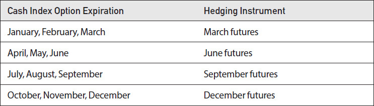

<!-- source:block 377d7180be52762e -->

> [!quote]- English 155
> Clearly, this is not a perfect solution to the hedging problem because the futures contract and the cash index are not identical. Indeed, a futures contract may trade at a price above or below its theoretical value compared with the cash index. But for most traders, using the futures contract represents a practical solution to the hedging problem.

显然，这并不是对冲问题的完美解决方案，因为期货合约和现金指数并不相同。事实上，与现金指数相比，期货合约的交易价格可能高于或低于其理论价值。但对于大多数交易员来说，使用期货合约代表了对冲问题的实际解决方案。

<!-- source:block 93d10094201ac391 -->

> [!quote]- English 156
> Even if we use an index futures contract as the hedging instrument, we still need an underlying price to evaluate options. For March, June, September, and December options, if a position is carried to expiration, a trader can be certain that at the moment of expiration the cash value of the index and the value of the corresponding futures contract will converge. Consequently, a trader can treat the futures contract as the underlying contract. Not only does this make practical sense, but it also makes theoretical sense because option values are derived from the forward price of the underlying contract, and the futures contract is simply the traded form of the forward price. Moreover, if both cash options and futures options are available on an index and all options expire at the same time, there is effectively no difference between the options. They will essentially trade at the same prices.7

即使我们使用指数期货合约作为对冲工具，我们仍然需要标的价格来评估期权。对于三月、六月、九月和十二月期权，如果头寸持续至到期，交易者可以确定在到期时指数的现金价值和相应期货合约的价值将趋同。因此，交易者可以将期货合约视为标的合约。这不仅具有实践意义，而且在理论上也具有意义，因为期权价值源自标的合约的远期价格，而期货合约只是远期价格的交易形式。此外，如果现金期权和期货期权都在指数上可用，并且所有期权同时到期，那么期权之间实际上没有任何区别。他们基本上将以相同的价格进行交易。[^ovp22-7]

<!-- source:block 91f43c8f27936545 -->

> [!quote]- English 157
> The question of what underlying price to use when evaluating a cash index option is somewhat more complex for serial month options, where there is no corresponding futures month. If December futures are available, we can always price December options using the December futures price. We may also use the December futures contract to hedge an October or November option position if no corresponding October or November futures contract is available. But the October or November forward price will differ from the December forward price, so using the December futures price as the underlying price cannot be correct.

对于没有相应的期货月份的连续月期权来说，评估现金指数期权时使用什么标的价格的问题有些复杂。如果12月期货可用，我们始终可以使用12月期货价格对12月期权定价。如果没有相应的十月或十一月期货合约可用，我们还可能使用十二月期货合约对冲十月或十一月期权头寸。但10月或11月远期价格将与12月远期价格不同，因此使用12月期货价格作为标的价格是不正确的。

<!-- source:block ba75747a7ef30cc4 -->

> [!quote]- English 158
> If we assume that the December futures contract represents the correct December forward price, what should be the correct November forward price? We might work backwards because

如果我们假设12月期货合约代表正确的12月远期价格，那么正确的11月远期价格应该是多少？我们可能会倒退，因为

<!-- source:block b9c66264158c96ec -->

> [!quote]- English 159
> *F*Dec = *F*Nov × (1 + *r* × *t*) – *D*

$$
F_{\text{Dec}} =\,F_{\text{Nov}} \times (1 +\,r \times\,t) -\,D
$$

<!-- source:block e29903cf5bd8fc22 -->

> [!quote]- English 160
> Then

然后

<!-- source:block dee48d159525072f -->

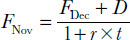

<!-- 原 EPUB 中此公式为图片，已原样保留 -->

<!-- source:block 52327aa5e41db5d8 -->

> [!quote]- English 161
> However, this requires us to estimate the dividends expected between November and December expirations. An easier method used by most traders is to determine the November forward price implied by option prices in the marketplace. We can do this by observing the prices of a November call and put that are close to at the money and whose prices will consequently be similar and then use put-call parity to calculate the implied forward price. For example,

然而，这需要我们估计11月至12月到期期间的预期股息。大多数交易员使用的一种更简单的方法是确定市场期权价格所暗示的11月远期价格。 我们可以通过观察11月看涨期权和看跌期权的价格来做到这一点，这些价格接近ATM，因此价格也会相似，然后使用看跌期权平价来计算隐含的远期价格。例如，

<!-- source:block c54ec23969ae71c6 -->

> [!quote]- English 162
> November 1,000 call = 34.85

$$
\text{November} 1{,}000 \text{call} = 34.85
$$

<!-- source:block c870ad8c5d4faaf7 -->

> [!quote]- English 163
> November 1,000 put = 29.90

$$
\text{November} 1{,}000 \text{put} = 29.90
$$

<!-- source:block 967f03b368db9f28 -->

> [!quote]- English 164
> Time to November expiration = 2 months

$$
\text{Time to November expiration} = 2 \text{months}
$$

<!-- source:block af570157b283bcaf -->

> [!quote]- English 165
> Annual interest rate = 6.00 percent

$$
\text{Annual interest rate} = 6.00 \text{percent}
$$

<!-- source:block 9e34b0c7abbd88ce -->

> [!quote]- English 166
> Because

因为

<!-- source:block 50bbb12b49f7beef -->

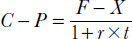

<!-- 原 EPUB 中此公式为图片，已原样保留 -->

<!-- source:block 4a2215b77f8e4faa -->

> [!quote]- English 167
> then

然后

<!-- source:block 9ab5e430c28252f7 -->

> [!quote]- English 168
> *F* = (*C* – *P*) × (1 + *r* × *t*) + *X*

$$
F\,= (C\,-\,P) \times (1 +\,r \times\,t) +\,X
$$

<!-- source:block de988e3a35d67595 -->

> [!quote]- English 169
> *F*Nov = (34.80 – 29.85) × 1.01 + 1,000 = 1,005

$$
F_{\text{Nov}} = (34.80 - 29.85) \times 1.01 + 1{,}000 = 1{,}005
$$

<!-- source:block 930c7eaab2c305ec -->

> [!quote]- English 170
> The implied November forward price is 1,005.00.

隐含的11月远期价格为1,005.00。

<!-- source:block 4ffa769b4353e085 -->

> [!quote]- English 171
> Now suppose that when we calculate the implied November forward price, the December futures price is 1,010.00. This means that there should be a difference between the November forward price and the December forward price of 5.00. As the price of the December futures contract fluctuates, if we want to calculate theoretical values for November cash options, we can use as the underlying price, the December futures price, less 5.00.

现在假设当我们计算隐含的11月远期价格时，12月期货价格为1,010.00。这意味着11月远期价格和12月远期价格之间应该存在差异5.00。由于12月期货合约价格波动，如果我们想计算11月现金期权的理论价值，我们可以使用12月期货价格减去5.00作为标的价格。

<!-- source:block 3c52306d3fe9e4ed -->

> [!quote]- English 172
> We might also use put-call parity to calculate the implied December forward price. But this is not really necessary because we have the implied December forward price in the form of a December futures contract. Still, we might check to see if December option prices are consistent with the December futures price. If

我们还可以使用看跌期权平价来计算隐含的12月远期价格。但这并没有真正必要，因为我们以12月期货合约的形式拥有隐含的12月远期价格。尽管如此，我们可能会检查12月期权价格是否与12月期货价格一致。如果

<!-- source:block 7f8e8c50a886bf54 -->

> [!quote]- English 173
> December futures price = 1,010

$$
\text{December futures price} = 1{,}010
$$

<!-- source:block 283d99f82eb745bb -->

> [!quote]- English 174
> Time to December expiration = 3 months

$$
\text{Time to December expiration} = 3 \text{months}
$$

<!-- source:block e48a6231638951f5 -->

> [!quote]- English 175
> Annual interest rate = 6.00 percent

$$
\text{Annual interest rate} = 6.00 \text{percent}
$$

<!-- source:block 11d606b394459dfa -->

> [!quote]- English 176
> from put-call-parity we know that the December 1,000 combo (the difference between the prices of the December 1,000 call and 1,000 put) should be

从看跌-看涨-平价我们知道12月1,000组合（12月1,000看涨和1,000看跌的价格之间的差异）应该是

<!-- source:block 267ce907fe2539e1 -->

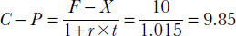

<!-- 原 EPUB 中此公式为图片，已原样保留 -->

<!-- source:block 6bd1973048606afe -->

> [!quote]- English 177
> If the December 1,000 call is trading at a price of 44.60, the December 1,000 put should be trading at a price of 44.60 – 9.85 = 34.75.

如果12月1,000看涨期权的交易价格为44.60，则12月1,000看跌期权的交易价格应为44.60 - 9.85 = 34.75。

<!-- source:block 4e2458830327c91b -->

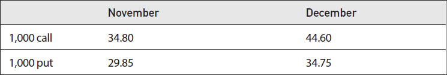

<!-- source:block bbb38a62659cbb8b -->

> [!quote]- English 178
> The price of the November/December 1,000 roll (i.e., the difference between the December and November 1,000 synthetics) is

11月/12月1,000卷的价格（即12月和11月1,000个合成物之间的差异）是

<!-- source:block 72d486274cbbfa4d -->

> [!quote]- English 179
> (44.60 – 34.75) – (34.80 – 29.85) = 9.85 – 4.95 = 4.90

$$
(44.60 - 34.75) - (34.80 - 29.85) = 9.85 - 4.95 = 4.90
$$

<!-- source:block 8ad0f57f649222c7 -->

> [!note] Footnote 180
> 1 A less common variation on an equal-weighted index involves weighting the stocks geometrically rather than arithmetically. The value of a *geometric-weighted* index made up of *n* stocks is the *n*th root of the product of the price ratios. If our ABC Index is geometric weighted, the initial index value will be

[^ovp22-1]: 等加权指数上一种不太常见的变化涉及以几何方式而不是算术方式对股票加权。由n只股票组成的几何加权指数的价值是价格比率积的n根。如果我们的ABC指数是几何加权的，那么初始指数值将是

<!-- source:block 81f8a2de2c3be342 -->

> [!quote]- English 181
> (80/80 × 20/20 × 50/50)1/3 = 1.00

$$
(80/80 \times 20/20 \times 50/50)1/3 = 1.00
$$

<!-- source:block aea6ad11e1026f37 -->

> [!note] Footnote 182
> As the prices of the component stocks change, the value of the index will be
> 随着成分股价格的变化，指数的价值将

<!-- source:block 31f113ab0335748a -->

> [!note] Footnote 183
> [Π(today’s price*i*/yesterday’s price*i*)]1/*n*
> [（今天的价格/昨天的价格）]1/n

<!-- source:block be74bf557c7f8092 -->

> [!note] Footnote 184
> 2 Trading in a stock can be halted for a variety of reasons, but it occurs most often when there is important news pending concerning the company. By halting trading, the exchange hopes to give investors time to absorb the new information and thereby make a better assessment of its impact on the market.

[^ovp22-2]: 股票交易可能会因多种原因而停止，但最常见的情况是在有有关公司的重要消息悬而未决时发生。通过停止交易，该交易所希望给投资者时间吸收新信息，从而更好地评估其对市场的影响。

<!-- source:block 928919625d98d70d -->

> [!note] Footnote 185
> 3 Options on *exchange-traded funds*, which are often designed to mimic a stock index, are subject to traditional PM expiration. The value of the option depends on closing stock prices at the end of trading on expiration day.

[^ovp22-3]: 交易所交易基金的期权通常旨在模仿股票指数，但须遵守传统的PM到期。期权的价值取决于到期日交易结束时的收盘股价。

<!-- source:block 5eb21be2042ad9b4 -->

> [!note] Footnote 186
> 4 We might also include options on *exchange-traded funds*. However, exchange-traded funds are issued in shares and therefore tend to trade like individual equity options.

[^ovp22-4]: 我们还可能包括交易所交易基金的期权。然而，交易所交易基金是以股票形式发行的，因此往往像个人股票期权一样进行交易。

<!-- source:block 307cf6c6d61018d4 -->

> [!note] Footnote 187
> 5 The CBOE subsequently reached an agreement with Standard and Poor’s allowing the exchange to trade options on the S&P 500 Index. As part of the agreement, Standard and Poor’s assumed the responsibility for calculating and disseminating OEX values. At the same time, the OEX was renamed the S&P 100 Index, although it still retains its original ticker symbol OEX.

[^ovp22-5]: 芝加哥期权交易所随后与标准普尔达成协议，允许交易所交易标准普尔500指数期权。作为协议的一部分，标准普尔承担了计算和传播OEX值的责任。与此同时，OEX更名为标准普尔100指数，但仍保留其原始股票代码OEX。

<!-- source:block c519cf32650fcd3e -->

> [!note] Footnote 188
> 6 Ticker symbols for cash indexes very often end with the letter *X*, for example, SPX (*S*tandard and *P*oors 500 Index), DJX (*D*ow *J*ones Industrial Index), DAX (*D*eutsche *A*ktien Index—the German Stock Index), AEX (*A*msterdam *E*xchange Index), OMX 30 (Stockholm *O*ptions *M*arket Index), and ASX 200 (*A*ustralian *S*tock Exchange Index).

[^ovp22-6]: 现金指数的股票代码通常以字母X结尾，例如SPX（标准普尔500指数）、DJX（道琼斯工业指数）、DAX（德意志Aktien指数-德国股票指数）、AEX（阿姆斯特丹交易所指数）、OMX 30（斯德哥尔摩期权市场指数）和ASX 200（澳大利亚证券交易所指数）。

<!-- source:block 81f9d6de361d3d75 -->

> [!note] Footnote 189
> 7 For deeply in-the-money options on futures, which are typically American, there may be a very slight additional early exercise value.

[^ovp22-7]: 对于深度ITM期权（通常是美国的）来说，可能会有非常轻微的额外早期行权价值。

---

[[阅读导航|← 返回阅读导航]]

<!-- chapter-nav:start -->
> [!tip] 章节导航（章末）
> [[头寸分析 Position Analysis|← 上一章]] · [[阅读导航|全书导航]] · [[模型与现实世界 Models and the Real World|下一章 →]]
<!-- chapter-nav:end -->
