# 远期定价 / Forward Pricing

[[阅读导航|← 返回阅读导航]]

> [!success] 翻译状态
> 本章翻译与风险审计已完成。英文原文、数字、公式和图表继续保留，便于逐段核对。

<!-- chapter-toc:start -->
## 本章目录 / Chapter Outline

> [!abstract] 结构导航
> 以下标题按原书顺序保留；点击可直接跳转。

- [[#实物商品（谷物、能源产品、贵金属等） / Physical Commodities (Grains, Energy Products, Precious Metals, etc.)|实物商品（谷物、能源产品、贵金属等） / Physical Commodities (Grains, Energy Products, Precious Metals, etc.)]]
- [[#股票 / Stock|股票 / Stock]]
- [[#示例 / Example|示例 / Example]]
- [[#债券与票据 / Bonds and notes|债券与票据 / Bonds and notes]]
- [[#示例 / Example|示例 / Example]]
- [[#外币 / Foreign Currencies|外币 / Foreign Currencies]]
- [[#股票期权与期货期权 / Stock and Futures options|股票期权与期货期权 / Stock and Futures options]]
- [[#套利 / Arbitrage|套利 / Arbitrage]]
- [[#股息 / Dividends|股息 / Dividends]]
- [[#卖空 / Short Sales|卖空 / Short Sales]]
<!-- chapter-toc:end -->
<!-- chapter-nav:start -->
> [!tip] 章节导航（章首）
> [[金融合约 Financial Contracts|← 上一章]] · [[阅读导航|全书导航]] · [[合约规格与期权术语 Contract Specifications and Option Terminology|下一章 →]]
<!-- chapter-nav:end -->
<!-- source:block 2764fcd17114a57d -->

> [!quote]- English 1
> What should be the fair price for a forward contract? We can answer this question by considering the costs and benefits of buying now compared with buying on some future date. In a forward contract, the costs and benefits are not eliminated; they are simply deferred. They should therefore be reflected in the forward price.

远期合约的公平价格应该是多少？我们可以通过考虑现在购买和将来购买的成本和收益来回答这个问题。在远期合约中，成本和收益并没有被消除;它们只是被推迟了。因此，它们应反映在远期价格中。

<!-- source:block e28f4f3114f8080b -->

> [!quote]- English 2
> forward price = current cash price + costs of buying now – benefits of buying now

$$
\text{forward price} = \text{current cash price} + \text{costs of buying now} - \text{benefits of buying now}
$$

<!-- source:block 6b59380833e6a73c -->

> [!quote]- English 3
> Let’s return to our example from Chapter 1 where my friend Jerry wanted to acquire land on which to build a restaurant. He was considering both a cash purchase and a one-year forward contract. If he enters into a forward contract, what should be a fair one-year forward price for the land?

让我们回到第1章的例子，我的朋友杰里想要获得土地来建造餐厅。他正在考虑现金购买和一年期远期合约。如果他签订了远期合约，那么土地的公平一年期远期价格应该是多少？

<!-- source:block 0089b90cab1d8035 -->

> [!quote]- English 4
> If Jerry wants to buy the land right now, he will have to pay Farmer Smith’s asking price of \$100,000. However, in researching the feasibility of a one-year forward contract, Jerry has learned the following:

如果杰里现在想买那块地，他就得付给史密斯农场主10万美元的要价。然而，在研究一年期远期合约的可行性时，杰里学到了以下几点：

<!-- source:block 7b379a794688d6ac -->

> [!quote]- English 5
> 1. The cost of money, whether borrowing or lending,1 is currently 8.00 percent annually.

1.资金成本（无论是借款还是贷款）[^ovp02-1]目前为每年8.00%。

<!-- source:block 6747bf0ea2526953 -->

> [!quote]- English 6
> 2. The owner of the land must pay \$2,000 in real estate taxes; the taxes are due in nine months.

2.土地所有者必须缴纳2,000美元的房地产税;税款将在九个月内到期。

<!-- source:block ca7efda578c14a02 -->

> [!quote]- English 7
> 3. There is a small oil well on the land that pumps oil at the rate of \$500 per month; the oil revenue is receivable at the end of each month.

3.土地上有一口小油井，每月输油500美元;石油收入每月月底即可收到。

<!-- source:block c4b04736f355648b -->

> [!quote]- English 8
> If Jerry decides to buy the land now, what are the costs compared with buying the land one year from now? First, Jerry will have to borrow \$100,000 from the local bank. At a rate of 8 percent, the one-year interest costs will be

如果杰里决定现在购买土地，与一年后购买土地相比，成本是多少？首先，杰里必须从当地银行借10万美元。按8%的利率计算，一年期利息成本将为

<!-- source:block d014d762d245298d -->

> [!quote]- English 9
> 8% × \$100,000 = \$8,000

$$
8\% \times \$100{,}000 = \$8{,}000
$$

<!-- source:block eafd11f4a1c7f442 -->

> [!quote]- English 10
> If Jerry buys the land now, he will also be liable for the \$2,000 in property taxes due in nine months. In order to pay the taxes, he will need to borrow an additional \$2,000 from the bank for the remaining three months of the forward contract

如果杰里现在购买土地，他还将负责支付九个月后到期的2,000美元财产税。为了纳税，他需要在远期合约的剩余三个月从银行额外借2,000美元

<!-- source:block ca09814b2811ea1b -->

> [!quote]- English 11
> \$2,000 + (\$2,000 × 8% × 3/12) = \$2,000 + \$40 = \$2,040

$$
\$2{,}000 + (\$2{,}000 \times 8\% \times 3/12) = \$2{,}000 + \$40 = \$2{,}040
$$

<!-- source:block a3674bcab32cd842 -->

> [!quote]- English 12
> The total costs of buying now are the interest on the cash price, the real estate taxes, and the interest on the taxes

现在购买的总成本是现金价格利息、房地产税和税款利息

<!-- source:block 4b2b9f861e888974 -->

> [!quote]- English 13
> \$8,000 + \$2,040 = \$10,040

$$
\$8{,}000 + \$2{,}040 = \$10{,}040
$$

<!-- source:block 981b038e7caa60c2 -->

> [!quote]- English 14
> What are the benefits of buying now? If Jerry buys the land now, at the end of each month he will receive \$500 worth of oil revenue. Over the 12-month life of the forward contract, he will receive

现在购买有哪些好处？如果杰里现在购买土地，每个月底他将获得价值500美元的石油收入。在12个月的前锋合约有效期内，他将获得

<!-- source:block 2f36a7aaf2e3830e -->

> [!quote]- English 15
> 12 × \$500 = \$6,000

$$
12 \times \$500 = \$6{,}000
$$

<!-- source:block e28f02f54dcd4689 -->

> [!quote]- English 16
> Additionally, Jerry can earn interest on the oil revenue. At the end of the first month, he will be able to invest \$500 for 11 months at 8 percent. At the end of the second month, he will be able to invest \$500 for 10 months. The total interest on the oil revenue is

此外，杰里还可以从石油收入中赚取利息。第一个月底，他将能够以8%的价格投资500美元，为期11个月。第二个月底，他将能够投资500美元，为期10个月。石油收入的总利息为

<!-- source:block 933ca168138f70de -->

> [!quote]- English 17
> (\$500 × 8% × 11/12) + (\$500 × 8% × 10/12) + … + (\$500 × 8% × 1/12) = \$220

$$
(\$500 \times 8\% \times 11/12) + (\$500 \times 8\% \times 10/12) + \ldots + (\$500 \times 8\% \times 1/12) = \$220
$$

<!-- source:block 1b475658fe89f750 -->

> [!quote]- English 18
> The total benefits of buying now are the oil revenue plus the interest on the oil revenue

现在购买的总收益是石油收入加上石油收入的利息

<!-- source:block ca97174da1787686 -->

> [!quote]- English 19
> \$6,000 + \$220 = \$6,220

$$
\$6{,}000 + \$220 = \$6{,}220
$$

<!-- source:block 38814ab5988a406e -->

> [!quote]- English 20
> If there are no other considerations, a fair one-year forward price for the land ought to be

如果没有其他考虑，土地的一年远期价格应该是

<!-- source:block f01c52db27fba721 -->

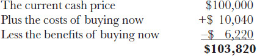

<!-- 原 EPUB 中此公式为图片，已原样保留 -->

<!-- source:block a15754e41ee3f91f -->

> [!quote]- English 21
> Assuming that Jerry and Farmer Smith agree on all these calculations, it should make no difference to either party whether Jerry purchases the land now at a price of \$100,000 or enters into a forward contract to purchase the land one year from now at a price of \$103,820. The transactions are essentially the same.

假设杰里和史密斯农夫同意所有这些计算，那么杰里是现在以10万美元的价格购买土地，还是签订远期合约一年后以103,820美元的价格购买土地，对任何一方来说都没有什么区别。交易本质上是一样的。

<!-- source:block 2c4b1fe4d9447cbf -->

> [!quote]- English 22
> Traders in forward or futures contracts sometimes refer to the *basis*, the difference between the cash price and the forward price. In our example, the basis is

远期或期货合约的交易员有时会使用“基差”（basis）这一术语，它指现货价格与远期价格之差。在本例中，基差为：

<!-- source:block 8d7d377736b36900 -->

> [!quote]- English 23
> \$100,000 – \$103,820 = **–\\$3,820**

$$
\$100{,}000 - \$103{,}820 = -\$3{,}820
$$

<!-- source:block 5aa2b5bf3d8b6c04 -->

> [!quote]- English 24
> In most cases, the basis will be a negative number—the costs of buying now will outweigh the benefits of buying now. However, in our example, the basis will turn positive if the price of oil rises enough. If one year’s worth of oil revenue, together with the interest earned on the revenue, is greater than the \$10,040 cost of buying now, the forward price will be less than the cash price. Consequently, the basis will be positive.

在大多数情况下，基差为负，因为立即买入并持有商品的成本超过其持有收益。但在本例中，如果油价上涨得足够多，基差会转为正值。如果一年的石油收入及其利息收入超过立即买入所需的 10,040 美元成本，远期价格就会低于现货价格，因而基差为正。

<!-- source:block a9d4ba6dc79473cb -->

> [!quote]- English 25
> How should we calculate the fair forward price for exchange-traded futures contracts? This depends on the costs and benefits associated with a position in the underlying contract. The costs and benefits for some commonly traded futures are listed in the following table:

我们应该如何计算交易所交易期货合约的公平远期价格？这取决于与标的合约中头寸相关的成本和收益。下表列出了一些常见交易期货的成本和收益：

<!-- source:block e8bda4bab8fc11ca -->

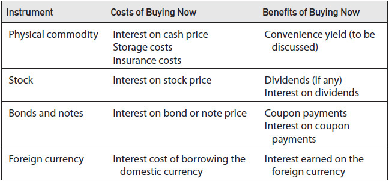

<!-- source:block ecb0f059dca5d05a -->

## 实物商品（谷物、能源产品、贵金属等） / Physical Commodities (Grains, Energy Products, Precious Metals, etc.)

<!-- source:block ee8e6e4c5d6f1cba -->

> [!quote]- English 26
> If we buy a physical commodity now, we will have to pay the current price together with the interest on this amount. Additionally, we will have to store the commodity until maturity of the forward contract. When we store the commodity, we would also be wise to insure it against possible loss while in storage. If

如果我们现在购买实物商品，我们将必须支付当前价格以及该金额的利息。此外，我们必须将商品储存至远期合约到期。当我们储存商品时，我们也明智地为它在储存期间可能发生的损失提供保险。如果

<!-- source:block 1f0727d92f4b1f4b -->

> [!quote]- English 27
> *C* = commodity price2

$$
C\,= \text{commodity price}
$$
[^ovp02-2]

<!-- source:block 4003a2031f8ae14b -->

> [!quote]- English 28
> *t* = time to maturity of the forward contract

$$
t\,= \text{time to maturity of the forward contract}
$$

<!-- source:block 5ee6971b70a3385a -->

> [!quote]- English 29
> *r* = interest rate

$$
r\,= \text{interest rate}
$$

<!-- source:block b23b414382dadbd4 -->

> [!quote]- English 30
> *s* = annual storage costs per commodity unit

$$
s\,= \text{annual storage costs per commodity unit}
$$

<!-- source:block 7082608d0cd62078 -->

> [!quote]- English 31
> *i* = annual insurance costs per commodity unit3

$$
i\,= \text{annual insurance costs per commodity unit}
$$
[^ovp02-3]

<!-- source:block 148acef4472d0e31 -->

> [!quote]- English 32
> then the forward price *F* can be written as

那么远期价格F可以写为

<!-- source:block 1e0b83526bb27c92 -->

> [!quote]- English 33
> *F* = *C* × (1 + *r* × *t*) + (*s* × *t*) + (*i* × *t*)

$$
F\,=\,C \times (1 +\,r \times\,t) + (s\,\times\,t) + (i\,\times\,t)
$$

<!-- source:block 131d3bed4d001714 -->

> [!quote]- English 34
> Initially, it may seem that there are no benefits to buying a physical commodity, so the basis should always be negative. A normal or *contango* commodity market is one in which long-term futures contracts trade at a premium to short-term contracts. But sometimes the opposite occurs—a futures contract will trade at a discount to cash. If the cash price of a commodity is greater than a futures price, the market is *backward* or in *backwardation*. This seems illogical because the interest and storage costs will always be positive. However, consider a company that needs a commodity to keep its factory running. If the company cannot obtain the commodity, it may have to take the very costly step of temporarily closing the factory. The cost of such drastic action may, in the company’s view, be prohibitive. In order to avoid this, the company may be willing to pay an inflated price to obtain the commodity right now. If commodity supplies are tight, the price that the company may have to pay could result in a backward market—the cash price will be greater than the price of a futures contract. The benefit of being able to obtain a commodity right now is sometimes referred to as a *convenience yield*.

乍看之下，立即买入实物商品似乎没有任何额外收益，因而基差似乎应始终为负。在正向市场（contango）中，长期期货合约相对短期合约以升水交易。但市场有时会出现相反情形：期货合约相对现货以贴水交易。当商品现货价格高于期货价格时，市场称为逆价市场，或处于现货溢价（backwardation）状态。由于利息和仓储成本始终为正，这似乎不合直觉。但设想一家必须持续获得某种商品才能维持工厂运转的公司：如果无法获得该商品，它可能被迫暂时停产，而停产成本可能高到无法承受。为避免这种结果，公司可能愿意支付较高的即期价格。当商品供应紧张时，这种即期需求可能将现货价格推高至期货价格之上，从而形成逆价市场。立即获得商品所带来的这种收益，通常称为便利收益率（convenience yield）。

<!-- source:block c557b020c0816015 -->

> [!quote]- English 35
> It can be difficult to assign an exact value to the convenience yield. However, if interest costs, storage costs, and insurance costs are known, a trader can infer the convenience yield by observing the relationship between the cash price and futures prices. For example, consider a three-month forward contract on a commodity

很难为便利收益分配一个确切的值。然而，如果利息成本、存储成本和保险成本已知，交易者可以通过观察现金价格和期货价格之间的关系来推断便利收益率。例如，考虑商品的三个月远期合约

<!-- source:block 76f79f5db48219ec -->

> [!quote]- English 36
> Three-month forward price *F* = \$77.40

$$
\text{Three-month forward price}\,F = \$77.40
$$

<!-- source:block 7167aa6d6db36f9e -->

> [!quote]- English 37
> Interest rate *r* = 8 percent

$$
\text{Interest rate}\,r = 8 \text{percent}
$$

<!-- source:block df81b514fbfa06fb -->

> [!quote]- English 38
> Annual storage costs *s* = \$3.00

$$
\text{Annual storage costs}\,s = \$3.00
$$

<!-- source:block 49ba6c8030c3a9c6 -->

> [!quote]- English 39
> Annual insurance costs *i* = \$0.60

$$
\text{Annual insurance costs}\,i = \$0.60
$$

<!-- source:block 167b294d77b67b4c -->

> [!quote]- English 40
> What should be the cash price *C*? If

现金价格C应该是多少？如果

<!-- source:block 355f16213b5d85c8 -->

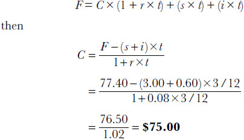

<!-- 原 EPUB 中此公式为图片，已原样保留 -->

<!-- source:block 540c943fb27a9155 -->

> [!quote]- English 41
> If the cash price in the marketplace is actually \$76.25, the convenience yield ought to be \$1.25. This is the additional amount users are willing to pay for the benefit of having immediate access to the commodity.

如果市场上的现金价格实际上是76.25美元，那么便利收益率应该是1.25美元。这是用户为了立即获取商品而愿意支付的额外金额。

<!-- source:block 95316feaf427ba6e -->

## 股票 / Stock

<!-- source:block 9f88f1666a8976f5 -->

> [!quote]- English 42
> If we buy stock now, we will have to pay the current price together with the interest on this amount. In return, we will receive any dividends that the stock pays over the life of the forward contract together with the interest earned on the dividend payments. If

如果我们现在购买股票，我们将必须支付当前价格以及该金额的利息。作为回报，我们将收到股票在远期合约有效期内支付的任何股息以及股息支付赚取的利息。如果

<!-- source:block 1fa05bd1c030d055 -->

> [!quote]- English 43
> *S* = stock price

$$
S\,= \text{stock price}
$$

<!-- source:block 4003a2031f8ae14b -->

> [!quote]- English 44
> *t* = time to maturity of the forward contract

$$
t\,= \text{time to maturity of the forward contract}
$$

<!-- source:block b652bc8c1bb692dc -->

> [!quote]- English 45
> *r* = interest rate over the life of the forward contract

$$
r\,= \text{interest rate over the life of the forward contract}
$$

<!-- source:block 0e707e8dcea5c266 -->

> [!quote]- English 46
> *di* = each dividend payment expected prior to maturity of the forward contract

$$
d_{i}\,= \text{each dividend payment expected prior to maturity of the forward contract}
$$

<!-- source:block 628d5e7c63bd7d4b -->

> [!quote]- English 47
> *ti* = time remaining to maturity after each dividend payment

$$
t_{i}\,= \text{time remaining to maturity after each dividend payment}
$$

<!-- source:block a8e69752b985b2aa -->

> [!quote]- English 48
> *ri* = the applicable interest rate (the *forward rate*4) from each dividend payment to maturity of the forward contract

$$
r_{i}\,= \text{the applicable interest rate} (\text{the}\,forward rate) \text{from each dividend payment to maturity of the forward contract}
$$
[^ovp02-4]

<!-- source:block 4e2ac4610040351d -->

> [!quote]- English 49
> then the forward price *F* can be written as

那么远期价格F可以写为

<!-- source:block f17a166e197721ed -->

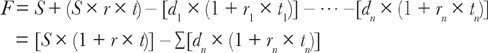

<!-- 原 EPUB 中此公式为图片，已原样保留 -->

<!-- source:block 5da1252a29d94e08 -->

## 示例 / Example

<!-- source:block 44fdb54aa2d9b82b -->

> [!quote]- English 50
> Stock price *S* = \$67.00

$$
\text{Stock price}\,S = \$67.00
$$

<!-- source:block dff52746e05774d9 -->

> [!quote]- English 51
> Time to maturity *t* = 8 months

$$
\text{Time to maturity}\,t = 8 \text{months}
$$

<!-- source:block 855586f27c5281a3 -->

> [!quote]- English 52
> Interest rate *r* = 6.00 percent

$$
\text{Interest rate}\,r = 6.00 \text{percent}
$$

<!-- source:block b46ec12f1f8337c1 -->

> [!quote]- English 53
> Semiannual dividend payment *d* = \$0.33

$$
\text{Semiannual dividend payment}\,d = \$0.33
$$

<!-- source:block 723587f035cc8368 -->

> [!quote]- English 54
> Time to next dividend payment = 1 month

$$
\text{Time to next dividend payment} = 1 \text{month}
$$

<!-- source:block 5fa29c4e9cf4a264 -->

> [!quote]- English 55
> From this, we know that

由此我们知道

<!-- source:block e77033b9344310c8 -->

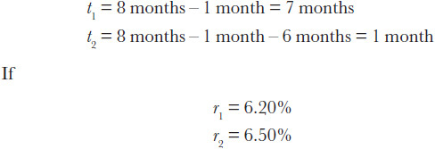

<!-- 原 EPUB 中此公式为图片，已原样保留 -->

<!-- source:block 1967d1e940bb1a29 -->

> [!quote]- English 56
> then a fair eight-month forward price for the stock should be

那么该股公平的八个月远期价格应该是

<!-- source:block 305c3e7b5f70d04b -->

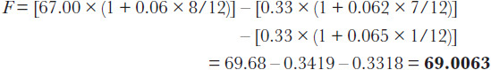

<!-- 原 EPUB 中此公式为图片，已原样保留 -->

<!-- source:block 0c244a306b45a686 -->

> [!quote]- English 57
> Except for long-term stock forward contracts, there will usually be a limited number of dividend payments, and the amount of interest that can be earned on each payment will be small. For simplicity, we will aggregate all the dividends *D* expected over the life of the forward contract and ignore any interest that can be earned on the dividends. The forward price for a stock can then be written as

除了长期股票远期合约外，股息支付的数量通常有限，每次付款可以赚取的利息也很小。为了简单起见，我们将汇总远期合约有效期内预期的所有股息D，并忽略股息可以赚取的任何利息。股票的远期价格可以写为

<!-- source:block 899a2357fa83517d -->

> [!quote]- English 58
> *F* = [*S* × (1 + *r* × *t*)] – *D*

$$
F\,= [S\,\times (1 +\,r \times\,t)] -\,D
$$

<!-- source:block e0e48d6d2260345f -->

> [!quote]- English 59
> An approximate eight-month forward price should be

大约八个月的远期价格应该是

<!-- source:block 44682c588e065067 -->

> [!quote]- English 60
> 67.00 × (1 + 0.06 × 8/12) – (2 × 0.33) = **69.02**

$$
67.00 \times (1 + 0.06 \times 8/12) - (2 \times 0.33) = 69.02
$$

<!-- source:block e26647630832ee4a -->

## 债券与票据 / Bonds and notes

<!-- source:block fd05793d73d6dede -->

> [!quote]- English 61
> If we treat the coupon payments as if they were dividends, we can evaluate bond and note forward contracts in a similar manner to stock forwards. We must pay the bond price together with the interest cost on that price. In return, we will receive fixed coupon payments on which we can earn interest. If

如果我们将息票支付视为股息，我们就可以以与股票远期类似的方式评估债券和票据远期合约。我们必须支付债券价格以及该价格的利息成本。作为回报，我们将收到固定的息票付款，我们可以从中赚取利息。如果

<!-- source:block 127375b9f50c8ce4 -->

> [!quote]- English 62
> *B* = bond price

$$
B\,= \text{bond price}
$$

<!-- source:block 4003a2031f8ae14b -->

> [!quote]- English 63
> *t* = time to maturity of the forward contract

$$
t\,= \text{time to maturity of the forward contract}
$$

<!-- source:block b652bc8c1bb692dc -->

> [!quote]- English 64
> *r* = interest rate over the life of the forward contract

$$
r\,= \text{interest rate over the life of the forward contract}
$$

<!-- source:block 7e1445d1603231a0 -->

> [!quote]- English 65
> *ci* = each coupon expected prior to maturity of the forward contract

$$
c_{i}\,= \text{each coupon expected prior to maturity of the forward contract}
$$

<!-- source:block 2162d42d0a7a1048 -->

> [!quote]- English 66
> *ti* = time remaining to maturity after each coupon payment

$$
t_{i}\,= \text{time remaining to maturity after each coupon payment}
$$

<!-- source:block 20b44ccb52b14f93 -->

> [!quote]- English 67
> *ri* = applicable interest rate from each coupon payment to maturity of the forward contract

$$
r_{i}\,= \text{applicable interest rate from each coupon payment to maturity of the forward contract}
$$

<!-- source:block a5d6be805597318b -->

> [!quote]- English 68
> then the forward price *F* can be written as

那么远期价格F可以写为

<!-- source:block e841d0012cf20953 -->

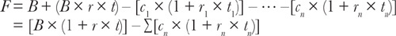

<!-- 原 EPUB 中此公式为图片，已原样保留 -->

<!-- source:block 96eb4c490db85759 -->

## 示例 / Example

<!-- source:block 94196b293b72e723 -->

> [!quote]- English 69
> Bond price *B* = \$109.76

$$
\text{Bond price}\,B = \$109.76
$$

<!-- source:block 1e625c15096a4c80 -->

> [!quote]- English 70
> Time to maturity *t* = 10 months

$$
\text{Time to maturity}\,t = 10 \text{months}
$$

<!-- source:block 2863614f37a7fcc7 -->

> [!quote]- English 71
> Interest rate *r* = 8.00 percent

$$
\text{Interest rate}\,r = 8.00 \text{percent}
$$

<!-- source:block de6931374c768436 -->

> [!quote]- English 72
> Semiannual coupon payment *c* = 5.25 percent

$$
\text{Semiannual coupon payment}\,c = 5.25 \text{percent}
$$

<!-- source:block 64db37f1bb3310de -->

> [!quote]- English 73
> Time to next coupon payment = 2 months

$$
\text{Time to next coupon payment} = 2 \text{months}
$$

<!-- source:block 5fa29c4e9cf4a264 -->

> [!quote]- English 74
> From this, we know that

由此我们知道

<!-- source:block 6a8a0cde8b9d20d0 -->

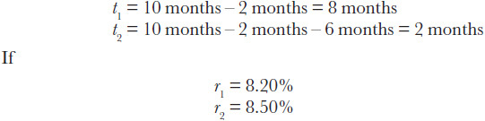

<!-- 原 EPUB 中此公式为图片，已原样保留 -->

<!-- source:block 4ff91d4fc713219d -->

> [!quote]- English 75
> then a fair 10-month forward price for the bond should be

那么债券公平的10个月远期价格应该是

<!-- source:block 7c6f3badd545e952 -->

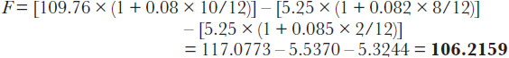

<!-- 原 EPUB 中此公式为图片，已原样保留 -->

<!-- source:block c4d2db6d63716c99 -->

## 外币 / Foreign Currencies

<!-- source:block 0af018125352c5ea -->

> [!quote]- English 76
> With foreign-currency forward contracts, we must deal with two different rates—the domestic interest rate we must pay on the domestic currency to buy the foreign currency and the foreign interest rate we earn if we hold the foreign currency. Unfortunately, if we begin with the spot exchange rate, add the domestic interest costs, and subtract the foreign-currency benefits, we get an answer that is expressed in different units. To calculate a foreign-currency forward price, we must first express the spot exchange rate *S* as a fraction—the cost of one foreign-currency unit in terms of domestic-currency units *Cd* divided by one foreign-currency unit *Cf*

对于外币远期合约，我们必须处理两种不同的利率——我们必须为本国货币购买外币支付的国内利率，以及如果我们持有外币则赚取的外国利率。不幸的是，如果我们从即期汇率开始，加上国内利息成本，减去外币收益，我们就会得到以不同单位表示的答案。为了计算外币远期价格，我们必须首先将即期汇率S表示为一个分数——一个外币单位的成本以本币单位CD除以一个外币单位Cf

<!-- source:block 007066014ab62b30 -->

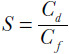

<!-- 原 EPUB 中此公式为图片，已原样保留 -->

<!-- source:block 642d54dbd8c3b97b -->

> [!quote]- English 77
> Suppose that we have a domestic rate *rd* and a foreign rate *rf*. What should be the forward exchange rate at the end of time *t*? If we invest *Cf* at *rf* and we invest *Cd* at *rf*, the exchange rate at time *t* ought to be

假设我们有国内汇率rd和国外汇率ref。t结束时的远期汇率应该是多少？如果我们以ref投资Cf，以ref投资Cd，则t时间的汇率应该是

<!-- source:block cc0f19fbbf20f3e7 -->

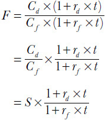

<!-- 原 EPUB 中此公式为图片，已原样保留 -->

<!-- source:block 544ee6df8afec173 -->

> [!quote]- English 78
> For example, suppose that €1.00 = \$1.50. Then

例如，假设1.00欧元= 1.50美元。然后

<!-- source:block b183bdf3fa76527f -->

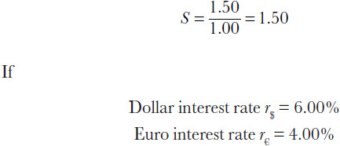

<!-- 原 EPUB 中此公式为图片，已原样保留 -->

<!-- source:block d42dd3d2b47c6454 -->

> [!quote]- English 79
> then the six-month forward price is

那么六个月远期价格是

<!-- source:block 2611996978579e8b -->

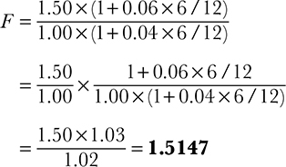

<!-- 原 EPUB 中此公式为图片，已原样保留 -->

<!-- source:block d15f15f11b4315dc -->

## 股票期权与期货期权 / Stock and Futures options

<!-- source:block af9ff34a78d22cc1 -->

> [!quote]- English 80
> In this text we will focus primarily on the two most common classes of exchange-traded options—stock options and futures options.5 Although there is some trading in options on physical commodities, bonds, and foreign currencies in the over-the-counter (OTC) market,6 almost all exchange-traded options on these instruments are futures options. A trader in exchange-traded options on crude oil is really trading options on crude oil futures. A trader in exchange-traded bond options is really trading options on bond futures.

在本文中，我们将主要关注两类最常见的交易所交易期权-股票期权和期货期权。[^ovp02-5]尽管场外（OTC）市场上存在一些实物商品、债券和外币期权交易，[^ovp02-6]这些工具上的几乎所有交易所交易期权都是期货期权。原油交易所交易期权的交易员实际上是原油期货期权的交易。交易所交易债券期权的交易员实际上是在交易债券期货的期权。

<!-- source:block 42d3ffe29bcbeb77 -->

> [!quote]- English 81
> For both stock options and futures options, the value of the option will depend on the forward price for the underlying contract. We have already looked at the forward price for a stock. But what is the forward price for a futures contract? A futures contract is a forward contract. Therefore, the forward price for a futures contract is the futures price. If a three-month futures contract is trading at \$75.00, the three-month forward price is \$75.00. If a six-month futures contract is trading at \$80.00, the six-month forward price is \$80.00. In some ways, this makes options on futures easier to evaluate than options on stock because no additional calculation is required to determine the forward price.

对于股票期权和期货期权，期权的价值将取决于标的合约的远期价格。我们已经研究了股票的远期价格。但期货合约的远期价格是多少？期货合约是远期合约。因此，期货合约的远期价格就是期货价格。如果一个三个月的期货合约的交易价格是75美元，那么三个月的远期价格是75美元。如果一个6个月的期货合约的交易价格是80美元，那么6个月的远期价格就是80美元。在某些方面，这使得期货期权比股票期权更容易评估，因为不需要额外的计算来确定远期价格。

<!-- source:block e6f322b9d529c792 -->

## 套利 / Arbitrage

<!-- source:block 72a204bf27190caa -->

> [!quote]- English 82
> If asked to define the term *arbitrage*, a trader might describe it as “a trade that results in a riskless profit.” Whether there is such a thing as a riskless profit is open for debate because there is almost always something that can go wrong. For our purposes, we will define arbitrage as the buying and selling of the same or very closely related instruments in different markets to profit from an apparent mispricing.

如果被要求定义套利一词，交易员可能会将其描述为“产生无风险利润的交易”。是否存在无风险利润这一点还有待商榷，因为几乎总是有一些事情可能出错。出于我们的目的，我们将套利定义为在不同市场上买卖相同或非常密切相关的工具，以从明显的定价错误中获利。

<!-- source:block a6663cdad062fedc -->

> [!quote]- English 83
> For example, consider a commodity that is trading in London at a price of \$700 per unit and trading in New York at a price of \$710 per unit. Ignoring transaction costs and any currency risk, there seems to be an arbitrage opportunity by purchasing the commodity in London and simultaneously selling it in New York. Will this yield an arbitrage profit of \$10? Or are there other factors that must be considered? One consideration might be transportation costs. The buyer in New York will expect delivery of the commodity. If the commodity is purchased in London, and if it costs more than \$10 per unit to ship the commodity from London to New York, any arbitrage profit will be offset by the transportation costs. Even if transportation costs are less than \$10, there are also insurance costs because no one will want to risk loss of the commodity in transit, either by air or by sea, from London to New York. Of course, anyone trading a commodity professionally ought to know the transportation and insurance costs. Consequently, it will be immediately obvious whether an arbitrage profit is possible.

例如，假设一种商品在伦敦交易的价格为每单位700美元，在纽约交易的价格为每单位710美元。忽略交易成本和任何货币风险，在伦敦购买商品并同时在纽约出售似乎存在套利机会。这会产生10美元的套利利润吗？或者还有其他必须考虑的因素吗？一个考虑因素可能是运输成本。纽约的买家将期待商品的交付。如果商品是在伦敦购买的，并且如果将商品从伦敦运输到纽约的每单位成本超过10美元，则任何套利利润都将被运输成本抵消。即使运输成本低于10美元，也会产生保险费用，因为没有人愿意冒商品在从伦敦到纽约的途中损失的风险，无论是空运还是海运。当然，任何专业的商品交易者都应该知道运输和保险费用。因此，套利利润是否可能立即变得显而易见。

<!-- source:block 13af3f6c28e5a7b2 -->

> [!quote]- English 84
> In a foreign-currency market, a trader may attempt to profit by borrowing a low-interest-rate domestic currency and using this to purchase a high-interest-rate foreign currency. The trader hopes to pay a low interest rate and simultaneously earn a high interest rate. However, this type of *carry trade* is not without risk. The interest rates may not be fixed, and over the life of the strategy, the interest rate that must be paid on the domestic currency may rise while the interest rate that can be earned on the foreign currency may fall. Moreover, the exchange rate is not fixed. At some point, the trader will have to repay the domestic currency that he borrowed. He expects to do this with the foreign currency that he now owns. If the value of the foreign currency has declined with respect to the domestic currency, it will cost him more to repurchase the domestic currency and repay the loan. The carry trade is sometimes referred to as *arbitrage*, but in fact, it entails so many risks that the term is probably misapplied.

在外币市场中，交易员可能会试图通过借入低利率本币并用其购买高利率外币来获利。交易员希望在支付低利率的同时赚取高利率。然而，这种类型的套利交易并非没有风险。利率可能不是固定的，在策略的整个生命周期内，必须支付的本币利率可能会上升，而外币可以赚取的利率可能会下降。而且，汇率不是固定的。在某个时候，交易员必须偿还他借入的本币。他希望用他现在拥有的外币做到这一点。如果外币相对于本币贬值，他回购本币并偿还贷款的成本就会增加。套利交易有时被称为套利，但事实上，它带来了如此多的风险，以至于该术语可能被误用。

<!-- source:block 89e8004274f90909 -->

> [!quote]- English 85
> Because cash markets and futures markets are so closely related, a common type of *cash-and-carry arbitrage* involves buying in the cash market, selling in the futures market, and carrying the position to maturity.

由于现货市场和期货市场密切相关，一种常见的现金套利包括在现货市场买入、在期货市场卖出并将头寸结转至到期。

<!-- source:block 17b47d42a139f05d -->

> [!quote]- English 86
> Returning to our previous stock example:

回到我们之前的股票示例：

<!-- source:block 44fdb54aa2d9b82b -->

> [!quote]- English 87
> Stock price *S* = \$67.00

$$
\text{Stock price}\,S = \$67.00
$$

<!-- source:block dff52746e05774d9 -->

> [!quote]- English 88
> Time to maturity *t* = 8 months

$$
\text{Time to maturity}\,t = 8 \text{months}
$$

<!-- source:block 855586f27c5281a3 -->

> [!quote]- English 89
> Interest rate *r* = 6.00 percent

$$
\text{Interest rate}\,r = 6.00 \text{percent}
$$

<!-- source:block 45a112369a87d079 -->

> [!quote]- English 90
> Expected dividends *D* = 0.66

$$
\text{Expected dividends}\,D = 0.66
$$

<!-- source:block 0a0feb22f1e9c757 -->

> [!quote]- English 91
> Ignoring interest on the dividend, the calculated eight-month forward price is

忽略股息的利息，计算出的8个月远期价格为

<!-- source:block 1273fd7d106794f1 -->

> [!quote]- English 92
> 67.00 × (1 + 0.06 × 8/12) – 0.66 = 69.02

$$
67.00 \times (1 + 0.06 \times 8/12) - 0.66 = 69.02
$$

<!-- source:block 0f4ae945eca1fba1 -->

> [!quote]- English 93
> Suppose that there is a market in forward contracts on this stock and that the price of an eight-month forward contract is \$69.50. What will a trader do? If the trader believes that the contract is worth only \$69.02, he will sell the forward contract at \$69.50 and simultaneously buy the stock for \$67.00. The cash-and-carry arbitrage profit should be

假设该股票的远期合约存在市场，并且八个月远期合约的价格为69.50美元。交易者会做什么？如果交易员认为该合约仅值69.02美元，他将以69.50美元的价格出售该远期合约，同时以67.00美元的价格购买该股票。现付套利利润应该是

<!-- source:block 260a36adb447b455 -->

> [!quote]- English 94
> 69.50 – 69.02 = 0.48

$$
69.50 - 69.02 = 0.48
$$

<!-- source:block c89a128e5b3dd830 -->

> [!quote]- English 95
> To confirm this, we can list all the cash flows associated with the transaction, keeping in mind that at maturity the trader will deliver the stock and in return receive the agreed-on forward price of 69.50.

为了确认这一点，我们可以列出与交易相关的所有现金流，请记住，在到期时交易员将交付股票，并作为回报获得商定的远期价格69.50。

<!-- source:block d631314e9693d070 -->

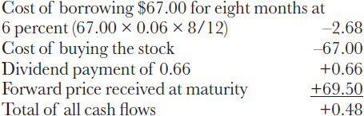

<!-- 原 EPUB 中此公式为图片，已原样保留 -->

<!-- source:block 6f4fcfb4d6fd3a61 -->

> [!quote]- English 96
> Fluctuations in the price of either the stock or the futures contract will not affect the results. Both the initial stock price (\$67.00) and the price to be paid for the stock at maturity (\$69.50) are fixed and cannot be changed.

股票或期货合约价格的波动不会影响结果。初始股票价格（67.00美元）和到期股票支付的价格（69.50美元）都是固定的，无法更改。

<!-- source:block 47c58fc506da0629 -->

> [!quote]- English 97
> Even though fluctuations in the stock or futures price do not represent a risk, other factors may affect the outcome of the strategy. If interest rates rise, the interest costs associated with buying the stock will rise, reducing the potential profit.7 Moreover, unless the company has actually announced the amount of the dividend, the expected dividend payment might be an estimate based on the company’s past dividend payments. If the company unexpectedly cuts the dividend, the arbitrage profit will be reduced.

尽管股票或期货价格的波动不代表风险，但其他因素可能会影响策略的结果。如果利率上升，与购买股票相关的利息成本将上升，从而减少潜在利润。[^ovp02-7]此外，除非公司实际宣布了股息金额，否则预期股息支付可能是基于公司过去股息支付的估计。如果公司意外削减股息，套利利润就会减少。

<!-- source:block d107bda44c0a4d99 -->

> [!quote]- English 98
> Given the apparent mispricing of the futures contract, a trader might question his own evaluation. Is \$69.02 an accurate forward price? Perhaps the interest rate of 6 percent is too low. Perhaps the dividend of \$0.66 is too high.

鉴于期货合约明显存在定价错误，交易员可能会质疑自己的评估。69.02美元是准确的远期价格吗？也许6%的利率太低了。也许0.66美元的股息太高了。

<!-- source:block 786983962e3a1fdd -->

> [!quote]- English 99
> We initially made our calculations by solving for *F* in terms of the spot price, time, interest rates, and dividends

我们最初通过根据现货价格、时间、利率和股息求解F来进行计算

<!-- source:block 899a2357fa83517d -->

> [!quote]- English 100
> *F* = [*S* × (1 + *r* × *t*)] – *D*

$$
F\,= [S\,\times (1 +\,r \times\,t)] -\,D
$$

<!-- source:block 92396291bac6af42 -->

> [!quote]- English 101
> If we know the forward price *F* but are missing one of the other values, we can solve for that missing value. If we know the forward price, time to maturity, interest rate, and dividend, we can solve for *S*, the *implied spot price* of the underlying contract

如果我们知道远期价格F，但缺少其他值之一，我们可以求解该缺失的值。如果我们知道远期价格、到期时间、利率和股息，我们就可以求解S，即标的合约的隐含现货价格

<!-- source:block 792ec602ce3b9e11 -->

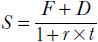

<!-- 原 EPUB 中此公式为图片，已原样保留 -->

<!-- source:block 5f58a207a558e07c -->

> [!quote]- English 102
> If we know everything except the interest rate *r*, we can solve for the *implied interest rate*

如果我们知道除了利率r之外的一切，我们就可以求解隐含利率

<!-- source:block feeb6b897cbccd74 -->

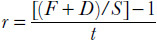

<!-- 原 EPUB 中此公式为图片，已原样保留 -->

<!-- source:block 5f40e2cec369205d -->

> [!quote]- English 103
> If we know everything except the dividend *D*, we can solve for the *implied dividend*

如果我们知道除了被除数D以外的所有信息，我们就可以求出隐含被除数

<!-- source:block dfec1908366cd012 -->

> [!quote]- English 104
> *D* = [*S* × (1 + *r* × *t*)] – *F*

$$
D\,= [S\,\times (1 +\,r \times\,t)] -\,F
$$

<!-- source:block 9691f429d2569b0a -->

> [!quote]- English 105
> Implied values are an important concept, one that we will return to frequently. If a trader believes that a contract is fairly priced, the implied value must represent the marketplace’s consensus estimate of the missing value.

隐含值是一个重要的概念，我们将经常回到这个概念。如果交易者相信合约的定价是公平的，隐含价值必须代表市场对缺失价值的一致估计。

<!-- source:block 7bbf912e6e93c42a -->

> [!quote]- English 106
> Returning to our eight-month forward contract, suppose that we believe that all values except the interest rate are accurate. What is the implied interest rate?

回到我们的八个月远期合约，假设我们相信除利率之外的所有值都是准确的。隐含利率是多少？

<!-- source:block 1f060fd98f17b2fb -->

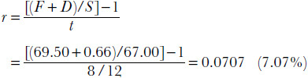

<!-- 原 EPUB 中此公式为图片，已原样保留 -->

<!-- source:block e6f8ac69cf6de84b -->

> [!quote]- English 107
> If we know all values except the dividend, the implied dividend is

如果我们知道除股息之外的所有价值，那么隐含股息就是

<!-- source:block 695a17f23aa9752f -->

> [!quote]- English 108
> *D* = [*S* × (1 + *r* × *t*)] – F = [67.00 × (1 + 0.06 × 8/12)] – 69.50 = 0.18

$$
D\,= [S\,\times (1 +\,r \times\,t)] - F = [67.00 \times (1 + 0.06 \times 8/12)] - 69.50 = 0.18
$$

<!-- source:block 1389d19191be56a3 -->

> [!quote]- English 109
> If two dividends are expected over the life of the forward contract, the marketplace seems to expect two payments of \$0.09 each.

如果预期在远期合约的有效期内有两次股息，那么市场似乎预计会有两次付款，每次付款0.09美元。

<!-- source:block 0f769da62daafb8c -->

## 股息 / Dividends

<!-- source:block 3a755fbc3b51274d -->

> [!quote]- English 110
> In order to evaluate derivative contracts on stock, a trader may be required to make an estimate of a stock’s future dividend flow. A trader will usually need to estimate the amount of the dividend and the date on which the dividend will be paid. To better understand dividends, it may be useful to define some important terms in the dividend process.

为了评估股票衍生品合约，交易员可能需要估计股票的未来股息流。交易者通常需要估计股息金额和支付股息的日期。为了更好地理解股息，定义股息过程中的一些重要术语可能会很有用。

<!-- source:block a2f8aeed5394eb92 -->

> [!quote]- English 111
> ***Declared Date***. The date on which a company announces both the amount of the dividend and the date on which the dividend will be paid. Once the company declares the dividend, the dividend risk is eliminated, at least until the next dividend payment.

宣布日期。公司宣布股息金额和支付股息的日期。一旦公司宣布股息，股息风险就会消除，至少在下一次股息支付之前是这样。

<!-- source:block 744cc8fd68e74536 -->

> [!quote]- English 112
> ***Record Date***. The date on which the stock must be owned in order to receive the dividend. Regardless of the date on which the stock is purchased, ownership of the stock does not become official until the *settlement date*, the date on which the purchaser of the stock officially takes possession. In the United States, the settlement date for stock is normally three business days after the trade is made (sometimes referred to as *T* + 3).

记录日期。必须拥有股票才能获得股息的日期。无论购买股票的日期如何，股票的所有权直到结算日（股票购买者正式占有股票的日期）才会正式成为正式的。在美国，股票的结算日通常为交易完成后三个工作日（有时称为T + 3）。

<!-- source:block 72b410cdea789549 -->

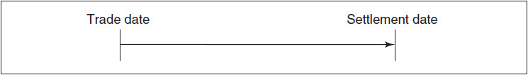

<!-- source:block a22b16beaf296edc -->

> [!quote]- English 113
> ***Ex-Dividend Date (Ex-Date)***. The first day on which a stock is trading without the rights to the dividend. In the United States, the last day on which a stock can be purchased in order to receive the dividend is three business days prior to the record date. The ex-dividend date is two business days prior to the record date.

除息日期（除息日期）。股票在没有股息权利的情况下交易的第一天。在美国，购买股票以获得股息的最后一天是记录日期前三个工作日。除息日期为记录日期前两个工作日。

<!-- source:block b9bf85f2d65cfa0b -->

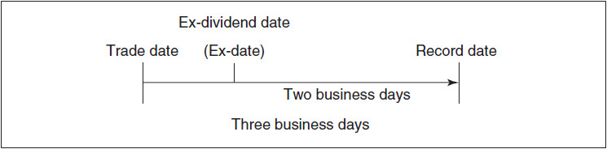

<!-- source:block 5e3d5e555e86bfa9 -->

> [!quote]- English 114
> On the ex-dividend date, quotes for the stock will indicate that the stock is trading *ex-div*, and all quotes will be posted with the amount of the dividend deducted from the stock price. If a stock closes on the day prior to the ex-dividend date at a price of \$67.50 and opens the following day (the ex-dividend date) at a price of \$68.25, and the amount of the dividend is \$0.40, the price of the stock will read

在除息日，股票的报价将表明该股票正在除息交易，所有报价将公布从股价中扣除的股息金额。如果股票在除息日前一天收盘价为67.50美元，第二天（除息日）开盘价为68.25美元，股息金额为0.40美元，则股票价格将为

<!-- source:block b2176c54f9f53e05 -->

> [!quote]- English 115
> 68.25 + 1.15 ex-div 0.40

$$
68.25 + 1.15 \text{ex-div} 0.40
$$

<!-- source:block 6513377fa2c49ad6 -->

> [!quote]- English 116
> If the stock had opened unchanged, the price would have been the previous day’s price of \$67.50 less the dividend of \$0.40, or \$67.10. With the stock at \$68.25, its price increase is \$1.15.

如果该股开盘保持不变，则价格应为前一天的价格67.50美元减去股息0.40美元，即67.10美元。该股为68.25美元，涨幅为1.15美元。

<!-- source:block b0f31d90e2022293 -->

> [!quote]- English 117
> ***Payable Date***. The date on which the dividend will be paid to qualifying shareholders (those owning shares on the record date).

付款日期。向合格股东（在记录日期拥有股份的股东）支付股息的日期。

<!-- source:block f3dcd9323b8a3ac3 -->

> [!quote]- English 118
> The amount of the dividend can often be estimated from the company’s past dividend payments. If a company pays quarterly dividends, as is common in the United States, and has paid a dividend of 25 cents for the last 10 quarters, then it is reasonable to assume that in the future the company will continue to pay 25 cents.

股息金额通常可以根据公司过去的股息支付来估计。如果一家公司支付季度股息（在美国很常见），并且在过去10个季度支付了25美分的股息，那么可以合理地假设该公司未来将继续支付25美分。

<!-- source:block 715d923fa9851231 -->

> [!quote]- English 119
> We have generally ignored the interest that can be earned on dividends, so it may seem that the date on which the dividend will be paid is not really important. If, however, the date on which the dividend will be paid is expected to fall close to the maturity date of a derivative contract, a slight miscalculation of the dividend date can significantly alter the value of the derivative.

我们通常忽略了股息可以赚取的利息，因此股息支付的日期似乎并不重要。然而，如果预期支付股息的日期接近衍生工具合约的到期日，则股息日期的轻微错误计算可能会显著改变衍生工具的价值。

<!-- source:block a24ad02380c8c2ef -->

## 卖空 / Short Sales

<!-- source:block cdea62a91eddf77c -->

> [!quote]- English 120
> Many derivatives strategies involve buying and selling either stock or futures contracts. Except for the situation when a market is *locked*,8 there are no restrictions on the buying or selling of futures contracts. There are also no restrictions on the purchase of stock or on the sale of stock that is already owned. However, there may be situations in which a trader will want to *sell stock short*, that is, sell stock that he does not already own. The trader hopes to buy back the stock at a later date at a lower price.

许多衍生品策略涉及买卖股票或期货合约。除了市场被锁定的情况外，[^ovp02-8]对期货合约的买卖没有任何限制。对购买股票或出售已经拥有的股票也没有限制。然而，可能有交易者想要卖空股票的情况，也就是说，卖出他还没有拥有的股票。该交易员希望在晚些时候以较低的价格回购该股票。

<!-- source:block eb7f1f336ade3162 -->

> [!quote]- English 121
> Depending on the exchange or local regulatory authority, there may be special rules specifying the conditions under which stock can be sold short. In all cases, however, a trader who wants to sell stock short must first borrow the stock. This is possible because many institutions that hold stock may be willing to lend out the stock to facilitate a short sale. A brokerage firm holding a client’s stock may be permitted under its agreement with the client to lend out the stock. This does not mean that one can always borrow stock. Sometimes it will be difficult or even impossible to borrow stock, resulting in a *short-stock squeeze*. But most actively traded stocks can be borrowed with relative ease, with the borrowing usually facilitated by the trader’s clearing firm.

视交易所或当地监管机构而定，股票卖空可能受到规定卖空条件的特别规则约束。但无论如何，交易员若要卖空股票，必须先借到股票。许多持股机构愿意出借股票，以便利卖空交易；根据与客户签订的协议，保管客户股票的券商也可能获准将这些股票出借。这并不意味着股票随时都能借到：有时借券会十分困难，甚至完全无法借到，从而形成融券挤压（*short-stock squeeze*）。不过，大多数交易活跃的股票都较容易借到，借券通常由交易员所属的清算公司协助办理。

<!-- source:block f1f418a75034de4d -->

> [!quote]- English 122
> Consider a trader who borrows 900 shares of stock from a brokerage firm in order to sell the stock short at a price of \$68 per share. The purchaser will pay the trader \$68 × 900, or \$61,200, and the trader will deliver the borrowed stock. The purchaser of the stock does not care whether the stock was sold short or long (whether the seller borrowed the stock or actually owned it). As far as the purchaser is concerned, he is now the owner of record of the stock.

假设一名交易员向券商借入 900 股股票，并以每股 68 美元的价格卖空。买方将向交易员支付 $68 \times 900 = 61{,}200$ 美元，交易员则交付借入的股票。买方并不在意卖方是在借股卖空，还是卖出自己实际持有的股票；对买方而言，他现在已成为该股票的登记持有人。

<!-- source:block d3ec1b08f9751e8e -->

> [!quote]- English 123
> Borrowed stock must eventually be returned to the lender, in this case the brokerage firm. As security against this obligation, the brokerage firm will hold the \$61,200 proceeds from the sale. Because the \$61,200, in theory, belongs to the trader, the firm will pay the trader interest on this amount. At the same time, the trader is obligated to pay the brokerage firm any dividends that accrue over the short-sale period.

借入的股票最终必须归还给出借方，本例中的出借方就是券商。作为履行还券义务的担保，券商将持有卖空所得的 61,200 美元。理论上，这 61,200 美元属于交易员，因此券商会就该金额向交易员支付利息；与此同时，交易员有义务向券商补付卖空期间该股票产生的全部股息。

<!-- source:block 63bdb23f1b0f2ab9 -->

> [!quote]- English 124
> How does the brokerage firm as the lender profit from this transaction? The lending firm profits because it pays the trader only a portion of the full interest on the \$61,200. The exact amount paid to the trader will depend on how difficult it is to borrow the stock. If the stock is easy to borrow, the trader may receive only slightly less than the rate he would expect to receive on any ordinary cash credit. However, if relatively few shares are available for lending, the trader may receive only a fraction of the normal rate. In the most extreme case, where the stock is very difficult to borrow, the trader may receive no interest at all. The rate that the trader receives on the short sale of stock is sometimes referred to as the *short-stock rebate*.

作为出借方的券商如何从这笔交易中获利？它只把 61,200 美元所产生的全部利息中的一部分支付给交易员，并保留其余息差。支付给交易员的具体利率取决于借券难度。如果股票容易借到，交易员获得的利率可能只略低于普通现金 `credit` 余额可获得的利率；如果可供出借的股票较少，交易员可能只能获得正常利率的一小部分。在极端情况下，股票非常难借，交易员甚至可能完全得不到利息。交易员因卖空股票而获得的这一利率，有时称为卖空回扣利率（*short-stock rebate*）。

<!-- source:block c24e731cfa0f2eb3 -->

> [!quote]- English 125
> We can make a distinction between the *long rate rl* that applies to ordinary borrowing and lending and the *short rate rs* that applies to the short sale of stock. The difference between the long and short rates represents the *borrowing costs rbc*

我们可以区分适用于普通借贷和贷款的长期利率rl和适用于股票卖空的短期利率r。长期利率和短期利率之间的差异代表了澳大利亚皇家银行的借贷成本

<!-- source:block 57c4b79b3faf1f96 -->

> [!quote]- English 126
> *rl* – *rs* = *rbc*

$$
r_{l}\,-\,r_{s} =\,r_{bc}
$$

<!-- source:block 418e252ca19714e8 -->

> [!quote]- English 127
> In a previous example we determined the forward price for a stock

在之前的例子中，我们确定了股票的远期价格

<!-- source:block 4cc547d4d10d80d2 -->

> [!quote]- English 128
> Stock price *S* = \$67.00

股价S = 67.00美元

<!-- source:block c3508d4226c2783d -->

> [!quote]- English 129
> Time to maturity *t* = 8 months

距离到期时间：$t = 8\ \text{个月}$

<!-- source:block 1bacc70e240b3b2f -->

> [!quote]- English 130
> Interest rate *r* = 6.00 percent

利率r = 6.00%

<!-- source:block dcc72322b3f14659 -->

> [!quote]- English 131
> Expected dividend payment *D* = \$0.66

预期股息支付D = 0.66美元

<!-- source:block bc0feb1053ca779f -->

> [!quote]- English 132
> Ignoring interest on the dividends, the eight-month forward price is

忽略股息利息，八个月远期价格为

<!-- source:block 1273fd7d106794f1 -->

> [!quote]- English 133
> 67.00 × (1 + 0.06 × 8/12) – 0.66 = 69.02

$$
67.00 \times (1 + 0.06 \times 8/12) - 0.66 = 69.02
$$

<!-- source:block 767f6045226e584a -->

> [!quote]- English 134
> If the price of an eight-month forward contract is \$69.50, there is an arbitrage opportunity by selling the forward contract and purchasing the stock. Suppose that instead the eight-month forward contract is trading at a price of \$68.75. Now there seems to be an arbitrage opportunity by purchasing the forward contract and selling the stock. Indeed, if a trader already owns the stock, this will result in a profit of \$69.02 – \$68.75 = \$0.27. If, however, the trader does not own stock and must sell the stock short in order to execute the strategy, he will not receive the full interest of 6 percent. If the lending firm will retain 2 percent in borrowing costs, the trader will only receive the short rate of 4 percent. The forward price is now

如果八个月期远期合约的价格为69.50美元，则存在出售远期合约并购买股票的套利机会。假设八个月远期合约的交易价格为68.75美元。现在似乎存在购买远期合约并出售股票的套利机会。事实上，如果交易员已经拥有该股票，则将产生69.02美元-68.75美元= 0.27美元的利润。然而，如果交易者不拥有股票并且必须卖空股票才能执行策略，那么他将不会获得6%的全额利息。如果贷款公司保留2%的借贷成本，交易员将只获得4%的短期利率。远期价格是现在

<!-- source:block bd293c531a55b8a6 -->

> [!quote]- English 135
> 67.00 × (1 + 0.04 × 8/12) – 0.66 = 68.13

$$
67.00 \times (1 + 0.04 \times 8/12) - 0.66 = 68.13
$$

<!-- source:block e102b62ecdc17f57 -->

> [!quote]- English 136
> If the trader attempts to execute the arbitrage by selling the stock short, he will lose money because

如果交易者试图通过卖空股票来执行套利，他就会赔钱，因为

<!-- source:block 55cf797412bfa1c2 -->

> [!quote]- English 137
> 68.13 – 68.75 = –0.62

$$
68.13 - 68.75 = -0.62
$$

<!-- source:block 3d9bc45b13806b53 -->

> [!quote]- English 138
> A trader who does not own the stock can only profit if the forward price is less than \$68.13 or more than \$69.02. Between these prices, no arbitrage is possible.

不拥有该股票的交易者只有在远期价格低于68.13美元或高于69.02美元时才能获利。在这些价格之间，不可能进行套利。

<!-- source:block 4299a551501f1507 -->

> [!quote]- English 139
> What interest rate should apply to option transactions? Unlike stock, an option is not a deliverable security. It is a contract that is created between a buyer and a seller. Even if a trader does not own a specific option, he need not “borrow” the option in order to sell it. For this reason, we always apply the ordinary long rate to the cash flow resulting from either the purchase or sale of an option.

期权交易应适用什么利率？与股票不同，期权不是可交割证券。它是买方和卖方之间签订的合约。即使交易者不拥有特定期权，他也不需要“借入”期权来出售它。因此，我们始终对购买或出售期权产生的现金流应用普通长期利率。

<!-- source:block 394dfaca55646e2c -->

> [!note] Footnote 140
> 1 At this point, we will assume that the same interest rate applies to all transactions, whether borrowing or lending. Admittedly, for a trader, the interest cost of borrowing will almost always be higher than the interest earned when lending.

[^ovp02-1]: 此时，我们假设相同的利率适用于所有交易，无论是借款还是贷款。诚然，对于交易员来说，借款的利息成本几乎总是高于贷款时获得的利息。

<!-- source:block 4c69934b8f2261fe -->

> [!note] Footnote 141
> 2 In this chapter only, we will use a capital *C* to represent the price of a commodity. In all other chapters, *C* will refer to the price of a call option.

[^ovp02-2]: 仅在本章中，我们将使用资本C来代表商品的价格。在所有其他章节中，C将指看涨期权的价格。

<!-- source:block 746189db5e45e58d -->

> [!note] Footnote 142
> 3 For physical commodities, both storage and insurance costs usually are quoted together as one price.

[^ovp02-3]: 对于实物商品，仓储费和保险费通常一起作为一个价格报价。

<!-- source:block 02287b2e3b4340d0 -->

> [!note] Footnote 143
> 4 The *forward* rate is the rate of interest that is applicable beginning on some future date for a specified period of time. Forward rates are often expressed in months

[^ovp02-4]: 远期利率是指从未来某个日期开始在指定时期内适用的利率。远期利率通常以月表示

<!-- source:block 977a85cc9885b06c -->

> [!note] Footnote 144
> 1 × 5 forward rate A four-month rate beginning in one month
> 1 × 5远期利率从一个月开始的四个月利率

<!-- source:block e9199457abd58485 -->

> [!note] Footnote 145
> 3 × 9 forward rate A six-month rate beginning in three months
> 3 × 9远期利率从三个月开始的六个月利率

<!-- source:block 2a243c832407e291 -->

> [!note] Footnote 146
> 4 × 12 forward rate An eight-month rate beginning in four months
> 4 × 12远期利率从四个月开始的八个月利率

<!-- source:block b2d60de7c50e3277 -->

> [!note] Footnote 147
> A *forward-rate agreement* (FRA) is an agreement to borrow or lend money for a fixed period, beginning on some future date. A 3 × 9 FRA is an agreement to borrow money for six months, but beginning three months from now.
> 远期利率协议（FRA）是从未来某个日期开始的固定期限内借入或借出资金的协议。3 × 9 FRA是一项借款六个月的协议，但从现在开始三个月。

<!-- source:block 27a76d970f484689 -->

> [!note] Footnote 148
> 5 Later, in Chapter 22, we will also look at stock index futures and options.

[^ovp02-5]: 稍后，在第22章中，我们还将研究股指期货和期权。

<!-- source:block 18e6fbe0576da69b -->

> [!note] Footnote 149
> 6 The OTC market, or *over-the-counter market*, is a term usually applied to trading that does not take place on an organized exchange.

[^ovp02-6]: 场外市场或场外市场是一个术语，通常适用于不在有组织的交易所进行的交易。

<!-- source:block 9f8c17e9c815a3f4 -->

> [!note] Footnote 150
> 7 If money has been borrowed or lent at a fixed rate, there is no interest-rate risk. However, most traders borrow and lend at a variable rate, resulting in interest-rate risk over the life of the forward contract.

[^ovp02-7]: 如果以固定利率借入或借出资金，则不存在利率风险。然而，大多数交易员以可变利率借入和借出，导致远期合约有效期内的利率风险。

<!-- source:block 886247ac920fd699 -->

> [!note] Footnote 151
> 8 Some futures exchanges have daily price limits for futures contracts. When a futures contract reaches this limit, the market is said to be *locked* or *locked limit*. If the market is either *limit up* or *limit down*, no further trading may take place until the price comes off the limit (someone is willing to sell at a price equal to or less than the up limit or buy at a price equal to or higher than the down limit).

[^ovp02-8]: 一些期货交易所对期货合约有每日价格限制。当期货合约达到该限额时，市场就被称为锁定或锁定限额。如果市场要么是上限，要么是上限，则不得进一步交易，直到价格突破上限（有人愿意以等于或低于上限的价格出售，或者以等于或高于下限的价格购买）。

---

[[阅读导航|← 返回阅读导航]]

<!-- chapter-nav:start -->
> [!tip] 章节导航（章末）
> [[金融合约 Financial Contracts|← 上一章]] · [[阅读导航|全书导航]] · [[合约规格与期权术语 Contract Specifications and Option Terminology|下一章 →]]
<!-- chapter-nav:end -->
