# 附录 B 实用数学 / Some Useful Math

[[阅读导航|← 返回阅读导航]] · [[翻译说明与术语表|术语表]]

> [!warning] 翻译状态
> 本章为机器初译，并使用本地术语表校验。英文原文、数字、公式和图表用于核对；中文将在后续复核中继续修订。

<!-- source:block b40bdb0c754a1957 -->

> [!quote]- English 1
> The mathematical functions and calculations referred to in this text are included in almost all commonly used spreadsheets, and for most traders, it is not necessary to know exactly how the calculations are made. Of far greater importance is the ability to interpret the numbers that result from the calculations.

本文中提到的数学函数和计算几乎包含在所有常用的电子表格中，对于大多数交易员来说，没有必要确切地知道计算是如何进行的。更重要的是解释计算结果的数字的能力。

<!-- source:block 055508d74c858393 -->

> [!quote]- English 2
> For the reader who is interested, a detailed discussion of these mathematical concepts can be found in any good statistics or finance textbook. For convenience, we include an overview of these concepts and applications.

对于感兴趣的读者来说，这些数学概念的详细讨论可以在任何好的统计或金融教科书中找到。为了方便起见，我们概述了这些概念和应用。

<!-- source:block b84ad565f5c24900 -->

## 收益率计算 / Rate-of-Return Calculations

<!-- source:block d9dc4e8ea6ebb814 -->

> [!quote]- English 3
> An interest rate is the most common rate of return. The total interest can be computed in three ways: simple, compound, and continuous. If

利率是最常见的回报率。总利息可以通过三种方式计算：简单、复合和连续。如果

<!-- source:block 65128699139369ae -->

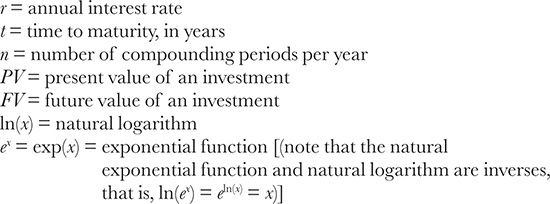

<!-- 原 EPUB 中此公式为图片，已原样保留 -->

<!-- source:block 834e5bbe8c774e23 -->

> [!quote]- English 4
> then, for simple interest,

然后，为了简单的兴趣，

<!-- source:block 677159a84cf64df7 -->

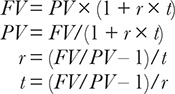

<!-- 原 EPUB 中此公式为图片，已原样保留 -->

<!-- source:block 5347a1e3429c2e7d -->

> [!quote]- English 5
> for compound interest,

对于无息，

<!-- source:block bb4a74b42d301363 -->

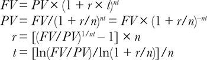

<!-- 原 EPUB 中此公式为图片，已原样保留 -->

<!-- source:block efb94216cc556924 -->

> [!quote]- English 6
> and for continuous interest,

为了持续的兴趣，

<!-- source:block 57c914ee325ab25d -->

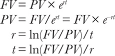

<!-- 原 EPUB 中此公式为图片，已原样保留 -->

<!-- source:block 287c32055aa27f83 -->

> [!quote]- English 7
> Because volatility is a continuously compounded rate of return, we can use the exponential and logarithmic functions to do similar calculations for volatility. If

由于波动率是一种连续复合回报率，因此我们可以使用指数函数和对波动率进行类似的计算。如果

<!-- source:block 991c09812a2a047e -->

> [!quote]- English 8
> *t* = time to expiration, in years

$$
t\,= \text{time to expiration}, \text{in years}
$$

<!-- source:block 645722974f485908 -->

> [!quote]- English 9
> *F* = a forward price after the period of time *t*

$$
F\,= \text{a forward price after the period of time}\,t
$$

<!-- source:block fc3b8cdb78ab7746 -->

> [!quote]- English 10
> σ = annual volatility or standard deviation

$$
\sigma = \text{annual volatility or standard deviation}
$$

<!-- source:block cf262c554239908a -->

> [!quote]- English 11
> *X* = an option’s exercise price

$$
X\,= \text{an option’s exercise price}
$$

<!-- source:block 85164c387d7b5c47 -->

> [!quote]- English 12
> then a price range of *n* standard deviations is

那么n个标准差的价格范围是

<!-- source:block 6539af40d19ce872 -->

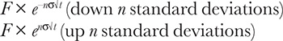

<!-- 原 EPUB 中此公式为图片，已原样保留 -->

<!-- source:block fd61dee5901e6fc3 -->

> [!quote]- English 13
> The number of standard deviations required to reach an exercise price is

达到行权价所需的标准差数为

<!-- source:block eef36f8347e091c2 -->

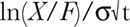

<!-- 原 EPUB 中此公式为图片，已原样保留 -->

<!-- source:block a3d22bdbb53d9b9e -->

## 正态分布与标准差 / Normal Distributions and Standard Deviation

<!-- source:block 88943470c07f342a -->

> [!quote]- English 14
> If

如果

<!-- source:block 6f933559807ab581 -->

> [!quote]- English 15
> *xi* = each data point

$$
x_{i}\,= \text{each data point}
$$

<!-- source:block bd984db5ce27f8dd -->

> [!quote]- English 16
> *n* = number of data points

$$
n\,= \text{number of data points}
$$

<!-- source:block d1d3f14f316da082 -->

> [!quote]- English 17
> σ = standard deviation or volatility

$$
\sigma = \text{standard deviation or volatility}
$$

<!-- source:block fdf17119fc23d4f7 -->

> [!quote]- English 18
> µ = average or mean

$$
µ = \text{average or mean}
$$

<!-- source:block 2a3bc9b477660dbe -->

> [!quote]- English 19
> then the mean or average µ is

则平均值μ为

<!-- source:block 62327a673fc72013 -->

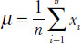

<!-- 原 EPUB 中此公式为图片，已原样保留 -->

<!-- source:block 2d04fe678a082bf3 -->

> [!quote]- English 20
> When calculating the standard deviation from the entire population, σ is given by

当计算整个总体的标准差时，σ由下式给出

<!-- source:block 6ee94daa7a91c896 -->

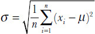

<!-- 原 EPUB 中此公式为图片，已原样保留 -->

<!-- source:block 364f6b91ee7971e5 -->

> [!quote]- English 21
> When estimating the standard deviation from a sample of the entire population, σ is given by1

当估计整个总体样本的标准差时，σ由[^ovp28-1]给出

<!-- source:block 9abebd3c792e9665 -->

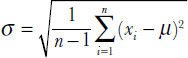

<!-- 原 EPUB 中此公式为图片，已原样保留 -->

<!-- source:block fd87d267a9d44b75 -->

> [!quote]- English 22
> The normal distribution curve *n*(*x*) is given by

正态分布曲线n（x）由下式给出

<!-- source:block 8412124f278fd674 -->

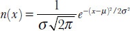

<!-- 原 EPUB 中此公式为图片，已原样保留 -->

<!-- source:block 97ee7fe64cde25f5 -->

> [!quote]- English 23
> In a standard normal distribution, µ = 0 and σ = 1.

$$
\text{In a standard normal distribution}, µ = 0 \text{and} \sigma = 1
$$

<!-- source:block f67693819cd357bf -->

> [!quote]- English 24
> Many of the measures associated with a distribution are derived from a group of numbers called *moments*. In general, the *j*th moment *mj* about the mean µ of a distribution is given by2

与分布相关的许多测量都来自一组称为矩的数字。一般来说，分布平均值µ的j阶矩mj由[^ovp28-2]给出

<!-- source:block 6cc3f7fb38186912 -->

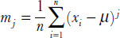

<!-- 原 EPUB 中此公式为图片，已原样保留 -->

<!-- source:block 5d29f97cd811ab2a -->

> [!quote]- English 25
> From the second, third, and fourth moments, we can calculate the skewness and kurtosis of a distribution

从二阶、三阶和四阶矩，我们可以计算分布的偏度和峰度

<!-- source:block 138377b26e02ed3c -->

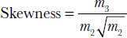

<!-- 原 EPUB 中此公式为图片，已原样保留 -->

<!-- source:block 8d3c835e4c912899 -->

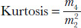

<!-- 原 EPUB 中此公式为图片，已原样保留 -->

<!-- source:block 277f7621c6feda93 -->

> [!quote]- English 26
> A perfectly normal distribution has a skewness of 0 and a kurtosis of 3. To normalize the kurtosis such that a normal distribution has a kurtosis of 0, it is common to subtract 3

完全正态分布的偏度为0，峰度为3。为了对峰度进行标准化，使正态分布的峰度为0，通常需要减去3

<!-- source:block faec4f9df698fe7b -->

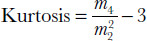

<!-- 原 EPUB 中此公式为图片，已原样保留 -->

<!-- source:block 8b26647d4602671e -->

> [!quote]- English 27
> Figure B-1 shows calculation of the mean and standard deviation for the pinball distribution in Figure 6-2. The steps required to calculate the skewness and kurtosis would require an inordinate amount of space. However, the relevant values, including the first three moments, are

图B-1显示了图6-2中弹球分布的平均值和标准差的计算。计算偏度和峰度所需的步骤需要过多的空间。然而，相关值，包括前三个时刻，是

<!-- source:block ed452491306c10c6 -->

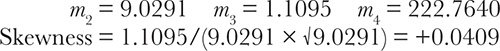

<!-- 原 EPUB 中此公式为图片，已原样保留 -->

<!-- source:block 397cf2e9215254de -->

> [!quote]- English 28
> (The right tail of the distribution is very slightly longer than the left tail.)

(The分布的右尾比左尾稍长。）

<!-- source:block 9d05cea4e0b537ac -->

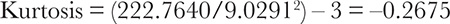

<!-- 原 EPUB 中此公式为图片，已原样保留 -->

<!-- source:block 786010bb5035cd02 -->

> [!quote]- English 29
> (The peak of the distribution is slightly lower and the tails slightly shorter than a true normal distribution.)

(The与真正的正态分布相比，分布的峰值略低，尾部略短。）

<!-- source:block a6a8d960ebbea193 -->

*图B-1图6-2中分布的平均值和标准差的计算。 / figure B-1 Calculation of the mean and standard deviation for the distribution in Figure 6-2.*

<!-- source:block 6f33ab780837893e -->

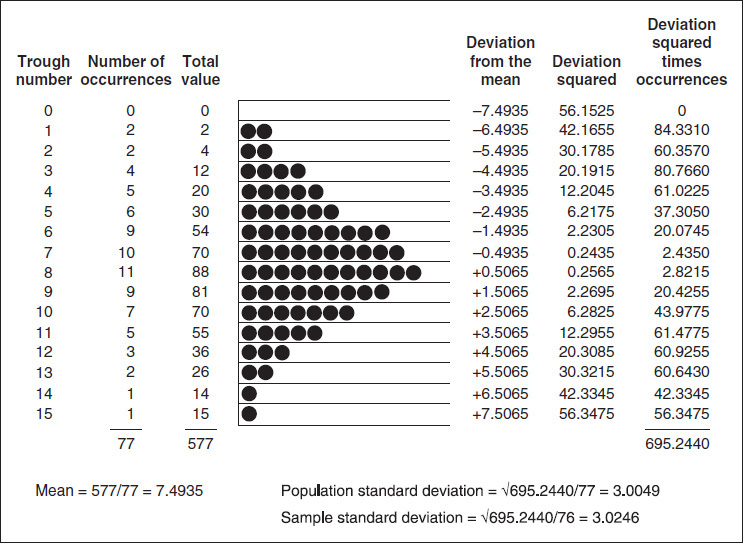

<!-- source:block 344d8f383f5d7ab7 -->

## 波动率 / Volatility

<!-- source:block aae38e70d00a7f1b -->

> [!quote]- English 31
> Volatility is usually calculated as a sample standard deviation. It is also common to assume a mean of 0. The estimated annualized volatility is then given by

波动率通常计算为样本标准差。假设平均值为0也很常见。估计的年化波动率由下式给出

<!-- source:block 15a0de0d0f39db02 -->

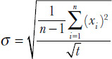

<!-- 原 EPUB 中此公式为图片，已原样保留 -->

<!-- source:block 792b3d2f608a15d8 -->

> [!quote]- English 32
> where *xi* = ln(*pn*/*pn–1*) = natural logarithm of the current price *pn* divided by the previous price *pn–1* and *t* = the time interval, in years, between price changes.

其中xi = ln(dn/dn-1)=当前价格dn的自然log除以先前价格dn-1，t =价格变化之间的时间间隔（以年为单位）。

<!-- source:block 028c57fcdacbeb0e -->

> [!quote]- English 33
> If the underlying contract is a stock, in theory, the price returns *xi* should be adjusted to reflect the forward price of *pn–1* over each time period. However, unless interest rates are very high or the stock will pay a dividend, using the actual price rather than the forward price is unlikely to significantly alter the results.

如果标的合约是股票，理论上，价格回报xi应该进行调整，以反映每个时间段内PN-1的远期价格。然而，除非利率非常高或股票将支付股息，否则使用实际价格而不是远期价格不太可能显着改变结果。

<!-- source:block b8911cb4b9c5134a -->

> [!quote]- English 34
> The volatility calculation for the stock option example in Figure 8-1 is shown in Figure B-2. Because price changes were observed at seven-day intervals (*t* = 7/365), to annualize the volatility, it was necessary to divide by √7/365. The calculation represents the population standard deviation (dividing by *n* rather than *n* – 1) and is based on the actual mean of the price changes. We might also calculate the volatility assuming a 0 mean or use an estimated standard deviation. The various results are as follows:

图8-1中股票期权示例的波动率计算如图B-2所示。由于价格变化每隔七天观察一次（t = 7/365），因此为了将波动率进行年化，需要除以√7/365。计算代表人口标准差（除以n而不是n-1），并基于价格变化的实际平均值。我们还可以假设均值为0或使用估计的标准差来计算波动率。各种结果如下：

<!-- source:block 7e0f876d6114ede2 -->

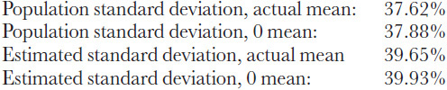

<!-- 原 EPUB 中此公式为图片，已原样保留 -->

<!-- source:block f0237a208da17247 -->

> [!quote]- English 35
> There is very little difference between the calculations made from the actual mean and a 0 mean. The estimated standard deviation is always greater than the population standard deviation.

根据实际平均值和0平均值进行的计算之间几乎没有差异。估计的标准差始终大于总体标准差。

<!-- source:block 2849f1b65d9180ed -->

> [!quote]- English 36
> Figure B-2 Volatility calculation for the stock option example in Figure 8-1.

图B-2图8-1中股票期权示例的波动率计算。

<!-- source:block 524ff0207cef78cb -->

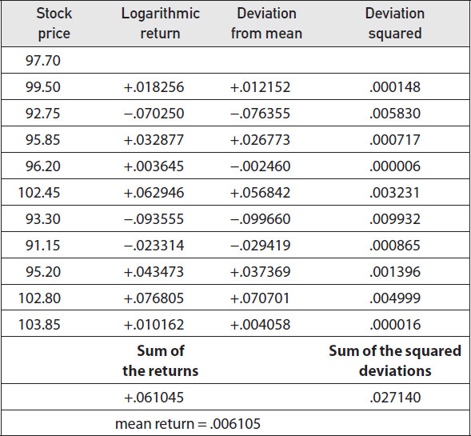

<!-- source:block 646265d65607f014 -->

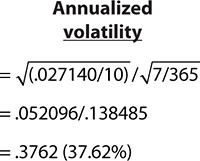

<!-- source:block 1629830a0c56fe63 -->

> [!note] Footnote 37
> 1 The sample standard deviation is sometimes denoted with *s* (instead of σ).

[^ovp28-1]: 样本标准差有时用s（而不是Sigma）表示。

<!-- source:block 2448d957d714a3e6 -->

> [!note] Footnote 38
> 2 In the same way we calculate a sample standard deviation by dividing by *n* – 1, we can also calculate sample moments by dividing by *n* – 1 rather than dividing by *n*.

[^ovp28-2]: 以同样的方式，我们通过除以n-1来计算样本标准差，我们也可以通过除以n-1而不是除以n来计算样本矩。

---

[[阅读导航|← 返回阅读导航]]
