# 风险度量（一） / Risk Measurement I

[[阅读导航|← 返回阅读导航]]

> [!success] 翻译状态
> 本章翻译与风险审计已完成。英文原文、数字、公式和图表继续保留，便于逐段核对。

<!-- chapter-toc:start -->
## 本章目录 / Chapter Outline

> [!abstract] 结构导航
> 以下标题按原书顺序保留；点击可直接跳转。

- [[#Delta（标的价格敏感度） / The Delta|Delta（标的价格敏感度） / The Delta]]
  - [[#变化率 / Rate of Change|变化率 / Rate of Change]]
  - [[#对冲比率 / Hedge Ratio|对冲比率 / Hedge Ratio]]
  - [[#理论或等价标的头寸 / Theoretical or Equivalent underlying Position|理论或等价标的头寸 / Theoretical or Equivalent underlying Position]]
  - [[#概率 / Probability|概率 / Probability]]
- [[#Gamma（Delta 变化率） / The Gamma|Gamma（Delta 变化率） / The Gamma]]
- [[#Theta（时间敏感度） / The Theta|Theta（时间敏感度） / The Theta]]
- [[#Vega（波动率敏感度） / The Vega|Vega（波动率敏感度） / The Vega]]
- [[#Rho（利率敏感度） / The Rho|Rho（利率敏感度） / The Rho]]
- [[#解读风险指标 / Interpreting the Risk Measures|解读风险指标 / Interpreting the Risk Measures]]
<!-- chapter-toc:end -->
<!-- chapter-nav:start -->
> [!tip] 章节导航（章首）
> [[波动率 Volatility|← 上一章]] · [[阅读导航|全书导航]] · [[动态对冲 Dynamic Hedging|下一章 →]]
<!-- chapter-nav:end -->
<!-- source:block fdb922e954054c59 -->

> [!quote]- English 1
> Every trader who enters the marketplace must balance two opposing considerations—reward and risk. A trader hopes that his analysis of market conditions is correct and that this will lead to profitable trading strategies. But no sensible trader can afford to ignore the possibility of error. If he is wrong and market conditions change in a way that adversely affects his position, how badly might the trader be hurt? A trader who fails to consider the risks associated with his position is certain to have a short and unhappy career.

每个进入市场的交易者都必须平衡两种相反的描述——回报和风险。交易员希望他对市场状况的分析是正确的，这将导致有利可图的交易策略。但任何明智的交易者都不能忽视错误的可能性。如果他错了，市场状况的变化对他的头寸产生了不利影响，那么交易员会受到多大的伤害？一个没有考虑与其头寸相关的风险的交易员肯定会拥有短暂且不愉快的职业生涯。

<!-- source:block 88c51c9e742776d0 -->

> [!quote]- English 2
> A trader who purchases stock or a futures contract is concerned almost exclusively with the direction in which the market moves. If the trader has a long position, he is at risk from a declining market; if he has a short position, he is at risk from a rising market. Unfortunately, the risks with which an option trader must deal are not so simple. A wide variety of forces can affect an option’s value. If a trader uses a theoretical pricing model to evaluate options, any of the inputs into the model can represent a risk because there is always a chance that the inputs have been estimated incorrectly. Even if the inputs are correct under current market conditions, over time, conditions may change in a way that will adversely affect the value of his option position. Because of the many forces affecting an option’s value, prices can change in ways that may surprise even experienced traders. Because decisions often must be made quickly, and sometimes without the aid of a computer, much of an option trader’s education focuses on understanding the risks associated with an option position and how changing market conditions are likely to change the value of the position.

购买股票或期货合约的交易员几乎只关心市场走势的方向。如果交易者持有多头头寸，他将面临市场下跌的风险;如果他持有空头头寸，他将面临市场上涨的风险。不幸的是，期权交易员必须应对的风险并不那么简单。多种因素都会影响期权的价值。如果交易者使用理论定价模型来评估期权，则模型中的任何输入都可能代表风险，因为总有可能输入被错误估计。即使输入在当前市场条件下是正确的，随着时间的推移，条件也可能会发生变化，从而对他的期权头寸的价值产生不利影响。由于影响期权价值的多种因素，价格的变化可能会让经验丰富的交易员感到惊讶。由于决策通常必须快速做出，有时甚至在没有计算机的帮助的情况下，期权交易员的大部分教育集中在了解与期权头寸相关的风险以及不断变化的市场条件可能如何改变头寸的价值。

<!-- source:block 11abc62e7c469e0e -->

> [!quote]- English 3
> Let’s begin by summarizing some basic risk characteristics of options, as shown in Figure 7-1. The general effect on option values of changes in the underlying price, volatility, and time to expiration are well defined regardless of the type of option. But the effect of changing interest rates may vary depending on the underlying contract and settlement procedure.

让我们首先总结期权的一些基本风险特征，如图7-1所示。无论期权类型如何，标的价格、波动率和到期时间的变化对期权价值的一般影响都已得到明确定义。但利率变化的影响可能会因标的合约和结算程序而异。

<!-- source:block 167b6c9806268019 -->

*图7-1市场条件变化对期权价值的影响。 / Figure 7-1 Effect of changing market conditions on option values.*

<!-- source:block 46c0f0d77a327411 -->

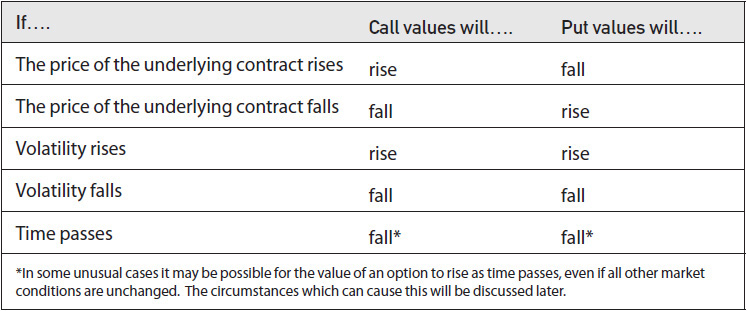

<!-- source:block 28d99b4326ab44ed -->

> [!quote]- English 5
> A change in interest rates can affect options in two ways. First, it may change the forward price of the underlying contract. Second, it may change the present value of the option. In stock option markets, rising interest rates will increase the forward price, causing call values to rise and put values to fall. At the same time, higher interest rates will reduce the present value of both calls and puts. Put values clearly will fall because both results have the effect of reducing put values. For calls, though, the results have opposing effects. The higher forward price will cause the call to increase in value, but the higher interest rate will reduce the present value of the call. Because the price of a stock is always greater than the price of an option, the increase in the forward price will always have a greater effect than the reduced present value. Consequently, call options on stocks will rise in value as interest rates rise and fall as interest rates fall. Put options on stocks will do just the opposite, falling in value as interest rates rise and rising in value as interest rates fall.

利率变化可以通过两条途径影响期权价值。首先，它可能改变标的合约的远期价格；其次，它可能改变期权的现值。在股票期权市场中，利率上升会推高标的股票的远期价格，使看涨期权价值上升、看跌期权价值下降。与此同时，较高的利率会降低看涨期权和看跌期权的现值。对看跌期权而言，这两种作用都会压低其价值，因此看跌期权的价值显然会下降。对看涨期权而言，两种作用则方向相反：远期价格上升会提高看涨期权的价值，而较高的利率会降低其现值。就这里讨论的看涨期权而言，标的股票价格总是高于相应看涨期权的价格，因此，远期价格上升对看涨期权价值的正向影响，总会超过现值折减带来的负向影响。由此，利率上升时，股票看涨期权的价值会上升；利率下降时，其价值会下降。股票看跌期权则恰好相反：利率上升时价值下降，利率下降时价值上升。

<!-- source:block 1d7bf32a55e0386c -->

> [!quote]- English 6
> The value of a stock option will also depend on whether a trader has a long or short stock position. If a trader’s option position also includes a short stock position, he is effectively reducing the interest rate by the borrowing costs required to sell the stock short (see the section “Short Sales” in Chapter 2). This will reduce the forward price, thereby lowering the value of calls and raising the value of puts. As a consequence, the trader who is carrying a short stock position ought to be willing to sell calls at a lower price or buy puts at a higher price. If the trader either sells calls or buys puts, he will hedge by purchasing stock, which will offset his short stock position.

股票期权的价值还取决于交易者是否持有多头或空头股票头寸。如果交易者的期权头寸还包括卖空股票头寸，他实际上通过卖空股票所需的借贷成本降低了利率（请参阅第2章中的“卖空”部分）。这将降低远期价格，从而降低看涨期权的价值并提高看跌期权的价值。因此，持有空头股票头寸的交易者应该愿意以较低的价格出售看涨期权或以较高的价格购买看跌期权。如果交易员卖出看涨期权或买入看跌期权，他将通过购买股票进行对冲，这将抵消他的空头头寸。

<!-- source:block de8509f9f9dc84bb -->

> [!quote]- English 7
> The fact that option values depend on whether the trader hedges with long stock or short stock presents a complication that most traders would prefer to avoid. This leads to a useful rule for stock option traders:

期权价值取决于交易员是用多头股票还是空头股票对冲，这一事实带来了大多数交易员宁愿避免的复杂性。这为股票期权交易者提供了一条有用的规则：

<!-- source:block a8abd9627d672067 -->

> [!quote]- English 8
> *Whenever possible a trader should avoid a short stock position*.

只要有可能，交易者就应避免空头头寸。

<!-- source:block 764509c2fcb607c3 -->

> [!quote]- English 9
> As a corollary, many active option traders prefer to carry some long stock as part of their position. Then, if the trader must sell stock to hedge a position, he will be able to sell the stock long rather than short. The trader need not worry about using a different interest rate because any long stock transaction is always subject to the long, or ordinary, interest rate. Nor will he have to worry about any regulatory restrictions on the short sale of stock.

作为一个必然的结果，许多活跃的期权交易者更喜欢持有一些多头股票作为他们头寸的一部分。然后，如果交易者必须卖出股票来对冲头寸，他将能够卖出股票而不是卖空。交易者不必担心使用不同的利率，因为任何长期股票交易总是受到长期或普通利率的影响。他也不必担心卖空股票会受到任何监管限制。

<!-- source:block c6f634d89392f37b -->

> [!quote]- English 10
> Although stock options are always assumed to be subject to stock-type settlement, with immediate cash payment for the option, the settlement procedure for options on futures contracts may vary depending on the exchange. In the United States, options on futures are subject to stock-type settlement, while outside the United States, options on futures are usually subject to futures-type settlement. In the latter case, no money changes hands when either the option or the underlying futures contract is traded. Consequently, interest rates become irrelevant—neither the forward price nor the present value is affected. Options on futures that are subject to futures-type settlement are therefore insensitive to changes in interest rates. If, however, options on futures are subject to stock-type settlement, increasing interest rates will leave the forward price unchanged but will reduce the option’s present value. As a result, both call and put values will decline. The effect, however, is usually small because the value of the option, unless it is very deeply in the money, is small relative to the value of the underlying contract. Futures options are therefore much less sensitive to changes in interest rates than options on stocks.

尽管股票期权始终被假设接受股票型结算，并立即支付期权现金，但期货合约期权的结算程序可能会因交易所而异。在美国，期货期权须接受股票型结算，而在美国境外，期货期权通常须接受期货型结算。在后一种情况下，当期权或标的期货合约交易时，没有货币易手。因此，利率变得无关紧要——远期价格和现值都不受影响。因此，受期货型结算约束的期货期权对利率变化不敏感。然而，如果期货期权须接受股票型结算，则提高利率将使远期价格保持不变，但会降低期权的现值。因此，看涨和看跌价值都将下降。然而，其影响通常很小，因为期权的价值（除非它价内非常深）相对于标的合约的价值来说很小。因此，期货期权对利率变化的敏感性远低于股票期权。

<!-- source:block 29bab7130965f4fa -->

> [!quote]- English 11
> We also might consider the case of foreign-currency options.1 Here the situation is more complex because the value of the option is affected by two interest rates—a domestic rate and a foreign rate. Going back to the forward pricing relationships in Chapter 2, where *S* is the spot exchange rate, we can see that the forward price for a foreign currency will fall if we increase the foreign rate (the denominator becomes larger) and rise if we reduce the foreign rate (the denominator becomes smaller)

我们还可以考虑外币期权的情况。这里的情况更加复杂，因为期权的价值受到两种利率的影响——国内利率和国外利率。回到第2,章中的远期定价关系，其中S是现货汇率，我们 可以看到，如果我们提高外币汇率（分母变大），外币远期价格就会下跌，如果我们降低外币汇率（分母变小），外币远期价格就会上涨 [^ovp07-1]

<!-- source:block 0089fe3543aee6fa -->

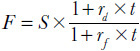

<!-- 原 EPUB 中此公式为图片，已原样保留 -->

<!-- source:block 492698d20c0b4145 -->

> [!quote]- English 12
> This means that call values will fall and put values will rise as we increase the foreign rate.

这意味着随着我们提高外汇利率，看涨价值将会下降，看跌价值将会上升。

<!-- source:block 956fc6063240bbc0 -->

> [!quote]- English 13
> We can also see that the forward price for a currency will rise if we increase the domestic rate (the numerator becomes larger) and fall if we reduce the domestic rate (the numerator becomes smaller). But for options that are subject to stock-type settlement, an increase in the domestic rate will also reduce the present value of the option. As with stock options, the increase in the forward price will tend to dominate. Therefore, as we increase the domestic rate, call values will rise and put values will fall. The effects of changing interest rates are summarized in Figures 7-2 and 7-3.

我们还可以看到，如果我们提高国内汇率（分子变大），货币的远期价格就会上涨，如果我们降低国内汇率（分子变小），货币的远期价格就会下跌。但对于股票型结算的期权，国内利率的提高也会降低期权的现值。与股票期权一样，远期价格的上涨往往将占主导地位。因此，随着我们提高国内利率，看涨价值将会上升，看跌价值将会下降。利率变化的影响总结在图7-2和7-3中。

<!-- source:block 171b4b153bb471d5 -->

*图7-2利率变化对期权价值的影响 / Figure 7-2 Effect of changing interest rates on option values.*

<!-- source:block f105bc6b7961f48b -->

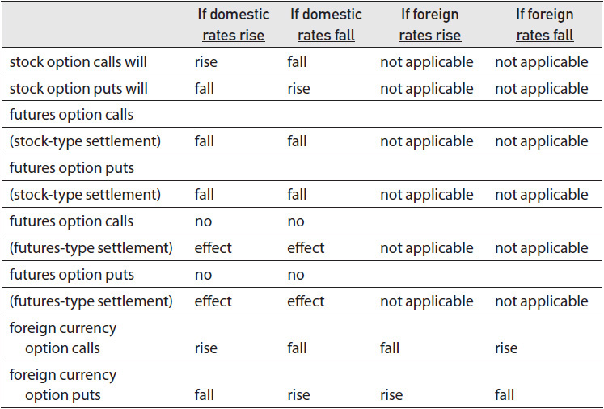

<!-- source:block 2c15b32e1951b037 -->

*图7-3股息变化对股票期权价值的影响。 / Figure 7-3 Effect of changing dividends on stock option values.*

<!-- source:block 8ec19a5b2da7fbb9 -->

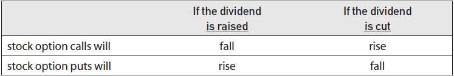

<!-- source:block c7aab6ed4fbf4ec3 -->

> [!quote]- English 16
> If we are evaluating options on stock and the stock is expected to pay a dividend over the life of the option, a change in the dividend will also affect the value of the option because it will change the forward price of the stock. Increasing the dividend will reduce the forward price, causing call values to fall and put values to rise. Reducing the dividend will increase the forward price, causing call values to rise and put values to fall.

如果我们正在评估股票期权，并且股票预计将在期权有效期内支付股息，那么股息的变化也会影响期权的价值，因为它会改变股票的远期价格。增加股息将降低远期价格，导致看涨价值下跌而看跌价值上升。减少股息将增加远期价格，导致看涨价值上升并下跌。

<!-- source:block d7533d6aed28bfc5 -->

> [!quote]- English 17
> Even if we are familiar with the general effects of changing market conditions on option values, we still need to determine the magnitude of the risk. If market conditions change, will the change in option values be large or small, representing either a major or minor risk, or something in between? Fortunately, in addition to the theoretical value, pricing models generate a variety of other numbers that enable us to determine both the direction and magnitude of the change. These numbers, known variously as the *Greeks* (because they are commonly abbreviated with Greek letters), the *risk measures*, or (for the mathematically inclined) the *partial derivatives*, will not answer all our questions concerning changing market conditions, but they are an important starting point in analyzing the risks associated with both simple and complex option positions.

即使我们了解市场条件变化通常会如何影响期权价值，仍须确定风险的大小。市场条件一旦改变，期权价值的变动究竟会大还是小——它代表的是重大风险、轻微风险，还是介于二者之间？所幸，定价模型除了给出理论价值，还会生成一系列其他数值，使我们能够判断价值变动的方向和幅度。这些数值有多种称呼：Greeks（因其通常用希腊字母表示）、风险度量；对具备数学背景的读者而言，它们则是偏导数。它们无法解答我们关于市场条件变化的全部疑问，但却是分析简单和复杂期权头寸相关风险的重要起点。

<!-- source:block 394a4856242a371e -->

## Delta（标的价格敏感度） / The Delta

<!-- source:block 70282e0466aaa266 -->

> [!quote]- English 18
> The *delta* (Δ) is a measure of an option’s risk with respect to the direction of movement in the underlying contract. A positive delta indicates a desire for upward movement; a negative delta indicates a desire for downward movement. The delta has several different interpretations, any of which may be useful to a trader depending on the types of strategies being executed.

Delta（Delta）是衡量期权相对于标的合约移动方向的风险的指标。正Delta表示希望向上移动;负Delta表示希望向下移动。Delta有几种不同的解释，其中任何一种可能对交易者有用，具体取决于所执行的策略类型。

<!-- source:block 4429ca04a7ef7f33 -->

### 变化率 / Rate of Change

<!-- source:block 9bd8f1a7c2cfccad -->

> [!quote]- English 19
> At expiration, an option is worth exactly its intrinsic value. Prior to expiration, however, the theoretical value of an option is a curve that will approach intrinsic value as the option goes very deeply into the money or very far out of the money. This is shown in Figure 7-4. As the underlying price rises, the slope of the graph approaches +1; as the underlying price falls, the slope of the graph approaches zero. The delta of the call at any given underlying price is the slope of the graph—the rate of change in the option’s value with respect to movement in the underlying contract.

到期时，期权的价值与其内在价值完全相同。然而，在到期之前，期权的理论价值是一条曲线，随着期权深入货币或价外，该曲线将接近内在价值。如图7-4所示。随着标的价格上涨，图表的斜率接近+1;随着标的价格下跌，图表的斜率接近零。任何给定标的价格下的看涨期权Delta是图表的斜率-期权价值相对于标的合约变动的变化率。

<!-- source:block 87685ba3833ca801 -->

*图7-4看涨期权的理论值。 / Figure 7-4 Theoretical value of a call.*

<!-- source:block f384c355382be4bc -->

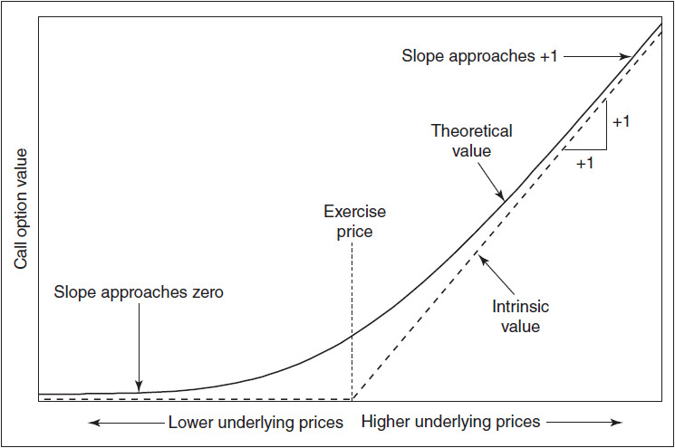

<!-- source:block 8f921c1a387410f4 -->

> [!quote]- English 21
> Assuming that all other market conditions remain unchanged, a call option can never gain or lose value more quickly than the underlying contract, nor can it move in the opposite direction of the underlying market. The delta of a call must therefore have an upper bound of 1.00 if the call is very deeply in the money and a lower bound of 0 if the call is very far out of the money. Most calls will have deltas somewhere between 0 and 1.00, changing value more slowly than changes in the price of the underlying contract. A call with a delta of 0.25 will change its value at 25 percent of the rate of change in the price of the underlying contract. If the underlying rises (falls) 1.00, the option can be expected to rise (fall) 0.25. A call with a delta of 0.75 will change its value at 75 percent of the rate of change in the price of the underlying contract. If the underlying rises (falls) 0.60, the option can be expected to gain (lose) 0.45 in value. A call with a delta close to 0.50 will rise or fall in value at just about half the rate of change in the price of the underlying contract.

假设所有其他市场条件保持不变，看涨期权永远不会比标的合约更快地增值或贬值，也不能向标的市场相反的方向移动。因此，如果看涨期权价内非常深，则看涨期权的Delta的上限必须为1.00，如果看涨期权价外非常远，则Delta的下限必须为0。大多数看涨期权的Delta在0到1.00之间，价值变化比标的合约价格变化慢。Delta为0.25的看涨期权将以标的合约价格变化率的25%改变其价值。如果基础上涨（下跌）1.00，则该期权预计将上涨（下跌）0.25。Delta为0.75的看涨期权将以标的合约价格变化率的75%改变其价值。如果基础上涨（下跌）0.60，则期权的价值预计将上涨（下跌）0.45。Delta接近0.50的看涨期权价值的涨跌幅度仅为标的合约价格变化率的一半左右。

<!-- source:block cdf8ef8342d1e66e -->

> [!quote]- English 22
> Puts have characteristics similar to calls except that put values move in the opposite direction of the underlying market. In Figure 7-5, we can see that when the underlying price rises, puts lose value; when the underlying price falls, puts gain value. For this reason, puts always have negative deltas, ranging from 0 for far out-of-the-money puts to–1.00 for deeply in-the-money puts. As with call deltas, put deltas measure the rate of change in the put’s value with respect to a change in the price of the underlying, but the negative sign indicates that the change will be in the opposite direction of the underlying contract. A put with a delta of –0.10 will change its value at 10 percent of the rate of change in the price of the underlying contract, but in the opposite direction. If the underlying moves up (down) 0.50, the put can be expected to lose (gain) 0.05 in value. A put with a delta of –0.50 will change its value at approximately half the rate of the underlying, but in the opposite direction.

看跌期权具有与看涨期权类似的特征，只是看跌期权价值与标的市场的方向相反。在图7-5,中我们可以看到，当标的价格上涨时，看跌期权失去价值;当标的价格下跌时，看跌期权增值。 因此，看跌期权总是具有负的Delta，范围从远OTM看跌期权的0到深ITM看跌期权的-1.00。 与看涨期权Delta一样，看跌期权期权Delta衡量看跌看跌期权价值相对于标的价格变化的变化率，但负符号表明变化将与标的合约的方向相反。 Delta为-0.10的看跌期权将以标的合约价格变化率的10 %改变其价值，但方向相反。如果标的向上（向下）移动0.50，则预期看跌期权的价值会损失（增加）0.05。 Delta为-0.50的看跌期权将以标的大约一半的速率更改其值，但方向相反。

<!-- source:block ccc59082b128ee4d -->

*图7-5看跌期权的理论价值。 / Figure 7-5 Theoretical value of a put.*

<!-- source:block baf49847d68e67a3 -->

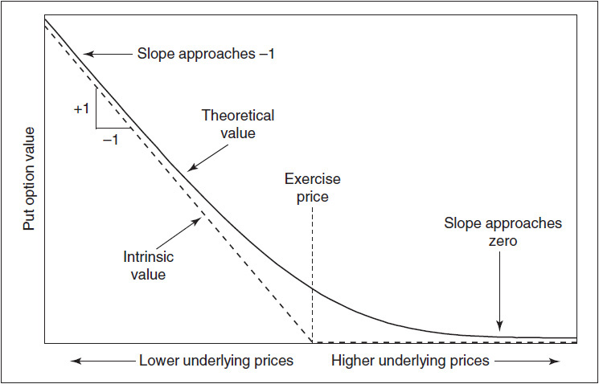

<!-- source:block 63721dceee973940 -->

> [!quote]- English 24
> An option position is often combined with a position in the underlying contract. To determine the total risk of a combined position, we will need to assign a delta value to the underlying contract. Logically, a position in the underlying contract will gain or lose value at exactly the rate of change in the underlying price. Therefore, regardless of whether the underlying is stock, a futures contract, or some other instrument, the underlying contract always has a delta of 1.00.

期权头寸通常与标的合约中的头寸结合在一起。为了确定组合头寸的总风险，我们需要为标的合约分配Delta值。从逻辑上讲，标的合约中的头寸将完全按照标的价格的变化率来增值或贬值。因此，无论标的是股票、期货合约还是其他工具，标的合约的Delta始终为1.00。

<!-- source:block c7f95f884b86c74e -->

> [!quote]- English 25
> Although delta values range from 0 to 1.00 for calls and from 0 to –1.00 for puts, it has become common practice among many option traders to express delta values as a whole number by dropping the decimal point, a convention that we will follow in this text.2 Using this format, the delta of a call will fall within the range of 0 to 100, and the delta of a put within the range of –100 to 0. An underlying contract will always have a delta of 100.

尽管看涨期权的Delta值范围为0至1.00，看跌期权的Delta值范围为0至-1.00，但许多期权交易者的常见做法是通过删除小数点将Delta值表示为一个完整的数字，这是我们将在本文中遵循的惯例。[^ovp07-2]使用这种格式，看涨期权的Delta值将落在0至100的范围内，而看跌的Delta在-100到0的范围内。标的合约的Delta始终为100。

<!-- source:block 775009486058dcc7 -->

### 对冲比率 / Hedge Ratio

<!-- source:block 27b942ed6504c4e4 -->

> [!quote]- English 26
> In Chapter 5, we introduced the concept of a *riskless*, or *neutral*, hedge, a position that, within a small price range, will neither gain nor lose value as the price of the underlying contract moves up or down. We can determine the proper number of underlying contracts to option contracts required for such a hedge by dividing 100 (the delta of the underlying contract) by the option’s delta. For a call option with a delta of 50, the proper hedge ratio is 100/50, or 2/1. For every two options purchased (sold), we need to sell (buy) one underlying contract to establish a neutral hedge. A call option with a delta of 40 requires the sale (purchase) of two underlying contracts for every five options purchased (sold) because 100/40 = 5/2.

在第5章中，我们介绍了无风险或中性对冲的概念，这种头寸在很小的价格范围内，随着标的合约价格的上涨或下跌，既不会增值，也不会损失价值。我们可以通过将100（标的合约的Delta）除以期权的Delta来确定此类对冲所需的标的合约到期权合约的适当数量。对于Delta为50的看涨期权，适当的对冲比率为100/50，即2/1。对于每购买（出售）两个期权，我们需要出售（购买）一个标的合约以建立中性对冲。Delta为40的看涨期权需要每购买（出售）五个期权就出售（购买）两个标的合约，因为100/40 = 5/2。

<!-- source:block e9f26e16ac89d0c0 -->

> [!quote]- English 27
> The hedge ratio interpretation also applies to puts, except that when we buy puts, we need to buy the underlying contract, and when we sell puts, we need to sell the underlying contract. A put with a delta of –75 will require the purchase (sale) of three underlying contracts for each four puts purchased (sold) because 100/–75 = 4/–3.

对冲比率解释也适用于看跌期权，只是当我们购买看跌期权时，我们需要购买标的合约，当我们出售看跌期权时，我们需要出售标的合约。Delta为-75的看跌期权将需要每购买（出售）四个看跌期权购买（出售）三个标的合约，因为100/-75 = 4/-3。

<!-- source:block 5f54f6fab51d29e3 -->

> [!quote]- English 28
> A position is neutrally hedged, or *delta neutral*, if the total of all the deltas that make up the position add up to 0. If we buy two calls with a delta of 50 each and sell one underlying contract, the total delta position is

如果构成头寸的所有Delta的总和为0，则该头寸被中性对冲或Delta中性。如果我们买入两个Delta为50的看涨期权，卖出一个标的合约，总Delta头寸为

<!-- source:block 94a7f789160b486a -->

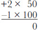

<!-- 原 EPUB 中此公式为图片，已原样保留 -->

<!-- source:block 968a67c7e0d05494 -->

> [!quote]- English 29
> If we sell four puts with a delta of –75 each and sell three underlying contracts, the total delta position is

如果我们出售四个Delta为-75的看跌期权并出售三个标的合约，那么Delta头寸总额为

<!-- source:block 8ac53f12b185bc69 -->

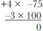

<!-- 原 EPUB 中此公式为图片，已原样保留 -->

<!-- source:block 92f439e1286e81eb -->

> [!quote]- English 30
> Both positions are delta neutral.3

两个头寸均为Delta中性。[^ovp07-3]

<!-- source:block e457e46c0ccf7eab -->

> [!quote]- English 31
> A position that is delta neutral has no particular preference for either upward or downward movement in the price of the underlying contract. Although a trader may take whatever delta position he feels is appropriate, either bullish (delta positive) or bearish (delta negative), we will see in Chapter 8 that a trader who is trying to capture the theoretical value of an option must start with and maintain a delta-neutral position over the entire life of an option.

Delta中性头寸对标的合约价格的向上或向下移动没有特别偏好。尽管交易者可能会采取他认为合适的任何Delta头寸，无论是看涨（Delta正）还是看跌（Delta负），但我们将在第8章中看到，试图捕捉期权理论价值的交易者必须从一开始并在期权的整个生命周期内保持Delta中性头寸。

<!-- source:block 8f4c0f5d5b64409e -->

### 理论或等价标的头寸 / Theoretical or Equivalent underlying Position

<!-- source:block 1e7c1b27aae7e4b3 -->

> [!quote]- English 32
> Many option traders come to the option market after trading in the underlying contract. Futures option traders often start their careers by trading futures; stock option traders often start by trading stock. If a trader has become accustomed to evaluating his risk in terms of the number of underlying contracts bought or sold (either futures contracts or shares of stock), he can use the delta to equate the directional risk of an option position with a position of similar size in the underlying market.

许多期权交易员在交易标的合约后来到期权市场。期货期权交易员通常从期货交易开始他们的职业生涯;股票期权交易员通常从股票交易开始。如果交易员已经习惯于根据买入或卖出的标的合约（期货合约或股票）的数量来评估他的风险，他可以使用Delta来将期权头寸的方向风险与标的市场中类似规模的头寸等同起来。

<!-- source:block f23467123e15a94c -->

> [!quote]- English 33
> Because an underlying contract always has a delta of 100, in terms of directional risk, each 100 deltas in an option position is theoretically equivalent to one underlying contract. A trader who owns an option with a delta of 50 is long, or controls, approximately half of an underlying contract. If he owns 10 such contracts, he is long 500 deltas or, in equivalent terms, five underlying contracts. If the underlying is a futures contract, the trader is theoretically long five such contracts. If the underlying is a stock contract consisting of 100 shares of stock, he is theoretically long 500 shares of stock. The trader has a similar theoretical position if he sells 20 puts with a delta of –25 each because –20 × –25 = +500.

由于标的合约的Delta总是为100，因此就方向风险而言，期权头寸中每100个Delta理论上相当于一份标的合约。拥有Delta为50的期权的交易员是做多或控制标的合约的大约一半。如果他拥有10份此类合约，那么他就做多了500份Delta，或者同等条件下，做多了5份标的合约。如果标的是期货合约，那么交易员理论上会做多五份此类合约。如果标的是由100股股票组成的股票合约，那么他理论上是做多500股股票。如果交易员出售20个看跌期权，每个看跌期权的Delta为-25，那么他的理论头寸类似，因为-20 x-25 =+500。

<!-- source:block 0b575a916e49bacc -->

> [!quote]- English 34
> It is important to emphasize the theoretical aspect of the delta interpretation as an equivalent to an underlying position. An option is not simply a surrogate for an underlying position. An actual underlying position is almost exclusively sensitive to directional moves in the underlying market. An option position, while sensitive to directional moves, is also sensitive to other changes in market conditions. An option trader who looks only at his delta position may be ignoring other factors that could have a far greater impact on his position. The delta represents an equivalent underlying position only under very narrowly defined market conditions.

重要的是要强调Delta解释的理论方面，将其等同于标的头寸。期权不仅仅是标的头寸的替代品。实际的标的头寸几乎完全对标的市场的方向性波动敏感。期权头寸虽然对方向变动敏感，但对市场条件的其他变化也敏感。只关注Delta头寸的期权交易员可能会忽视其他可能对其头寸产生更大影响的因素。Delta仅在非常狭窄的市场条件下代表等效的标的头寸。

<!-- source:block 159c849ef08f5b08 -->

> [!quote]- English 35
> Which interpretation—rate of change in the theoretical value, the hedge ratio, or the equivalent underlying position—should a trader use? That depends on how the trader intends to use the delta. A trader who has a delta position of +500 knows that he has a position that is similar to being long five underlying contracts (the equivalent-underlying-position interpretation). If he is a disciplined theoretical trader striving to maintain a delta-neutral position, he must sell five underlying contracts (the hedge-ratio interpretation). And finally, if he is bullish and maintains his current delta position of +500, the value of his position will change at approximately five times, or 500 percent, of the rate of change in the price of the underlying contract (the rate-of-change interpretation). If the price of the underlying contract rises by 2.00, the trader’s position should gain approximately 10.00. If the price of the underlying contract falls by 1.25, the trader’s position should lose approximately 6.25. Mathematically, all these interpretations are the same. A trader will choose a delta interpretation that is consistent with his approach to trading.

交易员应该使用哪种解释——理论价值的变化率、对冲比率或等效的标的头寸？这取决于交易员打算如何使用Delta。Delta头寸为+500的交易者知道他的头寸类似于做多五个标的合约（等效标的头寸解释）。如果他是一名纪律严明的理论交易员，努力维持Delta中性头寸，那么他必须出售五份标的合约（对冲比率解释）。最后，如果他看涨并维持当前+500的Delta头寸，那么他的头寸价值将以标的合约价格变化率的大约五倍（即500%）变化（变化率解释）。如果标的合约的价格上涨2.00，则交易者的头寸应增加约10.00。如果标的合约的价格下跌1.25，则交易者的头寸应该损失约6.25。从数学上讲，所有这些解释都是一样的。交易者将选择与其交易方法一致的Delta解释。

<!-- source:block ccb2aa0fd94c20ba -->

### 概率 / Probability

<!-- source:block dcdfb0a4b5aa9050 -->

> [!quote]- English 36
> There is one other interpretation of the delta that is perhaps of less practical use, but is still worth mentioning. If we ignore the sign of the delta (positive for calls, negative for puts), the delta is approximately equal to the probability that the option will finish in the money. A call with a delta of 25 or a put with a delta of –25 has approximately a 25 percent chance of finishing in the money. A call with a delta of 75 or a put with a delta of –75 has approximately a 75 percent chance of finishing in the money. As an option’s delta moves closer to 100, or –100 for puts, the option becomes more and more likely to finish in the money. As the delta moves closer to 0, the option becomes less and less likely to finish in the money. This also explains why at-the-money options tend to have deltas close to 50. If we assume that price changes are random, there is half a chance that the market will rise (the option goes into the money) and half a chance that the market will fall (the option goes out of the money).4

Delta还有另一种解释，可能不太实用，但仍然值得一提。如果我们忽略Delta的符号（看涨为正值，看跌为负值），则Delta大约等于期权完成ITM的概率。 Delta为25的看涨期权或Delta为-25的看跌期权期权完成ITM的概率约为25 %。Delta为75的看涨期权或Delta为-75的看跌期权期权大约有75 %的机会完成ITM。 随着期权的Delta越来越接近看跌期权的100,或-100，该期权变得越来越有可能完成ITM。随着Delta逐渐接近0,，选件完成ITM的可能性越来越小。这也解释了为什么ATM期权的Delta往往接近50。 如果我们假设价格变化是随机的，那么市场上涨的可能性有一半（期权进入货币），市场下跌的可能性有一半（期权进入OTM）。 [^ovp07-4]

<!-- source:block 9b468c2f1517b3c4 -->

> [!quote]- English 37
> Of course, the delta is only an approximation of the probability because interest considerations and, in the case of stock options, dividends may distort this interpretation. Moreover, most option strategies depend not only on whether an option finishes in the money but also by how much. If a trader sells an option with a delta of 10 in the belief that the option will expire worthless nine times out of 10, he may indeed be correct. But, if on the tenth time he loses an amount greater than the total premium he took in the nine times the option expired worthless, the trade will result in a negative expected return. To trade options intelligently, we need to consider not only how often a strategy wins or loses but also how much it wins or loses. Every experienced trader is willing to accept several small losses if he can occasionally offset these with one big win that more than offsets the losses. In the same way, no experienced trader will want to pursue a strategy that leads to multiple small profits but occasionally results in a disastrous loss.5

当然，Delta只是可能性的近似值，因为利息考虑，以及股票期权的股息可能会扭曲这一解释。此外，大多数期权策略不仅取决于期权是否完成ITM，还取决于期权完成了多少。 如果交易者出售Delta为10的期权，相信该期权将在10,中九次失效，那么他可能确实是对的。 但是，如果他在第十次时损失的金额大于他在九次期权到期时获得的总溢价而毫无价值，那么该交易将导致负的预期回报。 为了智能地交易期权，我们不仅需要考虑策略获胜或失败的频率，还需要考虑策略获胜或失败的程度。每一位经验丰富的交易者都愿意接受一些小损失，如果他能偶尔用一场超过抵消损失的大胜利来抵消这些损失。 同样，没有经验丰富的交易员愿意追求一种可以带来多重微薄利润但偶尔会导致灾难性损失的策略。 [^ovp07-5]

<!-- source:block 1b82c693a9199433 -->

## Gamma（Delta 变化率） / The Gamma

<!-- source:block d1ba4e7801fdb083 -->

> [!quote]- English 38
> Figure 7-6 shows call and put delta values using the whole-number format. Even though deltas range from 0 to 100 for calls and from –100 to 0 for puts, the graphs are not straight lines. As the underlying price rises or falls, the slope of the graph changes, approaching 0 at both extremes. If this were not true, the delta values of calls could fall below 0 or rise above 100, and the delta values of puts could fall below –100 or rise above 0. The slope appears to be greatest when the underlying price is close to the option’s exercise price.

图7-6显示了使用整数字格式的看涨和看跌Delta值。尽管看涨的Delta范围为0到100，看跌的Delta范围为-100到0，但图表并不是直线。随着标的价格上涨或下跌，图表的斜率发生变化，在两个极端都接近0。如果情况不成立，看涨期权的Delta值可能会降至0以下或升至100以上，而看跌期权的Delta值可能会降至-100以下或升至0以上。当标的价格接近期权的行权价时，斜率似乎最大。

<!-- source:block d5821715f5545da1 -->

*图7-6 Delta值。 / Figure 7-6 Delta values.*

<!-- source:block 94efbcde3c09de8f -->

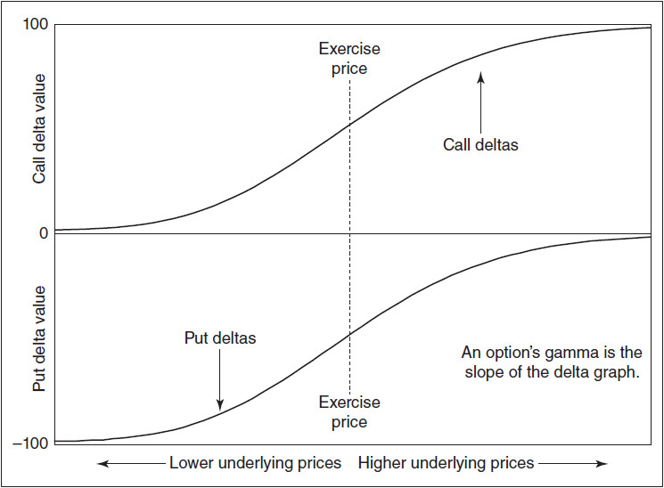

<!-- source:block 98db81566a8dd420 -->

> [!quote]- English 40
> The *gamma* (Γ), sometimes referred to as the option’s *curvature*, is the rate of change in the delta as the underlying price changes. The gamma is usually expressed in deltas gained or lost per one-point change in the underlying, with the delta increasing by the amount of the gamma when the underlying rises and falling by the amount of the gamma when the underlying falls. If an option has a gamma of 5, for each point rise (fall) in the price of the underlying, the option will gain (lose) 5 deltas.6 If the option initially has a delta of 25 and the underlying moves up (down) one full point, the new delta of the option will be 30 (20). If the underlying moves up (down) another point, the new delta will be 35 (15).7

Gamma（Γ），有时也被称为期权的曲率，是标的价格变化时Delta的变化率。Gamma通常以标的资产每变化一个点所获得或损失的Delta表示，当标的资产上涨时Delta增加Gamma的量，当标的资产下跌时Delta减少Gamma的量。如果一个期权的Gamma值为5，则标的价格每上涨（下跌）一点，期权将获得（损失）5个Delta。[^ovp07-6]如果期权最初的Delta值为25，而标的价格上涨（下跌）一个整点，则期权的新Delta值将为30（20）。如果标的价格上升（下降）另一个点，新的Delta将是35（15）。 [^ovp07-7]

<!-- source:block 3a8278a9595766cf -->

> [!quote]- English 41
> From Figure 7-6, we can see that the delta graphs of both calls and puts have essentially the same shape and that the graphs always have a positive slope. This suggests that calls and puts with the same exercise price and time to expiration have the same gamma values and that these values are always positive. This may seem strange to a new trader who, because of the delta, tends to associate positive numbers with calls and negative numbers with puts. But regardless of whether we are working with calls or puts, we always add the gamma to the old delta as the underlying price rises and subtract the gamma from the old delta as the underlying price falls. When a trader is long options, whether calls or puts, he has a long gamma position.

从图7-6中，我们可以看到，看涨和看跌的Delta图具有本质上相同的形状，并且这些图总是具有正的斜率。这表明具有相同行权价和到期时间的看涨期权和看跌期权具有相同的Gamma值，并且这些值始终为正值。对于新交易员来说，这可能看起来很奇怪，由于Delta的原因，他倾向于将正值与看涨联系起来，将负值与看跌联系起来。但无论我们是处理看涨期权还是看跌期权，我们总是在标的价格上涨时将Gamma添加到旧Delta中，并在标的价格下跌时从旧Delta中减去Gamma。当交易者做多期权时，无论是看涨期权还是看跌期权，他都拥有长Gamma头寸。

<!-- source:block 01f64f018aedb487 -->

> [!quote]- English 42
> For example, consider both an at-the-money call with a delta of 50 and an at-the-money put with a delta of –50. How will the delta change as the underlying price changes if both options have gamma values of 5? If the underlying price rises one full point, we add the gamma of 5 to the call delta of 50 to get the new delta of 55. To get the new put delta if the underlying contract rises one point, we also *add* the gamma of 5 to the put delta of –50 to get the new delta of –45. This is intuitively logical—as the underlying price rises, at-the-money calls move into the money and at-the-money puts move out of the money. If the underlying contract falls one full point, in both cases we *subtract* the gamma, resulting in a call delta of 50 – 5 = 45 and a put delta of –50 – 5 = –55. Now the call is moving out of the money and the put is moving into the money.

例如，考虑一份 Delta 为 50 的平值（ATM）看涨期权和一份 Delta 为 −50 的平值看跌期权。若两份期权的 Gamma 均为 5，当标的价格变化时，它们的 Delta 将如何变化？如果标的价格上涨一个点，我们将 Gamma 5 加到看涨期权原来的 Delta 50 上，得到新的 Delta 55；同样，也将 Gamma 5 加到看跌期权原来的 Delta −50 上，得到新的 Delta −45。这在直觉上是合理的——随着标的价格上涨，平值看涨期权转为价内（ITM），平值看跌期权转为价外（OTM）。如果标的价格下跌一个点，两者都要从原 Delta 中减去 Gamma，因此看涨期权的 Delta 为 50 − 5 = 45，看跌期权的 Delta 为 −50 − 5 = −55。此时，看涨期权正转为价外（OTM），看跌期权正转为价内（ITM）。

<!-- source:block c149ff590fcdfd02 -->

> [!quote]- English 43
> Because all options individually have positive gamma values, we can create a positive gamma position by buying options, either calls or puts, and a negative gamma position by selling options. For a complex position consisting of many different options, we use the same interpretation of the gamma as we do for individual options, adding the gamma to the old delta as the underlying contract rises and subtracting the gamma as the market falls. A positive gamma position will gain deltas as the market rises (we are adding a positive number) and lose deltas as the market falls (we are subtracting a positive number). A negative gamma position will behave in just the opposite way, losing deltas as the market rises (we are adding a *negative* number) and gaining deltas as the market falls (we are subtracting a *negative* number). Moreover, the rate of change in the delta will be determined by the size of the gamma position. New traders are often advised to avoid large gamma positions, particularly negative ones, because of the speed with which the directional risk, as reflected by the delta, can change.

由于每个单一期权的 Gamma 都为正，我们可以通过买入期权（无论看涨期权还是看跌期权）建立正 Gamma 头寸，也可以通过卖出期权建立负 Gamma 头寸。对于由多种期权构成的复杂头寸，Gamma 的含义与单一期权相同：标的价格上涨时，将 Gamma 加到原 Delta 上；标的价格下跌时，则从原 Delta 中减去 Gamma。正 Gamma 头寸会在市场上涨时增加 Delta（即加上一个正数），在市场下跌时减少 Delta（即减去一个正数）。负 Gamma 头寸的表现恰好相反：市场上涨时 Delta 减少（即加上一个负数），市场下跌时 Delta 增加（即减去一个负数）。此外，Delta 的变化速度取决于 Gamma 头寸的大小。交易新手通常会被建议避免持有过大的 Gamma 头寸，尤其是过大的负 Gamma 头寸，因为其 Delta 所反映的方向性风险可能迅速变化。

<!-- source:block 5b8e87effac9317f -->

> [!quote]- English 44
> While the delta is a measure of how an option’s value will change if the underlying price changes, it is important to remember that it represents an instantaneous measure. It is only valid for very small price changes. If the underlying makes a sizable move, any estimate of the option’s new value using a constant delta will become less and less reliable. We can, however, improve this estimate if we also take into consideration the gamma.

虽然Delta是衡量如果标的价格变化，期权价值将如何变化的指标，但重要的是要记住，它代表了即时的指标。它仅对非常小的价格变化有效。如果标的物出现大幅波动，那么使用恒定Delta对期权新价值的任何估计都会变得越来越不可靠。然而，如果我们还考虑Gamma，我们就可以改进这个估计。

<!-- source:block ea414a34f7046518 -->

> [!quote]- English 45
> Suppose that at price *S*1 a call has a theoretical value *C*, a delta Δ, and a gamma Γ. If the price of the underlying changes from *S*1 to *S*2, what should be the new value of the option? One approach might be to simply multiply the change in price, *S*2 – *S*1, by the delta and add it to the original value *C*

假设在价格S1，看涨期权具有理论价值C、Delta δ和Gamma Γ。如果标的价格从S1变为S2，期权的新价值应该是多少？ 一种方法可能是简单地将价格变化S2 - S1乘以Delta并将其添加到原始值C中

<!-- source:block 899170cf88e2740a -->

> [!quote]- English 46
> *C* + [Δ × (*S*1 – *S*2) ]

$$
C\,+ [\Delta \times (S_{1} -\,S_{2}) ]
$$

<!-- source:block 44fa6158bda3b068 -->

> [!quote]- English 47
> But this assumes that the delta is constant, which it is not. As the underlying price moves from *S*1 to *S*2, the delta of the option is also changing. When the underlying price reaches *S*2, the new delta of the option will be

但这假设Delta是恒定的，但事实并非如此。随着标的价格从S1移动到S2，期权的Delta也在发生变化。当标的价格达到S2时，期权的新Delta将是

<!-- source:block c7337ce85834f2d8 -->

> [!quote]- English 48
> Δ + (*S*1 – *S*2) × Γ

$$
\Delta + (S_{1} -\,S_{2}) \times \Gamma
$$

<!-- source:block dae3f96e25066c0f -->

> [!quote]- English 49
> Which delta should we use for our calculation, the original delta (Δ) or the new delta [Δ + (*S*1 – *S*2) × Γ]? Rather than use either of these delta values, we might logically use the average delta over the price range *S*1–*S*2

我们应该使用哪一个Delta来计算，原始Delta（Delta）还是新Delta[Delta+（S1 - S2）x Gamma]？我们可能会在逻辑上使用价格范围S1-S2的平均Delta，而不是使用这些Delta值中的任何一个

<!-- source:block b0682fced47242a2 -->

> [!quote]- English 50
> Average delta = [Δ + Δ + (*S*1 – *S*2) × Γ]/2 = Δ + (*S*1 – *S*2) × Γ/2

$$
\text{Average delta} = [\Delta + \Delta + (S_{1} -\,S_{2}) \times \Gamma]/2 = \Delta + (S_{1} -\,S_{2}) \times \frac{\Gamma}{2}
$$

<!-- source:block cae3c78b49492b8b -->

> [!quote]- English 51
> This is not a precise solution because the gamma also changes as the underlying price changes, but it will yield a better estimate than using a constant delta. Using the average delta, the new value of the option should be approximately8

这不是一个精确的解决方案，因为Gamma也会随着标的价格的变化而变化，但它会比使用恒定Delta产生更好的估计。使用平均Delta，期权的新值应该大约为 [^ovp07-8]

<!-- source:block a751ac5152bc3cd9 -->

> [!quote]- English 52
> *C* + (*S*1 – *S*2) × [Δ + (*S*1 – *S*2) × Γ/2] = *C* + [(*S*1 – *S*2) × Δ] + [(*S*1 – *S*2)2 × Γ/2]

$$
C\,+ (S_{1} -\,S_{2}) \times [\Delta + (S_{1} -\,S_{2}) \times \frac{\Gamma}{2}] =\,C + [(S_{1} -\,S_{2}) \times \Delta] + [(S_{1} -\,S_{2})^{2} \times \frac{\Gamma}{2}]
$$

<!-- source:block 817a8f63b3282a87 -->

> [!quote]- English 53
> This approach applies equally well to puts, as long as we remember that a put will have a negative delta.

这种方法同样适用于看跌期权，只要我们记住看跌期权将具有负Delta。

<!-- source:block b51dc0daa1c62e44 -->

> [!quote]- English 54
> For example, suppose that at an underlying price of 97.50, a call option has a theoretical value of 3.65, a delta of 40, and a gamma of 2.5. If the underlying contract rises to 101.50, what should be the option’s new value?

例如，假设标的价格为97.50，看涨期权的理论值为3.65，Delta为40，Gamma为2.5。如果标的合约上涨至101.50，期权的新价值应该是多少？

<!-- source:block 8fda0bed86aeb13c -->

> [!quote]- English 55
> At the new underlying price of 101.50, the delta of the option is

在新的标的价格101.50时，期权的Delta为

<!-- source:block bb56caa0ef1c7be3 -->

> [!quote]- English 56
> 40 + 4 × 2.5 = 50

$$
40 + 4 \times 2.5 = 50
$$

<!-- source:block 93c6ad0bd901c249 -->

> [!quote]- English 57
> The average delta as the underlying price rises from 97.50 to 101.50 is

标的价格从97.50上涨至101.50时的平均Delta为

<!-- source:block e75ff9e85eed0757 -->

> [!quote]- English 58
> (40 + 50)/2 = 45

$$
(40 + 50)/2 = 45
$$

<!-- source:block 4a789480d58d981c -->

> [!quote]- English 59
> Using the average delta, the new option value is approximately

使用平均Delta，新期权价值大约为

<!-- source:block 7a96c390d29c2745 -->

> [!quote]- English 60
> 3.65 + (4.00 × 0.45) = 5.45

$$
3.65 + (4.00 \times 0.45) = 5.45
$$

<!-- source:block 0fe50ac37c934ca7 -->

## Theta（时间敏感度） / The Theta

<!-- source:block 031a1ffe10d2c94a -->

> [!quote]- English 61
> An option’s value is made up of intrinsic value and time value. As time passes, the time-value portion gradually disappears until, at expiration, the option is worth exactly its intrinsic value. This can be seen in Figures 7-7 and 7-8.

期权的价值由内在价值和时间价值组成。随着时间的推移，时间价值部分逐渐消失，直到到期时期权完全符合其内在价值。这可以在图7-7和7-8中看出。

<!-- source:block 33a42b81f8b7330b -->

*图7-7随着时间的推移，看涨期权的理论值。 / Figure 7-7 Theoretical value of a call as time passes.*

<!-- source:block 709939ce9356be0f -->

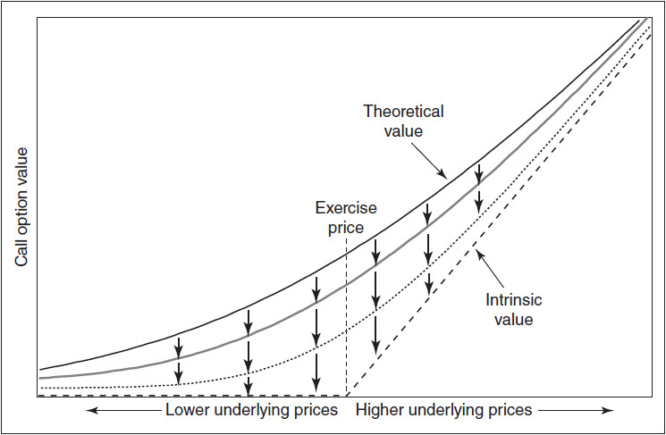

<!-- source:block 3592643bf4e30bc2 -->

*图7-8随着时间的推移，看跌期权的理论值。 / Figure 7-8 Theoretical value of a put as time passes.*

<!-- source:block 9a6c6203e704c7df -->

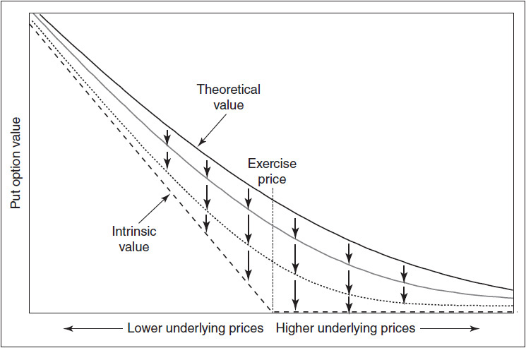

<!-- source:block 22a91abfde79195d -->

> [!quote]- English 64
> The *theta* (Θ), or *time decay*, is the rate at which an option loses value as time passes, assuming that all other market conditions remain unchanged. It is usually expressed as value lost per one day’s passage of time. An option with a theta of 0.05 will lose 0.05 in value for each day that passes with no movement in the underlying contract. If its theoretical value today is 4.00, one day later it will be worth 3.95. Two days later it will be worth 3.90.

假设所有其他市场条件保持不变，Theta（Theta）或时间衰减是期权随着时间的推移失去价值的速度。它通常表示为每一天时间流逝损失的价值。Theta为0.05的期权在标的合约没有变动的情况下每过一天，价值就会损失0.05。如果它今天的理论价值是4.00，那么一天后它就会价值3.95。两天后价值3.90美元。

<!-- source:block 268d3696954fba68 -->

> [!quote]- English 65
> Almost all options lose value as time passes. For this reason, it is common to express the theta as a negative number, a convention that we will follow in this text. An option with a theta of –0.05 will lose 0.05 for each day that passes with no changes in any other market conditions.

随着时间的推移，几乎所有的选择都会失去价值。因此，通常将Theta表示为负值，这是我们将在本文中遵循的惯例。在任何其他市场条件没有变化的情况下，Theta为-0.05的期权每天都会损失0.05。

<!-- source:block e0c3c61f16d23ea5 -->

> [!quote]- English 66
> We will look at theta in greater detail in Chapter 9. For now, there is one important characteristic of theta that is worth mentioning: if an option is exactly at the money as time passes, the theta of the option increases. With three months remaining to expiration, an at-the-money option may have a theta of –0.03. However, with three weeks to expiration, the same option, if it is still at the money, may have a theta of –0.06. And with three days to expiration, the option may have a theta of –0.16. The theta becomes increasingly large as expiration approaches.

我们将在第 9 章更详细地讨论 Theta。这里先说明 Theta 的一个重要特征：如果期权在时间流逝的过程中始终恰好处于平值状态，其 Theta 的绝对值会逐渐增大。距离到期还有三个月时，一份平值期权的 Theta 可能为 −0.03；距离到期还有三周时，如果该期权仍为平值，其 Theta 可能为 −0.06；距离到期仅剩三天时，其 Theta 可能达到 −0.16。也就是说，越接近到期，平值期权的 Theta 绝对值越大（Theta 变得越来越负）。

<!-- source:block 817d4cda995b8ce2 -->

> [!quote]- English 67
> Is it ever possible for an option to have a positive theta such that if nothing changes, the option will be worth more tomorrow than it is today? In fact, this can happen because of the depressing effect of interest rates. Consider a 60 call on an underlying contract that is currently trading at 100. How much might this call be worth if we know that at expiration the underlying contract will still be at 100? At expiration, the option will be worth 40, its intrinsic value. However, if the option is subject to stock-type settlement, today it will only be worth the present value of 40, perhaps 39. If the underlying price remains at 100, as time passes, the value of the option must rise from 39 (its value today) to 40 (its intrinsic value at expiration). The option in effect has negative time value and therefore a positive theta. It will be worth slightly more as each day passes. This is shown in Figure 7-9.

期权是否有可能具有正的Theta，如果没有变化，那么该期权明天的价值就会比今天更高？事实上，这种情况可能发生是因为利率的抑制作用。考虑对当前交易价格为100的标的合约进行60看涨。如果我们知道标的合约到期时仍将为100，那么这个看涨期权的价值有多少？到期时，该期权的价值为40美元，即其内在价值。然而，如果该期权受到股票型结算的约束，那么今天它的现值仅为40，也许是39。如果标的价格保持在100，随着时间的推移，期权的价值必须从39（其今天的价值）上升到40（其到期时的内在价值）。实际上，该期权具有负的时间价值，因此具有正的Theta。随着时间的推移，它的价值会稍微高一些。如图7-9所示。

<!-- source:block 343ae62cee0c2280 -->

*图7-9如果期权的时间价值为负，其theta将为正;随着时间的推移，期权的价值将向内在价值上升。 / Figure 7-9 If an option has negative time value, its theta will be positive; as time passes, the value of the option will rise toward intrinsic value.*

<!-- source:block a920d8bf14286071 -->

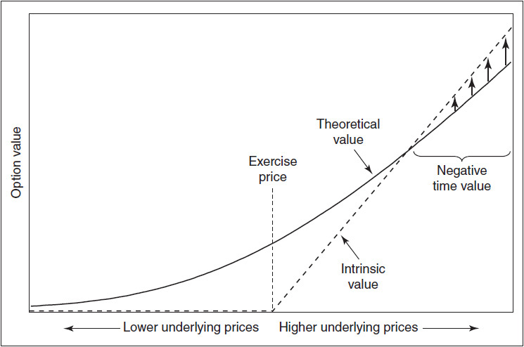

<!-- source:block 70a4bfe00c19cdd2 -->

> [!quote]- English 69
> Instances of negative time value and, consequently, positive theta are relatively rare. At a minimum, the option must be subject to stock-type settlement, it must be deeply in the money, and it must also be European with no possibility of early exercise. If the option were American, everyone would exercise it today in order to earn interest on the intrinsic value. We will discuss this situation in greater detail when we take a closer look at early exercise of American options.

负时间价值和正Theta的时间相对较少。至少，该期权必须服从股票型结算，必须深度ITM，而且还必须是欧洲的，不可能提前行权。 如果期权是美国的，每个人今天都会行权它，以赚取内在价值的利息。我们将在更仔细地研究美国选择权的早期行权时更详细地讨论这种情况。

<!-- source:block e6c00f1a04fa9065 -->

## Vega（波动率敏感度） / The Vega

<!-- source:block 25c3ab27e75c6ff0 -->

> [!quote]- English 70
> Just as option values are sensitive to changes in the underlying price (delta) and to the passage of time (theta), they are also sensitive to changes in volatility. This is shown in Figures 7-10 and 7-11. Although the terms *delta*, *gamma*, and *theta* are used by all option traders, there is no one generally accepted term for the sensitivity of an option’s theoretical value to a change in volatility. The most commonly used term in the trading community is *vega*, and this is the term that will be used in this text. But this is by no means universal. Because vega is not a Greek letter, a common alternative in academic literature, where Greek letters are preferred, is *kappa* (K).9

正如期权价值对标的价格（Delta）和时间流逝（Theta）的变化敏感一样，它们也对波动率的变化敏感。如图7-10和图7-11所示。 尽管所有期权交易者都使用Delta、Gamma和Theta术语，但没有一个普遍接受的术语来描述期权理论价值对波动率变化的敏感性。 贸易界最常用的术语是Vega，这是本文中将使用的术语。但这绝不是普遍的。由于Vega不是希腊字母，在学术文献中，希腊字母是首选的，通常的替代是kappa（K）。 [^ovp07-9]

<!-- source:block ff8d5ad1348c7668 -->

*图7-10波动率变化时看涨期权的理论值。 / Figure 7-10 Theoretical value of a call with changing volatility.*

<!-- source:block f06e479ec0812165 -->

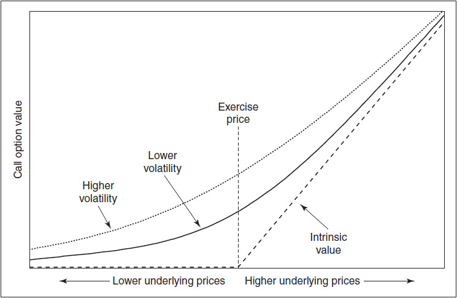

<!-- source:block 93d2435a5797c012 -->

*图7-11波动率变化时看跌期权的理论值。 / Figure 7-11 Theoretical value of a put with changing volatility.*

<!-- source:block c7ec8828368b8783 -->

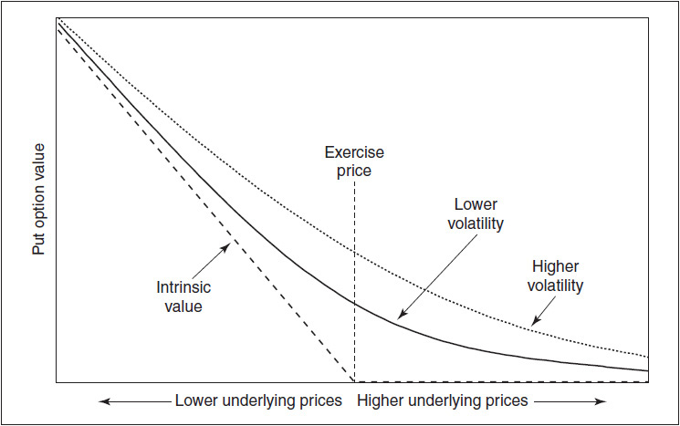

<!-- source:block faa643d8fb8d0592 -->

> [!quote]- English 73
> The vega of an option is usually expressed as the change in theoretical value for each one percentage point change in volatility. Because all options gain value with rising volatility, the vega for both calls and puts is positive. If an option has a vega of 0.15, for each percentage point increase (decrease) in volatility, the option will gain (lose) 0.15 in theoretical value. If the option has a theoretical value of 3.25 at a volatility of 20 percent, then it will have a theoretical value of 3.40 at a volatility of 21 percent and a theoretical value of 3.10 at a volatility of 19 percent.

期权的Vega通常表示为波动率每变化一个百分点，理论价值的变化。由于所有期权都随着波动率上升而增值，因此看涨和看跌期权的Vega都是正值。如果期权的Vega为0.15，则波动率每增加（减少）一个百分点，期权的理论价值就会增加（损失）0.15。如果期权在波动率为20%时的理论值为3.25，那么在波动率为21%时的理论值为3.40，在波动率为19%时的理论值为3.10。

<!-- source:block 0655577ef2902122 -->

## Rho（利率敏感度） / The Rho

<!-- source:block cffc0821bae083d6 -->

> [!quote]- English 74
> The sensitivity of an option’s theoretical value to a change in interest rates is given by its *rho* (**P**), usually expressed as the change in theoretical value for each one percentage point change in interest rates. Unlike the other sensitivities, one cannot generalize about the rho because its characteristics depend on the type of underlying instrument and the settlement procedure for the options. The general effects have already been summarized in Figure 7-2. Note that foreign-currency options that require delivery of the currency rather than delivery of a futures contract are affected by both domestic and foreign interest rates. Hence, such options have two interest-rate sensitivities, rho1 (the domestic interest-rate sensitivity) and rho2 (the foreign interest-rate sensitivity). The latter is sometimes denoted by the Greek letter phi (Φ).

期权理论价值对利率变化的敏感度由 Rho（ρ）衡量，通常表示利率每变动一个百分点时理论价值的变化。与其他敏感度不同，Rho 的特征取决于标的工具类型和期权结算程序，因此不能一概而论。其一般规律已在图 7-2 中概述。需要交割货币而非期货合约的外币期权会同时受到本国利率和外国利率的影响，因此具有两种利率敏感度：Rho 1（本国利率敏感度）和 Rho 2（外国利率敏感度）。后者有时用希腊字母 Phi（Φ）表示。

<!-- source:block fdcda405be50a551 -->

> [!quote]- English 75
> If both the underlying contract and the options are subject to futures-type settlement, the rho must be 0 because no cash flow results from either a trade in the underlying contract or a trade in the options. When options on futures are subject to stock-type settlement, the rho associated with both calls and puts is negative. An increase in interest rates will decrease the value of such options because it raises the cost of carrying the options. In the case of stock options, calls will have positive rho values (an increase in interest rates will make calls a more desirable alternative to buying the stock) and puts will have negative rho values (an increase in interest rates will make puts a less desirable alternative to selling the stock).

如果标的合约和期权均须接受期货型结算，则Rho必须为0，因为标的合约的交易或期权的交易不会产生现金流。当期货期权进行股票型结算时，与看涨和看跌相关的Rho都是负的。利率上升将降低此类期权的价值，因为它会提高持有期权的成本。就股票期权而言，看涨期权将具有正的Rho值（利率上升将使看涨期权成为购买股票的更理想的替代方案），而看跌期权将具有负的Rho值（利率上升将使看跌期权成为出售股票的不太理想的替代方案）。

<!-- source:block 9bdbf51d7a594ef7 -->

> [!quote]- English 76
> Although changes in interest rates can affect an option’s theoretical value, the interest rate is usually the least important of the inputs into a pricing model. For this reason, the rho is usually considered less critical than the delta, gamma, theta, or vega. Indeed, few individual traders worry about the rho. However, a firm or trader who has a very large option position should at least be aware of the interest-rate risk associated with the position. As with any risk, if it becomes too large, it may be necessary to take steps to reduce the risk. Because of its relatively minor importance, in most examples, we will disregard the rho in analyzing option strategies and managing risk.

尽管利率的变化可能会影响期权的理论价值，但利率通常是定价模型的输入中最不重要的。因此，Rho通常被认为不如Delta、Gamma、Theta或Vega那么重要。事实上，很少有个体交易者担心Rho。然而，拥有非常大期权头寸的公司或交易员至少应该意识到与该头寸相关的利率风险。与任何风险一样，如果风险变得太大，可能有必要采取措施来降低风险。由于其重要性相对较小，在大多数例子中，我们在分析期权策略和管理风险时会忽略Rho。

<!-- source:block 1ab6512e531c6fbb -->

> [!quote]- English 77
> We know that the delta of an underlying contract is always 100, but what is the gamma, theta, vega, and rho of an underlying contract? The gamma is the rate of change in the delta with respect to movement in the underlying contract. But the delta of an underlying contract is always 100 regardless of price changes. Therefore, the gamma must be 0. An underlying contract does not decay, so its theta must also be 0. Nor is the underlying contract subject to volatility considerations, so its vega must be 0. And finally, changes in interest rates do not affect the value of an underlying contract, so the rho must also be 0.10 The only risk measure we associate with an underlying contract is the delta; everything else is 0. The signs of the risk measures for an underlying contract, for calls, and for puts are summarized in Figure 7-12.

我们知道标的合约的Delta总是100,，但标的合约的Gamma、Theta、Vega和Rho是什么？Gamma是Delta相对于标的合约变动的变化率。 但无论价格如何变化，标的合约的Delta始终为100。因此，Gamma必须是0。标的合约不会衰变，因此其Theta也必须是0。标的合约也不受波动率因素的影响，因此其Vega必须为0。 最后，利率变化不会影响标的合约的价值，因此Rho也必须是0。我们与标的合约关联的唯一风险度量是Delta;其他所有度量都是0。 标的合约、看涨和看跌期权的风险指标迹象总结在图7-12中。 [^ovp07-10]

<!-- source:block f44b58bde0199ee0 -->

*图7-12 / Figure 7-12*

<!-- source:block fd1dacfb55b6b8ba -->

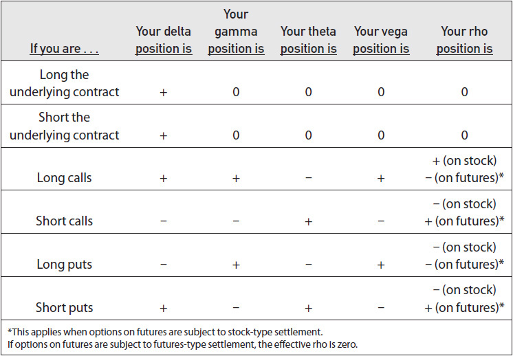

<!-- source:block 3a63cf109a47d51c -->

## 解读风险指标 / Interpreting the Risk Measures

<!-- source:block 360d8c0b80b030d5 -->

> [!quote]- English 79
> If a trader has a position consisting of only a small number of options, it is probably not necessary to do a detailed risk analysis. In all likelihood, the trader already has a fairly clear picture of the potential risks and rewards associated with the position. However, if the position becomes more complex, with options at different expiration dates over a wide range of exercise prices, it may not be immediately apparent what risks the trader has taken on. A good starting point in analyzing the risk of a position is to consider the risk measures associated with the position.

如果交易者的头寸仅由少量期权组成，则可能没有必要进行详细的风险分析。很可能，交易员已经相当清楚地了解与该头寸相关的潜在风险和回报。然而，如果头寸变得更加复杂，期权到期日期不同，行权价范围很广，那么交易员承担了哪些风险可能并不立即清楚。分析头寸风险的一个良好起点是考虑与头寸相关的风险指标。

<!-- source:block 325e5ed59e691217 -->

> [!quote]- English 80
> Figure 7-13 shows a theoretical evaluation for a hypothetical series of options on stock, where the underlying contract is 100 shares. Figure 7-14 shows several different positions with the total delta, gamma, theta, vega, and rho for each position. We will assume that each position was initiated at the quoted prices.

图7-13显示了对假设的股票期权系列的理论评估，其中标的合约是100股。图7-14显示了几个不同的头寸以及每个头寸的总Delta、Gamma、Theta、Vega和Rho。 我们假设每个头寸都是按照报价发起的。

<!-- source:block 142802f23310d455 -->

*图7-13 / Figure 7-13*

<!-- source:block f7fefe45a85d1c29 -->

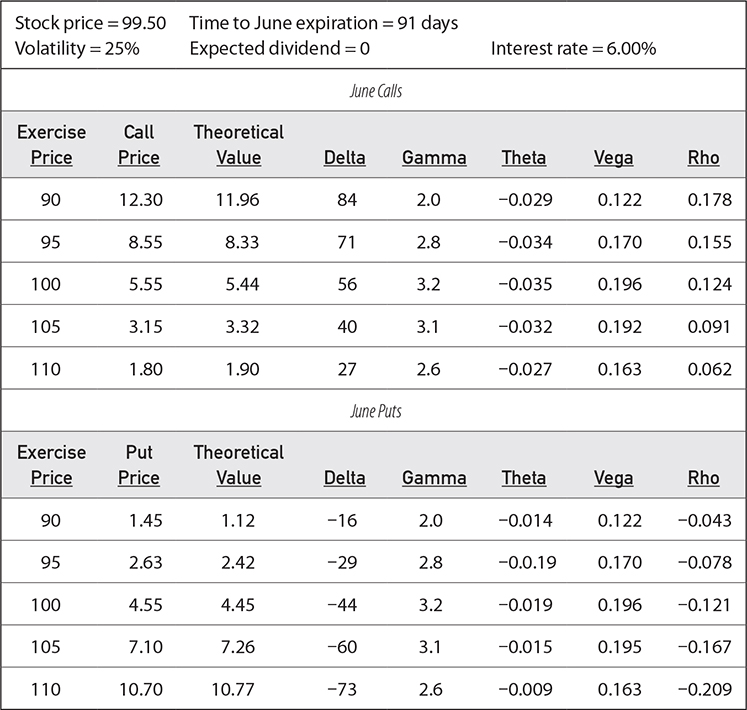

<!-- source:block 668527000a54f149 -->

*图7-14 / Figure 7-14*

<!-- source:block 58a943bb9f41da1b -->

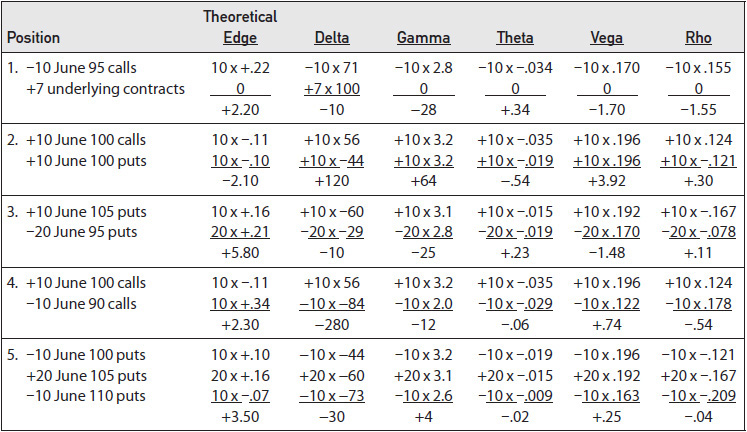

<!-- source:block ef0ec481dfa960e7 -->

> [!quote]- English 83
> First, note that all risk measures are additive. To determine the total risk measure for a position, we multiply each risk measure by the number of contracts (using a plus sign for a purchase and a minus sign for a sale), and add everything up.

首先，请注意，所有风险指标都是相加的。为了确定头寸的总风险度量标准，我们将每个风险度量标准乘以合约数量（购买时使用正号，销售时使用正号），然后将所有内容相加。

<!-- source:block 54ab2fb46b4bdc5e -->

> [!quote]- English 84
> Let’s consider the risk of Position 1 in Figure 7-14. Before doing this, however, we might ask a more fundamental question: why might someone take such a position in the first place? Like every trader, an option trader wants to make trades that result in a profit. To have the best chance of achieving this goal, an option trader will try to create positions with a positive theoretical edge, either buying options at prices less than theoretical value and/or selling options at prices greater than theoretical value. Although this is not a guarantee that the position will show a profit, by creating a positive theoretical edge, the trader, like a casino, has the laws of probability working in his favor. Therefore, a trader should first consider whether a position has a positive theoretical edge.

让我们考虑图7-14中头寸1的风险。然而，在这样做之前，我们可能会问一个更基本的问题：为什么有人一开始会采取这样的头寸？与每个交易者一样，期权交易者希望进行能够带来利润的交易。为了有最好的机会实现这一目标，期权交易员将尝试创建具有正理论优势的头寸，要么以低于理论价值的价格购买期权，要么以高于理论价值的价格出售期权。虽然这并不能保证头寸会盈利，但通过创造一个积极的理论优势，交易者就像赌场一样，有对他有利的概率法则。因此，交易者应该首先考虑一个头寸是否具有积极的理论优势。

<!-- source:block afc0c1ac3a2f79cc -->

> [!quote]- English 85
> In Position 1, we sold 10 June 95 calls at a price of 8.55, but the theoretical value of the options was 8.33, so the sale created a theoretical edge of 0.22 per option. What about the theoretical edge for the trade in the underlying? From an option trader’s point of view, the theoretical value of an underlying contract is simply the price at which it was traded. Consequently, the theoretical edge for any underlying trade is always 0. The position has a total theoretical edge of +2.20.

在头寸1中，我们以8.55的价格出售了95年6 月到期、行权价为 10 的看涨期权，但期权的理论价值为8.33，因此此次出售创造了每个期权0.22的理论优势。标的交易的理论优势如何？从期权交易者的角度来看，标的合约的理论价值只是其交易价格。因此，任何标的交易的理论优势始终为0。该头寸的总理论优势为+2.20。

<!-- source:block 6581579253284772 -->

> [!quote]- English 86
> The total delta of Position 1 is –10. Although this indicates a very slight preference for downward movement, for practical purposes, almost all traders would consider the position delta neutral.

头寸1的总Delta为-10。尽管这表明对向下移动的轻微偏好，但出于实际目的，几乎所有交易者都会认为头寸Delta中性。

<!-- source:block ac02d5da41b96697 -->

> [!quote]- English 87
> The total gamma of the position is –28. We know that a positive or negative delta indicates a desire for upward or downward movement in the price of the underlying contract, but what does a positive or negative gamma indicate? Consider what will happen to our delta position if the underlying stock starts to rise. Just as with an individual option, for each point increase, we add the gamma to the old delta to get the new delta. But we are adding a negative number (–28). If the stock rises one full point to 100.50, the delta will be

该头寸的总Gamma为-28。我们知道，正或负的Delta表示标的合约价格希望向上或向下移动，但正或负的Gamma表示什么呢？考虑如果标的股票开始上涨，我们的Delta头寸会发生什么。就像单个期权一样，对于每增加一次点，我们都会将Gamma添加到旧的Delta中以获得新的Delta。但我们正在添加一个负数（-28）。如果该股上涨一个整点至100.50点，

<!-- source:block 529d5d18a6ff190e -->

> [!quote]- English 88
> –10 + (–28) = –38

$$
-10 + (-28) = -38
$$

<!-- source:block 04a0f374723455b7 -->

> [!quote]- English 89
> If the stock rises another point to 101.50, the delta will be

如果该股再上涨一点至101.50，则Delta将为

<!-- source:block 33fb82e31e3f1c6f -->

> [!quote]- English 90
> –38 + (–28) = –66

$$
-38 + (-28) = -66
$$

<!-- source:block f35e7792ab13c0b0 -->

> [!quote]- English 91
> As the market rises, the delta becomes a larger negative number. Because a negative delta indicates a desire for downward movement, the more the market rises, the more we would like it to decline.

随着市场上涨，Delta变成更大的负值。由于负的Delta表明有向下移动的愿望，因此市场上涨得越多，我们就越希望它下跌。

<!-- source:block 3e190e658bea82d2 -->

> [!quote]- English 92
> Now consider what will happen to our delta position if the underlying stock starts to fall. For each point decline, we subtract the gamma from the delta. If the stock falls one point to 98.50, the new delta will be

现在考虑一下，如果标的股票开始下跌，我们的Delta头寸会发生什么。对于每个点的下降，我们从Delta中减去Gamma。如果该股下跌一个点至98.50，新的Delta将是

<!-- source:block e1edffa36ddc88ee -->

> [!quote]- English 93
> –10 – (–28) = +18

$$
-10 - (-28) = +18
$$

<!-- source:block 129d5b590cd9b017 -->

> [!quote]- English 94
> If the stock falls another point to 97.50, the delta will be

如果该股再次下跌至97.50，则Delta将为

<!-- source:block 19714b4f4214b439 -->

> [!quote]- English 95
> +18 – (–28) = +46

$$
+18 - (-28) = +46
$$

<!-- source:block b7ccd77043f22005 -->

> [!quote]- English 96
> As the market falls, the delta becomes a larger positive number. For the same reason we do not want the stock price to rise (we are creating a larger negative delta in a rising market), we also do not want the stock price to fall (we are creating a larger positive delta in a falling market). If we do not want the market to rise and we do not want the market to fall, there is only one favorable outcome remaining: we must want the market to sit still. In fact, a negative gamma position is a good indication that a trader either wants the underlying market to sit still or move only very slowly. A positive gamma position indicates a desire for very large and swift moves in the underlying market.

随着市场下跌，头寸的 Delta 会变得越来越正。正如我们不希望股价上涨——因为市场上涨时，头寸的 Delta 会变得越来越负——我们同样也不希望股价下跌——因为市场下跌时，头寸的 Delta 会变得越来越正。如果既不希望市场上涨，也不希望市场下跌，那么只剩下一种有利情形：市场保持平稳。事实上，负 Gamma 头寸通常意味着交易者希望标的市场基本不动，或者只发生非常缓慢的价格变化；正 Gamma 头寸则表示交易者希望标的市场出现幅度很大且速度很快的价格变化。

<!-- source:block 77fb0faa1be517b6 -->

> [!quote]- English 97
> Whereas delta is a measure of directional risk, gamma can be thought of as a measure of *magnitude risk*. Do we want moves of smaller magnitude (a negative gamma) or larger magnitude (a positive gamma)? Alternatively, gamma also can be thought of as the speed at which we want the market to move. Do we want the underlying price to move slowly (a negative gamma) or quickly (a positive gamma)? Taken together, the delta and gamma tell us something about the direction and speed that will either help or hurt our position. In Position 1, we want a slow (negative gamma) downward (negative delta) move in the underlying price. The worst situation would be a swift upward move. Then we would be on the wrong side of both the direction (delta) and speed (gamma) of the market.

Delta是方向性风险的衡量标准，而Gamma则可以被认为是幅度风险的衡量标准。我们想要较小幅度的移动（负Gamma）还是较大幅度的移动（正Gamma）？或者，Gamma也可以被认为是我们希望市场移动的速度。我们希望标的价格缓慢变动（负Gamma）还是快速变动（正Gamma）？总而言之，Delta和Gamma告诉我们有关方向和速度的一些信息，这要么有助于我们的头寸，要么损害我们的头寸。在头寸1，我们希望标的价格缓慢（负Gamma）向下（负Delta）移动。最糟糕的情况是迅速上涨。那么我们就会站在市场方向（Delta）和速度（Gamma）的错误一边。

<!-- source:block d8e8f4404141eb65 -->

> [!quote]- English 98
> How will we feel about our position if the stock remains close to 99.50? From the negative gamma, we know that we want the market to remain relatively quiet. If the market does what we want it to do, we ought to expect our position to show a profit. Where will this profit come from? The profit will come from the theta of +0.34. For each day that passes with no movement in the underlying price, the position should show a profit of approximately 0.34. This underscores an important principle of option risk analysis: gamma and theta are almost always of opposite sign.11 A positive gamma will be accompanied by a negative theta, and vice versa. Moreover, the magnitudes of the risks will tend to correlate. A large gamma will be accompanied by a large theta, but of opposite sign. A small gamma will be accompanied by a small theta. An option trader cannot have it both ways. Either market movement will help the position (positive gamma) or the passage of time (positive theta) will—but not both.

如果股票保持接近99.50，我们对自己的头寸有何看法？从负Gamma来看，我们知道我们希望市场保持相对安静。如果市场做了我们希望它做的事情，我们就应该期望我们的头寸显示盈利。这笔利润从何而来？ 利润将来自+0.34的Theta。对于标的价格没有变化的每一天，头寸应显示约为0.34的利润。这强调了期权风险分析的一个重要原则：Gamma和Theta几乎总是符号相反。 正的Gamma将伴随着负的Theta，反之亦然。此外，风险的大小往往是相互关联的。一个大的Gamma将伴随着一个大的Theta，但符号相反。小的Gamma将伴随着小的Theta。 期权交易者不能两全其美。要么市场运动会帮助头寸（正Gamma），要么时间的流逝（正Theta）会帮助头寸——但不能两者兼而有之。 [^ovp07-11]

<!-- source:block 277296eaa8438366 -->

> [!quote]- English 99
> The vega of Position 1 is –1.70. This indicates a desire for declining volatility. For each point decline in volatility, the value of our position, which was initially +2.20, will increase by 1.70; for each point increase, the value will fall by 1.70. This seems to correspond to our gamma risk. If we have a negative gamma, we want the market to remain relatively quiet. Isn’t this the same as saying we want lower volatility? Most traders, however, make an important distinction between the gamma and vega. The gamma is a measure of whether we want higher or lower *realized* volatility (whether we want the underlying contract to be more volatile or less volatile). The vega is a measure of whether we want higher or lower *implied* volatility. Although the volatility of the underlying contract and changes in implied volatility are often correlated, this is not always the case. In some cases, the underlying contract can become more volatile while implied volatility is falling. In other cases, the underlying contract can become less volatile while implied volatility is rising. We will look at the conditions that can cause this in Chapter 11, where we look at some of the common volatility spreads.

头寸1的Vega为-1.70。这表明人们希望降低波动率。波动率每下降一个点，我们的头寸价值（最初为+2.20）将增加1.70;每增加一个点，该价值将减少1.70。这似乎与我们的Gamma风险相对应。如果我们有负的Gamma，我们希望市场保持相对安静。这难道不等于说我们想要更低的波动率吗？然而，大多数交易员都会对Gamma和Vega进行重要区分。Gamma是衡量我们是希望更高还是更低的已实现波动率（我们是希望标的合约波动率更大还是更小）。Vega是衡量我们想要更高还是更低的隐含波动率的指标。尽管标的合约的波动率和隐含波动率的变化通常是相关的，但情况并非总是如此。在某些情况下，当隐含波动率下降时，标的合约可能会变得更加波动。在其他情况下，当隐含波动率上升时，标的合约的波动率可能会降低。我们将在第11章中研究可能导致这种情况的条件，其中我们将研究一些常见的波动率价差。

<!-- source:block 17f3c5fc799e1f78 -->

> [!quote]- English 100
> Suppose that we raise the volatility of 25 percent in Figure 7-13 to a volatility of 26 percent. What should be our theoretical profit now? We know that for each point increase in volatility, we need to add the vega (–1.70) to the old value (+2.20) to get the new value. Our theoretical profit at 26 percent will be

假设我们将图7-13中25%的波动率提高到26%的波动率。我们现在的理论利润应该是多少？我们知道，波动率每增加一个点，我们需要将Vega（-1.70）添加到旧值（+2.20）上才能获得新值。我们的理论利润为26%

<!-- source:block 960db1b4f0ed04ff -->

> [!quote]- English 101
> +2.20 + (–1.70) = +0.50

$$
+2.20 + (-1.70) = +0.50
$$

<!-- source:block 2adc005cc9680092 -->

> [!quote]- English 102
> If we raise the volatility another percentage point to 27 percent, our theoretical edge turns negative

如果我们将波动率再提高一个百分点至27%，我们的理论优势将变为负值

<!-- source:block d87f09762d5fee22 -->

> [!quote]- English 103
> +0.50 + (–1.70) = –1.20

$$
+0.50 + (-1.70) = -1.20
$$

<!-- source:block 0702bf323d7a7669 -->

> [!quote]- English 104
> We can see that the position has a *breakeven* volatility of approximately

我们可以看到，该头寸的盈亏平衡波动率约为

<!-- source:block dedd515ad22c714f -->

> [!quote]- English 105
> 25(%) + (–2.20/–1.70)(%) = 25(%) + 1.29(%) = 27.29(%)

$$
25(\%) + (-2.20/-1.70)(\%) = 25(\%) + 1.29(\%) = 27.29(\%)
$$

<!-- source:block 9c2ab781243490f2 -->

> [!quote]- English 106
> Of course, a more common name for the breakeven volatility is implied volatility. Although traders most commonly associate implied volatility with individual options, we can also apply the concept to more complex positions. The implied volatility of a position is the volatility that must occur over the life of a position such that, in theory, the position will just break even. We can make a rough estimate of a position’s implied volatility by dividing the total theoretical edge by the total vega and adding this number to the volatility used to evaluate the position.

当然，盈亏平衡波动率的一个更常见的名称是隐含波动率。尽管交易员最常将隐含波动率与个人期权联系起来，但我们也可以将该概念应用于更复杂的头寸。头寸的隐含波动率是头寸整个生命周期中必须发生的波动率，因此理论上该头寸将盈亏平衡。我们可以通过将总理论优势除以总Vega，并将此数字添加到用于评估头寸的波动率中来粗略估计头寸的隐含波动率。

<!-- source:block 09b4fa8987634e98 -->

> [!quote]- English 107
> The last risk measure for Position 1 is the rho of –1.55. For each percentage point decline in the interest rate, the position will show an additional profit of 1.55. For each percentage point increase in the interest rate, the position profit will be reduced by 1.55. It should not come as a surprise that rho is negative because the long stock position will inevitably dominate the cash flow, resulting in a debit. If the interest rate falls, it will cost less to carry this debit. If the interest rate rises, it will cost more.

头寸1的最后一个风险度量是-1.55的Rho。利率每下降一个百分点，头寸将显示1.55的额外利润。利率每上升一个百分点，头寸利润将减少1.55。Rho为负并不奇怪，因为多头股票头寸将不可避免地主导现金流，导致 debit。如果利率下降，debit 的费用就会减少。如果利率上升，成本就会增加。

<!-- source:block 4a3d64b1e32cba1b -->

> [!quote]- English 108
> The risks and rewards associated with each type of risk measure are summarized in Figure 7-15. The reader should take a few moments to look over the risk characteristics of the other positions in Figure 7-14. What combination of market conditions (e.g., changes in underlying price, time, implied volatility, and interest rate) will most help each position? What combination will most hurt each position?

与每种类型的风险度量相关的风险和回报总结在图7-15中。读者应该花一些时间查看图7-14中其他头寸的风险特征。市场条件的组合（例如，标的价格、时间、隐含波动率和利率的变化）对每个头寸最有帮助？哪种组合对每个头寸的伤害最大？

<!-- source:block 3bca5e115ac66ed8 -->

*图7-15 / Figure 7-15*

<!-- source:block 0ff7c0ee6939276b -->

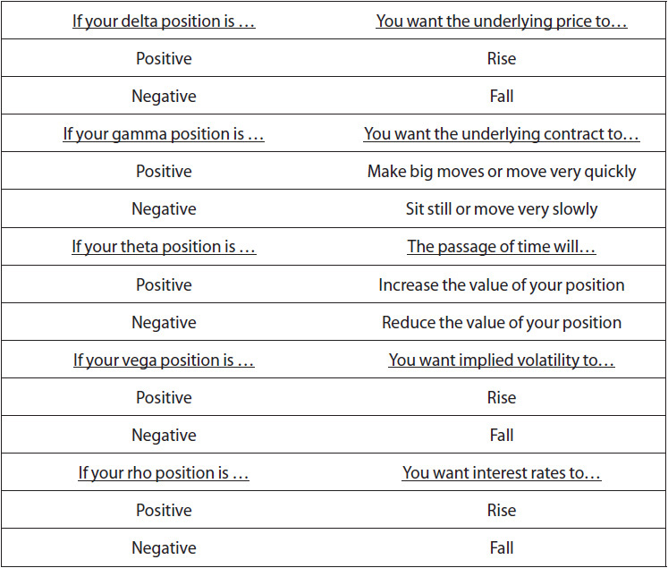

<!-- source:block 62dd2852571f285d -->

> [!quote]- English 110
> The alert reader may have noticed something odd about Position 2: it has a *negative theoretical edge*. This is not a misprint. It indicates that if the inputs into the model are correct, in the long run, the strategy will lose money. Of course, no trader will intentionally put on such a position, but in a market where conditions are constantly changing, a position that initially seemed sensible may under new conditions represent a losing strategy. When this occurs, a trader will make every effort to close out the position. The longer the trader holds the position, the more likely it is that it will result in a loss.12

警报读者可能注意到头寸2的一些奇怪之处：它具有负的理论优势。这不是印刷错误。这表明，如果模型的输入正确，从长远来看，该策略将会赔钱。 当然，没有交易者会故意看跌期权这样的头寸，但在一个条件不断变化的市场中，最初看似合理的头寸在新的条件下可能代表着一种失败的策略。当这种情况发生时，交易者将尽一切努力平仓。 交易者持有头寸的时间越长，导致亏损的可能性就越大。 [^ovp07-12]

<!-- source:block 41006877bfff024d -->

> [!quote]- English 111
> One final observation for the prospective trader: all the numbers we have discussed in this chapter—the theoretical value, delta, gamma, theta, vega, and rho—are constantly changing, so the profitability and risks associated with different strategies are constantly changing. The importance of analyzing risk cannot be overemphasized. Most traders who fail at option trading do so because they fail to fully analyze and understand risk. But there is another type of trader, one who attempts to analyze every possible risk. When this happens, the trader finds it difficult to make any trading decisions at all; he is stricken with *paralysis through analysis*. A trader who is so concerned with risk that he is afraid to make a trade cannot profit, no matter how well he understands options. When a trader enters the marketplace, he has chosen to take on some risk. The delta, gamma, theta, vega, and rho enable him to identify risk; they do not eliminate risk. The intelligent trader uses these numbers to help decide beforehand which risks are acceptable and which risks are not.

对潜在交易者的最后一个观察：我们在本章中讨论的所有数字——理论值、Delta、Gamma、Theta、Vega和Rho——都在不断变化，因此与不同策略相关的盈利能力和风险也在不断变化。分析风险的重要性怎么强调都不为过。大多数期权交易失败的交易者之所以失败，是因为他们未能充分分析和了解风险。但还有另一种类型的交易者，他们试图分析每一种可能的风险。当这种情况发生时，交易员会发现根本很难做出任何交易决定;他通过分析陷入瘫痪。一个非常担心风险以至于不敢进行交易的交易者无法盈利，无论他对期权的理解有多深。当交易者进入市场时，他选择承担一些风险。Delta、Gamma、Theta、Vega和Rho使他能够识别风险;它们并不能消除风险。聪明的交易者使用这些数字来帮助提前确定哪些风险是可接受的，哪些风险是不可接受的。

<!-- source:block 4671a8d34f5ba700 -->

> [!note] Footnote 112
> 1 We are referring here to options on the actual foreign currency rather than options on foreign-currency futures. In the latter case, the characteristics are the same as for any other futures option.

[^ovp07-1]: 我们在这里指的是实际外币期权，而不是外币期货期权。在后一种情况下，其特征与任何其他期货期权相同。

<!-- source:block df2c9e18f690c3bd -->

> [!note] Footnote 113
> 2 This convention originated in the U.S. stock option market, where it became common for stock option traders to equate one delta with one share of stock. Because the underlying contract consisted of 100 shares, traders assigned a delta of 100 to the underlying contract. Many futures option traders also express the delta using this whole-number format.

[^ovp07-2]: 这一惯例起源于美国股票期权市场，股票期权交易员将一个Delta等同于一股股票变得很常见。由于标的合约由100股组成，因此交易员为标的合约分配了100的Delta。许多期货期权交易员也使用这种整数字格式表达Delta。

<!-- source:block 34902c677cd1ef09 -->

> [!note] Footnote 114
> 3 It is customary to indicate the purchase of a contract or contracts with a plus sign (a long contract position) and the sale of a contract or contracts with a negative sign (a short contract position).

[^ovp07-3]: 习惯上用加号表示买入一份或多份合约（多头合约头寸），用负号表示卖出一份或多份合约（空头合约头寸）。

<!-- source:block dadaa206d6b3c97f -->

> [!note] Footnote 115
> 4 Because option values are based on the forward price of the underlying contract, it is actually the at-the-for-ward option that tends to have a delta closest to 50. This is one reason why options that are seemingly out of the money can have deltas greater than 50. With a stock at 100, one year to expiration, and an interest rate of 10 percent, the forward price for the stock is 110. Under these conditions, the 110 call will have a delta close to 50, while the 105 call will have a delta greater than 50.

[^ovp07-4]: 由于期权价值基于标的合约的远期价格，因此实际上是远期期权的Delta往往接近50。这就是为什么看似价外的期权的Delta可以大于50的原因之一。如果股票价格为100，距离到期还有一年，利率为10%，则该股票的远期价格为110。在这些条件下，110 看涨期权的Delta将接近50，而105 看涨期权的Delta将大于50。

<!-- source:block b34d05e8bac7501e -->

> [!note] Footnote 116
> 5 In fact, the delta is only an approximation of the probability that an option will finish in the money. We will see later that the Black-Scholes model generates a number that more precisely reflects this probability.

[^ovp07-5]: 事实上，Delta只是期权完成ITM的概率的近似值。稍后我们将看到，布莱克-斯科尔斯模型生成了一个更准确地反映这种可能性的数字。

<!-- source:block 57389c9211e8fbbf -->

> [!note] Footnote 117
> 6 In fact, the delta is only an approximation of the probability that an option will finish in the money. We will see later that the Black-Scholes model generates a number that more precisely reflects this probability.

[^ovp07-6]: 事实上，Delta只是期权完成ITM的概率的近似值。稍后我们将看到，布莱克-斯科尔斯模型生成了一个更准确地反映这种可能性的数字。

<!-- source:block 5553a458ba323d13 -->

> [!note] Footnote 118
> 7 For simplicity, we assume here that the gamma is constant. In reality, the gamma, like all risk measures, will change as market conditions change.

[^ovp07-7]: 为了简单起见，我们在这里假设Gamma是恒定的。事实上，Gamma与所有风险指标一样，也会随着市场条件的变化而变化。

<!-- source:block 7e707cfeb9ce9411 -->

> [!note] Footnote 119
> 8 When using the delta to estimate the change in an option’s value, we need to remember that it is really a percent value, or a value between 0 and 1.00.

[^ovp07-8]: 当使用Delta来估计期权价值的变化时，我们需要记住它实际上是一个百分比值，或者0到1.00之间的值。

<!-- source:block 742de63513b8993e -->

> [!note] Footnote 120
> 9 Traders tend to prefer the term vega because it starts with a v and is therefore a convenient reminder that it is associated with volatility. Vega is sometimes abbreviated with the Greek letter nu (ν) because in written form it is similar to a *v*.

[^ovp07-9]: 交易者倾向于使用Vega这个词，因为它以v开头，因此方便地提醒人们它与波动率有关。Vega有时缩写为希腊字母nu（ν），因为在书面形式上它类似于v。

<!-- source:block d885b4dba4d3a3c0 -->

> [!note] Footnote 121
> 10 A trader might argue that if interest rates rise or fall, it may change the forward price, which can, in turn, affect option values. But, from an option trader’s point of view, the value of an underlying contract is not directly affected by changes in interest rates.

[^ovp07-10]: 交易员可能会辩称，如果利率上升或下降，可能会改变远期价格，这反过来又会影响期权价值。但是，从期权交易员的角度来看，标的合约的价值不会直接受到利率变化的影响。

<!-- source:block fe8828a1728ece1e -->

> [!note] Footnote 122
> 11 Interest considerations may occasionally result in a position with a gamma and theta of the same sign. However, in such a case, the magnitudes of the numbers are likely to be very small.

[^ovp07-11]: 出于兴趣考虑，有时可能会导致Gamma和Theta符号相同的头寸。然而，在这种情况下，数字的幅度可能非常小。

<!-- source:block 308aaf72d8d01d68 -->

> [!note] Footnote 123
> 12 In theory, a trader will never create a position with a negative theoretical edge, at least as an initial trade. However, once a position has been established, in light of a larger overall position, a trader will sometimes intentionally execute a trade with a negative theoretical edge. A trader might be willing to give up a small amount of theoretical profit in order to make the remaining potential profit more secure. This, of course, is the whole objective behind hedging.

[^ovp07-12]: 理论上，交易者永远不会创建具有负理论优势的头寸，至少在初始交易中是这样。然而，一旦建立头寸，鉴于整体头寸较大，交易者有时会故意执行具有负理论优势的交易。交易者可能愿意放弃少量理论利润，以使剩余的潜在利润更有保障。当然，这就是对冲背后的全部目标。

---

[[阅读导航|← 返回阅读导航]]

<!-- chapter-nav:start -->
> [!tip] 章节导航（章末）
> [[波动率 Volatility|← 上一章]] · [[阅读导航|全书导航]] · [[动态对冲 Dynamic Hedging|下一章 →]]
<!-- chapter-nav:end -->
