# 风险度量（二） / Risk Measurement II

[[阅读导航|← 返回阅读导航]] · [[翻译说明与术语表|术语表]]

> [!warning] 翻译状态
> 本章为机器初译，并使用本地术语表校验。英文原文、数字、公式和图表用于核对；中文将在后续复核中继续修订。

<!-- chapter-toc:start -->
## 本章目录 / Chapter Outline

> [!abstract] 结构导航
> 以下标题按原书顺序保留；点击可直接跳转。

- [[#Delta / Delta|Delta / Delta]]
- [[#Theta / Theta|Theta / Theta]]
- [[#Vega / Vega|Vega / Vega]]
- [[#Gamma / Gamma|Gamma / Gamma]]
- [[#Lambda（Λ，杠杆率） / Lambda (Λ)|Lambda（Λ，杠杆率） / Lambda (Λ)]]
<!-- chapter-toc:end -->
<!-- chapter-nav:start -->
> [!tip] 章节导航（章首）
> [[动态对冲 Dynamic Hedging|← 上一章]] · [[阅读导航|全书导航]] · [[价差策略导论 Introduction to Spreading|下一章 →]]
<!-- chapter-nav:end -->
<!-- source:block ac5f3fa645570306 -->

> [!quote]- English 1
> Just as an option’s theoretical value is sensitive to changes in market conditions, the sensitivities themselves also change as market conditions change. This underscores an important aspect of option trading: nothing remains constant. Depending on market conditions, the same position can exhibit a wide range of risk characteristics. Today’s small risk can become tomorrow’s big risk.

正如期权的理论价值对市场条件的变化敏感一样，敏感性本身也会随着市场条件的变化而变化。这凸显了期权交易的一个重要方面：没有什么是不变的。根据市场条件，同一头寸可能表现出广泛的风险特征。今天的小风险可能成为明天的大风险。

<!-- source:block ece54e2e05fee9ba -->

> [!quote]- English 2
> Although it is impractical to analyze every potential risk, intelligent trading of options still requires us to consider the risk of a position under a wide variety of market conditions. Every serious trader’s education must include an understanding of the many different ways in which the risk of a position can change. Having some awareness of how the sensitivities change with changing market conditions is vital if we expect to intelligently manage the very real risks that option trading entails. In this chapter, we will take a closer look at how option risk measures change as market conditions change and how this affects the characteristics of a position.

尽管分析每一个潜在风险是不切实际的，但期权的智能交易仍然需要我们考虑各种市场条件下头寸的风险。每个认真的交易者的教育都必须包括了解头寸风险变化的许多不同方式。如果我们希望智能地管理期权交易带来的非常真实的风险，那么了解敏感性如何随着市场条件的变化而变化至关重要。在本章中，我们将仔细研究期权风险指标如何随着市场条件的变化而变化，以及这如何影响头寸的特征。

<!-- source:block 8e226382d16ba21b -->

## Delta / Delta

<!-- source:block 36161270ffe982bb -->

> [!quote]- English 3
> We have already looked at the sensitivity of the delta to one possible change in market conditions. In Figure 7-6, we saw that delta changes as the price of the underlying contract changes and that this change is represented by the option’s gamma. In addition to changes in the underlying price, the delta is also sensitive to changes in volatility and time.

我们已经研究了Delta对市场条件可能变化的敏感性。在图7-6中，我们看到Delta随着标的合约价格的变化而变化，并且这种变化由期权的Gamma来代表。除了标的价格的变化外，Delta还对波动率和时间的变化敏感。

<!-- source:block f48b6f1c0d545fe8 -->

> [!quote]- English 4
> Figure 9-1 shows what happens to the delta of a call as volatility changes. As volatility increases, the delta of an out-of-the-money call rises and the delta of an in-the-money call falls, with both deltas tending toward 50. This is logical because in a low-volatility market an out-of-the-money call is more likely to remain out of the money and therefore have a delta that is closer to 0, while an in-the-money call is more likely to remain in the money and therefore have a delta that is closer to 100. In a high-volatility market, we have the opposite effect. An out-of-the-money call has a greater likelihood of going into the money; an in-the-money call has a greater likelihood of going out of the money. Consequently, the deltas of both options will move toward 50.

图9-1显示了随着波动率变化，看涨期权Delta的变化。随着波动率的增加，价外看涨期权的Delta上升，价内看涨期权的Delta下降，两个Delta都趋于50。这是合乎逻辑的，因为在低波动率市场中，价内看涨期权更有可能保持在货币之外，因此Delta更接近0，而价内看涨期权更有可能保持在货币中，因此Delta更接近100。在高波动率的市场中，我们会产生相反的效果。价外看涨期权进入资金的可能性更大;价内看涨期权进入资金的可能性更大。因此，两种选择的Delta都将走向50。

<!-- source:block dc39af437e5f1197 -->

*图9-1随着波动率变化的看涨Delta值。 / Figure 9-1 Call delta values as volatility changes.*

<!-- source:block 8d650aabc76d304d -->

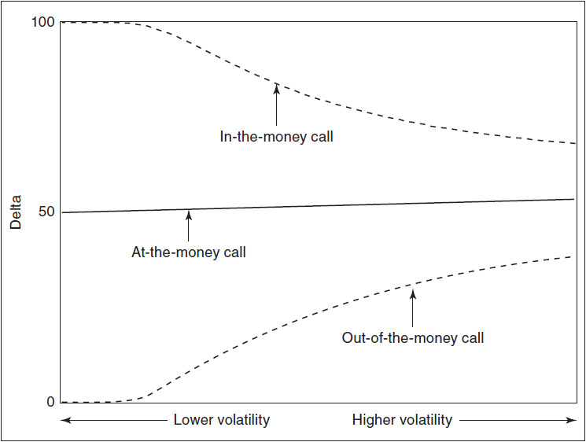

<!-- source:block 3b448ca752511445 -->

> [!quote]- English 6
> Note that the delta of an at-the-money option tends to remain close to 50 regardless of volatility. This is true in general, although changing interest rates or, in the case of stock options, changing dividends may alter the forward price. Because theoretical pricing models evaluate options in relation to the forward price, the delta of an at-the-money call may in fact be either more or less than 50. Even if the option is exactly at the forward (the exercise price and forward price are the same), a call will still have a delta that is slightly greater than 50 because of the lognormal distribution used to evaluate the option. This is evident in Figure 9-1, where the delta of an at-the-money call tends to increase slightly as volatility increases.

请注意，无论波动率如何，平值期权的Delta往往保持在接近50的水平。一般来说，这是正确的，尽管改变利率，或者就股票期权而言，改变股息可能会改变远期价格。由于理论定价模型根据远期价格评估期权，因此平值看涨期权的Delta实际上可能大于或小于50。即使期权恰好处于远期（行权价和远期价格相同），由于用于评估期权的对数正态分布，看涨期权的Delta仍然会略大于50。这一点在图9-1中表现得很明显，其中随着波动率的增加，平值看涨期权的Delta往往会略有增加。

<!-- source:block 0a880bcdf2ea6965 -->

> [!quote]- English 7
> Because an option’s delta changes as volatility changes, no trader can be certain that a position is really delta neutral. The delta depends on the volatility of the underlying contract, and this is something that will occur in the future over the life of the option. The volatility we use to calculate the delta is a guess. We might guess right, but we also might guess wrong. And if we guess wrong, our delta values will be wrong.

由于期权的Delta会随着波动率的变化而变化，因此没有交易员可以确定头寸确实是Delta中性的。Delta取决于标的合约的波动率，这是未来期权有效期内将发生的事情。我们用来计算Delta的波动率只是猜测。我们可能猜对了，但我们也可能猜错了。如果我们猜错了，我们的Delta值就会错误。

<!-- source:block aa5813cd10c00d7a -->

> [!quote]- English 8
> Rather than try to guess the future volatility, many traders use the *implied delta*, the delta that results from using the implied volatility. Using this approach, the delta will change as implied volatility changes, even if the underlying contract remains the same. Consider a trader who owns 40 call options with an implied volatility of 32 percent and a corresponding implied delta of 25 each. Because 40 × 25 = 1,000, to hedge the position delta neutral, the trader will sell 10 underlying contracts. If, however, implied volatility rises to 36 percent, the delta of the options will tend toward 50. If the new implied delta is 30, the trader’s delta position is now (40 × 30) – (10 × 100) = +200. The trader’s position changed from neutral to bullish even though no other market conditions changed.

许多交易员没有尝试猜测未来波动率，而是使用隐含波动率产生的Delta。使用这种方法，即使标的合约保持不变，Delta也会随着隐含波动率的变化而变化。假设一名拥有40个看涨期权的交易员，隐含波动率为32%，相应的隐含Delta为25。由于40 × 25 = 1,000，为了对冲Delta中性头寸，交易员将出售10份标的合约。然而，如果隐含波动率上升至36%，则期权的Delta将趋于50。如果新的隐含Delta为30，则交易者的Delta头寸现在为（40 × 30）-（10 × 100）=+200。尽管其他市场条件没有变化，交易员的头寸也从中性变为看涨。

<!-- source:block 299d3f8c07154ebf -->

> [!quote]- English 9
> Because the delta depends on the volatility, but volatility is an unknown factor, calculation of the delta can pose a major problem for a trader, especially for a large option position. Using the implied volatility to calculate the delta is only one possible approach.

由于Delta取决于波动率，但波动率是一个未知因素，因此Delta的计算可能会给交易员带来重大问题，尤其是对于大额期权头寸。使用隐含波动率来计算Delta只是一种可能的方法。

<!-- source:block 8a8b8ef4b965283f -->

> [!quote]- English 10
> Figure 9-2 shows what happens to call deltas as time passes. Note the similarities to Figure 9-1. Delta values move toward 50 if we increase either time to expiration or volatility and move away from 50 if we reduce either of these inputs. In many situations, time and volatility will have a similar effect on options. More time, like higher volatility, increases the likelihood of large price changes. Less time, like lower volatility, reduces the likelihood of large price changes. If a trader cannot immediately determine the effect on an option’s value or sensitivity of changing time, he might instead consider the effect of changing volatility. Conversely, if he cannot determine the effect of changing volatility, he might consider the effect of changing time. Both effects are likely to be similar.

图9-2显示了随着时间的推移，看涨期权Delta的情况。请注意与图9-1的相似之处。如果我们增加到期时间或波动率，Delta值就会移向50，如果我们减少这些输入中的任何一个，Delta值就会移向50。在许多情况下，时间和波动率会对期权产生类似的影响。更多的时间，比如波动率更高，会增加价格大幅变化的可能性。更少的时间，就像更低的波动率一样，会降低价格大幅变化的可能性。如果交易员无法立即确定时间变化对期权价值或敏感性的影响，他可能会考虑波动率变化的影响。相反，如果他无法确定波动率变化的影响，他可能会考虑时间变化的影响。这两种影响可能是相似的。

<!-- source:block 9f14c3f74055a948 -->

*图9-2随着时间的推移，看涨期权Delta值。 / Figure 9-2 Call delta values as time passes.*

<!-- source:block d04f62e0525f990c -->

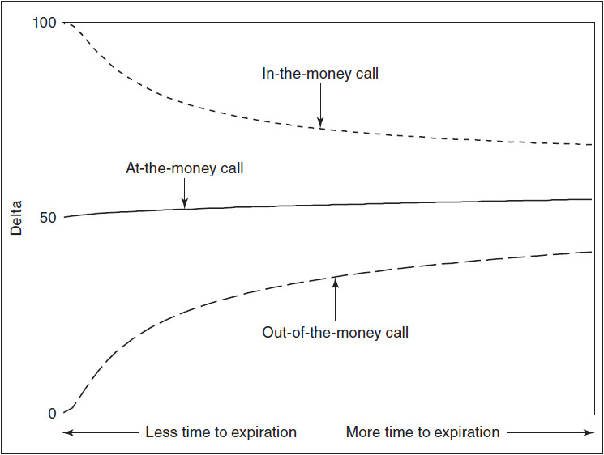

<!-- source:block 8cd7df836ddd2ab5 -->

> [!quote]- English 12
> The effects of volatility and time on put deltas are the same as those on call deltas, except that put deltas tend toward 0 and –100 as volatility falls or time passes and toward –50 as volatility rises. This is shown in Figures 9-3 and 9-4.

波动率和时间对看跌Delta的影响与看涨Delta的影响相同，只是随着波动率下降或时间的推移，看跌Delta趋于0和-100，而随着波动率上升，看跌Delta趋于-50。这如图9-3和9-4所示。

<!-- source:block bf49336760fe4b32 -->

*Figure 9-3 Put delta values as volatility changes / Figure 9-3 Put delta values as volatility changes*

<!-- source:block 538f5ca808e0f7ad -->

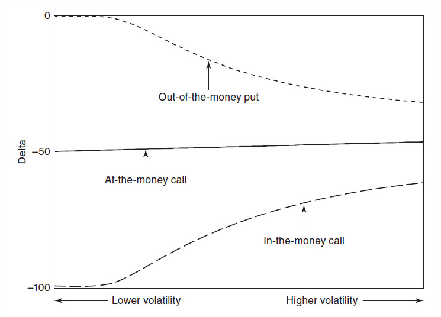

<!-- source:block b164555284c5078c -->

*Figure 9-4 Put delta values as time passes. / Figure 9-4 Put delta values as time passes.*

<!-- source:block 767e413dec7bfd1f -->

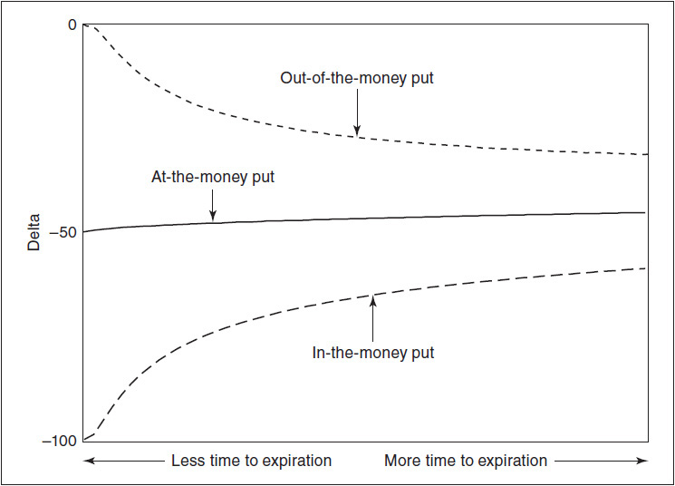

<!-- source:block 28b33ac791f4f590 -->

> [!quote]- English 15
> An alternative method of displaying the effects of changing time and volatility on delta values is shown in Figure 9-5. This is similar to Figure 7-6 except that we have varied time and volatility. As we lower time or reduce volatility, delta values for calls move very quickly toward either 0 for out-of-the-money options or 100 for in-the-money options.

显示时间和波动率变化对Delta值影响的替代方法如图9-5所示。这与图7-6类似，只是时间和波动率有所不同。随着我们缩短时间或降低波动率，看涨期权的Delta值很快就会向0（价外期权）或100（价内期权）移动。

<!-- source:block ee27fab3ef8faa22 -->

*图9-5随着时间的推移或波动率下降的看涨Delta值。 / Figure 9-5 Call delta values as time passes or volatility declines.*

<!-- source:block 1a460f6667f94a31 -->

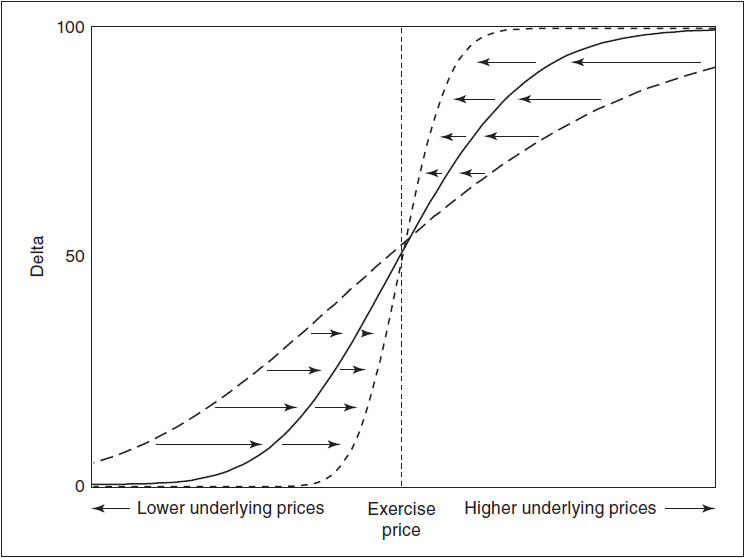

<!-- source:block f3d0276ed8b04dd6 -->

> [!quote]- English 17
> Because delta values are affected by the passage of time, a position that is delta neutral today may not be delta neutral tomorrow, even if all other market conditions remain unchanged. Of course, with many months remaining to expiration, the passage of even several days may have little effect on the delta. If, however, expiration is quickly approaching, the passage of just one day, because it represents a large portion of the option’s remaining life, can have a dramatic effect on the delta.

由于Delta值受时间推移的影响，因此即使所有其他市场条件保持不变，今天Delta中性的头寸明天可能不会成为Delta中性。当然，由于距离到期还有好几个月，即使过去几天也可能对Delta影响不大。然而，如果到期很快临近，那么仅仅一天的过去，因为它代表了期权剩余寿命的很大一部分，就会对Delta产生巨大影响。

<!-- source:block 03d7e9545ca4c82c -->

> [!quote]- English 18
> As option traders have become more aware of the importance of risk management, they have begun to pay closer attention to changes in the sensitivities themselves as market conditions change. In some cases, they have also begun to attach names (although not necessarily Greek letters) to these higher-order sensitivities. The sensitivity of the delta to a change in volatility is sometimes referred to as the option’s *vanna*. The sensitivity of the delta to the passage of time is sometimes referred to as the option’s *delta decay* or its *charm*.1

随着期权交易员越来越意识到风险管理的重要性，他们开始更加密切地关注随着市场条件变化而敏感性本身的变化。在某些情况下，他们还开始在这些更高级的敏感性上加上名字（尽管不一定是希腊字母）。Delta对波动率变化的敏感性有时被称为期权的vanna。Delta对时间流逝的敏感性有时被称为期权的Delta衰变或其Charm。[^ovp09-1]

<!-- source:block 67a6586eebb27a82 -->

> [!quote]- English 19
> Which delta values are the most sensitive to changes in volatility (vanna) and time (charm)? We know that delta values will tend either toward 50 as we increase volatility or time, or away from 50 (toward 0 or 100) as we reduce volatility or time. Logically, delta values that are already close to 0, 50, or 100 are the least likely to change. At the same time, delta values that are approximately midway between these numbers are most likely to change. This is borne out by Figures 9-6 and 9-7, the vanna and charm for options with different deltas. Note that the shapes of the graphs are identical for calls and puts, with the vanna and charm approximately 0 around a delta of 50 or –50.2 We can also see that vanna and charm are greatest for call delta values close to 20 and 80 and put delta values close to –20 and –80. Options with these deltas will move the most quickly toward 50 if we raise volatility or away from 50 if we lower volatility or reduce time to expiration.

哪些Delta值对波动率（vanna）和时间（Charm）的变化最敏感？我们知道，随着波动率或时间的增加，Delta值将趋向于50，或者随着波动率或时间的减少，它将远离50（趋向于0或100）。 从逻辑上讲，已经接近0, 50,或100的Delta值最不可能更改。与此同时，大约位于这些数字中间的Delta值最有可能发生变化。 图9-6和图9-7,证实了这一点，具有不同Delta的期权的多样性和Charm。请注意，对于看涨期权和看跌期权，图形的形状是相同的，其中vanna和charm大约在50或-50的Delta周围0。 我们还可以看到，vanna和charm在看涨期权 Delta值接近20和80时最大，并将Delta值放置在-20和-80附近。如果我们提高波动率，具有这些Delta的期权将最快地转向50，如果我们降低波动率或缩短到期时间，则将最快地转向50。 [^ovp09-2]

<!-- source:block cc18198e289a0a7e -->

*图9-6期权的Vanna。 / Figure 9-6 Vanna of an option.*

<!-- source:block a15335180a636f73 -->

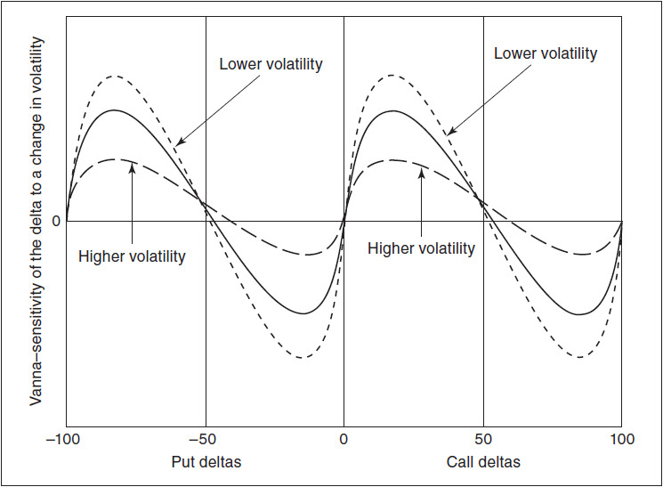

<!-- source:block 90d5ecb093677dcc -->

*图9-7期权的Charm / Figure 9-7 Charm of an option.*

<!-- source:block e84d62a0ca1ba101 -->

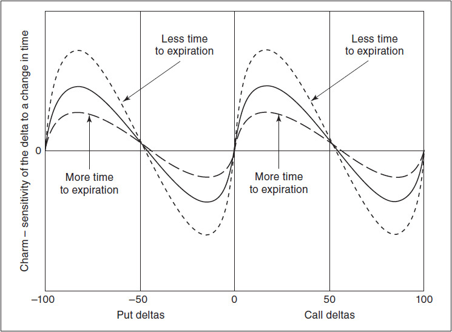

<!-- source:block 1152ab0456025219 -->

> [!quote]- English 22
> The three vanna graphs also show that the vanna moves in the opposite direction of volatility, falling as we raise volatility and rising as we reduce volatility. The graphs of the charm exhibit similar characteristics with respect to the passage of time, falling with more time to expiration and rising with less time to expiration.

三个vanna图表还表明，vanna的走势与波动率相反，随着波动率的提高，vanna的走势会下降，随着波动率的降低，vanna的走势会上升。Charm的图表在时间的流逝方面表现出相似的特征，随着到期时间的增加，Charm下降，随着到期时间的减少，Charm上升。

<!-- source:block 6aac668ff0cf2592 -->

> [!quote]- English 23
> In Figures 9-6 and 9-7, we have ignored the effect of changing time on the vanna and the effect of changing volatility on the charm. From previous discussions, we might expect time and volatility to have the same effect on both these values. However, whereas vanna values are affected by changes in volatility, they are not significantly affected by changes in time to expiration. Whereas charm values are affected by time to expiration, they are not significantly affected by changes in volatility.

在图9-6和9-7中，我们忽略了时间变化对vanna的影响以及波动率变化对Charm的影响。从之前的讨论中，我们可能预计时间和波动率对这两个值产生相同的影响。然而，虽然vanna价值受到波动率变化的影响，但到期时间变化并不显着影响。虽然Charm值受到期时间的影响，但不受波动率变化的显着影响。

<!-- source:block e11ea47ba74a09e6 -->

## Theta / Theta

<!-- source:block cf23fe50723bb25d -->

> [!quote]- English 24
> The theta of an option, the rate at which it decays, will vary depending not only on market conditions but also on whether an option is in the money, at the money, or out of the money. In Figure 9-8, we can see that the theta of an option is greatest when it is at the money. As the option moves either into or out of the money, its theta declines. Because the theta of an option is a function of its time value, and because very deeply in the money options and very far out of the money options have very little time value, it is logical that such options have a very low theta.

期权的Theta（其衰变率）不仅取决于市场状况，还取决于期权是ITM、ATM还是OTM。在图9-8,中我们可以看到，当一个期权是ATM时，它的Theta最大。 随着期权进入或OTM，其Theta下降。 由于期权的Theta是其时间价值的函数，并且由于非常深的ITM期权和非常远的OTM期权的时间价值非常小，因此此类期权的Theta非常低是合乎逻辑的。

<!-- source:block 200a15565a0adbfa -->

*图9-8期权随着标的价格变化的Theta。 / Figure 9-8 Theta of an option as the underlying price changes.*

<!-- source:block 773a70edf5b667f3 -->

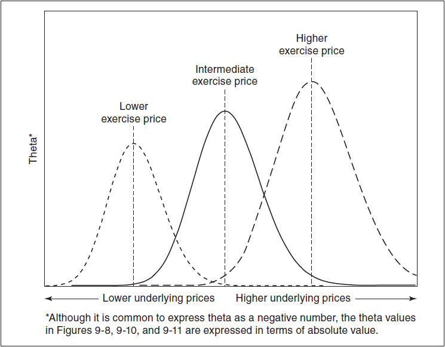

<!-- source:block e5363cc2a83b09f1 -->

> [!quote]- English 26
> Note also that when all other conditions are the same, an at-the-money option at a higher underlying price has a greater theta value than an at-the-money option with lower underlying price. To understand why, consider two calls, one with an exercise price of 10 and one with an exercise price of 1,000, where both options are at the money and both calls have the same amount of time to expiration and the same implied volatility. Which option will be worth more? Clearly, the 1,000 call will be worth more because it represents the right to buy a more valuable asset.3 Because both options are at the money and therefore consist solely of time value, the theta of the 1,000 call must be greater than the theta of the 10 call.

另请注意，当所有其他条件相同时，标的价格较高的ATM期权比标的价格较低的ATM期权具有更大的Theta值。 为了理解原因，请考虑两个看涨期权，一个的行权价为10，另一个的行权价为1,000,，其中两个期权都是ATM，并且两个看涨期权的到期时间和相同的隐含波动率。哪个选择更有价值？ 显然，1,000 看涨期权的价值将更高，因为它代表购买更有价值资产的权利。由于这两个期权都是ATM，因此仅由时间价值组成，因此1,000 看涨期权的Theta必须大于10 看涨期权的Theta。 [^ovp09-3]

<!-- source:block 8afea326ffc8d0df -->

> [!quote]- English 27
> Figure 9-9 shows the theoretical value of an in-the-money, at-the-money, and out-of-the-money option as time passes. Early in the option’s life, the rate of decay (the slope of the theoretical-value graph) is similar for each option. But late in the option’s life, as expiration approaches, the rate of decay slows for in-the-money and out-of-the-money options, whereas it accelerates for an at-the-money option, approaching infinity at the moment of expiration. These characteristics, which apply to both calls and puts, are shown in Figure 9-10.4

图9-9显示了随着时间的推移，ITM、ATM和OTM期权的理论价值。在期权生命周期的早期，每个期权的衰变率（理论价值图的斜率）都是相似的。 但在期权生命周期的后期，随着到期的临近，ITM和OTM期权的衰变率会减慢，而ATM期权的衰变率会加速，在到期时接近无穷大。 这些特征适用于看涨期权和看跌，如图9-10所示。 [^ovp09-4]

<!-- source:block 6ba4623c88f42034 -->

*图9-9期权随时间推移的理论价值 / Figure 9-9 Theoretical value of an option as time passes.*

<!-- source:block e537a8abee313a70 -->

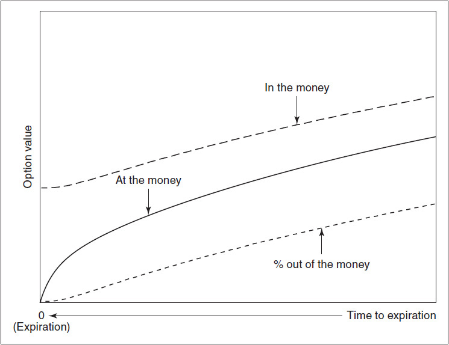

<!-- source:block 6208baf1d83f8c85 -->

*图9-10随着时间的推移期权的Theta。 / Figure 9-10 Theta of an option as time passes.*

<!-- source:block 1f7a9e37964d2e98 -->

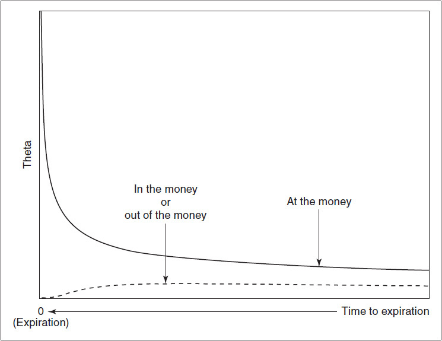

<!-- source:block c71b44faf097c724 -->

> [!quote]- English 30
> The effect on the theta of changing volatility is shown in Figure 9-11. If we ignore interest, with a 0 volatility, the theta of any option will be 0. As we increase volatility, we increase the time premium, at the same time increasing the theta.

波动率变化对Theta的影响如图9-11所示。如果我们忽略利息，波动率为0，则任何期权的Theta都将为0。当我们增加波动率时，我们会增加时间溢价，同时增加Theta。

<!-- source:block 37e6957fc6f67447 -->

*图9-11随着波动率变化的期权Theta。 / Figure 9-11 Theta of an option as volatility changes.*

<!-- source:block 4ed9c675d5ee7d7c -->

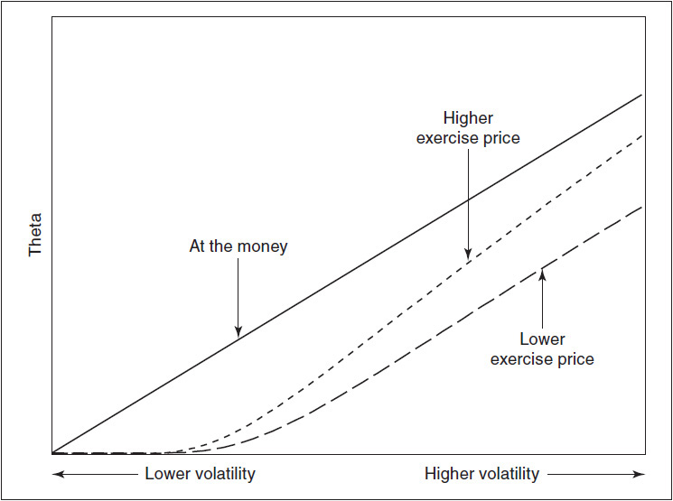

<!-- source:block 4d3a57c5b7e2f57c -->

> [!quote]- English 32
> Note that the graph of the at-the-money option is essentially a straight line, with the theta being directly proportional to the volatility. For an at-the-money option, the theta at a volatility of 20 percent is exactly double the theta at a volatility of 10 percent. The same is not necessarily true for higher exercise prices (out-of-the-money calls and in-the-money puts) or lower exercise prices (in-the-money calls and out-of-the-money puts). The theta tends to decline as volatility declines but may become 0 well before the volatility is 0.

请注意，平值期权的图表本质上是一条直线，其中Theta与波动率成正比。对于平值的期权，波动率为20%时的Theta恰好是波动率为10%时的Theta的两倍。对于较高的行权价（价外看涨和价内看跌）或较低的行权价（价内看涨和价外看跌），情况不一定如此。随着波动率的下降，Theta往往会下降，但在波动率为0之前很久可能就变成0。

<!-- source:block e5fc95670c862ac8 -->

> [!quote]- English 33
> Figure 9-11 was constructed with the higher and lower exercise prices equally far away from the current underlying price. Note that the higher exercise price has a greater theta than the lower exercise price, with the difference increasing with increasing volatility. We touched on the explanation for this in Chapter 6. If a call and a put are both equally out of the money, under the assumptions of a lognormal distribution, the out-of-the-money call (the higher exercise price) will carry greater time premium than the out-of-the-money put (the lower exercise price). If there is no movement in the price of the underlying contract, the option with more time premium (the higher exercise price) must necessarily decay more quickly than the option with less time premium (the lower exercise price).

图9-11是在较高和较低的行权价与当前标的价格的距离相同的情况下构建的。请注意，较高的行权价比较低的行权价具有更大的Theta，差异随着波动率的增加而增加。我们在第6章中谈到了对此的解释。如果看涨期权和看跌期权都是同等的，那么在对数正态分布的假设下，价外看涨期权（较高的行权价）将比价外看跌期权（较低的行权价）带来更大的时间溢价。如果标的合约的价格没有变化，那么具有更多时间溢价（较高的行权价）的期权必然比具有较少时间溢价（较低的行权价）的期权衰退得更快。

<!-- source:block 11f89dabdff7abd3 -->

> [!quote]- English 34
> If we know the value of an option today, is there any way to estimate the option’s theta? There is no convenient method for estimating the theta of in-the-money and out-of-the-money options, but for an at-the-money option, we know that theta is directly proportional to volatility (Figure 9-11). We also know from Chapter 6 that volatility is proportional to the square root of time

如果我们今天知道期权的价值，有没有办法估计期权的Theta？没有方便的方法来估计ITM和OTM期权的Theta，但对于ATM期权，我们知道Theta与波动率成正比（图9-11）。 我们还从第6章得知，波动率与时间的平方根成正比

<!-- source:block 005b44388ba85f34 -->

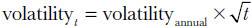

<!-- 原 EPUB 中此公式为图片，已原样保留 -->

<!-- source:block dde3da7721fd1b51 -->

> [!quote]- English 35
> The theta of an at-the-money option must therefore be proportional to the square root of time. If *TV**t* is an option’s theoretical value at time *t* (in days to expiration), then the theoretical value one day later *TV**t*–1 is

因此，平值期权的Theta必须与时间的平方根成正比。如果TVT是期权在时间t（以到期天数为单位）的理论值，那么一天后的理论值TVT-1是

<!-- source:block 4aef17927879ceac -->

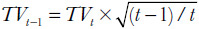

<!-- 原 EPUB 中此公式为图片，已原样保留 -->

<!-- source:block 11c82eb3ef956153 -->

> [!quote]- English 36
> The theta is therefore

因此，Theta是

<!-- source:block 05d49c9f8980dfa2 -->

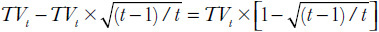

<!-- 原 EPUB 中此公式为图片，已原样保留 -->

<!-- source:block af865dce7da98338 -->

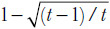

<!-- source:block 5c1e65ad6714e6fc -->

> [!quote]- English 37
> For example, consider an at-the-money option with a theoretical value of 2.50 and 30 days remaining to expiration. The option’s theta will be approximately

例如，考虑理论价值为2.50且距离到期还剩30天的平值期权。该期权的Theta大约为

<!-- source:block 261db0e8eece35c1 -->

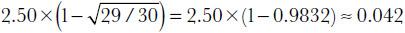

<!-- 原 EPUB 中此公式为图片，已原样保留 -->

<!-- source:block e6f185c5210af145 -->

> [!quote]- English 38
> One day later, with 29 days remaining to expiration, the theta will be

一天后，还有29天到期，Theta将是

<!-- source:block 5565a53200c06c1d -->

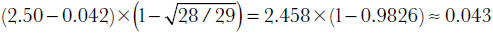

<!-- 原 EPUB 中此公式为图片，已原样保留 -->

<!-- source:block 5c1746699211f960 -->

## Vega / Vega

<!-- source:block 339ff16ae3fde40e -->

> [!quote]- English 39
> Figure 9-12 shows the vega of an option as we change the underlying price. Note that this figure is almost identical to Figure 9-8. As with the theta, the vega is greatest when an option is at the money, and an at-the-money option with a higher exercise price has a greater vega than an at-the-money option with a lower exercise price. Moreover, the vega of an at-the-money option is proportional to its exercise price. Assuming that all other conditions are the same, an at-the-money option with an exercise price of 100 will have a vega that is twice that of an option with an exercise price of 50. Note that the term *vanna*, which previously referred to the sensitivity of delta to a change in volatility, can also refer to the sensitivity of the vega to a change in the underlying price. Both interpretations are mathematically identical.

图9-12显示了当我们改变标的价格时期权的Vega。请注意，该图与图9-8几乎相同。与Theta一样，当期权处于平值状态时，Vega最大，行权价较高的平值期权比行权价较低的平值期权具有更大的Vega。此外，平值期权的Vega与其行权价成正比。假设所有其他条件相同，则行权价为100的平值期权的Vega将是行权价为50的期权的两倍。请注意，术语vanna之前指的是Delta对波动率变化的敏感性，也可以指Vega对标的价格变化的敏感性。这两种解释在数学上是相同的。

<!-- source:block 3748793a68310da0 -->

*图9-12期权随标的价格变化的Vega。 / Figure 9-12 Vega of an option as the underlying price changes.*

<!-- source:block 552c786058b13acd -->

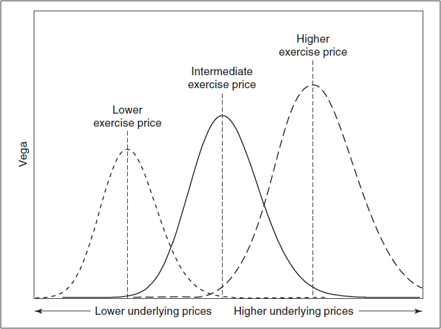

<!-- source:block e4c2a16a344e05a8 -->

> [!quote]- English 41
> Figure 9-13 shows the theoretical value of an in-the-money, at-the-money, and out-of-the-money option as we change volatility. Of particular note is the fact that the value of an at-the-money option is essentially a straight line. Because the vega is the slope of the graph, we can conclude that the vega of an at-the-money option is relatively constant with respect to changes in volatility. Whether volatility is 20 percent, 30 percent, or some higher value, the vega of an at-the-money option will be the same.

图9-13显示了当我们改变波动率时，价内期权、平值期权和价外期权的理论价值。特别值得注意的是，平值期权的价值本质上是一条直线。由于Vega是图表的斜率，因此我们可以得出结论，平值期权的Vega相对于波动率变化相对恒定。无论波动率是20%、30%还是更高的值，平值期权的Vega都是相同的。

<!-- source:block f58eaacc225be234 -->

*图9-13随着波动率变化的期权理论价值。 / Figure 9-13 Theoretical value of an option as volatility changes.*

<!-- source:block 76bdae91918eb21f -->

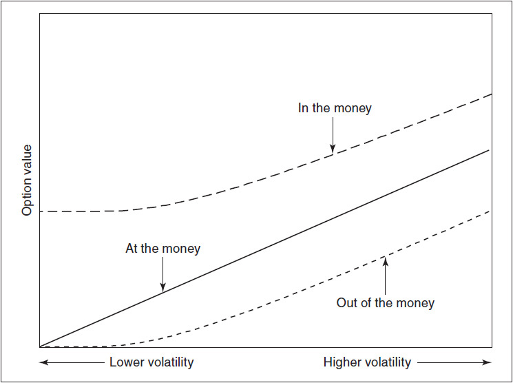

<!-- source:block e75a974079a1744a -->

> [!quote]- English 43
> The effect on the vega of changing volatility is shown in Figure 9-14. While the vega of the at-the-money option is relatively constant, the vega values of in-the-money and out-of-the-money options tend to rise with higher volatility.5 This is logical when we recall that as we raise volatility, the deltas of in-the-money and out-of-the-money options tend toward 50, causing the options to act more and more as if they are at the money. Because at-the-money options have the greatest vega (see Figure 9-12), we would expect the vega values to rise. The sensitivity of vega to a change in volatility is sometimes referred to as either the *volga* or the *vomma* (both terms are a contraction of volatility and gamma—either *vol*atility *ga*mma or *vo*latility ga*mma*).

波动率变化对Vega的影响如图9-14所示。虽然ATM期权的Vega相对恒定，但ITM和OTM期权的Vega值往往会随着波动率更高而上升。 当我们回想起，随着波动率的提高，ITM和OTM期权的Delta往往趋于50,，导致期权的表现越来越像ATM时，这是合乎逻辑的。 由于ATM期权的Vega值最大（请参阅图9-12），因此我们预计Vega值将会上升。 Vega对波动率变化的敏感性有时被称为Volga或Vomma（这两个术语都是波动率和Gamma的缩写-波动率Gamma或波动率Gamma）。 [^ovp09-5]

<!-- source:block 42e29745a6bb56b4 -->

*图9-14波动率变化时期权的Vega。 / Figure 9-14 Vega of an option as volatility changes.*

<!-- source:block 5d4333549ba74027 -->

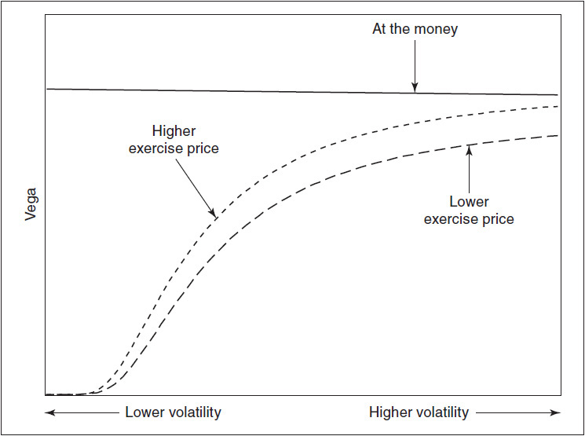

<!-- source:block ce28c9e43fe6b9dc -->

> [!quote]- English 45
> Figure 9-15 shows volga values for calls and puts with varying deltas. We have already noted that an at-the-money option with a delta of approximately 50 has a relatively constant vega and, consequently, a volga close to 0. However, as an option moves either into the money or out of the money, the volga begins to increase, reaching its maximum for calls with deltas of approximately 10 and 90 and puts with deltas of approximately –10 and –90. Additionally, as we increase time, volga values for in-the-money and out-of-the-money options become more sensitive to the passage of time, with long-term options having greater volga values than short-term options.

图9-15显示了具有不同Delta的看涨期权和看跌的volga值。我们已经注意到，Delta大约为50的ATM期权具有相对恒定的Vega，因此Volga接近0。 然而，随着期权进入货币或OTM，volga开始增加，对于Delta约为10和90的看涨期权以及Delta约为-10和-90的看跌期权，volga开始增加。 此外，随着时间的增加，ITM和OTM期权的伏尔加值对时间的推移变得更加敏感，长期期权的伏尔加值比短期期权更大。

<!-- source:block f824e934f157f9f2 -->

*图9-15伏尔加河（vomma）的一种选择。 / Figure 9-15 Volga (vomma) of an option.*

<!-- source:block c0be9febe42924ac -->

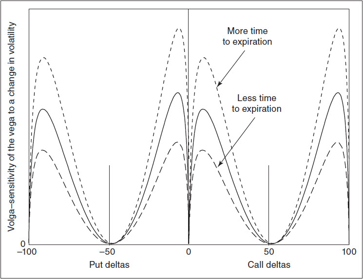

<!-- source:block 872ce8f7434a7aef -->

> [!quote]- English 47
> In Figure 9-16, we can see how vega values change as time changes, rising as we increase time to expiration and falling as we reduce time. This characteristic, that long-term options are always more sensitive to changes in volatility than short-term options, was introduced in Chapter 6 (see Figures 6-11 and 6-12).

在图9-16中，我们可以看到Vega值如何随着时间的变化而变化，随着到期时间的增加而上升，随着时间的减少而下降。第6章介绍了这一特征，即长期期权总是比短期期权对波动率变化更敏感（见图6-11和6-12）。

<!-- source:block c7151069f399b572 -->

*图9-16随着时间的推移，期权的Vega。 / Figure 9-16 Vega of an option as time passes.*

<!-- source:block 07ca407626f93384 -->

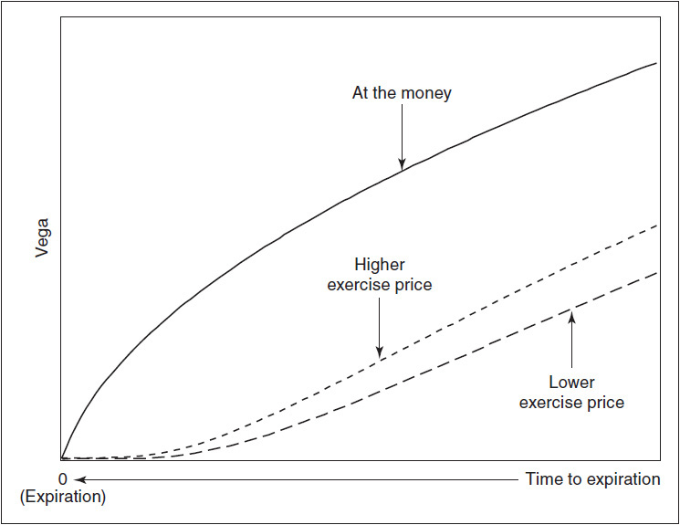

<!-- source:block 7ba980a5287691ba -->

> [!quote]- English 49
> The sensitivity of the vega to changes in time to expiration, sometimes referred to as either *vega decay* or *DvegaDtime*, is shown in Figure 9-17. The vega of options with delta values between 10 and 90 tends to be the most sensitive to the passage of time. This sensitivity increases as we reduce time to expiration; as time passes, the vega of short-term options will change more quickly than the vega of long-term options.

图9-17显示了Vega对呼气时间变化的敏感性，有时称为Vega衰变或DvegaDtime。Delta值在10到90之间的期权中的Vega往往对时间的推移最敏感。随着我们缩短到期时间，这种敏感性就会增加;随着时间的推移，短期期权的Vega变化将比长期期权的Vega变化得更快。

<!-- source:block 32a9eecc57e6f0f8 -->

*图9-17期权的Vega衰变。 / Figure 9-17 Vega decay of an option.*

<!-- source:block f95bb2b32cba8c2d -->

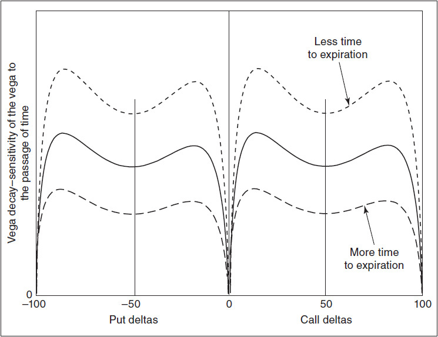

<!-- source:block 6c0babf27ef46226 -->

## Gamma / Gamma

<!-- source:block f4090ecb52b235f5 -->

> [!quote]- English 51
> The gamma measures the sensitivity of the delta to a change in the underlying price. But the gamma itself is sensitive to changes in market conditions.6

Gamma衡量Delta对标的价格变化的敏感性。但Gamma本身对市场条件的变化很敏感。 [^ovp09-6]

<!-- source:block 72b8f6e6e3e2597b -->

> [!quote]- English 52
> In Figure 9-18, we can see that the gamma is greatest when an option is at the money. This is similar to theta and vega, which are also greatest when an option is at the money, and leads to an important principle of option trading: *gamma, theta, and vega are greatest when an option is at the money*. Because of this, at-the-money options tend to be the most actively traded in most option markets. Such options have the characteristics that traders are looking for when they go into an option market.

在图9-18中，我们可以看到，当期权处于平值状态状态时，Gamma系数最大。这类似于Theta和Vega，当期权在金钱上时，它们也是最好的，并导致期权交易的一个重要原则：当期权在金钱上时，Gamma、Theta和Vega是最好的。因此，平值的期权往往是大多数期权市场中交易最活跃的期权。此类期权具有交易员进入期权市场时所寻求的特征。

<!-- source:block 52259eff7399e300 -->

*图9-18期权随标的价格变化的Gamma。 / Figure 9-18 Gamma of an option as the underlying price changes.*

<!-- source:block a8dc6e97118f8c78 -->

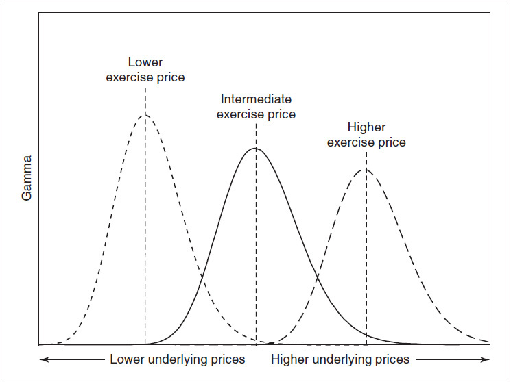

<!-- source:block b8099683c6180e1e -->

> [!quote]- English 54
> Unlike the theta and vega of at-the-money options, which increase at higher exercise prices, the gamma of an at-the-money option declines at higher exercise prices. To understand why, recall that the gamma is the change in the delta per one-point change in the underlying price. But theoretical pricing models measure change in percentage terms. By this measure, a one-point price change with the underlying at 50 (a 2 percent change) is greater than a one-point price change with the underlying at 100 (a 1 percent change). Although the theta and vega of at-the-money options are proportional to their exercise prices, the gamma is inversely proportional. The gamma of an option with an exercise price of 50 will be twice as large as the gamma of an option with an exercise price of 100.

与平值期权的Theta和Vega不同，平值期权的Gamma随着行权价较高而增加，平值期权的Gamma随着行权价较高而下降。要理解原因，请记住Gamma是标的价格每变化一个点时的Delta变化。但理论定价模型以百分比衡量变化。通过这一衡量标准，标的指数为50的一点价格变化（2%的变化）大于标的指数为100的一点价格变化（1%的变化）。尽管平值期权的Theta和Vega与其行权价成正比，但Gamma却是成正比的。行权价为50的期权的Gamma值将是行权价为100的期权的Gamma值的两倍。

<!-- source:block 123d6fb4f4cd9d4f -->

> [!quote]- English 55
> Because at-the-money options have the greatest gamma, as the underlying price moves toward the exercise price, the gamma of an option will rise, and as the underlying price moves away from the exercise price, the gamma will fall. The sensitivity of the gamma to a change in the underlying price, sometimes referred to as the *speed*, is shown in Figure 9-19. The speed is greatest for out-of-the-money options with deltas close to 15 for calls and –15 for puts and for in-the-money options with deltas close to 85 for calls and –85 for puts. As we increase time to expiration or volatility, the speed of an option declines; as we reduce time to expiration or volatility, the speed rises. The gamma is least sensitive to changes in the underlying price for at-the-money options (a delta close to 50 for calls or –50 for puts) or for very deeply in-the-money or very far out-of-the-money options (deltas close to 0 and close to 100 for calls or –100 for puts).

因为ATM期权具有最大的Gamma，当标的价格向行权价移动时，期权的Gamma将上升，当标的价格远离行权价时，Gamma将下降。 Gamma对标的价格变化的敏感性（有时称为速度）如图9-19所示。 对于看涨期权的Delta接近15、看跌期权的Delta接近-15的OTM期权，以及看涨期权的Delta接近85、看跌期权的Delta接近-85的ITM期权，速度最快。 当我们增加到期或波动率的时间时，期权的速度下降;当我们减少到期或波动率的时间时，速度上升。 Gamma对ATM期权（看涨期权的Delta接近50或看跌期权-50的Delta）或非常深的ITM或非常远的OTM期权（看涨期权的Delta接近0和接近100或看跌期权-100的Delta）的标的价格变化最不敏感。

<!-- source:block 9545bf487f540bf7 -->

*Figure 9-19 speed of an option. Put deltas / Figure 9-19 speed of an option. Put deltas*

<!-- source:block 3209646e552ac260 -->

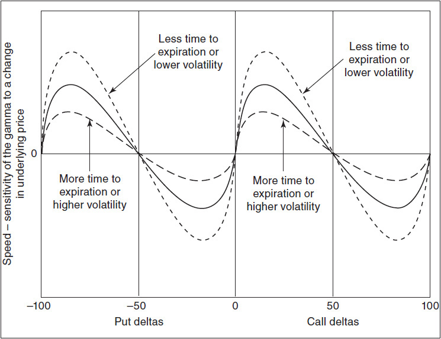

<!-- source:block a27439445e5ebf67 -->

> [!quote]- English 57
> The gamma will also be sensitive to changes in time to expiration and volatility. This is shown in Figure 9-20. We know that gamma is greatest when an option is at the money and declines as the option moves either into the money or out of the money. Of particular importance is the fact that the gamma of an at-the-money option rises as time passes or as we reduce volatility and falls as we increase volatility. To see why, consider a 100 call with the market at 97.50. Because the option is currently out of the money, its delta is less than 50. We also know that as time passes or we reduce volatility, delta values move away from 50. If we are close to expiration or in a very low-volatility market, the delta of the option will be well below 50, perhaps 25. If the underlying market should then rise 5 points to 102.50, the delta of the option will be greater than 50, perhaps 75. With the underlying market rising from 97.50 to 102.50 and the delta rising from 25 to 75, the approximate gamma should be

Gamma也将对到期时间和波动率的变化敏感。如图9-20所示。我们知道，当期权是ATM时，Gamma最大，随着期权进入货币或OTM而下降。 特别重要的是，ATM期权的Gamma会随着时间的推移或随着我们降低波动率而上升，随着我们增加波动率而下降。要了解原因，请考虑100 看涨期权，市场为97.50。由于该期权当前为OTM，因此其Delta小于50。 我们还知道，随着时间的推移或我们减少波动率，Delta值会远离50。如果我们即将到期或处于波动率极低的市场，期权的Delta将远低于50,也许是25。 如果标的市场随后上涨5点至102.50，则期权的Delta将大于50,，可能大于75。随着标的市场从97.50上升到102.50，Delta从25上升到75,，大致Gamma应为

<!-- source:block 8f1e6f64dc30010b -->

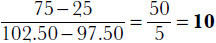

<!-- 原 EPUB 中此公式为图片，已原样保留 -->

<!-- source:block 820a8fd4230c5a92 -->

*图9-20期权随时间推移或波动率变化的Gamma。 / Figure 9-20 Gamma of an option as time passes or volatility changes.*

<!-- source:block 0fa199f968fcce5b -->

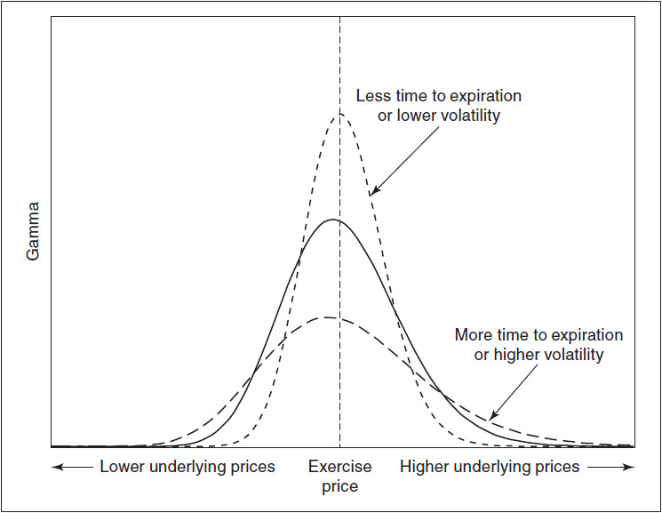

<!-- source:block 71177b6a8f267eab -->

> [!quote]- English 59
> If, however, expiration is far in the future or we are in a high-volatility market, the delta of the 100 call will stay close to 50. With the underlying market at 97.50, the delta of the option may be 45. If the market then rises to 102.50, the delta may be only 55. The approximate gamma is then

然而，如果到期在很远的将来或者我们处于高波动率的市场，那么100看涨期权的Delta将保持在接近50的水平。标的市场为97.50，期权的Delta可能为45。如果市场随后上涨至102.50，那么Delta可能只有55。那么大约的Gamma是

<!-- source:block 24aef1e17e9fb53f -->

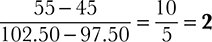

<!-- 原 EPUB 中此公式为图片，已原样保留 -->

<!-- source:block 6a39c010c89022ec -->

> [!quote]- English 60
> The effect is just the opposite for in-the-money and out-of-the-money options. The gamma will fall if we reduce volatility and rise if we increase volatility.7 Because gamma and theta are closely related, if we were to graph the gamma of an option as time passes, the result would be very similar to Figure 9-10, with the gamma instead of the theta along the *y*-axis.

对于ITM和OTM期权，效果恰恰相反。如果我们减少波动率，Gamma就会下降，如果我们增加波动率，Gamma就会上升。 由于Gamma和Theta密切相关，如果我们要绘制期权的Gamma随时间推移的变化图，结果将非常类似于图9-10,，其中Gamma而不是沿y轴的Theta。 [^ovp09-7]

<!-- source:block c0a981640f2de76e -->

> [!quote]- English 61
> The sensitivity of the gamma to the passage of time, sometimes referred to as its *color*, is shown in Figure 9-21. The color is greatest for at-the-money calls and puts, with gamma values becoming smaller as we increase time to expiration and larger as we reduce time (hence a negative color value). Calls with deltas close to 5 or 95 and puts with deltas close to –5 or –95 also have large color values. Here, however, an increase in time causes gamma values to rise, whereas the passage of time causes gamma values to fall (a positive color). Moreover, reducing time or volatility will increase color values, making an option’s gamma more sensitive to changes in the passage of time. Increasing time or volatility will reduce color values, making an option’s gamma less sensitive to the passage of time. Calls with deltas close to 15 or 85 and puts with deltas close to –15 and –85 tend to have color values close to 0. The gamma values of such options will be relatively insensitive to the passage of time.

Gamma对时间流逝的敏感度（有时称为其Color）如图9-21所示。ATM看涨期权和放置的Color最大，Gamma值随着到期时间的增加而变小，随着时间的减少而变大（因此Color值为负）。 Delta接近5或95的看涨期权以及Delta接近-5或-95的看跌期权也具有较大的Color值。然而，这里，时间的增加导致Gamma值上升，而时间的推移导致Gamma值下降（正Color）。 此外，减少时间或波动率将增加Color值，使期权的Gamma对时间的变化更加敏感。增加时间或波动率将降低Color值，使期权的Gamma对时间的推移不那么敏感。 Delta接近15或85的看涨期权以及Delta接近-15和-85的看跌期权的Color值往往接近0。此类期权的Gamma值对时间的推移相对不敏感。

<!-- source:block 1cd68097d0a96b2b -->

*图9-21期权的Color。 / Figure 9-21 Color of an option.*

<!-- source:block 987293549ef623ea -->

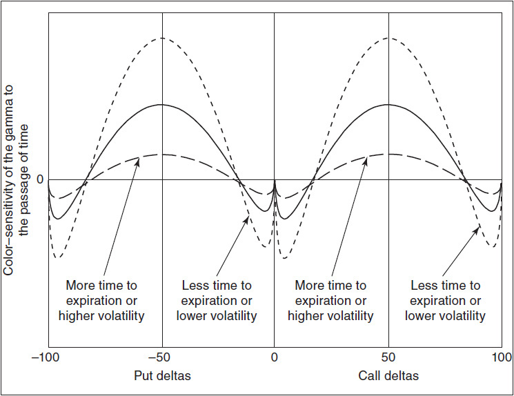

<!-- source:block 68b661ea742b3a6f -->

> [!quote]- English 63
> The sensitivity of an option’s gamma to a change in volatility, sometimes referred to as its *zomma*, is shown in Figure 9-22. Zomma characteristics are similar to color characteristics. The zomma is large for at-the-money calls and puts, with gamma values becoming smaller as volatility rises and larger as volatility falls (a negative zomma). Calls with deltas close to 5 or 95 and puts with deltas close to –5 or –95 also have large zomma values. Here, however, an increase in volatility causes gamma values to rise and a decline in volatility causes gamma values to fall (a positive zomma). Moreover, reducing time or volatility will increase the zomma, making an option’s gamma more sensitive to changes in volatility. Increasing time or volatility will reduce the zomma, making an option’s gamma less sensitive to changes in volatility. Calls with deltas close to 15 or 85 and puts with deltas close to –15 and –85 tend to have zomma values close to 0. The gamma values of such options will be relatively insensitive to changes in volatility.

期权的Gamma对波动率变化（有时称为波动率）的敏感性如图9-22所示。Zomma特征与Color特征相似。对于平值看涨和看跌期权来说，zomma很大，随着波动率上升，Gamma值变得更小，随着波动率下降，Gamma值变得更大（负zomma）。Delta接近5或95的看涨期权以及Delta接近-5或-95的看跌期权也具有较大的zomma值。然而，在这里，波动率的增加导致Gamma值上升，波动率的下降导致Gamma值下降（正zomma）。此外，减少时间或波动率将增加zomma，使期权的Gamma对波动率的变化更加敏感。增加时间或波动率将降低zomma，使期权的Gamma对波动率变化不那么敏感。Delta接近15或85的看涨期权以及Delta接近-15和-85的看跌期权的zomma值往往接近0。此类期权的Gamma值对波动率变化相对不敏感。

<!-- source:block 0f96eed5392b8173 -->

*图9-22 Zomma期权。 / Figure 9-22 Zomma of an option.*

<!-- source:block acfc73cc6fb36ced -->

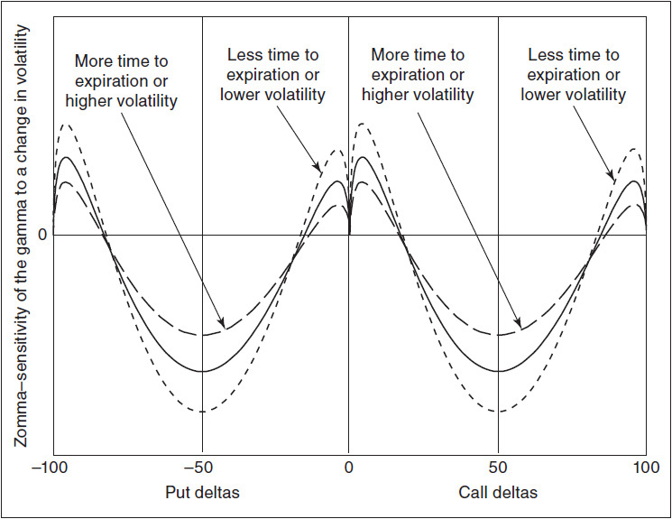

<!-- source:block aa38001c166c7c74 -->

> [!quote]- English 65
> Given the fact that the gamma is greatest for at-the-money options and that the gamma of an at-the-money option increases as time passes or volatility declines, experienced traders know that at-the-money options close to expiration in a low-volatility environment are among the riskiest options that one can trade. Although these *gamma options* initially have delta values close to 50, their deltas can change dramatically with only small moves in the price of the underlying contract, moving very quickly toward 0 or 100.

鉴于ATM期权的Gamma最大，而且ATM期权的Gamma系数随着时间的推移或波动率下降而增加，经验丰富的交易员知道，在低波动率环境中接近到期的ATM期权是风险最高的期权之一 可以交易。尽管这些Gamma期权最初的Delta值接近50,，但它们的Delta可能会发生巨大变化，标的合约价格仅发生小幅波动，很快就会向0或100移动。

<!-- source:block d799949d9a892735 -->

## Lambda（Λ，杠杆率） / Lambda (Λ)

<!-- source:block 6dd0f55163eeca37 -->

> [!quote]- English 66
> The delta tells us the point change in an option’s value for a given point change in the price of the underlying contract. But we might also ask how an option’s value changes in percentage terms for a given percentage change in the underlying price.

Delta告诉我们期权价值因标的合约价格的给定点变化而发生的点变化。但我们也可能会问，对于标的价格的给定百分比变化，期权价值的百分比如何变化。

<!-- source:block 6cbd6e22cbac44be -->

> [!quote]- English 67
> Consider a call option with a theoretical value of 4.00 and a delta of 20, with the underlying contract trading at a price of 100. If the underlying contract rises one point to 101, the new delta of the option (ignoring the gamma) should be approximately 4.20. But how much are these changes in percentage terms? The underlying changed by 1 percent (1/100), whereas the option changed by 5 percent (0.20/4.00). The option has a *lambda*, or *elasticity*, of 5. In percentage terms, it will change at five times the rate of the underlying contract.

考虑理论价值为4.00、Delta为20的看涨期权，标的合约的交易价格为100。如果标的合约上涨1个点至101，则期权的新Delta（忽略Gamma）应该约为4.20。但以百分比计算，这些变化有多大？基础变化了1%（1/100），而期权变化了5%（0.20/4.00）。该期权的拉姆达（弹性）为5。按百分比计算，其变化率将是标的合约的五倍。

<!-- source:block 06b2a6fdd4e8f934 -->

> [!quote]- English 68
> We can see that the lambda is simply the option’s delta (using the decimal format) multiplied by the ratio of the underlying price *S* to the option’s theoretical value

我们可以看到，Lambda只是期权的Delta（使用小数格式）乘以标的价格S与期权理论价值的比率

<!-- source:block df067806a26385d1 -->

> [!quote]- English 69
> Λ = Δ × (*S*/*TV*)

$$
Λ = \Delta \times (\frac{S}{TV})
$$

<!-- source:block cac555ee31d6839d -->

> [!quote]- English 70
> In our example, lambda is

在我们的例子中，Lambda是

<!-- source:block 8b8199426a9ee13b -->

> [!quote]- English 71
> 0.20 × 100/4.00 = **5**

$$
0.20 \times 100/4.00 = 5
$$

<!-- source:block 5f4ee1d09e763897 -->

> [!quote]- English 72
> Traders sometimes refer to the lambda as the option’s *leverage value*. Although lambda is not a widely used risk measure, it may still be worth looking at some basic lambda characteristics. These are shown in Figures 9-23 (call lambda values) and 9-24 (put lambda values). Logically, because the lambda is calculated from the delta, calls have positive lambda values and puts have negative lambda values. We can see that the lambda is greatest for out-of-the-money options—as the underlying price rises, call lambda values decline and put lambda values rise (they take on large negative values). Lambda values are also sensitive to changes in time and volatility. If we increase volatility, lambda values for both calls and puts fall. If we reduce volatility or as time passes, lambda values for both calls and puts rise.

交易员有时将Lambda称为期权的杠杆值。尽管Lambda不是一种广泛使用的风险指标，但它可能仍然值得研究一些基本的Lambda特征。这些如图9-23（看涨期权Lambda值）和9-24（输入Lambda值）所示。从逻辑上讲，由于Lambda是根据Delta计算的，因此看涨的Lambda值为正值，看跌的Lambda值为负值。我们可以看到，对于价外期权，Lambda的收益最大——随着标的价格上涨，看涨Lambda的价值下降，而看跌Lambda的价值上升（它们呈现巨大的负值）。Lambda值对时间和波动率的变化也很敏感。如果我们增加波动率，看涨和看跌的拉姆达值都会下降。如果我们降低波动率或随着时间的推移，看涨和看跌的拉姆达值都会上升。

<!-- source:block 5d7e66df5d47f0ee -->

*图9-23随着时间流逝或波动率变化的看涨期权的Lambda。 / Figure 9-23 Lambda of a call as time passes or volatility changes.*

<!-- source:block 4f2d538dce8c5c6c -->

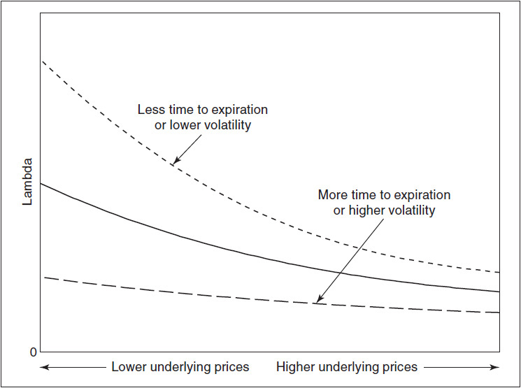

<!-- source:block 380644b17a785f61 -->

*图9-24随着时间推移或波动率变化的看跌期权的Lambda。 / Figure 9-24 Lambda of a put as time passes or volatility changes.*

<!-- source:block 1dc34eb0dd3bd2b2 -->

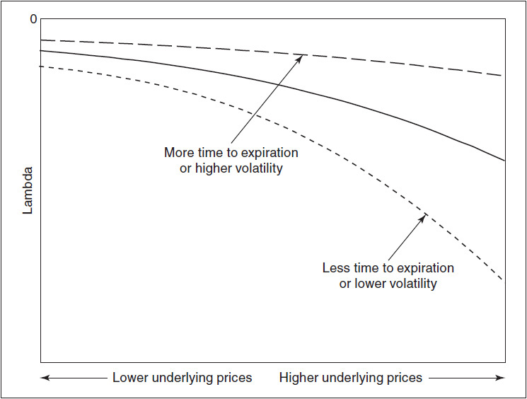

<!-- source:block aa4cbd7bea61aaa8 -->

> [!quote]- English 75
> A trader who wants the biggest possible return on his investment, in percentage terms, compared with an equal investment in the underlying contract can maximize his lambda by trading out-of-the-money options close to expiration in a low-volatility environment. Of course, this is true only in theory. There may be other considerations, such as the bid-ask spread and liquidity of the option market, that might make a large lambda position impractical compared with a similar position in the underlying market.

与标的合约的同等投资相比，希望获得最大的投资回报（百分比）的交易员可以通过在低波动率环境中交易接近到期的价外期权来最大化他的Lambda。当然，这只是在理论上成立。可能还有其他考虑因素，例如期权市场的买卖价差和流动性，这可能会使大量的Lambda头寸与标的市场中的类似头寸相比不切实际。

<!-- source:block 00e77b960041fe72 -->

> [!quote]- English 76
> It may seem that we have gone into undue detail in our examination of the option risk measures. Although it is certainly true that not every risk is important in every situation, experienced traders have learned that it is almost impossible to overemphasize the importance of risk management in option trading. Because options are affected by so many different market forces, unless a trader is aware of and understands the many ways in which option values change, he cannot hope to successfully manage the very real risks that option trading entails.

我们在审查期权风险指标时似乎已经进行了过度的详细处理。尽管并非每种风险在每种情况下都很重要，但经验丰富的交易员已经了解到，在期权交易中，几乎不可能过分强调风险管理的重要性。由于期权受到如此多不同市场力量的影响，除非交易者意识到并理解期权价值变化的多种方式，否则他无法希望成功管理期权交易所带来的非常真实的风险。

<!-- source:block 414d6dc9ae92e787 -->

> [!quote]- English 77
> A summary of the primary risk characteristics discussed in this chapter is given in Figures 9-25 and 9-26.

本章讨论的主要风险特征总结见图9-25和图9-26。

<!-- source:block b5dbc7c1779dbd6f -->

*图9-25传统的风险指标。 / Figure 9-25 Traditional risk measures.*

<!-- source:block b7a3a588a82cccd7 -->

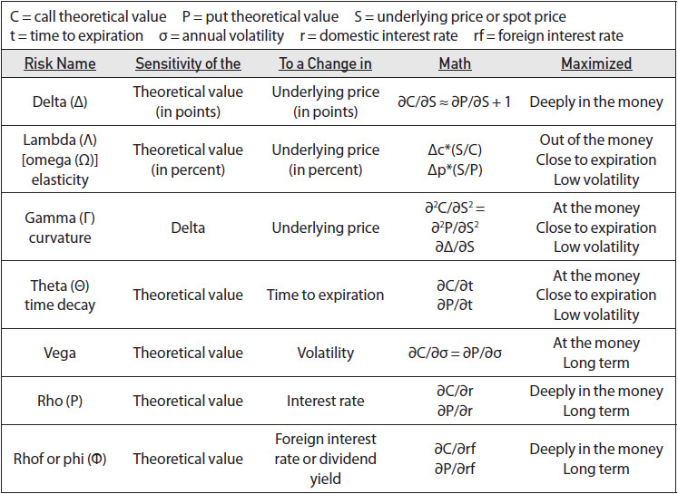

<!-- source:block 701961dfedf19773 -->

*图9-26非传统高阶风险度量 / Figure 9-26 Nontraditional higher-order risk measures.*

<!-- source:block 3baf152245350af8 -->

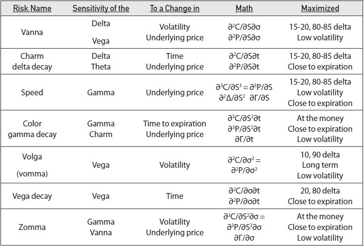

<!-- source:block 41eb0b73a74ae66c -->

> [!note] Footnote 80
> 1 In mathematics, the “sensitivity of a sensitivity” is a second-order sensitivity. The gamma, vanna, and charm are all second-order sensitivities (the sensitivity of the delta to a change in underlying price, volatility, and time to expiration, respectively).

[^ovp09-1]: 在数学中，“灵敏度的灵敏度”是二阶灵敏度。Gamma、vanna和charm都是二阶灵敏度（分别是Delta对标的价格、波动率和到期时间变化的灵敏度）。

<!-- source:block 6e611bc2938cdb94 -->

> [!note] Footnote 81
> 2 The vanna is actually 0 for delta values slightly larger than 50 and smaller than –50. This is due to the non-symmetrical characteristic of the lognormal distribution.

[^ovp09-2]: 对于略大于50且小于-50的Delta值，vanna实际上为0。这是由于对数正态分布的非对称特征。

<!-- source:block b90e29fdb1eef835 -->

> [!note] Footnote 82
> 3 In fact, the theoretical value and theta of two otherwise identical at-the-money options are proportional to their exercise prices. In this example, the 1,000 call will be worth exactly 100 times more than the 10 call, and its theta will be exactly 100 times greater.

[^ovp09-3]: 事实上，两个相同的平值期权的理论值和Theta与其行权价成正比。在本例中，1,000看涨期权的价值恰好是10看涨期权的100倍，并且其Theta将恰好大100倍。

<!-- source:block 8f560b502fb466f7 -->

> [!note] Footnote 83
> 4 The theta values for in-the-money and out-of-the-money options are actually slightly different. However, the values are so close that in Figure 9-10 we use one line to represent both options.

[^ovp09-4]: 价内和价外期权的Theta值实际上略有不同。然而，这些值非常接近，以至于在图9-10中我们使用一行来表示两个期权。

<!-- source:block e3778b79e5c84e66 -->

> [!note] Footnote 84
> 5 In fact, we can see from Figure 9-14 that the vega of an at-the-money option declines very slightly as we raise volatility. This will be discussed in greater detail in Chapter 18.

[^ovp09-5]: 事实上，我们从图9-14中可以看到，随着波动率的提高，平值期权的Vega会小幅下降。这将在第18章中更详细地讨论。

<!-- source:block cb6917c1ffd8a666 -->

> [!note] Footnote 85
> 6 Because the gamma is a second-order sensitivity—the sensitivity of the delta to a change in the underlying price—the sensitivity of gamma to a change in market conditions is a third-order sensitivity. For a discussion of some of the higher-order sensitivities, see Espen Gaarder Haug, *The Complete Guide to Option Pricing Formulas* (New York: McGraw-Hill, 2007); Espen Gaarder Haug, “Know Your Weapon, Part 1,” *Wilmott Magazine*, May 2003: 49–57, also available at http://www.wilmott.com/pdfs/050527_haug.pdf; and Espen Gaarder Haug, “Know Your Weapon, Part 2,” *Wilmott Magazine*, July–August 2003:50–56, also available at http://www.nuclearphynance.com/User percent20Files/2552/0307_haug.pdf.

[^ovp09-6]: Gamma 是二阶敏感度——即 Delta 对标的价格变化的敏感度——因此，Gamma 对市场条件变化的敏感度属于三阶敏感度。关于部分高阶敏感度，参见 Espen Gaarder Haug，The Complete Guide to Option Pricing Formulas（New York: McGraw-Hill, 2007）；Espen Gaarder Haug，“Know Your Weapon, Part 1,” Wilmott Magazine，2003 年 5 月：49–57，亦可查阅 http://www.wilmott.com/pdfs/050527_haug.pdf；以及 Espen Gaarder Haug，“Know Your Weapon, Part 2,” Wilmott Magazine，2003 年 7–8 月：50–56，亦可查阅 http://www.nuclearphynance.com/User percent20Files/2552/0307_haug.pdf。

<!-- source:block 30ac8d37ce1971b1 -->

> [!note] Footnote 86
> 7 This is a general rule. Sometimes an option that is only slightly in the money or out of the money will act like an at-the-money option. Whether an option’s characteristics will resemble those of an at-the-money, in-the-money, or out-of-the-money option will depend on a variety of factors, including volatility and time to expiration.

[^ovp09-7]: 这是一般规则。有时，仅稍微具有ITM或OTM的期权将像ATM期权一样。 期权的特征是否类似于ATM、ITM或OTM期权，取决于多种因素，包括波动率和到期时间。

---

[[阅读导航|← 返回阅读导航]]

<!-- chapter-nav:start -->
> [!tip] 章节导航（章末）
> [[动态对冲 Dynamic Hedging|← 上一章]] · [[阅读导航|全书导航]] · [[价差策略导论 Introduction to Spreading|下一章 →]]
<!-- chapter-nav:end -->
