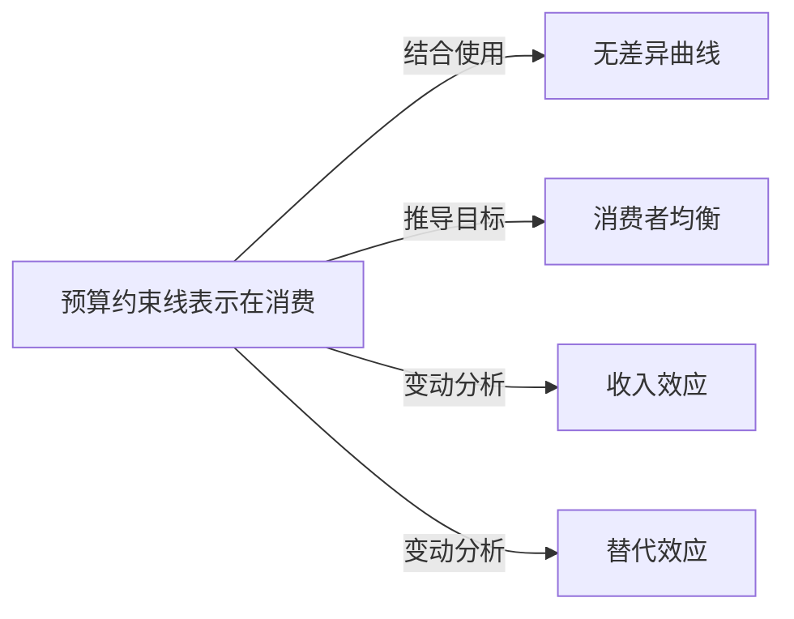

# 预算约束线

## 定义
预算约束线表示在消费者收入和商品价格既定的条件下，消费者的全部收入所能购买到的两种商品的各种数量组合的轨迹。

## 核心解释
预算约束线刻画了消费的可能性边界。线上及线内的点是消费者可以负担得起的组合，线外的点超出支付能力。其斜率由两商品的价格比决定，反映了市场提供的客观交换比率。常见误解是将其与无差异曲线混淆：前者由客观的收入与价格决定，后者由主观偏好决定。预算约束线变动通常源于收入变化（平移）或相对价格变化（旋转），是分析消费者最优选择的基础工具。

## 示例
- 可乐每罐5元，薯片每袋10元，若你有100元预算，可购买的可乐与薯片的组合均落在预算约束线上，如全部买可乐得20罐0袋薯片，全部买薯片得0罐10袋薯片。
- 政府发放的实物补贴（如食品券）会使预算约束线在特定商品段向外凸出，形成折弯的预算线，改变消费选择。

## 关联概念
- [[无差异曲线]]：与预算约束线相切的无差异曲线决定了消费者均衡，二者共同刻画主观偏好与客观限制的互动。
- [[消费者均衡]]：预算约束线上使效用最大化的点，满足两者斜率相等的条件。
- [[收入效应]]：纯粹收入变化导致的预算约束线平移，进而引起需求量变化。
- [[替代效应]]：相对价格变化导致预算约束线斜率变化，在剔除实际收入变化后对需求量的影响。

## 相关问题
- 预算约束线方程是什么？斜率的经济含义是什么？
- 当一种商品的价格下降时，预算约束线如何变化？
- 实物补贴与现金补贴对预算约束线和消费者福利的影响有何不同？

## 关系图

