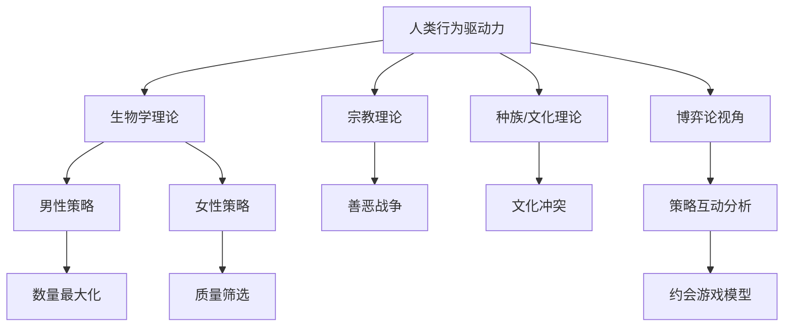

# Game Theory 01: The Dating Game - Theories of Human Motivation

> [!summary] 摘要
> 本页面记录课程「[[博弈论]] 01：[[约会游戏]]」的开篇讨论：不同学科如何解释人类行为的驱动力。介绍[[宗教]]、[[生物学]]、种族/[[文化]]三种理论，为后续引入 [[博弈论]] 的 [[策略互动]] 分析做铺垫。

## 理论一：宗教与善恶之争

大多数[[宗教]]将人类行为视作善与恶之间的永恒战争。

- 每个人内心都存在向善（上帝）和向恶（撒旦）的两种力量。
- 文明的本质就是不断在两者之间做出选择。
- [[宗教]]的作用是赋予人力量，指引向善的道路。

> [!tip] 记忆要点
> [[宗教]]视角 = 内在道德战争。关键概念：[[善与恶]]、[[自由意志]]。

## 理论二：生物学与繁衍驱动力

[[进化生物学]]认为，所有行为的终极目标是把 [[基因]] 传递下去。

- 生命的根本意义在于繁殖：拥有后代，并让后代继续传递[[基因]]。
- 男性和女性因[[生育]]成本不同而演化出截然不同的 [[繁衍策略]]。

### 男性的繁衍策略

男性只需完成交配即可传递[[基因]]，因此倾向于“广撒网”：

- 尽量与更多女性交配。
- 父系投入较低，追求数量而非质量。

> [!example] 原始表述
> “作为男人，你只需要把阴茎放进女人体内，任务就完成了。所以你想把阴茎放进尽可能多的女人体内，这就是你存在的意义。”

### 女性的繁衍策略

女性因为怀孕、分娩和抚养的巨大投入，必须谨慎：

- 怀孕需要 9 个月，分娩是极痛苦的经历。
- 抚养孩子到成年约需 16-18 年，投资巨大。
- 因此女性对性伴侣和婚姻对象的选择非常挑剔。

> [!warning] 注意
> 这种简化的两性策略属于早期社会[[生物学]]观点，现实中的 [[人类行为]] 受[[文化]]、[[经济]]、个人心理等多重因素影响，远非单纯生物决定论。

### 两性策略对比

| 维度 | 男性策略 | 女性策略 |
|------|----------|----------|
| 投入 | 极低（单次交配）| 极高（怀胎、哺乳、养育）|
| 最优策略 | 数量最大化 | 质量筛选 |
| 择偶偏好 | 年轻、健康、多产 | 资源、承诺、保护能力 |
| 冲突核心 | 男性追求更多伴侣 vs 女性追求更优质伴侣 | |

## 理论三：种族与文化决定论

（课程中仅提及，未深入展开）

- 该观点认为世界是由不同 [[种族]] 与 [[文化]] 之间的斗争所驱动。
- [[文化]]差异塑造了群体行为模式与冲突。

## 理论间的联系与博弈论导入

上述三种理论分别从道德、生物本能和社会群体三个层面解释人类行为。然而，[[博弈论]]提供了一种统一的分析框架：无论驱动力是什么，个体在特定情境下都会进行 [[策略选择]]，并根据他人的可能反应优化自身收益。

在“[[约会游戏]]”中，男性和女性的策略互动恰好展示了 [[博弈论]] 的基本要素：

- 参与者：男、女
- 策略：追求数量 vs 谨慎筛选
- 收益：成功传递[[基因]]或获得稳定伴侣

这为后续课程中引入 [[纳什均衡]]、[[囚徒困境]] 等概念埋下伏笔。

## 关系图

## 相关问题

- 在[[博弈论]]中，如何建模男女约会中的信息不对称？
- [[生物学]]策略是否会在现代[[文化]]中被修正？
- 不同[[文化]]背景下的“约会博弈”有何共性？