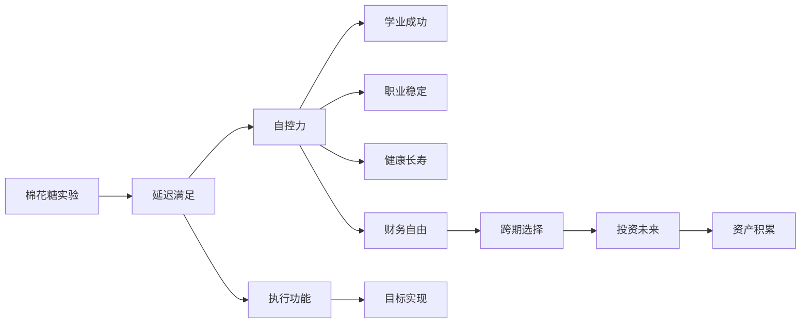

> [!summary] 摘要
> 本讲使用[[博弈论]]视角围绕**[[成功]]**与**[[自控力]]**展开，以**[[棉花糖实验]]**为核心案例，揭示延迟满足能力对个人学业、职业、健康等长期结果的深远影响。内容整合了心理学研究与个人发展视角，适合反复查阅与自我反思。

---

## 核心实验：棉花糖实验

### 实验设计
- 心理学家 **Walter Mischel** 设计了一项简单测试。
- 4~5 岁儿童被带入房间，面前放一颗[[棉花糖]]。
- [[规则]]：可以立即吃掉，但如果等研究人员回来还没吃，就能得到**两颗**。
- 研究人员离开后，通过单向镜观察儿童挣扎的过程。

> [!example] 实验观察
> 有的孩子能抵御诱惑，坚持等待；有的则很快放弃。这一行为差异成为后续长达 **50 年追踪**的起点。

### 关键发现
- **延迟满足**能力强的孩子，后期表现显著更优：
  - 学业成绩更高
  - 职业更稳定、晋升更快
  - 人际关系更稳定
  - 更少陷入药物、酒精、犯罪等问题
  - 身体更健康、体型更精瘦、牙齿更好
- 立即吃掉棉花糖的孩子，则普遍呈现相反趋势。

> [!warning] 常见误解
> 实验并非单纯预测命运，而是揭示**自控策略**的个体差异。后续研究表明，通过训练可以提升延迟满足能力。

---

## 成功的关键因素

### 自控力的长期影响
- [[自控力]]像肌肉，可被锻炼和消耗。
- 延迟满足是**执行功能**的核心成分。
- 它与[[目标设定]]、[[习惯养成]]、[[情绪调节]]紧密关联。

### 财富视角下的自控
- 来自《富爸爸穷爸爸》的隐喻：穷人为短期享乐消费，富人延迟享受、投资未来。
- [[金钱]]管理本质上是**跨期选择**——今天克制消费，换取资产积累。

> [!tip] 提升自控力的技巧
> - 使用「如果-那么」计划：如“如果我想吃零食，那么我就喝一杯水”。
> - 改变环境刺激：把诱惑物放在视线之外。
> - 练习[[冥想]]，增强前额叶皮层功能。
> - 从小事做起，建立自律的信心。

---

## 关系图

---

## 相关问题
- [[如何培养孩子的自控力？]]
- [[自控力与意志力是同一回事吗？]]
- [[棉花糖实验的批评与再验证]]
- [[延迟满足在投资中的应用]]
- [[贫穷是否削弱自控力？]]

- [[习惯与环境如何影响自律？]]

---

## 关联概念
- [[执行功能]]
- [[延迟满足]]
- [[跨期选择]]
- [[自我损耗]]
- [[富爸爸穷爸爸]]

- [[习惯回路]]
- [[目标设定理论]]
- [[情绪调节]]