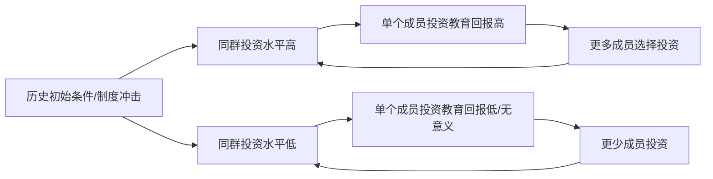

> [!summary] 核心洞见
> 为什么某些族裔在移民国家[[经济]]成功（如 [[印度裔]]、[[东亚裔]]），而另一些却陷入低流动性？传统解释强调[[文化]]或遗传，但 [[博弈论]] 揭示了一种“移民陷阱”——个体的理性选择如何在群体层面锁定次优均衡。[[预期]]、[[社会规范]]与[[协调博弈]]是解释差异的关键。

## 定义
**移民陷阱** 是一个 [[博弈论]] 概念，指移民群体内部因策略互动形成的自我强化均衡：低[[教育投资]]→低职业成就→低预期→更低的投资意愿，导致整个群体长期处于[[经济]]底层的状态。

## 核心解释
- 传统观点将族裔间收入差距归因于：
  - [[文化]]上“某些[[文化]]更重视教育”（如 [[东亚裔]] [[文化]]）。
  - 极端[[种族歧视]]观点：[[基因]]决定的智力差异。
- [[博弈论]]视角则聚焦于 **[[激励]]结构** 与 **策略互补性**：
  - 个体的教育投资回报依赖于同群人的平均行为（[[人生际遇]]）。
  - 当多数成员不投资教育时，个体即使有能力投资也会面临[[信号传递]]失败的风险（雇主默认该群体能力低），从而放弃投资。
  - 这构成一种[[协调失败]]：所有人都选择低努力水平，无人能单独偏离而获益。

> [!warning] 误区
> 将族裔[[经济]]差异简单归结为“[[文化]]缺陷”或“[[基因]]优劣”，忽略了[[博弈均衡]]的多重可能性和历史路径依赖。同一个族裔在不同国家或制度环境下可能表现出完全不同的结果。

## 数据快照（美国）
- **高收入族裔**：
  - [[印度裔]]：受益于母国竞争激烈的[[高等教育]]筛选（如 [[IIT]]），赴美后多进入 [[硅谷]] 科技业或医疗业。
  - [[东亚裔]]（日、韩、菲、华等）：在[[PISA]]等国际评估中成绩优异，以勤勉著称。
- **平均线**：[[白人]]为多数群体，家庭收入中位数约 $70,000/年。
- **低收入族裔**：
  - [[拉丁裔]]：多从事低技能工作，教育投资回报感知较低。
  - [[非裔美国人]]：受长期[[制度性歧视]]和[[奴隶制]]遗留影响，陷入低均衡。

## 博弈模型（协调博弈）

- 群体可能落入 **高水平均衡**（高教育→高职业成就→高预期）或 **低水平均衡**（低教育→低职业成就→低预期）。
- 改变均衡通常需要外生冲击（如[[平权法案]]、[[移民政策]]变化、社群领袖的协调）。

## 关键概念链
> [[博弈论]] → [[协调博弈]] → [[多重均衡]] → [[预期管理]] → [[移民陷阱]]
> [[PISA]] → [[教育绩效]] → [[人力资本]] → [[劳动力市场信号]] → [[族裔收入差距]]

## 典型案例：印度裔的成功路径
> [!example]
> 1. 母国极度筛选：[[IIT]] / [[IISC]] 录取率极低，形成“精英信号”。
> 2. 赴美深造（硕士/博士），进入[[STEM]]领域。
> 3. 借助社群网络（[[硅谷]]印度高管圈）维持高职业预期。
> 4. 后代在家庭高教育预期下继续投资 → 均衡自我强化。

## 为何拉丁裔/非裔难以模仿？
- [[信号发送]]成本不同：雇主若已对某群体形成统计歧视，个体高水平教育的信号可能被“打折”。
- [[社会网络]]薄弱：无法获得内推、融资、创业支持等[[社会资本]]。
- 政策历史：[[住房隔离]]、[[司法系统偏见]]持续削弱累积优势。

> [!tip] 破局思路
> 1. **改变预期**：如“无条件录取”项目或配额制，向特定群体传递“努力必获回报”的强信号。
> 2. **角色模范**：成功个体的可见度可充当协调锚点（[[谢林点]]）。
> 3. **群体内合作**：建立[[互助基金]]、职业导师网络，内部化投资回报。

## 常见问题
- [[基因]]差异真的是主因吗？
  - 不。大量双胞胎研究和跨国家比较否定了遗传决定论。[[PISA]]成绩与人均 GDP、教育资源的相关性远大于种族。
- [[文化]]说不通吗？
  - [[文化]]是内生变量。当群体看见教育投资回报时，自然会“重视教育”。[[博弈论]]解释了为何回报不被看见。

---
**关联主题**：[[自我实现的预言]] · [[统计歧视]] · [[制度经济学]] · [[不平等陷阱]] · [[社会流动]]