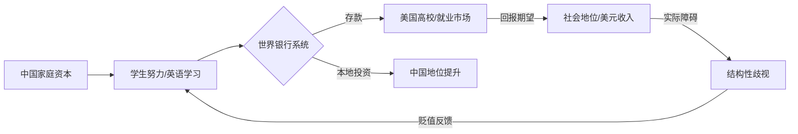

> [!summary] 摘要
> 本讲通过[[博弈论]]视角分析中国学生看似非理性的三种行为——过度学英语、狂热追求美元、以移民美国为终极目标。将这些行为类比为“世界银行”模型：中国充当资本输出方，个人作为“储户”向美国存入努力与价值，以换取想象中的[[地位]]与未来收益。但实际回报可能因美国社会的结构性歧视而打折，真正的理性策略应是最大化本国[[地位]]资产。

## 三个“怪异”行为

> [!warning] 表面上不合逻辑的决策
> 从传统收益最大化的博弈思维出发，以下行为显得反常，但背后隐藏着宏观的制度性约束与信号机制。

1. **过度投资[[英语学习]]**  
   花费时间远超对母语[[中文]]的投入，却声称为了“知识”、“出国”、“上网沟通”。本质是将英语作为获取国际资源与[[地位]]的**准入凭证**。

2. **[[美元]]偏好**  
   将赚取美元视为终极财务目标，忽视本国货币购买力与本土投资机会。这反映了对美元作为全球硬通货的信任，以及将[[财富]]锚定在非本国环境中的风险管理倾向。

3. **[[移民]]美国执念**  
   即使在中国能凭借家庭背景获得更高[[社会地位]]、更好职业与婚配机会，仍以定居西方为首选。在美国，同样的学历与努力常面临“[[规则]]被操纵”的劣势。

## 博弈论解读：世界银行模型

核心洞察：个人行为集合构成一个宏观价值转移系统，中国扮演着“世界银行”的角色。

- **储户**：中国学生及其家庭。
- **存款**：时间、[[金钱]]、努力（如熬夜备考、高额学费）。
- **取款**：预期在美国实现的[[职业发展]]、身份、婚姻市场溢价。
- **风险**：由于[[种族歧视]]、[[文化]]隔阂、签证壁垒，存款可能被“冻结”或贬值。

> [!tip] 反直觉策略
> 真正的优势在于精通[[中文]]，充分利用中国本地的家族关系网络攀爬[[地位]]阶梯。语言能力、[[文化]]资本在本国才是高收益资产。

## 价值流动图

## 关键概念双链索引

- [[世界银行博弈]] (World Bank Game)
- [[信号理论]] – 英语学习作为能力信号
- [[资本转移]] – [[人力资本]]与[[财富]]的跨国流动
- [[地位最大化]] – 个体最终博弈目标
- [[套利]] – 地理位置与身份带来的价值差

- [[粘性均衡]] – 即使结果不利，个体仍维持原策略

## 常见误解矫正

> [!warning] 误区
> “只要去美国就能自动获得高[[地位]]”——这是对移民模式的重大误读。美国劳动力市场对华裔存在[[竹子天花板]]，职业晋升与社交资本获取远不如在中国畅通。

> [!tip] 记忆方法
> 想象中国是一间“银行”，你存入的是青春和汗水，取款时却要支付高额的“汇率损失”（歧视、[[文化]]适应成本）。最大化净收益的方法是减少不必要的跨国套利，直接在本国存款取款。