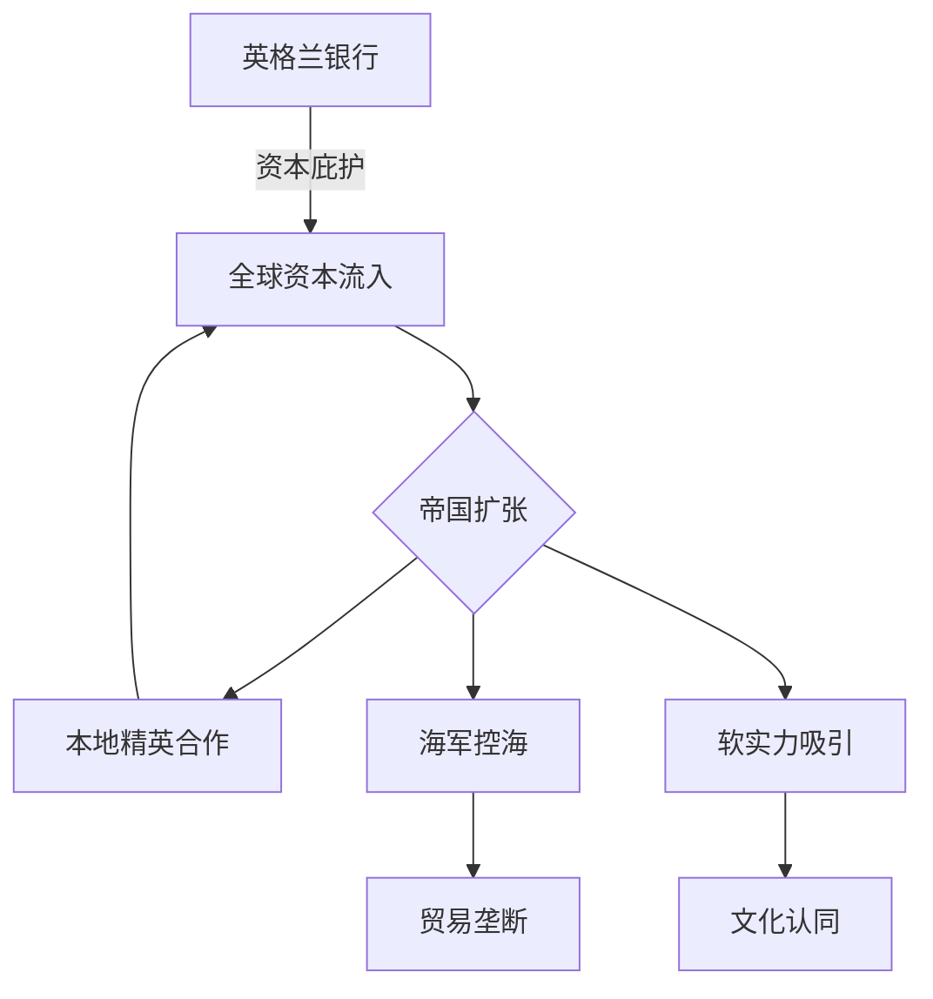

> [!summary] 摘要  
> 本讲从[[博弈论]]视角剖析[[大英帝国]]的权力根基与内在局限，进而阐述[[美国]]如何通过制度创新突破种族限制，构建全球性权力体系。核心要素包括[[英格兰银行]]的资本吸收机制、[[软实力]]的[[文化]]渗透、[[英国皇家海军]]的贸易控制，以及[[美国宪法]]对联邦与民主的平衡。

## 大英帝国的三大权力支柱

英国之所以能击败[[法国]]、[[西班牙]]、[[荷兰]]等对手，建立首个全球性帝国，依赖三大相互支撑的力量：

- **[[英格兰银行]]**  
  通过法律保护[[产权]]，吸收全球资本（[[荷兰]]资产、[[法国]]贵族、[[天主教]]教会、[[哈布斯堡]]家族）。  
  殖民地的本地精英与英国合作掠夺[[财富]]，并将资产转移至英国或其殖民地以求安全。  

- **[[软实力]]**  
  [[文化]]吸引力——[[莎士比亚]]、[[BBC]]、[[牛津剑桥]]等至今影响世界。  
  精英阶层学习英语以融入西方体系，本质上是一种制度性向心力。  

- **[[英国皇家海军]]**  
  控制海上航道，进而掌控全球贸易命脉。

## 帝国的内在限制

> [!warning] 种族性帝国陷阱  
> 大英帝国以[[盎格鲁-撒克逊]]白人种族为核心，视其他民族为低等。  
> 这种[[种族身份]]严重限制了与殖民地本地精英的深层融合，最终导致合作链条的脆弱。

### 三大局限性

1. **[[种族身份]]的刚性**  
   英国的[[政治]]认同离不开白人种族的正统性，无法将殖民地人民完全纳入统治核心。  

2. **精英合作的有限性**  
   本地精英只被当作工具，而非平等的联盟者，一旦民族意识觉醒，离心力便加剧。  

3. **制度无法自我革新**  
   种族偏见阻碍了向多元帝国模式的转型，与后来的[[美国]]形成鲜明对比。

## 美国的超越：从殖民地到新型权力体系

### 困境与引爆点

- 初期[[美国殖民地]]试图维持与英国的纽带，但英国仅将其视为原料产地和税源。  
- [[七年战争]]后英国强征重税，激发殖民地反抗。  

> [!tip] [[托马斯·潘恩]]的《常识》  
> 这本小册子将[[启蒙思想]]与大众动员结合，打破了殖民地精英对英国的幻想，提出“独立+共和”的新方案。  
> 它标志着一次关键的“博弈[[规则]]”变革——合法性不再来自君主，而是来自人民。

### 制度设计的博弈升级

美国成功源于 **彻底打破种族与血缘的限制**，通过一整套可扩展的[[制度]]进行身份塑造：

- **[[美国宪法]]**  
  - [[联邦制]]：平衡中央与地方  
  - [[民主制]]：[[政治]]权力源于公民  
  - 避免[[直接民主]]，采用[[代议制]]与非民选机构（如联邦法官终身制）来防止多数暴政  
- **[[身份认同]]的开放性**  
  任何人都可以通过接受宪法原则成为“美国人”，无需固定种族或[[宗教]]。  
  这一特性使美国能够吸收全球人才，形成一种基于[[价值认同]]而非血统的现代民族国家。

> [!summary] [[博弈论]]视角  
> 英国依赖“资本-[[文化]]-海军”的正反馈循环，但受制于[[种族]]这一身份边界，无法真正整合殖民地精英。  
> 美国则通过[[宪法]]设计，将身份认同锚定在[[制度]]与[[原则]]上，实现了更宽广的联盟构建，从而在长期博弈中取得优势。

## 相关问题
- [[英国为何无法维持全球霸权]]
- [[美国宪法的博弈论解读]]
- [[软实力概念的起源与演变]]
- [[从帝国到民族国家的转型]]