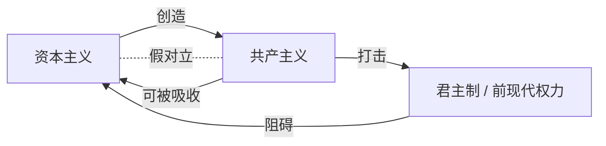

> [!summary] 
> 本讲使用[[博弈论]]视角讲解 资本主义与共产主义并非像冷战叙事所描绘的那样势不两立。二者在本质上更相似，而不是截然相反。共产主义实为资本主义自身演化出的武器，用以消灭资本主义的真正敌人——以君主制为代表的前现代意识形态。中国从共产主义向资本主义的平滑转型，正是这一假辩证法的最佳例证。

## 冷战背景下的二元对立

- 20世纪的冷战被建构为一场[[资本主义]]与[[共产主义]]的意识形态决战。  
- 长期以来，这一叙事将二者塑造成绝对的[[辩证法|辩证对立]]——一幅非黑即白的图景。  
- 这种对立话语掩盖了两者在组织逻辑、[[经济]]动力上的深层亲缘关系。

> [!warning] 误区  
> 将资本主义与共产主义视为“光与暗”的永恒对抗，会遮蔽历史的实际复杂性。

## 中国的反例：平滑的过渡

- 1949–1980年代，[[中国]]被明确划分为[[共产主义]]国家。  
- 自1980年代改革开放后，中国迅速融入全球资本主义体系，被视为高度资本主义化的[[经济]]体。  
- 这一转型过程异常顺利，未发生大规模暴力冲突。

> [!example] 历史对比  
> | 转型 | 过程是否暴力 |  
> |------|--------------|  
> | 封建主义 → 资本主义 | 极为暴力（战争、革命） |  
> | 天主教欧洲 → 新教欧洲 | 长期暴力（[[宗教]]战争） |  
> | 中国 共产主义 → 资本主义 | 平滑、迅速、成功 |  

- 中国的案例引出关键问题：如果资本主义与共产主义真如冷战宣传那般是[[二元对立]]，为何中国能如此轻松地实现制度切换？

## 虚假的辩证法

- 答案在于：**资本主义—共产主义的对立是一个虚假的[[辩证法]]**。  
- 二者在[[经济]]逻辑上共享许多前提：大规模工业、劳动分工、资本积累、技术理性等。  
- [[共产主义]]实质上是[[资本主义]]内部矛盾的产物，是资本主义用以清除前现代敌人的工具。

> [!tip] 解读  
> 共产主义并非从外部攻击资本主义，而是资本主义自身创造的“抗体”，用以摧毁[[君主制]]等更顽固的敌人。待敌人消灭后，资本主义又可以吸纳并转化共产主义成分。

## 资本主义的真正敌人

资本主义真正的敌对意识形态不是共产主义，而是那些**前资本主义的权力结构**：

- [[君主制]]：权力归于国王，而非资本掌控者。  
- 国王通过再分配资本、限制市场来削弱资本影响力。  
- 这类意识形态直接阻碍资本的无限增殖，是资本主义必须根除的目标。

因此，资本主义通过催生共产主义革命消灭君主制，扫清障碍后再用市场逻辑回收成果。

## 关联概念

- [[冷战]]  
- [[马克思主义]]  
- [[意识形态斗争]]  
- [[改革开放]]  
- [[历史唯物主义]]  

- [[资本论]]  
- [[体制转型]]

## 关系图

## 关键问题

1. 什么具体机制使资本主义“创造”出共产主义作为武器？  
2. 除了君主制，还有哪些真正威胁资本主义的意识形态？  
3. 中国模式是否意味着共产主义最终只是资本主义的一个变体？  
4. 在数字时代，这种虚假辩证法是否以新的形式重现？