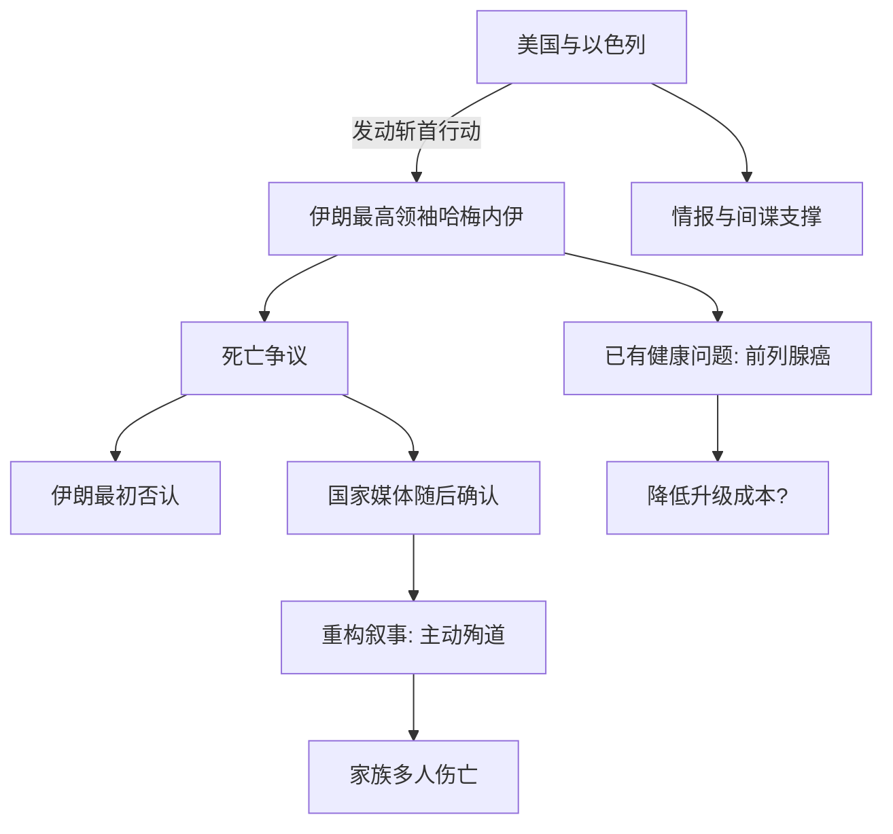

> [!summary] 摘要
> 本条目基于[[博弈论]]框架，记录并分析美国-[[以色列]]对伊朗发动的战争起始阶段。核心事件为对伊朗最高领袖的[[斩首行动]]，重点拆解各方的公开叙事、关键事实与战略信号。通过保存原始讲座中的信息片段，为后续[[地缘政治]]预测与博弈推演提供基础素材。

## 战争开端：时间线与基本事实

- 冲突爆发时间：[[美国]]与[[以色列]]联合行动，于周六凌晨（德黑兰时间）发动攻击。  
- 战争已进入第四天，预计持续数周甚至数年。  
- 事后宣称：“这场战争结束后，世界将不再相同。”

## 斩首行动：目标与执行

- **目标人物**：[[阿里·哈梅内伊]]，伊朗最高领袖（时年 86 岁）。  
- **行动方式**：  
  - 美、以宣称根据[[情报]]定位到领导人位置，派遣战机进行高强度轰炸。  
  - 声称部署了一名间谍，能够记录死者遗体状况（用于身份确认与宣传）。  

> [!info] 行动代号与性质  
> 此类针对敌方最高领导层的精准打击在军事术语中称为[[斩首行动]]，其博弈价值在于迅速瓦解对方指挥体系、制造权力真空。

## 关键事实与生命状态争议

- **死亡确认过程**：  
  - 最初伊朗官方否认，坚称领导人仍然存活。  
  - 随后[[国家媒体]]承认哈梅内伊在空袭中身亡。  
- **伊朗官方叙事转变**：  
  - 将死亡描述为“主动选择”：哈梅内伊本可前往莫斯科避难，但拒绝离开，选择留在德黑兰为民众而死。  
  - 强调“殉道”色彩：其女、女婿、多名孙辈同时遇难，家族大面积伤亡。  

> [!warning] 叙事的博弈功能  
> 官方叙事从“否认”到“牺牲”的转变，旨在将军事失败重塑为民族凝聚力事件，属于典型的损失框架重构（[[框架效应]]）。

## 领导人健康状况

- 报道指出哈梅内伊患有[[前列腺癌]]，预期寿命本就有限。  
- 这一信息可能影响各方对[[斩首行动]]成本收益的计算：  
  - 对攻击方：降低升级风险（因目标自然更迭临近）。  
  - 对防御方：削弱“永久领袖”形象，但强化殉道者光环。

## 博弈论视角下的初步观察

- 战争的实时展开为[[博弈论]]提供了活体案例。  
- 讲授者宣称将用数周时间教授相关理论与技巧，以分析[[地缘政治]]局势并做出预测。  
- 核心假设：分析是否正确可通过与实际进展对比来检验。

## 待补充分析领域

- 此次斩首对伊朗内部权力交接的[[博弈均衡]]影响  
- 美国与[[以色列]]的协同[[信号传递]]策略  
- 伊朗后续报复选项的[[期望效用]]计算  
- 战争长期化对全球[[承诺问题]]与[[威慑]]体系的冲击  

> [!tip] 后续学习建议  
> 将本条目作为动态文档，随着战争进展持续追加新的博弈模型与验证结果。双击词条内的[[双链]]可跳转至相关概念页。