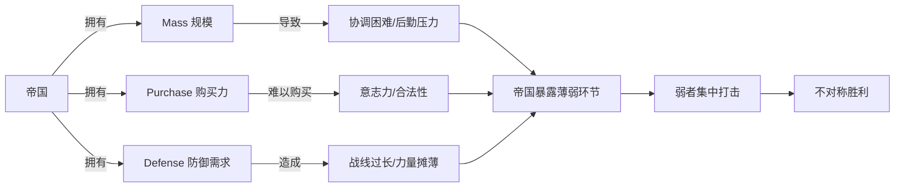

> [!summary] 摘要  
> 本文围绕[[美伊战争]]背景，深入讲解[[博弈论]]中的 **[[不对称法则]]**（Law of Asymmetry）。指出表面上[[美国]]的绝对军事优势并非胜利的保证，历史上弱势方屡屡战胜帝国的案例反复验证了这一法则。文章从帝国的三大优势——**[[Mass]]（规模）**、**[[Purchase]]（购买力/资源获取）**、**[[Defense]]（防御）**——出发，剖析不对称格局的内在逻辑，并揭示[[美国]]可能失利的深层原因。

---

## 核心概念：[[不对称法则]]

[[不对称法则]] 的核心观点是：冲突双方实力悬殊时，**弱者往往具备结构性优势**，强者反而容易陷入[[战略困境]]。  
[[美国]]与[[伊朗]]并非同一量级的对手，美国拥有压倒性的军事与[[经济]]力量，但[[不对称法则]]预测这并不足以保证胜利。

> [!warning] 常见直觉误区  
> 认为“力量更强的一方必然获胜”是线性思维的产物。真实[[博弈]]中，[[战略选择]]、[[重心]]、[[意志力]]等非对称因素会颠覆这一预期。

---

## 历史镜鉴：弱者征服强权的反复上演

| 弱者 | 强者（帝国） | 结果 |
|------|--------------|------|
| 雅典/斯巴达 | 波斯帝国（公元前490年） | 波斯两次入侵希腊均告失败 |
| 马其顿（部族军队） | 波斯帝国（控制欧亚大部） | 约十年内征服波斯 |
| 罗马（部族起源） | 地中海周边诸势力 | 建立[[地中海帝国]] |
| 维京人 | 欧洲诸王国 | 持续劫掠与征服 |
| 阿兹特克（部族联盟） | 周边城邦 | 建立中美洲帝国 |

这些案例反复说明：**边缘部族、小规模族群**能够征服庞大帝国，关键在于利用了[[不对称优势]]。

---

## 帝国的三大优势及其不对称陷阱

### 1. [[Mass]]（规模）

帝国通常拥有庞大的[[人口]]、领土和军队，能够动员压倒性的[[物质资源]]。  
然而，规模也带来[[协调成本]]、[[后勤压力]]和[[目标泛化]]等问题，导致资源无法有效聚焦于冲突的[[重心]]。

> [!tip] 记忆技巧  
> **Mass = More problems**。规模越大，内部摩擦越呈指数级上升。

### 2. [[Purchase]]（购买力/资源获取）

帝国凭借[[财富]]和[[贸易网络]]，可以购买武器、雇佣兵力、收买盟友。  
但[[不对称冲突]]中，[[金钱]]难以直接换取[[战斗意志]]和[[当地合法性]]。对手往往通过[[非市场手段]]（意识形态、[[宗教]]、民族主义）抵消[[金钱]]优势。

### 3. [[Defense]]（防御）

帝国需要防守广泛的[[利益区]]、[[盟国]]和[[后勤节点]]，防御负担极重。  
弱者只需专注攻击帝国的薄弱环节，形成“**局部优势**vs**全面摊薄**”的不对称格局。

> [!summary] 不对称悖论  
> 帝国的每一项“优势”都可能转化为[[战略包袱]]。[[不对称法则]]的本质即在于此。

---

## 关系图：不对称法则下的攻防逻辑

---

## 对[[美伊战争]]的预示

[[不对称法则]]解释为何[[美国]]可能在与[[伊朗]]的对抗中失利：

- 美国的[[Mass]] 虽强，但难以在非对称战场上转化为[[决定性控制]]  
- [[金钱]]与技术无法消解[[意识形态对抗]]和[[代理战争]]的复杂性  
- 全球防御承诺使美国力量分散，伊朗则仅聚焦于[[区域重心]]  

> [!warning] 关键警示  
> 在[[不对称冲突]]中，胜败不取决于力量绝对值，而取决于**谁将对方拖入自己优势的[[博弈场景]]**。

---

## 后续延伸

下一步将结合具体[[战略模型]]（如[[谢林点]]、[[承诺问题]]）深入分析[[不对称法则]]在当代冲突中的运作机制。