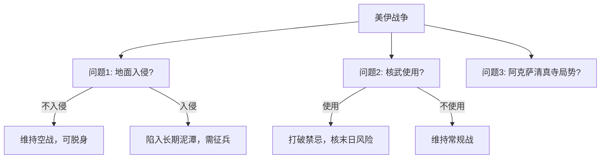
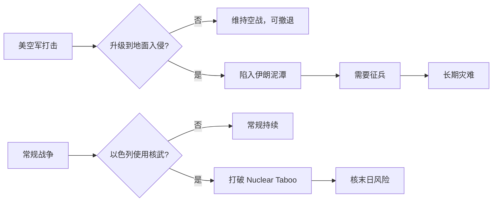

> [!summary] 摘要  
> 本文以 [[Game Theory]] 中的 **升级定律 (Law of Escalation)** 为分析工具，梳理美伊冲突中的三个核心决策问题：  
> - 美国是否发动 **地面入侵**（涉及 [[Mission Creep]] 与越战教训）  
> - 是否使用 **核武器**（打破 [[Nuclear Taboo]] 的风险）  
> - **阿克萨清真寺** 的角色（[[宗教]]象征与局势引爆点）  
> 每个决策点都影响着冲突的走向与战后世界格局。

## 核心问题概览

当前美伊战争的分析聚焦于三个将决定战争结局及战后世界秩序的关键问题。

## 问题 1：美国是否会发动地面入侵？

目前美国与[[以色列]]主要采用 **空战**（远程打击，类似于历史上的[[围城战]]）。

- 只要战事停留在空战阶段，美国仍可选择 **降级** 并从 [[中东]] 脱身。
- 虽然会输掉战争，但损失并非灾难性。

> [!warning] 若发动地面入侵  
> - 局势将迅速升级。  
> - 美国将深陷伊朗至少 5 至 10 年，无论最终输赢，都是灾难。  
> - 为支撑地面战，美国可能不得不恢复 **征兵制**，征召 18 岁青年赴伊作战。

### [[Mission Creep]] 的风险

- 起初只派出少量部队执行“小任务”。
- 若进展不顺，逐渐增兵（如 2,000 人→更多），任务悄然扩大。
- 这正是美国当年陷入 **越南战争** 的模式。

> [!tip] 记忆锚点  
> 越南教训 = 任务蠕变 + 地面部队 → 长期消耗。当前情景高度相似。

## 问题 2：核武器会被使用吗？

网络上普遍担忧 **[[以色列]]** 准备对伊朗实施核打击，以重夺战场主动权。

- 核武器在地缘[[政治]]中属于 **强烈禁忌** ([[Nuclear Taboo]])。
- 美国在 [[二战]] 末期使用后，至今无任何国家再次动用。

> [!warning] 打破禁忌的后果  
> 若[[以色列]]动用 **战术核武器**：  
> - 全球将面临 **核末日** ([[Nuclear Apocalypse]]) 的威胁。  
> - 这一禁忌一旦突破，将彻底改写国际冲突[[规则]]。

## 问题 3：阿克萨清真寺的引爆点

（原文未完整展开）第三个问题涉及 **阿克萨清真寺**，这处[[宗教]]圣地的任何风吹草动都可能成为冲突升级的催化剂，牵动整个 [[伊斯兰世界]] 的神经。

## 关联概念

| 概念 | 解释 |
|------|------|
| [[Game Theory]] | [[博弈论]]，分析冲突方策略互动的数学框架。 |
| [[Law of Escalation]] | 升级定律，描述冲突逐步加剧的不可逆趋势。 |
| [[Mission Creep]] | 任务蠕变，指行动目标与投入在过程中不自觉扩大。 |
| [[Nuclear Taboo]] | 核禁忌，自 1945 年以来不使用核武器的国际规范。 |
| [[Siege Warfare]] | 围城战，此处比喻仅通过空袭/远程打击进行消耗。 |

## 决策树（Mermaid）

## 相关问题

- [[越战与任务蠕变]]
- [[核威慑理论]]
- [[中东地缘政治三极]]
- [[征兵制的政治代价]]