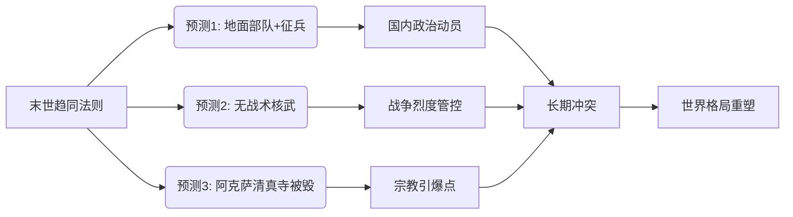

> [!summary] 摘要
> 本讲基于[[博弈论]]框架聚焦“末世趋同法则”，提出关于即将到来的中东战争的三个预测：1）美国将动用地面部队并重启征兵；2）美以不会使用战术核武器；3）伊斯兰第三圣地阿克萨清真寺将被摧毁。通过参议员布卢门撒尔的闭门简报后反应，折射决策层对战争走向的焦虑与信息不透明。

## 背景与三大核心问题

上节课已指出，决定这场战争样貌的有三个根本问题：
- 作战方式将如何演变；
- 战争最终呈现的形态；
- 世界格局将发生何种变化。

基于上述问题，讲师给出了三个具体预测。

## 三项预测概览

| 序号 | 预测内容 | 关键影响 |
|------|----------|----------|
| 1 | 美国将派遣地面部队，特朗普政府将重启[[征兵制]] | 国内动员升级，冲突长期化 |
| 2 | [[以色列]]与美国不会使用[[战术核武器]] | 阈值管控，常规战争为主 |
| 3 | [[阿克萨清真寺]]（伊斯兰第三圣地）将在战争中被毁 | 引爆[[宗教]]与地缘连锁反应 |

> [!tip] 课程进度
> 前两项预测已在上一节课详细论证，本次集中分析第三项预测的逻辑。

## 第三项预测：阿克萨清真寺的毁灭

### 预测依据
讲师将结合[[末世趋同法则]]，解释为何在多方博弈下，该[[宗教]]圣所难以幸免。
- 位置敏感：位于耶路撒冷，是巴以冲突的象征核心。
- 代理人争夺：多方势力借圣城问题动员极端情绪。
- 误判与升级：常规打击极可能因情报错误波及圣地，触发不可控反应。

### 美国决策层的反应：布卢门撒尔案例
为让学员理解战争参与方的真实想法，播放了参议员**布卢门撒尔**（Richard Blumenthal）的片段。他是参议院“[[八人帮]]”成员，有权接收白宫对战争进展的闭门简报。

> [!example] 布卢门撒尔简报后声明
> “这是我15年参议院生涯中最不满、最愤怒的一次简报……我带着更多问题而非答案离开……”
> 
> 他特别担忧：
> - 战争成本被刻意模糊；
> - 美方人员面临直接危险；
> - 正滑向派遣地面部队进入伊朗的路径；
> - 政府未向美国人民充分说明代价。

这一反应印证了第一项预测（地面部队）可能正在决策层内部形成共识，也反衬出战争目标与手段之间的脱节。

## 关系图：预测与战争驱动力

## 关键概念关联

- [[末世趋同法则]]：在多极末世叙事驱动下，各方行为将趋向同一灾难性结局。
- [[八人帮]]：美国国会中接受最高机密军事简报的小组，代表立法部门监督。
- [[征兵制]]：重新启动强制兵役，预示战争规模超出现有志愿部队负荷。
- [[阿克萨清真寺]]：位于圣殿山，其[[地位]]在[[伊斯兰教]]中仅次于麦加和麦地那，摧毁将触发全球穆斯林反应。

> [!warning] 注意
> 讲座中“Alaxic Moss”为“Al-Aqsa Mosque”的音近误录，内容中已修正为[[阿克萨清真寺]]。