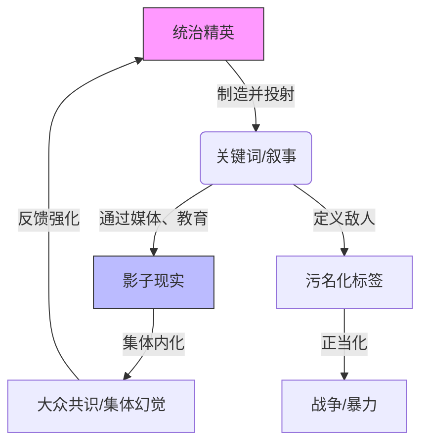

> [!summary] 摘要
> 本文基于演讲内容，探讨了美国与伊朗冲突背后的深层结构。核心观点是我们的世界是一个**集体幻觉**，由统治精英通过叙事构建。借助[[柏拉图洞穴寓言]]，揭示了现实如何被制造，并分析了权力、幻觉与[[博弈论]]的关系。

## 定义
**爱泼斯坦的世界**（Epstein's World）并非指某个人，而是指一种现实模型：我们的社会共识是一种被精心设计的[[集体幻觉]]，由极少数[[统治精英]]通过控制信息和象征系统来维持。

## 核心解释
### 幻觉的生成机制
> [!tip] 核心洞见
> 现实不是客观存在的，而是我们**集体想象与感知**的产物。关键在于：**是“我们”自己创造了这个现实，而非他人强加**。

这个机制可通过[[柏拉图洞穴寓言]]理解：
- **囚徒**：大众，被锁链束缚，只能看到墙壁上的影子。
- **影子**：我们日常接触的新闻、故事、价值观，即被制造的[[叙事]]。
- **自由人**：精英，他们在火堆旁操纵木偶，投射出我们看到的现实。
- **火堆**：扭曲事物真实面貌的媒介（如媒体、教育、[[文化]]）。

### 关键词法——解锁精英叙事
统治精英通过定义一些“关键词”来框定我们的思维，这些词成为触发集体反应的**咒语**。例如：“恐怖分子”一词被塑造为无条件邪恶，从而为任何行为（如战争）提供正当性，而无需具体证据。

> [!warning] 误区
> 很多人以为“恐怖分子”是一个客观描述。但在[[博弈论]]视角下，它是一个**功能性的污名化标签**，目的是将对手非人化，从而调动大众支持精英的暴力决策。

### 谁在构建现实？—— 识别木偶师
在洞穴中，我们看不见身后的操纵者。在现实中，这一角色由**社会[[经济]]精英**（尤其是金融和工业巨头）扮演。他们不直接下令战争，而是通过制造“不可避免”的叙事，让战争看起来像是唯一选择。

> [!example] 案例：美国入侵伊拉克
> 通过反复将[[萨达姆·侯赛因]]与“大规模杀伤性武器”、“恐怖主义”链接，精英成功地在没有确凿证据的情况下，让大部分民众相信战争的必要性。这就是关键词叙事的力量。

## 权力结构的可视化

## 战争如何结束？——洞察博弈规则
战争不是为了消灭对方，而是当**精英的叙事目的达到后**，即可结束。他们制造冲突是为了：
1. 转移国内矛盾（[[经济]]衰退时尤其有效）。
2. 巩固精英内部的权力联盟。
3. 重新划分全球资源控制权。

因此，当这些目标达成，或者维持冲突的成本（包括真相败露的风险）超过收益时，战争就会“结束”。

## 战后图景
战争结束后，新的叙事会迅速覆盖旧的。曾经被污名化的“敌人”可能一夜之间被重新定义，以便精英开启下一阶段资源掠夺。大众的记忆像墙上的影子，闪烁后消失，为新一场幻觉腾出空间。

## 关联概念
- [[柏拉图洞穴寓言]]
- [[集体幻觉]]
- [[共识现实]]
- [[叙事控制]]
- [[博弈论]]

- [[污名化策略]]
- [[权力结构]]

## 记忆要点
> [!tip] 三个问题串联
> 1. 战争为何开始？—— 精英需要一场新的叙事来维系权力。
> 2. 战争如何结束？—— 当叙事目的达成或成本过高时。
> 3. 战争之后会怎样？—— 下一场幻觉的准备工作已经开始。

> [!warning] 关键提醒
> 我们审视世界时，要警惕被赋予了绝对善恶的关键词。**当你听到一个词能自动唤起恨意或忠诚，那很可能就是洞穴墙壁上的影子。**