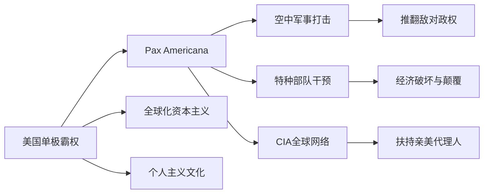

> [!summary] 摘要
> 本讲使用[[博弈论]]视角解析：柏林墙倒塌后，弗朗西斯·福山提出“历史终结论”，认为[[自由主义]]消费民主是人类文明的顶点。这催生了以美国为唯一超级大国的**单极时刻**，其核心特征是 **Pax Americana**（美式和平），并通过军事、情报与特种作战三大机制维持全球霸权。本条目梳理该理论背景、美国霸权的运作方式及其历史影响。

## 背景
- 冷战结束后，资本主义在与[[共产主义]]的长期对抗中胜出。
- 美国国务院官员 **[[弗朗西斯·福山]]** 发表《历史的终结？》一文，影响深远。
- 他主张：人类追求的终极形态是**[[自由主义]]消费民主**，个人拥有购买自由和赋权感。

## 核心概念

### [[历史终结论]]
- 认为历史并非事件的无尽延续，而是社会形态演进至一个终点。
- 终点即 **自由民主+市场[[经济]]+消费主义** 的组合。
- 意识形态对抗被“永久解决”，人类社会发展路径趋同。

### [[单极时刻]]
- 指冷战后美国成为唯一全球霸权的一段独特时期。
- 全球格局由两极对抗转变为单极主导，无同等竞争者。
- 这一时刻被形容为“美国治下的和平”（[[Pax Americana]]）。

## 美式和平的三大支柱（已知部分）
原文着重阐述了第一支柱**军事-情报-特种作战复合体**，其余部分暂缺。

### 1. 军事霸权与特种作战
- **空中优势**：美国掌握绝对制空权，能快速瘫痪目标国家政权。
- **特种部队破坏**：对“问题国家”（如叙利亚、利比亚）实施[[经济]]破坏与政权颠覆。
- **[[中央情报局]]（CIA）全球渗透**：
  - 渗透各国政府，识别并扶持亲美势力。
  - 对抗衡美国霸权者进行打压、清除或边缘化。

> [!warning] 注意
> 原文仅展开论述了 **Pax Americana** 的军事-情报机制，后续关于**[[经济]]全球化**与**[[文化]]意识形态**的另外两大特征尚未补全。实际单极时刻的完整描述应包含布雷顿森林体系、华盛顿共识、好莱坞[[文化]]输出等要素。

## 历史影响与局限性
> [!tip] 积极面
> - 为东亚等冲突频发地区带来一定时期的稳定性，避免大国直接军事对抗。
> - 全球贸易通道因海上霸权而相对安全。

> [!warning] 误区
> 福山的“终结”并非指事件停止，而是指 **社会演进的理想终点已找到**；后续冲突被视为“尾流”或转型中的阵痛。

## 关联概念
- [[冷战]]
- [[共产主义]]
- [[自由主义民主]]
- [[全球化]]
- [[美国例外论]]

- [[文化霸权]]
- [[金融霸权]]

## 相关问题
- “历史终结论”在911事件和新兴国家崛起后为何遭遇广泛批评？
- 单极时刻是否已终结？何时终结？（可参考[[多极化]]、[[修昔底德陷阱]]）
- CIA的渗透行动如何影响目标国家的[[政治]]稳定？（可链接[[颜色革命]]、[[代理人战争]]）