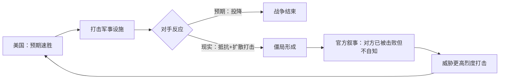

> [!summary] 摘要
> 本文以[[博弈论]]框架审视中东冲突的终局问题，重点分析特朗普与白宫在伊朗问题上的叙事逻辑。美国预期通过快速摧毁军事能力迫使对手投降，但实际遭遇抵抗，形成“非对称升级”僵局。官方将对方持续抵抗归因于其“尚未意识到已被击败”，这种认知差距可能成为冲突进一步扩大的导火索。

## 关键言论拆解

### 1. 特朗普：被低估的抵抗
- 美军行动原本设计为斩首式打击，预期摧毁领导层和导弹工厂后对方即会屈服
- **现实偏离**：对方不仅反击，还扩大冲突范围，波及卡塔尔、巴林、科威特等美国盟友
- 特朗普承认“没人预料到他们会反击”，反映出[[威慑理论|威慑失败]]的典型案例

> [!warning] 误区
> 许多分析认为优势方可以精确控制战局，但这里的言论表明：决策者在战前普遍低估了对手的抵抗意志和[[非对称冲突|非对称报复]]能力。

### 2. 白宫发言人：认知鸿沟与最后通牒
- 卡伦·莱维特声称“伊朗已被军事击败”，但“他们自己不知道”
- 将对手的持续抵抗归咎于其“非理性”或信息闭塞，而非客观实力评估
- 同时发出最后通牒：若不接受“现实”，将遭受史无前例的打击

> [!warning] 风险提示
> 这种 **“对方因愚蠢才不投降”** 的叙事，可能关闭有效沟通渠道，推动[[升级螺旋|冲突螺旋式升级]]，而非走向谈判桌。

## 博弈论视角：僵局的形成

> [!tip] [[博弈论]]概念
> 这是一种典型的 **[[不完全信息博弈]]** ：一方依据自身评估认定对方已无还手之力，却未意识到对方仍有承受损失并回击的决心。双方的 **[[威胁可信度]]** 都在经受考验，而误判可能导致均衡向最坏方向移动。

## 关联概念
- [[博弈论]]
- [[威慑理论]]
- [[非对称战争]]
- [[升级螺旋]]
- [[中东地缘政治]]

- [[特朗普外交政策]]
- [[伊朗核问题]]

## 相关问题
- 在非对称冲突中，如何准确评估对手的“投降阈值”？
- “对方已被击败”的声明在[[政治]]博弈中是策略信号还是认知偏差？
- 从 [[古巴导弹危机]] 等历史案例看，误判对手状态会如何影响危机结局？