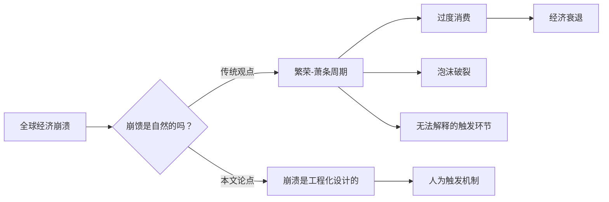

# 经济崩溃是被设计的吗？

>[!summary] 摘要
> 本文源自对全球[[经济]]崩溃（尤其是美国因战争引发的崩溃）的推测性讨论。核心论点：**金融崩溃并非偶然或自然发生，而是必须被精确设计**。文中质疑传统[[经济]]中[[繁荣-萧条周期]]的自然性，指出无法解释泡沫破裂的触发机制，并转向 [[投机]] 性探索。

## 核心论点：崩溃必须被“工程化”

> [!warning] 关键主张
> 金融崩溃不是意外或自然现象。它必须经过 **工程化设计（engineered）** 。这是一个难以理解的概念。

在传统观念中，[[经济]]波动似乎是资本主义的内在宿命。但本文挑战了这一假设，暗示可能存在一种 **设计论** 视角下的崩溃。

## 传统解释：[[繁荣-萧条周期]]

### 教科书中的循环
在[[经济]]教科书中，[[资本主义]] [[经济]]运行遵循 **繁荣-萧条周期**：

- [[经济]]持续扩张（繁荣）
- 某时刻突然收缩（萧条）
- 循环重复

这一过程被描述为 **“自然现象”**，理由如下：

1. **繁荣期行为**：人们消费过度、过度自信、浪费资源。
2. **转折点**：浪费导致[[经济]]转向恶化。
3. **萧条期应对**：社会被迫转向更精简、高效和具备韧性的模式。

### 直观类比：增重与减重
> [!example] 类比解释
> 就像人体体重管理：
> - 吃太多 → 体重飙升（繁荣）
> - 身体感觉变差 → 开始减重（萧条）
> 
> 所以，[[经济]]的“发胖”与“瘦身”被看作一种自然调节。

## 传统理论的漏洞：无法解释“为何突然破裂”

> [!warning] 误区
> 传统[[经济]] **从未真正解释** 泡沫究竟是如何、又为何在 **那一刻** 突然爆裂。  
> 触发机制始终是个 **黑箱**。

- 若你是[[经济]]学生，你可能永远得不到这个答案。
- 因此，需要跳出教科书，转向 **[[投机]]** 性思考。

## 演讲者的研究立场

### 非专家，仅为趣味性推测
- **背景**：未系统学习[[经济]]，非教授，非专家。
- **目标**：对“泡沫如何破裂”、“[[经济]]如何兴衰”保持好奇。
- **方法**：以娱乐和趣味为目的进行 [[投机]]（speculation）。  
- **基调**：这不具备学术基础，仅视作一次 **思维实验**。

> [!tip] 阅读提示
> 以下内容属于 **探索性讨论**，不构成严谨的[[经济]]分析。

## 来自 Andrew Ross Sorkin 的框架

本节开始引入重量级金融记者的解释——

- **Andrew Ross Sorkin**：可能是最有影响力的金融记者之一。
- 他对繁荣-萧条的解释出现于下文（原文截断）。

> [!note] 原文截断
> 此处原始讲稿中断，后续内容尚未提供。

## 概念关系图

