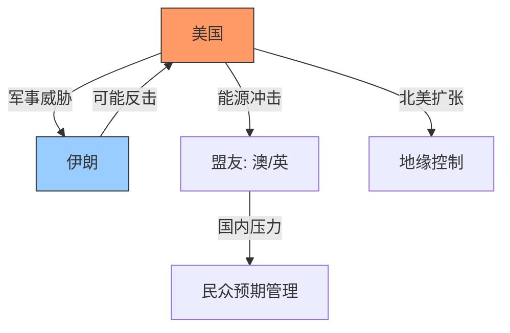

# Game Theory 18: Trump World Order

> [!summary] 摘要
> 本文从[[博弈论]]视角分析特朗普讲话中透露的美国对伊军事战略、[[经济]]宣传与地缘扩张计划，揭示其“胜利叙事”背后的真实博弈状况。

## 关键人物与讲话

- **[[唐纳德·特朗普]]**：声称战争即将胜利，威胁轰炸伊朗至石器时代，并承诺[[经济]]反弹。
- **[[安东尼·阿尔巴尼斯]]**（澳大利亚总理）：承认燃料价格上涨，承诺缓解民生压力。
- **[[基尔·斯塔默]]**（英国首相）：类似表态，承认能源成本上升。
- **[[彼得·赫格塞斯]]**（美国国防部长？）：宣布美国将控制从格陵兰到巴拿马运河的整个北美地区。

## 特朗普讲话核心要点

- **[[经济]]承诺**：[[经济]]“强劲且日益改善”，“很快将咆哮反弹”，甚至超过一个月前水平。
- **军事行动**：代号“[[Operation Epic Fury]]”，声称即将达成所有军事目标。
- **威胁升级**：将在未来两到三周内“极其猛烈地打击他们，把他们送回石器时代”。
- **潜在打击目标**：伊朗的能源和石油基础设施。

> [!warning] 信息不对称
> 尽管特朗普描述“正在胜利”，但分析指出其实际战况可能并不顺利，威胁将对方炸回石器时代恰恰暴露了僵局。

## 全球连锁反应

- 盟友（澳大利亚、英国）已预警油价上涨，表明冲突已波及全球[[经济]]。
- 美国可能进一步扩大战事，甚至派遣地面部队入侵伊朗（传闻最早本周末或本月内）。
- [[彼得·赫格塞斯]]同时宣布北美控制计划——从格陵兰到美洲湾再到巴拿马运河，暗示美国在多线投入资源。

## 博弈论解读

这一系列动作可视为一种[[信号传递]]与[[承诺升级]]的博弈：

- 特朗普的“石器时代”威胁是一种[[边缘政策]]，试图逼迫伊朗退让。
- 盟友公开承认能源冲击，可能是在提前转移国内压力，防止民众反战。
- 北美扩张宣言可能意在巩固基本盘，为海外战争提供[[政治]]资本，形成[[双层博弈]]。
- 若地面入侵成真，冲突将从有限打击升级为全面战争，改变博弈收益矩阵。

## 关键洞察

> [!tip] 洞察
> - 特朗普的“胜利”叙事是一种典型的[[承诺策略]]，旨在稳定国内情绪并威慑对手。
> - 盟友的“痛苦预警”实际是在为长期冲突做铺垫，分摊成本。
> - 多线扩张（伊朗+北美）可能稀释美国战略资源，形成[[过度扩张]]风险。

## 相关概念

- [[边缘政策]]
- [[信号传递]]
- [[承诺升级]]
- [[双层博弈]]
- [[过度扩张]]

- [[地缘[[政治]]学]]
- [[博弈论]]