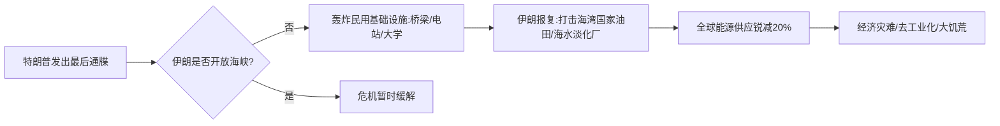

> [!summary] TL;DR
> 本本文从[[博弈论]]视角分析。核心议题：特朗普政府对伊朗发出的军事最后通牒可能引发全面战争；美军第一次地面入侵失败后，可能升级为全国动员式进攻。叙述将事件置于 **[[好莱坞-五角大楼复合体]]** 视角下，揭示媒体叙事、军事扩张与战争合法性之间的共生关系。

---

## 关键事件时间线

## 特朗普的威胁升级

- 推特称伊朗领导人为“疯狂混蛋”，并配文“赞美真主”
- 下令摧毁伊朗最大桥梁，此举被叙述者定义为 **[[战争罪]]**
- 历史上多次最后通牒后退缩（“我总是让步”），但此次被判断为 **不同**

> [!warning] 判断转折点
> 周末美军发动地面进攻并 **失败**，但并未寻求和谈；相反，可能启动 **全国征兵** 进行全面地面战争 —— 这一次“世界将不再相同”。

## 好莱坞-五角大楼复合体的作用

片段后半部分转向 **[[好莱坞-五角大楼复合体]]** 理论：
- 美国电影工业与国防部长期合作，通过大片美化战争、塑造敌人形象
- 当前对伊朗的叙事被指为 **“剧透模式”**：媒体提前铺陈军事行动的必要性，如同电影预告
- 意图：获取国内国际舆论支持，为实际军事部署扫清合法性障碍

> [!tip] 识别媒体宣传
> 当新闻报道突然集中出现：
> - 特定国家的“非人道行为”
> - 历史伤痕被重新放大
> - 专家反复强调“迫在眉睫的威胁”
> 可对照 **[[威纳的战争宣传模型]]** 检验，警惕 **[[认知战]]** 前置。

## 战略博弈与灾难预期

- 美方攻击 **民用基础设施**（桥梁/大学/电站）打破传统交战[[规则]]，迫使伊朗对等回击
- 波斯湾海峡 **封锁** → 全球20%能源断供
- 连锁反应：
  1. 海湾国家（GCC）遭袭
  2. 全球供应链断裂
  3. 大规模饥荒与去工业化

> [!summary] 核心游戏理论映射
> 此次危机被视作 **[[边缘政策]]**（Brinkmanship）中的“恶棍博弈”：双方都试图逼迫对方退让，但任何一方的轻微过线都会导致 **双向毁灭**。好莱坞复合体则充当了 **信号放大器**，让国内观众预先接受“别无选择”的军事冒险。

## 关键概念映射

- [[好莱坞-五角大楼复合体]]  
- [[战争罪]]  
- [[联合全面行动计划]]（伊朗核协议）  
- [[边缘政策]]  
- [[认知战]]  

- [[军民融合]]（美国版）  
- [[全球粮食危机]]  

---

> [!warning] 信息备注
> 全文为高度口语化的实时评论转录，保留了大量原始表达与情绪。整理时已拆分长句，保留核心判断，但未核查事实声明（如桥梁被炸、地面入侵失败等）。涉及地缘冲突的叙述仅代表原说话人观点。