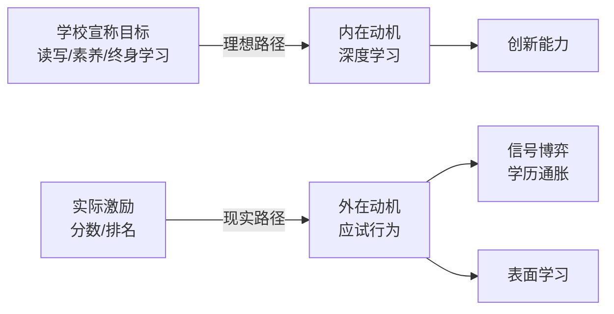

> [!summary] 摘要
> 本讲使用[[博弈论]]视角重新审视[[学校]]制度。传统观点认为学校的目标是培养[[读写能力]]、[[核心素养]]和[[终身学习]]；现实却是多数学校通过[[考试]]与[[信号传递]]机制，把学生推向[[零和博弈]]，抑制了真正的创造力和学习兴趣。我们将用博弈模型解释“学校为何令人失望”。

---

## 一、学校被赋予的三大目的

### 1. 读写能力
使人在社会中吸收与传递信息。  
[[信息不对称|信息流动]]是现代社会运作的基础，学校承担最基础的[[语言能力训练]]。

### 2. 核心素养
- 批判性思维
- 协作能力
- 沟通能力
- 解决问题能力

这些[[软技能]]被视为[[成功]]的通用能力基座。

### 3. 终身学习
在[[AI]]与[[全球化]]时代，知识迭代加速，学校只是[[学习]]的起点。真正的目标是：
- 热爱学习
- 掌握自学方法
- 保持持续更新的状态

> [!tip] 理想模型
> 如果把这三项目标全部实现，学生将成为 **自主、适应力强的[[终身学习]]者**。

---

## 二、现实中的学校为何偏离目标？

### 逆向设计的激励结构
多数学校的运行逻辑并非围绕“培养能力”，而是围绕 **可量化指标**：
- 分数
- 排名
- 升学率

这些指标催生了[[考试导向教育]]。在[[博弈论]]中，这形成了**错误的[[支付矩阵]]**——学生发现迎合指标比真正学习更“划算”。

### 博弈论的解读

学生与教师陷入一场**分数信号博弈**：
- 学生：追求信号（分数/文凭） >> 追求真才实学
- 学校：用信号筛选而非培养能力

> [!warning] 关键矛盾
> 当[[评价体系]]以 **相对排名** 为中心，学习就变成**零和竞争**。  
> 你的成功意味着别人的失败，合作与深度思考被边缘化。

---

## 三、学校的“坏均衡”

### 学校作为信号机器
根据[[迈克尔·斯宾塞]]的[[信号传递模型]]，教育的[[经济]]价值可能更多在于 **提供能力信号**，而非提升能力本身。学生的最优策略是：
- 最小化真实努力
- 最大化信号产量（高分、名校标签）

这导致了一个**坏均衡**：
- 学生疲惫但内涵空虚
- 学校维持应试流水线
- 社会依赖文凭筛选，推高学历竞赛

> [!example] 作弊的博弈
> 如果作弊能提高成绩且被抓概率低，**短期理性**的选择是作弊。  
> 当足够多人选择作弊，诚实学习者反而受损——这是典型的[[囚徒困境]]。

### 囚徒困境下的学校场域

| 策略 | 他人合作(不内卷) | 他人竞争(内卷) |
|------|----------------|----------------|
| 你注重真学习 | 双赢：素质提升 | 你被淘汰 |
| 你追求信号 | 你获超额收益 | 双输：消耗战 |

在**单次博弈**的考试压力下，追求信号是占优策略。  
这解释了为何**[[终身学习]]**的理念难以落地 —— 学生早已被训练为 **信号最大化者**。

---

## 四、如何打破困境？

本课给出的只是一个诊断视角。后续[[博弈论]]课程会分析：
- [[重复博弈]]能否改变[[激励]]结构？
- [[合作进化]]如何设计？
- 个体如何通过 **改变策略** 挣脱坏均衡？

> [!summary] 核心洞见
> 学校令人失望，不是因为设计者愚蠢，而是因为**参与者根据现有[[激励]]做出了理性选择**。  
> 要改变学校，先改变[[游戏规则]]。

---

## 关联概念
- [[博弈论]]
- [[信号传递]]
- [[零和博弈]]
- [[囚徒困境]]
- [[外在动机 vs 内在动机]]

- [[考试]]
- [[教育[[经济]]学]]

## 相关问题
- 学校可以设计成非[[零和博弈]]吗？
- 在现有制度下，学生如何兼顾分数与真学习？
- 企业招聘是否也在强化“信号博弈”陷阱？