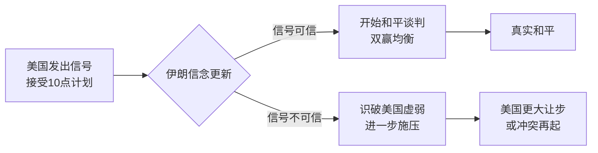

> [!summary] 摘要  
> 本场[[博弈论]]期中考试以 **美伊停火谈判** 为案例，剖析 **信号博弈** 与 **不对称信息** 如何颠覆直觉。特朗普提出的停火框架几乎等同于美国完全投降，其极度慷慨的条款被 **立即接受**，反而暴露了信号的异常。老师借此揭示：在谈判中，过高的初始要价若被对方一口答应，往往意味着 **真实信息** 与表面信号严重背离。

---

## 事件背景

- **时间**：昨日（考试前夕）  
- **人物**：唐纳德·特朗普宣布与伊朗停火  
- **内容**：  
  - 美国与伊朗将在 **两周停火** 后在 **巴基斯坦** 会面谈判。  
  - 谈判将基于 **伊朗提出的 10 点计划** 作为框架。  
- **表面信号**：美国表现出极大的让步意愿。

> [!warning] 关键异常  
> 该 10 点计划几乎等同于 **美国完全投降**。在常规 [[讨价还价博弈]] 中，一方若开出 **极端高价** 却被对方瞬间接受，说明 **信息结构** 存在严重问题——对方可能掌握了你不了解的信息。

---

## 伊朗 10 点计划（美国承诺条款）

| 条款 | 内容 |
|------|------|
| 1 | 美国 **保证永不攻击伊朗** |
| 2 | 伊朗获得 **舒穆斯（Shia Crescent）** 的完全控制权 |
| 3 | 伊朗可自主选择 **浓缩铀** 以推进核计划 |
| 4 | 解除对伊朗的 **所有制裁** |
| 5 | 解除对与伊朗有贸易往来的 **外国实体的二级制裁** |
| 6 | 撤销联合国安理会 **所有反伊决议** |
| 7 | 撤销国际原子能机构 **所有反伊决议** |
| 8 | 对美国和[[以色列]]造成的损害进行 **赔偿与弥补** |
| 9 | 美国作战部队 **撤出中东**，交予伊朗控制 |
| 10 | 美国停止对伊朗所有代理人的 **敌对行动**（包括真主党、胡塞武装） |

> [!example] [[博弈论]]映射  
> 以上每一则承诺都可视为 **美国发出的信号**。在 [[信号博弈]] 中，发送方（美国）试图通过 **廉价对话** 或 **昂贵信号** 影响接收方（伊朗）的信念。但此处的信号过于 “昂贵”（彻底让步），反令其 **可信度** 崩塌。

---

## 博弈论视角分析

### 1. 讨价还价与信息不对称

- 老师用 **卖书类比**：  
  - 你期望卖 $100，但基于 [[锚定效应]] 喊出 $1000。  
  - 店主立刻接受 → 你立刻意识到 **自己的估值可能严重偏低**，或店主掌握了 **你未知的积极信息**。  
- 同理，美国开出 **投降式条款**，却被伊朗 **理所当然地接受**，甚至可能觉得不够 —— 这说明特朗普的 “高价” 在伊朗看来仍是 **低价**，背后隐藏着美国 **军事/[[政治]]筹码的真实弱点**。

### 2. 信号可信度问题

- 在 [[完美贝叶斯均衡]] 中，信号必须经过 **信念更新** 才能传递真实意图。  
- 若信号 **超出合理范围**，理性接收方会推断：发送方 **在虚张声势** 或 **极度软弱**。  
- 特朗普此举并未传递 “渴望和平” 的可信承诺，反而暴露了 **无法继续战争**的致命信息。

> [!tip] 记忆技巧  
> 谈判中，**对方立刻说 Yes 就是最大的 Red Flag**。这在[[博弈论]]中对应 **“赢家的诅咒”** 逆向思维：如果你轻易 “赢” 得离谱条款，你很可能才是 **信息劣势方**。

---

## 信号博弈示意图

> 在上图中，**信号不可信** 路径正是当前局面的写照：美国试图用 “投降” 换取和平，但伊朗从中读出了 **后者无牌可打** 的实质性信息，博弈可能走向更糟的均衡。

---

## 关键启示

- [[信号博弈]] 的 **核心困境**：发送方希望传递 **对自己有利** 的信息，但理性接收方总会用 **逆向归纳** 解读信号背后的 **真实类型**。  
- 当承诺 **过度空洞**（如放弃所有代理人冲突），其 **承诺价值** 降为零 —— 因为放弃所有代理人意味着 **放弃所有地区影响力**，这种自我阉割的承诺无异于缴械投子。  
- 期中考试借此案例提醒我们：**博弈不是看说了什么，而是看均衡中剩下的选择范围。** 一个完全没有 **外部选项** （outside option） 的谈判者，其任何 “强硬” 信号都是纸老虎。

> [!warning] 常见误解  
> “让步越大，和平越快” 是朴素直觉，但在[[博弈论]]中，**无限制的让步会摧毁谈判基础**，因为对方会不断 **提高要价**，形成 **勒索均衡**。

---

## 总结

本次期中考试开场并未直接考察模型，而是通过 **现实中东停火博弈** 引导我们进入理论内核。特朗普的 10 点协议表面上是 “慷慨的和平计划”，实质上是一场 **失败信号** 的经典展演——它向所有观察者（包括伊朗、国内观众、盟友）传达了 **美国已然放弃博弈杠杆** 的信息。[[博弈论]]告诉我们：**不被接受的信号至少还能为以后的博弈留存声誉，而被瞬间接受的 “天价” 则立刻揭穿了参与者的底牌。**