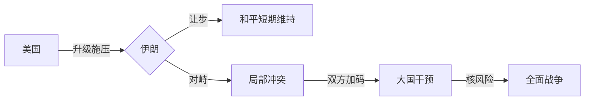

> [!summary] 核心摘要
> 本文从[[博弈论]]视角解读美伊冲突背后的战略逻辑，认为中东战争并非特朗普个人决策，而是美国维护全球帝国的长远布局。通过分析近期油轮袭击、海上封锁、伊朗港口建设等事件，阐释美国遏制中国海上贸易、控制能源通道的战略意图，并预言战争将逐步升级。

---

## 近期关键事件

### 1. 美伊停火谈判

- 已实施两周的停火协议即将到期。
- 美国代表团前往[[阿曼]]谈判可能的和平条约。
- 伊朗态度不明，可能参与也可能拒绝。
- 舆论普遍认为停火难以持久，战争不会就此结束。

> [!warning] 误区
> 许多人以为这场战争源于特朗普的个人好恶，但这是一种误解。实际背后有更深的战略动机。

### 2. 全球炼油厂连环火灾

- 过去45天内，全球超过50座炼油厂发生火灾或被毁。
- 案例：
  - 俄罗斯最大炼油厂遭袭。
  - 缅甸10艘油轮被烧毁。
- 原因不明，但发生时间与中东冲突升级高度重叠。

### 3. 美国对伊朗的海上封锁与登船

- 停火期间，美国单方面对伊朗实施[[海上封锁]]。
- 美军强行登上并控制了一艘从中国返回的伊朗船只。
- 相关视频显示印度船只首先拦截，随后美军接管。

> [!tip] 观察点
> 这些事件并非孤立，它们共同指向一个更宏大的战略——切断中国的能源与贸易通道。

---

## 战略逻辑：美国为何必须开战？

### 帝国的地理核心

- 美国作为[[海洋帝国]]，其全球影响力建立在三个关键海上通道上：
  1. [[苏伊士运河]]
  2. [[巴拿马运河]]
  3. [[霍尔木兹海峡]]

- 霍尔木兹海峡附近正在崛起一个中国的海军基地——即伊朗的[[恰巴哈尔港]]。
- 该港口由中国投资建设，直通[[中亚五斯坦]]和[[阿富汗]]，构成“一带一路”的关键节点。

### 恰巴哈尔港的战略价值

- 它是伊朗唯一的深水港，位于霍尔木兹海峡外围。
- 中国可通过该港口将货物直接运往伊朗，再经陆路进入中亚，完全绕过海运瓶颈。
- 对海洋帝国而言，这种陆海联运通道直接威胁其海权优势。

| 通道类型     | 代表路线               | 帝国控制力 |
|--------------|------------------------|------------|
| 纯海运       | 马六甲海峡、苏伊士运河 | 高         |
| 海陆联运     | 恰巴哈尔港→中亚铁路    | 低         |
| 纯陆路       | 中欧班列               | 极低       |

### 战争的触发条件

- 伊朗正在建设连接恰巴哈尔港与中亚的铁路网。
- 一旦铁路完工，美国将失去对中西亚贸易流的控制。
- 因此，美国必须在铁路通车前发动战争，打断该进程。

> [!summary] 核心博弈
> 美国的目标不是伊朗本身，而是通过打击伊朗来阻断中国海陆联动的出口，维护其海洋霸权。

---

## 战争进程推演

### 第一阶段：海上打击与封锁

- 美国已对伊朗实施事实上的[[禁飞区]]与海上封锁。
- 下一步可能扩大空袭范围，摧毁伊朗的港口设施和铁路节点。

### 第二阶段：伊朗的反制

- 伊朗可能利用[[中程弹道导弹]]和无人机打击美国在伊拉克、科威特等地的基地。
- 存在扩散风险，黎巴嫩[[真主党]]、也门[[胡塞武装]]可能协同行动。

### 第三阶段：大国介入

- 如果局势升级，中国和俄罗斯可能以护航为由派遣海军。
- 这将形成美、中、俄三方在海上的直接对峙，彻底改变博弈格局。

---

## 博弈模型：胆小鬼游戏

- 当前处于典型的[[胆小鬼游戏]]（Chicken Game）中。
- 双方都试图展示不退让的决心，逼迫对方首先退缩。
- 但核心变量是铁路进度——时间不在美国这边。

> [!warning] 核边缘风险
> 若美国威胁到伊朗政权生存，伊朗可能加速核武研发，引发[[以色列]]先发制人打击，将冲突推向核门槛。

---

## 对全球的影响

- 能源价格剧烈波动，全球供应链进一步碎片化。
- 印度、欧洲等能源进口方被迫选边站队。
- 全球海运保险费用飙升，促使更多货物转向中欧班列。

> [!tip] 长期趋势
> 无论战争结果如何，这场冲突将加速世界从“海运单极”向“海陆双轨”秩序的转型。

---

## 关联概念

- [[海洋帝国]]
- [[霍尔木兹海峡]]
- [[恰巴哈尔港]]
- [[一带一路]]
- [[胆小鬼游戏]]

- [[封锁与反封锁]]

---

## 延伸思考

1. 为什么美国不能容忍一条海陆联运通道？
2. 中国能否通过外交手段延迟战争爆发？
3. 如果战争陷入僵局，哪一方更有动机升级？

---

> [!summary] 结论
> 美伊之战是海权与陆权博弈的又一例证。表面上是核问题与地区安全，实则是美国为阻止中国西向通道而发动的预防性战争。只要恰巴哈尔铁路未完工，战争的风险就持续存在。