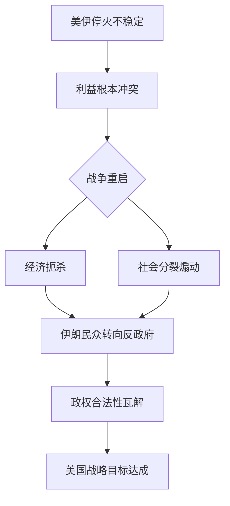

> [!summary] 摘要
> 本文从[[博弈论]]视角剖析战争形态的历史演进：从消灭士兵的古典战役，到20世纪摧毁工业与平民的总体战，再至21世纪借 [[核武器]] 威慑与[[经济]]破坏煽动内部反叛的新范式。核心论点是 **美伊冲突将成为21世纪首场新型战争** —— 不以占领土地或屠杀取胜，而以[[经济]]扼杀与社会分裂逼迫民众反对本国政府。

## 战争演进的三个阶段

### 1. 古典战争：消灭有生力量
- **目标**：通过正面战场大量杀伤敌军士兵，瓦解对方战斗能力。
- **方式**：两军在特定战场交锋，胜负往往决定战争结局。
- **持续时长**：数千年的主流模式。

> [!important] 核心转变
> 20世纪以前，国家无法迅速补充百万级兵员，因此战场胜利即战争胜利。

### 2. 20世纪总体战：摧毁制造能力
- **背景**：[[民族国家]] 拥有了动员数百万[[人口]]的工业体系，能不断向前线输送新兵。
- **新目标**：必须摧毁国家的**生产与制造能力**，而非仅杀伤前线士兵。
- **手段**：大规模轰炸城市、工厂，直接以平民为打击对象（如二战战略轰炸）。
- **特征**：战争从 “军队对军队” 变为 “社会对社会”。

| 对比维度 | 古典战争 | 20世纪总体战 |
|----------|----------|---------------|
| 首要目标 | 消灭士兵 | 摧毁工厂与平民 |
| 战场范围 | 战场 | 全国领土 |
| 胜负关键 | 单场会战 | 持续生产与意志 |
| 典型案例 | 古代帝国战役 | 第二次世界大战 |

### 3. 21世纪新战争：利用人口对抗国家
- **制约因素**：
  - [[核武器]] 的存在使全面军事摧毁不可行 —— 一旦使用，对方也会报复。
  - [[人口]]规模极大，无法简单屠杀所有人。
- **新范式**：
  - **核心手段**：[[经济]]破坏（[[经济制裁]]、封锁）与战略信息煽动，在敌国社会内部 **播下分歧与不满**。
  - **目标**：让普通民众转向反对自己的政府，从内部瓦解国家。
  - **本质**：战争不再是摧毁硬件，而是操控人心、瓦解[[政治]]合法性。

> [!warning] 注意
> 21世纪战争不再需要占领或摧毁整个国家，只需通过[[经济]]扼杀和制造社会撕裂，就能使政权丧失统治基础。

## 美伊战争：21世纪第一场新形态战争

- **当前态势**：美伊之间虽达成停火，但多数分析预计将在数周至一月内重启。
- **根源**：双方**无法达成互利的持久协议** —— 利益结构根本冲突。
- **战争形态预演**：
  - 美国不会发动全面入侵或核打击。
  - 将通过[[经济制裁]]、金融封锁、网络行动以及煽动伊朗内部的社会矛盾，迫使民众对政权施压或反叛。
- **博弈本质**：这是一场 “用社会对抗国家” 的非对称冲突。

> [!tip] 关键洞察
> 21 世纪的大国冲突不再以战场胜败为终点，而是比拼**社会韧性**与**信息塑造能力**。

## 关联概念

- [[民族国家]] — 战争演变的制度载体
- [[总体战]] — 20世纪战争特征
- [[核威慑]] — 制约大规模军事行动的因素
- [[经济制裁]] — 21世纪战争的核心武器
- [[社会分裂]] — 新型战争的战场景象

- [[非对称冲突]] — 美伊对抗的结构特征

## 常见误解

> [!warning] 误区
> **“现代战争仍以消灭敌人军队为主”**  
> 实际上，21世纪正规国家间的冲突倾向于绕开直接军事对抗，优先使用[[经济]]胁迫与社会瓦解手段。伊朗局势正是这一逻辑的体现。

## 结语

战争从 **“杀士兵”** 到 **“杀平民”**，再到 **“让平民杀政府”**。  
如果你理解了这一脉络，就能看清美伊停火背后的必然破裂，以及未来大国冲突的真正面貌。