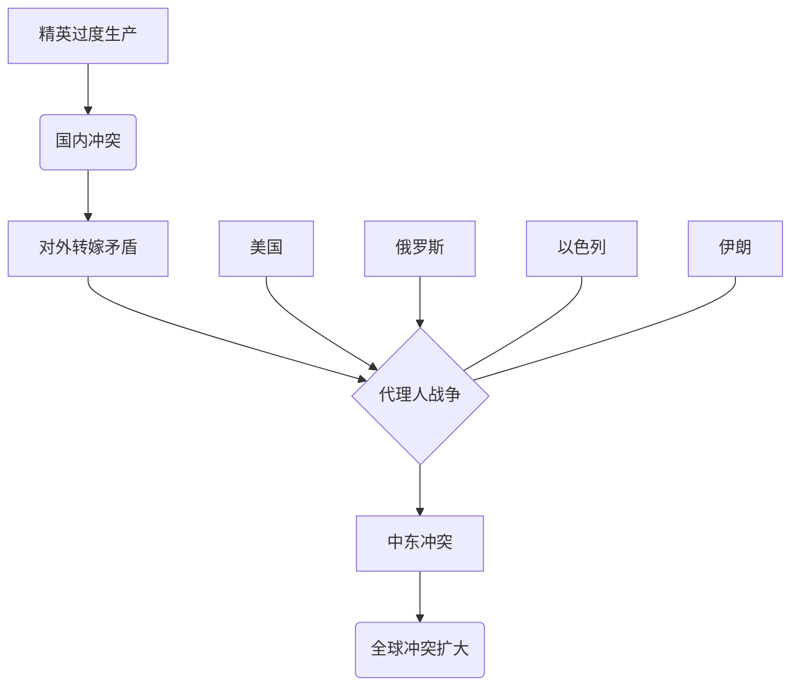

> [!summary] 摘要
> 本文从[[博弈论]]视角分析，核心论点是第三次世界大战已以代理人战争形式在中东展开，主要[[玩家]]为 [[美国]] 与 [[俄罗斯]]。冲突不仅源于国家间博弈，更深层动力来自各国国内 [[精英过度生产]]（Elite Overproduction）引发的内部紧张。理解各方战略，就能预测其行为。

---

## 博弈棋盘与主要玩家

当前全球冲突可视为一场多层次的博弈。两大主要[[玩家]]是美国与俄罗斯，它们正通过中东的代理人战争进行对抗：

- **美国** 支持 [[以色列]]
- **俄罗斯** 支持 [[伊朗]]

这场冲突不会局限于中东，而是会逐步扩大，最终席卷全球。

### 四个核心国家

| 国家 | 支持方 | 角色 |
|------|--------|------|
| [[美国]] | — | 主要[[玩家]]，全球霸权维护者 |
| [[以色列]] | 美国 | 中东代理人，触发点 |
| [[伊朗]] | 俄罗斯 | 中东代理人，抵抗轴心 |
| [[俄罗斯]] | — | 主要[[玩家]]，现行秩序挑战者 |

---

## 冲突的两层驱动力

> [!warning] 常见误区
> 许多人误以为战争是暂时的，一旦特朗普离任或美国与[[以色列]]疏远，和平就会到来。**事实并非如此。**

冲突由两层力量驱动：

1. **国家间矛盾**：四个国家之间的战略对抗
2. **内部矛盾**：各国内部的 [[精英过度生产]]

### 精英过度生产
内部动力来自 [[精英]] 作为 [[食利者]]（Parasites）榨取民众租金的体系。太多人试图挤进精英阶层，导致激烈竞争，这种内部冲突正在全球蔓延。

> [!tip] 关键洞察
> 第三次世界大战不仅是国家间的对抗，更是由 **国内精英竞争** 这只看不见的手推动的。

---

## 关联概念

- [[博弈论]]（Game Theory）
- [[代理人战争]]（Proxy War）
- [[精英循环]]（Elite Circulation）
- [[地缘政治]]（Geopolitics）
- [[三战叙事]]（WWIII Narrative）

---

## 驱动力关系图

---

## 后续推演与博弈策略

本课程后续七讲将分析各方战略，并基于博弈逻辑做出行为预测。一旦理解各[[玩家]]的战略，预测其行为将变得相对容易。

> [!example] 思考题
> 如果精英过度生产是冲突的深层内因，那么单单调整外交关系（如美以脱钩）是否能终止战争？为什么？

---

## 词汇表

- **Elite Overproduction**：精英过度生产，指精英岗位的候选人数量远超实际需求，导致内部权力斗争激化。
- **Rent-seeking**：食利行为，通过控制资源或权力获取超额收益，而非创造价值。

> [!warning] 注意
> 原始讲义在此处有省略，后续课程内容未完整提供。本文重构基于现有片段，保持原有信息不丢失。