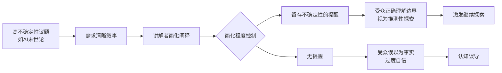

## 授课中的简化与严谨：对“AI 末世论”讨论的元反思

> [!summary] 摘要
> 本文从[[博弈论]]视角分析，由著名学者 David Bramitch 提出对“追求清晰导致过度简化”的善意提醒。内容围绕 **[[简化主义]]** 在知识传播中的风险、**[[学术严谨性]]** 与直觉探索的边界，以及对 **[[AI 末世预言]]** 类宏大主题进行通俗讲解时的自我警醒。全文保留了原始对话的坦率与自省，适合长期查阅以警示思想传播者。

## 定义

- **[[简明解释]]**：通过省略细节、强调主线获得高度可理解的叙事。
- **[[过度简化]]**：省略关键约束和不确定性的简化，可能演变为误导。
- **[[学术严谨性]]**：对证据、边界条件和保留意见的充分交代，即便牺牲部分清晰度。
- **[[直觉驱动探索]]**：以想象和直觉推演替代系统考察的思考方式，常见于跨领域推测性讲座。

## 核心解释

David Bramitch 在邮件中提出了一个结构性的警告：  
视频因快速、自信、高度简化的表达而受欢迎，提供了不确定时代难得的确定性。  
但 **观众很难自行识别这是简化后的叙事**，除非讲解者主动、频繁地提醒边界。

> [!warning] 误区
> 自信的语调和高明氏度的表达往往被观众等同于“事实”，而忽略了阐释中的大量个人解读与猜测。

这种简化的吸引力在于 **认知上的确定性供给** —— 尤其在讨论如 [[AI 末世论]] 这种高度不确定、低共识议题时，听众渴望一个清晰的叙事框架。

> [!tip] 传播责任
> 讲解者有义务 **周期性给出“简化提醒”**，明确区分哪些属于已有共识、哪些属于个人推测或直觉推演。

授课者回应了这封邮件，坦承：
- 本课程本质上是 **[[试探性理智探险]]** ，大量内容基于直觉与想象，并非成熟学术成果。
- 在讲述 [[德国浪漫主义]] 的历史观念流变时，已多次使用了类似简化手法。
- 这是 **对本身不清晰议题的“清晰化显影”**，必须保持清醒：清晰≠真实。

## 示例（来自原始对话）

> [!example] David 的原始提醒
> “你表达的推进速度很快，带着令人满意的确定性，说了许多怯懦者避而不谈的真话。风险在于简化，你的观众很难自行识别这一点——除非你偶尔给出明确提醒。”

> [!example] 授课者的自省
> “我时常提醒大家，这只是我在直觉和想象基础上的即兴推演……很有意思，但不是学术研究。David Bramitch 是美国最伟大的学者之一，他的提醒我们必须认真对待。”

## 关联概念

- [[思想的简化主义]] —— 理解思想史与哲学时，高压缩叙事如何改变原意
- [[解释的清晰度与真实性的权衡]] —— 知识传播中的经典矛盾
- [[AI 末日情节]] —— [[博弈论]]与超级智能风险推测中的叙事陷阱
- [[大卫·布拉马奇]] —— 当代美国重要思想史学者，强调语境化严谨
- [[浪漫主义的叙事建构]] —— 思想史叙述中不可避免的个人解读

## 关系图（Mermaid）

## 相关问题

- 在讲解 [[博弈论]] 预测 AI 未来时，如何区分“策略博弈的推演”与“确定性预言”？
- 过度简化是否可能造成 **[[公共话语的伪清晰性]]**，进而影响政策制定？
- 作为知识的生产者，如何平衡 **[[认知吸引力]]** 与 **[[智识诚实]]**？

> [!warning] 长期警醒
> 本页内容本身亦是对原始视频的二次整理，仍需读者注意：整理过程中可能再次引入新的简化。请保留自行回溯原始材料的习惯。