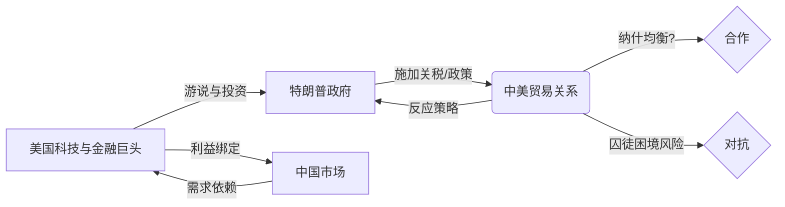

> [!summary] 摘要
> 2025年特朗普访华，带来了家族成员及美国顶级商业领袖，总企业价值超 12 万亿美元。上一次美国总统访华并随后引发[[中美贸易战]]的历史表明，此次会面可能成为两国博弈的新节点。本文从[[博弈论]]视角分析随行高管构成与潜在谈判信号，并构建中美策略博弈的简单模型。

## 历史背景：2017年访华与贸易战开端

特朗普此次访华是九年来美国总统首次到访。  
2017年11月，特朗普访问北京后不久，美国便发动了[[中美贸易战]]，双方陷入长达数年的关税与谈判循环。

从[[博弈论]]角度看，那次访问后的决策可以看作一方突然改变了合作策略，导致了**囚徒困境**式的长期对峙。

> [!warning] 历史警示
> 上一次领导人会晤后并非走向合作，而是迅速升级为贸易摩擦。此次会面需警惕“承诺不可信”与“时机选择”的博弈陷阱。

## 特朗普代表团构成分析

### 1. 家族成员
随行家人包括：
- 次子埃里克·特朗普（Eric Trump）
- 儿媳拉拉·特朗普（Lara Trump）

他们的出现更多传递个人关系与长期承诺的信号，在国际谈判中可视为“信任抵押”。

### 2. 科技与制造巨头
| 人物 | 公司 | 在华利益 |
|------|------|-----------|
| 埃隆·马斯克 | [[特斯拉]] | 上海超级工厂及庞大市场 |
| 蒂姆·库克 | [[苹果]] | 供应链与消费者市场 |
| （波音代表） | [[波音]] | 争取与中国航司的500亿美元订单 |

这些企业的在华深度嵌入，使它们天然偏好合作均衡，有利于推动谈判走向互利。

### 3. 金融核心圈
随行金融领袖来自：
- [[黑岩集团]]（Larry Fink）
- [[黑石集团]]（Stephen Schwarzman）
- [[高盛]]（David Solomon）
- [[花旗集团]]
- [[万事达卡]] 与 [[Visa]]

这些机构掌握着全球资本配置。  
> [!tip] 关键信号
> 上述人物日常极难同时出现在同一场合，本次集体随行表明美国商界对此次谈判结果的极高期望，也在无形中向中方施加“全押”的压力。

## 博弈论视角：从囚徒困境到信号传递

中美贸易关系可简化为以下收益矩阵：

| 中国 \ 美国 | 合作  | 对抗 |
|------------|-------|------|
| 合作        | (5,5) | (0,8)|
| 对抗        | (8,0) | (1,1)|

> 数字代表收益，合作-合作是集体最优，但单边对抗收益高，导致[[囚徒困境]]。

此次众多高管的到来，可看作一种**昂贵信号**：美国企业界向中方展示“我们在合作均衡中的沉没成本极高”，从而增强承诺的可信性，试图将博弈推向（合作，合作）的[[纳什均衡]]。

> [!example] 信号解读
> - 如果谈判失败，这些企业的股价和市场份额将受损，因此它们会极力促成协议。
> - 特朗普带着“12万亿美元”的商业团队，相当于向中方传递：“我难以再轻易发动全面贸易战”，这是一种自我约束的信号。

## 博弈关系图

## 预期与展望

本次随行团队的构成比以往更侧重于金融与技术领域，反映出谈判议题可能不再局限于传统贸易逆差，而是扩展到：
- 技术标准与市场准入
- 金融开放与投资保护
- 供应链安全

在[[博弈论]]的框架下，只要双方能够建立有效的**承诺机制**与**信号传递**，就有望跳出重复的囚徒困境，形成长期稳定的合作均衡。

> [!summary] 总结
> 特朗普访华不仅是外交事件，更是一场精心设计的博弈信号释放。解析随员名单，就是在解读美方谈判的底线与要价。用[[博弈论]]之眼，看清大棋局。