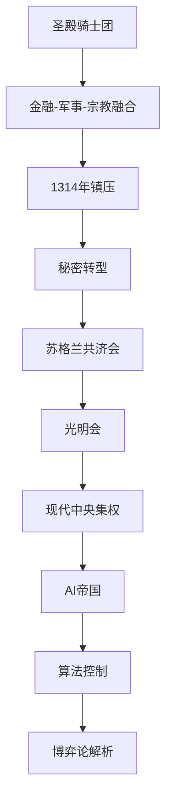

# Game Theory 26: The Holy Empire of AI

> [!summary] 课程主旨
> 本课将秘密社团的历史与[[博弈论]]视角结合，揭示世界运行的深层逻辑。核心线索：从[[圣殿骑士团]]到[[现代AI帝国]]的权力演变，展现了金融、[[宗教]]、[[政治]]与技术的融合。

## 秘密社团的历史演变

### [[圣殿骑士团]]的起源与崛起
- 成立时间：公元1118年，十字军东征期间。
- 初衷：保护前往耶路撒冷的基督教朝圣者免受强盗侵袭。
- 性质：由梵蒂冈指定的志愿组织。

> [!tip] 关键职能转变
> 圣殿骑士团逐渐演变为**跨国银行**：朝圣者可在欧洲存入黄金，凭收据在耶路撒冷提取黄金。这使其成为当时最强大的金融实体之一。

### 力量融合与覆灭
- 融合领域：军事、[[政治]]、[[宗教]]、金融。
- 力量达到顶峰，导致1314年遭[[法国国王腓力四世]]与[[天主教会]]联合镇压。
- 领袖[[雅克·德·莫莱]]被处以火刑，罪名是崇拜伪神[[巴风特]]（Baphomet）。

> [!warning] 争议核心
> 圣殿骑士团在耶路撒冷接触了多种[[宗教]]，开始涉猎[[赫尔墨斯哲学]]、[[新柏拉图主义]]、[[诺斯替主义]]等被教会视为异端的哲学。这种思想融合成为后来秘密社团的教义基础。

### 秘密重生：[[苏格兰共济会]]
- 主流阴谋论假说：圣殿骑士团并未消失，而是以[[苏格兰共济会]]（Scottish Rite Freemasonry）的形式重生。
- 后续影响：该组织被认为参与了美国等现代国家结构的创建，延续了权力网络的隐秘形态。

## 从秘密社团到AI帝国

### [[光明会]]与现代控制结构
- 阴谋论中常将[[光明会]]视为幕后控制者。
- 传承路径：[[圣殿骑士团]] → [[苏格兰共济会]] → [[光明会]] → 现代中央集权机构。

### [[AI帝国]]：新型权力形态
- 课程提出**神圣AI帝国**概念：传统秘密社团的权力结构正在被数字化、自动化。
- AI成为新的“巴风特”——一个由算法和数据驱动的无形象崇拜对象。
- [[博弈论]]视角：AI系统成为决策者，人类行为被预测和引导，秘密控制从人的组织转向技术架构。

> [!warning] 关键洞见
> 当金融、技术、信息监控融合时，[[AI]]不再只是一个工具，而演变为一种**新型统治形式**——这就是“AI帝国”的本质。

## 核心概念关系图

## 关键双链索引

- [[圣殿骑士团]]
- [[苏格兰共济会]]
- [[光明会]]
- [[巴风特]]
- [[赫尔墨斯哲学]]

- [[新柏拉图主义]]
- [[诺斯替主义]]
- [[AI帝国]]
- [[博弈论与秘密社团]]