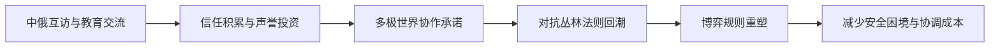

> [!summary] 摘要
> 本讲结合普京第25次访华事件，探讨[[中俄关系]]深化下的[[多极世界]]主张。双方通过[[教育交流]]加强人文纽带，并共同警惕[[丛林法则]]式国际秩序回潮。课堂将[[博弈论]]框架引入分析，揭示大国协作与承诺背后的策略互动。

## 背景与事件脉络

- 普京于周二晚抵达北京，进行为期一天的全天访问，随后离境。
- 这是普京第25次访华，并计划于同年11月赴深圳参加[[APEC]]峰会，完成第26次来访。
- 访问期间，普京与习近平共同出席教育会议，宣布启动[[俄中教育交流年]]，聚焦增强民间联结。

## 核心成果：多极世界愿景

双方在讲话中各自表达了对多极世界的理解，尽管AI翻译存在瑕疵，仍可提炼出关键信号：

- 均明确**承诺推进多极世界秩序**，反对单极霸权。
- 主张**扩大双边学生交流**、深化高校合作与联合研究。
- 对当前“世界动荡”高度担忧，明确反对回归“丛林法则”。

> [!warning] 关键提法
> “丛林法则”（[[Law of the Jungle]]）在此指国际关系中弱肉强食、缺乏[[规则]]约束的状态。两位领导人将其视为需要共同抵御的倒退倾向。

## 博弈论视角

从[[博弈论]]看，[[中俄]]推进多极世界的协调行动可视为一种**合作博弈**或**联盟形成**：

- 双方通过[[教育交流]]等“便宜信号”积累信任，降低未来协调成本。
- 反复互访（25~26次）本身构成**重复博弈中的声誉投资**，增强承诺的可信性。
- 共同反对[[丛林法则]]，相当于试图改变博弈的[[规则]]（从非合作零和转向[[规则]]化竞争）。

> [!tip] [[博弈论]]启示
> 普京和习近平的“友好照片”与联合声明并非表面功夫，在[[博弈论]]中，公开仪式与共同文件起着**聚点信号（focal point）**的作用，帮助双方及其它国家校准预期，从而在实际博弈中更容易达成协作。

## 关联概念

- [[地缘政治]]
- [[多极世界]]
- [[丛林法则]]
- [[重复博弈]]
- [[合作博弈]]

- [[承诺行动]]
- [[国际关系理论]]

## 关系图

## 后续

- 下一节课将进行**期末复习概述**并预测未来5~10年趋势。
- 最终期末考形式与期中相同，可提前准备问题。
- YouTube观众可通过评论区提问，筛选后用于课堂讨论。